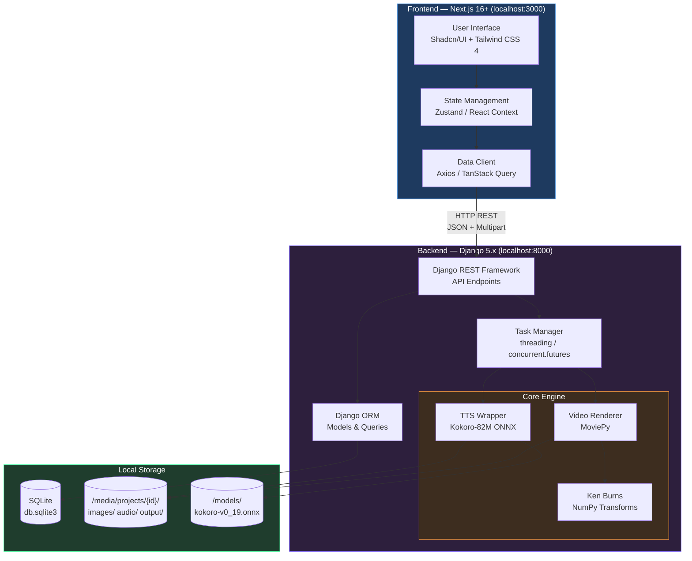
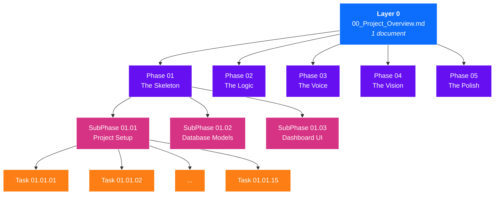
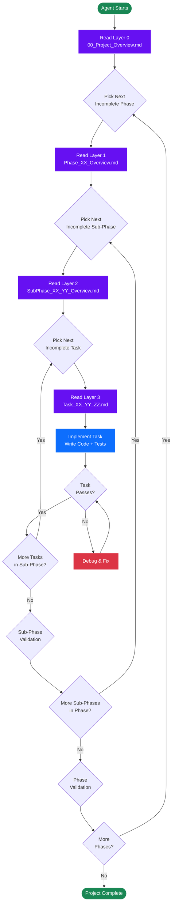

# StoryFlow — Semi-Automated Narrative Video Engine

## Project Overview & Master Document

---

| Field              | Value                                              |
| ------------------ | -------------------------------------------------- |
| **Project Name**   | StoryFlow — Semi-Automated Narrative Video Engine   |
| **Version**        | 1.0.0                                              |
| **Document Type**  | Layer 0 — Top-Level Project Overview (DDD Master)  |
| **Status**         | Draft / Blueprint                                  |
| **Created**        | 2026-02-16                                         |
| **Last Updated**   | 2026-02-16                                         |
| **Architecture**   | Monolithic Local Web Application                   |
| **Methodology**    | Document-Driven Development (DDD) with Agentic AI  |

---

## Table of Contents

- [StoryFlow — Semi-Automated Narrative Video Engine](#storyflow--semi-automated-narrative-video-engine)
  - [Project Overview \& Master Document](#project-overview--master-document)
  - [Table of Contents](#table-of-contents)
  - [1. Project Vision \& Executive Summary](#1-project-vision--executive-summary)
    - [1.1 What Is StoryFlow?](#11-what-is-storyflow)
    - [1.2 Why Does StoryFlow Exist?](#12-why-does-storyflow-exist)
    - [1.3 Target Audience](#13-target-audience)
    - [1.4 Core Design Principles](#14-core-design-principles)
  - [2. Core Architecture Overview](#2-core-architecture-overview)
    - [2.1 System Design Philosophy](#21-system-design-philosophy)
    - [2.2 Technology Stack Summary](#22-technology-stack-summary)
    - [2.3 System Architecture Diagram](#23-system-architecture-diagram)
  - [3. Data Architecture Summary](#3-data-architecture-summary)
    - [3.1 Database Choice Rationale](#31-database-choice-rationale)
    - [3.2 Core Models](#32-core-models)
      - [3.2.1 `Project`](#321-project)
      - [3.2.2 `Segment`](#322-segment)
      - [3.2.3 `GlobalSettings`](#323-globalsettings)
    - [3.3 Model Relationships](#33-model-relationships)
  - [4. System Directory Structure](#4-system-directory-structure)
  - [5. Key Module Descriptions](#5-key-module-descriptions)
    - [5.1 Import \& Parse Module](#51-import--parse-module)
    - [5.2 Timeline Editor Module (Frontend)](#52-timeline-editor-module-frontend)
    - [5.3 TTS Generation Module (Backend)](#53-tts-generation-module-backend)
    - [5.4 Video Rendering Module (The Core)](#54-video-rendering-module-the-core)
    - [5.5 Ken Burns Effect Algorithm](#55-ken-burns-effect-algorithm)
  - [6. API Surface Overview](#6-api-surface-overview)
  - [7. Document-Driven Development (DDD) Methodology](#7-document-driven-development-ddd-methodology)
    - [7.1 What Is DDD?](#71-what-is-ddd)
    - [7.2 Why DDD with Agentic AI?](#72-why-ddd-with-agentic-ai)
    - [7.3 How the Layered Documents Work](#73-how-the-layered-documents-work)
  - [8. Document Series Architecture](#8-document-series-architecture)
    - [8.1 Full Hierarchy Diagram](#81-full-hierarchy-diagram)
    - [8.2 Document Counts per Level](#82-document-counts-per-level)
    - [8.3 Document Hierarchy — Mermaid Diagram](#83-document-hierarchy--mermaid-diagram)
  - [9. Document Naming Conventions](#9-document-naming-conventions)
    - [9.1 Folder Naming Rules](#91-folder-naming-rules)
    - [9.2 File Naming Rules](#92-file-naming-rules)
    - [9.3 Full Naming Examples](#93-full-naming-examples)
  - [10. How to Use This Document Series (For AI Agents)](#10-how-to-use-this-document-series-for-ai-agents)
    - [10.1 Step-by-Step Navigation Protocol](#101-step-by-step-navigation-protocol)
    - [10.2 Context Cascade Rules](#102-context-cascade-rules)
    - [10.3 AI Agent Workflow Diagram](#103-ai-agent-workflow-diagram)
  - [11. Phase Breakdown Summary](#11-phase-breakdown-summary)
    - [11.1 Phase 1 — The Skeleton](#111-phase-1--the-skeleton)
    - [11.2 Phase 2 — The Logic](#112-phase-2--the-logic)
    - [11.3 Phase 3 — The Voice](#113-phase-3--the-voice)
    - [11.4 Phase 4 — The Vision](#114-phase-4--the-vision)
    - [11.5 Phase 5 — The Polish](#115-phase-5--the-polish)
  - [12. Sub-Phase Structure Template](#12-sub-phase-structure-template)
  - [13. Task Document Template](#13-task-document-template)
  - [14. Development Guidelines \& Constraints](#14-development-guidelines--constraints)
    - [14.1 Environment Constraints](#141-environment-constraints)
    - [14.2 Privacy \& Data Constraints](#142-privacy--data-constraints)
    - [14.3 Code Constraints](#143-code-constraints)
    - [14.4 Architectural Constraints](#144-architectural-constraints)
  - [15. Quality Standards](#15-quality-standards)
    - [15.1 Code Quality](#151-code-quality)
    - [15.2 Testing Expectations](#152-testing-expectations)
    - [15.3 Documentation Standards](#153-documentation-standards)
  - [16. Glossary](#16-glossary)

---

## 1. Project Vision & Executive Summary

### 1.1 What Is StoryFlow?

StoryFlow is a **local, full-stack web application** purpose-built to streamline the end-to-end production of **"faceless" narrative videos** — the kind of short- to mid-form content widely published on YouTube, Facebook, TikTok, and Instagram Reels. These videos combine compelling narration, curated imagery, cinematic motion effects, and synchronized subtitles — all assembled without ever showing a human face on camera.

StoryFlow is **not** a cloud service. It runs entirely on the user's machine, leverages their local GPU/CPU for AI inference and video rendering, and stores every asset on the local filesystem. It is, by design, a **zero-cost, privacy-first creative tool**.

### 1.2 Why Does StoryFlow Exist?

Producing faceless narrative videos today is a **tedious, manual, multi-tool process**. A typical creator must:

1. Write a script or break a story into segments.
2. Generate AI imagery for each segment (using Midjourney, DALL-E, Stable Diffusion, etc.).
3. Generate voiceover for each segment (using ElevenLabs, PlayHT, or local TTS).
4. Import everything into a video editor (Premiere Pro, DaVinci Resolve, CapCut).
5. Manually align audio to images, apply Ken Burns effects, add subtitles, tweak timing.
6. Export the final video.

Steps 3–6 are **mechanical, repetitive, and automatable**. StoryFlow exists to collapse those steps into a single, streamlined workflow. The creator focuses on the **creative decisions** (writing, imagery curation) while StoryFlow handles the **assembly pipeline** automatically.

### 1.3 Target Audience

| Audience                      | Description                                                                 |
| ----------------------------- | --------------------------------------------------------------------------- |
| Solo Content Creators         | YouTubers and social media publishers producing narrative/educational content |
| Hobbyist Storytellers         | Writers who want to transform stories into video without editing skills      |
| AI Art Enthusiasts            | Users already generating AI images who want a fast video assembly pipeline   |
| Privacy-Conscious Creators    | Users who refuse to upload content to cloud-based editing platforms           |
| Developers & Tinkerers        | Engineers who want a hackable, local-first video production tool             |

### 1.4 Core Design Principles

1. **Human-in-the-Loop** — The user always retains creative control. AI generates assets; the human curates, approves, and refines.
2. **Local-First** — All processing happens on the user's machine. No cloud dependencies for core functionality.
3. **Zero External API Cost** — TTS, rendering, and effects are entirely local. No per-minute charges, no API keys required for assembly.
4. **Privacy by Architecture** — No data leaves the machine. Scripts, images, and audio stay on the local filesystem.
5. **Simplicity Over Scalability** — This is a single-user desktop tool, not a SaaS platform. Architecture choices favor simplicity (SQLite over Postgres, threads over Celery, filesystem over S3).

---

## 2. Core Architecture Overview

### 2.1 System Design Philosophy

StoryFlow is a **monolithic local web application** with a clean two-tier architecture:

- **Frontend** — A Next.js single-page application running on `localhost:3000`. Handles all user interaction: project management, timeline editing, image uploading, audio preview, and render triggering.
- **Backend** — A Django REST API running on `localhost:8000`. Handles data persistence, TTS inference, video rendering, and file management.

There is **no** container orchestration (Docker), **no** message broker (Redis/RabbitMQ), and **no** task queue (Celery). Background tasks (TTS generation, video rendering) are managed using Python's native `threading` and `concurrent.futures` modules. This keeps the stack lean, portable, and easy to set up on any development machine.

**Key architectural constraint:** The frontend and backend communicate exclusively over HTTP REST. The frontend NEVER accesses the filesystem directly. All file operations (image upload, audio retrieval, video download) go through the Django API and its media serving configuration.

### 2.2 Technology Stack Summary

| Layer                | Technology                                      | Purpose                                          |
| -------------------- | ----------------------------------------------- | ------------------------------------------------ |
| **Frontend Framework** | Next.js 16+ (App Router)                       | UI shell, routing, server components             |
| **Frontend Language** | TypeScript (Strict Mode)                        | Type safety across all frontend code             |
| **Styling**          | Tailwind CSS 4                                  | Utility-first responsive styling                 |
| **UI Components**    | Shadcn/UI (Radix Primitives)                    | Accessible dialogs, sliders, dropdowns, cards    |
| **State Management** | Zustand or React Context API                    | Active project state, UI state                   |
| **Data Fetching**    | Axios or TanStack Query                         | HTTP client for API communication                |
| **Backend Framework** | Django 5.x                                     | API routing, ORM, admin, file serving            |
| **API Layer**        | Django REST Framework (DRF)                     | Serializers, viewsets, endpoint scaffolding       |
| **Database**         | SQLite                                          | Local relational storage, zero-config            |
| **Task Management**  | Python `threading` / `concurrent.futures`       | Background TTS and rendering jobs                |
| **TTS Engine**       | Kokoro-82M (ONNX Runtime)                       | Local neural text-to-speech synthesis            |
| **TTS Fallback**     | Fish Speech                                     | Secondary TTS option if configured               |
| **Video Engine**     | MoviePy 1.0.3 or 2.0                            | Clip assembly, concatenation, transitions, export |
| **Image Processing** | Pillow (PIL)                                    | Image resizing, cropping, format conversion      |
| **Math / Arrays**    | NumPy                                           | Matrix operations for Ken Burns transforms       |
| **Audio I/O**        | soundfile, numpy                                | WAV file writing and metadata extraction         |
| **AI Runtime**       | ONNX Runtime                                    | High-performance model inference                 |

### 2.3 System Architecture Diagram



---

## 3. Data Architecture Summary

### 3.1 Database Choice Rationale

**SQLite** is chosen deliberately over PostgreSQL or MySQL for the following reasons:

- **Zero configuration** — No database server to install, configure, or maintain.
- **Single-file portability** — The entire database is a single `db.sqlite3` file that can be backed up by copying.
- **Single-user workload** — StoryFlow is a local, single-user application. SQLite handles single-writer workloads excellently.
- **Django native support** — SQLite is Django's default database and requires no additional drivers or configuration.
- **Sufficient performance** — A typical StoryFlow project has 10–50 segments. SQLite handles this with negligible overhead.

### 3.2 Core Models

#### 3.2.1 `Project`

The top-level container representing a single video production.

| Field              | Type          | Default      | Description                                      |
| ------------------ | ------------- | ------------ | ------------------------------------------------ |
| `id`               | UUID          | Auto         | Primary key                                      |
| `title`            | CharField(200)| —            | Human-readable project name                      |
| `created_at`       | DateTimeField | Auto         | Creation timestamp                               |
| `updated_at`       | DateTimeField | Auto         | Last modification timestamp                      |
| `status`           | CharField     | `DRAFT`      | Enum: `DRAFT`, `PROCESSING`, `COMPLETED`, `FAILED` |
| `resolution_width` | IntegerField  | `1920`       | Output video width in pixels                     |
| `resolution_height`| IntegerField  | `1080`       | Output video height in pixels                    |
| `framerate`        | IntegerField  | `30`         | Output video framerate (FPS)                     |
| `output_path`      | CharField     | —            | Path to final rendered MP4 file                  |

#### 3.2.2 `Segment`

The **atomic unit of the story**. A Project is composed of an ordered sequence of Segments. Each Segment maps to one narrated scene in the final video.

| Field             | Type          | Default | Description                                          |
| ----------------- | ------------- | ------- | ---------------------------------------------------- |
| `id`              | UUID          | Auto    | Primary key                                          |
| `project`         | ForeignKey    | —       | Link to parent `Project`                             |
| `sequence_index`  | IntegerField  | —       | Order in timeline (0, 1, 2, …)                       |
| `text_content`    | TextField     | —       | Narration script for this segment                    |
| `image_prompt`    | TextField     | —       | AI prompt used to generate the segment's image       |
| `image_file`      | ImageField    | —       | Path to the uploaded/curated image                   |
| `audio_file`      | FileField     | —       | Path to the generated `.wav` TTS audio               |
| `audio_duration`  | FloatField    | —       | Duration in seconds (auto-calculated after TTS)      |
| `is_locked`       | BooleanField  | `False` | Prevents accidental overwriting of audio/image       |

#### 3.2.3 `GlobalSettings`

Singleton configuration model for system-wide defaults.

| Field              | Type         | Default       | Description                                    |
| ------------------ | ------------ | ------------- | ---------------------------------------------- |
| `default_voice_id` | CharField   | `"af_bella"`  | Kokoro voice identifier                        |
| `tts_speed`        | FloatField  | `1.0`         | Playback speed multiplier                      |
| `zoom_intensity`   | FloatField  | `1.3`         | Ken Burns zoom factor                          |
| `subtitle_font`    | CharField   | —             | Path to `.ttf` font file                       |
| `subtitle_color`   | CharField   | `"#FFFFFF"`   | Subtitle text color (hex)                      |

### 3.3 Model Relationships

```
Project (1) ──────── (N) Segment
   │                       │
   │ has many               │ belongs to
   │ ordered by             │ sequence_index
   │ cascade delete         │
   │                       │
GlobalSettings (Singleton — system-wide, not project-scoped)
```

- A **Project** has many **Segments** (one-to-many, ordered by `sequence_index`).
- Deleting a **Project** cascade-deletes all its **Segments** and associated media files.
- **GlobalSettings** is a standalone singleton — it applies system-wide defaults across all projects.

---

## 4. System Directory Structure

The application maintains a strict folder hierarchy for code organization and local asset management.

```
/storyflow_root
│
├── /backend                          # Django project root
│   ├── /api                          # DRF app — serializers, viewsets, urls
│   │   ├── __init__.py
│   │   ├── serializers.py
│   │   ├── views.py
│   │   ├── urls.py
│   │   └── models.py                 # Project, Segment, GlobalSettings
│   │
│   ├── /core_engine                  # Processing engine — the heart of StoryFlow
│   │   ├── __init__.py
│   │   ├── tts_wrapper.py            # Kokoro-82M ONNX inference wrapper
│   │   ├── video_renderer.py         # MoviePy clip assembly & export logic
│   │   └── ken_burns.py              # NumPy-based zoom/pan transform math
│   │
│   ├── /media                        # Local asset storage (Git-ignored)
│   │   └── /projects
│   │       └── /{project_uuid}       # One folder per project
│   │           ├── /images           # User-uploaded curated images
│   │           ├── /audio            # Generated TTS .wav files
│   │           └── /output           # Final rendered video (.mp4)
│   │
│   ├── /storyflow_backend            # Django settings module
│   │   ├── __init__.py
│   │   ├── settings.py
│   │   ├── urls.py
│   │   └── wsgi.py
│   │
│   ├── manage.py
│   ├── db.sqlite3                    # SQLite database file
│   └── requirements.txt              # Python dependencies
│
├── /frontend                         # Next.js project root
│   ├── /app                          # App Router — pages and layouts
│   │   ├── layout.tsx
│   │   ├── page.tsx                  # Dashboard — project list
│   │   └── /projects
│   │       └── /[id]
│   │           └── page.tsx          # Timeline editor for a single project
│   │
│   ├── /components                   # Reusable UI components
│   │   ├── /ui                       # Shadcn/UI primitives
│   │   ├── ProjectCard.tsx
│   │   ├── SegmentCard.tsx
│   │   ├── ImageDropzone.tsx
│   │   └── AudioPlayer.tsx
│   │
│   ├── /lib                          # Utilities, API client, types
│   │   ├── api.ts                    # Axios/TanStack Query configuration
│   │   ├── types.ts                  # TypeScript interfaces
│   │   └── utils.ts                  # Helper functions
│   │
│   ├── package.json
│   ├── tsconfig.json
│   ├── tailwind.config.ts
│   └── next.config.ts
│
└── /models                           # Local AI model weights (Git-ignored)
    └── kokoro-v0_19.onnx             # Kokoro-82M ONNX model file
```

---

## 5. Key Module Descriptions

### 5.1 Import & Parse Module

**Location:** Backend (`/api/views.py`) + Frontend (project creation form)
**Purpose:** Allows the user to import a structured JSON or text block containing the story script, automatically creating a `Project` and its constituent `Segment` objects.

**Flow:** User pastes structured input → Frontend validates format → POST to backend → Backend creates `Project` + `Segment` objects → Returns `project_id` to frontend → Frontend navigates to the Timeline Editor.

### 5.2 Timeline Editor Module (Frontend)

**Location:** Frontend (`/app/projects/[id]/page.tsx`, `/components/SegmentCard.tsx`)
**Purpose:** The primary workspace. Displays all segments in a vertical scrollable timeline. Each segment card shows:

- Editable narration text
- Image dropzone (drag-and-drop upload) or image preview
- Image prompt (with copy-to-clipboard for use in external AI image generators)
- Audio playback controls (if TTS audio has been generated)
- Lock toggle to prevent accidental overwrites

**Design:** Left sidebar for project settings (voice, speed); center panel for the segment timeline.

### 5.3 TTS Generation Module (Backend)

**Location:** Backend (`/core_engine/tts_wrapper.py`)
**Purpose:** Converts `Segment.text_content` into spoken audio (`.wav`) using the Kokoro-82M model running locally via ONNX Runtime.

**Key details:**
- Model is loaded once using a **singleton pattern** to avoid repeated initialization overhead.
- Audio output is normalized for consistent volume across segments.
- Duration is calculated via `soundfile.info()` and stored in `Segment.audio_duration`.
- Fallback to Fish Speech if Kokoro is unavailable or if the user configures it.

### 5.4 Video Rendering Module (The Core)

**Location:** Backend (`/core_engine/video_renderer.py`)
**Purpose:** The heart of StoryFlow. Assembles the final video by:

1. Loading all segments ordered by `sequence_index`.
2. Validating that every segment has both `image_file` and `audio_file`.
3. Creating an `ImageClip` + `AudioClip` pair for each segment.
4. Applying Ken Burns zoom/pan effects to each image clip.
5. Synchronizing image duration to audio duration.
6. Optionally overlaying subtitles (word-chunked, bottom-center, YouTube-style).
7. Concatenating all clips with crossfade transitions.
8. Exporting to MP4 (`libx264` video, `aac` audio, `8000k` bitrate).

### 5.5 Ken Burns Effect Algorithm

**Location:** Backend (`/core_engine/ken_burns.py`)
**Purpose:** Simulates cinematic camera movement on static images using a mathematical zoom-and-pan transform.

**Algorithm summary:**
1. Calculate a crop box smaller than the full image (determined by `zoom_intensity`, e.g., 1.3×).
2. Randomly select a start position and an end position (e.g., top-left → bottom-right).
3. For each frame, linearly interpolate the crop position: `P(t) = Start + (End - Start) × (t / Duration)`.
4. Crop the image at `P(t)` and resize back to the project's output resolution.

This creates the illusion of a slow, smooth camera pan/zoom across a still image — a technique named after documentary filmmaker Ken Burns.

---

## 6. API Surface Overview

All communication between Frontend and Backend uses **RESTful HTTP** with JSON payloads (except file uploads which use `multipart/form-data`).

**Base URL:** `http://localhost:8000`

| Method | Endpoint                             | Description                                    | Request Body              | Response                         |
| ------ | ------------------------------------ | ---------------------------------------------- | ------------------------- | -------------------------------- |
| `GET`  | `/api/projects/`                     | List all projects                              | —                         | Array of Project objects         |
| `POST` | `/api/projects/`                     | Create a new project (with optional import)    | JSON: title, segments     | Created Project object           |
| `GET`  | `/api/projects/{id}/`                | Get project details + ordered segment list     | —                         | Project + nested Segments        |
| `PATCH`| `/api/segments/{id}/`                | Update segment text or upload image            | JSON/Multipart            | Updated Segment object           |
| `POST` | `/api/segments/{id}/generate-audio/` | Trigger TTS generation for a single segment    | —                         | `{ status, audio_url, duration }`|
| `POST` | `/api/projects/{id}/render/`         | Start video rendering (background task)        | —                         | `{ task_id, status }`            |
| `GET`  | `/api/projects/{id}/status/`         | Poll render progress                           | —                         | `{ status, progress, output_url }`|

**Authentication:** None. This is a local-only application running on `localhost`. No authentication or authorization layer is required.

**CORS:** The Django backend must be configured to accept requests from `http://localhost:3000` (the Next.js dev server).

---

## 7. Document-Driven Development (DDD) Methodology

### 7.1 What Is DDD?

Document-Driven Development (DDD) is a methodology where **comprehensive documentation is written BEFORE any code**. The documentation serves as the authoritative blueprint for the entire system. Every architectural decision, every module, every function signature, and every edge case is documented first — then implemented.

In the context of StoryFlow, DDD means the **entire project is described in a hierarchical series of Markdown documents** before a single line of application code is written.

### 7.2 Why DDD with Agentic AI?

StoryFlow is built using an **Agentic AI workflow** — an AI coding agent reads documentation and generates implementation code. DDD is the ideal methodology for this approach because:

1. **Deterministic input** — The AI agent receives precise, structured documentation instead of ambiguous verbal instructions.
2. **Scoped context windows** — Each document is sized to fit within an AI agent's context window. The hierarchical structure ensures the agent only loads the context it needs for the current task.
3. **Reproducibility** — Any AI agent (or human developer) can pick up any document and produce a consistent implementation.
4. **Traceability** — Every line of code can be traced back to a specific task in a specific document.
5. **Parallelizability** — Multiple AI agents can work on different task documents simultaneously without conflicts.
6. **Error isolation** — If a task produces incorrect code, only that task document needs revision — not the entire project.

### 7.3 How the Layered Documents Work

The document series is structured as a **strict top-down hierarchy**. Information flows in ONE direction — from higher layers to lower layers. Lower-level documents NEVER modify or contradict higher-level documents.

| Layer   | Document Type         | Count   | Scope                                                    |
| ------- | --------------------- | ------- | -------------------------------------------------------- |
| Layer 0 | Project Overview      | 1       | Entire project — vision, architecture, methodology       |
| Layer 1 | Phase Overview        | 5       | One development phase — goals, deliverables, sub-phases  |
| Layer 2 | Sub-Phase Overview    | 15      | One sub-phase — module scope, dependencies, task list    |
| Layer 3 | Task Document         | 150–225 | One implementation task — exact files, code, tests       |

**The generation cascade:**
- Layer 0 provides enough context to generate all Layer 1 documents.
- Each Layer 1 document provides enough context to generate its Layer 2 documents.
- Each Layer 2 document provides enough context to generate its Layer 3 task documents.

---

## 8. Document Series Architecture

### 8.1 Full Hierarchy Diagram

```
document-series/
│
├── 00_Project_Overview.md                              ← YOU ARE HERE (Layer 0)
│
├── Phase_01_The_Skeleton/
│   ├── Phase_01_Overview.md                            ← Layer 1
│   ├── SubPhase_01_01_Project_Setup/
│   │   ├── SubPhase_01_01_Overview.md                  ← Layer 2
│   │   ├── Task_01_01_01_Initialize_Django_Project.md  ← Layer 3
│   │   ├── Task_01_01_02_Initialize_NextJS_Project.md
│   │   ├── Task_01_01_03_Configure_CORS.md
│   │   └── ... (10–15 task documents)
│   ├── SubPhase_01_02_Database_Models/
│   │   ├── SubPhase_01_02_Overview.md
│   │   ├── Task_01_02_01_Create_Project_Model.md
│   │   └── ... (10–15 task documents)
│   └── SubPhase_01_03_Dashboard_UI/
│       ├── SubPhase_01_03_Overview.md
│       ├── Task_01_03_01_Build_Project_List_Page.md
│       └── ... (10–15 task documents)
│
├── Phase_02_The_Logic/
│   ├── Phase_02_Overview.md
│   ├── SubPhase_02_01_.../
│   ├── SubPhase_02_02_.../
│   └── SubPhase_02_03_.../
│
├── Phase_03_The_Voice/
│   ├── Phase_03_Overview.md
│   ├── SubPhase_03_01_.../
│   ├── SubPhase_03_02_.../
│   └── SubPhase_03_03_.../
│
├── Phase_04_The_Vision/
│   ├── Phase_04_Overview.md
│   ├── SubPhase_04_01_.../
│   ├── SubPhase_04_02_.../
│   └── SubPhase_04_03_.../
│
└── Phase_05_The_Polish/
    ├── Phase_05_Overview.md
    ├── SubPhase_05_01_.../
    ├── SubPhase_05_02_.../
    └── SubPhase_05_03_.../
```

### 8.2 Document Counts per Level

| Level   | Type               | Count per Parent | Total Count | Avg. Length      |
| ------- | ------------------ | ---------------- | ----------- | ---------------- |
| Layer 0 | Project Overview   | —                | **1**       | 400–600 lines    |
| Layer 1 | Phase Overview     | 1 per phase      | **5**       | 150–250 lines    |
| Layer 2 | Sub-Phase Overview | 3 per phase      | **15**      | 100–200 lines    |
| Layer 3 | Task Document      | 10–15 per sub    | **150–225** | 50–150 lines     |
| —       | **TOTAL**          | —                | **171–246** | —                |

> **Note:** The exact count of Layer 3 task documents depends on granularity during sub-phase planning. The estimate of 500+ total documents in early planning included generous margins; the refined estimate above reflects the actual hierarchy math.

### 8.3 Document Hierarchy — Mermaid Diagram



---

## 9. Document Naming Conventions

Strict naming conventions are **mandatory** across the entire document series. These rules ensure predictable navigation for both AI agents and human developers.

### 9.1 Folder Naming Rules

| Level   | Pattern                                          | Example                                |
| ------- | ------------------------------------------------ | -------------------------------------- |
| Layer 1 | `Phase_XX_<PhaseName>/`                          | `Phase_01_The_Skeleton/`               |
| Layer 2 | `SubPhase_XX_YY_<SubPhaseName>/`                 | `SubPhase_01_01_Project_Setup/`        |

- **XX** = Zero-padded phase number (01–05).
- **YY** = Zero-padded sub-phase number within the phase (01–03).
- `<PhaseName>` and `<SubPhaseName>` use **Title_Case** with underscores replacing spaces.
- Folder names must contain **no spaces**, **no special characters** beyond underscores.

### 9.2 File Naming Rules

| Level   | Pattern                                          | Example                                        |
| ------- | ------------------------------------------------ | ---------------------------------------------- |
| Layer 0 | `00_Project_Overview.md`                         | `00_Project_Overview.md`                       |
| Layer 1 | `Phase_XX_Overview.md`                           | `Phase_01_Overview.md`                         |
| Layer 2 | `SubPhase_XX_YY_Overview.md`                     | `SubPhase_01_01_Overview.md`                   |
| Layer 3 | `Task_XX_YY_ZZ_<TaskName>.md`                    | `Task_01_01_01_Initialize_Django_Project.md`   |

- **ZZ** = Zero-padded task number within the sub-phase (01–15).
- `<TaskName>` uses **Title_Case** with underscores. It should be a concise verb-noun phrase describing the task.
- All files use the `.md` extension.

### 9.3 Full Naming Examples

```
document-series/
├── 00_Project_Overview.md
├── Phase_01_The_Skeleton/
│   ├── Phase_01_Overview.md
│   ├── SubPhase_01_01_Project_Setup/
│   │   ├── SubPhase_01_01_Overview.md
│   │   ├── Task_01_01_01_Initialize_Django_Project.md
│   │   ├── Task_01_01_02_Initialize_NextJS_Project.md
│   │   ├── Task_01_01_03_Configure_CORS_Settings.md
│   │   ├── Task_01_01_04_Setup_Tailwind_And_Shadcn.md
│   │   └── Task_01_01_05_Create_Dev_Run_Scripts.md
│   ├── SubPhase_01_02_Database_Models/
│   │   ├── SubPhase_01_02_Overview.md
│   │   ├── Task_01_02_01_Create_Project_Model.md
│   │   ├── Task_01_02_02_Create_Segment_Model.md
│   │   └── Task_01_02_03_Create_GlobalSettings_Model.md
│   └── SubPhase_01_03_Dashboard_UI/
│       ├── SubPhase_01_03_Overview.md
│       ├── Task_01_03_01_Build_Project_List_Page.md
│       └── Task_01_03_02_Build_Create_Project_Dialog.md
```

---

## 10. How to Use This Document Series (For AI Agents)

This section is written **directly for AI coding agents**. If you are an AI agent tasked with implementing StoryFlow, follow these instructions precisely.

### 10.1 Step-by-Step Navigation Protocol

```
STEP 1: READ this document (00_Project_Overview.md) in its entirety.
        → You now understand the full project scope, architecture, and methodology.

STEP 2: IDENTIFY which Phase you need to work on.
        → Read the relevant Phase_XX_Overview.md.
        → You now understand that phase's goals, deliverables, and sub-phase breakdown.

STEP 3: IDENTIFY which Sub-Phase you need to work on.
        → Read the relevant SubPhase_XX_YY_Overview.md.
        → You now understand the sub-phase's scope, dependencies, and task list.

STEP 4: IMPLEMENT tasks sequentially.
        → Read Task_XX_YY_ZZ_<TaskName>.md.
        → Implement EXACTLY what the task document specifies.
        → Do NOT skip ahead. Do NOT reorder tasks unless the document explicitly allows it.
        → After completing a task, move to the next task in the sub-phase.

STEP 5: VALIDATE after each sub-phase.
        → Ensure all tasks in the sub-phase are complete.
        → Run any tests specified in the sub-phase overview.
        → Only then proceed to the next sub-phase.

STEP 6: REPEAT until all phases are complete.
```

### 10.2 Context Cascade Rules

These rules govern how an AI agent should manage context when navigating the document hierarchy:

1. **Always start from the top.** Before beginning any work, read Layer 0 (this document) to establish global context.
2. **Load only what you need.** When working on Task `01_02_03`, you need:
   - Layer 0 (this document) — for global architecture context
   - Layer 1 (`Phase_01_Overview.md`) — for phase-level context
   - Layer 2 (`SubPhase_01_02_Overview.md`) — for sub-phase-level context
   - Layer 3 (`Task_01_02_03_....md`) — for the specific implementation instructions
3. **Never contradict higher layers.** If a task document appears to conflict with this overview, **this overview takes precedence**.
4. **Never modify documents.** Documents are read-only blueprints. The AI agent writes CODE, not documentation (unless explicitly instructed to generate lower-layer documents).
5. **One task at a time.** Complete each task fully before reading the next task document.

### 10.3 AI Agent Workflow Diagram



---

## 11. Phase Breakdown Summary

### 11.1 Phase 1 — The Skeleton

| Attribute          | Details                                                                  |
| ------------------ | ------------------------------------------------------------------------ |
| **Codename**       | The Skeleton                                                             |
| **Goal**           | Establish the foundational project structure, database schema, and basic UI shell |
| **Key Deliverables** | Django project initialized, Next.js project initialized, CORS configured, all 3 database models created and migrated, basic dashboard page listing projects |
| **Sub-Phases**     | 1. Project Setup & Configuration  2. Database Models & Migrations  3. Dashboard UI Shell |
| **Dependencies**   | None — this is the starting phase                                        |
| **Exit Criteria**  | Django dev server runs, Next.js dev server runs, models are migrated, dashboard displays a "No projects yet" state |

### 11.2 Phase 2 — The Logic

| Attribute          | Details                                                                  |
| ------------------ | ------------------------------------------------------------------------ |
| **Codename**       | The Logic                                                                |
| **Goal**           | Implement data import, segment management, and the image upload pipeline |
| **Key Deliverables** | JSON/text import endpoint, segment CRUD operations, drag-and-drop image upload with preview, image file storage in `/media/projects/{id}/images/` |
| **Sub-Phases**     | 1. Import & Parse Pipeline  2. Segment Management API  3. Image Upload & Timeline UI |
| **Dependencies**   | Phase 1 complete (models exist, both servers run)                        |
| **Exit Criteria**  | User can create a project via import, see segments in timeline, upload images to segments |

### 11.3 Phase 3 — The Voice

| Attribute          | Details                                                                  |
| ------------------ | ------------------------------------------------------------------------ |
| **Codename**       | The Voice                                                                |
| **Goal**           | Integrate local TTS (Kokoro-82M) and build the audio generation pipeline |
| **Key Deliverables** | Kokoro ONNX model loading (singleton), TTS inference wrapper, `.wav` file generation and storage, audio duration calculation, audio playback in frontend |
| **Sub-Phases**     | 1. TTS Engine Integration  2. Audio Generation API  3. Audio Playback UI |
| **Dependencies**   | Phase 2 complete (segments exist with text content)                      |
| **Exit Criteria**  | User can generate audio for any segment, play it back in the browser, and see duration metadata |

### 11.4 Phase 4 — The Vision

| Attribute          | Details                                                                  |
| ------------------ | ------------------------------------------------------------------------ |
| **Codename**       | The Vision                                                               |
| **Goal**           | Implement the video rendering pipeline with Ken Burns effects            |
| **Key Deliverables** | MoviePy-based video renderer, Ken Burns zoom/pan algorithm, image-audio synchronization, clip concatenation, MP4 export, render progress tracking |
| **Sub-Phases**     | 1. Basic Video Assembly  2. Ken Burns Effect Implementation  3. Render Pipeline & Progress API |
| **Dependencies**   | Phase 3 complete (segments have both images and audio files)             |
| **Exit Criteria**  | User can click "Render" and receive a complete MP4 video with Ken Burns effects applied to all segments |

### 11.5 Phase 5 — The Polish

| Attribute          | Details                                                                  |
| ------------------ | ------------------------------------------------------------------------ |
| **Codename**       | The Polish                                                               |
| **Goal**           | Add subtitles, transitions, and final production-quality enhancements    |
| **Key Deliverables** | Word-chunked subtitle overlay, customizable subtitle styling, crossfade transitions between segments, final quality-of-life UI improvements |
| **Sub-Phases**     | 1. Subtitle Generation & Overlay  2. Transitions & Effects  3. Final UI Polish & Testing |
| **Dependencies**   | Phase 4 complete (basic rendering works)                                 |
| **Exit Criteria**  | Final rendered video includes burned-in subtitles, smooth transitions, and meets production-quality standards |

---

## 12. Sub-Phase Structure Template

Each of the 5 phases is divided into exactly **3 sub-phases**. Every sub-phase overview document must follow this template structure:

```markdown
# SubPhase XX.YY — <Sub-Phase Name>

## Metadata
- **Phase:** Phase XX — <Phase Name>
- **Sub-Phase:** XX.YY
- **Status:** Not Started | In Progress | Complete
- **Dependencies:** [List of prior sub-phases that must be complete]

## Objective
[1–2 paragraph description of what this sub-phase accomplishes]

## Scope
### In Scope
- [Bullet list of what IS included in this sub-phase]

### Out of Scope
- [Bullet list of what is NOT included — deferred to later sub-phases]

## Technical Context
[Any architecture details, design decisions, or constraints specific to this sub-phase.
Reference the relevant sections of 00_Project_Overview.md and the Phase Overview.]

## Task List
| Task ID         | Task Name                        | Est. Complexity | Dependencies      |
| --------------- | -------------------------------- | --------------- | ----------------- |
| Task_XX_YY_01   | <Task Name>                      | Low/Med/High    | None              |
| Task_XX_YY_02   | <Task Name>                      | Low/Med/High    | Task_XX_YY_01     |
| ...             | ...                              | ...             | ...               |

## Validation Criteria
- [ ] [Checkbox list of criteria that must pass before this sub-phase is considered complete]

## Files Created / Modified
- [List of files that will be created or modified during this sub-phase]
```

---

## 13. Task Document Template

Task documents are the **lowest level** of the hierarchy — the actual implementation instructions. Each task document must follow this template:

```markdown
# Task XX.YY.ZZ — <Task Name>

## Metadata
- **Sub-Phase:** SubPhase XX.YY — <Sub-Phase Name>
- **Phase:** Phase XX — <Phase Name>
- **Estimated Complexity:** Low | Medium | High
- **Dependencies:** [List of prior tasks that must be complete]

## Objective
[1–2 sentences describing exactly what this task accomplishes]

## Instructions

### Step 1: <Step Title>
[Detailed implementation instructions. Include:]
- Exact file paths to create or modify
- Code snippets or pseudocode
- Configuration values
- Terminal commands to run

### Step 2: <Step Title>
[Continue with sequential steps...]

### Step N: <Step Title>
[Final step]

## Expected Output
[Describe what the system should look like after this task is complete.
Include expected file structure changes, API responses, or UI states.]

## Validation
- [ ] [Specific, testable criteria]
- [ ] [e.g., "Running `python manage.py migrate` completes without errors"]
- [ ] [e.g., "GET /api/projects/ returns an empty array"]

## Notes
[Any additional context, gotchas, or references]
```

**Critical rules for task documents:**
- Each task should be **completable in a single AI agent session** (typically 5–30 minutes of agent work).
- Tasks must be **atomic** — they either fully succeed or fully fail. No partial implementations.
- Tasks must list **exact file paths** — never say "create a file somewhere appropriate."
- Tasks should include **validation steps** that can be mechanically verified.

---

## 14. Development Guidelines & Constraints

These constraints apply to the **entire project** and must never be violated by any task document or implementation.

### 14.1 Environment Constraints

| Constraint                          | Rule                                                          |
| ----------------------------------- | ------------------------------------------------------------- |
| **Deployment Model**                | Local-only. Runs on `localhost`. Never deployed to a server.  |
| **Containerization**                | **NO Docker.** No Dockerfiles, no docker-compose, no containers. |
| **Message Broker**                  | **NO Redis.** No RabbitMQ. No external message queues.        |
| **Task Queue**                      | **NO Celery.** Use Python `threading` / `concurrent.futures`. |
| **Database**                        | **SQLite ONLY.** No PostgreSQL, no MySQL, no MongoDB.         |
| **Cloud Services**                  | **NONE.** No AWS, no GCP, no Azure, no external APIs for core functionality. |
| **Authentication**                  | **NONE.** Single-user local app. No login, no OAuth, no JWT.  |

### 14.2 Privacy & Data Constraints

| Constraint                          | Rule                                                          |
| ----------------------------------- | ------------------------------------------------------------- |
| **Data Location**                   | All data stays on the local filesystem. Nothing leaves the machine. |
| **Telemetry**                       | No analytics, no tracking, no crash reporting.                |
| **AI Model Inference**              | Local only — GPU (preferred) or CPU via ONNX Runtime.         |
| **Model Files**                     | Stored in `/models/` directory. Downloaded once, used locally. |

### 14.3 Code Constraints

| Constraint                          | Rule                                                          |
| ----------------------------------- | ------------------------------------------------------------- |
| **Frontend Language**               | TypeScript in **Strict Mode**. No `any` types.                |
| **Backend Language**                | Python 3.11+. Type hints encouraged but not mandatory.        |
| **Frontend Framework**              | Next.js 16+ with **App Router** only. No Pages Router.       |
| **Backend Framework**               | Django 5.x with DRF. No FastAPI, no Flask.                    |
| **CSS**                             | Tailwind CSS 4. No CSS Modules, no Styled Components.         |
| **UI Components**                   | Shadcn/UI. Install components as needed. No Material UI, no Ant Design. |
| **Package Manager (Frontend)**      | npm or pnpm (be consistent — pick one and use it throughout). |
| **Package Manager (Backend)**       | pip with `requirements.txt` (or `pyproject.toml`).            |

### 14.4 Architectural Constraints

| Constraint                          | Rule                                                          |
| ----------------------------------- | ------------------------------------------------------------- |
| **Frontend-Backend Communication**  | HTTP REST only. No WebSockets, no GraphQL, no gRPC.           |
| **File Access**                     | Frontend NEVER accesses the filesystem directly. All file I/O goes through the Django API. |
| **Background Tasks**                | Use Python's `threading` or `concurrent.futures.ThreadPoolExecutor`. No external task runners. |
| **Model Loading**                   | TTS model loaded via singleton pattern. Load once, reuse across requests. |
| **Media Storage**                   | All media files stored under `/backend/media/projects/{project_id}/`. |

---

## 15. Quality Standards

### 15.1 Code Quality

- **Frontend:** All TypeScript files must pass `tsc --noEmit` with zero errors. ESLint must be configured and passing.
- **Backend:** All Python files must follow PEP 8. Use meaningful variable names. Include docstrings for all public functions and classes.
- **Both:** No commented-out code in production files. No `TODO` comments left unresolved at phase completion.
- **Error Handling:** All API endpoints must return appropriate HTTP status codes and structured error messages. No unhandled exceptions in production code.

### 15.2 Testing Expectations

| Level                 | Expectation                                                              |
| --------------------- | ------------------------------------------------------------------------ |
| **Backend Unit Tests** | All Django models, serializers, and utility functions must have unit tests. Use Django's `TestCase` or `pytest-django`. |
| **Backend API Tests** | All API endpoints must have integration tests verifying correct responses for success and error cases. |
| **Frontend Tests**    | Critical UI components should have basic render tests (React Testing Library). Full E2E testing is out of scope for v1.0. |
| **Manual Testing**    | Each sub-phase defines manual validation criteria in its overview document. |

### 15.3 Documentation Standards

- **Code Comments:** Explain *why*, not *what*. The code should be self-explanatory for the *what*.
- **README:** Both `/backend` and `/frontend` directories must have their own `README.md` with setup instructions.
- **API Documentation:** DRF's browsable API is sufficient for v1.0. No Swagger/OpenAPI generation required.
- **Commit Messages:** Use conventional commits format: `feat:`, `fix:`, `docs:`, `refactor:`, `test:`, `chore:`.

---

## 16. Glossary

| Term                       | Definition                                                                        |
| -------------------------- | --------------------------------------------------------------------------------- |
| **Faceless Video**         | A video that uses narration over images/footage without showing a human presenter  |
| **Segment**                | The atomic unit of a StoryFlow project — one narrated scene with one image         |
| **Ken Burns Effect**       | A cinematic pan-and-zoom technique applied to still images to simulate camera movement |
| **TTS**                    | Text-to-Speech — converting written text into spoken audio                         |
| **Kokoro-82M**             | A lightweight neural TTS model (82M parameters) used by StoryFlow for local audio synthesis |
| **ONNX Runtime**           | A high-performance inference engine for running ML models locally                  |
| **Human-in-the-Loop**      | A workflow where AI assists but a human makes final creative decisions             |
| **DDD**                    | Document-Driven Development — writing comprehensive docs before writing code       |
| **Agentic AI**             | An AI system that autonomously performs tasks (like coding) guided by instructions |
| **Layer (Document)**       | A level in the document hierarchy (0 = overview, 1 = phase, 2 = sub-phase, 3 = task) |
| **DRF**                    | Django REST Framework — a toolkit for building Web APIs in Django                  |
| **App Router**             | Next.js routing paradigm using the `/app` directory with file-system-based routing |
| **Shadcn/UI**              | A collection of reusable UI components built on Radix primitives                   |
| **Singleton Pattern**      | A design pattern ensuring a class has only one instance (used for TTS model loading) |
| **Crossfade**              | A transition effect where one clip fades out while the next fades in               |
| **MoviePy**                | A Python library for video editing — cutting, concatenation, effects, and export    |

---

*End of Document — 00_Project_Overview.md*
*This document is the single source of truth for the StoryFlow project.*
*All lower-level documents must be consistent with the information contained herein.*
