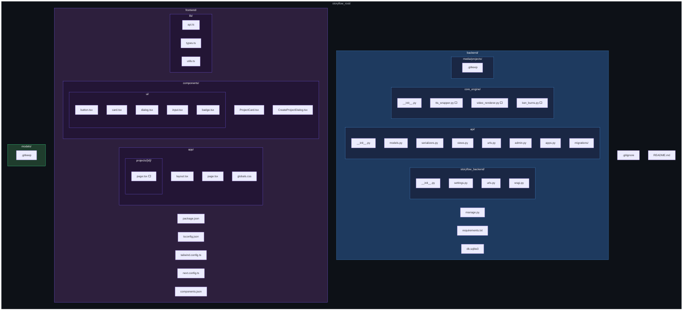

# Phase 01 — The Skeleton

## Phase Overview Document

---

| Field                | Value                                                                        |
| -------------------- | ---------------------------------------------------------------------------- |
| **Phase Number**     | 01                                                                           |
| **Codename**         | The Skeleton                                                                 |
| **Document Type**    | Layer 1 — Phase Overview                                                     |
| **Status**           | Not Started                                                                  |
| **Created**          | 2026-02-16                                                                   |
| **Last Updated**     | 2026-02-16                                                                   |
| **Parent Document**  | [00_Project_Overview.md](../00_Project_Overview.md) (Layer 0)                |
| **Dependencies**     | None — this is the first phase                                               |
| **Sub-Phases**       | 3 (01.01, 01.02, 01.03)                                                     |
| **Estimated Tasks**  | 30–45 (across all sub-phases)                                                |

---

## Table of Contents

- [Phase 01 — The Skeleton](#phase-01--the-skeleton)
  - [Phase Overview Document](#phase-overview-document)
  - [Table of Contents](#table-of-contents)
  - [1. Phase Objective](#1-phase-objective)
  - [2. Relationship to Parent Document](#2-relationship-to-parent-document)
  - [3. Architecture Context for This Phase](#3-architecture-context-for-this-phase)
    - [3.1 Technology Stack (Phase 01 Subset)](#31-technology-stack-phase-01-subset)
    - [3.2 System Design Principles (Reiterated)](#32-system-design-principles-reiterated)
    - [3.3 Database Models (Full Definitions)](#33-database-models-full-definitions)
    - [3.4 Directory Structure (Full Layout)](#34-directory-structure-full-layout)
    - [3.5 API Endpoints (Phase 01 Subset)](#35-api-endpoints-phase-01-subset)
    - [3.6 Constraints Carried from Layer 0](#36-constraints-carried-from-layer-0)
  - [4. Sub-Phase Breakdown](#4-sub-phase-breakdown)
    - [4.1 SubPhase 01.01 — Project Initialization \& Tooling Setup](#41-subphase-0101--project-initialization--tooling-setup)
    - [4.2 SubPhase 01.02 — Database Models \& Migrations](#42-subphase-0102--database-models--migrations)
    - [4.3 SubPhase 01.03 — Dashboard UI \& Basic API](#43-subphase-0103--dashboard-ui--basic-api)
  - [5. Execution Order](#5-execution-order)
    - [5.1 Sub-Phase Dependency Chain](#51-sub-phase-dependency-chain)
    - [5.2 Execution Order Flowchart](#52-execution-order-flowchart)
    - [5.3 Intra-Sub-Phase Execution Notes](#53-intra-sub-phase-execution-notes)
  - [6. Sub-Phase Folder Structure](#6-sub-phase-folder-structure)
  - [7. Files Created in This Phase](#7-files-created-in-this-phase)
    - [7.1 Backend Files](#71-backend-files)
    - [7.2 Frontend Files](#72-frontend-files)
    - [7.3 Root-Level Files](#73-root-level-files)
    - [7.4 File Creation Map (Mermaid)](#74-file-creation-map-mermaid)
  - [8. Technology Setup Details](#8-technology-setup-details)
    - [8.1 Backend Initialization](#81-backend-initialization)
    - [8.2 Frontend Initialization](#82-frontend-initialization)
    - [8.3 CORS Configuration](#83-cors-configuration)
    - [8.4 Linting \& Formatting](#84-linting--formatting)
  - [9. Constraints Specific to Phase 01](#9-constraints-specific-to-phase-01)
  - [10. Exit Criteria](#10-exit-criteria)
  - [11. Cross-References](#11-cross-references)
    - [11.1 References to Layer 0](#111-references-to-layer-0)
    - [11.2 Forward References to Phase 02](#112-forward-references-to-phase-02)

---

## 1. Phase Objective

Phase 01 — **The Skeleton** — establishes the complete foundational infrastructure for the StoryFlow application. This phase is the bedrock upon which all subsequent phases are built. No application logic, no AI integration, no media processing — only the structural skeleton.

**Specifically, this phase accomplishes the following:**

1. **Initializes both projects** — A fully configured Django 5.x backend project and a fully configured Next.js 16+ frontend project, both ready for development.
2. **Establishes cross-origin communication** — The Django backend is configured to accept requests from the Next.js frontend running on a different port (`localhost:3000` → `localhost:8000`).
3. **Creates the data layer** — All three core database models (`Project`, `Segment`, `GlobalSettings`) are defined in Django, migrated to SQLite, and registered in the Django Admin.
4. **Scaffolds the API layer** — DRF serializers are created for all models and a minimal set of API endpoints (list projects, create project) are operational.
5. **Builds the UI shell** — A basic Next.js dashboard page that lists projects (or displays an empty state) and provides a "Create Project" dialog that communicates with the backend API.
6. **Configures developer tooling** — Linting, formatting, `.gitignore`, dev run scripts, and all configuration files are in place for a smooth development workflow.

**What this phase does NOT do:**
- No TTS integration (Phase 03)
- No video rendering (Phase 04)
- No image upload processing (Phase 02)
- No segment editing UI (Phase 02)
- No audio playback (Phase 03)
- No Ken Burns effects (Phase 04)
- No subtitles (Phase 05)

At the conclusion of Phase 01, a developer (or AI agent) should be able to start both servers, see a working dashboard in the browser, create a project via the UI, and verify that the project appears in both the Django Admin and the frontend project list.

---

## 2. Relationship to Parent Document

This Phase Overview is a **Layer 1 document** that derives its authority from [00_Project_Overview.md](../00_Project_Overview.md) (Layer 0). All architectural decisions, technology choices, and constraints defined in the parent document are binding on this phase and all its sub-phases.

**Specific Layer 0 sections that govern Phase 01:**

| Layer 0 Section                                      | Relevance to Phase 01                                               |
| ---------------------------------------------------- | ------------------------------------------------------------------- |
| Section 2.2 — Technology Stack Summary               | Defines exact technologies to install and configure                  |
| Section 3.2 — Core Models                            | Defines the three database models to implement                       |
| Section 4 — System Directory Structure               | Defines the folder hierarchy to scaffold                             |
| Section 6 — API Surface Overview                     | Defines the API endpoints (Phase 01 implements a subset)             |
| Section 11.1 — Phase 1 Summary                       | Defines the high-level goals and exit criteria for this phase        |
| Section 14 — Development Guidelines & Constraints    | Defines environment, privacy, code, and architectural constraints    |
| Section 15 — Quality Standards                       | Defines code quality, testing, and documentation standards           |

**One-directional rule:** As defined in `00_Project_Overview.md` (Layer 0, Section 7.3), information flows TOP-DOWN only. This Phase Overview document does not modify, override, or contradict any information in the parent document. If any apparent conflict arises, the Layer 0 document takes absolute precedence.

---

## 3. Architecture Context for This Phase

This section reproduces the relevant architectural details from [00_Project_Overview.md](../00_Project_Overview.md) (Layer 0) so that an AI agent reading this document has sufficient context to execute Phase 01 without needing to re-read the master overview for basic architecture details.

### 3.1 Technology Stack (Phase 01 Subset)

The following technologies are directly relevant to Phase 01 and must be installed/configured during this phase. As defined in `00_Project_Overview.md` (Layer 0, Section 2.2):

| Layer                  | Technology                        | Version / Detail                             | Phase 01 Usage                                |
| ---------------------- | --------------------------------- | -------------------------------------------- | --------------------------------------------- |
| **Frontend Framework** | Next.js (App Router)              | 16+                                          | Initialize project, create dashboard page     |
| **Frontend Language**  | TypeScript                        | Strict Mode                                  | All frontend files in `.ts` / `.tsx`          |
| **Styling**            | Tailwind CSS                      | 4                                            | Configure, apply to dashboard layout          |
| **UI Components**      | Shadcn/UI (Radix Primitives)      | Latest                                       | Install base, add Button, Dialog, Card        |
| **State Management**   | Zustand or React Context          | —                                            | Not heavily used in Phase 01 (minimal state)  |
| **Data Fetching**      | Axios or TanStack Query           | —                                            | Set up API client, fetch project list         |
| **Backend Framework**  | Django                            | 5.x                                          | Initialize project, create `api` app          |
| **API Layer**          | Django REST Framework (DRF)       | Latest compatible                            | Configure, create serializers and viewsets    |
| **Database**           | SQLite                            | Django default                               | Zero-config, auto-created `db.sqlite3`        |
| **Package Mgr (BE)**   | pip + requirements.txt           | —                                            | Install Django, DRF, django-cors-headers      |
| **Package Mgr (FE)**   | npm or pnpm                      | Pick one, use consistently                   | Install Next.js, Tailwind, Shadcn/UI          |

**Technologies NOT used in Phase 01** (deferred to later phases):
- Kokoro-82M / ONNX Runtime (Phase 03)
- MoviePy / Pillow / NumPy (Phase 04)
- Fish Speech (Phase 03)
- soundfile (Phase 03)
- Python `threading` / `concurrent.futures` (Phase 03+)

### 3.2 System Design Principles (Reiterated)

As defined in `00_Project_Overview.md` (Layer 0, Section 1.4), the following core design principles MUST be respected in every decision made during Phase 01:

1. **Human-in-the-Loop** — The user retains creative control. In Phase 01, this means the UI must be designed for human interaction, not automated pipelines.
2. **Local-First** — No cloud dependencies. Django runs on `localhost:8000`, Next.js on `localhost:3000`. SQLite for storage.
3. **Zero External API Cost** — No paid APIs. No API keys required. Phase 01 uses zero external services.
4. **Privacy by Architecture** — No data leaves the machine. No analytics, no telemetry, no crash reporting.
5. **Simplicity Over Scalability** — SQLite over Postgres, `requirements.txt` over Poetry, straightforward project structure.

### 3.3 Database Models (Full Definitions)

As defined in `00_Project_Overview.md` (Layer 0, Section 3.2), Phase 01 must implement these three models exactly as specified. These definitions are reproduced here in full so the AI agent has complete context.

#### Project Model

| Field              | Django Field Type                    | Default / Config                                          |
| ------------------ | ------------------------------------ | --------------------------------------------------------- |
| `id`               | `UUIDField(primary_key=True)`        | `default=uuid.uuid4, editable=False`                      |
| `title`            | `CharField(max_length=200)`          | Required                                                  |
| `created_at`       | `DateTimeField(auto_now_add=True)`   | Auto-set on creation                                      |
| `updated_at`       | `DateTimeField(auto_now=True)`       | Auto-set on every save                                    |
| `status`           | `CharField(max_length=20)`           | `default='DRAFT'`, choices: DRAFT, PROCESSING, COMPLETED, FAILED |
| `resolution_width` | `IntegerField()`                     | `default=1920`                                            |
| `resolution_height`| `IntegerField()`                     | `default=1080`                                            |
| `framerate`        | `IntegerField()`                     | `default=30`                                              |
| `output_path`      | `CharField(max_length=500)`          | `blank=True, null=True`                                   |

#### Segment Model

| Field              | Django Field Type                    | Default / Config                                          |
| ------------------ | ------------------------------------ | --------------------------------------------------------- |
| `id`               | `UUIDField(primary_key=True)`        | `default=uuid.uuid4, editable=False`                      |
| `project`          | `ForeignKey(Project, on_delete=CASCADE, related_name='segments')` | Required                         |
| `sequence_index`   | `IntegerField()`                     | Required                                                  |
| `text_content`     | `TextField()`                        | `blank=True, default=''`                                  |
| `image_prompt`     | `TextField()`                        | `blank=True, default=''`                                  |
| `image_file`       | `ImageField(upload_to=...)`          | `blank=True, null=True`                                   |
| `audio_file`       | `FileField(upload_to=...)`           | `blank=True, null=True`                                   |
| `audio_duration`   | `FloatField()`                       | `blank=True, null=True`                                   |
| `is_locked`        | `BooleanField()`                     | `default=False`                                           |

**Ordering:** Segments must be ordered by `sequence_index` within a project. Use `class Meta: ordering = ['sequence_index']`.

**Cascade:** Deleting a Project must cascade-delete all its Segments. This is handled by `on_delete=models.CASCADE`.

#### GlobalSettings Model

| Field              | Django Field Type                    | Default / Config                                          |
| ------------------ | ------------------------------------ | --------------------------------------------------------- |
| `default_voice_id` | `CharField(max_length=100)`          | `default='af_bella'`                                      |
| `tts_speed`        | `FloatField()`                       | `default=1.0`                                             |
| `zoom_intensity`   | `FloatField()`                       | `default=1.3`                                             |
| `subtitle_font`    | `CharField(max_length=500)`          | `blank=True, default=''`                                  |
| `subtitle_color`   | `CharField(max_length=7)`            | `default='#FFFFFF'`                                       |

**Singleton Pattern:** GlobalSettings should have at most one row. Implement a `load()` class method that retrieves the single instance or creates one with defaults if none exists.

#### Model Relationships

As defined in `00_Project_Overview.md` (Layer 0, Section 3.3):

```
Project (1) ──────── (N) Segment
   │                       │
   │ has many               │ belongs to
   │ ordered by             │ sequence_index
   │ cascade delete         │
   │                       │
GlobalSettings (Singleton — system-wide, not project-scoped)
```

### 3.4 Directory Structure (Full Layout)

As defined in `00_Project_Overview.md` (Layer 0, Section 4), Phase 01 scaffolds the complete directory structure. While not all files will contain implementation logic yet (e.g., `tts_wrapper.py` will be an empty placeholder), the folder hierarchy must be established.

```
/storyflow_root
│
├── /backend
│   ├── manage.py
│   ├── requirements.txt
│   ├── /storyflow_backend
│   │   ├── __init__.py
│   │   ├── settings.py
│   │   ├── urls.py
│   │   └── wsgi.py
│   ├── /api
│   │   ├── __init__.py
│   │   ├── models.py
│   │   ├── serializers.py
│   │   ├── views.py
│   │   ├── urls.py
│   │   └── admin.py
│   ├── /core_engine
│   │   ├── __init__.py
│   │   ├── tts_wrapper.py       ← Placeholder (empty/docstring only)
│   │   ├── video_renderer.py    ← Placeholder (empty/docstring only)
│   │   └── ken_burns.py         ← Placeholder (empty/docstring only)
│   ├── /media
│   │   └── /projects            ← Empty, Git-ignored
│   └── db.sqlite3               ← Created by migration
│
├── /frontend
│   ├── package.json
│   ├── tsconfig.json
│   ├── tailwind.config.ts
│   ├── next.config.ts
│   ├── /app
│   │   ├── layout.tsx
│   │   ├── page.tsx             ← Dashboard page
│   │   └── /projects
│   │       └── /[id]
│   │           └── page.tsx     ← Placeholder (stub only)
│   ├── /components
│   │   ├── /ui                  ← Shadcn/UI components
│   │   └── ProjectCard.tsx      ← Project list card component
│   └── /lib
│       ├── api.ts               ← API client setup
│       ├── types.ts             ← TypeScript interfaces
│       └── utils.ts             ← Helper utilities
│
├── /models                      ← Empty directory, Git-ignored
├── .gitignore
└── README.md
```

### 3.5 API Endpoints (Phase 01 Subset)

As defined in `00_Project_Overview.md` (Layer 0, Section 6), the full API surface includes 7 endpoints. Phase 01 implements only the first three — the minimum required for the dashboard to function:

| Method | Endpoint               | Phase 01 Scope | Description                                  |
| ------ | ---------------------- | -------------- | -------------------------------------------- |
| `GET`  | `/api/projects/`       | ✅ Implement   | List all projects (returns array)            |
| `POST` | `/api/projects/`       | ✅ Implement   | Create a new project (title only for now)    |
| `GET`  | `/api/projects/{id}/`  | ✅ Implement   | Get single project details + segments        |
| `PATCH`| `/api/segments/{id}/`  | ❌ Phase 02    | Update segment text/image                    |
| `POST` | `/api/segments/{id}/generate-audio/` | ❌ Phase 03 | TTS generation                   |
| `POST` | `/api/projects/{id}/render/`         | ❌ Phase 04 | Video rendering                  |
| `GET`  | `/api/projects/{id}/status/`         | ❌ Phase 04 | Render status polling            |

**Response format for Phase 01 endpoints:**

`GET /api/projects/` returns:
```json
[
  {
    "id": "uuid-string",
    "title": "My First Project",
    "created_at": "2026-02-16T12:00:00Z",
    "updated_at": "2026-02-16T12:00:00Z",
    "status": "DRAFT",
    "resolution_width": 1920,
    "resolution_height": 1080,
    "framerate": 30,
    "segment_count": 0
  }
]
```

`POST /api/projects/` accepts:
```json
{
  "title": "My First Project"
}
```

`GET /api/projects/{id}/` returns:
```json
{
  "id": "uuid-string",
  "title": "My First Project",
  "created_at": "2026-02-16T12:00:00Z",
  "updated_at": "2026-02-16T12:00:00Z",
  "status": "DRAFT",
  "resolution_width": 1920,
  "resolution_height": 1080,
  "framerate": 30,
  "output_path": null,
  "segments": []
}
```

### 3.6 Constraints Carried from Layer 0

As defined in `00_Project_Overview.md` (Layer 0, Section 14), these constraints are absolute and non-negotiable:

| Category        | Constraint                                                                     |
| --------------- | ------------------------------------------------------------------------------ |
| **Environment** | NO Docker, NO Redis, NO Celery, NO cloud services, NO authentication           |
| **Database**    | SQLite ONLY — no Postgres, no MySQL, no MongoDB                                |
| **Frontend**    | TypeScript Strict Mode, Next.js App Router only (no Pages Router), Tailwind CSS 4, Shadcn/UI |
| **Backend**     | Django 5.x with DRF, Python 3.11+, pip + requirements.txt                     |
| **Communication** | HTTP REST only — no WebSockets, no GraphQL, no gRPC                         |
| **File Access** | Frontend NEVER accesses filesystem directly — all file I/O through Django API  |
| **CORS**        | Backend must accept requests from `http://localhost:3000`                       |

---

## 4. Sub-Phase Breakdown

Phase 01 is divided into exactly **3 sub-phases**, executed sequentially. Each sub-phase has its own Layer 2 overview document and a set of Layer 3 task documents.

### 4.1 SubPhase 01.01 — Project Initialization & Tooling Setup

| Field              | Value                                                                          |
| ------------------ | ------------------------------------------------------------------------------ |
| **Sub-Phase ID**   | 01.01                                                                          |
| **Name**           | Project Initialization & Tooling Setup                                         |
| **Document**       | [SubPhase_01_01_Overview.md](SubPhase_01_01_Project_Setup/SubPhase_01_01_Overview.md) (Layer 2) |
| **Dependencies**   | None — first sub-phase of the first phase                                      |
| **Est. Tasks**     | 10–15                                                                          |

**Objective:** Bootstrap both the Django backend and Next.js frontend projects from scratch. Configure all tooling, establish the directory structure, and ensure both development servers start successfully.

**Deliverables:**

1. **Django project initialized** — `django-admin startproject storyflow_backend` run inside `/backend`, producing `manage.py`, `settings.py`, `urls.py`, `wsgi.py`.
2. **Django `api` app created** — `python manage.py startapp api` producing the `api/` directory with boilerplate files.
3. **Django `core_engine` module created** — Manual directory with `__init__.py` and placeholder files for `tts_wrapper.py`, `video_renderer.py`, `ken_burns.py`.
4. **`requirements.txt` populated** — Contains Django, djangorestframework, django-cors-headers, and Pillow (required for `ImageField`).
5. **Django settings configured** — `INSTALLED_APPS` updated, `MEDIA_ROOT` and `MEDIA_URL` set, `STATIC` settings configured, `ALLOWED_HOSTS` set for local development.
6. **Next.js project initialized** — `npx create-next-app@latest` (or pnpm equivalent) run inside `/frontend`, with TypeScript, App Router, Tailwind CSS, and ESLint enabled.
7. **Tailwind CSS 4 configured** — `tailwind.config.ts` properly scoped to the project's component directories.
8. **Shadcn/UI initialized** — `npx shadcn-ui@latest init` run, base components directory established.
9. **CORS configured** — `django-cors-headers` installed and configured with `CORS_ALLOWED_ORIGINS = ["http://localhost:3000"]`.
10. **`.gitignore` created** — Comprehensive gitignore covering Python, Node.js, SQLite, media files, model weights, IDE files.
11. **Dev run scripts created** — Shell scripts or npm scripts to start both servers with a single command.
12. **`/media/projects/` directory created** — Empty, with a `.gitkeep` file.
13. **`/models/` directory created** — Empty placeholder for future ONNX model files, with a `.gitkeep` file.
14. **Root `README.md` created** — Basic setup instructions for both backend and frontend.

**Key technical decisions:**
- The Django project directory is named `storyflow_backend` (the settings module), NOT `storyflow`. This avoids name collision with any future top-level package.
- The `api` app contains models, serializers, views, and urls. It is the single Django app for v1.0.
- The `core_engine` is a regular Python package (NOT a Django app). It does not have `models.py` or `admin.py`. It is a utility module.

### 4.2 SubPhase 01.02 — Database Models & Migrations

| Field              | Value                                                                          |
| ------------------ | ------------------------------------------------------------------------------ |
| **Sub-Phase ID**   | 01.02                                                                          |
| **Name**           | Database Models & Migrations                                                   |
| **Document**       | [SubPhase_01_02_Overview.md](SubPhase_01_02_Database_Models/SubPhase_01_02_Overview.md) (Layer 2) |
| **Dependencies**   | SubPhase 01.01 must be complete (Django project exists, `api` app exists)      |
| **Est. Tasks**     | 8–12                                                                           |

**Objective:** Implement all three core data models in Django, run migrations to create the SQLite database schema, register models in Django Admin, create DRF serializers, and configure basic DRF settings.

**Deliverables:**

1. **`Project` model defined** — In `api/models.py`, with UUID primary key, status choices, resolution defaults, and timestamp auto-fields. Exact field definitions as specified in Section 3.3 of this document.
2. **`Segment` model defined** — In `api/models.py`, with ForeignKey to Project (cascade delete), sequence_index ordering, and all media-related fields (`image_file`, `audio_file`, `audio_duration`). Upload paths configured to `media/projects/{project_id}/images/` and `media/projects/{project_id}/audio/`.
3. **`GlobalSettings` model defined** — In `api/models.py`, as a singleton with a `load()` class method. Default values for voice_id, tts_speed, zoom_intensity, subtitle_color.
4. **Migrations generated and applied** — `python manage.py makemigrations api` and `python manage.py migrate` run successfully.
5. **Django Admin registration** — All three models registered in `api/admin.py` with appropriate `list_display`, `list_filter`, and `search_fields` configurations.
6. **DRF configuration in settings** — `REST_FRAMEWORK` settings added to `settings.py` with default pagination, renderer classes, and permission settings (AllowAny for local development).
7. **`ProjectSerializer` created** — In `api/serializers.py`, serializing all Project fields plus a computed `segment_count` field.
8. **`SegmentSerializer` created** — In `api/serializers.py`, serializing all Segment fields.
9. **`GlobalSettingsSerializer` created** — In `api/serializers.py`, serializing all GlobalSettings fields.
10. **`ProjectDetailSerializer` created** — Nested serializer that includes Project fields plus a nested list of its Segments.
11. **Superuser created** — A Django superuser is created for admin access during development.

**Key technical decisions:**
- `upload_to` for `ImageField` and `FileField` must use a callable that generates paths based on `project.id`: `f'projects/{instance.project.id}/images/{filename}'`.
- The `GlobalSettings.load()` method uses `cls.objects.first()` and creates a default instance if none exists. This avoids migration-time data injection.
- DRF is configured with `DEFAULT_PERMISSION_CLASSES: ['rest_framework.permissions.AllowAny']` — no authentication for this local-only application. As defined in `00_Project_Overview.md` (Layer 0, Section 6): "Authentication: None."

### 4.3 SubPhase 01.03 — Dashboard UI & Basic API

| Field              | Value                                                                          |
| ------------------ | ------------------------------------------------------------------------------ |
| **Sub-Phase ID**   | 01.03                                                                          |
| **Name**           | Dashboard UI & Basic API                                                       |
| **Document**       | [SubPhase_01_03_Overview.md](SubPhase_01_03_Dashboard_UI/SubPhase_01_03_Overview.md) (Layer 2) |
| **Dependencies**   | SubPhase 01.02 must be complete (models exist, serializers exist, DB migrated)  |
| **Est. Tasks**     | 12–18                                                                          |

**Objective:** Build the first functional API endpoints, create the frontend dashboard page, wire up frontend-to-backend communication, and deliver a working end-to-end flow: user opens the app → sees project list (or empty state) → creates a new project → sees it in the list.

**Deliverables:**

1. **API ViewSets implemented:**
   - `ProjectViewSet` in `api/views.py` — supports `list` (GET /api/projects/), `create` (POST /api/projects/), and `retrieve` (GET /api/projects/{id}/) actions.
   - URL routing configured in `api/urls.py` using DRF's `DefaultRouter`.
   - Root `storyflow_backend/urls.py` includes `api/urls.py` and configures media file serving for development.

2. **Frontend API client configured:**
   - `lib/api.ts` — Axios instance (or TanStack Query client) configured with `baseURL: 'http://localhost:8000'`.
   - `lib/types.ts` — TypeScript interfaces defined: `Project`, `Segment`, `GlobalSettings`, `CreateProjectPayload`, `ProjectListResponse`.

3. **Dashboard page built (`app/page.tsx`):**
   - Fetches project list from `GET /api/projects/` on mount.
   - Displays a grid/list of `ProjectCard` components if projects exist.
   - Displays an empty state message ("No projects yet. Create your first project!") with a call-to-action button if no projects exist.
   - Includes a "Create Project" button in the page header.

4. **`ProjectCard` component (`components/ProjectCard.tsx`):**
   - Displays project title, status badge, creation date, and segment count.
   - Styled with Tailwind CSS and Shadcn/UI Card component.
   - Links to `/projects/{id}` (the future timeline editor page).

5. **"Create Project" dialog:**
   - Uses Shadcn/UI `Dialog` component.
   - Contains a form with a single text input for project title.
   - Submits via `POST /api/projects/` to the backend.
   - On success: closes dialog, refreshes project list.
   - On error: displays an error message.

6. **Layout and navigation (`app/layout.tsx`):**
   - Root layout with application title/header ("StoryFlow").
   - Tailwind CSS base styles applied.
   - Font configuration (Inter or system font stack).

7. **Placeholder timeline page (`app/projects/[id]/page.tsx`):**
   - Stub page that displays "Timeline Editor — Coming in Phase 02".
   - Fetches project details from `GET /api/projects/{id}/` and displays the project title.

**Key technical decisions:**
- The dashboard uses **client-side data fetching** (not Next.js Server Components for data loading) because the API is on a different origin (`localhost:8000`). Server Components cannot directly call the Django API during SSR in the way we need for this local architecture.
- The project list should be refetched after creating a new project — either by invalidating a TanStack Query cache or by calling a refetch function.
- Shadcn/UI components are installed as needed: `Button`, `Card`, `Dialog`, `Input`, `Badge` at minimum.

---

## 5. Execution Order

### 5.1 Sub-Phase Dependency Chain

Sub-phases within Phase 01 MUST be executed in strict sequential order. Each sub-phase depends on the completion of the previous one:

| Order | Sub-Phase | Depends On     | Reason                                                        |
| ----- | --------- | -------------- | ------------------------------------------------------------- |
| 1st   | 01.01     | Nothing        | Must initialize projects before anything else can happen      |
| 2nd   | 01.02     | 01.01 complete | Models require an existing Django project with `api` app      |
| 3rd   | 01.03     | 01.02 complete | API endpoints require models and serializers to exist         |

**There is NO parallelism within Phase 01.** An AI agent must complete SubPhase 01.01 fully before beginning SubPhase 01.02, and SubPhase 01.02 fully before beginning SubPhase 01.03.

### 5.2 Execution Order Flowchart

```mermaid
flowchart TD
    START([Phase 01 Begins]) --> SP01

    subgraph SP01 ["SubPhase 01.01 — Project Initialization & Tooling Setup"]
        direction TB
        T01["Initialize Django Project"]
        T02["Create api App"]
        T03["Create core_engine Module"]
        T04["Write requirements.txt"]
        T05["Configure Django Settings"]
        T06["Initialize Next.js Project"]
        T07["Configure Tailwind CSS 4"]
        T08["Initialize Shadcn/UI"]
        T09["Configure CORS"]
        T10["Create .gitignore"]
        T11["Create Dev Run Scripts"]
        T12["Create Media/Models Dirs"]
        T13["Create Root README"]

        T01 --> T02 --> T03 --> T04 --> T05
        T06 --> T07 --> T08
        T05 --> T09
        T09 --> T10 --> T11 --> T12 --> T13
    end

    SP01 --> V01{"✓ Validate 01.01<br/>Both servers start?"}
    V01 -- Pass --> SP02

    subgraph SP02 ["SubPhase 01.02 — Database Models & Migrations"]
        direction TB
        M01["Define Project Model"]
        M02["Define Segment Model"]
        M03["Define GlobalSettings Model"]
        M04["Run Migrations"]
        M05["Register Admin"]
        M06["Configure DRF Settings"]
        M07["Create Serializers"]
        M08["Create Superuser"]

        M01 --> M02 --> M03 --> M04
        M04 --> M05
        M04 --> M06 --> M07
        M05 --> M08
    end

    V01 -- Fail --> FIX01["Debug & Fix"] --> V01
    SP02 --> V02{"✓ Validate 01.02<br/>Models migrated?<br/>Admin accessible?"}
    V02 -- Pass --> SP03

    subgraph SP03 ["SubPhase 01.03 — Dashboard UI & Basic API"]
        direction TB
        A01["Create API ViewSets"]
        A02["Configure URL Routing"]
        A03["Setup Frontend API Client"]
        A04["Define TypeScript Interfaces"]
        A05["Build Dashboard Page"]
        A06["Build ProjectCard Component"]
        A07["Build Create Project Dialog"]
        A08["Build Layout + Header"]
        A09["Create Placeholder Timeline Page"]
        A10["End-to-End Integration Test"]

        A01 --> A02
        A03 --> A04
        A02 --> A05
        A04 --> A05
        A05 --> A06
        A05 --> A07
        A08 --> A05
        A06 --> A10
        A07 --> A10
        A09 --> A10
    end

    V02 -- Fail --> FIX02["Debug & Fix"] --> V02
    SP03 --> V03{"✓ Validate 01.03<br/>Dashboard works?<br/>Create project works?"}
    V03 -- Pass --> DONE([Phase 01 Complete ✓])
    V03 -- Fail --> FIX03["Debug & Fix"] --> V03

    style START fill:#198754,stroke:#fff,color:#fff
    style DONE fill:#198754,stroke:#fff,color:#fff
    style SP01 fill:#1e3a5f,stroke:#4a90d9,color:#ffffff
    style SP02 fill:#2d1f3d,stroke:#7b61ff,color:#ffffff
    style SP03 fill:#3d2d1f,stroke:#ff9f43,color:#ffffff
    style FIX01 fill:#dc3545,stroke:#fff,color:#fff
    style FIX02 fill:#dc3545,stroke:#fff,color:#fff
    style FIX03 fill:#dc3545,stroke:#fff,color:#fff
```



### 5.3 Intra-Sub-Phase Execution Notes

**Within SubPhase 01.01:**
- The Django initialization tasks (T01–T05) and the Next.js initialization tasks (T06–T08) are conceptually independent but should be done sequentially (Django first) to maintain a clean workflow.
- CORS configuration (T09) requires the Django project to exist, so it comes after Django setup.
- Common files (.gitignore, scripts, directories, README) are done last as they span both projects.

**Within SubPhase 01.02:**
- Models must be defined in dependency order: `Project` first (no dependencies), then `Segment` (depends on Project FK), then `GlobalSettings` (no dependencies, but done last by convention).
- Migrations must run AFTER all models are defined.
- Serializers can be created after DRF is configured in settings.

**Within SubPhase 01.03:**
- Backend API (ViewSets + URL routing) and frontend API client (Axios + types) can be done in parallel conceptually, but do backend first to enable testing.
- All UI components depend on the layout being in place.
- End-to-end integration testing is the FINAL task.

---

## 6. Sub-Phase Folder Structure

The following folder/file structure will exist inside the `Phase_01_The_Skeleton/` documentation directory after all sub-phase and task documents are generated:

```
Phase_01_The_Skeleton/
│
├── Phase_01_Overview.md                                    ← THIS DOCUMENT (Layer 1)
│
├── SubPhase_01_01_Project_Setup/
│   ├── SubPhase_01_01_Overview.md                          ← Layer 2
│   ├── Task_01_01_01_Initialize_Django_Project.md          ← Layer 3
│   ├── Task_01_01_02_Create_Api_App.md
│   ├── Task_01_01_03_Create_Core_Engine_Module.md
│   ├── Task_01_01_04_Write_Requirements_File.md
│   ├── Task_01_01_05_Configure_Django_Settings.md
│   ├── Task_01_01_06_Initialize_NextJS_Project.md
│   ├── Task_01_01_07_Configure_Tailwind_CSS.md
│   ├── Task_01_01_08_Initialize_Shadcn_UI.md
│   ├── Task_01_01_09_Configure_CORS.md
│   ├── Task_01_01_10_Create_Gitignore.md
│   ├── Task_01_01_11_Create_Dev_Run_Scripts.md
│   ├── Task_01_01_12_Create_Media_And_Model_Dirs.md
│   └── Task_01_01_13_Create_Root_README.md
│
├── SubPhase_01_02_Database_Models/
│   ├── SubPhase_01_02_Overview.md                          ← Layer 2
│   ├── Task_01_02_01_Create_Project_Model.md               ← Layer 3
│   ├── Task_01_02_02_Create_Segment_Model.md
│   ├── Task_01_02_03_Create_GlobalSettings_Model.md
│   ├── Task_01_02_04_Run_Migrations.md
│   ├── Task_01_02_05_Register_Admin.md
│   ├── Task_01_02_06_Configure_DRF_Settings.md
│   ├── Task_01_02_07_Create_Serializers.md
│   └── Task_01_02_08_Create_Superuser.md
│
└── SubPhase_01_03_Dashboard_UI/
    ├── SubPhase_01_03_Overview.md                          ← Layer 2
    ├── Task_01_03_01_Create_Project_ViewSet.md             ← Layer 3
    ├── Task_01_03_02_Configure_URL_Routing.md
    ├── Task_01_03_03_Setup_Frontend_API_Client.md
    ├── Task_01_03_04_Define_TypeScript_Interfaces.md
    ├── Task_01_03_05_Build_Root_Layout.md
    ├── Task_01_03_06_Build_Dashboard_Page.md
    ├── Task_01_03_07_Build_ProjectCard_Component.md
    ├── Task_01_03_08_Build_Create_Project_Dialog.md
    ├── Task_01_03_09_Create_Placeholder_Timeline_Page.md
    └── Task_01_03_10_End_To_End_Integration_Test.md
```

**Total document count for Phase 01:** 1 (Phase Overview) + 3 (Sub-Phase Overviews) + 31 (Task Documents) = **35 documents**.

---

## 7. Files Created in This Phase

This section provides an exhaustive inventory of every source code file created during Phase 01. Files are listed by location within the `storyflow_root` project directory.

### 7.1 Backend Files

| File Path                                         | Sub-Phase | Description                                        |
| ------------------------------------------------- | --------- | -------------------------------------------------- |
| `backend/manage.py`                               | 01.01     | Django management script (auto-generated)          |
| `backend/requirements.txt`                        | 01.01     | Python dependency list                             |
| `backend/storyflow_backend/__init__.py`           | 01.01     | Settings package init (auto-generated)             |
| `backend/storyflow_backend/settings.py`           | 01.01     | Django settings (heavily customized)               |
| `backend/storyflow_backend/urls.py`               | 01.03     | Root URL configuration with API includes           |
| `backend/storyflow_backend/wsgi.py`               | 01.01     | WSGI entry point (auto-generated)                  |
| `backend/api/__init__.py`                         | 01.01     | API app init (auto-generated)                      |
| `backend/api/models.py`                           | 01.02     | Project, Segment, GlobalSettings models            |
| `backend/api/serializers.py`                      | 01.02     | DRF serializers for all models                     |
| `backend/api/views.py`                            | 01.03     | API ViewSets (ProjectViewSet)                      |
| `backend/api/urls.py`                             | 01.03     | DRF router configuration                           |
| `backend/api/admin.py`                            | 01.02     | Admin registrations for all models                 |
| `backend/api/apps.py`                             | 01.01     | App configuration (auto-generated)                 |
| `backend/api/migrations/0001_initial.py`          | 01.02     | Initial migration (auto-generated)                 |
| `backend/core_engine/__init__.py`                 | 01.01     | Core engine package init                           |
| `backend/core_engine/tts_wrapper.py`              | 01.01     | Placeholder — docstring only                       |
| `backend/core_engine/video_renderer.py`           | 01.01     | Placeholder — docstring only                       |
| `backend/core_engine/ken_burns.py`                | 01.01     | Placeholder — docstring only                       |
| `backend/media/projects/.gitkeep`                 | 01.01     | Keeps empty directory in Git                       |
| `backend/db.sqlite3`                              | 01.02     | SQLite database (auto-generated by migrate)        |

### 7.2 Frontend Files

| File Path                                         | Sub-Phase | Description                                        |
| ------------------------------------------------- | --------- | -------------------------------------------------- |
| `frontend/package.json`                           | 01.01     | Node.js dependencies and scripts                   |
| `frontend/tsconfig.json`                          | 01.01     | TypeScript configuration (strict mode)             |
| `frontend/tailwind.config.ts`                     | 01.01     | Tailwind CSS 4 configuration                       |
| `frontend/next.config.ts`                         | 01.01     | Next.js configuration                              |
| `frontend/postcss.config.mjs`                     | 01.01     | PostCSS configuration for Tailwind                 |
| `frontend/components.json`                        | 01.01     | Shadcn/UI configuration                            |
| `frontend/app/layout.tsx`                         | 01.03     | Root layout with header                            |
| `frontend/app/page.tsx`                           | 01.03     | Dashboard page (project list)                      |
| `frontend/app/globals.css`                        | 01.01     | Tailwind base styles + CSS variables               |
| `frontend/app/projects/[id]/page.tsx`             | 01.03     | Placeholder timeline page                          |
| `frontend/components/ui/button.tsx`               | 01.01     | Shadcn/UI Button component                         |
| `frontend/components/ui/card.tsx`                 | 01.03     | Shadcn/UI Card component                           |
| `frontend/components/ui/dialog.tsx`               | 01.03     | Shadcn/UI Dialog component                         |
| `frontend/components/ui/input.tsx`                | 01.03     | Shadcn/UI Input component                          |
| `frontend/components/ui/badge.tsx`                | 01.03     | Shadcn/UI Badge component                          |
| `frontend/components/ProjectCard.tsx`             | 01.03     | Project card for dashboard list                    |
| `frontend/components/CreateProjectDialog.tsx`     | 01.03     | Create project dialog form                         |
| `frontend/lib/api.ts`                             | 01.03     | Axios/TanStack Query API client                    |
| `frontend/lib/types.ts`                           | 01.03     | TypeScript interfaces                              |
| `frontend/lib/utils.ts`                           | 01.01     | Utility functions (cn helper for Shadcn)           |

### 7.3 Root-Level Files

| File Path                                         | Sub-Phase | Description                                        |
| ------------------------------------------------- | --------- | -------------------------------------------------- |
| `.gitignore`                                      | 01.01     | Comprehensive ignore rules                         |
| `README.md`                                       | 01.01     | Project setup instructions                         |
| `models/.gitkeep`                                 | 01.01     | Keeps models directory in Git                      |

### 7.4 File Creation Map (Mermaid)



> **Legend:** ⬜ = Placeholder/stub file (minimal content, full implementation in later phases)

---

## 8. Technology Setup Details

This section provides the exact commands and package lists required to initialize both projects. AI agents executing SubPhase 01.01 should follow these specifications precisely.

### 8.1 Backend Initialization

**Python Version:** 3.11+ (verify with `python --version`)

**Virtual Environment Setup:**
```bash
cd backend
python -m venv venv
# Windows: venv\Scripts\activate
# macOS/Linux: source venv/bin/activate
```

**Django Project Initialization:**
```bash
pip install django djangorestframework django-cors-headers Pillow
django-admin startproject storyflow_backend .
python manage.py startapp api
```

> **Note:** The `.` at the end of `startproject` places `manage.py` directly in `/backend` rather than creating a nested directory.

**`requirements.txt` contents:**
```
Django>=5.0,<6.0
djangorestframework>=3.15,<4.0
django-cors-headers>=4.3,<5.0
Pillow>=10.0,<11.0
```

> **Note:** Pillow is required because the `Segment` model uses `ImageField`, which depends on Pillow even though we are not processing images in Phase 01.

**Key `settings.py` modifications:**
```python
INSTALLED_APPS = [
    'django.contrib.admin',
    'django.contrib.auth',
    'django.contrib.contenttypes',
    'django.contrib.sessions',
    'django.contrib.messages',
    'django.contrib.staticfiles',
    # Third-party
    'rest_framework',
    'corsheaders',
    # Local
    'api',
]

MIDDLEWARE = [
    'corsheaders.middleware.CorsMiddleware',  # Must be before CommonMiddleware
    'django.middleware.security.SecurityMiddleware',
    # ... (other default middleware)
]

CORS_ALLOWED_ORIGINS = [
    "http://localhost:3000",
]

MEDIA_URL = '/media/'
MEDIA_ROOT = BASE_DIR / 'media'

DEFAULT_AUTO_FIELD = 'django.db.models.BigAutoField'
```

### 8.2 Frontend Initialization

**Node.js Version:** 18+ (LTS recommended, verify with `node --version`)

**Next.js Project Initialization:**
```bash
npx create-next-app@latest frontend --typescript --tailwind --eslint --app --src-dir=false --import-alias="@/*"
```

> **Note:** The `--src-dir=false` flag keeps the `/app` directory at the project root (not inside `/src`), matching the directory structure defined in `00_Project_Overview.md` (Layer 0, Section 4).

**Shadcn/UI Initialization:**
```bash
cd frontend
npx shadcn-ui@latest init
```

When prompted, select:
- Style: **Default**
- Base color: **Slate** (or Neutral)
- CSS variables: **Yes**
- `tailwind.config.ts` location: accept default
- Components directory: `components/ui`
- Utilities: `lib/utils.ts`

**Install initial Shadcn/UI components:**
```bash
npx shadcn-ui@latest add button card dialog input badge
```

**Install API client:**
```bash
npm install axios
# OR, if using TanStack Query:
npm install @tanstack/react-query axios
```

### 8.3 CORS Configuration

As defined in `00_Project_Overview.md` (Layer 0, Section 6), the Django backend must accept requests from `http://localhost:3000` (the Next.js dev server).

**Package:** `django-cors-headers` (already in `requirements.txt`).

**Configuration checklist:**
1. Add `'corsheaders'` to `INSTALLED_APPS`.
2. Add `'corsheaders.middleware.CorsMiddleware'` to `MIDDLEWARE` — **before** `CommonMiddleware`.
3. Set `CORS_ALLOWED_ORIGINS = ["http://localhost:3000"]`.
4. Optionally set `CORS_ALLOW_CREDENTIALS = True` if cookies are needed later.

### 8.4 Linting & Formatting

**Backend (Python):**
- Follow PEP 8 conventions. As defined in `00_Project_Overview.md` (Layer 0, Section 15.1).
- Optionally configure `flake8` or `ruff` — but this is a developer convenience, not a hard requirement for Phase 01.

**Frontend (TypeScript):**
- ESLint is configured automatically by `create-next-app`.
- TypeScript strict mode is enabled in `tsconfig.json` (`"strict": true`).
- As defined in `00_Project_Overview.md` (Layer 0, Section 14.3): No `any` types. All frontend files must pass `tsc --noEmit` with zero errors.

---

## 9. Constraints Specific to Phase 01

These constraints define what Phase 01 does **NOT** include. AI agents must strictly respect these boundaries and not implement anything beyond the scope of this phase.

| Constraint                                     | Reason                                                          |
| ---------------------------------------------- | --------------------------------------------------------------- |
| **No TTS integration**                         | Deferred to Phase 03 — The Voice                                |
| **No video rendering**                         | Deferred to Phase 04 — The Vision                               |
| **No image upload processing**                 | Deferred to Phase 02 — The Logic. Phase 01 defines the `ImageField` on the model but does NOT build the upload UI or API endpoint logic for handling file uploads. |
| **No segment editing UI**                      | Deferred to Phase 02 — The Logic. The timeline editor is a Phase 02 deliverable. |
| **No audio playback**                          | Deferred to Phase 03 — The Voice                                |
| **No Ken Burns effects**                       | Deferred to Phase 04 — The Vision                               |
| **No subtitle generation**                     | Deferred to Phase 05 — The Polish                               |
| **No import/parse pipeline**                   | Deferred to Phase 02 — The Logic. Phase 01 only creates projects with a title, not bulk import. |
| **No ONNX Runtime installation**               | Deferred to Phase 03. Do not add `onnxruntime` to `requirements.txt` in Phase 01. |
| **No MoviePy/NumPy installation**              | Deferred to Phase 04. Do not add `moviepy` or `numpy` to `requirements.txt` in Phase 01. |
| **No WebSocket/real-time features**             | Never — as defined in `00_Project_Overview.md` (Layer 0, Section 14.4). HTTP REST only. |
| **No authentication/authorization**            | Never — as defined in `00_Project_Overview.md` (Layer 0, Section 14.1). Local-only, single-user. |
| **No background task execution**               | Deferred to Phase 03+. Phase 01 API calls are all synchronous. |
| **No testing infrastructure**                  | Phase 01 focuses on structure. Unit and integration tests will be added in Phase 02+ as defined in the sub-phase overviews. |

**The golden rule for Phase 01:** If it's not about project structure, database schema, or the basic dashboard UI, it doesn't belong in this phase.

---

## 10. Exit Criteria

Phase 01 is considered **COMPLETE** only when ALL of the following criteria are met. Each criterion is independently testable.

### Backend Checklist

- [ ] **Django dev server starts** — `python manage.py runserver` starts without errors on `http://localhost:8000`.
- [ ] **Migrations applied** — `python manage.py migrate` completes with zero errors. `db.sqlite3` file exists.
- [ ] **Django Admin accessible** — Navigating to `http://localhost:8000/admin/` displays the Django Admin login page.
- [ ] **Admin login works** — Superuser can log in and see Project, Segment, and GlobalSettings models in the admin interface.
- [ ] **Project model exists** — Can create a Project via Django Admin with all fields (title, status, resolution, framerate).
- [ ] **Segment model exists** — Can create a Segment via Django Admin linked to an existing Project.
- [ ] **GlobalSettings model exists** — Can view/edit GlobalSettings via Django Admin. Singleton behavior works.
- [ ] **API list endpoint works** — `GET http://localhost:8000/api/projects/` returns a `200 OK` with a JSON array (empty initially).
- [ ] **API create endpoint works** — `POST http://localhost:8000/api/projects/` with `{"title": "Test"}` returns `201 Created` with the new project data.
- [ ] **API detail endpoint works** — `GET http://localhost:8000/api/projects/{id}/` returns `200 OK` with project data including an empty `segments` array.
- [ ] **CORS works** — API requests from `http://localhost:3000` are accepted (no CORS errors in browser console).
- [ ] **Media serving configured** — `MEDIA_URL` and `MEDIA_ROOT` settings are correct. Dev server serves files from `/media/`.

### Frontend Checklist

- [ ] **Next.js dev server starts** — `npm run dev` (or `pnpm dev`) starts without errors on `http://localhost:3000`.
- [ ] **TypeScript compiles** — `npx tsc --noEmit` completes with zero errors.
- [ ] **Dashboard page loads** — Navigating to `http://localhost:3000` displays the dashboard page.
- [ ] **Empty state displayed** — When no projects exist, the dashboard shows an empty state message with a CTA to create a project.
- [ ] **Create Project dialog works** — Clicking "Create Project" opens a dialog with a title input and submit button.
- [ ] **Project creation works end-to-end** — Entering a title and submitting the dialog creates the project in the backend and it appears in the project list without a page refresh.
- [ ] **ProjectCard displays correctly** — Each project in the list shows title, status badge, creation date, and segment count (0).
- [ ] **Navigation works** — Clicking a ProjectCard navigates to `/projects/{id}` and displays the placeholder timeline page.
- [ ] **Placeholder timeline page loads** — The page shows the project title and a "Coming in Phase 02" message.
- [ ] **Shadcn/UI components render** — Button, Card, Dialog, Input, and Badge components render correctly with Tailwind styling.

### Structural Checklist

- [ ] **Directory structure matches spec** — All directories defined in Section 3.4 of this document exist.
- [ ] **`.gitignore` is comprehensive** — Covers `node_modules/`, `venv/`, `db.sqlite3`, `__pycache__/`, `media/projects/`, `models/`, `.env`, IDE files.
- [ ] **`requirements.txt` is correct** — Contains Django, DRF, django-cors-headers, and Pillow (and nothing else).
- [ ] **`core_engine/` placeholders exist** — `tts_wrapper.py`, `video_renderer.py`, `ken_burns.py` exist as files with only docstrings.
- [ ] **`README.md` exists** — Root README with basic setup instructions for both backend and frontend.

---

## 11. Cross-References

### 11.1 References to Layer 0

| Reference                                                   | Section in `00_Project_Overview.md`  |
| ----------------------------------------------------------- | ------------------------------------ |
| Project vision and design principles                        | Section 1.4                          |
| Full technology stack                                       | Section 2.2                          |
| System architecture diagram                                 | Section 2.3                          |
| Database model definitions                                  | Section 3.2                          |
| Model relationships                                         | Section 3.3                          |
| Directory structure                                         | Section 4                            |
| API endpoints                                               | Section 6                            |
| DDD methodology and layer rules                             | Section 7                            |
| Document hierarchy structure                                | Section 8.1                          |
| Naming conventions                                          | Section 9                            |
| AI agent navigation protocol                                | Section 10                           |
| Phase 01 summary                                            | Section 11.1                         |
| Sub-phase structure template                                | Section 12                           |
| Task document template                                      | Section 13                           |
| Development constraints (env, privacy, code, architecture)  | Section 14                           |
| Quality standards                                           | Section 15                           |

### 11.2 Forward References to Phase 02

Phase 02 — **The Logic** — directly builds upon the foundation established in Phase 01. As defined in `00_Project_Overview.md` (Layer 0, Section 11.2):

| What Phase 01 Creates                      | What Phase 02 Uses It For                                       |
| ------------------------------------------ | --------------------------------------------------------------- |
| `Project` model                            | Import pipeline creates projects with bulk segment data         |
| `Segment` model                            | Segment CRUD API — edit text, upload images, reorder segments    |
| `ProjectViewSet`                           | Extended with additional actions (import endpoint)               |
| Dashboard UI                               | Project list is the entry point for the full editing workflow    |
| Placeholder timeline page                  | Replaced with the full Timeline Editor UI                        |
| `lib/api.ts` client                        | Extended with segment update, image upload API calls             |
| `lib/types.ts` interfaces                  | Extended with segment mutation types, import payload types       |
| `core_engine/` placeholder files           | `tts_wrapper.py` remains a placeholder until Phase 03           |

**Document reference:** [Phase_02_Overview.md](../Phase_02_The_Logic/Phase_02_Overview.md) (Layer 1) — to be generated after Phase 01 documentation is complete.

---

*End of Document — Phase_01_Overview.md*
*This is a Layer 1 document. It derives authority from [00_Project_Overview.md](../00_Project_Overview.md) (Layer 0).*
*All Sub-Phase Overviews (Layer 2) and Task Documents (Layer 3) within Phase 01 must be consistent with this document.*
