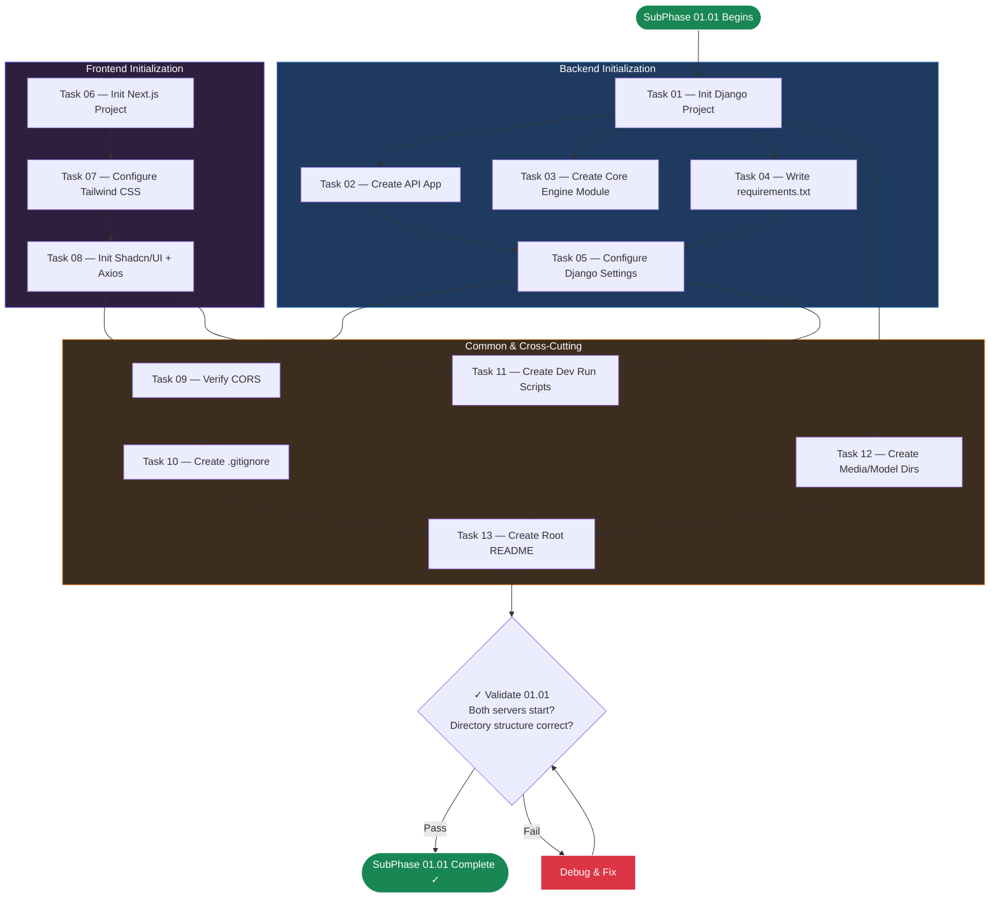

# SubPhase 01.01 — Project Initialization & Tooling Setup

## Metadata

| Field                | Value                                                                          |
| -------------------- | ------------------------------------------------------------------------------ |
| **Phase**            | Phase 01 — The Skeleton                                                        |
| **Sub-Phase**        | 01.01                                                                          |
| **Name**             | Project Initialization & Tooling Setup                                         |
| **Document Type**    | Layer 2 — Sub-Phase Overview                                                   |
| **Status**           | Not Started                                                                    |
| **Dependencies**     | None — this is the first sub-phase of the first phase                          |
| **Estimated Tasks**  | 13                                                                             |
| **Parent Document**  | [Phase_01_Overview.md](../Phase_01_Overview.md) (Layer 1)                      |

---

## Table of Contents

1. [Objective](#1-objective)
2. [Scope](#2-scope)
3. [Technical Context](#3-technical-context)
4. [Task List](#4-task-list)
5. [Task Details](#5-task-details)
6. [Execution Order](#6-execution-order)
7. [Files Created](#7-files-created)
8. [Validation Criteria](#8-validation-criteria)
9. [Constraints Specific to This Sub-Phase](#9-constraints-specific-to-this-sub-phase)
10. [Notes & Gotchas](#10-notes--gotchas)
11. [Cross-References](#11-cross-references)

---

## 1. Objective

Bootstrap both the **Django backend** and **Next.js frontend** projects from scratch. Configure all tooling, install foundational dependencies, establish the complete directory structure, and ensure both development servers start successfully.

Upon completion of SubPhase 01.01, the developer (or AI agent) will have:
- A working Django 5.x project with DRF and CORS pre-configured, serving on `http://localhost:8000`.
- A working Next.js 16+ project with TypeScript Strict, Tailwind CSS 4, and Shadcn/UI initialized, serving on `http://localhost:3000`.
- The full directory scaffold defined in `Phase_01_Overview.md` (Layer 1, Section 3.4) — including placeholder files for `core_engine/` that will be implemented in later phases.
- A comprehensive `.gitignore`, a root `README.md`, and development convenience scripts.

**No models, no serializers, no views, no UI components, and no API endpoints are created in this sub-phase.** Those are the responsibility of SubPhase 01.02 and SubPhase 01.03.

---

## 2. Scope

### 2.1 In Scope

- **Django project initialization** — `django-admin startproject storyflow_backend .` inside `/backend`.
- **Django `api` app creation** — `python manage.py startapp api` producing the `api/` app directory with default boilerplate.
- **Django `core_engine` module creation** — A manual Python package (NOT a Django app) with `__init__.py` and three placeholder files: `tts_wrapper.py`, `video_renderer.py`, `ken_burns.py`.
- **`requirements.txt` creation** — Containing Django, djangorestframework, django-cors-headers, and Pillow.
- **Django `settings.py` configuration** — `INSTALLED_APPS` updated with `rest_framework`, `corsheaders`, and `api`. `MIDDLEWARE` updated with `CorsMiddleware`. `MEDIA_ROOT`, `MEDIA_URL`, `STATIC` settings, `ALLOWED_HOSTS`, and `CORS_ALLOWED_ORIGINS` configured.
- **Python virtual environment setup** — `python -m venv venv` inside `/backend`, with activation instructions.
- **Next.js project initialization** — `npx create-next-app@latest` with TypeScript, App Router, Tailwind CSS, and ESLint enabled. No `/src` directory.
- **Tailwind CSS 4 configuration** — Proper configuration scoped to the project's component directories.
- **Shadcn/UI initialization** — `npx shadcn-ui@latest init` and installation of base components: `button`, `card`, `dialog`, `input`, `badge`.
- **Axios installation** — Frontend HTTP client for backend communication.
- **CORS configuration** — `django-cors-headers` with `CORS_ALLOWED_ORIGINS = ["http://localhost:3000"]`.
- **`.gitignore` creation** — Root-level, covering Python, Node.js, SQLite, media, model weights, IDE files.
- **Development convenience scripts** — Shell scripts or npm scripts to start both servers.
- **`/media/projects/` directory** — Empty with `.gitkeep`.
- **`/models/` directory** — Empty placeholder for future ONNX model files, with `.gitkeep`.
- **Root `README.md`** — Basic setup instructions for both backend and frontend.

### 2.2 Out of Scope

| Exclusion                              | Deferred To     | Reason                                                          |
| -------------------------------------- | --------------- | --------------------------------------------------------------- |
| Database model definitions             | SubPhase 01.02  | Models require the Django project to exist first                |
| DRF serializers                        | SubPhase 01.02  | Serializers depend on models                                    |
| Django Admin registration              | SubPhase 01.02  | Admin registration depends on models                            |
| Database migrations                    | SubPhase 01.02  | Migrations depend on model definitions                          |
| API ViewSets and endpoints             | SubPhase 01.03  | ViewSets depend on models and serializers                       |
| API URL routing                        | SubPhase 01.03  | URL routing depends on ViewSets                                 |
| Frontend API client (`lib/api.ts`)     | SubPhase 01.03  | Axios is installed here; the client module is built in 01.03    |
| TypeScript interfaces (`lib/types.ts`) | SubPhase 01.03  | Type definitions depend on finalized API shape                  |
| Dashboard page UI                      | SubPhase 01.03  | UI depends on API client and type definitions                   |
| Any UI components beyond Shadcn base   | SubPhase 01.03  | Custom components depend on types and API layer                 |
| TTS, video rendering, subtitles        | Phases 03–05    | Completely out of Phase 01 scope                                |
| ONNX Runtime, MoviePy, NumPy           | Phases 03–04    | Do NOT add these to `requirements.txt`                          |

---

## 3. Technical Context

### 3.1 Technology Stack (SubPhase 01.01 Subset)

This sub-phase only touches the **initialization and configuration** layer of the tech stack. No application logic is written.

| Layer          | Technology              | Version Constraint   | Role in 01.01                                  |
| -------------- | ----------------------- | -------------------- | ---------------------------------------------- |
| **Backend**    | Python                  | 3.11+                | Runtime, virtual environment                   |
| **Backend**    | Django                  | ≥5.0, <6.0           | Project scaffold (`startproject`, `startapp`)  |
| **Backend**    | Django REST Framework   | ≥3.15, <4.0          | Added to `INSTALLED_APPS` only (no views yet)  |
| **Backend**    | django-cors-headers     | ≥4.3, <5.0           | CORS middleware + allowed origins config        |
| **Backend**    | Pillow                  | ≥10.0, <11.0         | Required for `ImageField` (installed now, used in 01.02) |
| **Frontend**   | Node.js                 | 18+ (LTS)            | Runtime for Next.js                            |
| **Frontend**   | Next.js                 | 16+                  | App Router scaffold (`create-next-app`)        |
| **Frontend**   | TypeScript              | Strict Mode          | Configured via `tsconfig.json`                 |
| **Frontend**   | Tailwind CSS            | 4                    | Configured via `tailwind.config.ts`            |
| **Frontend**   | Shadcn/UI               | Latest               | Initialized, base components installed         |
| **Frontend**   | Axios                   | Latest               | Installed as dependency (used in 01.03)        |

### 3.2 Key Technical Decisions

As defined in `Phase_01_Overview.md` (Layer 1, Section 4.1):

1. **Django project directory naming** — The settings module is named `storyflow_backend`, NOT `storyflow`. The `django-admin startproject storyflow_backend .` command (note the trailing `.`) places `manage.py` directly inside `/backend` rather than creating a nested directory.

2. **`api` app is the SINGLE Django app** — For v1.0, all models, serializers, views, and urls live in the `api` app. There is no separate `projects` app or `segments` app.

3. **`core_engine` is NOT a Django app** — It is a regular Python package (directory with `__init__.py`). It does NOT have `models.py`, `admin.py`, `apps.py`, or migrations. It is a utility module that will contain processing logic in later phases.

4. **No `/src` directory in frontend** — The `create-next-app` command uses `--src-dir=false`, keeping the `/app` directory at the project root, matching the directory structure defined in `00_Project_Overview.md` (Layer 0, Section 4).

5. **Shadcn/UI configuration choices:**
   - Style: Default
   - Base color: Slate (or Neutral)
   - CSS variables: Yes
   - Components directory: `components/ui`
   - Utilities: `lib/utils.ts`

6. **Package manager consistency** — npm or pnpm must be chosen once and used throughout. Do NOT mix package managers.

### 3.3 Directory Structure Created by This Sub-Phase

After completing SubPhase 01.01, the following structure will exist (files marked with `✅` are created in this sub-phase; files marked with `⬜` are placeholder stubs):

```
/storyflow_root
│
├── /backend
│   ├── manage.py                          ✅ Auto-generated by startproject
│   ├── requirements.txt                   ✅ Manually created
│   ├── /venv                              ✅ Virtual environment (git-ignored)
│   ├── /storyflow_backend
│   │   ├── __init__.py                    ✅ Auto-generated
│   │   ├── settings.py                    ✅ Auto-generated + customized
│   │   ├── urls.py                        ✅ Auto-generated (default, modified in 01.03)
│   │   └── wsgi.py                        ✅ Auto-generated
│   ├── /api
│   │   ├── __init__.py                    ✅ Auto-generated by startapp
│   │   ├── models.py                      ✅ Auto-generated (empty, populated in 01.02)
│   │   ├── views.py                       ✅ Auto-generated (empty, populated in 01.03)
│   │   ├── urls.py                        ❌ Does NOT exist yet (created in 01.03)
│   │   ├── serializers.py                 ❌ Does NOT exist yet (created in 01.02)
│   │   ├── admin.py                       ✅ Auto-generated (empty, populated in 01.02)
│   │   ├── apps.py                        ✅ Auto-generated
│   │   ├── tests.py                       ✅ Auto-generated (empty)
│   │   └── /migrations
│   │       └── __init__.py                ✅ Auto-generated
│   ├── /core_engine
│   │   ├── __init__.py                    ✅ Manually created
│   │   ├── tts_wrapper.py                 ⬜ Placeholder (docstring only)
│   │   ├── video_renderer.py              ⬜ Placeholder (docstring only)
│   │   └── ken_burns.py                   ⬜ Placeholder (docstring only)
│   └── /media
│       └── /projects
│           └── .gitkeep                   ✅ Manually created
│
├── /frontend
│   ├── package.json                       ✅ Auto-generated by create-next-app
│   ├── package-lock.json                  ✅ Auto-generated (or pnpm-lock.yaml)
│   ├── tsconfig.json                      ✅ Auto-generated (strict mode)
│   ├── tailwind.config.ts                 ✅ Auto-generated + configured
│   ├── next.config.ts                     ✅ Auto-generated
│   ├── postcss.config.mjs                 ✅ Auto-generated
│   ├── components.json                    ✅ Generated by shadcn-ui init
│   ├── /app
│   │   ├── layout.tsx                     ✅ Auto-generated (default, customized in 01.03)
│   │   ├── page.tsx                       ✅ Auto-generated (default, replaced in 01.03)
│   │   └── globals.css                    ✅ Auto-generated (Tailwind base + CSS vars)
│   ├── /components
│   │   └── /ui
│   │       └── button.tsx                 ✅ Installed by shadcn-ui add button
│   │       └── card.tsx                   ✅ Installed by shadcn-ui add card
│   │       └── dialog.tsx                 ✅ Installed by shadcn-ui add dialog
│   │       └── input.tsx                  ✅ Installed by shadcn-ui add input
│   │       └── badge.tsx                  ✅ Installed by shadcn-ui add badge
│   └── /lib
│       └── utils.ts                       ✅ Generated by shadcn-ui init (cn helper)
│
├── /models
│   └── .gitkeep                           ✅ Manually created
├── .gitignore                             ✅ Manually created
└── README.md                              ✅ Manually created
```

### 3.4 Backend Settings Configuration Spec

The following `settings.py` modifications must be applied during this sub-phase. This is the exact configuration referenced from `Phase_01_Overview.md` (Layer 1, Section 8.1):

**`INSTALLED_APPS` additions:**
```python
INSTALLED_APPS = [
    'django.contrib.admin',
    'django.contrib.auth',
    'django.contrib.contenttypes',
    'django.contrib.sessions',
    'django.contrib.messages',
    'django.contrib.staticfiles',
    # Third-party
    'rest_framework',
    'corsheaders',
    # Local
    'api',
]
```

**`MIDDLEWARE` modification:**
```python
MIDDLEWARE = [
    'corsheaders.middleware.CorsMiddleware',  # MUST be before CommonMiddleware
    'django.middleware.security.SecurityMiddleware',
    'django.contrib.sessions.middleware.SessionMiddleware',
    'django.middleware.common.CommonMiddleware',
    'django.middleware.csrf.CsrfViewMiddleware',
    'django.contrib.auth.middleware.AuthenticationMiddleware',
    'django.contrib.messages.middleware.MessageMiddleware',
    'django.middleware.clickjacking.XFrameOptionsMiddleware',
]
```

**Additional settings:**
```python
CORS_ALLOWED_ORIGINS = [
    "http://localhost:3000",
]

MEDIA_URL = '/media/'
MEDIA_ROOT = BASE_DIR / 'media'

DEFAULT_AUTO_FIELD = 'django.db.models.BigAutoField'
```

### 3.5 `requirements.txt` Specification

As defined in `Phase_01_Overview.md` (Layer 1, Section 8.1):

```
Django>=5.0,<6.0
djangorestframework>=3.15,<4.0
django-cors-headers>=4.3,<5.0
Pillow>=10.0,<11.0
```

> **Important:** Do NOT add `onnxruntime`, `moviepy`, `numpy`, `soundfile`, or any other processing library. Those are deferred to Phases 03–04.

### 3.6 Placeholder File Specification

The three `core_engine/` placeholder files must contain ONLY a module docstring and nothing else:

**`tts_wrapper.py`:**
```python
"""
StoryFlow TTS Wrapper Module.

Provides text-to-speech functionality using Kokoro-82M ONNX model.
Implementation deferred to Phase 03 — The Voice.
"""
```

**`video_renderer.py`:**
```python
"""
StoryFlow Video Renderer Module.

Orchestrates MoviePy-based video assembly from image and audio segments.
Implementation deferred to Phase 04 — The Vision.
"""
```

**`ken_burns.py`:**
```python
"""
StoryFlow Ken Burns Effect Module.

Implements cinematic pan-and-zoom transformations on still images.
Implementation deferred to Phase 04 — The Vision.
"""
```

### 3.7 `.gitignore` Specification

The root `.gitignore` must cover all the following categories:

```
# Python
__pycache__/
*.py[cod]
*$py.class
*.so
venv/
.env

# Django
db.sqlite3
backend/media/projects/

# Node.js
node_modules/
.next/
out/

# ONNX Models (large binary files)
models/*.onnx
models/*.bin

# IDE
.vscode/
.idea/
*.swp
*.swo
*~

# OS
.DS_Store
Thumbs.db

# Build
dist/
build/
*.egg-info/
```

### 3.8 CORS Configuration Checklist

As defined in `Phase_01_Overview.md` (Layer 1, Section 8.3):

1. ✅ Add `'corsheaders'` to `INSTALLED_APPS`
2. ✅ Add `'corsheaders.middleware.CorsMiddleware'` to `MIDDLEWARE` — **before** `CommonMiddleware`
3. ✅ Set `CORS_ALLOWED_ORIGINS = ["http://localhost:3000"]`

---

## 4. Task List

| Task ID          | Task Name                              | Est. Complexity | Dependencies       | File Reference                                     |
| ---------------- | -------------------------------------- | --------------- | ------------------ | -------------------------------------------------- |
| Task_01_01_01    | Initialize Django Project              | Medium          | None               | [Task_01_01_01](Task_01_01_01_Initialize_Django_Project.md) |
| Task_01_01_02    | Create API App                         | Low             | Task_01_01_01      | [Task_01_01_02](Task_01_01_02_Create_Api_App.md)   |
| Task_01_01_03    | Create Core Engine Module              | Low             | Task_01_01_01      | [Task_01_01_03](Task_01_01_03_Create_Core_Engine_Module.md) |
| Task_01_01_04    | Write Requirements File                | Low             | Task_01_01_01      | [Task_01_01_04](Task_01_01_04_Write_Requirements_File.md) |
| Task_01_01_05    | Configure Django Settings              | Medium          | Task_01_01_02      | [Task_01_01_05](Task_01_01_05_Configure_Django_Settings.md) |
| Task_01_01_06    | Initialize Next.js Project             | Medium          | None               | [Task_01_01_06](Task_01_01_06_Initialize_NextJS_Project.md) |
| Task_01_01_07    | Configure Tailwind CSS                 | Low             | Task_01_01_06      | [Task_01_01_07](Task_01_01_07_Configure_Tailwind_CSS.md) |
| Task_01_01_08    | Initialize Shadcn/UI                   | Low             | Task_01_01_07      | [Task_01_01_08](Task_01_01_08_Initialize_Shadcn_UI.md) |
| Task_01_01_09    | Configure CORS                         | Low             | Task_01_01_05      | [Task_01_01_09](Task_01_01_09_Configure_CORS.md)   |
| Task_01_01_10    | Create .gitignore                      | Low             | None               | [Task_01_01_10](Task_01_01_10_Create_Gitignore.md) |
| Task_01_01_11    | Create Dev Run Scripts                 | Low             | Task_01_01_05, Task_01_01_06 | [Task_01_01_11](Task_01_01_11_Create_Dev_Run_Scripts.md) |
| Task_01_01_12    | Create Media & Model Directories       | Low             | Task_01_01_01      | [Task_01_01_12](Task_01_01_12_Create_Media_And_Model_Dirs.md) |
| Task_01_01_13    | Create Root README                     | Low             | Task_01_01_05, Task_01_01_08 | [Task_01_01_13](Task_01_01_13_Create_Root_README.md) |

**Total tasks: 13** (2 Medium, 11 Low)

---

## 5. Task Details

### 5.1 Task_01_01_01 — Initialize Django Project

**Objective:** Set up the Python virtual environment and scaffold the Django project inside `/backend`.

**Steps:**
1. Create the `/backend` directory.
2. Inside `/backend`, create a Python virtual environment: `python -m venv venv`.
3. Activate the virtual environment.
4. Install core Python packages: `pip install django djangorestframework django-cors-headers Pillow`.
5. Run `django-admin startproject storyflow_backend .` (note the trailing `.` — this places `manage.py` directly in `/backend`).
6. Verify Django starts: `python manage.py runserver` should show the default Django welcome page at `http://localhost:8000`.

**Files created:**
- `backend/manage.py`
- `backend/storyflow_backend/__init__.py`
- `backend/storyflow_backend/settings.py`
- `backend/storyflow_backend/urls.py`
- `backend/storyflow_backend/wsgi.py`
- `backend/storyflow_backend/asgi.py`
- `backend/venv/` (entire virtual environment directory)

**Key detail:** The `.` in `startproject storyflow_backend .` is critical. Without it, Django creates a nested `storyflow_backend/storyflow_backend/` structure.

---

### 5.2 Task_01_01_02 — Create API App

**Objective:** Create the `api` Django app which will house all models, serializers, views, and URL routing for the entire v1.0 application.

**Steps:**
1. From `/backend` (with venv activated): `python manage.py startapp api`.
2. Verify the `api/` directory is created with standard Django app files.

**Files created:**
- `backend/api/__init__.py`
- `backend/api/admin.py`
- `backend/api/apps.py`
- `backend/api/models.py` (empty — populated in SubPhase 01.02)
- `backend/api/tests.py` (empty)
- `backend/api/views.py` (empty — populated in SubPhase 01.03)
- `backend/api/migrations/__init__.py`

**Key detail:** The `api` app is the ONLY Django app for v1.0. Do not create separate apps for projects, segments, or settings.

---

### 5.3 Task_01_01_03 — Create Core Engine Module

**Objective:** Create the `core_engine` Python package with placeholder files for future processing modules.

**Steps:**
1. Create directory `backend/core_engine/`.
2. Create `backend/core_engine/__init__.py` (empty file).
3. Create `backend/core_engine/tts_wrapper.py` with docstring-only content (see Section 3.6).
4. Create `backend/core_engine/video_renderer.py` with docstring-only content (see Section 3.6).
5. Create `backend/core_engine/ken_burns.py` with docstring-only content (see Section 3.6).

**Files created:**
- `backend/core_engine/__init__.py`
- `backend/core_engine/tts_wrapper.py` (placeholder)
- `backend/core_engine/video_renderer.py` (placeholder)
- `backend/core_engine/ken_burns.py` (placeholder)

**Key detail:** `core_engine` is a regular Python package, NOT a Django app. It does NOT get added to `INSTALLED_APPS`. It has no `models.py`, `admin.py`, `apps.py`, or `migrations/`.

---

### 5.4 Task_01_01_04 — Write Requirements File

**Objective:** Create the `requirements.txt` file with pinned dependency ranges.

**Steps:**
1. Create `backend/requirements.txt` with the exact contents specified in Section 3.5.

**Files created:**
- `backend/requirements.txt`

**Key detail:** Only 4 packages: Django, DRF, django-cors-headers, Pillow. No processing libraries (onnxruntime, moviepy, numpy, etc.) — those are added in later phases.

---

### 5.5 Task_01_01_05 — Configure Django Settings

**Objective:** Customize the auto-generated `settings.py` with all required configuration for the StoryFlow project.

**Steps:**
1. Open `backend/storyflow_backend/settings.py`.
2. Update `INSTALLED_APPS` to include `rest_framework`, `corsheaders`, and `api` (see Section 3.4).
3. Update `MIDDLEWARE` to include `CorsMiddleware` as the FIRST middleware entry (see Section 3.4).
4. Add `CORS_ALLOWED_ORIGINS = ["http://localhost:3000"]`.
5. Set `MEDIA_URL = '/media/'` and `MEDIA_ROOT = BASE_DIR / 'media'`.
6. Set `ALLOWED_HOSTS = ['localhost', '127.0.0.1']`.
7. Verify `DEFAULT_AUTO_FIELD = 'django.db.models.BigAutoField'`.
8. Verify Django starts with no errors after changes: `python manage.py runserver`.

**Files modified:**
- `backend/storyflow_backend/settings.py`

**Key detail:** `CorsMiddleware` MUST be listed before `CommonMiddleware` in the `MIDDLEWARE` list. Incorrect ordering will cause CORS failures.

---

### 5.6 Task_01_01_06 — Initialize Next.js Project

**Objective:** Scaffold the Next.js frontend project with TypeScript, App Router, and Tailwind CSS.

**Steps:**
1. From the project root, run:
   ```bash
   npx create-next-app@latest frontend --typescript --tailwind --eslint --app --src-dir=false --import-alias="@/*"
   ```
2. Navigate to `/frontend` and verify it starts: `npm run dev`.
3. Confirm the default Next.js welcome page loads at `http://localhost:3000`.

**Files created:**
- `frontend/package.json`
- `frontend/package-lock.json` (or `pnpm-lock.yaml`)
- `frontend/tsconfig.json` (with `"strict": true`)
- `frontend/next.config.ts`
- `frontend/tailwind.config.ts`
- `frontend/postcss.config.mjs`
- `frontend/app/layout.tsx`
- `frontend/app/page.tsx`
- `frontend/app/globals.css`
- `frontend/public/` (default static assets)

**Key detail:** The `--src-dir=false` flag is critical. The `/app` directory must be at the frontend root, NOT inside `/src`. This matches the directory structure from `00_Project_Overview.md` (Layer 0, Section 4).

---

### 5.7 Task_01_01_07 — Configure Tailwind CSS

**Objective:** Ensure Tailwind CSS 4 is properly configured and scoped to the project directories.

**Steps:**
1. Open `frontend/tailwind.config.ts`.
2. Verify the `content` array includes:
   ```typescript
   content: [
     './app/**/*.{js,ts,jsx,tsx,mdx}',
     './components/**/*.{js,ts,jsx,tsx,mdx}',
     './lib/**/*.{js,ts,jsx,tsx,mdx}',
   ]
   ```
3. Verify `frontend/app/globals.css` contains the Tailwind directives:
   ```css
   @tailwind base;
   @tailwind components;
   @tailwind utilities;
   ```
4. Test that Tailwind classes render correctly in the browser.

**Files verified/modified:**
- `frontend/tailwind.config.ts`
- `frontend/app/globals.css`

**Key detail:** Tailwind CSS 4 may use different configuration syntax than v3. Follow the version-appropriate configuration format.

---

### 5.8 Task_01_01_08 — Initialize Shadcn/UI

**Objective:** Initialize Shadcn/UI and install the base set of UI components required by SubPhase 01.03.

**Steps:**
1. From `/frontend`, run:
   ```bash
   npx shadcn-ui@latest init
   ```
2. When prompted, select: Style = Default, Base Color = Slate, CSS Variables = Yes, Components Directory = `components/ui`, Utilities = `lib/utils.ts`.
3. Install base components:
   ```bash
   npx shadcn-ui@latest add button card dialog input badge
   ```
4. Install Axios:
   ```bash
   npm install axios
   ```
5. Verify `frontend/components.json` exists and is properly configured.
6. Verify `frontend/lib/utils.ts` exists with the `cn()` helper function.

**Files created:**
- `frontend/components.json`
- `frontend/lib/utils.ts`
- `frontend/components/ui/button.tsx`
- `frontend/components/ui/card.tsx`
- `frontend/components/ui/dialog.tsx`
- `frontend/components/ui/input.tsx`
- `frontend/components/ui/badge.tsx`

**Key detail:** Shadcn/UI copies component source code into the project — they are NOT npm dependencies. The `components.json` file tracks the Shadcn configuration.

---

### 5.9 Task_01_01_09 — Configure CORS

**Objective:** Ensure the Django backend accepts cross-origin requests from the Next.js frontend.

**Steps:**
1. Verify `django-cors-headers` is installed (already done in Task_01_01_01).
2. Verify `corsheaders` is in `INSTALLED_APPS` (already done in Task_01_01_05).
3. Verify `CorsMiddleware` is in `MIDDLEWARE` before `CommonMiddleware` (already done in Task_01_01_05).
4. Verify `CORS_ALLOWED_ORIGINS = ["http://localhost:3000"]` is set.
5. **Test CORS** — Start both servers, then from a browser console on `http://localhost:3000`, run:
   ```javascript
   fetch('http://localhost:8000/api/').then(r => console.log(r.status))
   ```
   This should NOT produce a CORS error (though it may return 404 since no API routes exist yet).

**Files verified:**
- `backend/storyflow_backend/settings.py` (no new modifications — verification only)

**Key detail:** This task is primarily a **verification task**. If Tasks 01.01.01 and 01.01.05 were done correctly, CORS should already work. This task exists to explicitly test it.

---

### 5.10 Task_01_01_10 — Create .gitignore

**Objective:** Create a comprehensive root-level `.gitignore` file covering all relevant patterns.

**Steps:**
1. Create `.gitignore` at the project root with the contents specified in Section 3.7.

**Files created:**
- `.gitignore`

**Key detail:** The `.gitignore` must cover Python, Node.js, Django (SQLite, media), ONNX models, IDE files, and OS files. It must NOT ignore the `backend/media/projects/` `.gitkeep` file.

---

### 5.11 Task_01_01_11 — Create Dev Run Scripts

**Objective:** Create convenience scripts to start both the Django backend and Next.js frontend development servers.

**Steps:**
1. Create a root-level script (or set of scripts) that starts both servers. Options include:
   - **Option A:** Two separate shell scripts (`start-backend.sh` / `start-backend.bat` and `start-frontend.sh` / `start-frontend.bat`).
   - **Option B:** A single script that starts both in background processes.
   - **Option C:** npm scripts in a root-level `package.json`.
2. Backend start command: `cd backend && venv\Scripts\activate && python manage.py runserver` (Windows) or `cd backend && source venv/bin/activate && python manage.py runserver` (macOS/Linux).
3. Frontend start command: `cd frontend && npm run dev`.

**Files created:**
- Dev run script(s) — exact format depends on chosen option

**Key detail:** The scripts should assume a Windows development environment (as the primary development platform for this project) but may include cross-platform variants.

---

### 5.12 Task_01_01_12 — Create Media & Model Directories

**Objective:** Create the empty directory placeholders for media file storage and ONNX model weights.

**Steps:**
1. Create `backend/media/projects/` directory.
2. Create `backend/media/projects/.gitkeep` (empty file to keep directory in Git).
3. Create `models/` directory at the project root.
4. Create `models/.gitkeep` (empty file to keep directory in Git).

**Files created:**
- `backend/media/projects/.gitkeep`
- `models/.gitkeep`

**Key detail:** The `models/` directory is at the **project root** (not inside `/backend`). It will store ONNX model weight files (e.g., Kokoro-82M) in Phase 03. These files are large binaries and MUST be git-ignored.

---

### 5.13 Task_01_01_13 — Create Root README

**Objective:** Create a root `README.md` with basic project description and setup instructions.

**Steps:**
1. Create `README.md` at the project root.
2. Include:
   - Project name and one-line description.
   - Prerequisites (Python 3.11+, Node.js 18+).
   - Backend setup instructions (venv, install, migrate, runserver).
   - Frontend setup instructions (npm install, npm run dev).
   - Directory structure overview.
   - Note that this is a local-only application (no deployment instructions).

**Files created:**
- `README.md`

**Key detail:** The README should reflect ONLY what exists after Phase 01 — not the full StoryFlow feature set. It should mention that TTS, video rendering, and other features are coming in future phases.

---

## 6. Execution Order

### 6.1 Task Dependency Chain

```
Task_01_01_01 (Init Django)
├── Task_01_01_02 (Create API App)
├── Task_01_01_03 (Create Core Engine)
├── Task_01_01_04 (Write requirements.txt)
├── Task_01_01_05 (Configure Settings)
│   ├── Task_01_01_09 (Configure CORS — verification)
│   └── Task_01_01_11 (Dev Run Scripts — needs Django ready)
└── Task_01_01_12 (Create Media/Model Dirs)

Task_01_01_06 (Init Next.js) — Independent of Django tasks
├── Task_01_01_07 (Configure Tailwind)
│   └── Task_01_01_08 (Init Shadcn/UI + Install Axios)
└── Task_01_01_11 (Dev Run Scripts — also needs Next.js ready)

Task_01_01_10 (Create .gitignore) — Independent

Task_01_01_13 (Create README) — Depends on 01.01.05 + 01.01.08
```

### 6.2 Recommended Execution Sequence

Although some tasks are independent, the recommended serial execution order for an AI agent is:

| Order | Task ID       | Task Name                        | Reason                                         |
| ----- | ------------- | -------------------------------- | ---------------------------------------------- |
| 1     | Task_01_01_01 | Initialize Django Project        | Foundation — everything else depends on this    |
| 2     | Task_01_01_02 | Create API App                   | Requires Django project to exist                |
| 3     | Task_01_01_03 | Create Core Engine Module        | Requires `/backend` to exist                    |
| 4     | Task_01_01_04 | Write Requirements File          | Records the packages already installed          |
| 5     | Task_01_01_05 | Configure Django Settings        | Requires `api` app and packages to exist        |
| 6     | Task_01_01_06 | Initialize Next.js Project       | Independent — starting frontend work            |
| 7     | Task_01_01_07 | Configure Tailwind CSS           | Requires Next.js project to exist               |
| 8     | Task_01_01_08 | Initialize Shadcn/UI             | Requires Tailwind to be configured              |
| 9     | Task_01_01_09 | Configure CORS                   | Verification — both projects should exist       |
| 10    | Task_01_01_10 | Create .gitignore                | Can be done anytime, but natural after both projects exist |
| 11    | Task_01_01_11 | Create Dev Run Scripts           | Requires both projects to exist                 |
| 12    | Task_01_01_12 | Create Media & Model Directories | Requires `/backend` to exist                    |
| 13    | Task_01_01_13 | Create Root README               | Last — summarizes everything created            |

### 6.3 Execution Order Flowchart



---

## 7. Files Created

Complete inventory of every file created or modified during SubPhase 01.01. Files are categorized by creation method.

### 7.1 Auto-Generated by Django

| File Path                                      | Created By                              |
| ---------------------------------------------- | --------------------------------------- |
| `backend/manage.py`                            | `django-admin startproject`             |
| `backend/storyflow_backend/__init__.py`        | `django-admin startproject`             |
| `backend/storyflow_backend/settings.py`        | `django-admin startproject` → customized|
| `backend/storyflow_backend/urls.py`            | `django-admin startproject`             |
| `backend/storyflow_backend/wsgi.py`            | `django-admin startproject`             |
| `backend/storyflow_backend/asgi.py`            | `django-admin startproject`             |
| `backend/api/__init__.py`                      | `python manage.py startapp api`         |
| `backend/api/admin.py`                         | `python manage.py startapp api`         |
| `backend/api/apps.py`                          | `python manage.py startapp api`         |
| `backend/api/models.py`                        | `python manage.py startapp api`         |
| `backend/api/tests.py`                         | `python manage.py startapp api`         |
| `backend/api/views.py`                         | `python manage.py startapp api`         |
| `backend/api/migrations/__init__.py`           | `python manage.py startapp api`         |

### 7.2 Auto-Generated by Next.js / Shadcn

| File Path                                      | Created By                              |
| ---------------------------------------------- | --------------------------------------- |
| `frontend/package.json`                        | `create-next-app`                       |
| `frontend/package-lock.json`                   | `create-next-app` (or `pnpm-lock.yaml`) |
| `frontend/tsconfig.json`                       | `create-next-app`                       |
| `frontend/next.config.ts`                      | `create-next-app`                       |
| `frontend/tailwind.config.ts`                  | `create-next-app` → customized          |
| `frontend/postcss.config.mjs`                  | `create-next-app`                       |
| `frontend/app/layout.tsx`                      | `create-next-app`                       |
| `frontend/app/page.tsx`                        | `create-next-app`                       |
| `frontend/app/globals.css`                     | `create-next-app`                       |
| `frontend/components.json`                     | `shadcn-ui init`                        |
| `frontend/lib/utils.ts`                        | `shadcn-ui init`                        |
| `frontend/components/ui/button.tsx`            | `shadcn-ui add button`                  |
| `frontend/components/ui/card.tsx`              | `shadcn-ui add card`                    |
| `frontend/components/ui/dialog.tsx`            | `shadcn-ui add dialog`                  |
| `frontend/components/ui/input.tsx`             | `shadcn-ui add input`                   |
| `frontend/components/ui/badge.tsx`             | `shadcn-ui add badge`                   |

### 7.3 Manually Created

| File Path                                      | Description                              |
| ---------------------------------------------- | ---------------------------------------- |
| `backend/requirements.txt`                     | Python dependency list (4 packages)      |
| `backend/core_engine/__init__.py`              | Package init (empty)                     |
| `backend/core_engine/tts_wrapper.py`           | Placeholder with docstring               |
| `backend/core_engine/video_renderer.py`        | Placeholder with docstring               |
| `backend/core_engine/ken_burns.py`             | Placeholder with docstring               |
| `backend/media/projects/.gitkeep`              | Empty file to keep directory in Git      |
| `models/.gitkeep`                              | Empty file to keep directory in Git      |
| `.gitignore`                                   | Root-level ignore rules                  |
| `README.md`                                    | Project setup instructions               |
| Dev run script(s)                              | Convenience scripts for starting servers |

### 7.4 Total File Count

| Category            | Count |
| ------------------- | ----- |
| Auto-generated (Django)   | 13  |
| Auto-generated (Next.js)  | 16  |
| Manually created          | 10  |
| **Total**                 | **39** |

---

## 8. Validation Criteria

SubPhase 01.01 is considered **COMPLETE** only when ALL of the following criteria are met:

### Backend Validation

- [ ] `backend/venv/` directory exists and contains a working Python virtual environment.
- [ ] `pip list` (with venv activated) shows Django, djangorestframework, django-cors-headers, and Pillow installed.
- [ ] `python manage.py runserver` starts without errors on `http://localhost:8000`.
- [ ] Navigating to `http://localhost:8000/admin/` displays the Django Admin login page (no superuser needed yet — that's SubPhase 01.02).
- [ ] `backend/storyflow_backend/settings.py` contains `rest_framework`, `corsheaders`, and `api` in `INSTALLED_APPS`.
- [ ] `CorsMiddleware` appears before `CommonMiddleware` in `MIDDLEWARE`.
- [ ] `CORS_ALLOWED_ORIGINS` includes `"http://localhost:3000"`.
- [ ] `MEDIA_ROOT` and `MEDIA_URL` are configured.
- [ ] `backend/api/` directory exists with all standard Django app files.
- [ ] `backend/core_engine/` directory exists with `__init__.py`, `tts_wrapper.py`, `video_renderer.py`, `ken_burns.py`.
- [ ] Placeholder files contain ONLY docstrings (no implementation code).
- [ ] `backend/requirements.txt` lists exactly 4 packages with version ranges.

### Frontend Validation

- [ ] `npm run dev` (or `pnpm dev`) starts without errors on `http://localhost:3000`.
- [ ] `npx tsc --noEmit` completes with zero TypeScript errors.
- [ ] `frontend/tsconfig.json` has `"strict": true`.
- [ ] `frontend/components.json` exists (Shadcn/UI configured).
- [ ] `frontend/lib/utils.ts` exists with `cn()` helper function.
- [ ] `frontend/components/ui/` contains `button.tsx`, `card.tsx`, `dialog.tsx`, `input.tsx`, `badge.tsx`.
- [ ] Tailwind CSS classes render correctly in the browser (verify by inspecting default page).
- [ ] Axios is listed in `frontend/package.json` dependencies.

### Structural Validation

- [ ] `.gitignore` exists at the project root and covers Python, Node.js, Django, ONNX, IDE, and OS patterns.
- [ ] `backend/media/projects/.gitkeep` exists.
- [ ] `models/.gitkeep` exists at the project root.
- [ ] `README.md` exists at the project root with setup instructions.
- [ ] Dev run scripts exist and are functional.
- [ ] Directory structure matches the specification in Section 3.3 of this document.

### Cross-Origin Validation

- [ ] Starting both servers simultaneously produces no port conflicts (8000 and 3000).
- [ ] A fetch request from `http://localhost:3000` to `http://localhost:8000` does not produce a CORS error in the browser console.

---

## 9. Constraints Specific to This Sub-Phase

| Constraint                                       | Reason                                               |
| ------------------------------------------------ | ---------------------------------------------------- |
| **No model definitions**                         | Models are SubPhase 01.02's responsibility           |
| **No migrations**                                | Migrations require models (SubPhase 01.02)           |
| **No serializers**                               | Serializers require models (SubPhase 01.02)           |
| **No API views or endpoints**                    | Views require serializers (SubPhase 01.03)            |
| **No custom UI components**                      | Custom components are SubPhase 01.03                  |
| **No `lib/api.ts` or `lib/types.ts`**            | API client and types are SubPhase 01.03               |
| **No processing libraries in requirements.txt**  | onnxruntime, moviepy, numpy are Phases 03–04          |
| **No test infrastructure**                       | Testing setup is deferred to Phase 02+                |
| **Django default `urls.py` unchanged**           | URL routing is modified in SubPhase 01.03             |
| **Frontend `page.tsx` left as default**          | Dashboard page is built in SubPhase 01.03             |

---

## 10. Notes & Gotchas

### 10.1 Common Pitfalls

1. **Forgetting the trailing `.` in `startproject`** — Without it, you get `backend/storyflow_backend/storyflow_backend/settings.py` instead of `backend/storyflow_backend/settings.py`.

2. **Incorrect `CorsMiddleware` placement** — It MUST be the first middleware in the list, before even `SecurityMiddleware`. Some guides show it after `SecurityMiddleware`, but putting it first is safest for local development.

3. **Tailwind CSS v4 vs v3 config differences** — Tailwind CSS 4 may have significant configuration differences from v3. Always check the version installed by `create-next-app` and configure accordingly.

4. **`--src-dir` flag** — If forgotten or set to `true`, the project structure will have `/frontend/src/app/` instead of `/frontend/app/`. This breaks all file path references in the documentation.

5. **Virtual environment not activated** — All `pip install` and `python manage.py` commands MUST be run with the virtual environment activated. Forgetting to activate leads to system-wide package installation.

6. **Port conflicts** — If another process is using port 8000 or 3000, the dev servers will fail to start. Always check for port availability before starting.

7. **Shadcn/UI component versions** — The `shadcn-ui` CLI may prompt for configuration options that differ between versions. Always follow the prompts carefully and match the choices specified in Section 3.2.

### 10.2 Windows-Specific Notes

- Virtual environment activation on Windows: `venv\Scripts\activate` (NOT `source venv/bin/activate`).
- Path separators: Use `\` in terminal commands on Windows, but `/` in Python code and configuration files.
- `npx` may prompt to install packages — accept the prompts.
- PowerShell execution policy may block script execution. If so, run: `Set-ExecutionPolicy -ExecutionPolicy RemoteSigned -Scope CurrentUser`.

---

## 11. Cross-References

### 11.1 References to Parent Document (Layer 1)

| Reference                                             | Section in `Phase_01_Overview.md`        |
| ----------------------------------------------------- | ---------------------------------------- |
| SubPhase 01.01 scope and deliverables                 | Section 4.1                              |
| Technology setup commands (backend)                   | Section 8.1                              |
| Technology setup commands (frontend)                  | Section 8.2                              |
| CORS configuration checklist                          | Section 8.3                              |
| Linting & formatting setup                            | Section 8.4                              |
| Directory structure specification                     | Section 3.4                              |
| Files created in Phase 01 (full inventory)            | Section 7                                |
| Sub-phase execution order                             | Section 5                                |
| Phase 01 constraints                                  | Section 9                                |
| Phase 01 exit criteria                                | Section 10                               |

### 11.2 References to Layer 0

| Reference                                             | Section in `00_Project_Overview.md`      |
| ----------------------------------------------------- | ---------------------------------------- |
| Full technology stack                                 | Section 2.2                              |
| System architecture                                   | Section 2.3                              |
| Directory structure                                   | Section 4                                |
| Development constraints                               | Section 14                               |
| Quality standards                                     | Section 15                               |
| Sub-phase template structure                          | Section 12                               |
| Task document template                                | Section 13                               |

### 11.3 Forward Reference to SubPhase 01.02

SubPhase 01.02 — **Database Models & Migrations** — directly builds upon the foundation established here:

| What 01.01 Creates                          | What 01.02 Uses It For                                        |
| ------------------------------------------- | ------------------------------------------------------------- |
| Django project (`storyflow_backend`)        | Runs `makemigrations` and `migrate` commands                  |
| `api` app                                   | Houses `Project`, `Segment`, `GlobalSettings` model definitions |
| `settings.py` with DRF                      | Configures DRF's `DEFAULT_PERMISSION_CLASSES` and pagination  |
| `settings.py` with `MEDIA_ROOT`             | Sets `upload_to` paths for `ImageField` and `FileField`       |
| `requirements.txt` with Pillow              | Enables `ImageField` usage in `Segment` model                 |

---

*End of Document — SubPhase_01_01_Overview.md*
*This is a Layer 2 document. It derives authority from [Phase_01_Overview.md](../Phase_01_Overview.md) (Layer 1).*
*All Task Documents (Layer 3) within SubPhase 01.01 must be consistent with this document.*
