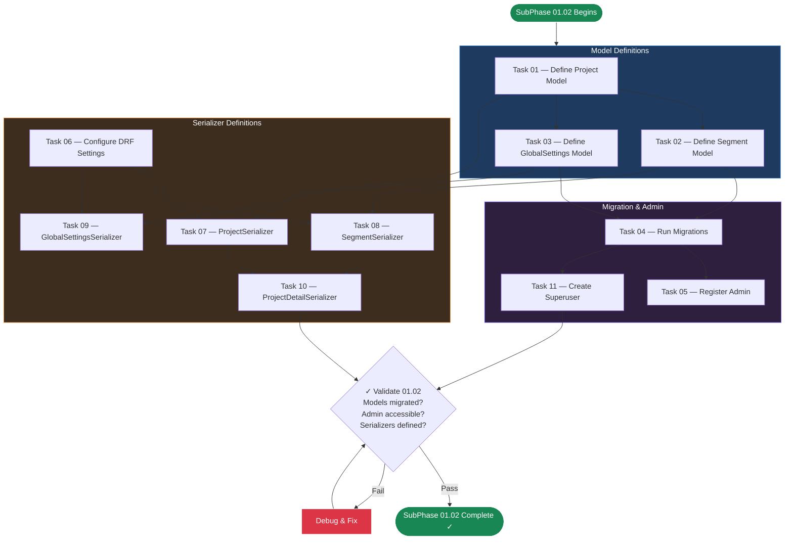

# SubPhase 01.02 — Database Models & Migrations

## Metadata

| Field                | Value                                                                          |
| -------------------- | ------------------------------------------------------------------------------ |
| **Phase**            | Phase 01 — The Skeleton                                                        |
| **Sub-Phase**        | 01.02                                                                          |
| **Name**             | Database Models & Migrations                                                   |
| **Document Type**    | Layer 2 — Sub-Phase Overview                                                   |
| **Status**           | Not Started                                                                    |
| **Dependencies**     | SubPhase 01.01 must be complete (Django project exists, `api` app exists)      |
| **Estimated Tasks**  | 11                                                                             |
| **Parent Document**  | [Phase_01_Overview.md](../Phase_01_Overview.md) (Layer 1)                      |

---

## Table of Contents

1. [Objective](#1-objective)
2. [Scope](#2-scope)
3. [Technical Context](#3-technical-context)
4. [Task List](#4-task-list)
5. [Task Details](#5-task-details)
6. [Execution Order](#6-execution-order)
7. [Files Created / Modified](#7-files-created--modified)
8. [Validation Criteria](#8-validation-criteria)
9. [Constraints Specific to This Sub-Phase](#9-constraints-specific-to-this-sub-phase)
10. [Notes & Gotchas](#10-notes--gotchas)
11. [Cross-References](#11-cross-references)

---

## 1. Objective

Implement all three core data models (**Project**, **Segment**, **GlobalSettings**) in the Django `api` app, run migrations to create the SQLite database schema, register all models in Django Admin, create Django REST Framework serializers, and configure basic DRF settings.

Upon completion of SubPhase 01.02, the developer (or AI agent) will have:
- All three database models defined in `api/models.py` with the exact field types, defaults, constraints, and relationships specified in the architecture documents.
- A fully migrated SQLite database (`db.sqlite3`) with all tables created.
- Django Admin interface configured to view and manage all three models.
- DRF serializers ready for use by the API views that SubPhase 01.03 will create.
- DRF configured in `settings.py` with appropriate default settings for a local-only, no-auth application.
- A Django superuser account for admin access during development.

**No API views, no URL routing, no frontend changes, and no API endpoints are created in this sub-phase.** Those are the responsibility of SubPhase 01.03.

---

## 2. Scope

### 2.1 In Scope

- **`Project` model definition** — UUID primary key, title, timestamps (auto), status with choices (DRAFT, PROCESSING, COMPLETED, FAILED), resolution settings (1920×1080 default), framerate (30 default), output_path.
- **`Segment` model definition** — UUID primary key, ForeignKey to Project (cascade delete), sequence_index ordering, text_content, image_prompt, image_file (ImageField), audio_file (FileField), audio_duration, is_locked boolean.
- **`GlobalSettings` model definition** — Singleton pattern with `load()` class method, default_voice_id, tts_speed, zoom_intensity, subtitle_font, subtitle_color.
- **Upload path configuration** — Callable `upload_to` functions generating `projects/{project_id}/images/` and `projects/{project_id}/audio/` paths.
- **Migrations** — `python manage.py makemigrations api` and `python manage.py migrate`.
- **Django Admin registration** — All three models with appropriate `list_display`, `list_filter`, `search_fields`.
- **DRF configuration in `settings.py`** — `REST_FRAMEWORK` dict with default pagination, renderer classes, and `AllowAny` permissions.
- **`ProjectSerializer`** — Serializes all Project fields plus computed `segment_count`.
- **`SegmentSerializer`** — Serializes all Segment fields.
- **`GlobalSettingsSerializer`** — Serializes all GlobalSettings fields.
- **`ProjectDetailSerializer`** — Nested serializer including Project fields plus a nested list of Segments.
- **Superuser creation** — `python manage.py createsuperuser` for dev admin access.

### 2.2 Out of Scope

| Exclusion                                 | Deferred To     | Reason                                                          |
| ----------------------------------------- | --------------- | --------------------------------------------------------------- |
| API ViewSets and endpoints                | SubPhase 01.03  | ViewSets depend on the serializers created here                 |
| URL routing (`api/urls.py`)               | SubPhase 01.03  | URL routing depends on ViewSets                                 |
| Root URL configuration changes            | SubPhase 01.03  | Root `urls.py` modified to include `api/urls.py` in 01.03       |
| Frontend changes (any)                    | SubPhase 01.03  | Frontend work begins after backend API is built                 |
| TypeScript interfaces                     | SubPhase 01.03  | Type definitions depend on finalized serializer output           |
| Custom model methods (beyond `load()`)    | Phase 02+       | Business logic methods are added as needed in later phases       |
| Data seeding / fixtures                   | Phase 02+       | Test data is created manually or via future import pipeline      |
| File upload handling logic                 | Phase 02        | `ImageField` and `FileField` are defined now, upload handling is Phase 02 |
| Segment CRUD operations                   | Phase 02        | Segment editing is a Phase 02 deliverable                        |
| TTS, video rendering, subtitles           | Phases 03–05    | Completely out of Phase 01 scope                                 |

---

## 3. Technical Context

### 3.1 Prerequisites from SubPhase 01.01

This sub-phase assumes the following are complete and verified:

| Prerequisite                                  | Verification Command                              |
| --------------------------------------------- | ------------------------------------------------- |
| Django project exists at `/backend`           | `ls backend/manage.py` succeeds                   |
| Virtual environment exists and is activatable | `backend\venv\Scripts\activate` (Windows)         |
| `api` app exists                              | `ls backend/api/models.py` succeeds               |
| DRF is installed                              | `pip show djangorestframework` shows version      |
| Pillow is installed                           | `pip show Pillow` shows version                   |
| `api` is in `INSTALLED_APPS`                  | Grep `settings.py` for `'api'`                    |
| `rest_framework` is in `INSTALLED_APPS`       | Grep `settings.py` for `'rest_framework'`         |
| `MEDIA_ROOT` is configured                    | Grep `settings.py` for `MEDIA_ROOT`               |
| Django server starts without errors           | `python manage.py runserver` starts on `:8000`    |

### 3.2 Database Model Definitions

All field types, defaults, and constraints are sourced from `Phase_01_Overview.md` (Layer 1, Section 3.3) and `00_Project_Overview.md` (Layer 0, Section 3.2). These specifications are **canonical** — no deviations are permitted.

#### 3.2.1 Project Model

| Field              | Django Type                     | Constraints / Defaults                                         |
| ------------------ | ------------------------------- | -------------------------------------------------------------- |
| `id`               | `UUIDField`                     | `primary_key=True`, `default=uuid.uuid4`, `editable=False`    |
| `title`            | `CharField`                     | `max_length=255`                                               |
| `created_at`       | `DateTimeField`                 | `auto_now_add=True`                                            |
| `updated_at`       | `DateTimeField`                 | `auto_now=True`                                                |
| `status`           | `CharField`                     | `max_length=20`, `choices=STATUS_CHOICES`, `default='DRAFT'`   |
| `resolution_width` | `IntegerField`                  | `default=1920`                                                 |
| `resolution_height`| `IntegerField`                  | `default=1080`                                                 |
| `framerate`        | `IntegerField`                  | `default=30`                                                   |
| `output_path`      | `CharField`                     | `max_length=500`, `blank=True`, `null=True`                    |

**Status choices:**
```python
STATUS_CHOICES = [
    ('DRAFT', 'Draft'),
    ('PROCESSING', 'Processing'),
    ('COMPLETED', 'Completed'),
    ('FAILED', 'Failed'),
]
```

**`__str__` method:** Returns `self.title`.

**Meta:**
```python
class Meta:
    ordering = ['-created_at']
```

#### 3.2.2 Segment Model

| Field              | Django Type                     | Constraints / Defaults                                         |
| ------------------ | ------------------------------- | -------------------------------------------------------------- |
| `id`               | `UUIDField`                     | `primary_key=True`, `default=uuid.uuid4`, `editable=False`    |
| `project`          | `ForeignKey(Project)`           | `on_delete=models.CASCADE`, `related_name='segments'`          |
| `sequence_index`   | `IntegerField`                  | `default=0`                                                    |
| `text_content`     | `TextField`                     | `blank=True`, `default=''`                                     |
| `image_prompt`     | `TextField`                     | `blank=True`, `default=''`                                     |
| `image_file`       | `ImageField`                    | `upload_to=segment_image_path`, `blank=True`, `null=True`      |
| `audio_file`       | `FileField`                     | `upload_to=segment_audio_path`, `blank=True`, `null=True`      |
| `audio_duration`   | `FloatField`                    | `null=True`, `blank=True`                                      |
| `is_locked`        | `BooleanField`                  | `default=False`                                                |

**Upload path callables:**
```python
def segment_image_path(instance, filename):
    return f'projects/{instance.project.id}/images/{filename}'

def segment_audio_path(instance, filename):
    return f'projects/{instance.project.id}/audio/{filename}'
```

**`__str__` method:** Returns `f"Segment {self.sequence_index} of {self.project.title}"`.

**Meta:**
```python
class Meta:
    ordering = ['sequence_index']
```

#### 3.2.3 GlobalSettings Model

| Field              | Django Type                     | Constraints / Defaults                                         |
| ------------------ | ------------------------------- | -------------------------------------------------------------- |
| `default_voice_id` | `CharField`                    | `max_length=100`, `default='af_bella'`                         |
| `tts_speed`        | `FloatField`                   | `default=1.0`                                                  |
| `zoom_intensity`   | `FloatField`                   | `default=1.3`                                                  |
| `subtitle_font`    | `CharField`                    | `max_length=255`, `blank=True`, `default=''`                   |
| `subtitle_color`   | `CharField`                    | `max_length=7`, `default='#FFFFFF'`                            |

**Singleton `load()` class method:**
```python
@classmethod
def load(cls):
    obj, created = cls.objects.get_or_create(pk=1)
    return obj
```

**`__str__` method:** Returns `"Global Settings"`.

**Meta:**
```python
class Meta:
    verbose_name = 'Global Settings'
    verbose_name_plural = 'Global Settings'
```

#### 3.2.4 Model Relationships

```
Project (1) ──────── (N) Segment
   │                       │
   │ has many               │ belongs to
   │ ordered by             │ sequence_index
   │ cascade delete         │ related_name='segments'
   │                       │
GlobalSettings (Singleton — system-wide, not project-scoped)
   │
   └── Accessed via GlobalSettings.load()
       Always pk=1, created on first access
```

### 3.3 Serializer Specifications

#### 3.3.1 ProjectSerializer

```python
class ProjectSerializer(serializers.ModelSerializer):
    segment_count = serializers.SerializerMethodField()

    class Meta:
        model = Project
        fields = [
            'id', 'title', 'created_at', 'updated_at',
            'status', 'resolution_width', 'resolution_height',
            'framerate', 'segment_count',
        ]
        read_only_fields = ['id', 'created_at', 'updated_at', 'status']

    def get_segment_count(self, obj):
        return obj.segments.count()
```

**Notes:**
- `segment_count` is a computed field, NOT a database column.
- On `POST /api/projects/`, only `title` is required. All other fields use defaults.
- `status` is read-only in the serializer — status changes happen through business logic, not direct API updates.

#### 3.3.2 SegmentSerializer

```python
class SegmentSerializer(serializers.ModelSerializer):
    class Meta:
        model = Segment
        fields = [
            'id', 'project', 'sequence_index', 'text_content',
            'image_prompt', 'image_file', 'audio_file',
            'audio_duration', 'is_locked',
        ]
        read_only_fields = ['id']
```

#### 3.3.3 GlobalSettingsSerializer

```python
class GlobalSettingsSerializer(serializers.ModelSerializer):
    class Meta:
        model = GlobalSettings
        fields = [
            'default_voice_id', 'tts_speed', 'zoom_intensity',
            'subtitle_font', 'subtitle_color',
        ]
```

#### 3.3.4 ProjectDetailSerializer

```python
class ProjectDetailSerializer(serializers.ModelSerializer):
    segments = SegmentSerializer(many=True, read_only=True)

    class Meta:
        model = Project
        fields = [
            'id', 'title', 'created_at', 'updated_at',
            'status', 'resolution_width', 'resolution_height',
            'framerate', 'output_path', 'segments',
        ]
        read_only_fields = ['id', 'created_at', 'updated_at']
```

**Notes:**
- This serializer is used for `GET /api/projects/{id}/` (single project detail).
- It includes `output_path` (not shown in list view) and the full nested `segments` array.
- `segments` are ordered by `sequence_index` (enforced by the model's `Meta.ordering`).

### 3.4 DRF Configuration Specification

The following `REST_FRAMEWORK` settings must be added to `settings.py`:

```python
REST_FRAMEWORK = {
    'DEFAULT_PERMISSION_CLASSES': [
        'rest_framework.permissions.AllowAny',
    ],
    'DEFAULT_RENDERER_CLASSES': [
        'rest_framework.renderers.JSONRenderer',
        'rest_framework.renderers.BrowsableAPIRenderer',
    ],
    'DEFAULT_PAGINATION_CLASS': 'rest_framework.pagination.PageNumberPagination',
    'PAGE_SIZE': 50,
}
```

**Rationale:**
- `AllowAny` — No authentication for this local-only, single-user application. As defined in `00_Project_Overview.md` (Layer 0, Section 14.1): "Authentication: None."
- `BrowsableAPIRenderer` — Kept for development convenience. The DRF browsable API provides a built-in testing interface.
- `PAGE_SIZE: 50` — Generous default. StoryFlow projects are unlikely to exceed dozens of items. Pagination is included for correctness but won't practically trigger in v1.0.

### 3.5 Django Admin Configuration Specification

#### 3.5.1 ProjectAdmin

```python
@admin.register(Project)
class ProjectAdmin(admin.ModelAdmin):
    list_display = ['title', 'status', 'created_at', 'updated_at']
    list_filter = ['status', 'created_at']
    search_fields = ['title']
    readonly_fields = ['id', 'created_at', 'updated_at']
```

#### 3.5.2 SegmentAdmin

```python
@admin.register(Segment)
class SegmentAdmin(admin.ModelAdmin):
    list_display = ['__str__', 'project', 'sequence_index', 'is_locked']
    list_filter = ['is_locked', 'project']
    search_fields = ['text_content', 'image_prompt']
    readonly_fields = ['id']
```

#### 3.5.3 GlobalSettingsAdmin

```python
@admin.register(GlobalSettings)
class GlobalSettingsAdmin(admin.ModelAdmin):
    list_display = ['__str__', 'default_voice_id', 'tts_speed', 'zoom_intensity']

    def has_add_permission(self, request):
        # Prevent creating multiple GlobalSettings instances
        if GlobalSettings.objects.exists():
            return False
        return super().has_add_permission(request)

    def has_delete_permission(self, request, obj=None):
        # Prevent deleting the singleton
        return False
```

**Key detail:** The `GlobalSettingsAdmin` enforces singleton behavior at the admin level — preventing creation of multiple instances and preventing deletion of the single instance.

---

## 4. Task List

| Task ID          | Task Name                                    | Est. Complexity | Dependencies       | File Reference                                           |
| ---------------- | -------------------------------------------- | --------------- | ------------------ | -------------------------------------------------------- |
| Task_01_02_01    | Define Project Model                         | Medium          | None               | [Task_01_02_01](Task_01_02_01_Create_Project_Model.md)   |
| Task_01_02_02    | Define Segment Model                         | Medium          | Task_01_02_01      | [Task_01_02_02](Task_01_02_02_Create_Segment_Model.md)   |
| Task_01_02_03    | Define GlobalSettings Model                  | Medium          | None               | [Task_01_02_03](Task_01_02_03_Create_GlobalSettings_Model.md) |
| Task_01_02_04    | Run Migrations                               | Low             | Task_01_02_01, Task_01_02_02, Task_01_02_03 | [Task_01_02_04](Task_01_02_04_Run_Migrations.md) |
| Task_01_02_05    | Register Models in Django Admin              | Low             | Task_01_02_04      | [Task_01_02_05](Task_01_02_05_Register_Admin.md)         |
| Task_01_02_06    | Configure DRF Settings                       | Low             | None               | [Task_01_02_06](Task_01_02_06_Configure_DRF_Settings.md) |
| Task_01_02_07    | Create ProjectSerializer                     | Low             | Task_01_02_01, Task_01_02_06 | [Task_01_02_07](Task_01_02_07_Create_Project_Serializer.md) |
| Task_01_02_08    | Create SegmentSerializer                     | Low             | Task_01_02_02, Task_01_02_06 | [Task_01_02_08](Task_01_02_08_Create_Segment_Serializer.md) |
| Task_01_02_09    | Create GlobalSettingsSerializer              | Low             | Task_01_02_03, Task_01_02_06 | [Task_01_02_09](Task_01_02_09_Create_GlobalSettings_Serializer.md) |
| Task_01_02_10    | Create ProjectDetailSerializer               | Low             | Task_01_02_07, Task_01_02_08 | [Task_01_02_10](Task_01_02_10_Create_ProjectDetail_Serializer.md) |
| Task_01_02_11    | Create Superuser                             | Low             | Task_01_02_04      | [Task_01_02_11](Task_01_02_11_Create_Superuser.md)       |

**Total tasks: 11** (3 Medium, 8 Low)

---

## 5. Task Details

### 5.1 Task_01_02_01 — Define Project Model

**Objective:** Define the `Project` model in `api/models.py` with all fields, constraints, and metadata as specified in Section 3.2.1.

**Steps:**
1. Open `backend/api/models.py`.
2. Add `import uuid` at the top.
3. Define `STATUS_CHOICES` as a module-level constant.
4. Define the `Project` model class with all fields from Section 3.2.1.
5. Add the `__str__` method returning `self.title`.
6. Add the `Meta` class with `ordering = ['-created_at']`.

**Files modified:**
- `backend/api/models.py`

**Key detail:** The `UUIDField` primary key must use `default=uuid.uuid4` (without parentheses — passing the callable, not calling it). Using `uuid.uuid4()` would generate the same UUID for every instance.

---

### 5.2 Task_01_02_02 — Define Segment Model

**Objective:** Define the `Segment` model in `api/models.py` with the ForeignKey relationship to Project, upload path callables, and all media-related fields.

**Steps:**
1. Define the `segment_image_path` callable function BEFORE the Segment class (module-level).
2. Define the `segment_audio_path` callable function BEFORE the Segment class (module-level).
3. Define the `Segment` model class with all fields from Section 3.2.2.
4. Add the `__str__` method returning `f"Segment {self.sequence_index} of {self.project.title}"`.
5. Add the `Meta` class with `ordering = ['sequence_index']`.

**Files modified:**
- `backend/api/models.py`

**Key detail:** The `upload_to` parameter must use the callable functions, NOT string templates. Django calls these functions at file upload time, passing the model instance and filename. The path format is `projects/{project_id}/images/{filename}` and `projects/{project_id}/audio/{filename}`.

**Key detail:** `ForeignKey` must use `related_name='segments'` so that `project.segments.all()` works correctly. This is used by the `ProjectDetailSerializer`'s nested serializer.

---

### 5.3 Task_01_02_03 — Define GlobalSettings Model

**Objective:** Define the `GlobalSettings` singleton model with the `load()` class method and all settings fields.

**Steps:**
1. Define the `GlobalSettings` model class with all fields from Section 3.2.3.
2. Implement the `load()` class method using `get_or_create(pk=1)`.
3. Add the `__str__` method returning `"Global Settings"`.
4. Add the `Meta` class with `verbose_name` and `verbose_name_plural`.

**Files modified:**
- `backend/api/models.py`

**Key detail:** The `load()` method uses `get_or_create(pk=1)`, which creates a default instance with all default field values on first access. This avoids the need for data migrations or fixture loading. The GlobalSettings table will always have exactly one row with `pk=1`.

**Key detail:** `GlobalSettings` has NO primary key override — it uses Django's default `BigAutoField` (configured in `settings.py`). The `pk=1` in `get_or_create` refers to this auto-generated ID.

---

### 5.4 Task_01_02_04 — Run Migrations

**Objective:** Generate and apply Django migrations for all three models, creating the SQLite database schema.

**Steps:**
1. Ensure the virtual environment is activated.
2. Run `python manage.py makemigrations api`.
3. Verify the migration file was created at `backend/api/migrations/0001_initial.py`.
4. Run `python manage.py migrate`.
5. Verify `backend/db.sqlite3` file exists.
6. Verify the migration applied successfully by checking the output for `OK` status.

**Files created:**
- `backend/api/migrations/0001_initial.py` (auto-generated)
- `backend/db.sqlite3` (auto-generated)

**Key detail:** Both `makemigrations` and `migrate` must complete with zero errors. If errors occur, they typically indicate model definition issues (e.g., missing imports, incorrect field arguments).

---

### 5.5 Task_01_02_05 — Register Models in Django Admin

**Objective:** Register all three models in Django Admin with appropriate display configurations.

**Steps:**
1. Open `backend/api/admin.py`.
2. Import all three models: `Project`, `Segment`, `GlobalSettings`.
3. Implement `ProjectAdmin` as specified in Section 3.5.1.
4. Implement `SegmentAdmin` as specified in Section 3.5.2.
5. Implement `GlobalSettingsAdmin` as specified in Section 3.5.3 — including singleton enforcement via `has_add_permission` and `has_delete_permission`.
6. Verify by starting the dev server and navigating to `http://localhost:8000/admin/`.

**Files modified:**
- `backend/api/admin.py`

**Key detail:** The `GlobalSettingsAdmin` must override `has_add_permission` to prevent creating multiple instances (returns `False` if one already exists) and `has_delete_permission` to prevent deleting the singleton (always returns `False`).

---

### 5.6 Task_01_02_06 — Configure DRF Settings

**Objective:** Add the `REST_FRAMEWORK` configuration dictionary to `settings.py`.

**Steps:**
1. Open `backend/storyflow_backend/settings.py`.
2. Add the `REST_FRAMEWORK` dictionary as specified in Section 3.4.
3. Verify Django still starts without errors.

**Files modified:**
- `backend/storyflow_backend/settings.py`

**Key detail:** `AllowAny` is intentional for this local-only, no-auth application. Do NOT add `IsAuthenticated` or any other permission class. This aligns with the project constraint: "Authentication: None."

---

### 5.7 Task_01_02_07 — Create ProjectSerializer

**Objective:** Create the `ProjectSerializer` with a computed `segment_count` field.

**Steps:**
1. Create `backend/api/serializers.py` (new file).
2. Import `serializers` from `rest_framework`.
3. Import the `Project` model.
4. Implement `ProjectSerializer` as specified in Section 3.3.1.
5. Include the `get_segment_count` method.

**Files created:**
- `backend/api/serializers.py`

**Key detail:** The `segment_count` field uses `SerializerMethodField`. The `get_segment_count` method calls `obj.segments.count()`, which relies on the `related_name='segments'` set on the Segment model's ForeignKey.

---

### 5.8 Task_01_02_08 — Create SegmentSerializer

**Objective:** Create the `SegmentSerializer` for Segment model serialization.

**Steps:**
1. Open `backend/api/serializers.py`.
2. Import the `Segment` model.
3. Implement `SegmentSerializer` as specified in Section 3.3.2.

**Files modified:**
- `backend/api/serializers.py`

---

### 5.9 Task_01_02_09 — Create GlobalSettingsSerializer

**Objective:** Create the `GlobalSettingsSerializer` for GlobalSettings model serialization.

**Steps:**
1. Open `backend/api/serializers.py`.
2. Import the `GlobalSettings` model.
3. Implement `GlobalSettingsSerializer` as specified in Section 3.3.3.

**Files modified:**
- `backend/api/serializers.py`

---

### 5.10 Task_01_02_10 — Create ProjectDetailSerializer

**Objective:** Create the nested `ProjectDetailSerializer` that includes full project data plus an array of its segments.

**Steps:**
1. Open `backend/api/serializers.py`.
2. Implement `ProjectDetailSerializer` as specified in Section 3.3.4.
3. Ensure the `segments` field references the existing `SegmentSerializer`.

**Files modified:**
- `backend/api/serializers.py`

**Key detail:** The `segments` field is `SegmentSerializer(many=True, read_only=True)`. This creates a nested JSON array in the API response. Segments are ordered by `sequence_index` because the Segment model's `Meta.ordering` enforces this.

---

### 5.11 Task_01_02_11 — Create Superuser

**Objective:** Create a Django superuser account for accessing the admin interface during development.

**Steps:**
1. Run `python manage.py createsuperuser`.
2. Use development credentials (e.g., username: `admin`, email: `admin@localhost`, password: `admin`).
3. Verify login at `http://localhost:8000/admin/`.
4. Verify all three models (Projects, Segments, Global Settings) appear in the admin interface.
5. Create a test Project through the admin to verify the model works.

**Files modified:** None (superuser data is stored in the SQLite database).

**Key detail:** The superuser credentials are for local development ONLY. There is no authentication in the application itself — the superuser is solely for Django Admin access during development and testing.

---

## 6. Execution Order

### 6.1 Task Dependency Chain

```
Task_01_02_01 (Project Model) ──┐
Task_01_02_02 (Segment Model) ──┼── Task_01_02_04 (Run Migrations)
Task_01_02_03 (GlobalSettings) ──┘         │
                                           ├── Task_01_02_05 (Register Admin)
                                           └── Task_01_02_11 (Create Superuser)

Task_01_02_06 (DRF Settings) ──────────────┐
Task_01_02_01 (Project Model) ─────────────┼── Task_01_02_07 (ProjectSerializer)
Task_01_02_02 (Segment Model) ─────────────┼── Task_01_02_08 (SegmentSerializer)
Task_01_02_03 (GlobalSettings) ────────────┼── Task_01_02_09 (GlobalSettingsSerializer)
Task_01_02_07 + Task_01_02_08 ─────────────┴── Task_01_02_10 (ProjectDetailSerializer)
```

### 6.2 Recommended Execution Sequence

| Order | Task ID       | Task Name                          | Reason                                             |
| ----- | ------------- | ---------------------------------- | -------------------------------------------------- |
| 1     | Task_01_02_01 | Define Project Model               | No dependencies, other models may reference it     |
| 2     | Task_01_02_02 | Define Segment Model               | ForeignKey to Project — Project must be defined first |
| 3     | Task_01_02_03 | Define GlobalSettings Model        | Independent, but grouped with other models          |
| 4     | Task_01_02_04 | Run Migrations                     | All models must be defined before migrating         |
| 5     | Task_01_02_05 | Register Models in Django Admin    | Models must be migrated to test admin               |
| 6     | Task_01_02_06 | Configure DRF Settings             | Independent of models, needed before serializers    |
| 7     | Task_01_02_07 | Create ProjectSerializer           | Requires model + DRF config                         |
| 8     | Task_01_02_08 | Create SegmentSerializer           | Requires model + DRF config                         |
| 9     | Task_01_02_09 | Create GlobalSettingsSerializer    | Requires model + DRF config                         |
| 10    | Task_01_02_10 | Create ProjectDetailSerializer     | Requires ProjectSerializer + SegmentSerializer      |
| 11    | Task_01_02_11 | Create Superuser                   | Requires migrations applied, done last              |

### 6.3 Execution Order Flowchart



---

## 7. Files Created / Modified

### 7.1 Files Created

| File Path                                      | Created By       | Description                                      |
| ---------------------------------------------- | ---------------- | ------------------------------------------------ |
| `backend/api/serializers.py`                   | Task_01_02_07    | DRF serializers for all models                   |
| `backend/api/migrations/0001_initial.py`       | Task_01_02_04    | Auto-generated initial migration                 |
| `backend/db.sqlite3`                           | Task_01_02_04    | SQLite database file (auto-generated)            |

### 7.2 Files Modified

| File Path                                      | Modified By      | Changes Made                                     |
| ---------------------------------------------- | ---------------- | ------------------------------------------------ |
| `backend/api/models.py`                        | Tasks 01–03      | Added Project, Segment, GlobalSettings models    |
| `backend/api/admin.py`                         | Task_01_02_05    | Added admin registrations for all three models   |
| `backend/storyflow_backend/settings.py`        | Task_01_02_06    | Added `REST_FRAMEWORK` configuration dict        |

### 7.3 Total File Count

| Category            | Count |
| ------------------- | ----- |
| Files created       | 3     |
| Files modified      | 3     |
| **Total affected**  | **6** |

---

## 8. Validation Criteria

SubPhase 01.02 is considered **COMPLETE** only when ALL of the following criteria are met:

### Model Validation

- [ ] `backend/api/models.py` contains `Project`, `Segment`, and `GlobalSettings` model classes.
- [ ] `Project` model has all 9 fields as specified in Section 3.2.1 (id, title, created_at, updated_at, status, resolution_width, resolution_height, framerate, output_path).
- [ ] `Project.status` uses `STATUS_CHOICES` with four values: DRAFT, PROCESSING, COMPLETED, FAILED.
- [ ] `Segment` model has all 9 fields as specified in Section 3.2.2 (id, project, sequence_index, text_content, image_prompt, image_file, audio_file, audio_duration, is_locked).
- [ ] `Segment.project` is a `ForeignKey` with `on_delete=CASCADE` and `related_name='segments'`.
- [ ] `Segment.image_file` and `Segment.audio_file` use callable `upload_to` functions generating `projects/{project_id}/images/` and `projects/{project_id}/audio/` paths.
- [ ] `GlobalSettings` model has all 5 fields as specified in Section 3.2.3 (default_voice_id, tts_speed, zoom_intensity, subtitle_font, subtitle_color).
- [ ] `GlobalSettings.load()` class method returns the singleton instance, creating it if it doesn't exist.
- [ ] All models have appropriate `__str__` methods and `Meta` classes.

### Migration Validation

- [ ] `python manage.py makemigrations api` generates `0001_initial.py` without errors.
- [ ] `python manage.py migrate` completes with zero errors.
- [ ] `backend/db.sqlite3` file exists.
- [ ] Running `python manage.py migrate` again shows "No migrations to apply."

### Admin Validation

- [ ] Django Admin at `http://localhost:8000/admin/` is accessible.
- [ ] Superuser can log in to the admin interface.
- [ ] All three models (Projects, Segments, Global Settings) appear in the admin.
- [ ] A Project can be created through the admin with all fields.
- [ ] A Segment can be created through the admin linked to an existing Project.
- [ ] GlobalSettings admin enforces singleton behavior (no add after first creation, no delete).
- [ ] `ProjectAdmin.list_display` shows title, status, created_at, updated_at.
- [ ] `SegmentAdmin.list_display` shows __str__, project, sequence_index, is_locked.

### Serializer Validation

- [ ] `backend/api/serializers.py` exists with four serializer classes.
- [ ] `ProjectSerializer` includes a computed `segment_count` field.
- [ ] `ProjectSerializer.read_only_fields` includes `id`, `created_at`, `updated_at`, `status`.
- [ ] `SegmentSerializer` serializes all Segment fields.
- [ ] `GlobalSettingsSerializer` serializes all GlobalSettings fields.
- [ ] `ProjectDetailSerializer` includes nested `segments` field using `SegmentSerializer(many=True, read_only=True)`.

### DRF Configuration Validation

- [ ] `REST_FRAMEWORK` dict exists in `settings.py`.
- [ ] `DEFAULT_PERMISSION_CLASSES` is set to `['rest_framework.permissions.AllowAny']`.
- [ ] `BrowsableAPIRenderer` is included in `DEFAULT_RENDERER_CLASSES`.
- [ ] `PAGE_SIZE` is set (e.g., 50).

### Server Validation

- [ ] `python manage.py runserver` starts without errors after all changes.
- [ ] `python manage.py check` reports no issues.

---

## 9. Constraints Specific to This Sub-Phase

| Constraint                                       | Reason                                                  |
| ------------------------------------------------ | ------------------------------------------------------- |
| **No API views or endpoints**                    | Views are SubPhase 01.03's responsibility               |
| **No `api/urls.py` file**                        | URL routing is SubPhase 01.03                            |
| **No root `urls.py` modifications**              | Root URL includes are SubPhase 01.03                     |
| **No frontend changes**                          | All frontend work is SubPhase 01.03                      |
| **No custom model managers**                     | Keep models simple for v1.0                              |
| **No model signals**                             | Avoid hidden complexity — explicit logic in views later  |
| **No data seeding beyond superuser**             | Test data is created via admin or future import pipeline |
| **No custom model validation beyond field types**| Complex validation is deferred to serializer/view level  |
| **No abstract base models**                      | Three models are simple enough without inheritance       |
| **`serializers.py` ONLY — no `serializers/` package** | Keep it simple with one file until it grows too large |

---

## 10. Notes & Gotchas

### 10.1 Common Pitfalls

1. **`uuid.uuid4` vs `uuid.uuid4()`** — The `default` parameter for `UUIDField` must be `uuid.uuid4` (without parentheses). Passing `uuid.uuid4()` evaluates the UUID once at class definition time, and every instance would get the same UUID.

2. **Forgetting `related_name='segments'` on the ForeignKey** — Without `related_name`, the reverse relation defaults to `segment_set`, which breaks the `ProjectDetailSerializer` and the `get_segment_count` method.

3. **Upload path callable must be a module-level function** — Django serializes migration files and needs to reference `upload_to` callables by their import path. Lambdas and nested functions will cause migration serialization errors.

4. **`CorsMiddleware` placement** — Already configured in SubPhase 01.01, but verify it hasn't been accidentally moved. It MUST be before `CommonMiddleware`.

5. **`GlobalSettings.load()` using `get_or_create` not `first()`** — Using `first()` returns `None` if no instance exists, requiring explicit creation logic. `get_or_create(pk=1)` is cleaner and atomic.

6. **Forgetting to import `uuid`** — The `Project` and `Segment` models both use `uuid.uuid4` as a default. Ensure `import uuid` is at the top of `models.py`.

7. **`ImageField` requires Pillow** — If Pillow is not installed, `makemigrations` will fail with an error about missing Pillow. This should already be installed from SubPhase 01.01.

8. **Serializer import order** — `ProjectDetailSerializer` must be defined AFTER `SegmentSerializer` because it references it. If using string-based references, this is not an issue, but explicit class references require correct ordering.

### 10.2 SQLite-Specific Notes

- SQLite does not enforce `CharField.max_length` at the database level — it's enforced by Django's validation layer (serializers, forms).
- SQLite auto-increment for `BigAutoField` works via `ROWID`.
- UUID fields are stored as text in SQLite (not native UUID type). This is fine for StoryFlow's scale.
- `db.sqlite3` should be git-ignored (already in `.gitignore` from SubPhase 01.01).

### 10.3 Testing Models in Django Shell

After migrations are applied, the models can be tested in the Django shell:

```bash
python manage.py shell
```

```python
from api.models import Project, Segment, GlobalSettings

# Create a project
p = Project.objects.create(title="Test Project")
print(p.id)  # UUID
print(p.status)  # DRAFT
print(p.resolution_width)  # 1920

# Test GlobalSettings singleton
gs = GlobalSettings.load()
print(gs.default_voice_id)  # af_bella
print(gs.tts_speed)  # 1.0

# Test relationship
s = Segment.objects.create(project=p, sequence_index=0, text_content="Hello world")
print(p.segments.count())  # 1
print(s.project.title)  # Test Project
```

This is useful for verifying model behavior before the admin or API layer is built.

---

## 11. Cross-References

### 11.1 References to Parent Document (Layer 1)

| Reference                                             | Section in `Phase_01_Overview.md`        |
| ----------------------------------------------------- | ---------------------------------------- |
| SubPhase 01.02 scope and deliverables                 | Section 4.2                              |
| Database model definitions (canonical)                | Section 3.3                              |
| Model relationships diagram                           | Section 3.3 (relationship diagram)       |
| API endpoints (Phase 01 subset)                       | Section 3.5                              |
| Files created in Phase 01 (full inventory)            | Section 7                                |
| Sub-phase execution order                             | Section 5                                |
| Phase 01 constraints                                  | Section 9                                |
| Phase 01 exit criteria (backend checklist)            | Section 10                               |

### 11.2 References to Layer 0

| Reference                                             | Section in `00_Project_Overview.md`      |
| ----------------------------------------------------- | ---------------------------------------- |
| Core model definitions (source of truth)              | Section 3.2                              |
| Model relationships                                   | Section 3.3                              |
| API surface (full list)                               | Section 6                                |
| Development constraints (no auth, SQLite only)        | Section 14                               |
| Quality standards (PEP 8, docstrings)                 | Section 15                               |

### 11.3 Reference to SubPhase 01.01

| What 01.01 Provides                              | What 01.02 Needs                                          |
| ------------------------------------------------ | --------------------------------------------------------- |
| Django project at `/backend`                     | `manage.py` commands (`makemigrations`, `migrate`, etc.)  |
| `api` app with empty `models.py`                 | Target file for model definitions                          |
| `rest_framework` in `INSTALLED_APPS`             | DRF serializer imports                                     |
| Pillow installed                                 | `ImageField` support                                       |
| `MEDIA_ROOT` configured                          | `upload_to` paths resolve correctly                        |
| Django server starts                             | Prerequisite for migration commands                        |

### 11.4 Forward Reference to SubPhase 01.03

SubPhase 01.03 — **Dashboard UI & Basic API** — directly builds upon the foundation established here:

| What 01.02 Creates                              | What 01.03 Uses It For                                    |
| ------------------------------------------------ | --------------------------------------------------------- |
| `Project` model                                  | `ProjectViewSet` queries Projects from database           |
| `Segment` model                                  | `ProjectDetailSerializer` nests Segments in response      |
| `ProjectSerializer`                              | Used by `ProjectViewSet.list()` and `ProjectViewSet.create()` |
| `ProjectDetailSerializer`                        | Used by `ProjectViewSet.retrieve()`                       |
| `REST_FRAMEWORK` settings                        | ViewSets use configured permissions and renderers         |
| `db.sqlite3` with schema                         | API endpoints read/write to this database                 |
| Django Admin with superuser                      | Used for manual data verification during development      |

---

*End of Document — SubPhase_01_02_Overview.md*
*This is a Layer 2 document. It derives authority from [Phase_01_Overview.md](../Phase_01_Overview.md) (Layer 1).*
*All Task Documents (Layer 3) within SubPhase 01.02 must be consistent with this document.*
