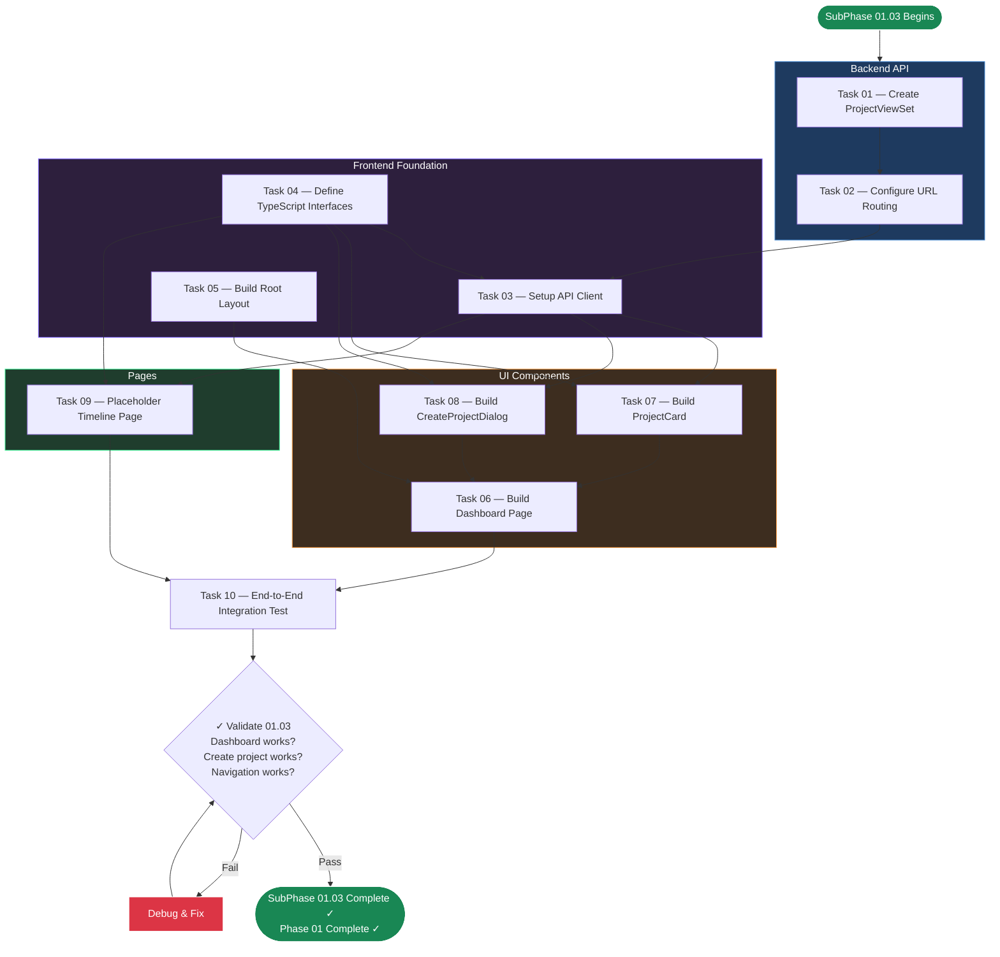

# SubPhase 01.03 — Dashboard UI & Basic API

## Metadata

| Field                | Value                                                                          |
| -------------------- | ------------------------------------------------------------------------------ |
| **Phase**            | Phase 01 — The Skeleton                                                        |
| **Sub-Phase**        | 01.03                                                                          |
| **Name**             | Dashboard UI & Basic API                                                       |
| **Document Type**    | Layer 2 — Sub-Phase Overview                                                   |
| **Status**           | Not Started                                                                    |
| **Dependencies**     | SubPhase 01.02 must be complete (models exist, serializers exist, DB migrated) |
| **Estimated Tasks**  | 10                                                                             |
| **Parent Document**  | [Phase_01_Overview.md](../Phase_01_Overview.md) (Layer 1)                      |

---

## Table of Contents

1. [Objective](#1-objective)
2. [Scope](#2-scope)
3. [Technical Context](#3-technical-context)
4. [Task List](#4-task-list)
5. [Task Details](#5-task-details)
6. [Execution Order](#6-execution-order)
7. [Files Created / Modified](#7-files-created--modified)
8. [Validation Criteria](#8-validation-criteria)
9. [Constraints Specific to This Sub-Phase](#9-constraints-specific-to-this-sub-phase)
10. [Notes & Gotchas](#10-notes--gotchas)
11. [Cross-References](#11-cross-references)

---

## 1. Objective

Build the first functional API endpoints, create the frontend dashboard page, wire up frontend-to-backend communication, and deliver a working **end-to-end flow**: user opens the app → sees project list (or empty state) → creates a new project → sees it in the list → clicks to navigate to a placeholder project page.

Upon completion of SubPhase 01.03, the developer (or AI agent) will have:
- A working REST API with three endpoints: list projects, create project, get project detail.
- A dashboard page that fetches and displays projects from the backend.
- A "Create Project" dialog that submits to the backend and refreshes the list.
- A `ProjectCard` component displaying project metadata.
- A placeholder timeline page at `/projects/{id}` showing "Coming in Phase 02."
- A fully configured Axios API client and TypeScript interface definitions.
- The first complete frontend-to-backend round trip working through CORS.

This is the **culmination of Phase 01** — the point where all three sub-phases come together into a functioning application skeleton.

---

## 2. Scope

### 2.1 In Scope

- **`ProjectViewSet` implementation** — Supports `list` (GET /api/projects/), `create` (POST /api/projects/), and `retrieve` (GET /api/projects/{id}/) actions.
- **API URL routing** — `api/urls.py` with DRF `DefaultRouter`, root `storyflow_backend/urls.py` updated to include `api/urls.py` and media serving.
- **Frontend API client** — `lib/api.ts` with Axios instance configured for `baseURL: 'http://localhost:8000'` and API helper functions.
- **TypeScript interfaces** — `lib/types.ts` with `Project`, `Segment`, `GlobalSettings`, `CreateProjectPayload`, and response types.
- **Dashboard page** — `app/page.tsx` fetching project list on mount, displaying `ProjectCard` grid or empty state.
- **`ProjectCard` component** — Displays title, status badge, creation date, segment count. Styled with Tailwind + Shadcn/UI `Card`.
- **"Create Project" dialog** — Shadcn/UI `Dialog` with title input, submits via POST, refreshes list on success.
- **Root layout** — `app/layout.tsx` with application header ("StoryFlow"), Tailwind base styles, font configuration.
- **Placeholder timeline page** — `app/projects/[id]/page.tsx` fetching project detail and showing "Timeline Editor — Coming in Phase 02."
- **Media file serving** — Django dev server configured to serve media files via `urlpatterns += static(...)`.

### 2.2 Out of Scope

| Exclusion                                    | Deferred To     | Reason                                                          |
| -------------------------------------------- | --------------- | --------------------------------------------------------------- |
| Segment CRUD API                             | Phase 02        | Segment editing is a Phase 02 deliverable                       |
| Import/parse pipeline                        | Phase 02        | Bulk segment creation from text input is Phase 02               |
| Timeline editor UI                           | Phase 02        | The placeholder page is replaced with a full editor in Phase 02 |
| Image upload UI or API                       | Phase 02        | File upload handling is Phase 02                                |
| Project deletion                             | Phase 02        | Delete operations are added as needed in Phase 02               |
| Project editing (PATCH)                      | Phase 02        | Only create and read in Phase 01                                |
| State management library (Zustand)           | Phase 02        | Simple `useState` + `useEffect` is sufficient for Phase 01      |
| TanStack Query                               | Phase 02        | Raw Axios calls are sufficient for Phase 01's 3 endpoints       |
| Error boundary components                    | Phase 02+       | Basic error handling only in Phase 01                            |
| Loading skeleton components                  | Phase 02+       | Simple "Loading..." text is sufficient for Phase 01              |
| TTS, video rendering, subtitles              | Phases 03–05    | Completely out of Phase 01 scope                                 |
| Authentication / authorization               | Never           | Local-only, single-user application                              |

---

## 3. Technical Context

### 3.1 Prerequisites from SubPhase 01.02

This sub-phase assumes the following are complete and verified:

| Prerequisite                                  | Verification                                       |
| --------------------------------------------- | -------------------------------------------------- |
| `Project` model exists with all fields        | `python manage.py shell` → `from api.models import Project` |
| `Segment` model exists with FK to Project     | `Segment.objects.filter(project=p)` works           |
| `GlobalSettings` model exists as singleton    | `GlobalSettings.load()` returns instance            |
| Database migrated (`db.sqlite3` exists)       | `python manage.py migrate` shows "No migrations to apply" |
| `ProjectSerializer` exists with `segment_count` | Import succeeds from `api.serializers`            |
| `ProjectDetailSerializer` exists with nested segments | Import succeeds from `api.serializers`      |
| `SegmentSerializer` exists                    | Import succeeds from `api.serializers`              |
| `REST_FRAMEWORK` settings configured          | `AllowAny` permissions, `BrowsableAPIRenderer`      |
| Django Admin functional with superuser        | Login at `http://localhost:8000/admin/` works        |

### 3.2 API Endpoint Specifications

As defined in `Phase_01_Overview.md` (Layer 1, Section 3.5), Phase 01 implements 3 of the 7 total API endpoints:

#### 3.2.1 GET /api/projects/ — List All Projects

**ViewSet action:** `list`

**Serializer:** `ProjectSerializer`

**Response (200 OK):**
```json
{
  "count": 1,
  "next": null,
  "previous": null,
  "results": [
    {
      "id": "uuid-string",
      "title": "My First Project",
      "created_at": "2026-02-16T12:00:00Z",
      "updated_at": "2026-02-16T12:00:00Z",
      "status": "DRAFT",
      "resolution_width": 1920,
      "resolution_height": 1080,
      "framerate": 30,
      "segment_count": 0
    }
  ]
}
```

**Notes:**
- Response is paginated (due to `DEFAULT_PAGINATION_CLASS` in DRF settings). The `results` array contains the actual project list.
- Projects are ordered by `-created_at` (newest first), enforced by the model's `Meta.ordering`.
- The frontend must handle the paginated response format (access `response.data.results`).

#### 3.2.2 POST /api/projects/ — Create a New Project

**ViewSet action:** `create`

**Serializer:** `ProjectSerializer`

**Request body:**
```json
{
  "title": "My First Project"
}
```

**Response (201 Created):**
```json
{
  "id": "uuid-string",
  "title": "My First Project",
  "created_at": "2026-02-16T12:00:00Z",
  "updated_at": "2026-02-16T12:00:00Z",
  "status": "DRAFT",
  "resolution_width": 1920,
  "resolution_height": 1080,
  "framerate": 30,
  "segment_count": 0
}
```

**Notes:**
- Only `title` is required. All other fields use defaults.
- `status` defaults to `'DRAFT'` and is read-only in the serializer.
- `segment_count` is computed and always `0` for a new project.

#### 3.2.3 GET /api/projects/{id}/ — Get Project Detail

**ViewSet action:** `retrieve`

**Serializer:** `ProjectDetailSerializer` (different from list serializer)

**Response (200 OK):**
```json
{
  "id": "uuid-string",
  "title": "My First Project",
  "created_at": "2026-02-16T12:00:00Z",
  "updated_at": "2026-02-16T12:00:00Z",
  "status": "DRAFT",
  "resolution_width": 1920,
  "resolution_height": 1080,
  "framerate": 30,
  "output_path": null,
  "segments": []
}
```

**Notes:**
- Uses `ProjectDetailSerializer` which includes `output_path` and nested `segments` array.
- The `segments` array will be empty for new projects (populated in Phase 02 via import pipeline).

### 3.3 ViewSet Implementation Specification

```python
from rest_framework import viewsets
from .models import Project
from .serializers import ProjectSerializer, ProjectDetailSerializer


class ProjectViewSet(viewsets.ModelViewSet):
    queryset = Project.objects.all()
    serializer_class = ProjectSerializer
    http_method_names = ['get', 'post', 'head', 'options']

    def get_serializer_class(self):
        if self.action == 'retrieve':
            return ProjectDetailSerializer
        return ProjectSerializer
```

**Key decisions:**
- `http_method_names` restricts to `GET` and `POST` only — no `PUT`, `PATCH`, or `DELETE` in Phase 01.
- `get_serializer_class` returns `ProjectDetailSerializer` for the retrieve action (single project) and `ProjectSerializer` for list and create actions.
- Uses `ModelViewSet` but effectively only exposes `list`, `create`, and `retrieve` due to `http_method_names` restriction.

### 3.4 URL Routing Specification

**`backend/api/urls.py`** (new file):
```python
from django.urls import path, include
from rest_framework.routers import DefaultRouter
from .views import ProjectViewSet

router = DefaultRouter()
router.register(r'projects', ProjectViewSet)

urlpatterns = [
    path('', include(router.urls)),
]
```

**`backend/storyflow_backend/urls.py`** (modified):
```python
from django.contrib import admin
from django.urls import path, include
from django.conf import settings
from django.conf.urls.static import static

urlpatterns = [
    path('admin/', admin.site.urls),
    path('api/', include('api.urls')),
]

if settings.DEBUG:
    urlpatterns += static(settings.MEDIA_URL, document_root=settings.MEDIA_ROOT)
```

**Resulting URL patterns:**
| URL Pattern                  | View                          | Name                    |
| ---------------------------- | ----------------------------- | ----------------------- |
| `/api/projects/`             | `ProjectViewSet` (list/create)| `project-list`          |
| `/api/projects/{uuid}/`      | `ProjectViewSet` (retrieve)   | `project-detail`        |
| `/admin/`                    | Django Admin                  | —                       |
| `/media/<path>`              | Media file serving (dev only) | —                       |

### 3.5 Frontend Architecture Decisions

As defined in `Phase_01_Overview.md` (Layer 1, Section 4.3):

1. **Client-side data fetching** — The dashboard uses `useEffect` + `useState` for data fetching, NOT Next.js Server Components for data loading. The API is on a different origin (`localhost:8000`) which complicates SSR. Client-side fetching with Axios is the simplest correct approach for Phase 01.

2. **No state management library** — Zustand is in the tech stack but is NOT used in Phase 01. Simple React state (`useState`, `useEffect`) is sufficient for listing and creating projects. Zustand is introduced in Phase 02 when state becomes more complex.

3. **No TanStack Query** — Similarly, raw Axios calls are sufficient for Phase 01's 3 endpoints. TanStack Query can be introduced in Phase 02 if needed.

4. **Refetch after mutation** — After creating a project, the project list is refetched by calling the API again. No optimistic updates, no cache invalidation — just a simple refetch.

5. **Component library** — Shadcn/UI components (`Button`, `Card`, `Dialog`, `Input`, `Badge`) are the foundation. Custom components (`ProjectCard`, `CreateProjectDialog`) compose Shadcn primitives.

### 3.6 TypeScript Interface Definitions

**`frontend/lib/types.ts`:**
```typescript
export interface Project {
  id: string;
  title: string;
  created_at: string;
  updated_at: string;
  status: 'DRAFT' | 'PROCESSING' | 'COMPLETED' | 'FAILED';
  resolution_width: number;
  resolution_height: number;
  framerate: number;
  segment_count: number;
}

export interface Segment {
  id: string;
  project: string;
  sequence_index: number;
  text_content: string;
  image_prompt: string;
  image_file: string | null;
  audio_file: string | null;
  audio_duration: number | null;
  is_locked: boolean;
}

export interface GlobalSettings {
  default_voice_id: string;
  tts_speed: number;
  zoom_intensity: number;
  subtitle_font: string;
  subtitle_color: string;
}

export interface ProjectDetail extends Omit<Project, 'segment_count'> {
  output_path: string | null;
  segments: Segment[];
}

export interface CreateProjectPayload {
  title: string;
}

export interface PaginatedResponse<T> {
  count: number;
  next: string | null;
  previous: string | null;
  results: T[];
}
```

### 3.7 API Client Specification

**`frontend/lib/api.ts`:**
```typescript
import axios from 'axios';
import { Project, ProjectDetail, CreateProjectPayload, PaginatedResponse } from './types';

const api = axios.create({
  baseURL: 'http://localhost:8000',
  headers: {
    'Content-Type': 'application/json',
  },
});

export async function getProjects(): Promise<PaginatedResponse<Project>> {
  const response = await api.get<PaginatedResponse<Project>>('/api/projects/');
  return response.data;
}

export async function getProject(id: string): Promise<ProjectDetail> {
  const response = await api.get<ProjectDetail>(`/api/projects/${id}/`);
  return response.data;
}

export async function createProject(payload: CreateProjectPayload): Promise<Project> {
  const response = await api.post<Project>('/api/projects/', payload);
  return response.data;
}

export default api;
```

**Key details:**
- `baseURL` is `http://localhost:8000` (the Django dev server).
- Trailing slashes on API paths are required (Django's `APPEND_SLASH` behavior).
- Functions return the parsed response data, not the Axios response object.
- TypeScript generics ensure type safety on all API calls.

### 3.8 Component Specifications

#### 3.8.1 ProjectCard Component

**File:** `frontend/components/ProjectCard.tsx`

**Props:**
```typescript
interface ProjectCardProps {
  project: Project;
}
```

**Behavior:**
- Renders a Shadcn/UI `Card` component.
- Displays: project title (CardTitle), status as a `Badge`, creation date (formatted), segment count.
- The entire card is wrapped in a Next.js `Link` to `/projects/{id}`.
- Status badge color varies by status:
  - `DRAFT` → default/gray
  - `PROCESSING` → yellow/warning
  - `COMPLETED` → green/success
  - `FAILED` → red/destructive

#### 3.8.2 CreateProjectDialog Component

**File:** `frontend/components/CreateProjectDialog.tsx`

**Props:**
```typescript
interface CreateProjectDialogProps {
  onProjectCreated: () => void;
}
```

**Behavior:**
- Uses Shadcn/UI `Dialog`, `DialogContent`, `DialogHeader`, `DialogTitle`, `DialogFooter`.
- Contains a controlled `Input` for the project title.
- "Create" button submits via `createProject()` from `lib/api.ts`.
- On success: closes dialog, calls `onProjectCreated()` callback (triggers list refetch).
- On error: displays an inline error message.
- Button shows loading state during submission.
- Title input is required — button disabled if empty.

#### 3.8.3 Dashboard Page

**File:** `frontend/app/page.tsx`

**Behavior:**
- Marked with `'use client'` directive (client component for data fetching).
- On mount: calls `getProjects()` from `lib/api.ts`.
- Manages states: `projects` (array), `loading` (boolean), `error` (string | null).
- If loading: shows "Loading projects..."
- If error: shows error message.
- If no projects: shows empty state — "No projects yet. Create your first project!" with a CTA button.
- If projects exist: renders a responsive grid of `ProjectCard` components.
- Header area contains: "StoryFlow" title and "Create Project" button that opens `CreateProjectDialog`.
- `onProjectCreated` callback refetches the project list.

#### 3.8.4 Root Layout

**File:** `frontend/app/layout.tsx`

**Behavior:**
- Sets `<html lang="en">` and applies Tailwind body classes.
- Configures font: Inter (from `next/font/google`) or system font stack.
- Wraps children in a container with max-width and padding.
- Includes a header bar with "StoryFlow" title/logo.
- Sets metadata: `title: 'StoryFlow'`, `description: 'Semi-Automated Narrative Video Engine'`.

#### 3.8.5 Placeholder Timeline Page

**File:** `frontend/app/projects/[id]/page.tsx`

**Behavior:**
- Marked with `'use client'` directive.
- Reads `params.id` from the URL.
- Fetches project detail from `getProject(id)` on mount.
- Displays: project title, "Timeline Editor — Coming in Phase 02" message.
- Includes a "Back to Dashboard" link.

---

## 4. Task List

| Task ID          | Task Name                              | Est. Complexity | Dependencies              | File Reference                                                   |
| ---------------- | -------------------------------------- | --------------- | ------------------------- | ---------------------------------------------------------------- |
| Task_01_03_01    | Create ProjectViewSet                  | Medium          | None (models/serializers from 01.02) | [Task_01_03_01](Task_01_03_01_Create_Project_ViewSet.md)  |
| Task_01_03_02    | Configure URL Routing                  | Low             | Task_01_03_01             | [Task_01_03_02](Task_01_03_02_Configure_URL_Routing.md)          |
| Task_01_03_03    | Setup Frontend API Client              | Medium          | None                      | [Task_01_03_03](Task_01_03_03_Setup_Frontend_API_Client.md)      |
| Task_01_03_04    | Define TypeScript Interfaces           | Low             | None                      | [Task_01_03_04](Task_01_03_04_Define_TypeScript_Interfaces.md)   |
| Task_01_03_05    | Build Root Layout                      | Low             | None                      | [Task_01_03_05](Task_01_03_05_Build_Root_Layout.md)              |
| Task_01_03_06    | Build Dashboard Page                   | High            | Task_01_03_03, Task_01_03_04, Task_01_03_05 | [Task_01_03_06](Task_01_03_06_Build_Dashboard_Page.md) |
| Task_01_03_07    | Build ProjectCard Component            | Medium          | Task_01_03_04             | [Task_01_03_07](Task_01_03_07_Build_ProjectCard_Component.md)    |
| Task_01_03_08    | Build Create Project Dialog            | Medium          | Task_01_03_03, Task_01_03_04 | [Task_01_03_08](Task_01_03_08_Build_Create_Project_Dialog.md) |
| Task_01_03_09    | Create Placeholder Timeline Page       | Low             | Task_01_03_03, Task_01_03_04 | [Task_01_03_09](Task_01_03_09_Create_Placeholder_Timeline_Page.md) |
| Task_01_03_10    | End-to-End Integration Test            | Medium          | All previous tasks        | [Task_01_03_10](Task_01_03_10_End_To_End_Integration_Test.md)    |

**Total tasks: 10** (1 High, 4 Medium, 5 Low)

---

## 5. Task Details

### 5.1 Task_01_03_01 — Create ProjectViewSet

**Objective:** Implement the `ProjectViewSet` in `api/views.py` that exposes list, create, and retrieve actions for projects.

**Steps:**
1. Open `backend/api/views.py`.
2. Import `viewsets` from `rest_framework`.
3. Import `Project` from `.models`.
4. Import `ProjectSerializer` and `ProjectDetailSerializer` from `.serializers`.
5. Implement `ProjectViewSet` as specified in Section 3.3.
6. Set `http_method_names = ['get', 'post', 'head', 'options']` to restrict allowed methods.
7. Override `get_serializer_class` to return `ProjectDetailSerializer` for `retrieve` action.

**Files modified:**
- `backend/api/views.py`

**Key detail:** The ViewSet restricts HTTP methods to GET and POST only. No PUT, PATCH, or DELETE in Phase 01. The `get_serializer_class` override ensures the detail view includes nested segments while the list view returns the lightweight `ProjectSerializer`.

---

### 5.2 Task_01_03_02 — Configure URL Routing

**Objective:** Create the API URL routing and update the root URL configuration to include API endpoints and media file serving.

**Steps:**
1. Create `backend/api/urls.py` (new file) with DRF `DefaultRouter` and `ProjectViewSet` registration (see Section 3.4).
2. Modify `backend/storyflow_backend/urls.py` to include `api.urls` under the `api/` prefix and add media file serving for development (see Section 3.4).
3. Verify by starting the dev server and navigating to `http://localhost:8000/api/` — the DRF browsable API root should appear.
4. Verify `http://localhost:8000/api/projects/` returns an empty paginated response `{"count": 0, "next": null, "previous": null, "results": []}`.

**Files created:**
- `backend/api/urls.py`

**Files modified:**
- `backend/storyflow_backend/urls.py`

**Key detail:** The `static()` helper for media serving is wrapped in `if settings.DEBUG:` — it only serves files in development mode. In production (hypothetical — this is a local-only app), a proper web server would handle media files.

---

### 5.3 Task_01_03_03 — Setup Frontend API Client

**Objective:** Create the Axios-based API client with typed helper functions for all Phase 01 endpoints.

**Steps:**
1. Create `frontend/lib/api.ts` with the implementation specified in Section 3.7.
2. Configure the Axios instance with `baseURL: 'http://localhost:8000'`.
3. Export individual API functions: `getProjects`, `getProject`, `createProject`.
4. Export the base Axios instance as default for potential direct use.

**Files created:**
- `frontend/lib/api.ts`

**Key detail:** All API paths must include trailing slashes (`/api/projects/`, not `/api/projects`). Django's `APPEND_SLASH` setting will redirect without trailing slash to with trailing slash, but this creates unnecessary 301 redirects and can cause CORS issues.

---

### 5.4 Task_01_03_04 — Define TypeScript Interfaces

**Objective:** Create TypeScript interface definitions matching the Django serializer output shapes.

**Steps:**
1. Create `frontend/lib/types.ts` with all interfaces specified in Section 3.6.
2. Ensure `Project`, `Segment`, `GlobalSettings`, `ProjectDetail`, `CreateProjectPayload`, and `PaginatedResponse` are all exported.

**Files created:**
- `frontend/lib/types.ts`

**Key detail:** The `PaginatedResponse<T>` generic interface matches DRF's `PageNumberPagination` output format. The frontend must access `response.results` (not `response` directly) to get the actual data array.

**Key detail:** `ProjectDetail` uses `Omit<Project, 'segment_count'>` and adds `output_path` and `segments` — it is NOT a superset of `Project`. The detail serializer does not include `segment_count` because it includes the full `segments` array instead.

---

### 5.5 Task_01_03_05 — Build Root Layout

**Objective:** Customize the root layout with StoryFlow branding, font configuration, and container styling.

**Steps:**
1. Open `frontend/app/layout.tsx`.
2. Configure the Inter font from `next/font/google` (or use a system font stack).
3. Set metadata: `title: 'StoryFlow'`, `description: 'Semi-Automated Narrative Video Engine'`.
4. Add a persistent header with "StoryFlow" title.
5. Wrap `{children}` in a main container with `max-width`, `mx-auto`, and responsive padding.
6. Apply dark or light mode base styling as appropriate for the Shadcn/UI theme.

**Files modified:**
- `frontend/app/layout.tsx`

**Key detail:** The layout provides the persistent header and container. Individual pages (dashboard, timeline) render inside `{children}`. The "Create Project" button is NOT in the layout — it is part of the dashboard page specifically.

---

### 5.6 Task_01_03_06 — Build Dashboard Page

**Objective:** Build the main dashboard page that displays the project list, empty state, and integrates the CreateProjectDialog.

**Steps:**
1. Replace the content of `frontend/app/page.tsx`.
2. Add `'use client'` directive at the top.
3. Import `useState`, `useEffect` from React.
4. Import `getProjects` from `@/lib/api`.
5. Import `Project` from `@/lib/types`.
6. Import `ProjectCard` and `CreateProjectDialog` components.
7. Implement state: `projects`, `loading`, `error`.
8. Fetch projects on mount via `useEffect`.
9. Implement `handleProjectCreated` callback that refetches the list.
10. Render: loading state → error state → empty state (with CTA) → project grid.
11. Include "Create Project" button in the page header area that opens the dialog.

**Files modified:**
- `frontend/app/page.tsx`

**Key detail:** This is a `'use client'` component because it uses `useState`, `useEffect`, and makes API calls. Next.js Server Components cannot use these hooks. The `getProjects()` call returns a `PaginatedResponse<Project>`, so the actual project array is at `data.results`.

---

### 5.7 Task_01_03_07 — Build ProjectCard Component

**Objective:** Create the ProjectCard component that displays a project's metadata in a styled card.

**Steps:**
1. Create `frontend/components/ProjectCard.tsx`.
2. Import Shadcn/UI `Card`, `CardHeader`, `CardTitle`, `CardContent`, `CardFooter` components.
3. Import Shadcn/UI `Badge` component.
4. Import `Project` type from `@/lib/types`.
5. Import Next.js `Link` from `next/link`.
6. Implement the card displaying: title, status badge (color-coded), creation date (formatted), segment count.
7. Wrap the entire card in a `Link` to `/projects/{id}`.
8. Style with Tailwind classes for hover effects and responsive layout.

**Files created:**
- `frontend/components/ProjectCard.tsx`

**Key detail:** The status badge variant must map to Shadcn badge variants:
- `DRAFT` → `default` or `secondary`
- `PROCESSING` → `outline` with yellow/amber styling
- `COMPLETED` → `default` with green styling (or custom variant)
- `FAILED` → `destructive`

Date formatting should use `new Date(project.created_at).toLocaleDateString()` or a similar human-readable format.

---

### 5.8 Task_01_03_08 — Build Create Project Dialog

**Objective:** Create the CreateProjectDialog component with a form for creating new projects.

**Steps:**
1. Create `frontend/components/CreateProjectDialog.tsx`.
2. Import Shadcn/UI `Dialog`, `DialogContent`, `DialogHeader`, `DialogTitle`, `DialogDescription`, `DialogFooter`, `DialogTrigger`.
3. Import Shadcn/UI `Button` and `Input`.
4. Import `createProject` from `@/lib/api`.
5. Implement controlled input state for title.
6. Implement `handleSubmit` that calls `createProject({ title })`.
7. Handle loading state (disable button, show spinner/text).
8. Handle error state (display inline error message).
9. On success: close dialog, reset input, call `onProjectCreated()` callback.
10. Title input validation: button disabled if title is empty or whitespace only.

**Files created:**
- `frontend/components/CreateProjectDialog.tsx`

**Key detail:** The `DialogTrigger` wraps the "Create Project" `Button`. The dialog state can be controlled internally with `useState` for `open`/`setOpen`, or use the uncontrolled Shadcn pattern. The `onProjectCreated` callback is called from the parent (dashboard page) to trigger a list refetch.

---

### 5.9 Task_01_03_09 — Create Placeholder Timeline Page

**Objective:** Create a stub page for the project timeline that displays basic project info and a "Coming in Phase 02" message.

**Steps:**
1. Create `frontend/app/projects/[id]/page.tsx`.
2. Add `'use client'` directive.
3. Import `useState`, `useEffect` from React.
4. Import `getProject` from `@/lib/api`.
5. Import `ProjectDetail` from `@/lib/types`.
6. Read the `id` parameter from the URL using `useParams()` from `next/navigation`.
7. Fetch project detail on mount.
8. Display: project title (as heading), "Timeline Editor — Coming in Phase 02" message.
9. Include a "Back to Dashboard" link using Next.js `Link` pointing to `/`.

**Files created:**
- `frontend/app/projects/[id]/page.tsx`

**Key detail:** In Next.js App Router, dynamic route parameters are accessed via the `params` prop in server components or `useParams()` hook in client components. Since this is a `'use client'` component (for data fetching), use `useParams()`.

---

### 5.10 Task_01_03_10 — End-to-End Integration Test

**Objective:** Manually verify the complete end-to-end flow from frontend to backend and back.

**Steps:**
1. Start both development servers (backend on `:8000`, frontend on `:3000`).
2. Open `http://localhost:3000` in a browser.
3. **Test empty state:** Verify the dashboard shows the empty state message and "Create Project" button.
4. **Test project creation:** Click "Create Project", enter a title, submit. Verify:
   - No CORS errors in the browser console.
   - The dialog closes.
   - The new project appears in the project list without page refresh.
5. **Test project card:** Verify the ProjectCard displays title, "DRAFT" badge, creation date, and segment count (0).
6. **Test navigation:** Click the ProjectCard. Verify navigation to `/projects/{id}`.
7. **Test timeline placeholder:** Verify the placeholder page shows the project title and "Coming in Phase 02" message.
8. **Test back navigation:** Click "Back to Dashboard". Verify return to the project list.
9. **Test multiple projects:** Create 2–3 more projects. Verify all appear in the list.
10. **Test DRF browsable API:** Navigate to `http://localhost:8000/api/projects/` in a browser. Verify the DRF browsable interface works.
11. **Test TypeScript compilation:** Run `npx tsc --noEmit` in the frontend directory. Verify zero errors.

**Files modified:** None — this is a verification-only task.

**Key detail:** This task produces no code changes. It is a structured manual testing checklist that verifies all previous tasks work together correctly. Any failures should be traced back to the specific task and fixed before marking SubPhase 01.03 as complete.

---

## 6. Execution Order

### 6.1 Task Dependency Chain

```
Task_01_03_01 (ProjectViewSet) ──── Task_01_03_02 (URL Routing)
                                         │
                                         └── Backend API fully functional

Task_01_03_04 (TypeScript Interfaces) ──┬── Task_01_03_07 (ProjectCard)
                                        ├── Task_01_03_08 (CreateProjectDialog)
                                        └── Task_01_03_09 (Placeholder Timeline)

Task_01_03_03 (API Client) ──┬── Task_01_03_06 (Dashboard Page)
Task_01_03_04 ───────────────┤
Task_01_03_05 (Root Layout) ─┘

Task_01_03_03 ──┬── Task_01_03_08 (CreateProjectDialog)
Task_01_03_04 ──┘

Task_01_03_03 ──┬── Task_01_03_09 (Placeholder Timeline)
Task_01_03_04 ──┘

ALL TASKS ──── Task_01_03_10 (E2E Integration Test)
```

### 6.2 Recommended Execution Sequence

| Order | Task ID       | Task Name                          | Reason                                                  |
| ----- | ------------- | ---------------------------------- | ------------------------------------------------------- |
| 1     | Task_01_03_01 | Create ProjectViewSet              | Backend must be ready before frontend can consume it    |
| 2     | Task_01_03_02 | Configure URL Routing              | Endpoints must be accessible for any API testing        |
| 3     | Task_01_03_04 | Define TypeScript Interfaces       | Types needed by all frontend components                 |
| 4     | Task_01_03_03 | Setup Frontend API Client          | API functions needed by pages and components            |
| 5     | Task_01_03_05 | Build Root Layout                  | Layout must exist before pages render inside it         |
| 6     | Task_01_03_07 | Build ProjectCard Component        | Component needed by dashboard page                      |
| 7     | Task_01_03_08 | Build Create Project Dialog        | Component needed by dashboard page                      |
| 8     | Task_01_03_06 | Build Dashboard Page               | Composes ProjectCard + CreateProjectDialog               |
| 9     | Task_01_03_09 | Create Placeholder Timeline Page   | Independent page, but logically after dashboard exists  |
| 10    | Task_01_03_10 | End-to-End Integration Test        | MUST be last — verifies everything works together       |

### 6.3 Execution Order Flowchart



---

## 7. Files Created / Modified

### 7.1 Backend Files Created

| File Path                                      | Task          | Description                                     |
| ---------------------------------------------- | ------------- | ----------------------------------------------- |
| `backend/api/urls.py`                          | Task_01_03_02 | DRF router configuration                        |

### 7.2 Backend Files Modified

| File Path                                      | Task          | Changes Made                                    |
| ---------------------------------------------- | ------------- | ----------------------------------------------- |
| `backend/api/views.py`                         | Task_01_03_01 | Added `ProjectViewSet` implementation           |
| `backend/storyflow_backend/urls.py`            | Task_01_03_02 | Added `api/` URL include + media serving        |

### 7.3 Frontend Files Created

| File Path                                      | Task          | Description                                     |
| ---------------------------------------------- | ------------- | ----------------------------------------------- |
| `frontend/lib/api.ts`                          | Task_01_03_03 | Axios API client with typed helper functions     |
| `frontend/lib/types.ts`                        | Task_01_03_04 | TypeScript interfaces for all models + API       |
| `frontend/components/ProjectCard.tsx`          | Task_01_03_07 | Project card component for dashboard list        |
| `frontend/components/CreateProjectDialog.tsx`  | Task_01_03_08 | Create project dialog with form                  |
| `frontend/app/projects/[id]/page.tsx`          | Task_01_03_09 | Placeholder timeline page                        |

### 7.4 Frontend Files Modified

| File Path                                      | Task          | Changes Made                                    |
| ---------------------------------------------- | ------------- | ----------------------------------------------- |
| `frontend/app/layout.tsx`                      | Task_01_03_05 | Added StoryFlow header, font config, container  |
| `frontend/app/page.tsx`                        | Task_01_03_06 | Replaced default with dashboard page            |

### 7.5 Total File Count

| Category            | Count |
| ------------------- | ----- |
| Backend files created   | 1   |
| Backend files modified  | 2   |
| Frontend files created  | 5   |
| Frontend files modified | 2   |
| **Total affected**      | **10** |

---

## 8. Validation Criteria

SubPhase 01.03 is considered **COMPLETE** only when ALL of the following criteria are met:

### Backend API Validation

- [ ] `GET http://localhost:8000/api/projects/` returns `200 OK` with paginated JSON (`count`, `next`, `previous`, `results`).
- [ ] `POST http://localhost:8000/api/projects/` with `{"title": "Test"}` returns `201 Created` with the new project data.
- [ ] `GET http://localhost:8000/api/projects/{id}/` returns `200 OK` with project data including `output_path` and empty `segments` array.
- [ ] `GET http://localhost:8000/api/projects/{invalid-uuid}/` returns `404 Not Found`.
- [ ] `PUT` and `DELETE` requests to `/api/projects/` return `405 Method Not Allowed`.
- [ ] DRF browsable API at `http://localhost:8000/api/` renders correctly in a browser.
- [ ] CORS headers present in API responses (verify with browser DevTools Network tab).
- [ ] `backend/api/urls.py` exists with `DefaultRouter` configuration.
- [ ] `backend/storyflow_backend/urls.py` includes `api/urls.py` and media file serving.

### Frontend Validation

- [ ] `npm run dev` starts without errors on `http://localhost:3000`.
- [ ] `npx tsc --noEmit` completes with zero TypeScript errors.
- [ ] Dashboard page loads and displays either project list or empty state.
- [ ] Empty state shows message and "Create Project" CTA when no projects exist.
- [ ] "Create Project" button opens a dialog with title input.
- [ ] Submitting the dialog with a title creates the project and it appears in the list without page refresh.
- [ ] Submitting with empty title is prevented (button disabled or validation shown).
- [ ] `ProjectCard` displays title, status badge, creation date, and segment count.
- [ ] Clicking a `ProjectCard` navigates to `/projects/{id}`.
- [ ] Placeholder timeline page displays project title and "Coming in Phase 02" message.
- [ ] "Back to Dashboard" link on timeline page navigates back to `/`.
- [ ] No CORS errors in browser console during any API interaction.

### File Validation

- [ ] `frontend/lib/api.ts` exists with Axios client and three API functions.
- [ ] `frontend/lib/types.ts` exists with all 6 type/interface definitions.
- [ ] `frontend/components/ProjectCard.tsx` exists and renders correctly.
- [ ] `frontend/components/CreateProjectDialog.tsx` exists and functions correctly.
- [ ] `frontend/app/projects/[id]/page.tsx` exists and renders correctly.

### Integration Validation

- [ ] Both servers can run simultaneously without port conflicts.
- [ ] Full user flow works: open app → see empty state → create project → see in list → click → see detail → go back.
- [ ] Creating multiple projects shows them all in the list (newest first).

---

## 9. Constraints Specific to This Sub-Phase

| Constraint                                       | Reason                                                  |
| ------------------------------------------------ | ------------------------------------------------------- |
| **Only 3 API endpoints**                         | List, create, retrieve. No update, no delete in Phase 01 |
| **No segment CRUD**                              | Segment operations are Phase 02                          |
| **Client-side fetching only**                    | No SSR data fetching — different origin prevents it      |
| **No Zustand state management**                  | Simple useState is sufficient for Phase 01               |
| **No TanStack Query**                            | Raw Axios is sufficient for 3 endpoints                  |
| **No loading skeletons**                         | Simple "Loading..." text only                            |
| **No error boundaries**                          | Basic try/catch error handling only                      |
| **No project deletion or editing**               | Only create and read in Phase 01                         |
| **No custom Shadcn theme**                       | Use default Shadcn/UI theme colors                       |
| **No responsive mobile layout optimization**     | Desktop-first, basic responsiveness via Tailwind grid    |
| **`ModelViewSet` with method restriction**       | Cleaner than using individual view classes               |

---

## 10. Notes & Gotchas

### 10.1 Common Pitfalls

1. **Trailing slashes in API URLs** — Django expects trailing slashes by default (`/api/projects/`, not `/api/projects`). Missing trailing slashes cause 301 redirects which can trigger CORS issues on the redirect response.

2. **Paginated response format** — The DRF `PageNumberPagination` wraps results in `{"count": N, "next": null, "previous": null, "results": [...]}`. The frontend must access `response.data.results` to get the actual project array, NOT `response.data` directly.

3. **`'use client'` directive missing** — Forgetting `'use client'` at the top of components that use `useState`, `useEffect`, or event handlers will cause Next.js build errors. All interactive components in Phase 01 are client components.

4. **UUID in URL routing** — DRF's `DefaultRouter` automatically handles UUID-based lookup. No custom `lookup_field` is needed because the `Project` model uses `UUIDField(primary_key=True)`.

5. **CORS on 301 redirects** — If the Axios request doesn't include a trailing slash, Django redirects to the URL with a trailing slash. The redirect response may not include CORS headers, causing a browser CORS error. Always include trailing slashes in API calls.

6. **Media file serving in development** — The `static(settings.MEDIA_URL, document_root=settings.MEDIA_ROOT)` pattern only works when `DEBUG=True`. It's wrapped in `if settings.DEBUG:` to prevent accidental production use.

7. **Next.js `useParams` import** — In App Router, `useParams` comes from `next/navigation`, NOT `next/router`. Using the wrong import will cause runtime errors.

8. **Axios baseURL trailing slash** — The `baseURL` should NOT include a trailing slash (`http://localhost:8000`, not `http://localhost:8000/`). Individual API paths start with `/api/...`. Having a trailing slash on baseURL can cause double-slash issues.

### 10.2 Date Formatting

For displaying project creation dates in `ProjectCard`, use:
```typescript
new Date(project.created_at).toLocaleDateString('en-US', {
  year: 'numeric',
  month: 'short',
  day: 'numeric',
})
// Output: "Feb 16, 2026"
```

### 10.3 Error Handling Strategy

Phase 01 uses **minimal error handling**:
- API errors are caught in try/catch blocks.
- Error messages are stored in component state and displayed inline.
- No error boundary components, no toast notifications, no retry logic.
- The console may show error details via `console.error()`.

This is intentionally simple. More robust error handling is introduced in Phase 02+ as the application grows in complexity.

---

## 11. Cross-References

### 11.1 References to Parent Document (Layer 1)

| Reference                                             | Section in `Phase_01_Overview.md`        |
| ----------------------------------------------------- | ---------------------------------------- |
| SubPhase 01.03 scope and deliverables                 | Section 4.3                              |
| API endpoints (Phase 01 subset)                       | Section 3.5                              |
| API response formats                                  | Section 3.5                              |
| Files created in Phase 01 (full inventory)            | Section 7                                |
| Sub-phase execution order and notes                   | Section 5                                |
| Phase 01 exit criteria (frontend + backend)           | Section 10                               |
| Phase 01 constraints                                  | Section 9                                |

### 11.2 References to Layer 0

| Reference                                             | Section in `00_Project_Overview.md`      |
| ----------------------------------------------------- | ---------------------------------------- |
| Full API surface (all 7 endpoints)                    | Section 6                                |
| Directory structure (frontend layout)                 | Section 4                                |
| Development constraints (no auth, REST only, etc.)    | Section 14                               |
| Quality standards (TypeScript strict, PEP 8)          | Section 15                               |
| Module descriptions (Frontend app, API layer)         | Section 5                                |

### 11.3 Reference to SubPhase 01.02

| What 01.02 Provides                              | What 01.03 Needs                                          |
| ------------------------------------------------ | --------------------------------------------------------- |
| `Project` model with all fields                  | ViewSet queries `Project.objects.all()`                   |
| `Segment` model with FK to Project               | `ProjectDetailSerializer` nests segments                  |
| `ProjectSerializer` with `segment_count`         | Used by ViewSet for `list` and `create` actions           |
| `ProjectDetailSerializer` with nested segments   | Used by ViewSet for `retrieve` action                     |
| `REST_FRAMEWORK` settings (AllowAny, pagination) | ViewSet inherits these defaults                           |
| Migrated database (`db.sqlite3`)                 | API reads/writes to this database                         |
| Django Admin with superuser                      | Used to verify data created through the API               |

### 11.4 Forward Reference to Phase 02

Phase 02 — **The Logic** — directly extends the dashboard and API created here:

| What 01.03 Creates                              | What Phase 02 Uses It For                                 |
| ------------------------------------------------ | --------------------------------------------------------- |
| `ProjectViewSet`                                 | Extended with import endpoint, additional actions         |
| `api/urls.py` with router                        | New ViewSets registered (SegmentViewSet, etc.)            |
| Dashboard page                                   | Entry point for the full editing workflow                 |
| Placeholder timeline page                        | Replaced with full Timeline Editor UI                     |
| `lib/api.ts` client                              | Extended with segment update, image upload calls          |
| `lib/types.ts` interfaces                        | Extended with mutation types, import payload types        |
| `ProjectCard` component                          | May be enhanced with more metadata (segment count > 0)   |
| `CreateProjectDialog`                            | May be extended with import options                       |

---

*End of Document — SubPhase_01_03_Overview.md*
*This is a Layer 2 document. It derives authority from [Phase_01_Overview.md](../Phase_01_Overview.md) (Layer 1).*
*All Task Documents (Layer 3) within SubPhase 01.03 must be consistent with this document.*
