# Phase 02 — The Logic

## Layer 1 Overview Document

---

| **Field**              | **Value**                                                                  |
| ---------------------- | -------------------------------------------------------------------------- |
| **Phase**              | Phase 02 — The Logic                                                       |
| **Codename**           | The Logic                                                                  |
| **Layer**              | Layer 1 (Phase Overview)                                                   |
| **Status**             | Not Started                                                                |
| **Parent Document**    | [00_Project_Overview.md](../00_Project_Overview.md) (Layer 0)              |
| **Previous Phase**     | [Phase 01 — The Skeleton](../Phase_01_The_Skeleton/Phase_01_Overview.md)   |
| **Next Phase**         | [Phase 03 — The Voice](../Phase_03_The_Voice/Phase_03_Overview.md)         |
| **Dependencies**       | Phase 01 must be 100% complete (see §2 for details)                        |
| **Sub-Phases**         | 3 (02.01, 02.02, 02.03)                                                   |
| **Est. Task Documents**| 30–45 across all 3 sub-phases                                             |

---

## Table of Contents

- [Phase 02 — The Logic](#phase-02--the-logic)
  - [Layer 1 Overview Document](#layer-1-overview-document)
  - [Table of Contents](#table-of-contents)
  - [1. Phase Objective](#1-phase-objective)
    - [What Phase 02 Builds](#what-phase-02-builds)
    - [What Phase 02 Does NOT Build](#what-phase-02-does-not-build)
  - [2. Relationship to Parent \& Previous Documents](#2-relationship-to-parent--previous-documents)
    - [2.1 Inherited from Layer 0](#21-inherited-from-layer-0)
    - [2.2 Inherited from Phase 01](#22-inherited-from-phase-01)
    - [2.3 One-Directional Rule](#23-one-directional-rule)
  - [3. Architecture Context for This Phase](#3-architecture-context-for-this-phase)
    - [3.1 Technology Stack (Phase 02 Scope)](#31-technology-stack-phase-02-scope)
    - [3.2 Database Models (Reiterated from Phase 01)](#32-database-models-reiterated-from-phase-01)
      - [Project Model Fields](#project-model-fields)
      - [Segment Model Fields](#segment-model-fields)
      - [GlobalSettings Model](#globalsettings-model)
    - [3.3 Phase 01 Deliverables That Phase 02 Builds Upon](#33-phase-01-deliverables-that-phase-02-builds-upon)
    - [3.4 Directory Structure After Phase 02](#34-directory-structure-after-phase-02)
    - [3.5 API Endpoints (Phase 02 Scope)](#35-api-endpoints-phase-02-scope)
      - [Import Endpoint Detail](#import-endpoint-detail)
      - [Image Upload Endpoint Detail](#image-upload-endpoint-detail)
      - [Segment Reorder Endpoint Detail](#segment-reorder-endpoint-detail)
  - [4. Sub-Phase Breakdown](#4-sub-phase-breakdown)
    - [4.1 SubPhase 02.01 — Import \& Parse Engine](#41-subphase-0201--import--parse-engine)
    - [4.2 SubPhase 02.02 — Segment Management API](#42-subphase-0202--segment-management-api)
    - [4.3 SubPhase 02.03 — Image Upload \& Timeline Editor UI](#43-subphase-0203--image-upload--timeline-editor-ui)
  - [5. Execution Order](#5-execution-order)
    - [5.1 Sub-Phase Dependency Chain](#51-sub-phase-dependency-chain)
    - [5.2 Execution Order Flowchart](#52-execution-order-flowchart)
  - [6. Sub-Phase Folder Structure](#6-sub-phase-folder-structure)
  - [7. Files Created \& Modified in This Phase](#7-files-created--modified-in-this-phase)
    - [7.1 Backend Files](#71-backend-files)
    - [7.2 Frontend Files](#72-frontend-files)
    - [7.3 File Creation Map (Mermaid)](#73-file-creation-map-mermaid)
  - [8. Detailed Module Specifications](#8-detailed-module-specifications)
    - [8.1 Import \& Parse Module](#81-import--parse-module)
    - [8.2 Segment CRUD Operations](#82-segment-crud-operations)
    - [8.3 Image Upload Pipeline](#83-image-upload-pipeline)
    - [8.4 Timeline Editor UI](#84-timeline-editor-ui)
  - [9. Technology Setup Details](#9-technology-setup-details)
    - [9.1 New Shadcn/UI Components](#91-new-shadcnui-components)
    - [9.2 Backend Changes to `requirements.txt`](#92-backend-changes-to-requirementstxt)
    - [9.3 Frontend New Dependencies](#93-frontend-new-dependencies)
    - [9.4 Key Configuration Changes](#94-key-configuration-changes)
  - [10. Constraints Specific to Phase 02](#10-constraints-specific-to-phase-02)
  - [11. Exit Criteria](#11-exit-criteria)
    - [Import \& Parse Validation](#import--parse-validation)
    - [Segment CRUD Validation](#segment-crud-validation)
    - [Image Upload Validation](#image-upload-validation)
    - [Timeline Editor UI Validation](#timeline-editor-ui-validation)
    - [Structural Validation](#structural-validation)
  - [12. Cross-References](#12-cross-references)
    - [12.1 References to Layer 0](#121-references-to-layer-0)
    - [12.2 References to Phase 01](#122-references-to-phase-01)
    - [12.3 Forward References to Phase 03](#123-forward-references-to-phase-03)
    - [12.4 Child Documents (Layer 2)](#124-child-documents-layer-2)

---

## 1. Phase Objective

Phase 02 — **The Logic** — implements the core **data manipulation workflows** of StoryFlow. While Phase 01 built the structural skeleton (project creation, models, basic dashboard), Phase 02 brings the application to life with the ability to **import story scripts**, **manage individual segments**, **upload images**, and **interact with the full timeline editor**.

### What Phase 02 Builds

1. **JSON/Text Import & Parse Engine** — A backend pipeline that accepts structured story data (JSON or delimited text), parses it into segments, and creates a fully populated project with all its segments in a single operation.

2. **Segment Management API** — Full CRUD operations for segments: update text content, update image prompt, reorder segments, delete segments, lock/unlock segments.

3. **Image Upload Pipeline** — A drag-and-drop image upload system that stores images locally in `/media/projects/{project_id}/images/` and links them to individual segments.

4. **Timeline Editor UI** — The primary workspace of StoryFlow. A vertically scrolling, segment-by-segment editor where the user can view/edit text, manage images, copy image prompts, and see the complete story layout.

### What Phase 02 Does NOT Build

> **Critical:** The following features are explicitly **out of scope** for Phase 02. AI agents must NOT implement these.

- ❌ TTS / Audio generation of any kind (→ Phase 03)
- ❌ Audio playback controls in the UI (→ Phase 03)
- ❌ Video rendering or MoviePy integration (→ Phase 04)
- ❌ Ken Burns zoom/pan effects (→ Phase 04)
- ❌ Subtitle overlay system (→ Phase 05)
- ❌ Transitions between segments (→ Phase 05)
- ❌ GlobalSettings editing UI (→ Phase 05)
- ❌ Any ONNX model loading or inference (→ Phase 03)
- ❌ Background task execution (→ Phase 03+; Phase 02 operations are all synchronous)
- ❌ Export/render functionality (→ Phase 04)

At the conclusion of Phase 02, a user should be able to: create a project via import, see all segments in the timeline editor, edit segment text, upload images to segments, and have a complete visual overview of their story — ready for audio generation in Phase 03.

---

## 2. Relationship to Parent & Previous Documents

### 2.1 Inherited from Layer 0

Phase 02 inherits all architectural decisions, constraints, and conventions from the Layer 0 master overview:

| Layer 0 Section                                      | Phase 02 Relevance                                                        |
| ---------------------------------------------------- | ------------------------------------------------------------------------- |
| §1 — Project Vision                                  | Phase 02 implements the "human-in-the-loop" creative workflow (import script → curate images) |
| §2.2 — Technology Stack                              | Phase 02 uses the same stack. No new major technologies added.            |
| §3.2 — Data Models                                   | Phase 02 populates `Segment` records via import and manages them via CRUD |
| §4 — Directory Structure                             | Phase 02 creates files within the established structure                   |
| §5.1 — Import & Parse Module                         | **Primary reference.** Phase 02 implements this module fully.             |
| §5.2 — Timeline Editor Module                        | **Primary reference.** Phase 02 builds the main UI described here.        |
| §6 — API Endpoints                                   | Phase 02 implements `PATCH /api/segments/{id}/` and extends `POST /api/projects/` |
| §14 — Development Constraints                        | All constraints remain in force. No Docker, no Redis, no cloud.           |

### 2.2 Inherited from Phase 01

Phase 02 **directly depends** on the deliverables of Phase 01. The following artifacts from Phase 01 are prerequisites:

| Phase 01 Artifact                          | Used by Phase 02 For                                                      |
| ------------------------------------------ | ------------------------------------------------------------------------- |
| Django project (configured, running)       | All backend development in Phase 02 extends this project                  |
| Next.js project (configured, running)      | All frontend development in Phase 02 extends this project                 |
| `Project` model in `api/models.py`         | Import engine creates Project records; Project API is extended             |
| `Segment` model in `api/models.py`         | Import engine creates Segment records; Segment CRUD is the core of Phase 02 |
| `GlobalSettings` model in `api/models.py`  | Not actively used in Phase 02 but must exist and remain unchanged         |
| `ProjectSerializer` in `api/serializers.py`| Extended with import-capable serializer                                   |
| `SegmentSerializer` in `api/serializers.py`| Used directly for segment CRUD responses                                  |
| `ProjectViewSet` in `api/views.py`         | Extended with import action                                               |
| `api/urls.py` routing                      | Extended with new segment endpoints                                       |
| `storyflow_backend/urls.py`                | May need additional media serving config                                  |
| CORS configuration                         | Already configured — no changes needed                                    |
| `frontend/lib/api.ts`                      | Extended with segment API calls, import API calls, image upload calls     |
| `frontend/lib/types.ts`                    | Extended with import payload types, segment mutation types                 |
| `frontend/app/page.tsx`                    | Dashboard remains as-is; project list may gain import indicator badges    |
| `frontend/app/projects/[id]/page.tsx`      | **Replaced** from placeholder to full Timeline Editor                     |
| `frontend/components/ProjectCard.tsx`      | May be enhanced with segment count from real data                         |
| Shadcn/UI components installed             | Additional components added as needed (Textarea, Tooltip, DropdownMenu)   |
| `.gitignore`                               | No changes needed                                                         |
| `db.sqlite3`                               | Existing database is extended with real project data                       |

> **Important for AI Agents:** You do NOT need to re-read `Phase_01_Overview.md` in its entirety. The table above summarizes everything Phase 02 needs from Phase 01. If specific implementation details are needed (e.g., exact model field types), refer to Section 3.2 of this document which reproduces them.

### 2.3 One-Directional Rule

> As defined in [00_Project_Overview.md](../00_Project_Overview.md) (Layer 0, §7.3): Documents flow TOP-DOWN only. This Phase 02 Overview inherits from and must be consistent with both:
> - [00_Project_Overview.md](../00_Project_Overview.md) (Layer 0)
> - [Phase_01_Overview.md](../Phase_01_The_Skeleton/Phase_01_Overview.md) (Layer 1 — Phase 01)
>
> If any content here conflicts with either parent document, the **higher-level document takes precedence**. Phase 02 does NOT modify any Phase 01 model definitions, API contracts, or architectural decisions — it only EXTENDS them.

---

## 3. Architecture Context for This Phase

This section provides all the architectural context an AI agent needs while working on Phase 02. This is self-contained — agents should not need to re-read Layer 0 for Phase 02 work.

### 3.1 Technology Stack (Phase 02 Scope)

Phase 02 uses the same technology stack established in Phase 01. No new major libraries are added.

| Component           | Technology                | Phase 02 Usage                                     |
| ------------------- | ------------------------- | -------------------------------------------------- |
| Backend Framework   | Django 5.x + DRF          | New viewsets, serializers, actions                  |
| Database            | SQLite                    | Populated with real project/segment data            |
| Frontend Framework  | Next.js 16+ (App Router)  | New pages, components, complex state                |
| Language (FE)       | TypeScript (Strict)       | New interfaces, form handling, file upload types    |
| Styling             | Tailwind CSS 4            | Timeline layout, segment cards, responsive design   |
| UI Components       | Shadcn/UI                 | Additional components: Textarea, Tooltip, DropdownMenu, ScrollArea, Separator |
| State Management    | Zustand or React Context  | Timeline state, segment editing state               |
| HTTP Client         | Axios                     | Extended with multipart upload, segment mutations   |
| Image Processing    | Pillow (already in deps)  | Server-side image validation (format, dimensions)   |

**New Shadcn/UI components to install in Phase 02:**

```bash
npx shadcn@latest add textarea tooltip dropdown-menu scroll-area separator alert-dialog toast
```

### 3.2 Database Models (Reiterated from Phase 01)

Phase 02 does **not modify** any model definitions. It uses them as-is. Here they are for reference:

#### Project Model Fields

| Field              | Type          | Default   | Phase 02 Usage                                |
| ------------------ | ------------- | --------- | --------------------------------------------- |
| `id`               | UUIDField     | uuid4     | Used to organize segment data and media paths |
| `title`            | CharField     | —         | Set during import                              |
| `status`           | CharField     | `"DRAFT"` | Remains DRAFT throughout Phase 02              |
| `resolution_width` | IntegerField  | 1920      | Not actively used in Phase 02                  |
| `resolution_height`| IntegerField  | 1080      | Not actively used in Phase 02                  |
| `framerate`        | IntegerField  | 30        | Not actively used in Phase 02                  |
| `output_path`      | CharField     | `""`      | Not used in Phase 02                           |

#### Segment Model Fields

| Field             | Type         | Default | Phase 02 Usage                                        |
| ----------------- | ------------ | ------- | ----------------------------------------------------- |
| `id`              | UUIDField    | uuid4   | Primary identifier for segment operations             |
| `project`         | ForeignKey   | —       | Links segment to its parent project                   |
| `sequence_index`  | IntegerField | —       | **Critical:** Set during import, used for ordering, modified during reorder |
| `text_content`    | TextField    | `""`    | **Core:** Set during import, editable via PATCH       |
| `image_prompt`    | TextField    | `""`    | **Core:** Set during import, displayed for copy in UI |
| `image_file`      | ImageField   | null    | **Core:** Set via image upload endpoint               |
| `audio_file`      | FileField    | null    | Not used in Phase 02 (→ Phase 03)                     |
| `audio_duration`  | FloatField   | null    | Not used in Phase 02 (→ Phase 03)                     |
| `is_locked`       | BooleanField | False   | Toggled via segment PATCH                             |

#### GlobalSettings Model

GlobalSettings is **not actively used** in Phase 02. It exists from Phase 01 but is not read or modified by any Phase 02 feature. It will be used starting in Phase 03 (voice selection) and Phase 05 (settings UI).

### 3.3 Phase 01 Deliverables That Phase 02 Builds Upon

The following is the exact state of the codebase at the start of Phase 02 (i.e., after Phase 01 is complete):

**Backend (running on `localhost:8000`):**
- `api/models.py` — Contains `Project`, `Segment`, `GlobalSettings` models.
- `api/serializers.py` — Contains `ProjectSerializer`, `ProjectDetailSerializer`, `SegmentSerializer`, `GlobalSettingsSerializer`.
- `api/views.py` — Contains `ProjectViewSet` with `list`, `create`, `retrieve` actions.
- `api/urls.py` — DRF Router registering `ProjectViewSet` at `/api/projects/`.
- `storyflow_backend/urls.py` — Includes `api/urls.py` and serves media files.
- `core_engine/` — Stub files only (not touched in Phase 02).
- Database migrated. SQLite file exists.

**Frontend (running on `localhost:3000`):**
- `app/page.tsx` — Dashboard with project list and create dialog.
- `app/projects/[id]/page.tsx` — Placeholder page ("Coming in Phase 02").
- `components/ProjectCard.tsx` — Project list card component.
- `lib/api.ts` — Axios client with `getProjects()`, `getProject(id)`, `createProject(title)`.
- `lib/types.ts` — `Project`, `Segment`, `GlobalSettings` interfaces.
- `lib/utils.ts` — Utility functions.
- Shadcn/UI installed with Button, Card, Dialog, Input, Badge.

### 3.4 Directory Structure After Phase 02

After Phase 02, the project structure will include these additions (new files marked with `← NEW`):

```
/storyflow_root
│
├── /backend
│   ├── /api
│   │   ├── models.py                  (unchanged from Phase 01)
│   │   ├── serializers.py             ← MODIFIED (new import serializer, extended segment serializer)
│   │   ├── views.py                   ← MODIFIED (new viewsets, actions, import logic)
│   │   ├── urls.py                    ← MODIFIED (new segment routes, import route)
│   │   ├── admin.py                   (unchanged)
│   │   ├── parsers.py                 ← NEW (import parsing logic — JSON/Text)
│   │   ├── validators.py              ← NEW (input validation for imports and uploads)
│   │   └── tests.py                   ← MODIFIED (new tests for Phase 02 endpoints)
│   │
│   ├── /media
│   │   └── /projects
│   │       └── /{project_uuid}
│   │           ├── /images            ← POPULATED (user uploads land here)
│   │           ├── /audio             (empty — Phase 03)
│   │           └── /output            (empty — Phase 04)
│   │
│   └── (rest unchanged)
│
├── /frontend
│   ├── /app
│   │   ├── page.tsx                   ← MODIFIED (enhanced dashboard with import status)
│   │   └── /projects
│   │       └── /[id]
│   │           └── page.tsx           ← REPLACED (full Timeline Editor)
│   │
│   ├── /components
│   │   ├── ProjectCard.tsx            ← MODIFIED (shows segment count)
│   │   ├── SegmentCard.tsx            ← NEW (the core timeline segment component)
│   │   ├── Timeline.tsx               ← NEW (vertical scrolling segment list)
│   │   ├── ImageUploader.tsx          ← NEW (drag-and-drop image upload zone)
│   │   ├── ImportDialog.tsx           ← NEW (JSON/Text import modal)
│   │   ├── SegmentTextEditor.tsx      ← NEW (inline text editing for segments)
│   │   └── ImagePromptDisplay.tsx     ← NEW (prompt display with copy button)
│   │
│   ├── /lib
│   │   ├── api.ts                     ← MODIFIED (new API functions for segments, import, upload)
│   │   ├── types.ts                   ← MODIFIED (new import types, segment mutation types)
│   │   ├── utils.ts                   (unchanged or minor additions)
│   │   └── stores.ts                  ← NEW (Zustand store for timeline/segment state)
│   │
│   └── (rest unchanged)
│
└── (rest unchanged)
```

### 3.5 API Endpoints (Phase 02 Scope)

Phase 02 implements the following API endpoints. Endpoints already created in Phase 01 are marked as "extended" or "unchanged."

| Method   | Endpoint                              | Status in Phase 02 | Description                                    |
| -------- | ------------------------------------- | ------------------- | ---------------------------------------------- |
| `GET`    | `/api/projects/`                      | Unchanged           | List all projects                              |
| `POST`   | `/api/projects/`                      | **Extended**        | Now supports bulk import payload               |
| `GET`    | `/api/projects/{id}/`                 | Unchanged           | Get project details + segments                 |
| `DELETE` | `/api/projects/{id}/`                 | **NEW**             | Delete a project and all its segments/media     |
| `POST`   | `/api/projects/import/`               | **NEW**             | Import structured JSON/Text to create project   |
| `GET`    | `/api/segments/?project={id}`         | **NEW**             | List segments for a project (ordered)           |
| `PATCH`  | `/api/segments/{id}/`                 | **NEW**             | Update segment text, image_prompt, is_locked    |
| `DELETE` | `/api/segments/{id}/`                 | **NEW**             | Delete a single segment                         |
| `POST`   | `/api/segments/{id}/upload-image/`    | **NEW**             | Upload image file for a segment                 |
| `DELETE` | `/api/segments/{id}/remove-image/`    | **NEW**             | Remove uploaded image from a segment            |
| `POST`   | `/api/segments/reorder/`              | **NEW**             | Reorder segments (update sequence_index values) |

#### Import Endpoint Detail

**`POST /api/projects/import/`**

Accepts structured story data and creates a project with all its segments in one operation.

**Request Body (JSON format):**
```json
{
  "title": "The Mystery of the Lost Kingdom",
  "segments": [
    {
      "text_content": "In a land far away, there existed a kingdom...",
      "image_prompt": "A vast medieval kingdom on a misty mountain, cinematic lighting, digital painting"
    },
    {
      "text_content": "The king had ruled for forty years with wisdom...",
      "image_prompt": "An elderly king sitting on a golden throne, dramatic shadows, oil painting style"
    }
  ]
}
```

**Request Body (Text format — alternative):**
```json
{
  "title": "The Mystery of the Lost Kingdom",
  "format": "text",
  "raw_text": "SEGMENT 1\nText: In a land far away...\nPrompt: A vast medieval kingdom...\n---\nSEGMENT 2\nText: The king had ruled...\nPrompt: An elderly king..."
}
```

**Response (201 Created):**
```json
{
  "id": "a1b2c3d4-...",
  "title": "The Mystery of the Lost Kingdom",
  "status": "DRAFT",
  "created_at": "2026-02-16T12:00:00Z",
  "segments": [
    {
      "id": "e5f6g7h8-...",
      "sequence_index": 0,
      "text_content": "In a land far away, there existed a kingdom...",
      "image_prompt": "A vast medieval kingdom on a misty mountain...",
      "image_file": null,
      "audio_file": null,
      "audio_duration": null,
      "is_locked": false
    }
  ]
}
```

#### Image Upload Endpoint Detail

**`POST /api/segments/{id}/upload-image/`**

Accepts a single image file via `multipart/form-data`.

**Request:** `Content-Type: multipart/form-data` with field `image` containing the file.

**Validation:**
- Accepted formats: JPEG, PNG, WebP.
- Maximum file size: 20MB.
- Pillow is used server-side to validate the image is not corrupt.

**Storage:** The image is saved to `media/projects/{project_id}/images/{segment_id}_{original_filename}`.

**Response (200 OK):**
```json
{
  "id": "e5f6g7h8-...",
  "image_file": "/media/projects/a1b2c3d4/images/e5f6g7h8_landscape.jpg",
  "message": "Image uploaded successfully"
}
```

#### Segment Reorder Endpoint Detail

**`POST /api/segments/reorder/`**

**Request Body:**
```json
{
  "project_id": "a1b2c3d4-...",
  "segment_order": [
    "e5f6g7h8-...",
    "i9j0k1l2-...",
    "m3n4o5p6-..."
  ]
}
```

This updates the `sequence_index` of each segment to match its position in the `segment_order` array (0-indexed).

---

## 4. Sub-Phase Breakdown

Phase 02 is divided into exactly **3 sub-phases**, executed strictly in order. Each sub-phase has its own Layer 2 overview document and a set of Layer 3 task documents.

### 4.1 SubPhase 02.01 — Import & Parse Engine

| Field              | Value                                                                            |
| ------------------ | -------------------------------------------------------------------------------- |
| **Sub-Phase ID**   | 02.01                                                                            |
| **Name**           | Import & Parse Engine                                                            |
| **Folder**         | `SubPhase_02_01_Import_Parse_Engine/`                                            |
| **Overview File**  | `SubPhase_02_01_Overview.md`                                                     |
| **Dependencies**   | Phase 01 complete (Project model, Segment model, basic API exist)                |
| **Est. Task Docs** | 10–12                                                                            |

**Objective:** Build the backend pipeline that accepts structured story data (JSON and plain text formats), validates it, and creates a fully populated `Project` with all its `Segment` records in a single atomic operation.

**Key Deliverables:**

1. **Parser Module (`api/parsers.py`)**
   - `JSONParser` — Parses the JSON import format. Validates structure: must have `title` (string) and `segments` (array of objects with `text_content` and `image_prompt`).
   - `TextParser` — Parses the plain text import format. Splits on a configurable delimiter (default: `---`). Extracts `Text:` and `Prompt:` fields from each block.
   - Both parsers return a normalized intermediate format: `{ title: str, segments: [{ text_content: str, image_prompt: str }] }`.

2. **Validator Module (`api/validators.py`)**
   - Validates import data: title length (1–200 chars), at least 1 segment, text_content not empty.
   - Returns structured error messages for each validation failure.

3. **Import Serializer**
   - `ProjectImportSerializer` — Accepts the import payload, validates via the parser/validator pipeline, and creates the Project + Segments in a database transaction.

4. **Import API Endpoint**
   - `POST /api/projects/import/` — Accepts JSON body, delegates to the parser, creates the project, returns the full project with nested segments.
   - Uses `@transaction.atomic` to ensure all-or-nothing creation.

5. **Import Dialog Frontend Component**
   - `ImportDialog.tsx` — A Shadcn/UI Dialog with:
     - Toggle between "JSON" and "Text" input modes.
     - A large `<Textarea>` for pasting content.
     - A "Title" input field (pre-filled if parseable from the input).
     - "Import" button that sends the data to `POST /api/projects/import/`.
     - Validation feedback and error display.

6. **Dashboard Integration**
   - The dashboard's "Create Project" button is enhanced to offer two options: "Create Empty Project" (existing) or "Import Story" (new dialog).

**Key Technical Decisions:**
- Import is a **separate endpoint** (`/api/projects/import/`) rather than overloading `POST /api/projects/`. This keeps the simple creation endpoint clean and the import logic isolated.
- The parser module is **not a Django app** — it's a utility module within the `api` app. This follows the pattern established in Phase 01 where `core_engine` is a utility package.
- Text format parsing uses simple string splitting, NOT regex. This keeps it readable and debuggable.

### 4.2 SubPhase 02.02 — Segment Management API

| Field              | Value                                                                            |
| ------------------ | -------------------------------------------------------------------------------- |
| **Sub-Phase ID**   | 02.02                                                                            |
| **Name**           | Segment Management API                                                           |
| **Folder**         | `SubPhase_02_02_Segment_Management/`                                             |
| **Overview File**  | `SubPhase_02_02_Overview.md`                                                     |
| **Dependencies**   | SubPhase 02.01 complete (segments exist via import, parser works)                |
| **Est. Task Docs** | 10–12                                                                            |

**Objective:** Implement the full backend API for managing individual segments: editing text/prompts, uploading/removing images, reordering, locking/unlocking, and deleting. Also implement project deletion with cascade cleanup.

**Key Deliverables:**

1. **Segment ViewSet (`api/views.py`)**
   - `SegmentViewSet` — DRF ViewSet supporting:
     - `partial_update` (PATCH) — Update `text_content`, `image_prompt`, `is_locked`.
     - `destroy` (DELETE) — Delete a segment and clean up its media files from disk.
   - Filtering: Support `?project={project_id}` query parameter to list segments for a specific project.

2. **Image Upload Action**
   - `POST /api/segments/{id}/upload-image/` — Custom DRF action (`@action`).
   - Accepts `multipart/form-data` with an `image` field.
   - Validates file type (JPEG, PNG, WebP) and size (max 20MB).
   - Uses Pillow to verify the image is valid and not corrupt.
   - Saves to `media/projects/{project_id}/images/{segment_id}_{filename}`.
   - If a previous image exists, deletes the old file before saving the new one.

3. **Image Removal Action**
   - `DELETE /api/segments/{id}/remove-image/` — Custom DRF action.
   - Deletes the image file from disk.
   - Sets `Segment.image_file` to `None`.

4. **Segment Reorder Endpoint**
   - `POST /api/segments/reorder/` — Standalone view (not part of the ViewSet).
   - Accepts `{ project_id, segment_order: [segment_id_1, segment_id_2, ...] }`.
   - Updates `sequence_index` for each segment to match its position in the array.
   - Uses `@transaction.atomic` for consistency.
   - Validates: all segment IDs must belong to the specified project.

5. **Project Delete with Cascade Cleanup**
   - `DELETE /api/projects/{id}/` — Added to `ProjectViewSet`.
   - Django's `CASCADE` handles database deletion.
   - **Additional:** Must delete the entire project media directory (`media/projects/{project_id}/`) from disk.
   - Uses a custom `perform_destroy()` override on the ViewSet.

6. **URL Routing Updates**
   - Register `SegmentViewSet` in `api/urls.py`.
   - Register the reorder endpoint as a standalone URL.

7. **Updated Frontend API Client**
   - New functions in `lib/api.ts`:
     - `updateSegment(id, data)` — PATCH request.
     - `deleteSegment(id)` — DELETE request.
     - `uploadSegmentImage(id, file)` — POST with FormData.
     - `removeSegmentImage(id)` — DELETE request.
     - `reorderSegments(projectId, segmentOrder)` — POST request.
     - `deleteProject(id)` — DELETE request.

8. **Updated TypeScript Types**
   - New types in `lib/types.ts`:
     - `UpdateSegmentPayload` — `{ text_content?: string; image_prompt?: string; is_locked?: boolean }`.
     - `ReorderPayload` — `{ project_id: string; segment_order: string[] }`.
     - `ImportPayload` — `{ title: string; segments?: ImportSegment[]; format?: string; raw_text?: string }`.
     - `ImportSegment` — `{ text_content: string; image_prompt: string }`.

### 4.3 SubPhase 02.03 — Image Upload & Timeline Editor UI

| Field              | Value                                                                            |
| ------------------ | -------------------------------------------------------------------------------- |
| **Sub-Phase ID**   | 02.03                                                                            |
| **Name**           | Image Upload & Timeline Editor UI                                                |
| **Folder**         | `SubPhase_02_03_Timeline_Editor_UI/`                                             |
| **Overview File**  | `SubPhase_02_03_Overview.md`                                                     |
| **Dependencies**   | SubPhase 02.02 complete (all segment API endpoints operational)                  |
| **Est. Task Docs** | 12–15                                                                            |

**Objective:** Build the complete Timeline Editor frontend — the primary workspace of StoryFlow. This includes the segment card component, image drag-and-drop upload, inline text editing, image prompt display with copy, and the overall timeline layout.

**Key Deliverables:**

1. **Timeline Editor Page (`app/projects/[id]/page.tsx`)**
   - **Replaces** the Phase 01 placeholder page entirely.
   - Fetches project details + segments from `GET /api/projects/{id}/`.
   - Layout:
     - **Header:** Project title, status badge, "Back to Dashboard" link.
     - **Left Sidebar:** Project info panel (title, segment count, resolution).
     - **Center Panel:** Vertically scrolling list of `SegmentCard` components.
     - **Action Bar:** "Generate All Audio" button (disabled — placeholder for Phase 03), "Export Video" button (disabled — placeholder for Phase 04).

2. **SegmentCard Component (`components/SegmentCard.tsx`)**
   - The core UI component of the entire application. Each card represents one segment and contains:
     - **Sequence Number:** Display index (1-based) in a badge.
     - **Text Content Area:** An inline-editable text area. On blur or debounced keypress, sends `PATCH /api/segments/{id}/` to save.
     - **Image Prompt Display:** Read-only text block with a "Copy" button that copies the prompt to clipboard.
     - **Image Zone:**
       - *State A (No image):* Drag-and-drop zone with "Drop Image Here" placeholder. Supports click-to-browse as well.
       - *State B (Image uploaded):* Image thumbnail preview with a "Remove" button overlay.
     - **Lock Toggle:** A lock/unlock icon button that toggles `is_locked` via PATCH.
     - **Delete Button:** Red delete icon that removes the segment (with confirmation dialog).
     - **Audio Preview Area:** A disabled/placeholder area showing "Audio — Phase 03" (no functionality yet).

3. **ImageUploader Component (`components/ImageUploader.tsx`)**
   - Drag-and-drop zone using native HTML5 drag events (no external library needed).
   - Accepts JPEG, PNG, WebP files only.
   - Shows upload progress indicator.
   - On drop/select: calls `POST /api/segments/{id}/upload-image/` with the file.
   - On success: refreshes the segment data to show the uploaded image.

4. **SegmentTextEditor Component (`components/SegmentTextEditor.tsx`)**
   - A controlled `<Textarea>` component with auto-save behavior.
   - Debounces input: waits 500ms after the user stops typing, then auto-saves via `PATCH /api/segments/{id}/`.
   - Shows a subtle "Saving..." indicator during the API call.
   - Disabled when `is_locked` is true.

5. **ImagePromptDisplay Component (`components/ImagePromptDisplay.tsx`)**
   - Displays the `image_prompt` text in a styled, read-only block.
   - "Copy to Clipboard" button that uses the `navigator.clipboard.writeText()` API.
   - Brief "Copied!" toast notification on success.

6. **Timeline Component (`components/Timeline.tsx`)**
   - Wrapper component that renders the ordered list of `SegmentCard` components.
   - Handles the overall scroll layout with `ScrollArea` from Shadcn/UI.
   - Passes down segment data, API functions, and event handlers to each card.
   - Future-ready: Structure should support drag-to-reorder (though drag-reorder implementation can be deferred to later if complex).

7. **Zustand State Store (`lib/stores.ts`)**
   - `useProjectStore` — Manages the active project state:
     - `project: Project | null` — Current project data.
     - `segments: Segment[]` — Ordered segment list.
     - `isLoading: boolean` — Loading state.
     - `fetchProject(id): void` — Fetch and populate project + segments.
     - `updateSegment(id, data): void` — Optimistic update + API call.
     - `deleteSegment(id): void` — Remove from local state + API call.
     - `reorderSegments(newOrder): void` — Update local state + API call.
     - `uploadImage(segmentId, file): void` — Upload and refresh.
     - `removeImage(segmentId): void` — Remove and refresh.

8. **Enhanced Dashboard**
   - The dashboard project list should be updated to show real segment counts from the API.
   - Consider adding a "Delete Project" option (dropdown menu on `ProjectCard`) with confirmation.

---

## 5. Execution Order

### 5.1 Sub-Phase Dependency Chain

| Step | Sub-Phase  | Depends On | Produces                                              |
| ---- | ---------- | ---------- | ----------------------------------------------------- |
| 1    | 02.01      | Phase 01   | Import endpoint, parser, validator, import dialog      |
| 2    | Gate 1     | Step 1     | ✅ Projects can be created via import with segments   |
| 3    | 02.02      | Step 2     | Full segment CRUD API, image upload/remove, reorder   |
| 4    | Gate 2     | Step 3     | ✅ All segment operations work via API (test with curl/Postman) |
| 5    | 02.03      | Step 4     | Timeline Editor UI, all frontend components            |
| 6    | Gate 3     | Step 5     | ✅ Full end-to-end workflow in the browser             |

### 5.2 Execution Order Flowchart

```mermaid
flowchart TD
    START([Phase 02 Start<br/>Phase 01 Complete ✅]) --> SP01

    subgraph SP01 ["SubPhase 02.01 — Import & Parse Engine"]
        T01_01["Create parser module<br/>(api/parsers.py)"]
        T01_02["Create validator module<br/>(api/validators.py)"]
        T01_03["Create Import Serializer"]
        T01_04["Build Import API endpoint"]
        T01_05["Build ImportDialog component"]
        T01_06["Integrate with dashboard"]

        T01_01 --> T01_02 --> T01_03 --> T01_04 --> T01_05 --> T01_06
    end

    SP01 --> GATE1{"✅ Validation Gate 1<br/>Import creates project<br/>with segments?"}
    GATE1 -- Pass --> SP02
    GATE1 -- Fail --> FIX1["Debug & Fix"] --> GATE1

    subgraph SP02 ["SubPhase 02.02 — Segment Management API"]
        T02_01["Create SegmentViewSet"]
        T02_02["Implement PATCH endpoint"]
        T02_03["Implement image upload action"]
        T02_04["Implement image remove action"]
        T02_05["Implement reorder endpoint"]
        T02_06["Implement project delete with cleanup"]
        T02_07["Update frontend API client"]
        T02_08["Update TypeScript types"]

        T02_01 --> T02_02 --> T02_03 --> T02_04 --> T02_05 --> T02_06 --> T02_07 --> T02_08
    end

    SP02 --> GATE2{"✅ Validation Gate 2<br/>All segment APIs work?<br/>Image upload saves to disk?"}
    GATE2 -- Pass --> SP03
    GATE2 -- Fail --> FIX2["Debug & Fix"] --> GATE2

    subgraph SP03 ["SubPhase 02.03 — Timeline Editor UI"]
        T03_01["Create Zustand store"]
        T03_02["Build SegmentTextEditor"]
        T03_03["Build ImageUploader"]
        T03_04["Build ImagePromptDisplay"]
        T03_05["Build SegmentCard"]
        T03_06["Build Timeline wrapper"]
        T03_07["Build Timeline Editor page"]
        T03_08["Enhance dashboard"]
        T03_09["Integration testing"]

        T03_01 --> T03_02 --> T03_03 --> T03_04 --> T03_05 --> T03_06 --> T03_07 --> T03_08 --> T03_09
    end

    SP03 --> GATE3{"✅ Validation Gate 3<br/>Full workflow works<br/>end-to-end in browser?"}
    GATE3 -- Pass --> DONE([Phase 02 Complete ✅])
    GATE3 -- Fail --> FIX3["Debug & Fix"] --> GATE3

    style START fill:#198754,stroke:#fff,color:#fff
    style DONE fill:#198754,stroke:#fff,color:#fff
    style GATE1 fill:#ffc107,stroke:#333,color:#333
    style GATE2 fill:#ffc107,stroke:#333,color:#333
    style GATE3 fill:#ffc107,stroke:#333,color:#333
    style FIX1 fill:#dc3545,stroke:#fff,color:#fff
    style FIX2 fill:#dc3545,stroke:#fff,color:#fff
    style FIX3 fill:#dc3545,stroke:#fff,color:#fff
```



---

## 6. Sub-Phase Folder Structure

```
Phase_02_The_Logic/
│
├── Phase_02_Overview.md                                    ← YOU ARE HERE (Layer 1)
│
├── SubPhase_02_01_Import_Parse_Engine/
│   ├── SubPhase_02_01_Overview.md                          ← Layer 2
│   ├── Task_02_01_01_Create_JSON_Parser.md                 ← Layer 3
│   ├── Task_02_01_02_Create_Text_Parser.md
│   ├── Task_02_01_03_Create_Validator_Module.md
│   ├── Task_02_01_04_Create_Import_Serializer.md
│   ├── Task_02_01_05_Build_Import_Endpoint.md
│   ├── Task_02_01_06_Write_Import_Tests.md
│   ├── Task_02_01_07_Build_ImportDialog_Component.md
│   ├── Task_02_01_08_Add_TextArea_Toggle_UI.md
│   ├── Task_02_01_09_Integrate_Dashboard_Import_Button.md
│   ├── Task_02_01_10_Write_Frontend_Import_Tests.md
│   └── Task_02_01_11_Error_Handling_And_Edge_Cases.md
│
├── SubPhase_02_02_Segment_Management/
│   ├── SubPhase_02_02_Overview.md                          ← Layer 2
│   ├── Task_02_02_01_Create_Segment_ViewSet.md
│   ├── Task_02_02_02_Implement_Segment_PATCH.md
│   ├── Task_02_02_03_Implement_Image_Upload_Action.md
│   ├── Task_02_02_04_Implement_Image_Remove_Action.md
│   ├── Task_02_02_05_Implement_Segment_Delete.md
│   ├── Task_02_02_06_Implement_Reorder_Endpoint.md
│   ├── Task_02_02_07_Implement_Project_Delete.md
│   ├── Task_02_02_08_Update_URL_Routing.md
│   ├── Task_02_02_09_Update_Frontend_API_Client.md
│   ├── Task_02_02_10_Update_TypeScript_Types.md
│   ├── Task_02_02_11_Write_Segment_API_Tests.md
│   └── Task_02_02_12_Write_Image_Upload_Tests.md
│
└── SubPhase_02_03_Timeline_Editor_UI/
    ├── SubPhase_02_03_Overview.md                          ← Layer 2
    ├── Task_02_03_01_Create_Zustand_Project_Store.md
    ├── Task_02_03_02_Build_SegmentTextEditor.md
    ├── Task_02_03_03_Build_ImageUploader_DragDrop.md
    ├── Task_02_03_04_Build_ImagePromptDisplay.md
    ├── Task_02_03_05_Build_SegmentCard_Component.md
    ├── Task_02_03_06_Build_Timeline_Wrapper.md
    ├── Task_02_03_07_Build_Timeline_Editor_Page.md
    ├── Task_02_03_08_Add_Lock_Toggle_Feature.md
    ├── Task_02_03_09_Add_Delete_Segment_With_Confirm.md
    ├── Task_02_03_10_Enhance_Dashboard_Features.md
    ├── Task_02_03_11_Add_Project_Delete_To_Dashboard.md
    ├── Task_02_03_12_Install_New_Shadcn_Components.md
    ├── Task_02_03_13_Responsive_Layout_And_Styling.md
    └── Task_02_03_14_Write_Frontend_Component_Tests.md
```

---

## 7. Files Created & Modified in This Phase

### 7.1 Backend Files

| File Path                     | Action   | Created In      | Purpose                                  |
| ----------------------------- | -------- | --------------- | ---------------------------------------- |
| `backend/api/parsers.py`      | **NEW**  | SubPhase 02.01  | JSON and Text import parsers             |
| `backend/api/validators.py`   | **NEW**  | SubPhase 02.01  | Import and upload validation logic       |
| `backend/api/serializers.py`  | MODIFIED | SubPhase 02.01  | Added `ProjectImportSerializer`          |
| `backend/api/views.py`        | MODIFIED | SubPhase 02.01 + 02.02 | Import action, SegmentViewSet, image actions |
| `backend/api/urls.py`         | MODIFIED | SubPhase 02.02  | New segment routes, reorder endpoint     |
| `backend/api/tests.py`        | MODIFIED | SubPhase 02.01 + 02.02 | Import tests, segment CRUD tests, upload tests |

### 7.2 Frontend Files

| File Path                                | Action       | Created In      | Purpose                              |
| ---------------------------------------- | ------------ | --------------- | ------------------------------------ |
| `frontend/components/ImportDialog.tsx`    | **NEW**      | SubPhase 02.01  | Story import modal UI                |
| `frontend/components/SegmentCard.tsx`     | **NEW**      | SubPhase 02.03  | Core timeline segment component      |
| `frontend/components/Timeline.tsx`        | **NEW**      | SubPhase 02.03  | Vertical scrolling segment list      |
| `frontend/components/ImageUploader.tsx`   | **NEW**      | SubPhase 02.03  | Drag-and-drop image upload zone      |
| `frontend/components/SegmentTextEditor.tsx`| **NEW**     | SubPhase 02.03  | Inline text editing with auto-save   |
| `frontend/components/ImagePromptDisplay.tsx`| **NEW**    | SubPhase 02.03  | Prompt display with copy button      |
| `frontend/lib/stores.ts`                 | **NEW**      | SubPhase 02.03  | Zustand store for timeline state     |
| `frontend/lib/api.ts`                    | MODIFIED     | SubPhase 02.02  | New API functions for segments       |
| `frontend/lib/types.ts`                  | MODIFIED     | SubPhase 02.02  | New import and segment mutation types|
| `frontend/app/page.tsx`                  | MODIFIED     | SubPhase 02.01 + 02.03 | Import button, enhanced project list |
| `frontend/app/projects/[id]/page.tsx`    | **REPLACED** | SubPhase 02.03  | Full Timeline Editor page            |
| `frontend/components/ProjectCard.tsx`    | MODIFIED     | SubPhase 02.03  | Shows segment count, delete option   |

### 7.3 File Creation Map (Mermaid)


> Legend: **NEW** = new file, **✏️** = modified, **🔄** = replaced

---

## 8. Detailed Module Specifications

### 8.1 Import & Parse Module

> Source: [00_Project_Overview.md](../00_Project_Overview.md) (Layer 0, §5.1)

The import module converts raw story data into structured project data. It supports two input formats:

**JSON Format:**
- A JSON object with `title` (string) and `segments` (array).
- Each segment has `text_content` (string, required) and `image_prompt` (string, required).
- Segments are assigned `sequence_index` values (0, 1, 2, ...) based on their array position.

**Text Format:**
- A plain text block with segments separated by `---` on its own line.
- Each segment block has lines starting with `Text:` and `Prompt:`.
- Whitespace is trimmed. Empty lines within a block are ignored.

**Parsing Pipeline:**
```
Input (JSON or Text) → Format Detection → Parser → Normalized Data → Validator → Serializer → Database
```

**Error Handling:**
- Invalid JSON: Return 400 with `{"error": "Invalid JSON format", "details": "..."}`.
- Missing fields: Return 400 with `{"error": "Validation failed", "details": {"segments": ["Each segment must have text_content and image_prompt"]}}`.
- Empty segments array: Return 400 with `{"error": "At least one segment is required"}`.

### 8.2 Segment CRUD Operations

All segment operations use the `SegmentViewSet` and custom DRF actions.

| Operation      | Method/Action                    | Notes                                    |
| -------------- | -------------------------------- | ---------------------------------------- |
| List (filtered)| `GET /api/segments/?project=X`   | Returns segments ordered by sequence_index |
| Update fields  | `PATCH /api/segments/{id}/`      | Partial update: text, prompt, is_locked  |
| Delete         | `DELETE /api/segments/{id}/`     | Cascades: removes media files from disk  |
| Upload image   | `POST .../upload-image/`         | Multipart, validates with Pillow         |
| Remove image   | `DELETE .../remove-image/`       | Deletes file, sets field to null         |
| Reorder        | `POST /api/segments/reorder/`    | Atomic batch update of sequence_index    |

### 8.3 Image Upload Pipeline

```
User drops image → Browser FileReader → FormData → POST /api/segments/{id}/upload-image/
    → Django receives multipart → Pillow.Image.open() validates → Save to disk → Update model → Response
```

**Storage path pattern:** `media/projects/{project_id}/images/{segment_id}_{original_filename}`

**Important:** When uploading a new image to a segment that already has one, the old image file must be **deleted from disk first** to prevent orphaned files.

### 8.4 Timeline Editor UI

> Source: [00_Project_Overview.md](../00_Project_Overview.md) (Layer 0, §5.2)

The Timeline Editor is the centerpiece of StoryFlow. It follows the layout specification from Layer 0:

```
┌──────────────────────────────────────────────────────────┐
│  StoryFlow — [Project Title]              [Back] [Export] │
├──────────┬───────────────────────────────────────────────┤
│          │                                               │
│  Project │   ┌─────────────────────────────────────┐    │
│  Info    │   │  Segment 1                          │    │
│          │   │  [Text Editor                     ] │    │
│  ────    │   │  [Image Zone] [Prompt + Copy]       │    │
│  Segment │   │  [Lock] [Delete]                    │    │
│  Count:  │   └─────────────────────────────────────┘    │
│  12      │                                               │
│          │   ┌─────────────────────────────────────┐    │
│  Status: │   │  Segment 2                          │    │
│  DRAFT   │   │  [Text Editor                     ] │    │
│          │   │  [Image Zone] [Prompt + Copy]       │    │
│          │   │  [Lock] [Delete]                    │    │
│          │   └─────────────────────────────────────┘    │
│          │                                               │
│          │   ... more segments ...                        │
│          │                                               │
├──────────┴───────────────────────────────────────────────┤
│  [Generate All Audio (disabled)] [Export Video (disabled)] │
└──────────────────────────────────────────────────────────┘
```

---

## 9. Technology Setup Details

### 9.1 New Shadcn/UI Components

The following Shadcn/UI components must be installed at the start of SubPhase 02.03:

```bash
cd frontend
npx shadcn@latest add textarea tooltip dropdown-menu scroll-area separator alert-dialog toast
```

### 9.2 Backend Changes to `requirements.txt`

No new Python packages are required for Phase 02. The existing `requirements.txt` from Phase 01 already includes:
- `django` (for all backend operations)
- `djangorestframework` (for API viewsets and serializers)
- `django-cors-headers` (already configured)
- `Pillow` (for image validation in upload — already installed but now actively used)

### 9.3 Frontend New Dependencies

No new npm packages beyond what was installed in Phase 01 (`axios`, `zustand`). Zustand is now **actively used** for the project store.

### 9.4 Key Configuration Changes

**Django `settings.py`** — Ensure `MEDIA_URL` and `MEDIA_ROOT` support file upload storage:
```python
# Already set in Phase 01, verify these exist:
MEDIA_URL = '/media/'
MEDIA_ROOT = BASE_DIR / 'media'

# Ensure file upload limits are configured:
DATA_UPLOAD_MAX_MEMORY_SIZE = 20 * 1024 * 1024  # 20MB
FILE_UPLOAD_MAX_MEMORY_SIZE = 20 * 1024 * 1024   # 20MB
```

**Django `urls.py`** — Ensure media files are served in development:
```python
from django.conf import settings
from django.conf.urls.static import static

urlpatterns = [
    # ... existing patterns
] + static(settings.MEDIA_URL, document_root=settings.MEDIA_ROOT)
```

---

## 10. Constraints Specific to Phase 02

| #  | Constraint                                                      | Reason                                        |
| -- | --------------------------------------------------------------- | --------------------------------------------- |
| 1  | Do NOT implement TTS / audio generation                         | Deferred to Phase 03 — The Voice              |
| 2  | Do NOT add audio playback controls in the UI                    | Deferred to Phase 03 — The Voice              |
| 3  | Do NOT load any ONNX model or run inference                     | Deferred to Phase 03 — The Voice              |
| 4  | Do NOT implement video rendering                                | Deferred to Phase 04 — The Vision             |
| 5  | Do NOT implement Ken Burns effects                              | Deferred to Phase 04 — The Vision             |
| 6  | Do NOT implement subtitle overlay                               | Deferred to Phase 05 — The Polish             |
| 7  | Do NOT implement transitions between clips                      | Deferred to Phase 05 — The Polish             |
| 8  | Do NOT build a GlobalSettings editing UI                        | Deferred to Phase 05 — The Polish             |
| 9  | Do NOT implement background task execution                      | All Phase 02 operations are synchronous. Background tasks are introduced in Phase 03+. |
| 10 | Do NOT modify the `Project` or `Segment` model definitions      | Models are frozen from Phase 01. Only USE them. |
| 11 | Do NOT add authentication or authorization                      | Permanent constraint — [00_Project_Overview.md](../00_Project_Overview.md) §14.1 |
| 12 | Do NOT install Docker, Redis, or Celery                         | Permanent constraint — [00_Project_Overview.md](../00_Project_Overview.md) §14.1 |
| 13 | The audio preview area in SegmentCard must be a disabled placeholder | Audio is a Phase 03 feature. Show "Coming in Phase 03" label. |
| 14 | The "Generate All Audio" button must be visible but disabled     | Placeholder for Phase 03 functionality.        |
| 15 | The "Export Video" button must be visible but disabled           | Placeholder for Phase 04 functionality.        |

**The golden rule for Phase 02:** If it's not about importing data, managing segments, uploading images, or the timeline UI, it doesn't belong in this phase.

---

## 11. Exit Criteria

Phase 02 is considered **COMPLETE** only when ALL of the following criteria are met:

### Import & Parse Validation

- [ ] `POST /api/projects/import/` with valid JSON creates a project with all segments (HTTP 201).
- [ ] `POST /api/projects/import/` with valid text format creates a project with all segments (HTTP 201).
- [ ] `POST /api/projects/import/` with invalid data returns structured errors (HTTP 400).
- [ ] Segments created via import have correct `sequence_index` values (0, 1, 2, ...).
- [ ] Import is atomic — a failure mid-import does not leave partial data in the database.
- [ ] The Import Dialog in the frontend works for both JSON and Text formats.

### Segment CRUD Validation

- [ ] `PATCH /api/segments/{id}/` updates `text_content` successfully.
- [ ] `PATCH /api/segments/{id}/` updates `image_prompt` successfully.
- [ ] `PATCH /api/segments/{id}/` toggles `is_locked` successfully.
- [ ] `DELETE /api/segments/{id}/` removes the segment and its media files from disk.
- [ ] `POST /api/segments/reorder/` correctly updates `sequence_index` for all segments.
- [ ] `DELETE /api/projects/{id}/` deletes the project, all segments, and the entire media directory.

### Image Upload Validation

- [ ] `POST /api/segments/{id}/upload-image/` accepts JPEG, PNG, WebP files.
- [ ] `POST /api/segments/{id}/upload-image/` rejects non-image files (HTTP 400).
- [ ] `POST /api/segments/{id}/upload-image/` rejects files over 20MB (HTTP 400).
- [ ] Uploaded images are stored in `media/projects/{project_id}/images/`.
- [ ] Uploading a new image to a segment with an existing image deletes the old file.
- [ ] `DELETE /api/segments/{id}/remove-image/` removes the image file and clears the model field.
- [ ] Image files are served correctly via `MEDIA_URL` and viewable in the browser.

### Timeline Editor UI Validation

- [ ] `/projects/{id}` loads the full Timeline Editor (not the Phase 01 placeholder).
- [ ] All segments are displayed in correct order (by `sequence_index`).
- [ ] Segment text is editable inline and auto-saves on debounce.
- [ ] Image drag-and-drop uploads work and show the image preview after upload.
- [ ] Image "Remove" button removes the image and reverts to the drop zone.
- [ ] Image prompt "Copy" button copies text to clipboard.
- [ ] Lock toggle prevents editing of locked segments.
- [ ] Delete segment (with confirmation dialog) removes the segment from the timeline.
- [ ] The Zustand store correctly manages project and segment state.
- [ ] "Generate All Audio" and "Export Video" buttons are visible but disabled.
- [ ] Audio placeholder area shows "Coming in Phase 03" text.

### Structural Validation

- [ ] All new files listed in [Section 7](#7-files-created--modified-in-this-phase) exist.
- [ ] `api/parsers.py` and `api/validators.py` exist with proper implementations.
- [ ] `lib/stores.ts` contains a functional Zustand store.
- [ ] TypeScript compiles: `npx tsc --noEmit` passes with zero errors.
- [ ] No new Python packages were added beyond what's in the Phase 01 `requirements.txt`.

---

## 12. Cross-References

### 12.1 References to Layer 0

| Reference                                       | Section in [00_Project_Overview.md](../00_Project_Overview.md)       |
| ----------------------------------------------- | -------------------------------------------------------------------- |
| Import & Parse Module specification             | §5.1                                                                 |
| Timeline Editor Module specification            | §5.2                                                                 |
| API Endpoint definitions                        | §6                                                                   |
| Document naming conventions                     | §9                                                                   |
| Sub-phase structure template                    | §12                                                                  |
| Task document template                          | §13                                                                  |
| Development constraints                         | §14                                                                  |
| Quality standards                               | §15                                                                  |

### 12.2 References to Phase 01

| Reference                                       | Location in [Phase_01_Overview.md](../Phase_01_The_Skeleton/Phase_01_Overview.md) |
| ----------------------------------------------- | -------------------------------------------------------------------- |
| Project model definition                        | §3.3 (Project Model)                                                 |
| Segment model definition                        | §3.3 (Segment Model)                                                 |
| GlobalSettings model definition                 | §3.3 (GlobalSettings Model)                                         |
| Directory structure                             | §3.4                                                                 |
| Phase 01 API endpoints                          | §3.5                                                                 |
| Phase 01 exit criteria                          | §10                                                                  |
| Forward references to Phase 02                  | §11.2                                                                |

### 12.3 Forward References to Phase 03

Phase 03 — **The Voice** — builds directly on Phase 02's completed timeline. As defined in [00_Project_Overview.md](../00_Project_Overview.md) (Layer 0, §11.3):

| What Phase 02 Creates                          | What Phase 03 Uses It For                                       |
| ---------------------------------------------- | --------------------------------------------------------------- |
| Segments populated with `text_content`         | TTS engine reads `text_content` to generate audio               |
| `Segment.audio_file` field (exists but null)   | TTS engine populates this field with `.wav` file paths          |
| `Segment.audio_duration` field (exists but null)| TTS engine calculates and stores audio duration                 |
| Timeline Editor UI                             | Extended with audio playback controls and "Generate Audio" buttons |
| Zustand project store                          | Extended with audio generation state management                  |
| `lib/api.ts` client                            | Extended with `generateAudio(segmentId)` and `generateAllAudio(projectId)` |
| Disabled "Generate All Audio" button           | Enabled and functional in Phase 03                               |
| Audio placeholder in SegmentCard               | Replaced with actual audio player controls                       |
| `core_engine/tts_wrapper.py` (stub from Phase 01) | Implemented with Kokoro-82M ONNX integration                |

**Document reference:** [Phase_03_Overview.md](../Phase_03_The_Voice/Phase_03_Overview.md) (Layer 1) — to be generated after Phase 02 documentation is complete.

### 12.4 Child Documents (Layer 2)

| Sub-Phase | Document Path                                                              |
| --------- | -------------------------------------------------------------------------- |
| 02.01     | `SubPhase_02_01_Import_Parse_Engine/SubPhase_02_01_Overview.md`            |
| 02.02     | `SubPhase_02_02_Segment_Management/SubPhase_02_02_Overview.md`             |
| 02.03     | `SubPhase_02_03_Timeline_Editor_UI/SubPhase_02_03_Overview.md`             |

---

> **End of Phase 02 Overview — Layer 1 Document**
>
> **Parent:** [00_Project_Overview.md](../00_Project_Overview.md) (Layer 0)
> **Previous Phase:** [Phase_01_Overview.md](../Phase_01_The_Skeleton/Phase_01_Overview.md) (Layer 1)
> **Next Phase:** [Phase_03_Overview.md](../Phase_03_The_Voice/Phase_03_Overview.md) (Layer 1)
> **Next Step:** Generate the SubPhase Overview documents (Layer 2) inside each SubPhase folder.
