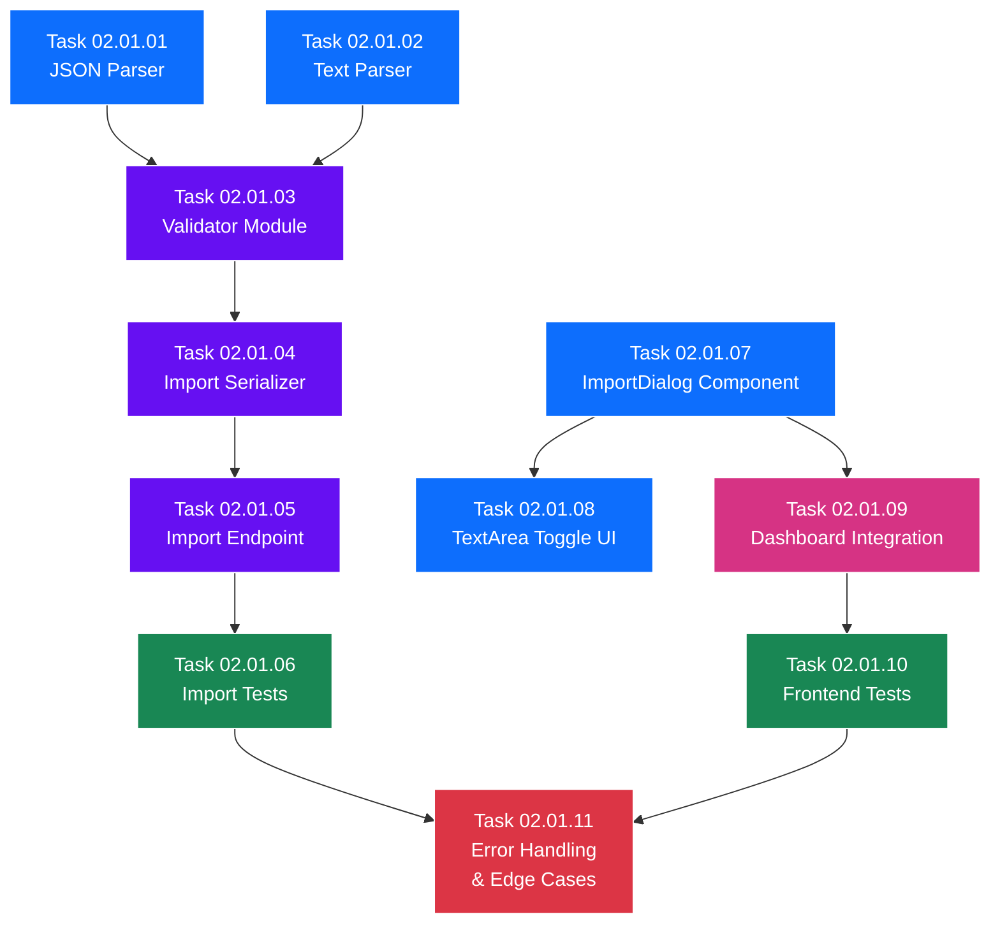

# SubPhase 02.01 — Import & Parse Engine

> **Layer:** 2 — Sub-Phase Overview
> **Phase:** Phase 02 — The Logic
> **Parent Document:** [Phase_02_Overview.md](../Phase_02_Overview.md)
> **Folder:** `SubPhase_02_01_Import_Parse_Engine/`
> **Status:** NOT STARTED
> **Estimated Tasks:** 11

---

## Table of Contents

1. [Sub-Phase Objective](#1-sub-phase-objective)
2. [Scope](#2-scope)
3. [Technical Context](#3-technical-context)
4. [Task List](#4-task-list)
5. [Task Details](#5-task-details)
6. [Execution Order](#6-execution-order)
7. [Files Created & Modified](#7-files-created--modified)
8. [Validation Criteria](#8-validation-criteria)
9. [Constraints](#9-constraints)
10. [Notes & Gotchas](#10-notes--gotchas)
11. [Cross-References](#11-cross-references)

---

## 1. Sub-Phase Objective

**Build the complete import pipeline** that allows users to create new StoryFlow projects by providing story data in either **JSON** or **plain text** format. This sub-phase delivers the **backend parsing engine**, the **validation layer**, the **API endpoint**, and the **frontend Import Dialog** component — wiring everything together so that a user can paste or type a story and instantly have a fully-populated project with ordered segments.

### What This Sub-Phase Delivers

1. **Parser Module** (`api/parsers.py`) — `JSONParser` and `TextParser` classes that convert raw input into a normalized internal format.
2. **Validator Module** (`api/validators.py`) — Structured validation logic with clear error messages for malformed or incomplete import data.
3. **Import Serializer** (`ProjectImportSerializer`) — DRF serializer that orchestrates parsing, validation, and atomic database creation.
4. **Import API Endpoint** — `POST /api/projects/import/` that accepts JSON or text input and returns a fully-created project with all segments.
5. **ImportDialog Frontend Component** (`ImportDialog.tsx`) — Modal dialog with JSON/Text format toggle, textarea, validation feedback, and submission.
6. **Dashboard Integration** — Enhanced Create button on the dashboard page that offers both "Create Empty" and "Import Story" options.

### What This Sub-Phase Does NOT Deliver

- Segment editing or deletion (SubPhase 02.02).
- Image upload or image management (SubPhase 02.02).
- Segment reordering (SubPhase 02.02).
- Timeline Editor UI (SubPhase 02.03).
- Any audio or video processing (Phase 03 / Phase 04).

---

## 2. Scope

### 2.1 In Scope

| Area                  | Details                                                                |
| --------------------- | ---------------------------------------------------------------------- |
| Backend — Parser      | `JSONParser` class: parse JSON with `title` and `segments[]`           |
| Backend — Parser      | `TextParser` class: parse `---`-delimited text with `Text:` / `Prompt:` lines |
| Backend — Validator   | Validate parsed data: required fields, non-empty segments, type checks |
| Backend — Serializer  | `ProjectImportSerializer` with `@transaction.atomic` for database write |
| Backend — Endpoint    | `POST /api/projects/import/` — separate from `POST /api/projects/`     |
| Backend — Tests       | Unit tests for parsers, validators, serializer, and endpoint           |
| Frontend — Component  | `ImportDialog.tsx` modal with format toggle and textarea               |
| Frontend — Integration| Dashboard "Create" button enhanced with Import option                  |
| Frontend — Tests      | Import dialog rendering, form submission, error display tests          |
| Error Handling        | Comprehensive error handling for all import edge cases                 |

### 2.2 Out of Scope

| Area                  | Reason                                                                 |
| --------------------- | ---------------------------------------------------------------------- |
| File upload (`.json` / `.txt`) | Import is text-based (paste into textarea), not file-based. This is a deliberate simplification per [Phase_02_Overview.md](../Phase_02_Overview.md) §4.1. |
| Segment CRUD          | Deferred to SubPhase 02.02                                            |
| Image upload          | Deferred to SubPhase 02.02                                            |
| Timeline Editor page  | Deferred to SubPhase 02.03                                            |
| Any model changes     | Models are frozen from Phase 01                                       |

---

## 3. Technical Context

### 3.1 Prerequisites from Phase 01

This sub-phase depends on the following deliverables from Phase 01, as completed across SubPhases 01.01–01.03:

| Deliverable                           | Source Sub-Phase | What We Use It For                          |
| ------------------------------------- | ---------------- | ------------------------------------------- |
| Django project initialized            | SubPhase 01.01   | Backend foundation for new modules          |
| `api` app created with `apps.py`      | SubPhase 01.01   | Home for parsers, validators, serializer    |
| `requirements.txt` with all packages  | SubPhase 01.01   | Pillow, DRF already available               |
| `Project` model                       | SubPhase 01.02   | Create project records via import           |
| `Segment` model                       | SubPhase 01.02   | Create segment records via import           |
| `ProjectSerializer`                   | SubPhase 01.02   | Referenced (not reused) — import uses its own serializer |
| `SegmentSerializer`                   | SubPhase 01.02   | Used for nested output in import response   |
| DRF configured in `settings.py`       | SubPhase 01.02   | Needed for serializer and view infrastructure |
| `ProjectViewSet` with list/create/retrieve | SubPhase 01.03 | Existing viewset — import endpoint is separate |
| URL routing (`api/urls.py`)           | SubPhase 01.03   | Extend with import route                    |
| Next.js project initialized           | SubPhase 01.01   | Frontend foundation for ImportDialog        |
| Shadcn/UI Button, Input, Dialog, Card | SubPhase 01.01   | Used in ImportDialog component              |
| `lib/api.ts` (Axios client)           | SubPhase 01.03   | Extend with `importProject()` function      |
| `lib/types.ts` (TypeScript interfaces)| SubPhase 01.03   | Extend with import-related types            |
| Dashboard page (`app/page.tsx`)       | SubPhase 01.03   | Modify to add Import button                 |

### 3.2 Database Models (Frozen — Reference Only)

These models were defined in Phase 01 and are **not modified** in Phase 02. They are included here for reference when implementing parsers and the import serializer.

**Project Model:**
```python
class Project(models.Model):
    title = models.CharField(max_length=200)
    status = models.CharField(
        max_length=20,
        choices=[
            ('DRAFT', 'Draft'),
            ('AUDIO_READY', 'Audio Ready'),
            ('VIDEO_READY', 'Video Ready'),
            ('COMPLETE', 'Complete'),
        ],
        default='DRAFT'
    )
    created_at = models.DateTimeField(auto_now_add=True)
    updated_at = models.DateTimeField(auto_now=True)
```

**Segment Model:**
```python
class Segment(models.Model):
    project = models.ForeignKey(Project, on_delete=models.CASCADE, related_name='segments')
    sequence_index = models.IntegerField()
    text_content = models.TextField()
    image_prompt = models.TextField(blank=True, default='')
    image_file = models.ImageField(upload_to='projects/', blank=True, null=True)
    audio_file = models.FileField(upload_to='projects/', blank=True, null=True)
    audio_duration = models.FloatField(blank=True, null=True)
    is_locked = models.BooleanField(default=False)
    created_at = models.DateTimeField(auto_now_add=True)
    updated_at = models.DateTimeField(auto_now=True)

    class Meta:
        ordering = ['sequence_index']
```

### 3.3 API Endpoint Specification

**Import Endpoint (This Sub-Phase):**

| Attribute       | Value                                    |
| --------------- | ---------------------------------------- |
| Method          | `POST`                                   |
| URL             | `/api/projects/import/`                  |
| Content-Type    | `application/json`                       |
| Authentication  | None (permanent constraint)              |

**JSON Format Request:**
```json
{
  "format": "json",
  "title": "My Story Title",
  "segments": [
    {
      "text_content": "The narrator begins...",
      "image_prompt": "A dark forest at twilight"
    },
    {
      "text_content": "Then, suddenly...",
      "image_prompt": "A flash of lightning over mountains"
    }
  ]
}
```

**Text Format Request:**
```json
{
  "format": "text",
  "title": "My Story Title",
  "raw_text": "Text: The narrator begins...\nPrompt: A dark forest at twilight\n---\nText: Then, suddenly...\nPrompt: A flash of lightning over mountains"
}
```

**Success Response (HTTP 201):**
```json
{
  "id": 1,
  "title": "My Story Title",
  "status": "DRAFT",
  "created_at": "2025-01-01T00:00:00Z",
  "updated_at": "2025-01-01T00:00:00Z",
  "segments": [
    {
      "id": 1,
      "sequence_index": 0,
      "text_content": "The narrator begins...",
      "image_prompt": "A dark forest at twilight",
      "image_file": null,
      "audio_file": null,
      "audio_duration": null,
      "is_locked": false,
      "created_at": "2025-01-01T00:00:00Z",
      "updated_at": "2025-01-01T00:00:00Z"
    },
    {
      "id": 2,
      "sequence_index": 1,
      "text_content": "Then, suddenly...",
      "image_prompt": "A flash of lightning over mountains",
      "image_file": null,
      "audio_file": null,
      "audio_duration": null,
      "is_locked": false,
      "created_at": "2025-01-01T00:00:00Z",
      "updated_at": "2025-01-01T00:00:00Z"
    }
  ]
}
```

**Error Responses (HTTP 400):**

| Condition                | Response Body                                                                |
| ------------------------ | ---------------------------------------------------------------------------- |
| Invalid JSON format      | `{"error": "Invalid JSON format", "details": "Expecting value: line 1..."}`  |
| Missing `title`          | `{"error": "Validation failed", "details": {"title": ["This field is required."]}}`  |
| Missing `format`         | `{"error": "Validation failed", "details": {"format": ["Must be 'json' or 'text'."]}}`  |
| Empty segments           | `{"error": "At least one segment is required"}`                              |
| Missing segment fields   | `{"error": "Validation failed", "details": {"segments": ["Each segment must have text_content and image_prompt"]}}` |
| Invalid text format      | `{"error": "Text parsing failed", "details": "Could not parse segment at block 3"}` |

### 3.4 Normalized Data Format

Both `JSONParser` and `TextParser` must output data in this identical internal format. The validator and serializer only work with this normalized form:

```python
{
    "title": "My Story Title",
    "segments": [
        {
            "text_content": "The narrator begins...",
            "image_prompt": "A dark forest at twilight",
            "sequence_index": 0
        },
        {
            "text_content": "Then, suddenly...",
            "image_prompt": "A flash of lightning over mountains",
            "sequence_index": 1
        }
    ]
}
```

**Rules:**
- `title` is a non-empty string, max 200 characters (matches `Project.title` constraint).
- `segments` is a non-empty list.
- Each segment has `text_content` (non-empty string), `image_prompt` (string, can be empty), and `sequence_index` (int, 0-based).
- `sequence_index` values are assigned by the parser based on array position (0, 1, 2, ...).

### 3.5 Parsing Specifications

#### JSONParser

**Input:** The `segments` array and `title` from the JSON request body.

**Algorithm:**
1. Receive the already-parsed JSON object (DRF handles JSON deserialization).
2. Extract `title` from the top level.
3. Iterate over `segments` array.
4. For each segment at index `i`, create: `{"text_content": segment["text_content"], "image_prompt": segment.get("image_prompt", ""), "sequence_index": i}`.
5. Return the normalized format.

**Edge cases:**
- `image_prompt` is optional — default to empty string if missing.
- `text_content` is required — raise `ParseError` if missing.
- Extra fields in segment objects are silently ignored.

#### TextParser

**Input:** The `raw_text` string and `title` from the request body.

**Algorithm:**
1. Split `raw_text` by `---` (three hyphens on their own line).
2. For each resulting block, strip whitespace.
3. Skip empty blocks (consecutive `---` separators or leading/trailing `---`).
4. Within each block, look for lines starting with `Text:` and `Prompt:` (case-insensitive).
5. Extract the content after the prefix, stripping leading/trailing whitespace.
6. If a block has `Text:` but no `Prompt:`, set `image_prompt` to empty string.
7. If a block has neither `Text:` nor recognizable structure, raise `ParseError` with the block number.
8. Assign `sequence_index` values (0, 1, 2, ...) based on block order.
9. Return the normalized format.

**Edge cases:**
- Multiple `Text:` lines within one block: concatenate with a space.
- Multiple `Prompt:` lines within one block: concatenate with a space.
- Lines not starting with `Text:` or `Prompt:` within a valid block: ignored.
- Empty `raw_text` or no parseable blocks: raise `ParseError`.

### 3.6 ImportDialog Component Specification

**Component:** `ImportDialog.tsx`

**UI Elements:**
- Shadcn `Dialog` wrapping the entire import form.
- Title: "Import Story".
- Format toggle: Two Shadcn `Button` variants (outline/default) for "JSON" and "Text" — only one active at a time.
- Placeholder text in textarea changes based on selected format.
- Shadcn `Textarea` (or native `<textarea>` styled with Tailwind) — minimum 10 rows.
- Optional `title` input field — `Input` component. If left blank, derive from first line of text or JSON title.
- "Import" button (`Button`) — disabled while submitting or if textarea is empty.
- "Cancel" button — closes dialog without action.
- Error display area below textarea — shows backend validation errors.
- Loading state: "Import" button shows spinner during API call.

**Behavior Flow:**
```
1. User clicks "Import Story" on dashboard
2. ImportDialog opens with JSON format selected by default
3. User optionally toggles to Text format
4. User pastes or types content into textarea
5. User optionally enters a custom title
6. User clicks "Import"
7. Frontend calls POST /api/projects/import/ with { format, title, segments|raw_text }
8. On success (201): Close dialog, refresh project list, show success toast (optional)
9. On error (400): Display error messages below textarea, keep dialog open
```

**JSON Placeholder:**
```
{
  "title": "My Story",
  "segments": [
    {
      "text_content": "Your narration text...",
      "image_prompt": "Description of the image..."
    }
  ]
}
```

**Text Placeholder:**
```
Text: Your narration text for segment 1...
Prompt: Description of the image for segment 1...
---
Text: Your narration text for segment 2...
Prompt: Description of the image for segment 2...
```

---

## 4. Task List

| #  | Task ID   | Task Title                          | Depends On | Est. Complexity | File(s) Affected                   |
| -- | --------- | ----------------------------------- | ---------- | --------------- | ---------------------------------- |
| 1  | 02.01.01  | Create JSON Parser                  | —          | Medium          | `backend/api/parsers.py`           |
| 2  | 02.01.02  | Create Text Parser                  | —          | High            | `backend/api/parsers.py`           |
| 3  | 02.01.03  | Create Validator Module             | 01, 02     | Medium          | `backend/api/validators.py`        |
| 4  | 02.01.04  | Create Import Serializer            | 03         | Medium          | `backend/api/serializers.py`       |
| 5  | 02.01.05  | Build Import Endpoint               | 04         | Medium          | `backend/api/views.py`, `backend/api/urls.py` |
| 6  | 02.01.06  | Write Import Tests                  | 05         | High            | `backend/api/tests.py`            |
| 7  | 02.01.07  | Build ImportDialog Component        | —          | High            | `frontend/components/ImportDialog.tsx` |
| 8  | 02.01.08  | Add TextArea Toggle UI              | 07         | Low             | `frontend/components/ImportDialog.tsx` |
| 9  | 02.01.09  | Integrate Dashboard Import Button   | 07         | Medium          | `frontend/app/page.tsx`, `frontend/lib/api.ts`, `frontend/lib/types.ts` |
| 10 | 02.01.10  | Write Frontend Import Tests         | 09         | Medium          | Frontend test files                |
| 11 | 02.01.11  | Error Handling & Edge Cases         | 06, 10     | Medium          | Multiple files                     |

---

## 5. Task Details

### Task 02.01.01 — Create JSON Parser

**Objective:** Implement the `JSONParser` class that converts a JSON import payload into the normalized data format.

**File:** `backend/api/parsers.py` (NEW — create this file)

**Steps:**
1. Create `backend/api/parsers.py`.
2. Define a custom `ParseError` exception class inheriting from `Exception`, with `message` and `details` attributes.
3. Implement `JSONParser` class with a `parse(data: dict) -> dict` method.
4. The method receives the already-deserialized JSON body from the DRF request.
5. Extract `title` from `data`. If missing or empty, raise `ParseError`.
6. Extract `segments` list from `data`. If missing, not a list, or empty, raise `ParseError`.
7. Iterate over segments, building normalized segment dicts with `text_content`, `image_prompt` (default `""`), and `sequence_index`.
8. If any segment is missing `text_content`, raise `ParseError` identifying the segment index.
9. Return the normalized data format (see §3.4).

**Key Details:**
- The parser does NOT interact with the database. It is a pure data transformation utility.
- Extra keys in the JSON (e.g., `author`, `metadata`) are silently ignored.
- The `title` is taken from the request body, NOT extracted from within segments.

---

### Task 02.01.02 — Create Text Parser

**Objective:** Implement the `TextParser` class that converts a text-based import payload into the normalized data format.

**File:** `backend/api/parsers.py` (same file as Task 02.01.01)

**Steps:**
1. Implement `TextParser` class with a `parse(title: str, raw_text: str) -> dict` method.
2. Validate that `title` is non-empty. If empty, raise `ParseError`.
3. Validate that `raw_text` is non-empty. If empty, raise `ParseError`.
4. Split `raw_text` by `---` (on its own line — use `\n---\n` or regex `r'\n-{3,}\n'` for splitting).
5. Strip whitespace from each resulting block. Filter out empty blocks.
6. For each block, extract lines starting with `Text:` (case-insensitive) and `Prompt:` (case-insensitive).
7. Concatenate multiple `Text:` lines with a space. Same for `Prompt:` lines.
8. If a block has no `Text:` line, raise `ParseError` identifying the block number.
9. If a block has no `Prompt:` line, default `image_prompt` to `""`.
10. Assign `sequence_index` values (0, 1, 2, ...) based on block order.
11. Return the normalized data format.

**Key Details:**
- Use **string splitting** (`str.split`), NOT regex for the primary parsing. Only use regex for the `---` delimiter splitting if needed.
- This is a deliberate design decision noted in [Phase_02_Overview.md](../Phase_02_Overview.md) §4.1: "text parsing uses string splitting not regex" (for the field extraction within blocks).
- Lines that don't match `Text:` or `Prompt:` patterns within a block are silently ignored (not errors).
- The `---` delimiter must appear on its own line. Hyphens within text content (e.g., "well-known") are NOT delimiters.

---

### Task 02.01.03 — Create Validator Module

**Objective:** Implement validation functions that verify the normalized data format produced by parsers before it is passed to the serializer.

**File:** `backend/api/validators.py` (NEW — create this file)

**Steps:**
1. Create `backend/api/validators.py`.
2. Implement `validate_import_data(data: dict) -> dict` function.
3. Validate `title`: must be a non-empty string, max 200 characters.
4. Validate `segments`: must be a non-empty list.
5. For each segment, validate:
   - `text_content` is a non-empty string.
   - `image_prompt` is a string (can be empty).
   - `sequence_index` is a non-negative integer.
6. Validate that `sequence_index` values form a contiguous sequence starting from 0.
7. Collect all errors into a structured dict. Do NOT short-circuit on first error — collect all errors.
8. If any errors exist, raise `ValidationError` (from DRF) with the structured error dict.
9. If all valid, return the validated data (unchanged).

**Key Details:**
- Import `ValidationError` from `rest_framework.exceptions`.
- Error format must match DRF conventions so the endpoint can pass them through directly.
- The validator is called AFTER the parser but BEFORE the serializer writes to the database.

**Error Structure Example:**
```python
{
    "title": ["Title must not exceed 200 characters."],
    "segments": [
        {"index": 0, "errors": {"text_content": ["This field is required."]}},
        {"index": 2, "errors": {"image_prompt": ["Must be a string."]}}
    ]
}
```

---

### Task 02.01.04 — Create Import Serializer

**Objective:** Implement `ProjectImportSerializer` that takes validated normalized data and creates a `Project` with all its `Segment` records in a single atomic transaction.

**File:** `backend/api/serializers.py` (MODIFY — add to existing file)

**Steps:**
1. Open `backend/api/serializers.py` (already contains `ProjectSerializer`, `SegmentSerializer`, `ProjectListSerializer` from Phase 01).
2. Import `transaction` from `django.db`.
3. Define `ProjectImportSerializer` as a DRF `Serializer` (NOT `ModelSerializer`).
4. Define fields: `format` (ChoiceField: "json" or "text"), `title` (CharField), `segments` (ListField, required when format="json"), `raw_text` (CharField, required when format="text").
5. Implement `validate(self, attrs)` method:
   a. Based on `format`, instantiate the appropriate parser (`JSONParser` or `TextParser`).
   b. Call the parser's `parse()` method with the relevant data.
   c. Call `validate_import_data()` on the parsed result.
   d. Store the normalized data on `attrs` for use in `create()`.
6. Implement `create(self, validated_data)` method with `@transaction.atomic`:
   a. Create the `Project` record with `title` and `status='DRAFT'`.
   b. Bulk create all `Segment` records using `Segment.objects.bulk_create()`.
   c. Re-fetch the project with segments (using `select_related` / `prefetch_related`) for the response.
   d. Return the project instance.
7. The view will serialize the response using `ProjectSerializer` (with nested segments), NOT this serializer.

**Key Details:**
- The `@transaction.atomic` decorator on `create()` ensures that if segment creation fails partway through, the project creation is also rolled back.
- `bulk_create` is more efficient than creating segments one-by-one in a loop.
- This serializer handles INPUT only. The response is serialized by the existing `ProjectSerializer` with nested `SegmentSerializer`.

---

### Task 02.01.05 — Build Import Endpoint

**Objective:** Create the `POST /api/projects/import/` endpoint that accepts import requests and returns created projects.

**Files:** `backend/api/views.py` (MODIFY), `backend/api/urls.py` (MODIFY)

**Steps:**
1. In `views.py`, add a new `import_project` function-based view (or add as an action on `ProjectViewSet`):
   - **Option A (Recommended):** Standalone view decorated with `@api_view(['POST'])`.
   - **Option B:** Custom action on `ProjectViewSet` using `@action(detail=False, methods=['post'])`.
   - Decision: **Option A** (standalone view) is preferred per [Phase_02_Overview.md](../Phase_02_Overview.md) §4.1 — "separate endpoint not overloaded POST".
2. In the view function:
   a. Instantiate `ProjectImportSerializer` with `data=request.data`.
   b. Call `serializer.is_valid(raise_exception=True)`.
   c. Call `project = serializer.save()`.
   d. Serialize the response using `ProjectSerializer(project)` (the existing serializer with nested segments).
   e. Return `Response(response_serializer.data, status=201)`.
3. Handle `ParseError` exceptions from parsers by catching and returning 400 responses with structured error bodies.
4. In `urls.py`, add the route:
   ```python
   path('projects/import/', views.import_project, name='project-import'),
   ```
5. Ensure the import route is placed BEFORE the router-generated project routes to avoid URL conflicts.

**Key Details:**
- The endpoint is at `/api/projects/import/`, NOT `/api/projects/` — it is a separate route.
- The response must include the full project with nested segments (matching the existing `ProjectSerializer` output).
- Error responses from parsers and validators are caught and returned as 400 with the appropriate error structure.

---

### Task 02.01.06 — Write Import Tests

**Objective:** Write comprehensive backend unit tests covering the import pipeline: parsers, validators, serializer, and endpoint.

**File:** `backend/api/tests.py` (MODIFY — add test classes)

**Steps:**
1. Add `TestJSONParser` class:
   - Test valid JSON with title and 2+ segments → normalized output.
   - Test missing title → `ParseError`.
   - Test empty segments array → `ParseError`.
   - Test segment missing `text_content` → `ParseError`.
   - Test segment with missing `image_prompt` → defaults to `""`.
   - Test extra keys in JSON are ignored.
2. Add `TestTextParser` class:
   - Test valid text with 2+ blocks → normalized output.
   - Test empty `raw_text` → `ParseError`.
   - Test block without `Text:` line → `ParseError`.
   - Test block without `Prompt:` line → defaults to `""`.
   - Test multiple `Text:` lines in one block → concatenated.
   - Test consecutive `---` separators → empty blocks skipped.
   - Test case-insensitive `text:` and `prompt:` → parsed correctly.
3. Add `TestImportValidator` class:
   - Test valid normalized data → passes.
   - Test title over 200 chars → error.
   - Test empty segments list → error.
   - Test segment with empty `text_content` → error.
   - Test non-contiguous `sequence_index` values → error.
4. Add `TestImportEndpoint` class (using DRF `APITestCase`):
   - Test JSON import: `POST /api/projects/import/` with valid JSON → 201, project created with correct segments.
   - Test text import: `POST /api/projects/import/` with valid text → 201, project created with correct segments.
   - Test invalid JSON → 400 with error details.
   - Test invalid text → 400 with error details.
   - Test atomicity: if 10 segments but one is invalid, NO project or segments are created.
   - Test `sequence_index` values are correct (0, 1, 2, ...).

**Key Details:**
- Use Django's `TestCase` for parser and validator tests (no database needed).
- Use DRF's `APITestCase` for endpoint tests (database needed).
- Test atomicity by verifying `Project.objects.count()` and `Segment.objects.count()` are unchanged after a failed import.

---

### Task 02.01.07 — Build ImportDialog Component

**Objective:** Create the `ImportDialog.tsx` component — a modal dialog for importing stories in JSON or Text format.

**File:** `frontend/components/ImportDialog.tsx` (NEW — create this file)

**Steps:**
1. Create `frontend/components/ImportDialog.tsx`.
2. Import Shadcn components: `Dialog`, `DialogContent`, `DialogHeader`, `DialogTitle`, `DialogFooter`, `Button`, `Input`, `Textarea` (or `Label`).
3. Define component props:
   ```typescript
   interface ImportDialogProps {
     open: boolean;
     onOpenChange: (open: boolean) => void;
     onSuccess: (project: Project) => void;
   }
   ```
4. Implement state:
   - `format`: `"json" | "text"` — default `"json"`.
   - `title`: `string` — optional custom title.
   - `content`: `string` — textarea content.
   - `isSubmitting`: `boolean`.
   - `errors`: `Record<string, string[]> | null`.
5. Implement format toggle: Two `Button` components, one for JSON, one for Text. Active format uses `default` variant, inactive uses `outline`.
6. Implement textarea with dynamic placeholder based on selected format.
7. Implement title input field (optional — if empty, backend derives from content).
8. Implement "Import" button:
   a. Disabled while `isSubmitting` or `content.trim() === ""`.
   b. On click, call the import API function.
   c. On success: call `onSuccess(project)`, close dialog.
   d. On error: set `errors` state, display below textarea.
9. Implement "Cancel" button: calls `onOpenChange(false)`.
10. Clear all state when dialog closes.

**Key Details:**
- The dialog is controlled (open/close state managed by parent via `open` and `onOpenChange` props).
- The `onSuccess` callback is used by the parent to refresh the project list after a successful import.
- Format toggle should update the placeholder text immediately.
- When switching formats, the textarea content is NOT cleared (user might be switching to check format).

---

### Task 02.01.08 — Add TextArea Toggle UI

**Objective:** Refine the ImportDialog's format toggle and textarea behavior for a polished UX.

**File:** `frontend/components/ImportDialog.tsx` (MODIFY — same file as Task 07)

**Steps:**
1. Enhance format toggle buttons with clear visual distinction (active state with different background/border).
2. Add format description text below the toggle:
   - JSON: "Paste a JSON object with title and segments array."
   - Text: "Paste text blocks separated by --- with Text: and Prompt: lines."
3. Set textarea `rows` to at least 10 for comfortable editing.
4. Add character count indicator (optional but recommended).
5. Ensure textarea is auto-focused when the dialog opens.
6. Add keyboard shortcut: `Ctrl+Enter` / `Cmd+Enter` to submit.

**Key Details:**
- This task is a UX refinement of Task 07's core functionality.
- The format description helps users understand the expected input without external documentation.
- `Ctrl+Enter` should work even when focus is inside the textarea.

---

### Task 02.01.09 — Integrate Dashboard Import Button

**Objective:** Add the "Import Story" option to the dashboard so users can access the ImportDialog.

**Files:** `frontend/app/page.tsx` (MODIFY), `frontend/lib/api.ts` (MODIFY), `frontend/lib/types.ts` (MODIFY)

**Steps:**
1. In `frontend/lib/types.ts`, add import-related types:
   ```typescript
   interface ImportProjectRequest {
     format: 'json' | 'text';
     title: string;
     segments?: Array<{ text_content: string; image_prompt: string }>;
     raw_text?: string;
   }
   ```
2. In `frontend/lib/api.ts`, add the `importProject` function:
   ```typescript
   export async function importProject(data: ImportProjectRequest): Promise<Project> {
     const response = await api.post('/projects/import/', data);
     return response.data;
   }
   ```
3. In `frontend/app/page.tsx` (dashboard page):
   a. Import the `ImportDialog` component.
   b. Add state: `showImportDialog: boolean`.
   c. Modify the existing "Create" button area to include two options:
      - "Create Empty Project" — existing behavior (calls `POST /api/projects/`).
      - "Import Story" — opens the ImportDialog.
   d. Place `<ImportDialog>` component in the page JSX with proper props.
   e. In the `onSuccess` handler, refresh the project list (re-fetch or append to local state).

**Key Details:**
- The two buttons can be side-by-side, or use a Shadcn `DropdownMenu` from the existing "Create" button.
- The recommended approach: Two separate buttons — "Create Project" (existing) and "Import Story" (new). Keep it simple.
- After successful import, the new project should appear in the project list immediately.
- Navigate to the new project's timeline page after import is also acceptable (but optional in this sub-phase since the Timeline Editor is built in SubPhase 02.03).

---

### Task 02.01.10 — Write Frontend Import Tests

**Objective:** Write frontend tests for the ImportDialog component and the dashboard import integration.

**File(s):** Frontend test files (e.g., `__tests__/` or colocated `.test.tsx` files)

**Steps:**
1. Test `ImportDialog` renders correctly when `open={true}`.
2. Test format toggle switches between JSON and Text.
3. Test placeholder text updates when format changes.
4. Test "Import" button is disabled when textarea is empty.
5. Test "Import" button is disabled while submitting.
6. Test successful submission calls `onSuccess` and closes dialog.
7. Test error display when API returns 400.
8. Test "Cancel" closes the dialog.
9. Test dashboard page renders "Import Story" button.
10. Test clicking "Import Story" opens the ImportDialog.

**Key Details:**
- Use the existing test framework (likely Jest + React Testing Library from Next.js defaults, or Vitest).
- Mock the Axios API client for test isolation.
- Focus on behavior, not implementation details.

---

### Task 02.01.11 — Error Handling & Edge Cases

**Objective:** Harden the entire import pipeline against edge cases and ensure consistent error handling across backend and frontend.

**Files:** Multiple — `parsers.py`, `validators.py`, `views.py`, `ImportDialog.tsx`

**Steps:**
1. **Backend — Parser Edge Cases:**
   - Handle `title` that is only whitespace → treat as empty → error.
   - Handle `text_content` that is only whitespace → treat as empty → error.
   - Handle extremely long text content (>10,000 chars per segment) → allow (no limit defined).
   - Handle Unicode characters in text and prompts → must work correctly.
   - Handle `segments` array with 100+ items → allow (no limit defined, but test performance).
2. **Backend — Endpoint Edge Cases:**
   - Handle `format` field missing → 400 with `"format": ["This field is required."]`.
   - Handle `format` value not "json" or "text" → 400 with `"format": ["Must be 'json' or 'text'."]`.
   - Handle JSON format request missing `segments` key → 400 with appropriate error.
   - Handle Text format request missing `raw_text` key → 400 with appropriate error.
   - Handle request body that is not valid JSON at all → 400 with DRF's default parse error.
3. **Frontend — UI Edge Cases:**
   - Handle network errors (API unreachable) → show generic "Import failed. Please try again." message.
   - Handle very long error messages → truncate or scroll within the error display area.
   - Handle rapid double-clicks on "Import" button → debounce with `isSubmitting` state (already implemented).
   - Handle dialog close during active request → cancel the request (optional, or let it complete silently).
4. Test all edge cases added in this task with additional unit tests.

**Key Details:**
- This task is a hardening pass — it should be done AFTER the core pipeline works end-to-end.
- Focus on cases that real users would encounter: pasting malformed content, network flakiness, whitespace issues.
- Do NOT add arbitrary limits on segment count or text length unless specified.

---

## 6. Execution Order

### 6.1 Dependency Chain

```
Tasks 01 + 02 (Parsers — no dependencies, can be parallel)
    └── Task 03 (Validator — needs parser output format)
        └── Task 04 (Serializer — needs validator)
            └── Task 05 (Endpoint — needs serializer)
                └── Task 06 (Backend Tests — needs working endpoint)

Task 07 (ImportDialog — no backend dependency, can start early)
    └── Task 08 (TextArea Toggle UX — enhances Task 07)
    └── Task 09 (Dashboard Integration — needs ImportDialog + API function)
        └── Task 10 (Frontend Tests — needs working integration)

Task 11 (Error Handling — needs everything working first)
```

### 6.2 Recommended Sequence

| Order | Task(s)  | Rationale                                              |
| ----- | -------- | ------------------------------------------------------ |
| 1     | 01 + 02  | Build both parsers first — they are independent of each other and the foundation for everything else |
| 2     | 03       | Validator depends on the normalized format that parsers produce |
| 3     | 04       | Serializer orchestrates parser + validator + database writes |
| 4     | 05       | Endpoint wires the serializer into the URL routing     |
| 5     | 06       | Backend tests verify the entire backend pipeline       |
| 6     | 07       | Build the ImportDialog component (can start earlier if frontend dev is separate) |
| 7     | 08       | Polish the TextArea toggle UX                          |
| 8     | 09       | Wire ImportDialog into the dashboard with API client   |
| 9     | 10       | Frontend tests verify the UI and integration           |
| 10    | 11       | Final hardening pass across all layers                 |

### 6.3 Execution Flow (Mermaid)



> **Legend:**
> 🔵 Blue = Core implementation tasks
> 🟣 Purple = Integration / orchestration tasks
> 🟢 Green = Test tasks
> 🔴 Red = Hardening / finalization tasks

### 6.4 Parallel Work Opportunities

The backend and frontend tracks can be developed in parallel once the API contract is established:

```
BACKEND TRACK:  T01 → T02 → T03 → T04 → T05 → T06 ──┐
                                                        ├──→ T11
FRONTEND TRACK: T07 → T08 → T09 → T10 ────────────────┘
```

If a single developer is working sequentially, the recommended order is:
**T01 → T02 → T03 → T04 → T05 → T06 → T07 → T08 → T09 → T10 → T11**

---

## 7. Files Created & Modified

### 7.1 New Files

| File Path                              | Created In | Purpose                                    |
| -------------------------------------- | ---------- | ------------------------------------------ |
| `backend/api/parsers.py`              | Task 01+02 | JSON and Text import parsers               |
| `backend/api/validators.py`           | Task 03    | Import data validation logic               |
| `frontend/components/ImportDialog.tsx` | Task 07    | Story import modal dialog                  |

### 7.2 Modified Files

| File Path                              | Modified In | Changes                                   |
| -------------------------------------- | ----------- | ----------------------------------------- |
| `backend/api/serializers.py`          | Task 04     | Add `ProjectImportSerializer`             |
| `backend/api/views.py`               | Task 05     | Add `import_project` view function        |
| `backend/api/urls.py`                | Task 05     | Add `projects/import/` route              |
| `backend/api/tests.py`               | Task 06     | Add parser, validator, endpoint test classes |
| `frontend/lib/types.ts`              | Task 09     | Add `ImportProjectRequest` type           |
| `frontend/lib/api.ts`                | Task 09     | Add `importProject()` function            |
| `frontend/app/page.tsx`              | Task 09     | Add Import button and ImportDialog        |

### 7.3 File Dependency Map

```
parsers.py ──→ validators.py ──→ serializers.py ──→ views.py ──→ urls.py
                                                        │
                                                        ▼
                                                   tests.py
                                                   
ImportDialog.tsx ──→ api.ts ──→ page.tsx
                       │
                       ▼
                   types.ts
```

---

## 8. Validation Criteria

### 8.1 Backend — Parser Validation

- [ ] `JSONParser.parse()` correctly extracts `title` and segments from valid JSON input.
- [ ] `JSONParser.parse()` assigns `sequence_index` values 0, 1, 2, ... based on array position.
- [ ] `JSONParser.parse()` raises `ParseError` for missing `title`.
- [ ] `JSONParser.parse()` raises `ParseError` for missing or empty `segments`.
- [ ] `JSONParser.parse()` raises `ParseError` for segments missing `text_content`.
- [ ] `JSONParser.parse()` defaults `image_prompt` to `""` when missing.
- [ ] `TextParser.parse()` correctly splits text by `---` and extracts `Text:` / `Prompt:` fields.
- [ ] `TextParser.parse()` handles case-insensitive `text:` and `prompt:` prefixes.
- [ ] `TextParser.parse()` concatenates multiple `Text:` lines within a block.
- [ ] `TextParser.parse()` raises `ParseError` for blocks without `Text:` line.
- [ ] `TextParser.parse()` defaults `image_prompt` to `""` when `Prompt:` is absent.
- [ ] `TextParser.parse()` skips empty blocks from consecutive `---` separators.

### 8.2 Backend — Validator Validation

- [ ] `validate_import_data()` accepts valid normalized data without errors.
- [ ] `validate_import_data()` rejects titles over 200 characters.
- [ ] `validate_import_data()` rejects empty segment lists.
- [ ] `validate_import_data()` rejects segments with empty `text_content`.
- [ ] `validate_import_data()` collects ALL errors, not just the first one.

### 8.3 Backend — Endpoint Validation

- [ ] `POST /api/projects/import/` with valid JSON format → 201, project with all segments returned.
- [ ] `POST /api/projects/import/` with valid text format → 201, project with all segments returned.
- [ ] `POST /api/projects/import/` with invalid data → 400 with structured error body.
- [ ] Import is atomic — failed import does NOT leave partial project/segment data.
- [ ] Segments in response have correct `sequence_index` values (0, 1, 2, ...).
- [ ] Response includes nested segments (not just the project).
- [ ] Route is accessible at `/api/projects/import/` (not `/api/projects/import` without trailing slash).

### 8.4 Frontend — ImportDialog Validation

- [ ] ImportDialog opens and closes via `open` / `onOpenChange` props.
- [ ] Format toggle switches between JSON and Text modes.
- [ ] Placeholder text updates when format is toggled.
- [ ] "Import" button is disabled when textarea is empty.
- [ ] "Import" button is disabled while submission is in progress.
- [ ] Successful import calls `onSuccess` with the created project.
- [ ] Backend errors are displayed below the textarea.
- [ ] "Cancel" closes the dialog without side effects.

### 8.5 Frontend — Dashboard Integration Validation

- [ ] Dashboard page shows an "Import Story" button alongside "Create Project".
- [ ] Clicking "Import Story" opens the ImportDialog.
- [ ] After successful import, the project list is refreshed and the new project appears.
- [ ] `importProject()` function in `api.ts` calls the correct endpoint.
- [ ] `ImportProjectRequest` type is correctly defined in `types.ts`.

### 8.6 Structural Validation

- [ ] `backend/api/parsers.py` exists and contains `JSONParser`, `TextParser`, `ParseError`.
- [ ] `backend/api/validators.py` exists and contains `validate_import_data`.
- [ ] `frontend/components/ImportDialog.tsx` exists and exports a React component.
- [ ] TypeScript compiles: `npx tsc --noEmit` passes with zero errors.
- [ ] Django tests pass: `python manage.py test api` runs without failures.

---

## 9. Constraints

| #  | Constraint                                                    | Source                                                        |
| -- | ------------------------------------------------------------- | ------------------------------------------------------------- |
| 1  | Do NOT modify `Project` or `Segment` model definitions        | [Phase_02_Overview.md](../Phase_02_Overview.md) §10, Constraint #10 |
| 2  | Do NOT add authentication or authorization                    | [00_Project_Overview.md](../../00_Project_Overview.md) §14.1  |
| 3  | Do NOT install Docker, Redis, or Celery                       | [00_Project_Overview.md](../../00_Project_Overview.md) §14.1  |
| 4  | Do NOT implement segment CRUD in this sub-phase               | Deferred to SubPhase 02.02                                    |
| 5  | Do NOT implement image upload in this sub-phase               | Deferred to SubPhase 02.02                                    |
| 6  | Do NOT build the Timeline Editor page in this sub-phase       | Deferred to SubPhase 02.03                                    |
| 7  | Import is text-based (paste into textarea), NOT file upload   | Design decision per [Phase_02_Overview.md](../Phase_02_Overview.md) §4.1 |
| 8  | Parser is a utility module within the `api` app               | Design decision per [Phase_02_Overview.md](../Phase_02_Overview.md) §4.1 |
| 9  | Import uses a separate endpoint, NOT overloaded `POST /api/projects/` | Design decision per [Phase_02_Overview.md](../Phase_02_Overview.md) §4.1 |
| 10 | Text parsing uses string splitting, NOT regex for field extraction | Design decision per [Phase_02_Overview.md](../Phase_02_Overview.md) §4.1 |
| 11 | All import operations are synchronous (no background tasks)   | [Phase_02_Overview.md](../Phase_02_Overview.md) §10, Constraint #9 |
| 12 | No new Python packages required                               | [Phase_02_Overview.md](../Phase_02_Overview.md) §9.2          |

---

## 10. Notes & Gotchas

### 10.1 Trailing Slash Convention

Django REST Framework and the existing project URL configuration require trailing slashes. The import endpoint MUST be:
```
/api/projects/import/     ← Correct
/api/projects/import      ← WRONG — will 301 redirect, breaking POST data
```

Ensure `frontend/lib/api.ts` uses the trailing slash in the URL.

### 10.2 Parser vs. Serializer Responsibilities

The architecture separates concerns clearly:
- **Parsers** (`parsers.py`): Convert raw input formats (JSON/Text) → normalized dict format. Pure data transformation, no database interaction.
- **Validators** (`validators.py`): Verify the normalized dict against business rules. No database interaction.
- **Serializer** (`serializers.py`): Orchestrates the pipeline (parse → validate → create in DB). Handles the `@transaction.atomic` boundary.
- **View** (`views.py`): HTTP layer only — receives request, passes to serializer, returns response.

Do NOT mix these responsibilities. For example, do NOT put parsing logic inside the serializer's `validate()` method directly — call the parser from there instead.

### 10.3 Transaction Atomicity

The `@transaction.atomic` decorator on the serializer's `create()` method is critical. Without it, a failure during `Segment.objects.bulk_create()` would leave an orphaned `Project` record in the database.

Test this explicitly: create an import with one valid and one invalid segment (e.g., null `text_content` that passes parser/validator but fails a database NOT NULL constraint) and verify that neither the project nor any segments are created.

### 10.4 JSON vs. Text Format Detection

The client MUST send a `format` field ("json" or "text") in the request body. The backend does NOT auto-detect the format by inspecting the content. This is a deliberate design choice for clarity.

### 10.5 Frontend State Reset

When the ImportDialog closes (via Cancel or successful import), ALL internal state must be reset:
- `format` → `"json"` (default)
- `title` → `""`
- `content` → `""`
- `errors` → `null`
- `isSubmitting` → `false`

Use a `useEffect` triggered by the `open` prop transitioning to `false`, or reset in the `onOpenChange` handler.

### 10.6 Text Format — Delimiter Edge Cases

The `---` delimiter in text format can be tricky:
- `---` at the very start of `raw_text` → empty first block → skip it.
- `---` at the very end of `raw_text` → empty last block → skip it.
- Multiple consecutive `---` → multiple empty blocks → skip all.
- `----` (four hyphens) → should still be treated as a delimiter (use `r'\n-{3,}\n'` or similar).
- `---` within a text content line (e.g., "She said --- no") → this is a known limitation. Since `---` must be on its own line (`\n---\n`), embedded hyphens in content are NOT affected.

### 10.7 DRF ParseError vs. Custom ParseError

Django REST Framework has its own `rest_framework.exceptions.ParseError`. The custom `ParseError` in `parsers.py` is a separate class. Be careful NOT to confuse them:
- `api.parsers.ParseError` → raised by `JSONParser` / `TextParser` for parsing failures.
- `rest_framework.exceptions.ParseError` → raised by DRF for malformed JSON in the request body.

In the view or serializer, catch `api.parsers.ParseError` and convert it to an appropriate DRF error response.

### 10.8 Bulk Create and Auto-Increment IDs

`Segment.objects.bulk_create()` is used for performance. On SQLite, `bulk_create` does return the created objects with their IDs (as of Django 4.0+). However, to be safe, re-fetch the segments after creation using `project.segments.all()` to ensure correct IDs and ordering.

---

## 11. Cross-References

### 11.1 Parent Documents

| Document                              | Relationship                                                   |
| ------------------------------------- | -------------------------------------------------------------- |
| [Phase_02_Overview.md](../Phase_02_Overview.md) | Direct parent (Layer 1). Defines this sub-phase in §4.1.      |
| [00_Project_Overview.md](../../00_Project_Overview.md) | Master document (Layer 0). Import module spec in §5.1. API spec in §6. |

### 11.2 Sibling Documents

| Document                              | Relationship                                                   |
| ------------------------------------- | -------------------------------------------------------------- |
| [SubPhase_02_02_Overview.md](../SubPhase_02_02_Segment_Management/SubPhase_02_02_Overview.md) | Next sub-phase. Builds segment CRUD on top of this sub-phase's import pipeline. |
| [SubPhase_02_03_Overview.md](../SubPhase_02_03_Timeline_Editor_UI/SubPhase_02_03_Overview.md) | Final sub-phase in Phase 02. Builds the Timeline Editor UI.   |

### 11.3 Previous Sub-Phase

| Document                              | Relationship                                                   |
| ------------------------------------- | -------------------------------------------------------------- |
| [SubPhase_01_03_Overview.md](../../Phase_01_The_Skeleton/SubPhase_01_03_Dashboard_UI/SubPhase_01_03_Overview.md) | Last sub-phase of Phase 01. Its deliverables are direct prerequisites: `ProjectViewSet`, URL routing, API client, TypeScript types, dashboard page. |

### 11.4 Phase 01 Sub-Phase Dependencies

This sub-phase depends on outputs from all three Phase 01 sub-phases:

| Phase 01 Sub-Phase | Key Deliverables Used Here                                     |
| ------------------- | -------------------------------------------------------------- |
| SubPhase 01.01      | Django project structure, `api` app, Next.js project, Shadcn/UI components, Axios, Zustand |
| SubPhase 01.02      | `Project` model, `Segment` model, `ProjectSerializer`, `SegmentSerializer`, DRF config, admin setup |
| SubPhase 01.03      | `ProjectViewSet`, `api/urls.py` routing, `lib/api.ts` client, `lib/types.ts` interfaces, dashboard `page.tsx`, `ProjectCard.tsx`, `CreateProjectDialog.tsx` |

### 11.5 Child Documents (Layer 3)

| Task Document                                        | Task ID  | Title                              |
| ---------------------------------------------------- | -------- | ---------------------------------- |
| `Task_02_01_01_Create_JSON_Parser.md`                | 02.01.01 | Create JSON Parser                 |
| `Task_02_01_02_Create_Text_Parser.md`                | 02.01.02 | Create Text Parser                 |
| `Task_02_01_03_Create_Validator_Module.md`           | 02.01.03 | Create Validator Module            |
| `Task_02_01_04_Create_Import_Serializer.md`          | 02.01.04 | Create Import Serializer           |
| `Task_02_01_05_Build_Import_Endpoint.md`             | 02.01.05 | Build Import Endpoint              |
| `Task_02_01_06_Write_Import_Tests.md`                | 02.01.06 | Write Import Tests                 |
| `Task_02_01_07_Build_ImportDialog_Component.md`      | 02.01.07 | Build ImportDialog Component       |
| `Task_02_01_08_Add_TextArea_Toggle_UI.md`            | 02.01.08 | Add TextArea Toggle UI             |
| `Task_02_01_09_Integrate_Dashboard_Import_Button.md` | 02.01.09 | Integrate Dashboard Import Button  |
| `Task_02_01_10_Write_Frontend_Import_Tests.md`       | 02.01.10 | Write Frontend Import Tests        |
| `Task_02_01_11_Error_Handling_And_Edge_Cases.md`     | 02.01.11 | Error Handling & Edge Cases        |

---

> **End of SubPhase 02.01 Overview — Layer 2 Document**
>
> **Parent:** [Phase_02_Overview.md](../Phase_02_Overview.md) (Layer 1)
> **Layer 0:** [00_Project_Overview.md](../../00_Project_Overview.md)
> **Previous Sub-Phase:** [SubPhase_01_03_Overview.md](../../Phase_01_The_Skeleton/SubPhase_01_03_Dashboard_UI/SubPhase_01_03_Overview.md) (Layer 2)
> **Next Sub-Phase:** [SubPhase_02_02_Overview.md](../SubPhase_02_02_Segment_Management/SubPhase_02_02_Overview.md) (Layer 2)
