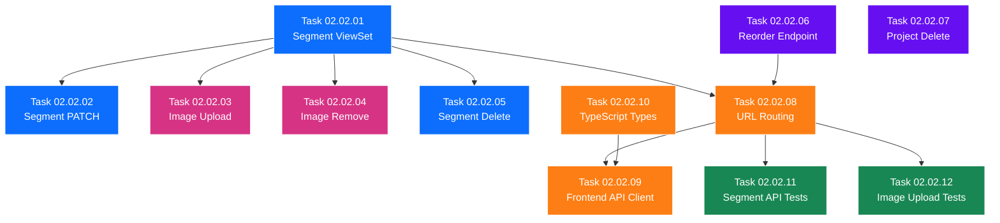

# SubPhase 02.02 — Segment Management API

> **Layer:** 2 — Sub-Phase Overview
> **Phase:** Phase 02 — The Logic
> **Parent Document:** [Phase_02_Overview.md](../Phase_02_Overview.md)
> **Folder:** `SubPhase_02_02_Segment_Management_API/`
> **Status:** NOT STARTED
> **Estimated Tasks:** 12

---

## Table of Contents

1. [Sub-Phase Objective](#1-sub-phase-objective)
2. [Scope](#2-scope)
3. [Technical Context](#3-technical-context)
4. [Task List](#4-task-list)
5. [Task Details](#5-task-details)
6. [Execution Order](#6-execution-order)
7. [Files Created & Modified](#7-files-created--modified)
8. [Validation Criteria](#8-validation-criteria)
9. [Constraints](#9-constraints)
10. [Notes & Gotchas](#10-notes--gotchas)
11. [Cross-References](#11-cross-references)

---

## 1. Sub-Phase Objective

**Implement the full backend API for managing individual segments and projects** — editing text and prompts, uploading and removing images, reordering segments, locking/unlocking, deleting segments, and deleting projects with complete cascade cleanup. This sub-phase also updates the frontend API client and TypeScript types so that SubPhase 02.03's Timeline Editor UI can consume these endpoints immediately.

### What This Sub-Phase Delivers

1. **SegmentViewSet** (`api/views.py`) — DRF ViewSet with `list`, `partial_update` (PATCH), and `destroy` (DELETE) for segments, plus filtering by project.
2. **Image Upload Action** — `POST /api/segments/{id}/upload-image/` custom DRF action that accepts `multipart/form-data`, validates with Pillow, stores images, and handles old-image cleanup.
3. **Image Removal Action** — `DELETE /api/segments/{id}/remove-image/` custom DRF action that deletes the image file from disk and clears the model field.
4. **Segment Reorder Endpoint** — `POST /api/segments/reorder/` standalone view with `@transaction.atomic` to batch-update `sequence_index` values.
5. **Project Delete with Cascade Cleanup** — `DELETE /api/projects/{id}/` added to `ProjectViewSet` with `perform_destroy()` override that also removes the project's entire media directory from disk.
6. **URL Routing Updates** — `SegmentViewSet` registered on the DRF router, reorder endpoint added as a standalone route.
7. **Updated Frontend API Client** (`lib/api.ts`) — New functions: `updateSegment`, `deleteSegment`, `uploadSegmentImage`, `removeSegmentImage`, `reorderSegments`, `deleteProject`.
8. **Updated TypeScript Types** (`lib/types.ts`) — New types: `UpdateSegmentPayload`, `ReorderPayload`.

### What This Sub-Phase Does NOT Deliver

- The Timeline Editor UI (SubPhase 02.03).
- Frontend components (SegmentCard, ImageUploader, SegmentTextEditor, etc.) — those are SubPhase 02.03.
- Zustand state store — deferred to SubPhase 02.03.
- Any audio or video processing (Phase 03 / Phase 04).
- Any model schema changes (models are frozen from Phase 01).

---

## 2. Scope

### 2.1 In Scope

| Area                        | Details                                                                    |
| --------------------------- | -------------------------------------------------------------------------- |
| Backend — SegmentViewSet    | DRF ModelViewSet with list (filtered by project), partial_update, destroy  |
| Backend — Image Upload      | Custom `@action` on SegmentViewSet, multipart/form-data, Pillow validation |
| Backend — Image Removal     | Custom `@action` on SegmentViewSet, disk file deletion, field nullification |
| Backend — Segment Delete    | `destroy` action with media file cleanup from disk                         |
| Backend — Reorder           | Standalone `POST /api/segments/reorder/` with atomic batch update          |
| Backend — Project Delete    | `perform_destroy()` override on ProjectViewSet with media directory cleanup |
| Backend — URL Routing       | Register SegmentViewSet, add reorder route to `api/urls.py`               |
| Backend — Tests             | Full test coverage for all segment CRUD operations and image upload/removal |
| Frontend — API Client       | 6 new functions in `lib/api.ts`                                            |
| Frontend — TypeScript Types | New payload types in `lib/types.ts`                                        |

### 2.2 Out of Scope

| Area                        | Reason                                                                     |
| --------------------------- | -------------------------------------------------------------------------- |
| Import & Parse              | Completed in SubPhase 02.01                                                |
| Timeline Editor UI          | Deferred to SubPhase 02.03                                                 |
| Drag-and-drop reordering UI | Deferred to SubPhase 02.03 (backend reorder endpoint is built here)        |
| Zustand state store         | Deferred to SubPhase 02.03                                                 |
| Audio generation / playback | Deferred to Phase 03                                                       |
| Video rendering             | Deferred to Phase 04                                                       |
| Any model modifications     | Models are frozen from Phase 01                                            |

---

## 3. Technical Context

### 3.1 Prerequisites from Previous Sub-Phases

This sub-phase depends on deliverables from Phase 01 (all three sub-phases) and SubPhase 02.01:

| Deliverable                              | Source              | What We Use It For                                      |
| ---------------------------------------- | ------------------- | ------------------------------------------------------- |
| `Project` model                          | SubPhase 01.02      | Query projects, cascade delete                          |
| `Segment` model                          | SubPhase 01.02      | All CRUD operations, image field updates                |
| `ProjectSerializer` (with nested segs)   | SubPhase 01.02      | Response serialization for project delete confirmation   |
| `SegmentSerializer`                      | SubPhase 01.02      | Response serialization for segment operations            |
| DRF configured in `settings.py`          | SubPhase 01.02      | ViewSet and action infrastructure                        |
| `ProjectViewSet` (list/create/retrieve)  | SubPhase 01.03      | Extend with `destroy` action                             |
| URL routing (`api/urls.py`)              | SubPhase 01.03      | Extend with segment routes and reorder endpoint          |
| `lib/api.ts` (Axios client)             | SubPhase 01.03      | Extend with segment management functions                 |
| `lib/types.ts` (TypeScript interfaces)   | SubPhase 01.03      | Extend with segment mutation types                       |
| Pillow in `requirements.txt`             | SubPhase 01.01      | Image validation — already installed, now actively used  |
| `MEDIA_URL` / `MEDIA_ROOT` configured    | SubPhase 01.01      | Image file storage and serving                           |
| Import endpoint working                  | SubPhase 02.01      | Segments exist in DB via import — foundation for CRUD    |
| `api/parsers.py` and `api/validators.py` | SubPhase 02.01      | Exist as reference but not directly used in this sub-phase |

### 3.2 Database Models (Frozen — Reference Only)

These models were defined in Phase 01 and are **not modified** in any Phase 02 sub-phase. Key fields referenced in this sub-phase:

**Segment Model — Fields Used in CRUD:**
```python
class Segment(models.Model):
    project = models.ForeignKey(Project, on_delete=models.CASCADE, related_name='segments')
    sequence_index = models.IntegerField()                          # Used in reorder
    text_content = models.TextField()                               # PATCH target
    image_prompt = models.TextField(blank=True, default='')         # PATCH target
    image_file = models.ImageField(upload_to='projects/', blank=True, null=True)  # Upload/Remove target
    audio_file = models.FileField(upload_to='projects/', blank=True, null=True)   # NOT used in Phase 02
    audio_duration = models.FloatField(blank=True, null=True)       # NOT used in Phase 02
    is_locked = models.BooleanField(default=False)                  # PATCH target (lock toggle)
    created_at = models.DateTimeField(auto_now_add=True)
    updated_at = models.DateTimeField(auto_now=True)

    class Meta:
        ordering = ['sequence_index']
```

**Project Model — Fields Used in Delete:**
```python
class Project(models.Model):
    title = models.CharField(max_length=200)
    status = models.CharField(max_length=20, default='DRAFT')
    created_at = models.DateTimeField(auto_now_add=True)
    updated_at = models.DateTimeField(auto_now=True)
```

> **Note:** `on_delete=models.CASCADE` on the Segment's `project` FK ensures database-level cascade deletion. However, file cleanup (images, audio) must be handled explicitly in code.

### 3.3 API Endpoint Specifications

This sub-phase implements 8 new endpoints (or actions). Below is the full specification for each:

#### 3.3.1 List Segments (Filtered by Project)

| Attribute       | Value                                        |
| --------------- | -------------------------------------------- |
| Method          | `GET`                                        |
| URL             | `/api/segments/?project={project_id}`        |
| Authentication  | None                                         |
| Filtering       | Required `project` query parameter           |

**Response (HTTP 200):**
```json
[
  {
    "id": 1,
    "sequence_index": 0,
    "text_content": "The narrator begins...",
    "image_prompt": "A dark forest at twilight",
    "image_file": null,
    "audio_file": null,
    "audio_duration": null,
    "is_locked": false,
    "created_at": "2025-01-01T00:00:00Z",
    "updated_at": "2025-01-01T00:00:00Z"
  }
]
```

**Notes:**
- Results are ordered by `sequence_index` (ascending) — enforced by the model's `Meta.ordering`.
- If `project` query parameter is missing, return empty list or 400 (design decision: return empty list for simplicity).

#### 3.3.2 Update Segment (Partial)

| Attribute       | Value                                    |
| --------------- | ---------------------------------------- |
| Method          | `PATCH`                                  |
| URL             | `/api/segments/{id}/`                    |
| Content-Type    | `application/json`                       |
| Authentication  | None                                     |

**Request Body (all fields optional):**
```json
{
  "text_content": "Updated narration text",
  "image_prompt": "Updated image description",
  "is_locked": true
}
```

**Response (HTTP 200):** Full serialized segment (same shape as list item).

**Validation Rules:**
- Only `text_content`, `image_prompt`, and `is_locked` are updatable via PATCH.
- `sequence_index`, `image_file`, `audio_file`, `audio_duration` are NOT directly updatable via PATCH — these are managed by dedicated actions/endpoints.
- If `is_locked` is `true` and the client tries to update `text_content` or `image_prompt`, return HTTP 400 with: `{"error": "Cannot edit a locked segment. Unlock it first."}`.

#### 3.3.3 Delete Segment

| Attribute       | Value                                    |
| --------------- | ---------------------------------------- |
| Method          | `DELETE`                                 |
| URL             | `/api/segments/{id}/`                    |
| Authentication  | None                                     |

**Response (HTTP 204):** No content.

**Side Effects:**
- If the segment has an `image_file`, delete the image from disk.
- If the segment has an `audio_file`, delete the audio from disk (future-proofing even though audio won't exist yet in Phase 02).
- The segment record is removed from the database.
- **Note:** `sequence_index` values of remaining segments are NOT automatically re-normalized. The client should call the reorder endpoint if contiguous indices are needed.

#### 3.3.4 Upload Image

| Attribute       | Value                                    |
| --------------- | ---------------------------------------- |
| Method          | `POST`                                   |
| URL             | `/api/segments/{id}/upload-image/`       |
| Content-Type    | `multipart/form-data`                    |
| Form Field      | `image` (file)                           |
| Authentication  | None                                     |

**Response (HTTP 200):**
```json
{
  "id": 1,
  "image_file": "/media/projects/1/images/1_landscape.jpg",
  "message": "Image uploaded successfully"
}
```

**Validation:**
- Accepted formats: JPEG (`.jpg`, `.jpeg`), PNG (`.png`), WebP (`.webp`).
- Maximum file size: 20MB (`DATA_UPLOAD_MAX_MEMORY_SIZE` set in settings.py).
- Server-side validation: Open with `Pillow.Image.open()` and call `.verify()` to confirm the file is a valid, non-corrupt image.
- Reject non-image files or corrupt files with HTTP 400: `{"error": "Invalid image file", "details": "..."}`.

**Storage Path:** `media/projects/{project_id}/images/{segment_id}_{original_filename}`

**Old Image Cleanup:**
- If the segment already has an `image_file` value, delete the old file from disk BEFORE saving the new one.
- This prevents orphaned files from accumulating.

**Locked Segment Check:**
- If `is_locked` is `true`, return HTTP 400: `{"error": "Cannot modify a locked segment."}`.

#### 3.3.5 Remove Image

| Attribute       | Value                                    |
| --------------- | ---------------------------------------- |
| Method          | `DELETE`                                 |
| URL             | `/api/segments/{id}/remove-image/`       |
| Authentication  | None                                     |

**Response (HTTP 200):**
```json
{
  "id": 1,
  "image_file": null,
  "message": "Image removed successfully"
}
```

**Side Effects:**
- Delete the image file from disk.
- Set `segment.image_file` to `None` and save.

**Edge Case:** If the segment has no image (`image_file` is `None`), return HTTP 400: `{"error": "No image to remove"}`.

**Locked Segment Check:**
- If `is_locked` is `true`, return HTTP 400: `{"error": "Cannot modify a locked segment."}`.

#### 3.3.6 Reorder Segments

| Attribute       | Value                                    |
| --------------- | ---------------------------------------- |
| Method          | `POST`                                   |
| URL             | `/api/segments/reorder/`                 |
| Content-Type    | `application/json`                       |
| Authentication  | None                                     |

**Request Body:**
```json
{
  "project_id": 1,
  "segment_order": [3, 1, 2]
}
```

The `segment_order` array contains segment IDs in the desired order. Each segment's `sequence_index` is updated to match its position in this array (0-indexed).

**Response (HTTP 200):**
```json
{
  "message": "Segments reordered successfully",
  "segments": [
    {"id": 3, "sequence_index": 0},
    {"id": 1, "sequence_index": 1},
    {"id": 2, "sequence_index": 2}
  ]
}
```

**Validation:**
- `project_id` must reference an existing project. If not, HTTP 404.
- All IDs in `segment_order` must belong to the specified project. If any ID is invalid or belongs to a different project, return HTTP 400: `{"error": "Invalid segment IDs", "details": "..."}`.
- The `segment_order` array must contain exactly the same set of segment IDs that belong to the project (no missing, no extras). If counts don't match, return HTTP 400.

**Atomicity:** Uses `@transaction.atomic` to ensure all `sequence_index` updates succeed or none do.

#### 3.3.7 Delete Project

| Attribute       | Value                                    |
| --------------- | ---------------------------------------- |
| Method          | `DELETE`                                 |
| URL             | `/api/projects/{id}/`                    |
| Authentication  | None                                     |

**Response (HTTP 204):** No content.

**Side Effects:**
- Django's `CASCADE` automatically deletes all associated `Segment` records from the database.
- **Additional:** The `perform_destroy()` override must delete the entire project media directory from disk: `media/projects/{project_id}/`.
- Use `shutil.rmtree()` for recursive directory deletion.
- If the media directory doesn't exist (project had no uploads), handle gracefully (no error).

#### 3.3.8 Update URL Routing

After this sub-phase, `api/urls.py` should register:

```python
from django.urls import path, include
from rest_framework.routers import DefaultRouter
from . import views

router = DefaultRouter()
router.register(r'projects', views.ProjectViewSet)
router.register(r'segments', views.SegmentViewSet)

urlpatterns = [
    path('', include(router.urls)),
    path('projects/import/', views.import_project, name='project-import'),
    path('segments/reorder/', views.reorder_segments, name='segment-reorder'),
]
```

**Important:** The `projects/import/` and `segments/reorder/` standalone routes must be placed **before** the `include(router.urls)` to prevent the router from intercepting them.

### 3.4 Image Upload Pipeline (Visual)

```
User drops/selects image file
    │
    ▼
Browser creates FormData with "image" field
    │
    ▼
POST /api/segments/{id}/upload-image/
    │
    ▼
Django receives multipart request
    │
    ├── Check is_locked → 400 if locked
    │
    ├── Validate file type (extension + Pillow) → 400 if invalid
    │
    ├── Validate file size (≤ 20MB) → 400 if too large
    │
    ├── If old image exists → delete from disk
    │
    ├── Create storage directory: media/projects/{project_id}/images/
    │
    ├── Save file: {segment_id}_{original_filename}
    │
    ├── Update segment.image_file field
    │
    └── Return 200 with updated image_file path
```

### 3.5 Project Delete Pipeline (Visual)

```
DELETE /api/projects/{id}/
    │
    ▼
ProjectViewSet.perform_destroy(instance)
    │
    ├── Compute media path: media/projects/{project_id}/
    │
    ├── If path exists → shutil.rmtree(path)
    │   (Removes all images, audio files, and subdirectories)
    │
    └── instance.delete()
        (CASCADE removes all Segment records from DB)
```

### 3.6 SegmentViewSet Design

The `SegmentViewSet` is a DRF `ModelViewSet` with restricted actions:

```python
class SegmentViewSet(viewsets.ModelViewSet):
    queryset = Segment.objects.all()
    serializer_class = SegmentSerializer

    # Allowed actions: list, retrieve, partial_update, destroy
    # NOT allowed: create (segments are created via import only)
    http_method_names = ['get', 'patch', 'delete', 'head', 'options']
```

**Why no `create` action on SegmentViewSet?**
- Segments are created exclusively through the import endpoint (`POST /api/projects/import/`).
- There is no "Add Segment" UI in the current StoryFlow spec.
- This deliberate restriction keeps the data model consistent: segments are always created as part of a complete import operation.

**Filtering:**
```python
def get_queryset(self):
    queryset = Segment.objects.all()
    project_id = self.request.query_params.get('project')
    if project_id is not None:
        queryset = queryset.filter(project_id=project_id)
    return queryset
```

**Lock Check on Update:**
```python
def perform_update(self, serializer):
    instance = self.get_object()
    if instance.is_locked:
        # Allow ONLY is_locked field to be updated (unlock operation)
        allowed_fields = set(serializer.validated_data.keys())
        if allowed_fields - {'is_locked'}:
            raise ValidationError({"error": "Cannot edit a locked segment. Unlock it first."})
    serializer.save()
```

**Cleanup on Destroy:**
```python
def perform_destroy(self, instance):
    # Delete associated media files from disk
    if instance.image_file:
        if os.path.isfile(instance.image_file.path):
            os.remove(instance.image_file.path)
    if instance.audio_file:
        if os.path.isfile(instance.audio_file.path):
            os.remove(instance.audio_file.path)
    instance.delete()
```

### 3.7 Frontend API Client Extensions

New functions to add to `frontend/lib/api.ts`:

```typescript
// Segment CRUD
export async function updateSegment(id: number, data: UpdateSegmentPayload): Promise<Segment> {
  const response = await api.patch(`/segments/${id}/`, data);
  return response.data;
}

export async function deleteSegment(id: number): Promise<void> {
  await api.delete(`/segments/${id}/`);
}

// Image management
export async function uploadSegmentImage(id: number, file: File): Promise<{ id: number; image_file: string; message: string }> {
  const formData = new FormData();
  formData.append('image', file);
  const response = await api.post(`/segments/${id}/upload-image/`, formData, {
    headers: { 'Content-Type': 'multipart/form-data' },
  });
  return response.data;
}

export async function removeSegmentImage(id: number): Promise<{ id: number; image_file: null; message: string }> {
  const response = await api.delete(`/segments/${id}/remove-image/`);
  return response.data;
}

// Reorder
export async function reorderSegments(projectId: number, segmentOrder: number[]): Promise<void> {
  await api.post('/segments/reorder/', { project_id: projectId, segment_order: segmentOrder });
}

// Project delete
export async function deleteProject(id: number): Promise<void> {
  await api.delete(`/projects/${id}/`);
}
```

### 3.8 TypeScript Type Extensions

New types to add to `frontend/lib/types.ts`:

```typescript
export interface UpdateSegmentPayload {
  text_content?: string;
  image_prompt?: string;
  is_locked?: boolean;
}

export interface ReorderPayload {
  project_id: number;
  segment_order: number[];
}
```

---

## 4. Task List

| #  | Task ID   | Task Title                           | Depends On | Est. Complexity | File(s) Affected                          |
| -- | --------- | ------------------------------------ | ---------- | --------------- | ----------------------------------------- |
| 1  | 02.02.01  | Create Segment ViewSet               | —          | Medium          | `backend/api/views.py`                    |
| 2  | 02.02.02  | Implement Segment PATCH              | 01         | Medium          | `backend/api/views.py`                    |
| 3  | 02.02.03  | Implement Image Upload Action        | 01         | High            | `backend/api/views.py`, `backend/api/validators.py` |
| 4  | 02.02.04  | Implement Image Remove Action        | 01         | Low             | `backend/api/views.py`                    |
| 5  | 02.02.05  | Implement Segment Delete             | 01         | Medium          | `backend/api/views.py`                    |
| 6  | 02.02.06  | Implement Reorder Endpoint           | —          | Medium          | `backend/api/views.py`                    |
| 7  | 02.02.07  | Implement Project Delete             | —          | Medium          | `backend/api/views.py`                    |
| 8  | 02.02.08  | Update URL Routing                   | 01, 06     | Low             | `backend/api/urls.py`                     |
| 9  | 02.02.09  | Update Frontend API Client           | 08         | Medium          | `frontend/lib/api.ts`                     |
| 10 | 02.02.10  | Update TypeScript Types              | —          | Low             | `frontend/lib/types.ts`                   |
| 11 | 02.02.11  | Write Segment API Tests              | 08         | High            | `backend/api/tests.py`                    |
| 12 | 02.02.12  | Write Image Upload Tests             | 08         | High            | `backend/api/tests.py`                    |

---

## 5. Task Details

### Task 02.02.01 — Create Segment ViewSet

**Objective:** Create the `SegmentViewSet` class in `views.py` with list and retrieve actions, plus filtering by project.

**File:** `backend/api/views.py` (MODIFY — add to existing file)

**Steps:**
1. Import `Segment` model and `SegmentSerializer`.
2. Create `SegmentViewSet` inheriting from `viewsets.ModelViewSet`.
3. Set `queryset = Segment.objects.all()` and `serializer_class = SegmentSerializer`.
4. Restrict HTTP methods to `GET`, `PATCH`, `DELETE` (plus `HEAD`, `OPTIONS`). Explicitly set `http_method_names = ['get', 'patch', 'delete', 'head', 'options']`.
5. Override `get_queryset()` to filter by `project` query parameter:
   - Read `self.request.query_params.get('project')`.
   - If provided, filter `queryset.filter(project_id=project_id)`.
   - If not provided, return `Segment.objects.none()` (design choice: require project filter for list, but individual retrieve by ID should still work).
6. Ensure results are ordered by `sequence_index` (already handled by model `Meta.ordering`).

**Key Details:**
- No `create` action — segments are only created via the import endpoint (SubPhase 02.01).
- The ViewSet is a standard DRF ModelViewSet with restricted methods, NOT a custom view.
- `retrieve` works without the `project` filter (direct ID access) — only `list` requires the filter.

---

### Task 02.02.02 — Implement Segment PATCH

**Objective:** Implement the `partial_update` (PATCH) logic in `SegmentViewSet` with lock-awareness.

**File:** `backend/api/views.py` (MODIFY — extend SegmentViewSet)

**Steps:**
1. Override `perform_update(self, serializer)` on `SegmentViewSet`.
2. Get the current instance: `instance = self.get_object()`.
3. Check if the segment is locked (`instance.is_locked is True`):
   a. If locked, inspect `serializer.validated_data.keys()`.
   b. If the ONLY field being updated is `is_locked` (unlock operation), allow it.
   c. If ANY other field is present alongside or instead of `is_locked`, raise `ValidationError({"error": "Cannot edit a locked segment. Unlock it first."})`.
4. If not locked, proceed with `serializer.save()`.
5. Ensure the serializer uses `partial=True` (DRF handles this automatically for PATCH via the ViewSet).

**Key Details:**
- The lock check MUST allow unlocking a locked segment. If a PATCH request sends `{"is_locked": false}`, it should succeed even when the segment is currently locked.
- The lock check prevents editing `text_content` or `image_prompt` on locked segments.
- `sequence_index`, `image_file`, `audio_file`, `audio_duration` are NOT editable via PATCH — they are managed by dedicated actions.
- Optionally, restrict writable fields in the serializer or use a separate `SegmentUpdateSerializer` with only `text_content`, `image_prompt`, and `is_locked` fields.

---

### Task 02.02.03 — Implement Image Upload Action

**Objective:** Add the `upload-image` custom action to `SegmentViewSet` that handles multipart image uploads with Pillow validation.

**Files:** `backend/api/views.py` (MODIFY — add action to SegmentViewSet), `backend/api/validators.py` (MODIFY — add image validation function)

**Steps:**
1. In `validators.py`, add `validate_image_upload(file)` function:
   a. Check file extension is in `['.jpg', '.jpeg', '.png', '.webp']`. If not, raise `ValidationError`.
   b. Check file size ≤ 20MB. If over, raise `ValidationError`.
   c. Use `Pillow.Image.open(file)` to open the image.
   d. Call `image.verify()` to confirm the file is a valid image (not corrupt).
   e. **Reset the file pointer:** After `verify()`, call `file.seek(0)` because `verify()` consumes the file stream.
   f. Return the validated file.
2. In `views.py`, add `upload_image` action on `SegmentViewSet`:
   ```python
   @action(detail=True, methods=['post'], url_path='upload-image')
   def upload_image(self, request, pk=None):
       segment = self.get_object()
       # ... implementation
   ```
3. Check `is_locked` → return 400 if locked.
4. Get the uploaded file from `request.FILES.get('image')`. If missing, return 400.
5. Call `validate_image_upload(file)`.
6. Build storage path: `media/projects/{segment.project_id}/images/{segment.id}_{file.name}`.
7. Create the directory if it doesn't exist: `os.makedirs(directory, exist_ok=True)`.
8. If `segment.image_file` already has a value, delete the old file from disk.
9. Save the new file to disk. Update `segment.image_file` with the relative path. Save the model.
10. Return 200 with `{"id": segment.id, "image_file": segment.image_file.url, "message": "Image uploaded successfully"}`.

**Key Details:**
- Use `os.path.join(settings.MEDIA_ROOT, 'projects', str(segment.project_id), 'images')` for the storage directory.
- File is saved manually (NOT using Django's `ImageField.save()` with `upload_to`) because the custom path structure requires explicit control.
- Alternatively, use Django's file storage API (`default_storage.save()`) for consistency.
- The old image cleanup is CRITICAL — without it, re-uploading creates orphaned files.
- After `Pillow.Image.verify()`, always call `file.seek(0)` before saving — `verify()` reads the file and doesn't reset the pointer.

---

### Task 02.02.04 — Implement Image Remove Action

**Objective:** Add the `remove-image` custom action to `SegmentViewSet` that deletes the image file and clears the model field.

**File:** `backend/api/views.py` (MODIFY — add action to SegmentViewSet)

**Steps:**
1. Add `remove_image` action:
   ```python
   @action(detail=True, methods=['delete'], url_path='remove-image')
   def remove_image(self, request, pk=None):
       segment = self.get_object()
       # ... implementation
   ```
2. Check `is_locked` → return 400 if locked.
3. Check `segment.image_file` → if `None` or empty, return 400: `{"error": "No image to remove"}`.
4. Delete the file from disk: `os.remove(segment.image_file.path)`.
5. Set `segment.image_file = None` and `segment.save()`.
6. Return 200: `{"id": segment.id, "image_file": null, "message": "Image removed successfully"}`.

**Key Details:**
- Wrap the `os.remove()` in a try/except `FileNotFoundError` — the file might have been manually deleted from disk.
- If the file doesn't exist on disk, still clear the model field (self-healing behavior).
- The response returns `null` for `image_file` to confirm removal.

---

### Task 02.02.05 — Implement Segment Delete

**Objective:** Implement the `destroy` (DELETE) logic in `SegmentViewSet` with media file cleanup.

**File:** `backend/api/views.py` (MODIFY — override perform_destroy on SegmentViewSet)

**Steps:**
1. Override `perform_destroy(self, instance)` on `SegmentViewSet`.
2. Before deleting the database record, check for and delete media files:
   a. If `instance.image_file` and `os.path.isfile(instance.image_file.path)`: call `os.remove(instance.image_file.path)`.
   b. If `instance.audio_file` and `os.path.isfile(instance.audio_file.path)`: call `os.remove(instance.audio_file.path)`.
3. Call `instance.delete()` to remove the database record.
4. Return HTTP 204 (no content) — DRF handles this automatically for `destroy`.

**Key Details:**
- Check `os.path.isfile()` before attempting deletion to avoid `FileNotFoundError`.
- Audio file cleanup is future-proofing — in Phase 02, `audio_file` will always be `None`, but the code should handle it for robustness.
- There is no lock check on delete — a locked segment CAN be deleted (the lock prevents content editing, not deletion). This is a deliberate design decision: the user should always be able to remove segments.

---

### Task 02.02.06 — Implement Reorder Endpoint

**Objective:** Create the `POST /api/segments/reorder/` standalone view that atomically updates segment ordering.

**File:** `backend/api/views.py` (MODIFY — add standalone view function)

**Steps:**
1. Create `reorder_segments` function-based view decorated with `@api_view(['POST'])`.
2. Extract `project_id` and `segment_order` from `request.data`.
3. Validate `project_id`:
   a. Must be present. If missing, return 400.
   b. Must reference an existing project. If not found, return 404.
4. Validate `segment_order`:
   a. Must be a non-empty list. If missing or empty, return 400.
   b. Must contain valid integer IDs. If any are not integers, return 400.
5. Fetch all segments for the project: `segments = Segment.objects.filter(project_id=project_id)`.
6. Validate completeness:
   a. The set of IDs in `segment_order` must match the set of actual segment IDs for the project.
   b. If there are missing IDs or extra IDs, return 400 with details.
7. Within `@transaction.atomic`:
   a. For each ID at position `i` in `segment_order`, update `Segment.objects.filter(id=segment_id).update(sequence_index=i)`.
   b. Alternatively, use a single loop with `bulk_update` for efficiency.
8. Return 200 with the updated segment ID/sequence_index pairs.

**Key Details:**
- `@transaction.atomic` ensures either all sequence_index values are updated or none are.
- Use `Segment.objects.bulk_update(segments_to_update, ['sequence_index'])` for efficiency — O(1) query instead of O(n) individual updates.
- The reorder endpoint is standalone (`@api_view`), NOT a ViewSet action, because it operates on multiple segments at once rather than a single resource.

---

### Task 02.02.07 — Implement Project Delete

**Objective:** Add the `destroy` action to `ProjectViewSet` with media directory cleanup.

**File:** `backend/api/views.py` (MODIFY — extend existing ProjectViewSet)

**Steps:**
1. Import `shutil` and `os`.
2. Override `perform_destroy(self, instance)` on `ProjectViewSet`.
3. Build the project media directory path: `os.path.join(settings.MEDIA_ROOT, 'projects', str(instance.id))`.
4. If the directory exists (`os.path.isdir()`), delete it recursively: `shutil.rmtree(media_path)`.
5. Call `instance.delete()` — Django's CASCADE handles all segment database records.
6. Return HTTP 204 (no content) — DRF handles this automatically.

**Key Details:**
- `shutil.rmtree()` deletes the directory and ALL its contents recursively — images, audio files, and any subdirectories.
- Use `shutil.rmtree(path, ignore_errors=True)` to prevent failures if the directory is partially deleted or has permission issues.
- The media directory might not exist if the project has no uploaded files — handle gracefully with `os.path.isdir()` check.
- The `ProjectViewSet` from Phase 01 only had `list`, `create`, and `retrieve`. Adding `destroy` extends its capabilities without breaking existing functionality.

---

### Task 02.02.08 — Update URL Routing

**Objective:** Register the `SegmentViewSet` on the DRF router and add the reorder standalone route to `api/urls.py`.

**File:** `backend/api/urls.py` (MODIFY)

**Steps:**
1. Import `SegmentViewSet` and `reorder_segments` from `views.py`.
2. Register `SegmentViewSet` on the router: `router.register(r'segments', views.SegmentViewSet)`.
3. Add the reorder standalone route BEFORE the `include(router.urls)`:
   ```python
   urlpatterns = [
       path('projects/import/', views.import_project, name='project-import'),
       path('segments/reorder/', views.reorder_segments, name='segment-reorder'),
       path('', include(router.urls)),
   ]
   ```
4. Verify that the `upload-image` and `remove-image` custom actions on `SegmentViewSet` are automatically routed by DRF (they are, because `@action` with `url_path` generates routes automatically).

**Key Details:**
- Standalone routes (`projects/import/`, `segments/reorder/`) MUST come before `include(router.urls)` to prevent the router from intercepting them.
- The router auto-generates these routes for the SegmentViewSet:
  - `GET /api/segments/` — list
  - `GET /api/segments/{id}/` — retrieve
  - `PATCH /api/segments/{id}/` — partial_update
  - `DELETE /api/segments/{id}/` — destroy
  - `POST /api/segments/{id}/upload-image/` — custom action
  - `DELETE /api/segments/{id}/remove-image/` — custom action
- The `ProjectViewSet` routes remain unchanged: `GET /api/projects/`, `POST /api/projects/`, `GET /api/projects/{id}/`, `DELETE /api/projects/{id}/`.

---

### Task 02.02.09 — Update Frontend API Client

**Objective:** Add 6 new API functions to `frontend/lib/api.ts` for segment management and project deletion.

**File:** `frontend/lib/api.ts` (MODIFY)

**Steps:**
1. Add `updateSegment(id: number, data: UpdateSegmentPayload): Promise<Segment>` — PATCH request.
2. Add `deleteSegment(id: number): Promise<void>` — DELETE request.
3. Add `uploadSegmentImage(id: number, file: File): Promise<{id: number; image_file: string; message: string}>` — POST with FormData.
4. Add `removeSegmentImage(id: number): Promise<{id: number; image_file: null; message: string}>` — DELETE request.
5. Add `reorderSegments(projectId: number, segmentOrder: number[]): Promise<void>` — POST request.
6. Add `deleteProject(id: number): Promise<void>` — DELETE request.

**Key Details:**
- For `uploadSegmentImage`, create a `FormData` object and append the file. Set `Content-Type` header to `multipart/form-data` (Axios handles this automatically when the body is `FormData`, so the explicit header may be unnecessary — test both ways).
- All URLs must include trailing slashes to match Django's URL configuration.
- Import the `UpdateSegmentPayload` type from `types.ts` (see Task 02.02.10).
- See §3.7 for complete function signatures.

---

### Task 02.02.10 — Update TypeScript Types

**Objective:** Add new TypeScript interfaces to `frontend/lib/types.ts` for segment mutation payloads.

**File:** `frontend/lib/types.ts` (MODIFY)

**Steps:**
1. Add `UpdateSegmentPayload` interface:
   ```typescript
   export interface UpdateSegmentPayload {
     text_content?: string;
     image_prompt?: string;
     is_locked?: boolean;
   }
   ```
2. Add `ReorderPayload` interface:
   ```typescript
   export interface ReorderPayload {
     project_id: number;
     segment_order: number[];
   }
   ```
3. Verify that the existing `Segment` interface includes all fields returned by the API (this was defined in SubPhase 01.03 — confirm `image_file`, `audio_file`, `audio_duration`, `is_locked` are present).

**Key Details:**
- All fields in `UpdateSegmentPayload` are optional because PATCH only requires the fields being updated.
- `ReorderPayload` is used internally by the `reorderSegments` function but may also be useful for the Zustand store in SubPhase 02.03.
- The `ImportProjectRequest` type was already added in SubPhase 02.01 (Task 02.01.09) — no changes needed for import types.

---

### Task 02.02.11 — Write Segment API Tests

**Objective:** Write comprehensive backend tests for all segment CRUD operations, reorder, and project delete.

**File:** `backend/api/tests.py` (MODIFY — add test classes)

**Steps:**
1. Add `TestSegmentList` class:
   - Create a project with 3 segments via import.
   - `GET /api/segments/?project={id}` → 200 with 3 segments ordered by `sequence_index`.
   - `GET /api/segments/` (no filter) → 200 with empty list (or all segments — document expected behavior).
2. Add `TestSegmentUpdate` class:
   - PATCH text_content → 200, field updated.
   - PATCH image_prompt → 200, field updated.
   - PATCH is_locked to true → 200, segment locked.
   - PATCH text_content on locked segment → 400 with lock error.
   - PATCH is_locked to false on locked segment → 200 (unlock succeeds).
   - PATCH sequence_index → 200 but field NOT changed (or 400 — clarify in implementation).
3. Add `TestSegmentDelete` class:
   - DELETE existing segment → 204, segment removed from DB.
   - DELETE segment with image file → 204, image file deleted from disk.
   - DELETE non-existent segment → 404.
4. Add `TestSegmentReorder` class:
   - POST reorder with valid data → 200, sequence_index values updated.
   - POST reorder with missing segment IDs → 400.
   - POST reorder with extra segment IDs → 400.
   - POST reorder with IDs from wrong project → 400.
   - POST reorder atomicity: verify all-or-nothing behavior.
5. Add `TestProjectDelete` class:
   - DELETE project → 204, project and all segments removed from DB.
   - DELETE project with media files → 204, media directory removed from disk.
   - DELETE non-existent project → 404.

**Key Details:**
- Use DRF's `APITestCase` for all test classes.
- Create test data in `setUp()` using the import endpoint or direct model creation.
- For image-related tests, create temporary image files using Pillow in the test setup.
- Use `tempfile.mkdtemp()` or override `MEDIA_ROOT` in tests to avoid polluting the real media directory.
- Verify disk state (file existence) using `os.path.isfile()` and `os.path.isdir()` in assertions.

---

### Task 02.02.12 — Write Image Upload Tests

**Objective:** Write comprehensive backend tests specifically for image upload and removal operations.

**File:** `backend/api/tests.py` (MODIFY — add test classes)

**Steps:**
1. Add `TestImageUpload` class:
   - Upload valid JPEG → 200, `image_file` field populated, file exists on disk.
   - Upload valid PNG → 200, success.
   - Upload valid WebP → 200, success.
   - Upload non-image file (e.g., `.txt`) → 400 with error.
   - Upload corrupt image file → 400 with error.
   - Upload file over 20MB → 400 with error.
   - Upload to locked segment → 400 with lock error.
   - Re-upload (segment already has image) → 200, old file deleted, new file saved.
   - Upload with no file attached → 400.
   - Verify storage path format: `media/projects/{project_id}/images/{segment_id}_{filename}`.
2. Add `TestImageRemoval` class:
   - Remove existing image → 200, file deleted from disk, `image_file` set to null.
   - Remove from segment with no image → 400.
   - Remove from locked segment → 400 with lock error.
   - Remove when file already missing from disk → 200 (self-healing — clear field anyway).

**Key Details:**
- Generate test image files programmatically using Pillow:
  ```python
  from PIL import Image
  from io import BytesIO
  from django.core.files.uploadedfile import SimpleUploadedFile

  def create_test_image(filename='test.jpg', format='JPEG', size=(100, 100)):
      image = Image.new('RGB', size, color='red')
      buffer = BytesIO()
      image.save(buffer, format=format)
      buffer.seek(0)
      return SimpleUploadedFile(filename, buffer.read(), content_type=f'image/{format.lower()}')
  ```
- Override `MEDIA_ROOT` in tests using `@override_settings(MEDIA_ROOT=tempfile.mkdtemp())` to isolate test files.
- Clean up temporary directories in `tearDown()`.
- Test the exact storage path to ensure it follows the `projects/{project_id}/images/{segment_id}_{filename}` pattern.

---

## 6. Execution Order

### 6.1 Dependency Chain

```
Task 01 (SegmentViewSet base — no dependencies)
    ├── Task 02 (PATCH — needs ViewSet)
    ├── Task 03 (Upload Image — needs ViewSet)
    ├── Task 04 (Remove Image — needs ViewSet)
    └── Task 05 (Segment Delete — needs ViewSet)

Task 06 (Reorder Endpoint — standalone, no ViewSet dependency)
Task 07 (Project Delete — standalone, extends ProjectViewSet)

Task 08 (URL Routing — needs ViewSet + Reorder)
    ├── Task 09 (Frontend API Client — needs routes)
    └── Task 11 (Segment Tests — needs routes)
    └── Task 12 (Image Upload Tests — needs routes)

Task 10 (TypeScript Types — no dependencies, can start early)
```

### 6.2 Recommended Sequence

| Order | Task(s)    | Rationale                                                        |
| ----- | ---------- | ---------------------------------------------------------------- |
| 1     | 01         | Create the base SegmentViewSet — foundation for all actions      |
| 2     | 02         | Add PATCH logic with lock checking                               |
| 3     | 03         | Add image upload action (most complex single task)               |
| 4     | 04         | Add image remove action (builds on patterns from Task 03)        |
| 5     | 05         | Add segment delete with media cleanup                            |
| 6     | 06         | Build the standalone reorder endpoint                            |
| 7     | 07         | Add project delete to ProjectViewSet                             |
| 8     | 08         | Wire all routes in urls.py                                       |
| 9     | 10         | Add TypeScript types (quick, no dependencies)                    |
| 10    | 09         | Add frontend API functions (needs routes to be testable)         |
| 11    | 11         | Write segment CRUD tests                                         |
| 12    | 12         | Write image upload/removal tests                                 |

### 6.3 Execution Flow (Mermaid)



> **Legend:**
> 🔵 Blue = Core ViewSet / CRUD tasks
> 🟣 Purple = Standalone endpoints (reorder, project delete)
> 🩷 Pink = Image management tasks
> 🟠 Orange = Routing / integration tasks
> 🟢 Green = Test tasks

### 6.4 Parallel Work Opportunities

Tasks that can be developed in parallel (no mutual dependencies):

- **T02, T03, T04, T05** — All extend the SegmentViewSet independently.
- **T06, T07** — Standalone endpoints, independent of SegmentViewSet internals.
- **T10** — TypeScript types can be written at any time.
- **T11, T12** — Both are test tasks, but they can be written in parallel since they test different functionality.

For a single developer working sequentially:
**T01 → T02 → T03 → T04 → T05 → T06 → T07 → T08 → T10 → T09 → T11 → T12**

---

## 7. Files Created & Modified

### 7.1 New Files

This sub-phase creates **no new files**. All changes are modifications to existing files.

### 7.2 Modified Files

| File Path                     | Modified In    | Changes                                                      |
| ----------------------------- | -------------- | ------------------------------------------------------------ |
| `backend/api/views.py`       | Tasks 01-07    | Add `SegmentViewSet` (with PATCH, upload-image, remove-image, destroy actions), `reorder_segments` view, extend `ProjectViewSet` with destroy |
| `backend/api/validators.py`  | Task 03        | Add `validate_image_upload()` function                       |
| `backend/api/urls.py`        | Task 08        | Register `SegmentViewSet` on router, add reorder route       |
| `backend/api/tests.py`       | Tasks 11-12    | Add `TestSegmentList`, `TestSegmentUpdate`, `TestSegmentDelete`, `TestSegmentReorder`, `TestProjectDelete`, `TestImageUpload`, `TestImageRemoval` test classes |
| `frontend/lib/api.ts`        | Task 09        | Add 6 new API functions                                      |
| `frontend/lib/types.ts`      | Task 10        | Add `UpdateSegmentPayload`, `ReorderPayload` interfaces      |

### 7.3 File Modification Map

```
views.py ──→ validators.py (import validate_image_upload)
    │
    └──→ urls.py (register routes)
            │
            ├──→ tests.py (test all endpoints)
            │
            └──→ api.ts ←── types.ts (frontend API client + types)
```

---

## 8. Validation Criteria

### 8.1 Segment List & Retrieve

- [ ] `GET /api/segments/?project={id}` returns segments ordered by `sequence_index` (HTTP 200).
- [ ] `GET /api/segments/?project={id}` with no segments returns empty array.
- [ ] `GET /api/segments/{id}/` retrieves a single segment by ID (HTTP 200).
- [ ] `GET /api/segments/{id}/` with invalid ID returns HTTP 404.

### 8.2 Segment Update (PATCH)

- [ ] `PATCH /api/segments/{id}/` updates `text_content` (HTTP 200).
- [ ] `PATCH /api/segments/{id}/` updates `image_prompt` (HTTP 200).
- [ ] `PATCH /api/segments/{id}/` toggles `is_locked` to `true` (HTTP 200).
- [ ] `PATCH /api/segments/{id}/` on a locked segment with `text_content` returns HTTP 400 with lock error.
- [ ] `PATCH /api/segments/{id}/` on a locked segment with only `{"is_locked": false}` succeeds (HTTP 200) — unlock works.
- [ ] Response includes the full updated segment object.

### 8.3 Image Upload

- [ ] `POST /api/segments/{id}/upload-image/` with valid JPEG returns HTTP 200 with `image_file` path.
- [ ] `POST /api/segments/{id}/upload-image/` with valid PNG returns HTTP 200.
- [ ] `POST /api/segments/{id}/upload-image/` with valid WebP returns HTTP 200.
- [ ] Uploaded image file exists on disk at `media/projects/{project_id}/images/{segment_id}_{filename}`.
- [ ] Uploading a new image to a segment with an existing image deletes the old file from disk.
- [ ] `POST /api/segments/{id}/upload-image/` with non-image file returns HTTP 400.
- [ ] `POST /api/segments/{id}/upload-image/` with corrupt image returns HTTP 400.
- [ ] `POST /api/segments/{id}/upload-image/` with file over 20MB returns HTTP 400.
- [ ] `POST /api/segments/{id}/upload-image/` on a locked segment returns HTTP 400.
- [ ] `POST /api/segments/{id}/upload-image/` with no file attached returns HTTP 400.

### 8.4 Image Removal

- [ ] `DELETE /api/segments/{id}/remove-image/` on segment with image returns HTTP 200, file deleted from disk, `image_file` set to null.
- [ ] `DELETE /api/segments/{id}/remove-image/` on segment without image returns HTTP 400.
- [ ] `DELETE /api/segments/{id}/remove-image/` on locked segment returns HTTP 400.
- [ ] If file is already missing from disk but `image_file` field is set, still clears the field (self-healing).

### 8.5 Segment Delete

- [ ] `DELETE /api/segments/{id}/` removes the segment from the database (HTTP 204).
- [ ] Associated image file is deleted from disk on segment deletion.
- [ ] Associated audio file (if any) would be deleted from disk on segment deletion.
- [ ] Deleting a non-existent segment returns HTTP 404.

### 8.6 Segment Reorder

- [ ] `POST /api/segments/reorder/` with valid data updates `sequence_index` values correctly (HTTP 200).
- [ ] Reorder response includes the updated segment IDs with new `sequence_index` values.
- [ ] Reorder with missing segment IDs returns HTTP 400.
- [ ] Reorder with extra segment IDs returns HTTP 400.
- [ ] Reorder with IDs from a different project returns HTTP 400.
- [ ] Reorder with non-existent `project_id` returns HTTP 404.
- [ ] Reorder is atomic — partial failure does not leave inconsistent `sequence_index` values.

### 8.7 Project Delete

- [ ] `DELETE /api/projects/{id}/` removes the project from the database (HTTP 204).
- [ ] All associated segments are cascade-deleted from the database.
- [ ] The entire project media directory (`media/projects/{id}/`) is deleted from disk.
- [ ] Deleting a project with no media directory succeeds without errors.
- [ ] Deleting a non-existent project returns HTTP 404.

### 8.8 URL Routing

- [ ] `SegmentViewSet` is accessible at `/api/segments/` and `/api/segments/{id}/`.
- [ ] Custom actions are accessible at `/api/segments/{id}/upload-image/` and `/api/segments/{id}/remove-image/`.
- [ ] Reorder endpoint is accessible at `/api/segments/reorder/`.
- [ ] Import endpoint still works at `/api/projects/import/`.
- [ ] All routes include trailing slashes.

### 8.9 Frontend Integration

- [ ] `updateSegment()` in `api.ts` sends PATCH request to correct URL.
- [ ] `deleteSegment()` in `api.ts` sends DELETE request to correct URL.
- [ ] `uploadSegmentImage()` in `api.ts` sends POST with FormData to correct URL.
- [ ] `removeSegmentImage()` in `api.ts` sends DELETE request to correct URL.
- [ ] `reorderSegments()` in `api.ts` sends POST with correct payload to correct URL.
- [ ] `deleteProject()` in `api.ts` sends DELETE request to correct URL.
- [ ] `UpdateSegmentPayload` and `ReorderPayload` types are correctly defined in `types.ts`.
- [ ] TypeScript compiles: `npx tsc --noEmit` passes with zero errors.

### 8.10 Structural Validation

- [ ] Django tests pass: `python manage.py test api` runs without failures.
- [ ] No new Python packages were added beyond Phase 01's `requirements.txt`.
- [ ] All custom actions use `@action` decorator with proper `detail`, `methods`, and `url_path`.
- [ ] All standalone views use `@api_view` decorator.

---

## 9. Constraints

| #  | Constraint                                                      | Source                                                        |
| -- | --------------------------------------------------------------- | ------------------------------------------------------------- |
| 1  | Do NOT modify `Project` or `Segment` model definitions          | [Phase_02_Overview.md](../Phase_02_Overview.md) §10, Constraint #10 |
| 2  | Do NOT add authentication or authorization                      | [00_Project_Overview.md](../../00_Project_Overview.md) §14.1  |
| 3  | Do NOT install Docker, Redis, or Celery                         | [00_Project_Overview.md](../../00_Project_Overview.md) §14.1  |
| 4  | Do NOT add new Python packages                                  | [Phase_02_Overview.md](../Phase_02_Overview.md) §9.2          |
| 5  | Do NOT build frontend UI components (SegmentCard, Timeline, etc.) | Deferred to SubPhase 02.03                                   |
| 6  | Do NOT implement drag-and-drop reordering UI                    | Deferred to SubPhase 02.03 (backend endpoint only)           |
| 7  | Do NOT implement audio or video processing                      | Deferred to Phase 03 / Phase 04                              |
| 8  | All operations in this sub-phase are synchronous                | [Phase_02_Overview.md](../Phase_02_Overview.md) §10, Constraint #9 |
| 9  | Segments cannot be created via SegmentViewSet                   | Segments are created exclusively via the import endpoint      |
| 10 | Image upload accepts only JPEG, PNG, WebP (max 20MB)            | [Phase_02_Overview.md](../Phase_02_Overview.md) §3.5          |
| 11 | Locked segments cannot have text/prompt/image edited            | Lock prevents content editing, NOT deletion                   |
| 12 | All URLs must include trailing slashes                          | Django/DRF convention, prevents 301 redirect issues           |

---

## 10. Notes & Gotchas

### 10.1 Pillow `verify()` Gotcha

After calling `Image.open(file).verify()`, the file pointer is consumed. You MUST call `file.seek(0)` before saving the file to disk or passing it to Django's file storage. Without this, the saved file will be empty or truncated.

```python
from PIL import Image

img = Image.open(uploaded_file)
img.verify()                    # Reads the entire file
uploaded_file.seek(0)           # CRITICAL: Reset pointer before saving
```

### 10.2 `ImageField` vs. Manual File Storage

The `Segment` model uses `ImageField(upload_to='projects/')`, but the custom storage path (`media/projects/{project_id}/images/{segment_id}_{filename}`) doesn't match the default `upload_to`. Two approaches:

**Option A (Recommended):** Use Django's `default_storage.save()` to write the file to the custom path, then set `segment.image_file.name` to the relative path:
```python
from django.core.files.storage import default_storage

relative_path = f'projects/{segment.project_id}/images/{segment.id}_{file.name}'
saved_path = default_storage.save(relative_path, file)
segment.image_file.name = saved_path
segment.save()
```

**Option B:** Use `segment.image_file.save(custom_name, file)` — but this uses the `upload_to` prefix, which may not produce the exact path structure we want.

**Decision:** Use Option A for explicit control over the storage path.

### 10.3 DRF Router and Custom Actions

When `SegmentViewSet` is registered on the DRF router, custom actions decorated with `@action` are automatically discovered and routed:
- `@action(detail=True, methods=['post'], url_path='upload-image')` → `POST /api/segments/{pk}/upload-image/`
- `@action(detail=True, methods=['delete'], url_path='remove-image')` → `DELETE /api/segments/{pk}/remove-image/`

No manual URL configuration is needed for these — the router handles it. Only the standalone `reorder_segments` view needs manual routing.

### 10.4 Content-Type for Image Upload

Axios automatically sets the `Content-Type` header to `multipart/form-data` with the correct boundary when the request body is a `FormData` object. **Do NOT manually set the Content-Type header** — if you do, the boundary parameter will be missing, and Django will fail to parse the multipart data.

```typescript
// CORRECT - let Axios handle Content-Type
const formData = new FormData();
formData.append('image', file);
await api.post(`/segments/${id}/upload-image/`, formData);

// WRONG - do NOT set Content-Type manually
await api.post(`/segments/${id}/upload-image/`, formData, {
  headers: { 'Content-Type': 'multipart/form-data' }  // ← Breaks boundary
});
```

### 10.5 `perform_destroy` vs. `destroy` Override

DRF's ViewSet provides two hooks for deletion:
- `destroy(self, request, *args, **kwargs)` — The full action method. Override this if you need to change the response.
- `perform_destroy(self, instance)` — Called by `destroy()` to do the actual deletion. Override this for pre-deletion cleanup.

**Always override `perform_destroy()`**, not `destroy()`. This keeps the DRF response handling intact (HTTP 204 No Content).

### 10.6 Cascade Delete and File Cleanup Order

When `ProjectViewSet.perform_destroy()` is called:
1. **First:** Delete the media directory (`shutil.rmtree()`).
2. **Then:** Call `instance.delete()` (which CASCADE-deletes segments from DB).

This order matters because once `instance.delete()` is called, the segment records (and their `image_file` paths) are gone from the database, making file cleanup impossible if done second.

### 10.7 Test Isolation for File Operations

Image upload/removal tests create real files on disk. To avoid polluting the development media directory:
- Use `@override_settings(MEDIA_ROOT=tempfile.mkdtemp())` on test classes.
- Clean up the temporary directory in `tearDownClass()` or `tearDown()`.
- This ensures tests are isolated and idempotent.

### 10.8 DRF `partial=True` for PATCH

DRF's `ModelViewSet` automatically passes `partial=True` to the serializer for PATCH requests. This means:
- All serializer fields become optional for PATCH.
- Only the fields present in the request body are validated and updated.
- No need to create a separate `SegmentUpdateSerializer` — the existing `SegmentSerializer` works with `partial=True`.

However, you DO need to restrict which fields are writable. Consider using `read_only_fields` in the serializer:
```python
class SegmentSerializer(serializers.ModelSerializer):
    class Meta:
        model = Segment
        fields = '__all__'
        read_only_fields = ['id', 'project', 'sequence_index', 'image_file', 'audio_file', 'audio_duration', 'created_at', 'updated_at']
```

### 10.9 Reorder Endpoint ID Types

The `segment_order` array in the reorder request contains segment **IDs**. With SQLite and Django's default auto-incrementing integer primary key, these will be integers. Ensure the frontend sends integers (not strings) in the request body.

If the existing `Segment` model uses Django's default `id` field (auto-incrementing integer), then `segment_order: [3, 1, 2]` is correct. If it uses UUIDs, adjust accordingly. Based on the Phase 01 model definitions, the default integer `id` is used.

---

## 11. Cross-References

### 11.1 Parent Documents

| Document                              | Relationship                                                   |
| ------------------------------------- | -------------------------------------------------------------- |
| [Phase_02_Overview.md](../Phase_02_Overview.md) | Direct parent (Layer 1). Defines this sub-phase in §4.2. API specs in §3.5. Segment CRUD details in §8.2. Image upload pipeline in §8.3. |
| [00_Project_Overview.md](../../00_Project_Overview.md) | Master document (Layer 0). API surface in §6. Dev constraints in §14. Quality standards in §15. |

### 11.2 Sibling Documents

| Document                              | Relationship                                                   |
| ------------------------------------- | -------------------------------------------------------------- |
| [SubPhase_02_01_Overview.md](../SubPhase_02_01_Import_Parse_Engine/SubPhase_02_01_Overview.md) | Previous sub-phase. Its import endpoint creates the segments that this sub-phase manages. Its `parsers.py` and `validators.py` files exist alongside the modifications made here. |
| [SubPhase_02_03_Overview.md](../SubPhase_02_03_Timeline_Editor_UI/SubPhase_02_03_Overview.md) | Next sub-phase. Builds the Timeline Editor UI that consumes all the API endpoints and frontend functions created here. |

### 11.3 Previous Sub-Phase

| Document                              | Relationship                                                   |
| ------------------------------------- | -------------------------------------------------------------- |
| [SubPhase_02_01_Overview.md](../SubPhase_02_01_Import_Parse_Engine/SubPhase_02_01_Overview.md) | Direct predecessor. Its deliverables are prerequisites: working import endpoint, `parsers.py`, `validators.py`, `ImportDialog.tsx`, updated `api.ts` and `types.ts`. |

### 11.4 Phase 01 Sub-Phase Dependencies

| Phase 01 Sub-Phase | Key Deliverables Used Here                                     |
| ------------------- | -------------------------------------------------------------- |
| SubPhase 01.01      | Django project, `api` app, `requirements.txt` with Pillow, `MEDIA_ROOT`/`MEDIA_URL` config, Next.js project, Axios |
| SubPhase 01.02      | `Project` model, `Segment` model, `ProjectSerializer`, `SegmentSerializer`, DRF config |
| SubPhase 01.03      | `ProjectViewSet`, `api/urls.py`, `lib/api.ts`, `lib/types.ts` |

### 11.5 Child Documents (Layer 3)

| Task Document                                          | Task ID  | Title                              |
| ------------------------------------------------------ | -------- | ---------------------------------- |
| `Task_02_02_01_Create_Segment_ViewSet.md`              | 02.02.01 | Create Segment ViewSet             |
| `Task_02_02_02_Implement_Segment_PATCH.md`             | 02.02.02 | Implement Segment PATCH            |
| `Task_02_02_03_Implement_Image_Upload_Action.md`       | 02.02.03 | Implement Image Upload Action      |
| `Task_02_02_04_Implement_Image_Remove_Action.md`       | 02.02.04 | Implement Image Remove Action      |
| `Task_02_02_05_Implement_Segment_Delete.md`            | 02.02.05 | Implement Segment Delete           |
| `Task_02_02_06_Implement_Reorder_Endpoint.md`          | 02.02.06 | Implement Reorder Endpoint         |
| `Task_02_02_07_Implement_Project_Delete.md`            | 02.02.07 | Implement Project Delete           |
| `Task_02_02_08_Update_URL_Routing.md`                  | 02.02.08 | Update URL Routing                 |
| `Task_02_02_09_Update_Frontend_API_Client.md`          | 02.02.09 | Update Frontend API Client         |
| `Task_02_02_10_Update_TypeScript_Types.md`             | 02.02.10 | Update TypeScript Types            |
| `Task_02_02_11_Write_Segment_API_Tests.md`             | 02.02.11 | Write Segment API Tests            |
| `Task_02_02_12_Write_Image_Upload_Tests.md`            | 02.02.12 | Write Image Upload Tests           |

---

> **End of SubPhase 02.02 Overview — Layer 2 Document**
>
> **Parent:** [Phase_02_Overview.md](../Phase_02_Overview.md) (Layer 1)
> **Layer 0:** [00_Project_Overview.md](../../00_Project_Overview.md)
> **Previous Sub-Phase:** [SubPhase_02_01_Overview.md](../SubPhase_02_01_Import_Parse_Engine/SubPhase_02_01_Overview.md) (Layer 2)
> **Next Sub-Phase:** [SubPhase_02_03_Overview.md](../SubPhase_02_03_Timeline_Editor_UI/SubPhase_02_03_Overview.md) (Layer 2)
