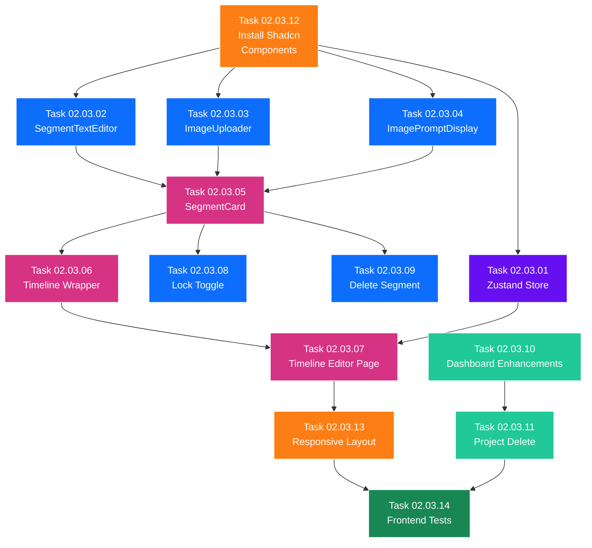

# SubPhase 02.03 — Image Upload & Timeline Editor UI

> **Layer:** 2 — Sub-Phase Overview
> **Phase:** Phase 02 — The Logic
> **Parent Document:** [Phase_02_Overview.md](../Phase_02_Overview.md)
> **Folder:** `SubPhase_02_03_Image_Upload_Timeline_Editor/`
> **Status:** NOT STARTED
> **Estimated Tasks:** 14

---

## Table of Contents

1. [Sub-Phase Objective](#1-sub-phase-objective)
2. [Scope](#2-scope)
3. [Technical Context](#3-technical-context)
4. [Task List](#4-task-list)
5. [Task Details](#5-task-details)
6. [Execution Order](#6-execution-order)
7. [Files Created & Modified](#7-files-created--modified)
8. [Validation Criteria](#8-validation-criteria)
9. [Constraints](#9-constraints)
10. [Notes & Gotchas](#10-notes--gotchas)
11. [Cross-References](#11-cross-references)

---

## 1. Sub-Phase Objective

**Build the complete Timeline Editor frontend** — the primary workspace of StoryFlow where users view, edit, and manage all segments of an imported project. This sub-phase delivers the full set of interactive React components, the Zustand state store for client-side state management, and the visual layout that ties together all the backend API endpoints built in SubPhases 02.01 and 02.02.

After this sub-phase is complete, a user can:
1. Navigate from the dashboard to a project's timeline.
2. See all segments displayed in order, each with text content, image prompt, and image zone.
3. Edit segment text inline with debounced auto-save.
4. Upload images via drag-and-drop or file picker.
5. Remove uploaded images.
6. Copy image prompts to clipboard.
7. Lock/unlock segments to prevent accidental edits.
8. Delete segments with a confirmation dialog.
9. See disabled placeholders for Phase 03 (audio) and Phase 04 (video) features.

### What This Sub-Phase Delivers

1. **Zustand State Store** (`lib/stores.ts`) — `useProjectStore` managing active project, segments, loading state, and all mutation actions with optimistic updates.
2. **SegmentTextEditor Component** (`components/SegmentTextEditor.tsx`) — Controlled textarea with 500ms debounced auto-save via PATCH, "Saving..." indicator, disabled when locked.
3. **ImageUploader Component** (`components/ImageUploader.tsx`) — Drag-and-drop zone using native HTML5 drag events, click-to-browse fallback, upload progress, JPEG/PNG/WebP only.
4. **ImagePromptDisplay Component** (`components/ImagePromptDisplay.tsx`) — Read-only prompt text block with "Copy to Clipboard" button and "Copied!" feedback.
5. **SegmentCard Component** (`components/SegmentCard.tsx`) — Core composite component assembling: sequence number badge, SegmentTextEditor, ImagePromptDisplay, ImageUploader/image preview, lock toggle, delete button, audio placeholder.
6. **Timeline Component** (`components/Timeline.tsx`) — Vertical scrolling wrapper using Shadcn `ScrollArea`, renders ordered list of SegmentCard components.
7. **Timeline Editor Page** (`app/projects/[id]/page.tsx`) — Full replacement of the Phase 01 placeholder page with header, sidebar, center timeline panel, and action bar.
8. **Enhanced Dashboard Features** — Updated `ProjectCard.tsx` showing segment count and delete option, updated `page.tsx` with project delete capability.

### What This Sub-Phase Does NOT Deliver

- Segment reorder drag-and-drop UI (the backend endpoint exists from SubPhase 02.02, but drag-to-reorder in the UI is complex and deferred — users reorder via a simple interface or not at all in this phase).
- Audio generation, playback, or any TTS functionality (Phase 03).
- Video rendering or preview (Phase 04).
- Subtitle overlay (Phase 05).
- Transitions between clips (Phase 05).
- GlobalSettings editing UI (Phase 05).

---

## 2. Scope

### 2.1 In Scope

| Area                         | Details                                                                      |
| ---------------------------- | ---------------------------------------------------------------------------- |
| Frontend — State Store       | Zustand `useProjectStore` with project/segment state, fetch, mutations       |
| Frontend — SegmentTextEditor | Controlled textarea, debounced auto-save (500ms), "Saving..." indicator      |
| Frontend — ImageUploader     | Drag-and-drop zone, click-to-browse, upload progress, format validation      |
| Frontend — ImagePromptDisplay| Read-only prompt display, "Copy" button, "Copied!" toast                     |
| Frontend — SegmentCard       | Composite component: text editor, image zone, prompt, lock, delete, audio placeholder |
| Frontend — Timeline          | Vertical scrolling segment list with Shadcn ScrollArea                       |
| Frontend — Timeline Page     | Full page: header, sidebar, center panel, action bar                         |
| Frontend — Dashboard Enhancements | Segment count on ProjectCard, project delete button/dialog              |
| Frontend — Shadcn Components | Install: textarea, tooltip, dropdown-menu, scroll-area, separator, alert-dialog, toast |
| Frontend — Responsive Layout | Proper responsive design for timeline editor                                 |
| Frontend — Tests             | Component rendering tests, interaction tests                                 |

### 2.2 Out of Scope

| Area                         | Reason                                                                       |
| ---------------------------- | ---------------------------------------------------------------------------- |
| Drag-to-reorder segments     | Complex UI interaction — deferred (backend endpoint exists from SubPhase 02.02) |
| Audio generation / playback  | Deferred to Phase 03 — The Voice                                             |
| Video rendering / preview    | Deferred to Phase 04 — The Vision                                            |
| Backend API changes          | All backend work completed in SubPhases 02.01 and 02.02                      |
| Model modifications          | Models are frozen from Phase 01                                              |

---

## 3. Technical Context

### 3.1 Prerequisites from Previous Sub-Phases

This sub-phase depends on all previously completed work:

| Deliverable                                   | Source              | What We Use It For                              |
| --------------------------------------------- | ------------------- | ----------------------------------------------- |
| All backend API endpoints                     | SubPhase 02.01-02.02| Every UI action calls these endpoints            |
| `lib/api.ts` with all API functions            | SubPhase 02.01-02.02| Called by Zustand store actions                  |
| `lib/types.ts` with all TypeScript interfaces  | SubPhase 01.03-02.02| Type safety for all components                   |
| `ImportDialog.tsx`                             | SubPhase 02.01      | Referenced on dashboard (already integrated)     |
| `ProjectCard.tsx`                              | SubPhase 01.03      | Enhanced with segment count and delete           |
| `CreateProjectDialog.tsx`                      | SubPhase 01.03      | Unchanged — still used on dashboard              |
| Next.js App Router, Tailwind CSS, Shadcn/UI   | SubPhase 01.01      | Frontend framework and component library         |
| Axios configured with base URL                | SubPhase 01.01      | HTTP client for API calls                        |
| Zustand installed (but not yet used)           | SubPhase 01.01      | Now actively used for state management           |

### 3.2 API Endpoints Consumed by This Sub-Phase

All endpoints were built in SubPhases 02.01 and 02.02. This sub-phase only consumes them — no backend changes.

| Endpoint                                       | Method   | Used By                          | Purpose                        |
| ---------------------------------------------- | -------- | -------------------------------- | ------------------------------ |
| `GET /api/projects/{id}/`                      | GET      | Timeline Editor Page             | Fetch project details          |
| `GET /api/segments/?project={id}`              | GET      | useProjectStore.fetchProject     | Fetch all segments             |
| `PATCH /api/segments/{id}/`                    | PATCH    | SegmentTextEditor, lock toggle   | Update text, prompt, lock      |
| `DELETE /api/segments/{id}/`                   | DELETE   | SegmentCard delete button        | Remove segment                 |
| `POST /api/segments/{id}/upload-image/`        | POST     | ImageUploader                    | Upload image file              |
| `DELETE /api/segments/{id}/remove-image/`      | DELETE   | ImageUploader "Remove" button    | Remove uploaded image          |
| `DELETE /api/projects/{id}/`                   | DELETE   | Dashboard project delete         | Delete entire project          |

> **Note:** `POST /api/segments/reorder/` exists but is NOT consumed in this sub-phase's UI. Drag-to-reorder is deferred.

### 3.3 New Shadcn/UI Components

The following components must be installed at the start of this sub-phase:

```bash
cd frontend
npx shadcn@latest add textarea tooltip dropdown-menu scroll-area separator alert-dialog toast
```

**What each component is used for:**

| Component      | Used In                    | Purpose                                   |
| -------------- | -------------------------- | ----------------------------------------- |
| `Textarea`     | SegmentTextEditor          | Inline text editing                       |
| `Tooltip`      | SegmentCard                | Hover tooltips for action buttons         |
| `DropdownMenu` | Dashboard, SegmentCard     | Context menus for actions                 |
| `ScrollArea`   | Timeline                   | Vertical scrollable segment list          |
| `Separator`    | SegmentCard, Timeline Page | Visual dividers between sections          |
| `AlertDialog`  | SegmentCard, Dashboard     | Confirmation dialogs for destructive actions |
| `Toast`        | ImagePromptDisplay, others | Brief notifications ("Copied!", "Saved!") |

### 3.4 Timeline Editor Page Layout

The full-page layout specification from [Phase_02_Overview.md](../Phase_02_Overview.md) §8.4:

```
┌──────────────────────────────────────────────────────────┐
│  StoryFlow — [Project Title]              [Back] [Export] │
├──────────┬───────────────────────────────────────────────┤
│          │                                               │
│  Project │   ┌─────────────────────────────────────┐    │
│  Info    │   │  Segment 1                          │    │
│          │   │  [Text Editor                     ] │    │
│  ────    │   │  [Image Zone] [Prompt + Copy]       │    │
│  Segment │   │  [Lock] [Delete]                    │    │
│  Count:  │   └─────────────────────────────────────┘    │
│  12      │                                               │
│          │   ┌─────────────────────────────────────┐    │
│  Status: │   │  Segment 2                          │    │
│  DRAFT   │   │  [Text Editor                     ] │    │
│          │   │  [Image Zone] [Prompt + Copy]       │    │
│          │   │  [Lock] [Delete]                    │    │
│          │   └─────────────────────────────────────┘    │
│          │                                               │
│          │   ... more segments ...                        │
│          │                                               │
├──────────┴───────────────────────────────────────────────┤
│  [Generate All Audio (disabled)] [Export Video (disabled)] │
└──────────────────────────────────────────────────────────┘
```

**Layout Breakdown:**
- **Header Bar:** Project title with "StoryFlow —" prefix, "Back to Dashboard" link (left), "Export" button (disabled placeholder, right).
- **Left Sidebar (≈250px):** Project metadata: title, status badge, segment count, created date. Fixed position, does not scroll.
- **Center Panel (fluid width):** Vertically scrolling list of `SegmentCard` components inside a Shadcn `ScrollArea`. This is the primary interaction area.
- **Bottom Action Bar:** Full-width bar with "Generate All Audio" button (disabled, shows "Coming in Phase 03" tooltip) and "Export Video" button (disabled, shows "Coming in Phase 04" tooltip).

### 3.5 SegmentCard Component Specification

The `SegmentCard` is the core UI component of the entire application. Each card represents one segment:

```
┌─────────────────────────────────────────────────────┐
│ [#1]                                   [🔒] [🗑️]    │
├─────────────────────────────────────────────────────┤
│                                                      │
│  ┌──────────────────────────────────────────────┐   │
│  │  Text Content (editable textarea)             │   │
│  │  Auto-saves on 500ms debounce...              │   │
│  └──────────────────────────────────────────────┘   │
│                                                      │
│  ┌──────────────────┐  ┌───────────────────────┐   │
│  │                   │  │ Image Prompt:          │   │
│  │  [Image Zone]     │  │ "A dark forest..."     │   │
│  │  Drop image here  │  │              [📋 Copy] │   │
│  │  or click to      │  │                        │   │
│  │  browse           │  │                        │   │
│  └──────────────────┘  └───────────────────────┘   │
│                                                      │
│  ┌──────────────────────────────────────────────┐   │
│  │  🔊 Audio — Coming in Phase 03               │   │
│  └──────────────────────────────────────────────┘   │
│                                                      │
└─────────────────────────────────────────────────────┘
```

**Component Sections:**
1. **Header Row:** Sequence number badge (1-based: `#1`, `#2`, ...), Lock toggle icon (🔒/🔓), Delete button icon (🗑️).
2. **Text Content Area:** `SegmentTextEditor` component — full-width textarea.
3. **Image + Prompt Row:** Two-column layout:
   - Left: `ImageUploader` (or image preview if uploaded).
   - Right: `ImagePromptDisplay`.
4. **Audio Placeholder:** Disabled area with "Audio — Coming in Phase 03" text.

**Component Props:**
```typescript
interface SegmentCardProps {
  segment: Segment;
  onUpdate: (id: number, data: UpdateSegmentPayload) => Promise<void>;
  onDelete: (id: number) => Promise<void>;
  onUploadImage: (id: number, file: File) => Promise<void>;
  onRemoveImage: (id: number) => Promise<void>;
}
```

### 3.6 Zustand Store Specification

**File:** `frontend/lib/stores.ts`

```typescript
interface ProjectStore {
  // State
  project: Project | null;
  segments: Segment[];
  isLoading: boolean;
  error: string | null;

  // Actions
  fetchProject: (id: number) => Promise<void>;
  updateSegment: (id: number, data: UpdateSegmentPayload) => Promise<void>;
  deleteSegment: (id: number) => Promise<void>;
  reorderSegments: (newOrder: number[]) => Promise<void>;
  uploadImage: (segmentId: number, file: File) => Promise<void>;
  removeImage: (segmentId: number) => Promise<void>;
  reset: () => void;
}
```

**Key Design Decisions:**
- **Optimistic Updates:** For `updateSegment`, update the local state immediately, then fire the API call. On error, revert the local state and show an error toast.
- **Pessimistic Updates:** For `deleteSegment`, `uploadImage`, `removeImage` — wait for the API response before updating local state (these have side effects that are hard to undo).
- **Single Store:** One Zustand store for the entire project view. The Timeline Editor page creates the store context and all child components access it via `useProjectStore()`.
- **Reset on Unmount:** When the user navigates away from the Timeline Editor, call `reset()` to clear state.

### 3.7 Dashboard Enhancements

**ProjectCard Enhancements (`components/ProjectCard.tsx`):**
- Display segment count (requires the project API to include segment count — verify if `ProjectSerializer` includes this, or make an additional API call).
- Add "Delete Project" option (using `AlertDialog` for confirmation).
- On delete: call `deleteProject(id)` from `api.ts`, then remove from local list.

**Dashboard Page Enhancements (`app/page.tsx`):**
- After project delete, refresh the project list.
- Optionally: add a toast notification "Project deleted successfully".

---

## 4. Task List

| #  | Task ID   | Task Title                                 | Depends On | Est. Complexity | File(s) Affected                          |
| -- | --------- | ------------------------------------------ | ---------- | --------------- | ----------------------------------------- |
| 1  | 02.03.01  | Create Zustand Project Store               | —          | High            | `frontend/lib/stores.ts`                  |
| 2  | 02.03.02  | Build SegmentTextEditor                    | —          | Medium          | `frontend/components/SegmentTextEditor.tsx`|
| 3  | 02.03.03  | Build ImageUploader Drag-and-Drop          | —          | High            | `frontend/components/ImageUploader.tsx`    |
| 4  | 02.03.04  | Build ImagePromptDisplay                   | —          | Low             | `frontend/components/ImagePromptDisplay.tsx`|
| 5  | 02.03.05  | Build SegmentCard Component                | 02, 03, 04 | High            | `frontend/components/SegmentCard.tsx`      |
| 6  | 02.03.06  | Build Timeline Wrapper                     | 05         | Medium          | `frontend/components/Timeline.tsx`         |
| 7  | 02.03.07  | Build Timeline Editor Page                 | 01, 06     | High            | `frontend/app/projects/[id]/page.tsx`      |
| 8  | 02.03.08  | Add Lock Toggle Feature                    | 05         | Low             | `frontend/components/SegmentCard.tsx`      |
| 9  | 02.03.09  | Add Delete Segment with Confirm            | 05         | Medium          | `frontend/components/SegmentCard.tsx`      |
| 10 | 02.03.10  | Enhance Dashboard Features                 | —          | Medium          | `frontend/app/page.tsx`                   |
| 11 | 02.03.11  | Add Project Delete to Dashboard            | 10         | Medium          | `frontend/components/ProjectCard.tsx`, `frontend/app/page.tsx` |
| 12 | 02.03.12  | Install New Shadcn Components              | —          | Low             | Multiple Shadcn component files            |
| 13 | 02.03.13  | Responsive Layout and Styling              | 07         | Medium          | Multiple component/page files              |
| 14 | 02.03.14  | Write Frontend Component Tests             | 07         | High            | Frontend test files                        |

---

## 5. Task Details

### Task 02.03.01 — Create Zustand Project Store

**Objective:** Implement the `useProjectStore` Zustand store that manages all project and segment state for the Timeline Editor.

**File:** `frontend/lib/stores.ts` (NEW — create this file)

**Steps:**
1. Create `frontend/lib/stores.ts`.
2. Import `create` from `zustand`.
3. Import API functions from `lib/api.ts`: `getProject`, `getSegments` (or a combined fetch), `updateSegment`, `deleteSegment`, `uploadSegmentImage`, `removeSegmentImage`, `reorderSegments`.
4. Import types from `lib/types.ts`: `Project`, `Segment`, `UpdateSegmentPayload`.
5. Define the `ProjectStore` interface (see §3.6).
6. Implement `fetchProject(id)`:
   a. Set `isLoading = true`, `error = null`.
   b. Fetch project via `getProject(id)`.
   c. Fetch segments via API (either from project response or separate `GET /api/segments/?project=id`).
   d. Set `project`, `segments`, `isLoading = false`.
   e. On error: set `error` message, `isLoading = false`.
7. Implement `updateSegment(id, data)` with **optimistic update**:
   a. Save a copy of the current segment state (for rollback).
   b. Immediately update the segment in the local `segments` array.
   c. Call `api.updateSegment(id, data)`.
   d. On success: update with the server response (to get accurate `updated_at`).
   e. On error: revert to the saved state, set `error`.
8. Implement `deleteSegment(id)` with **pessimistic update**:
   a. Call `api.deleteSegment(id)`.
   b. On success: remove the segment from the local `segments` array.
   c. On error: set `error`.
9. Implement `uploadImage(segmentId, file)`:
   a. Call `api.uploadSegmentImage(segmentId, file)`.
   b. On success: update the segment's `image_file` in local state.
   c. On error: set `error`.
10. Implement `removeImage(segmentId)`:
    a. Call `api.removeSegmentImage(segmentId)`.
    b. On success: set the segment's `image_file` to `null` in local state.
    c. On error: set `error`.
11. Implement `reorderSegments(newOrder)`:
    a. Call `api.reorderSegments(project.id, newOrder)`.
    b. On success: re-sort the local `segments` array by the new order.
    c. On error: set `error`.
12. Implement `reset()`: Set all state to initial values.

**Key Details:**
- Zustand stores are created with `create<ProjectStore>()((set, get) => ({ ... }))`.
- Use `set((state) => ({ segments: state.segments.map(...) }))` for immutable updates.
- The `fetchProject` action should populate BOTH `project` and `segments` in a single call if the project API returns nested segments, or in two parallel calls if not.
- Optimistic updates for text editing provide a responsive typing experience — the user sees changes immediately.
- Pessimistic updates for destructive actions (delete, upload, remove) prevent UI inconsistencies on failure.

---

### Task 02.03.02 — Build SegmentTextEditor

**Objective:** Create a controlled textarea component with 500ms debounced auto-save.

**File:** `frontend/components/SegmentTextEditor.tsx` (NEW — create this file)

**Steps:**
1. Create the component with props:
   ```typescript
   interface SegmentTextEditorProps {
     segmentId: number;
     initialContent: string;
     isLocked: boolean;
     onSave: (id: number, data: { text_content: string }) => Promise<void>;
   }
   ```
2. Use `useState` for local text value (initialized from `initialContent`).
3. Use `useState` for `isSaving` indicator.
4. Implement debounced save using `useEffect` with a `setTimeout`:
   a. When `text` changes, start a 500ms timer.
   b. If `text` changes again before 500ms, clear the previous timer and start a new one.
   c. When the timer fires, call `onSave(segmentId, { text_content: text })`.
   d. Set `isSaving = true` during the API call, `false` after.
5. Render a Shadcn `Textarea` (or styled `<textarea>`):
   - Value bound to local state.
   - `onChange` updates local state.
   - `disabled` when `isLocked` is `true`.
   - Minimum `rows={4}`, resizable vertically.
6. Show a subtle "Saving..." text or spinner indicator when `isSaving` is true.
7. Handle the edge case: if `initialContent` changes externally (e.g., optimistic update reverted), reset local state.

**Key Details:**
- Use `useRef` for the timeout to persist across renders: `const timerRef = useRef<NodeJS.Timeout | null>(null)`.
- Clear the timer on component unmount to prevent memory leaks: `return () => clearTimeout(timerRef.current)` in `useEffect`.
- Do NOT save if the text hasn't actually changed from the last saved value (prevents unnecessary API calls).
- The `onSave` callback comes from the parent (SegmentCard), which calls the Zustand store's `updateSegment`.

---

### Task 02.03.03 — Build ImageUploader Drag-and-Drop

**Objective:** Create a drag-and-drop image upload zone using native HTML5 drag events.

**File:** `frontend/components/ImageUploader.tsx` (NEW — create this file)

**Steps:**
1. Create the component with props:
   ```typescript
   interface ImageUploaderProps {
     segmentId: number;
     currentImage: string | null;  // Current image URL or null
     isLocked: boolean;
     onUpload: (segmentId: number, file: File) => Promise<void>;
     onRemove: (segmentId: number) => Promise<void>;
   }
   ```
2. Implement two visual states:
   - **State A (No Image):** Drop zone with dashed border, "Drop image here or click to browse" text, upload icon.
   - **State B (Image Uploaded):** Image thumbnail preview with "Remove" button overlay (visible on hover or always visible).
3. Implement drag-and-drop:
   a. `onDragOver`: Call `e.preventDefault()`, set `isDragging = true` for visual feedback (border highlight).
   b. `onDragLeave`: Set `isDragging = false`.
   c. `onDrop`: Call `e.preventDefault()`, extract `e.dataTransfer.files[0]`, validate, call `onUpload`.
4. Implement click-to-browse:
   a. Hidden `<input type="file" accept="image/jpeg,image/png,image/webp" />`.
   b. Clicking the drop zone triggers the hidden input.
   c. On file select (`onChange`), validate, call `onUpload`.
5. Client-side validation (before API call):
   a. Check file type: `['image/jpeg', 'image/png', 'image/webp'].includes(file.type)`.
   b. Check file size: `file.size <= 20 * 1024 * 1024` (20MB).
   c. If invalid, show error text below the drop zone (do NOT call the API).
6. Show upload progress indicator (optional but recommended):
   - A simple "Uploading..." text or a loading spinner during the API call.
   - Use `isUploading` state.
7. Disable the entire component when `isLocked` is `true`.

**Key Details:**
- No external drag-and-drop library needed — native HTML5 drag events are sufficient.
- The `currentImage` URL comes from the `Segment.image_file` field. Prepend the backend base URL if it's a relative path (e.g., `/media/projects/1/images/...`).
- The "Remove" button should have an `AlertDialog` confirmation or at least a "Are you sure?" tooltip (since image removal is irreversible if the user doesn't have the original file).
- `e.preventDefault()` on `onDragOver` is required for the drop zone to work — without it, the browser will navigate to the dropped file.

---

### Task 02.03.04 — Build ImagePromptDisplay

**Objective:** Create a read-only display for the segment's image prompt with a "Copy to Clipboard" button.

**File:** `frontend/components/ImagePromptDisplay.tsx` (NEW — create this file)

**Steps:**
1. Create the component with props:
   ```typescript
   interface ImagePromptDisplayProps {
     prompt: string;
   }
   ```
2. Render the prompt text in a styled, read-only block:
   - Light background (e.g., `bg-muted`), rounded corners, padding.
   - Label: "Image Prompt" above the text.
   - Monospace or slightly smaller font for visual distinction.
3. Add "Copy" button (📋 icon or "Copy" text):
   a. On click: `navigator.clipboard.writeText(prompt)`.
   b. On success: Show "Copied!" feedback — either a toast notification (using Shadcn `toast`) or a brief inline text change on the button.
   c. Reset "Copied!" back to "Copy" after 2 seconds.
4. Handle empty prompt: If `prompt` is empty, show placeholder text: "No image prompt" in muted color.

**Key Details:**
- `navigator.clipboard.writeText()` requires HTTPS or localhost — works in development.
- Use Shadcn `Tooltip` on the copy button for hover text: "Copy prompt to clipboard".
- The component is purely presentational — it does NOT send any API calls.

---

### Task 02.03.05 — Build SegmentCard Component

**Objective:** Assemble the core `SegmentCard` composite component that combines all segment sub-components.

**File:** `frontend/components/SegmentCard.tsx` (NEW — create this file)

**Steps:**
1. Create the component with props (see §3.5 for interface).
2. Render a Shadcn `Card` (or styled `div`) with the following sections:
   - **Header Row:** Flex container with:
     - Left: Sequence number badge (`#1`, `#2`, ...) — 1-based display using `segment.sequence_index + 1`.
     - Right: Lock toggle button and Delete button.
   - **Text Content Area:** `<SegmentTextEditor>` component with:
     - `segmentId={segment.id}`
     - `initialContent={segment.text_content}`
     - `isLocked={segment.is_locked}`
     - `onSave={onUpdate}` (mapped to update only `text_content`).
   - **Image + Prompt Row:** Two-column layout (flex or grid):
     - Left column (~40%): `<ImageUploader>` with `currentImage={segment.image_file}`, `isLocked`, `onUpload`, `onRemove`.
     - Right column (~60%): `<ImagePromptDisplay>` with `prompt={segment.image_prompt}`.
   - **Audio Placeholder:** Styled disabled area:
     - Gray background, reduced opacity.
     - Speaker icon (🔊) with text: "Audio — Coming in Phase 03".
     - No interactive elements.
3. Use a `Separator` between the text area and the image/prompt row.
4. Apply visual styling:
   - Subtle border, rounded corners, shadow.
   - Margin between cards.
   - When locked: show a subtle lock indicator (e.g., border color change, overlay tint).

**Key Details:**
- This component does NOT directly call API functions — it receives callbacks via props.
- The lock toggle and delete button implementations are detailed in Tasks 02.03.08 and 02.03.09. Initially, they can be placeholder buttons.
- The audio placeholder is static — no functionality, just visual presence.
- The 1-based display index is computed from `segment.sequence_index + 1` (model uses 0-based).

---

### Task 02.03.06 — Build Timeline Wrapper

**Objective:** Create the `Timeline` component that renders the ordered list of `SegmentCard` components inside a scrollable container.

**File:** `frontend/components/Timeline.tsx` (NEW — create this file)

**Steps:**
1. Create the component with props:
   ```typescript
   interface TimelineProps {
     segments: Segment[];
     onUpdateSegment: (id: number, data: UpdateSegmentPayload) => Promise<void>;
     onDeleteSegment: (id: number) => Promise<void>;
     onUploadImage: (id: number, file: File) => Promise<void>;
     onRemoveImage: (id: number) => Promise<void>;
   }
   ```
2. Wrap content in Shadcn `ScrollArea` for vertical scrolling:
   - Set a max height (e.g., `calc(100vh - 200px)` to account for header and action bar).
   - Smooth scrolling behavior.
3. Render a `div` containing:
   - For each segment in `segments` (already sorted by `sequence_index`):
     - `<SegmentCard>` with the segment data and callback props.
   - Key each card by `segment.id`.
4. Handle empty state: If `segments.length === 0`, show a centered message: "No segments yet. Import a story to get started." with a link or button back to the dashboard.

**Key Details:**
- The component receives segments already sorted from the Zustand store.
- Props are passed down from the Timeline Editor Page → Timeline → SegmentCard.
- The `key` prop on each `SegmentCard` must be `segment.id` (not array index) for correct React reconciliation.
- Future-ready: The structure should allow for insertion of other elements between cards (e.g., "Add Segment" buttons) if needed later.

---

### Task 02.03.07 — Build Timeline Editor Page

**Objective:** Create the full Timeline Editor page that replaces the Phase 01 placeholder.

**File:** `frontend/app/projects/[id]/page.tsx` (REPLACE — overwrite the Phase 01 placeholder)

**Steps:**
1. Extract `id` from the route params (`useParams` or Next.js page props).
2. On mount, call `useProjectStore().fetchProject(id)` to load the project and segments.
3. Show a loading skeleton while `isLoading` is `true`.
4. Show an error state if `error` is set (with retry button).
5. Render the full layout (see §3.4):
   - **Header Bar:**
     - Left: "StoryFlow —" prefix + project title (from store).
     - Center/Right: "Back to Dashboard" link (`/`), "Export" button (disabled).
   - **Left Sidebar (≈250px):**
     - Project title (editable? — NO, not in Phase 02).
     - Status badge (`DRAFT`) with appropriate color.
     - Segment count.
     - Created date (formatted).
     - Shadcn `Separator` between items.
   - **Center Panel (fluid):**
     - `<Timeline>` component with segments from store and action callbacks from store.
   - **Bottom Action Bar:**
     - "Generate All Audio" button — `disabled`, Shadcn `Tooltip` showing "Coming in Phase 03".
     - "Export Video" button — `disabled`, Shadcn `Tooltip` showing "Coming in Phase 04".
6. Wire up callbacks: `onUpdateSegment` → `store.updateSegment`, `onDeleteSegment` → `store.deleteSegment`, etc.
7. On unmount: call `store.reset()` to clear state.

**Key Details:**
- Use Next.js dynamic routing: the file is at `app/projects/[id]/page.tsx`.
- This **replaces** the Phase 01 placeholder page entirely. The placeholder content (simple "Project: {id}" text) is deleted.
- The page is a client component (`"use client"` directive) because it uses Zustand and interactive state.
- Use CSS Grid or Flexbox for the sidebar + main panel layout.
- The sidebar width is fixed (≈250px), the center panel fills remaining space.

---

### Task 02.03.08 — Add Lock Toggle Feature

**Objective:** Implement the lock/unlock toggle button on `SegmentCard`.

**File:** `frontend/components/SegmentCard.tsx` (MODIFY — enhance existing component)

**Steps:**
1. Add a lock toggle button in the SegmentCard header row.
2. Display state:
   - Locked: 🔒 icon (or Lucide `Lock` icon), solid/filled style.
   - Unlocked: 🔓 icon (or Lucide `LockOpen` icon), outline style.
3. On click:
   a. Call `onUpdate(segment.id, { is_locked: !segment.is_locked })`.
   b. Toggle is optimistic — UI updates immediately via the Zustand store.
4. When locked, all editable elements in the card are disabled:
   - `SegmentTextEditor` is disabled.
   - `ImageUploader` upload/remove is disabled.
   - Only the lock toggle itself and the delete button remain functional.
5. Add Shadcn `Tooltip` on the button: "Lock segment" / "Unlock segment".

**Key Details:**
- The lock state flows from `segment.is_locked` (in Zustand store) → SegmentCard → child components.
- The backend enforces the lock in SubPhase 02.02's PATCH handler — the frontend also respects it for UX (disabled states).
- Locking prevents accidental edits. Deletion is still allowed on locked segments (design decision from SubPhase 02.02).

---

### Task 02.03.09 — Add Delete Segment with Confirm

**Objective:** Implement the delete segment button with a confirmation dialog.

**File:** `frontend/components/SegmentCard.tsx` (MODIFY — enhance existing component)

**Steps:**
1. Add a delete button (🗑️ icon or Lucide `Trash2` icon) in the SegmentCard header row.
2. Style: Red/destructive variant to indicate danger.
3. On click, open a Shadcn `AlertDialog`:
   - Title: "Delete Segment"
   - Description: "Are you sure you want to delete Segment #{index}? This action cannot be undone. Any uploaded images will also be removed."
   - Cancel button: "Cancel" — closes dialog.
   - Confirm button: "Delete" — destructive variant.
4. On confirm:
   a. Call `onDelete(segment.id)`.
   b. Close the dialog.
   c. The segment disappears from the timeline (Zustand store removes it).
5. Show a brief loading state on the "Delete" button during the API call.

**Key Details:**
- The `AlertDialog` is a critical UX element — segment deletion is irreversible and also deletes associated images from disk.
- The confirmation text should include the segment number for clarity.
- After deletion, remaining segments retain their `sequence_index` values (no auto-reindexing in the backend). The display numbers (1-based) may have gaps, but the visual order is maintained.

---

### Task 02.03.10 — Enhance Dashboard Features

**Objective:** Improve the dashboard page with better project information display and navigation.

**File:** `frontend/app/page.tsx` (MODIFY)

**Steps:**
1. Show segment count on each project card (if available from the API response).
   - The `ProjectSerializer` may need to include `segment_count` — check if it already does (from Phase 01's `ProjectSerializer` with nested segments, the count can be derived client-side).
   - Alternative: Fetch project details with segments and count client-side.
2. Improve project card layout with status badge, date formatting.
3. Add visual distinction between projects with segments (imported) and empty projects.
4. After successful import (from `ImportDialog`), navigate to the new project's timeline page.
5. After project delete, show a toast notification "Project deleted".

**Key Details:**
- Keep changes minimal — the dashboard was already functional from SubPhase 01.03 and 02.01.
- Focus on polish and user experience improvements.
- The project list should use `getProjects()` from `api.ts` (already implemented).

---

### Task 02.03.11 — Add Project Delete to Dashboard

**Objective:** Add the ability to delete a project from the dashboard.

**Files:** `frontend/components/ProjectCard.tsx` (MODIFY), `frontend/app/page.tsx` (MODIFY)

**Steps:**
1. In `ProjectCard.tsx`, add a delete button or dropdown menu with "Delete" option.
2. On click, show an `AlertDialog` confirmation:
   - Title: "Delete Project"
   - Description: "Are you sure you want to delete '{project.title}'? All segments and associated media will be permanently removed."
   - Cancel / Delete buttons.
3. On confirm:
   a. Call `deleteProject(project.id)` from `api.ts`.
   b. Call the parent's callback to remove the project from the list.
4. In `page.tsx`, pass an `onDelete` callback to each `ProjectCard`:
   a. On delete: remove the project from the local project list state.
   b. Show a success toast.

**Key Details:**
- The `AlertDialog` is important because project deletion cascades to ALL segments and media files — this is destructive and irreversible.
- The delete button could be a small icon in the top-right corner of the `ProjectCard`, or accessible via a `DropdownMenu` (three-dot menu).

---

### Task 02.03.12 — Install New Shadcn Components

**Objective:** Install all new Shadcn/UI components required for this sub-phase.

**File(s):** Multiple generated component files in `frontend/components/ui/`

**Steps:**
1. Run the Shadcn CLI to install all required components:
   ```bash
   cd frontend
   npx shadcn@latest add textarea tooltip dropdown-menu scroll-area separator alert-dialog toast
   ```
2. Verify each component is installed:
   - `components/ui/textarea.tsx`
   - `components/ui/tooltip.tsx`
   - `components/ui/dropdown-menu.tsx`
   - `components/ui/scroll-area.tsx`
   - `components/ui/separator.tsx`
   - `components/ui/alert-dialog.tsx`
   - `components/ui/toast.tsx` (plus `toaster.tsx` and `use-toast.ts`)
3. Add the `<Toaster />` component to the root layout (`app/layout.tsx`) if not already present:
   ```tsx
   import { Toaster } from "@/components/ui/toaster";

   export default function RootLayout({ children }) {
     return (
       <html>
         <body>
           {children}
           <Toaster />
         </body>
       </html>
     );
   }
   ```
4. Verify TypeScript compilation: `npx tsc --noEmit`.

**Key Details:**
- This task should be done FIRST before any component work that uses these Shadcn components.
- The `Toast` system requires both the `toast` component and the `Toaster` provider in the root layout.
- Some components (e.g., `tooltip`) require wrapping in a `TooltipProvider` — check the Shadcn docs and add to root layout if needed.

---

### Task 02.03.13 — Responsive Layout and Styling

**Objective:** Ensure the Timeline Editor and all components are properly styled and responsive.

**File(s):** Multiple component and page files

**Steps:**
1. **Timeline Editor Page Layout:**
   - Desktop (≥1024px): Sidebar (250px) + Center panel (fluid) side-by-side.
   - Tablet (768px–1023px): Sidebar collapses to a top bar, center panel takes full width.
   - Mobile (<768px): Single column, sidebar info becomes a collapsible section.
2. **SegmentCard Responsiveness:**
   - Desktop: Image zone and prompt side by side.
   - Mobile: Image zone and prompt stacked vertically.
3. **Consistent Spacing:**
   - Use Tailwind spacing utilities consistently: `space-y-4` between cards, `p-4` inside cards.
   - Consistent font sizes and colors using Tailwind's design tokens.
4. **Dark Mode Readiness:**
   - Use Shadcn/Tailwind semantic colors (`bg-background`, `text-foreground`, `bg-muted`, etc.) instead of hardcoded colors.
   - This ensures the UI will work if dark mode is added later.
5. **Loading States:**
   - Skeleton loaders for the timeline while fetching.
   - Loading spinners for individual actions (save, upload, delete).
6. **Empty States:**
   - No segments: "Import a story to get started" with action link.
   - No image: Drop zone with clear visual affordance.
7. **Action Bar Styling:**
   - Fixed at bottom of the page.
   - Disabled buttons have clear visual distinction (muted colors, reduced opacity).
   - Tooltips explain why buttons are disabled.

**Key Details:**
- Use Tailwind's responsive prefixes: `sm:`, `md:`, `lg:`.
- Test at common breakpoints: 375px (mobile), 768px (tablet), 1024px (laptop), 1440px (desktop).
- Do NOT use any CSS frameworks beyond Tailwind — Shadcn/UI handles component styling.

---

### Task 02.03.14 — Write Frontend Component Tests

**Objective:** Write tests for all new components and the Timeline Editor page.

**File(s):** Frontend test files (e.g., `__tests__/` or colocated `.test.tsx` files)

**Steps:**
1. **SegmentTextEditor Tests:**
   - Renders textarea with initial content.
   - Updates local state on input change.
   - Debounced save fires after 500ms of inactivity.
   - No save triggered if text hasn't changed.
   - Textarea is disabled when `isLocked` is true.
2. **ImageUploader Tests:**
   - Renders drop zone when no image.
   - Renders image preview when image exists.
   - Drop event triggers upload callback.
   - Click-to-browse triggers file input.
   - Rejects non-image files.
   - Disabled when locked.
3. **ImagePromptDisplay Tests:**
   - Renders prompt text.
   - Copy button calls `navigator.clipboard.writeText`.
   - Shows "Copied!" feedback.
   - Empty prompt shows placeholder text.
4. **SegmentCard Tests:**
   - Renders all sub-components (text editor, image zone, prompt).
   - Shows correct sequence number.
   - Lock toggle calls update callback.
   - Delete button opens confirmation dialog.
5. **Timeline Tests:**
   - Renders correct number of SegmentCard components.
   - Shows empty state when no segments.
   - Cards are keyed by segment ID.
6. **Timeline Editor Page Tests:**
   - Fetches project on mount.
   - Shows loading state while fetching.
   - Renders all layout sections (header, sidebar, timeline, action bar).
   - Action buttons are disabled with correct tooltips.
7. **Zustand Store Tests:**
   - `fetchProject` populates state correctly.
   - `updateSegment` performs optimistic update.
   - `deleteSegment` removes segment from state.
   - `reset` clears all state.

**Key Details:**
- Use React Testing Library for component tests.
- Mock `lib/api.ts` functions for test isolation.
- Mock `navigator.clipboard.writeText` for clipboard tests.
- Use `jest.useFakeTimers()` for debounce tests.
- For Zustand store tests, create a fresh store instance per test to avoid state leakage.

---

## 6. Execution Order

### 6.1 Dependency Chain

```
Task 12 (Install Shadcn Components — must be first)

Task 01 (Zustand Store — foundational, no component dependencies)
Task 02 (SegmentTextEditor — no dependencies)
Task 03 (ImageUploader — no dependencies)
Task 04 (ImagePromptDisplay — no dependencies)
    └── Task 05 (SegmentCard — assembles 02, 03, 04)
        ├── Task 08 (Lock Toggle — enhances 05)
        ├── Task 09 (Delete with Confirm — enhances 05)
        └── Task 06 (Timeline — wraps 05)
            └── Task 07 (Timeline Editor Page — combines 01, 06)
                └── Task 13 (Responsive Layout — polishes 07)
                    └── Task 14 (Tests — tests everything)

Task 10 (Dashboard Enhancements — independent)
    └── Task 11 (Project Delete — enhances 10)
```

### 6.2 Recommended Sequence

| Order | Task(s)     | Rationale                                                         |
| ----- | ----------- | ----------------------------------------------------------------- |
| 1     | 12          | Install Shadcn components first — all other tasks depend on them  |
| 2     | 01          | Build Zustand store — foundation for all state management         |
| 3     | 02, 03, 04  | Build the three leaf components in parallel (no mutual deps)      |
| 4     | 05          | Assemble SegmentCard from the leaf components                     |
| 5     | 08, 09      | Add lock toggle and delete features to SegmentCard                |
| 6     | 06          | Build Timeline wrapper around SegmentCards                        |
| 7     | 07          | Build the full Timeline Editor page                               |
| 8     | 10, 11      | Dashboard enhancements (independent of timeline work)             |
| 9     | 13          | Responsive layout polish                                          |
| 10    | 14          | Write all tests                                                   |

### 6.3 Execution Flow (Mermaid)



> **Legend:**
> 🟠 Orange = Setup / polish tasks
> 🟣 Purple = State management
> 🔵 Blue = Individual component tasks
> 🩷 Pink = Composite / page-level tasks
> 🟩 Teal = Dashboard tasks
> 🟢 Green = Test tasks

### 6.4 Parallel Work Opportunities

Several tasks have no mutual dependencies and can be developed simultaneously:

- **T01, T02, T03, T04** — All independent after Shadcn install.
- **T08, T09** — Both enhance SegmentCard independently.
- **T10, T11** — Dashboard track is independent of timeline track.

For a single developer working sequentially:
**T12 → T01 → T02 → T03 → T04 → T05 → T08 → T09 → T06 → T07 → T10 → T11 → T13 → T14**

---

## 7. Files Created & Modified

### 7.1 New Files

| File Path                                    | Created In | Purpose                              |
| -------------------------------------------- | ---------- | ------------------------------------ |
| `frontend/lib/stores.ts`                    | Task 01    | Zustand state store for project view |
| `frontend/components/SegmentTextEditor.tsx`  | Task 02    | Debounced auto-save text editor      |
| `frontend/components/ImageUploader.tsx`      | Task 03    | Drag-and-drop image upload zone      |
| `frontend/components/ImagePromptDisplay.tsx` | Task 04    | Read-only prompt display with copy   |
| `frontend/components/SegmentCard.tsx`        | Task 05    | Core segment composite component     |
| `frontend/components/Timeline.tsx`           | Task 06    | Scrollable segment list wrapper      |

### 7.2 Modified Files

| File Path                                    | Modified In | Changes                                        |
| -------------------------------------------- | ----------- | ---------------------------------------------- |
| `frontend/app/projects/[id]/page.tsx`       | Task 07     | **Replaced** — Phase 01 placeholder → full Timeline Editor |
| `frontend/app/page.tsx`                     | Task 10     | Dashboard enhancements, project delete          |
| `frontend/components/ProjectCard.tsx`       | Task 11     | Segment count, delete button/dialog             |
| `frontend/app/layout.tsx`                   | Task 12     | Add `<Toaster />` and `<TooltipProvider />`     |
| `frontend/components/ui/*.tsx`              | Task 12     | Shadcn component files (auto-generated)         |

### 7.3 Component Composition Map

```
app/projects/[id]/page.tsx (Timeline Editor Page)
    ├── lib/stores.ts (useProjectStore)
    ├── components/Timeline.tsx
    │   └── components/SegmentCard.tsx  [× N segments]
    │       ├── components/SegmentTextEditor.tsx
    │       ├── components/ImageUploader.tsx
    │       └── components/ImagePromptDisplay.tsx
    └── (Header, Sidebar, Action Bar — inline in page)

app/page.tsx (Dashboard)
    ├── components/ProjectCard.tsx  [× N projects]
    ├── components/CreateProjectDialog.tsx (from SubPhase 01.03)
    └── components/ImportDialog.tsx (from SubPhase 02.01)
```

---

## 8. Validation Criteria

### 8.1 Timeline Editor Page

- [ ] `/projects/{id}` loads the full Timeline Editor (NOT the Phase 01 placeholder).
- [ ] Page shows loading skeleton while fetching project data.
- [ ] Page shows error state with retry if fetch fails.
- [ ] Header displays project title with "StoryFlow —" prefix.
- [ ] "Back to Dashboard" link navigates to `/`.
- [ ] Left sidebar shows project title, status badge, segment count, created date.
- [ ] Center panel contains the scrollable Timeline component.
- [ ] Bottom action bar has "Generate All Audio" button (disabled, tooltip: "Coming in Phase 03").
- [ ] Bottom action bar has "Export Video" button (disabled, tooltip: "Coming in Phase 04").

### 8.2 Segment Display

- [ ] All segments are displayed in correct order (by `sequence_index`).
- [ ] Each SegmentCard shows the correct 1-based sequence number.
- [ ] Segment text content is displayed in the textarea.
- [ ] Image prompt is displayed in the prompt area.
- [ ] Image is displayed as a thumbnail when `image_file` is set.
- [ ] Drop zone is displayed when `image_file` is null.
- [ ] Audio placeholder shows "Audio — Coming in Phase 03".

### 8.3 Text Editing

- [ ] Segment text is editable inline via textarea.
- [ ] Text changes auto-save after 500ms debounce.
- [ ] "Saving..." indicator appears during API call.
- [ ] No API call is made if text hasn't changed.
- [ ] Textarea is disabled when segment is locked.

### 8.4 Image Upload & Removal

- [ ] Drag-and-drop upload works on the image zone.
- [ ] Click-to-browse upload works (file picker opens).
- [ ] Upload shows progress indicator.
- [ ] After successful upload, image preview replaces the drop zone.
- [ ] "Remove" button on uploaded image works and reverts to drop zone.
- [ ] Invalid file types are rejected with error message (client-side).
- [ ] Files over 20MB are rejected with error message (client-side).
- [ ] Upload and remove are disabled when segment is locked.

### 8.5 Image Prompt Copy

- [ ] "Copy" button copies prompt text to clipboard.
- [ ] "Copied!" feedback is shown after copy.
- [ ] Empty prompt shows placeholder text.

### 8.6 Lock Toggle

- [ ] Lock button toggles between locked and unlocked states.
- [ ] Locked segments show visual indicator (icon change, border/overlay).
- [ ] Locked segments have disabled text editor and image upload.
- [ ] Lock toggle itself still works on locked segments (to unlock).
- [ ] Delete button still works on locked segments.

### 8.7 Segment Delete

- [ ] Delete button opens a confirmation dialog.
- [ ] Confirmation dialog shows the segment number.
- [ ] "Cancel" closes dialog without deletion.
- [ ] "Delete" removes the segment from the timeline.
- [ ] Deleted segment disappears from the UI immediately.

### 8.8 Zustand Store

- [ ] `fetchProject` populates project and segments state.
- [ ] `updateSegment` performs optimistic update (UI updates before API response).
- [ ] `updateSegment` reverts on API error.
- [ ] `deleteSegment` removes segment from state after API success.
- [ ] `uploadImage` updates segment's `image_file` after API success.
- [ ] `removeImage` clears segment's `image_file` after API success.
- [ ] `reset` clears all state.

### 8.9 Dashboard Enhancements

- [ ] ProjectCard shows segment count (if available).
- [ ] Project delete button opens confirmation dialog.
- [ ] After project delete, project is removed from the list.
- [ ] After successful import, navigation to timeline page works.

### 8.10 Structural Validation

- [ ] All 6 new component files exist and export React components.
- [ ] `lib/stores.ts` exists and exports `useProjectStore`.
- [ ] All Shadcn components are installed in `components/ui/`.
- [ ] `<Toaster />` is added to root layout.
- [ ] TypeScript compiles: `npx tsc --noEmit` passes with zero errors.
- [ ] No new npm packages installed beyond Phase 01 dependencies and Shadcn components.

---

## 9. Constraints

| #  | Constraint                                                         | Source                                                        |
| -- | ------------------------------------------------------------------ | ------------------------------------------------------------- |
| 1  | Do NOT modify any backend code                                     | All backend work completed in SubPhases 02.01-02.02           |
| 2  | Do NOT modify database models                                      | Models are frozen from Phase 01                               |
| 3  | Do NOT implement audio generation or playback                      | Deferred to Phase 03 — show disabled placeholders only        |
| 4  | Do NOT implement video rendering or preview                        | Deferred to Phase 04 — show disabled placeholder only         |
| 5  | Do NOT implement drag-to-reorder segments                          | Complex interaction — deferred (backend endpoint exists)      |
| 6  | Do NOT install external drag-and-drop libraries                    | Use native HTML5 drag events for image upload                 |
| 7  | Do NOT add authentication or authorization                         | Permanent constraint — [00_Project_Overview.md](../../00_Project_Overview.md) §14.1 |
| 8  | "Generate All Audio" button must be visible but disabled           | [Phase_02_Overview.md](../Phase_02_Overview.md) §10, Constraint #14 |
| 9  | "Export Video" button must be visible but disabled                  | [Phase_02_Overview.md](../Phase_02_Overview.md) §10, Constraint #15 |
| 10 | Audio preview area must show "Coming in Phase 03" placeholder      | [Phase_02_Overview.md](../Phase_02_Overview.md) §10, Constraint #13 |
| 11 | Use Shadcn/UI components — do NOT install alternative UI libraries | Consistency with Phase 01 setup                               |
| 12 | Use Tailwind CSS for all custom styling                            | No custom CSS files, no CSS modules                           |
| 13 | Use Zustand for state management — do NOT use React Context/Redux  | Zustand was installed in Phase 01 for this purpose            |

---

## 10. Notes & Gotchas

### 10.1 Image URL Base Path

The `Segment.image_file` field stores a relative path like `/media/projects/1/images/1_landscape.jpg`. The frontend needs to prepend the backend base URL to construct the full image URL:

```typescript
const imageUrl = segment.image_file
  ? `${process.env.NEXT_PUBLIC_API_BASE_URL || 'http://localhost:8000'}${segment.image_file}`
  : null;
```

Alternatively, configure Axios's base URL to handle this automatically, or use Next.js `<Image>` component with a configured `remotePatterns` in `next.config.ts`.

### 10.2 Debounce Timer Cleanup

The `SegmentTextEditor`'s debounce timer must be cleaned up on unmount. If the component unmounts while a timer is pending:
- The timer fires and tries to call the `onSave` callback.
- But the component (and potentially the parent) may already be unmounted.
- This causes a "can't perform state update on unmounted component" warning.

**Solution:** Use `useRef` for the timer and clear it in `useEffect` cleanup:
```typescript
useEffect(() => {
  return () => {
    if (timerRef.current) clearTimeout(timerRef.current);
  };
}, []);
```

### 10.3 Optimistic Update Rollback Pattern

For the Zustand store's `updateSegment` with optimistic updates:

```typescript
updateSegment: async (id, data) => {
  // Save current state for rollback
  const previousSegments = get().segments;

  // Optimistic update
  set((state) => ({
    segments: state.segments.map((s) =>
      s.id === id ? { ...s, ...data } : s
    ),
  }));

  try {
    const updated = await api.updateSegment(id, data);
    // Update with server response (accurate timestamps)
    set((state) => ({
      segments: state.segments.map((s) =>
        s.id === id ? updated : s
      ),
    }));
  } catch (error) {
    // Rollback on failure
    set({ segments: previousSegments, error: 'Failed to update segment' });
  }
},
```

### 10.4 Drag-and-Drop Event Handling

Key gotchas with HTML5 drag events:

1. **`onDragOver` must call `e.preventDefault()`** — Without this, the `onDrop` event will NOT fire. The browser's default behavior is to NOT allow drops.
2. **`onDragEnter` vs. `onDragOver`** — Use `onDragOver` for the active hover state, not `onDragEnter`, because `onDragEnter` fires on every child element.
3. **Counter-based drag tracking** — `onDragEnter`/`onDragLeave` fire for child elements too. Use a counter to track actual enter/leave for the drop zone:
   ```typescript
   const dragCounterRef = useRef(0);
   const onDragEnter = (e) => { dragCounterRef.current++; setIsDragging(true); };
   const onDragLeave = (e) => { dragCounterRef.current--; if (dragCounterRef.current === 0) setIsDragging(false); };
   const onDrop = (e) => { dragCounterRef.current = 0; setIsDragging(false); /* handle drop */ };
   ```
4. **File access:** Use `e.dataTransfer.files[0]` to get the dropped file. Check `.files.length > 0` before accessing.

### 10.5 Shadcn Toast Setup

The Shadcn `toast` system requires a `<Toaster />` component in the root layout. Without it, toast calls will silently fail — no error, no toast.

Also, the `useToast` hook must be used within a component — it cannot be called from a plain function or Zustand store. If the store needs to trigger toasts, pass a toast callback as a parameter or use a separate event system.

### 10.6 Next.js App Router — Client vs. Server Components

The Timeline Editor page MUST be a client component (`"use client"`) because:
- It uses React hooks (`useState`, `useEffect`).
- It uses Zustand's `useProjectStore`.
- It handles interactive events.

However, the root layout and other pages can remain server components unless they also need client-side interactivity.

### 10.7 FormData Content-Type with Axios

When uploading images via Axios, do NOT manually set the `Content-Type` header:

```typescript
// CORRECT — Axios auto-sets Content-Type with boundary
const formData = new FormData();
formData.append('image', file);
await api.post(`/segments/${id}/upload-image/`, formData);

// WRONG — manually setting Content-Type breaks the multipart boundary
await api.post(`/segments/${id}/upload-image/`, formData, {
  headers: { 'Content-Type': 'multipart/form-data' },
});
```

This was already noted in [SubPhase_02_02_Overview.md](../SubPhase_02_02_Segment_Management_API/SubPhase_02_02_Overview.md) §10.4 — reiterated here because the frontend component is where the call originates.

### 10.8 Keyboard Accessibility

Ensure all interactive elements are keyboard accessible:
- Lock toggle, delete button: Focusable with `tabIndex`, trigger on `Enter`/`Space`.
- Drop zone: `tabIndex={0}`, `role="button"`, trigger file picker on `Enter`/`Space`.
- Copy button: Standard button, keyboard accessible by default.
- AlertDialog: Shadcn AlertDialog handles keyboard focus trapping automatically.

### 10.9 Memory Management with Large Projects

For projects with many segments (50+), the Timeline component could become slow. Considerations:
- Do NOT implement virtual scrolling in Phase 02 — keep it simple.
- Use React `memo` on `SegmentCard` to prevent unnecessary re-renders.
- Each `SegmentCard` should only re-render when its own segment data changes, not when any sibling changes.
- The Zustand store's `segments` array should use immutable updates so that unchanged segments keep the same reference.

---

## 11. Cross-References

### 11.1 Parent Documents

| Document                              | Relationship                                                         |
| ------------------------------------- | -------------------------------------------------------------------- |
| [Phase_02_Overview.md](../Phase_02_Overview.md) | Direct parent (Layer 1). Defines this sub-phase in §4.3. Timeline Editor layout in §8.4. Shadcn components in §9.1. |
| [00_Project_Overview.md](../../00_Project_Overview.md) | Master document (Layer 0). Timeline Editor module spec in §5.2. Dev constraints in §14. Quality standards in §15. |

### 11.2 Sibling Documents

| Document                              | Relationship                                                         |
| ------------------------------------- | -------------------------------------------------------------------- |
| [SubPhase_02_01_Overview.md](../SubPhase_02_01_Import_Parse_Engine/SubPhase_02_01_Overview.md) | First sub-phase of Phase 02. Its `ImportDialog.tsx` and dashboard integration are prerequisites. |
| [SubPhase_02_02_Overview.md](../SubPhase_02_02_Segment_Management_API/SubPhase_02_02_Overview.md) | Previous sub-phase. ALL backend API endpoints consumed by this sub-phase were built there. |

### 11.3 Previous Sub-Phase

| Document                              | Relationship                                                         |
| ------------------------------------- | -------------------------------------------------------------------- |
| [SubPhase_02_02_Overview.md](../SubPhase_02_02_Segment_Management_API/SubPhase_02_02_Overview.md) | Direct predecessor. Its deliverables are all prerequisites: `SegmentViewSet`, image upload/remove actions, reorder endpoint, project delete, updated `api.ts` and `types.ts`. |

### 11.4 Full Dependency Chain

This sub-phase sits at the end of Phase 02's dependency chain and depends on ALL previous sub-phases:

```
SubPhase 01.01 (Project Setup)
    → SubPhase 01.02 (Database Models)
        → SubPhase 01.03 (Dashboard UI)
            → SubPhase 02.01 (Import & Parse Engine)
                → SubPhase 02.02 (Segment Management API)
                    → SubPhase 02.03 (THIS SUB-PHASE — Timeline Editor UI)
```

### 11.5 Forward References

After this sub-phase completes, Phase 02 is DONE. The next work is Phase 03 — The Voice:

| What Phase 02 Creates                     | What Phase 03 Uses It For                                    |
| ----------------------------------------- | ------------------------------------------------------------ |
| Segments with `text_content` populated    | TTS engine reads `text_content` to generate audio            |
| `Segment.audio_file` field (null)         | TTS engine populates with `.wav` file paths                  |
| `Segment.audio_duration` field (null)     | TTS engine stores calculated duration                        |
| Timeline Editor page                      | Extended with audio playback and "Generate Audio" buttons    |
| Zustand project store                     | Extended with audio generation state management              |
| `lib/api.ts` client                       | Extended with audio generation API functions                 |
| Disabled "Generate All Audio" button      | Enabled and functional in Phase 03                           |
| Audio placeholder in SegmentCard          | Replaced with actual audio player controls                   |

### 11.6 Child Documents (Layer 3)

| Task Document                                              | Task ID  | Title                               |
| ---------------------------------------------------------- | -------- | ----------------------------------- |
| `Task_02_03_01_Create_Zustand_Project_Store.md`            | 02.03.01 | Create Zustand Project Store        |
| `Task_02_03_02_Build_SegmentTextEditor.md`                 | 02.03.02 | Build SegmentTextEditor             |
| `Task_02_03_03_Build_ImageUploader_DragDrop.md`            | 02.03.03 | Build ImageUploader Drag-and-Drop   |
| `Task_02_03_04_Build_ImagePromptDisplay.md`                | 02.03.04 | Build ImagePromptDisplay            |
| `Task_02_03_05_Build_SegmentCard_Component.md`             | 02.03.05 | Build SegmentCard Component         |
| `Task_02_03_06_Build_Timeline_Wrapper.md`                  | 02.03.06 | Build Timeline Wrapper              |
| `Task_02_03_07_Build_Timeline_Editor_Page.md`              | 02.03.07 | Build Timeline Editor Page          |
| `Task_02_03_08_Add_Lock_Toggle_Feature.md`                 | 02.03.08 | Add Lock Toggle Feature             |
| `Task_02_03_09_Add_Delete_Segment_With_Confirm.md`         | 02.03.09 | Add Delete Segment with Confirm     |
| `Task_02_03_10_Enhance_Dashboard_Features.md`              | 02.03.10 | Enhance Dashboard Features          |
| `Task_02_03_11_Add_Project_Delete_To_Dashboard.md`         | 02.03.11 | Add Project Delete to Dashboard     |
| `Task_02_03_12_Install_New_Shadcn_Components.md`           | 02.03.12 | Install New Shadcn Components       |
| `Task_02_03_13_Responsive_Layout_And_Styling.md`           | 02.03.13 | Responsive Layout and Styling       |
| `Task_02_03_14_Write_Frontend_Component_Tests.md`          | 02.03.14 | Write Frontend Component Tests      |

---

> **End of SubPhase 02.03 Overview — Layer 2 Document**
>
> **Parent:** [Phase_02_Overview.md](../Phase_02_Overview.md) (Layer 1)
> **Layer 0:** [00_Project_Overview.md](../../00_Project_Overview.md)
> **Previous Sub-Phase:** [SubPhase_02_02_Overview.md](../SubPhase_02_02_Segment_Management_API/SubPhase_02_02_Overview.md) (Layer 2)
> **Next Sub-Phase:** [SubPhase_03_01_Overview.md](../../Phase_03_The_Voice/SubPhase_03_01_TTS_Engine_Integration/SubPhase_03_01_Overview.md) (Layer 2 — Phase 03)
