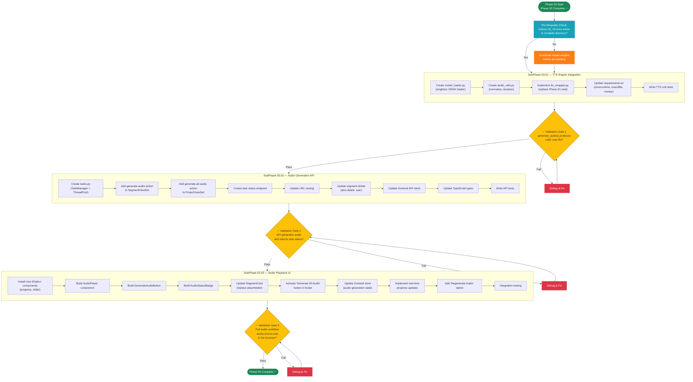

# Phase 03 — The Voice

## Layer 1 Overview Document

---

| **Field**              | **Value**                                                                  |
| ---------------------- | -------------------------------------------------------------------------- |
| **Phase**              | Phase 03 — The Voice                                                       |
| **Codename**           | The Voice                                                                  |
| **Layer**              | Layer 1 (Phase Overview)                                                   |
| **Status**             | Not Started                                                                |
| **Parent Document**    | [00_Project_Overview.md](../00_Project_Overview.md) (Layer 0)              |
| **Previous Phase**     | [Phase 02 — The Logic](../Phase_02_The_Logic/Phase_02_Overview.md)         |
| **Next Phase**         | [Phase 04 — The Vision](../Phase_04_The_Vision/Phase_04_Overview.md)       |
| **Dependencies**       | Phase 02 must be 100% complete (see §2 for details)                        |
| **Sub-Phases**         | 3 (03.01, 03.02, 03.03)                                                   |
| **Est. Task Documents**| 30–45 across all 3 sub-phases                                             |

---

## Table of Contents

- [Phase 03 — The Voice](#phase-03--the-voice)
  - [Layer 1 Overview Document](#layer-1-overview-document)
  - [Table of Contents](#table-of-contents)
  - [1. Phase Objective](#1-phase-objective)
    - [What Phase 03 Builds](#what-phase-03-builds)
    - [What Phase 03 Does NOT Build](#what-phase-03-does-not-build)
  - [2. Relationship to Parent \& Previous Documents](#2-relationship-to-parent--previous-documents)
    - [2.1 Inherited from Layer 0](#21-inherited-from-layer-0)
    - [2.2 Inherited from Phase 01 (Transitive)](#22-inherited-from-phase-01-transitive)
    - [2.3 Inherited from Phase 02 (Direct Dependency)](#23-inherited-from-phase-02-direct-dependency)
    - [2.4 One-Directional Rule](#24-one-directional-rule)
  - [3. Architecture Context for This Phase](#3-architecture-context-for-this-phase)
    - [3.1 Technology Stack (Phase 03 Scope)](#31-technology-stack-phase-03-scope)
    - [3.2 New Dependencies Introduced in Phase 03](#32-new-dependencies-introduced-in-phase-03)
    - [3.3 Database Models (Reiterated — Unchanged)](#33-database-models-reiterated--unchanged)
      - [Segment Model — Fields Used in Phase 03](#segment-model--fields-used-in-phase-03)
      - [GlobalSettings Model — Fields Used in Phase 03](#globalsettings-model--fields-used-in-phase-03)
      - [Available Kokoro Voice IDs](#available-kokoro-voice-ids)
    - [3.4 Phase 02 Deliverables That Phase 03 Builds Upon](#34-phase-02-deliverables-that-phase-03-builds-upon)
    - [3.5 Directory Structure After Phase 03](#35-directory-structure-after-phase-03)
    - [3.6 API Endpoints (Phase 03 Scope)](#36-api-endpoints-phase-03-scope)
      - [Single Segment Audio Generation](#single-segment-audio-generation)
      - [Bulk Audio Generation](#bulk-audio-generation)
      - [Task Status Polling](#task-status-polling)
  - [4. Sub-Phase Breakdown](#4-sub-phase-breakdown)
    - [4.1 SubPhase 03.01 — TTS Engine Integration](#41-subphase-0301--tts-engine-integration)
    - [4.2 SubPhase 03.02 — Audio Generation API](#42-subphase-0302--audio-generation-api)
    - [4.3 SubPhase 03.03 — Audio Playback UI](#43-subphase-0303--audio-playback-ui)
  - [5. Execution Order](#5-execution-order)
    - [5.1 Sub-Phase Dependency Chain](#51-sub-phase-dependency-chain)
    - [5.2 Execution Order Flowchart](#52-execution-order-flowchart)
  - [6. Sub-Phase Folder Structure](#6-sub-phase-folder-structure)
  - [7. Files Created \& Modified in This Phase](#7-files-created--modified-in-this-phase)
    - [7.1 Backend Files](#71-backend-files)
    - [7.2 Frontend Files](#72-frontend-files)
    - [7.3 Model Files](#73-model-files)
    - [7.4 File Creation Map (Mermaid)](#74-file-creation-map-mermaid)
  - [8. Detailed Module Specifications](#8-detailed-module-specifications)
    - [8.1 Kokoro-82M ONNX Model Integration](#81-kokoro-82m-onnx-model-integration)
    - [8.2 TTS Inference Pipeline](#82-tts-inference-pipeline)
    - [8.3 Audio Generation API Design](#83-audio-generation-api-design)
    - [8.4 Background Task Execution Model](#84-background-task-execution-model)
    - [8.5 Audio Playback UI](#85-audio-playback-ui)
  - [9. Technology Setup Details](#9-technology-setup-details)
    - [9.1 Backend New Packages](#91-backend-new-packages)
    - [9.2 Model Weights Setup](#92-model-weights-setup)
    - [9.3 New Shadcn/UI Components](#93-new-shadcnui-components)
    - [9.4 Django Settings Changes](#94-django-settings-changes)
    - [9.5 Audio File Serving in Development](#95-audio-file-serving-in-development)
  - [10. Constraints Specific to Phase 03](#10-constraints-specific-to-phase-03)
  - [11. Exit Criteria](#11-exit-criteria)
    - [TTS Engine Validation](#tts-engine-validation)
    - [Audio Generation API Validation](#audio-generation-api-validation)
    - [Audio Playback UI Validation](#audio-playback-ui-validation)
    - [Structural Validation](#structural-validation)
  - [12. Cross-References](#12-cross-references)
    - [12.1 References to Layer 0](#121-references-to-layer-0)
    - [12.2 References to Phase 01](#122-references-to-phase-01)
    - [12.3 References to Phase 02](#123-references-to-phase-02)
    - [12.4 Forward References to Phase 04](#124-forward-references-to-phase-04)
    - [12.5 Child Documents (Layer 2)](#125-child-documents-layer-2)

---

## 1. Phase Objective

Phase 03 — **The Voice** — integrates the local **Text-to-Speech (TTS)** engine into StoryFlow, transforming silent story segments into narrated audio. This is the phase where StoryFlow gains its most distinctive capability: converting the user's written script into professional-quality spoken narration — entirely offline, entirely free, using the **Kokoro-82M** model via **ONNX Runtime**.

### What Phase 03 Builds

1. **Kokoro-82M ONNX Model Integration** — A singleton model loader that initializes the Kokoro-82M TTS model once using ONNX Runtime and keeps it in memory for fast repeated inference. The model weights file (`kokoro-v0_19.onnx`) is loaded from the local `/models/` directory.

2. **TTS Inference Wrapper (`core_engine/tts_wrapper.py`)** — A clean Python module that accepts `text_content` as input, runs it through the Kokoro model, post-processes the output (normalize audio volume), and saves the result as a `.wav` file in the project's audio directory.

3. **Audio Generation API** — Backend endpoints that trigger TTS generation for individual segments or bulk-generate for all segments in a project. Includes background task execution using Python `threading`/`concurrent.futures` (NOT Redis/Celery) to prevent blocking the API during long-running TTS operations.

4. **Audio Playback UI** — Frontend components that replace the Phase 02 audio placeholders with functional audio players. Each segment card gains a play/pause button, waveform or progress indicator, and duration display. The "Generate All Audio" button in the timeline footer becomes functional.

### What Phase 03 Does NOT Build

> **Critical:** The following features are explicitly **out of scope** for Phase 03. AI agents must NOT implement these.

- ❌ Video rendering or MoviePy integration (→ Phase 04)
- ❌ Ken Burns zoom/pan effects on images (→ Phase 04)
- ❌ Image-audio synchronization into video clips (→ Phase 04)
- ❌ Subtitle generation or overlay (→ Phase 05)
- ❌ Crossfade transitions between segments (→ Phase 05)
- ❌ GlobalSettings editing UI (→ Phase 05)
- ❌ Drag-to-reorder segments in the UI (complex UI — deferred if not already in Phase 02)
- ❌ Fish Speech fallback TTS integration (future enhancement — not in MVP)
- ❌ Real-time streaming audio (audio is generated and saved as `.wav`, then played back)
- ❌ Cloud-based TTS of any kind (permanent constraint — local only)
- ❌ Video export button functionality (→ Phase 04)

At the conclusion of Phase 03, a user should be able to: import a story, see segments in the timeline, upload images to segments, **generate spoken audio for any or all segments**, **play back the audio in the browser**, and see duration metadata for each audio file — all running locally with zero cloud dependency.

---

## 2. Relationship to Parent & Previous Documents

### 2.1 Inherited from Layer 0

Phase 03 inherits all architectural decisions, constraints, and conventions from the Layer 0 master overview:

| Layer 0 Section                                      | Phase 03 Relevance                                                        |
| ---------------------------------------------------- | ------------------------------------------------------------------------- |
| §1 — Project Vision                                  | Phase 03 implements the "audio synthesis" capability — a core pillar of StoryFlow |
| §2.2 — Technology Stack                              | Phase 03 activates `onnxruntime`, `soundfile`, `numpy` from the stack     |
| §3.2.2 — Segment Model                               | Phase 03 populates `audio_file` and `audio_duration` fields               |
| §3.2.3 — GlobalSettings Model                        | Phase 03 **reads** `default_voice_id` and `tts_speed` from GlobalSettings |
| §4 — Directory Structure                             | Phase 03 populates `/media/projects/{id}/audio/` with `.wav` files        |
| §5.3 — TTS Generation Module                         | **Primary reference.** Phase 03 implements this module fully.             |
| §6 — API Endpoints                                   | Phase 03 implements `POST /api/segments/{id}/generate-audio/`             |
| §14 — Development Constraints                        | All constraints remain in force. Especially: no cloud APIs, no Redis.     |

### 2.2 Inherited from Phase 01 (Transitive)

Phase 03 does not directly modify any Phase 01 artifact, but it **transitively depends** on Phase 01's deliverables through Phase 02. The key Phase 01 artifacts still in use:

| Phase 01 Artifact                          | Still Relevant In Phase 03 Because                                        |
| ------------------------------------------ | ------------------------------------------------------------------------- |
| Django project structure                   | All backend work happens within this Django project                        |
| Next.js project structure                  | All frontend work happens within this Next.js project                     |
| `Project` model                            | Project records are fetched to determine status and media paths            |
| `Segment` model                            | `audio_file` and `audio_duration` fields are populated in Phase 03        |
| `GlobalSettings` model                     | **First active use:** `default_voice_id` and `tts_speed` are READ here    |
| `core_engine/` stub directory              | `tts_wrapper.py` is implemented (replacing the Phase 01 stub)             |

> **For AI Agents:** You do NOT need to read `Phase_01_Overview.md`. All Phase 01 artifacts needed for Phase 03 are already listed in the Phase 02 Overview (§3.3) and reproduced in this document (§3.3).

### 2.3 Inherited from Phase 02 (Direct Dependency)

Phase 03 **directly depends** on the deliverables of Phase 02. The following Phase 02 artifacts are prerequisites:

| Phase 02 Artifact                                  | Used by Phase 03 For                                                      |
| -------------------------------------------------- | ------------------------------------------------------------------------- |
| Import & Parse Engine                              | Projects exist with populated segments (text + prompts)                   |
| Segment CRUD API                                   | Segment data is read/updated by the audio generation pipeline             |
| `PATCH /api/segments/{id}/` endpoint               | TTS pipeline updates `audio_file` and `audio_duration` on segments        |
| Image Upload Pipeline                              | Images exist on segments (not directly used by TTS, but part of UI state) |
| Timeline Editor UI (`app/projects/[id]/page.tsx`)   | **Extended** with audio playback controls and generation buttons          |
| `SegmentCard.tsx` component                        | **Extended** with audio player area (replacing "Coming in Phase 03" placeholder) |
| `lib/api.ts` client                                | **Extended** with `generateAudio()`, `generateAllAudio()` API calls       |
| `lib/types.ts` types                               | **Extended** with audio-related types and status enums                    |
| `lib/stores.ts` Zustand store                      | **Extended** with audio generation state management                       |
| Disabled "Generate All Audio" button               | **Enabled** and made functional in Phase 03                               |
| Audio placeholder in SegmentCard                   | **Replaced** with actual audio player controls                            |
| `api/views.py` viewsets                             | **Extended** with audio generation actions                                |
| `api/urls.py` routing                              | **Extended** with audio generation endpoint routes                        |

> **Important for AI Agents:** You do NOT need to re-read `Phase_02_Overview.md` in its entirety. The table above summarizes everything Phase 03 needs from Phase 02. If you need specific implementation details (e.g., Zustand store structure, SegmentCard props), refer to Section 3.4 of this document which reproduces them.

### 2.4 One-Directional Rule

> As defined in [00_Project_Overview.md](../00_Project_Overview.md) (Layer 0, §7.3): Documents flow TOP-DOWN only. This Phase 03 Overview inherits from and must be consistent with:
> - [00_Project_Overview.md](../00_Project_Overview.md) (Layer 0)
> - [Phase_01_Overview.md](../Phase_01_The_Skeleton/Phase_01_Overview.md) (Layer 1 — Phase 01)
> - [Phase_02_Overview.md](../Phase_02_The_Logic/Phase_02_Overview.md) (Layer 1 — Phase 02)
>
> If any content here conflicts with a parent document, the **higher-level document takes precedence**. Phase 03 does NOT modify any Phase 01 or Phase 02 model definitions, API contracts, or architectural decisions — it only EXTENDS them.

---

## 3. Architecture Context for This Phase

This section provides all the architectural context an AI agent needs while working on Phase 03. This is self-contained — agents should not need to re-read Layer 0 or previous Phase overviews for Phase 03 work.

### 3.1 Technology Stack (Phase 03 Scope)

Phase 03 uses the same base stack from Phases 01–02, but **activates several libraries** that were installed but unused until now.

| Component              | Technology                        | Phase 03 Usage                                     |
| ---------------------- | --------------------------------- | -------------------------------------------------- |
| Backend Framework      | Django 5.x + DRF                  | New audio generation endpoints, background tasks    |
| Database               | SQLite                            | `audio_file` and `audio_duration` fields populated  |
| Frontend Framework     | Next.js 16+ (App Router)          | Audio player components, generation UI              |
| Language (FE)          | TypeScript (Strict)               | Audio-related types, async state handling            |
| Styling                | Tailwind CSS 4                    | Audio player styling, progress indicators           |
| UI Components          | Shadcn/UI                         | New: Progress, Slider (for audio scrubbing)         |
| State Management       | Zustand                           | Extended with audio generation state                |
| HTTP Client            | Axios                             | Polling for task status, audio generation triggers   |
| **TTS Model**          | **Kokoro-82M (ONNX)**             | **NEW — Primary deliverable of Phase 03**           |
| **ONNX Runtime**       | **onnxruntime / onnxruntime-gpu** | **NEW — Inference engine for Kokoro model**         |
| **Audio I/O**          | **soundfile**                     | **NEW — Read/write `.wav` files, get duration**     |
| **Numerical**          | **NumPy**                         | **NEW — Audio array manipulation, normalization**   |
| Background Tasks       | Python `threading` / `concurrent.futures` | **NEW — Non-blocking TTS execution**       |

### 3.2 New Dependencies Introduced in Phase 03

Phase 03 is the first phase that requires **new Python packages** beyond the Phase 01 `requirements.txt`.

**New Backend Packages (add to `requirements.txt`):**

```
onnxruntime>=1.17.0       # ONNX model inference runtime (CPU)
# onnxruntime-gpu>=1.17.0 # (Optional: GPU-accelerated inference, user's choice)
soundfile>=0.12.1         # Read/write .wav audio files
numpy>=1.26.0             # Audio array manipulation
```

> **Note on `onnxruntime` vs `onnxruntime-gpu`:** These two packages are mutually exclusive — you cannot have both installed. The default should be `onnxruntime` (CPU). Users with NVIDIA GPUs can uninstall `onnxruntime` and install `onnxruntime-gpu` instead for faster inference. The code should work identically with either package — the API is the same.

**New Frontend Packages:** None. All frontend capabilities (HTML5 `<audio>` element, `AudioContext` API) are browser-native.

**New Shadcn/UI Components (install at start of SubPhase 03.03):**

```bash
cd frontend
npx shadcn@latest add progress slider
```

### 3.3 Database Models (Reiterated — Unchanged)

Phase 03 does **not modify** any model definitions. It uses them as-is from Phase 01. Here are the fields relevant to Phase 03:

#### Segment Model — Fields Used in Phase 03

| Field             | Type         | Default | Phase 03 Usage                                        |
| ----------------- | ------------ | ------- | ----------------------------------------------------- |
| `id`              | UUIDField    | uuid4   | Primary identifier for audio file naming              |
| `project`         | ForeignKey   | —       | Determines the media storage path: `/media/projects/{project_id}/audio/` |
| `text_content`    | TextField    | `""`    | **Input to TTS:** This text is converted to spoken audio |
| `audio_file`      | FileField    | null    | **Output of TTS:** Path to the generated `.wav` file  |
| `audio_duration`  | FloatField   | null    | **Output of TTS:** Duration in seconds, calculated via `soundfile.info()` |
| `is_locked`       | BooleanField | False   | If True, TTS should NOT overwrite existing audio      |

#### GlobalSettings Model — Fields Used in Phase 03

| Field              | Type        | Default       | Phase 03 Usage                                 |
| ------------------ | ----------- | ------------- | ---------------------------------------------- |
| `default_voice_id` | CharField  | `"af_bella"`  | **Input to TTS:** Selects the Kokoro voice     |
| `tts_speed`        | FloatField | `1.0`         | **Input to TTS:** Controls speech speed        |

> **Important:** Phase 03 **reads** GlobalSettings values but does NOT provide a UI to edit them. The GlobalSettings editing UI is deferred to Phase 05. Phase 03 uses the database defaults (`"af_bella"`, `1.0`) or whatever values were seeded during Phase 01 migration.

#### Available Kokoro Voice IDs

The following voice IDs are available in Kokoro-82M. Phase 03 must use `default_voice_id` from GlobalSettings to select the voice. These are listed here for reference and for building any future voice selection UI:

| Voice ID      | Gender | Accent  | Description           |
| ------------- | ------ | ------- | --------------------- |
| `af_bella`    | Female | American| Clear, warm tone      |
| `af_sarah`    | Female | American| Professional, neutral |
| `af_nicole`   | Female | American| Soft, narrative       |
| `am_adam`     | Male   | American| Deep, authoritative   |
| `am_michael`  | Male   | American| Friendly, conversational |
| `bf_emma`     | Female | British | Elegant, BBC-style    |
| `bm_george`   | Male   | British | Distinguished, formal |

> **Note:** The exact available voice IDs depend on the Kokoro model version. The above list reflects `kokoro-v0_19.onnx`. The wrapper should handle invalid voice IDs gracefully by falling back to `"af_bella"`.

### 3.4 Phase 02 Deliverables That Phase 03 Builds Upon

The following is the exact state of the codebase at the start of Phase 03 (i.e., after Phase 02 is complete):

**Backend (running on `localhost:8000`):**
- `api/models.py` — Contains `Project`, `Segment`, `GlobalSettings` (unchanged since Phase 01).
- `api/serializers.py` — Contains `ProjectSerializer`, `ProjectDetailSerializer`, `SegmentSerializer`, `GlobalSettingsSerializer`, `ProjectImportSerializer` (added in Phase 02).
- `api/views.py` — Contains `ProjectViewSet` (with list, create, retrieve, destroy, import actions), `SegmentViewSet` (with partial_update, destroy, upload-image, remove-image actions), standalone reorder view.
- `api/parsers.py` — JSON and Text import parsers (added in Phase 02).
- `api/validators.py` — Import and upload validation (added in Phase 02).
- `api/urls.py` — Routes for Projects, Segments, import, reorder.
- `core_engine/tts_wrapper.py` — **Stub file only** (created in Phase 01, NOT YET IMPLEMENTED — this is Phase 03's primary deliverable).
- `core_engine/video_renderer.py` — Stub file only (→ Phase 04).
- `core_engine/ken_burns.py` — Stub file only (→ Phase 04).
- Database migrated. SQLite with real project/segment data.
- `/media/projects/{id}/images/` — Contains uploaded images from Phase 02.
- `/media/projects/{id}/audio/` — **Empty directory** (Phase 03 populates this).
- `/media/projects/{id}/output/` — Empty directory (→ Phase 04).

**Frontend (running on `localhost:3000`):**
- `app/page.tsx` — Dashboard with project list, import dialog, delete option.
- `app/projects/[id]/page.tsx` — Full Timeline Editor (from Phase 02).
- `components/SegmentCard.tsx` — Segment card with text editor, image zone, prompt display, lock toggle, delete button, **and a disabled audio placeholder saying "Coming in Phase 03"**.
- `components/Timeline.tsx` — Vertical scrolling segment list wrapper.
- `components/ImageUploader.tsx` — Drag-and-drop image upload.
- `components/SegmentTextEditor.tsx` — Inline text editing with debounced auto-save.
- `components/ImagePromptDisplay.tsx` — Prompt display with copy button.
- `components/ImportDialog.tsx` — Story import modal.
- `lib/api.ts` — Axios client with project CRUD, segment CRUD, image upload, reorder functions.
- `lib/types.ts` — TypeScript interfaces for Project, Segment, ImportPayload, etc.
- `lib/stores.ts` — Zustand store with `useProjectStore` managing project/segment state.
- Footer action bar: "Generate All Audio" button **(disabled)**, "Export Video" button **(disabled)**.

### 3.5 Directory Structure After Phase 03

After Phase 03, the project structure will include these additions (new files marked with `← NEW`):

```
/storyflow_root
│
├── /backend
│   ├── /api
│   │   ├── models.py                  (unchanged)
│   │   ├── serializers.py             ← MODIFIED (audio-related serializer fields)
│   │   ├── views.py                   ← MODIFIED (audio generation actions)
│   │   ├── urls.py                    ← MODIFIED (audio generation routes)
│   │   ├── parsers.py                 (unchanged from Phase 02)
│   │   ├── validators.py              (unchanged from Phase 02)
│   │   ├── tasks.py                   ← NEW (background task management for TTS)
│   │   └── tests.py                   ← MODIFIED (audio generation tests)
│   │
│   ├── /core_engine
│   │   ├── __init__.py                (unchanged)
│   │   ├── tts_wrapper.py             ← IMPLEMENTED (was stub — now fully functional)
│   │   ├── model_loader.py            ← NEW (singleton ONNX model loader)
│   │   ├── audio_utils.py             ← NEW (audio normalization, duration calculation)
│   │   ├── video_renderer.py          (stub — unchanged, → Phase 04)
│   │   └── ken_burns.py               (stub — unchanged, → Phase 04)
│   │
│   ├── /media
│   │   └── /projects
│   │       └── /{project_uuid}
│   │           ├── /images            (populated in Phase 02)
│   │           ├── /audio             ← POPULATED (TTS .wav files land here)
│   │           └── /output            (empty — Phase 04)
│   │
│   └── requirements.txt               ← MODIFIED (added onnxruntime, soundfile, numpy)
│
├── /frontend
│   ├── /app
│   │   ├── page.tsx                   (unchanged from Phase 02)
│   │   └── /projects
│   │       └── /[id]
│   │           └── page.tsx           ← MODIFIED (audio controls in timeline footer)
│   │
│   ├── /components
│   │   ├── SegmentCard.tsx            ← MODIFIED (audio placeholder replaced with real player)
│   │   ├── AudioPlayer.tsx            ← NEW (HTML5 audio playback component)
│   │   ├── GenerateAudioButton.tsx    ← NEW (per-segment "Generate Audio" button)
│   │   ├── AudioStatusBadge.tsx       ← NEW (shows audio generation state)
│   │   ├── Timeline.tsx               (unchanged from Phase 02)
│   │   ├── ImageUploader.tsx          (unchanged from Phase 02)
│   │   ├── SegmentTextEditor.tsx      (unchanged from Phase 02)
│   │   ├── ImagePromptDisplay.tsx     (unchanged from Phase 02)
│   │   └── ImportDialog.tsx           (unchanged from Phase 02)
│   │
│   ├── /lib
│   │   ├── api.ts                     ← MODIFIED (generateAudio, generateAllAudio, pollTaskStatus)
│   │   ├── types.ts                   ← MODIFIED (AudioStatus, TaskStatus types)
│   │   ├── stores.ts                  ← MODIFIED (audio generation state in Zustand store)
│   │   └── utils.ts                   (unchanged or minor additions)
│   │
│   └── (rest unchanged)
│
├── /models
│   └── kokoro-v0_19.onnx             (model weights file — must exist before Phase 03)
│
└── (rest unchanged)
```

### 3.6 API Endpoints (Phase 03 Scope)

Phase 03 implements the following API endpoints. Endpoints created in Phases 01–02 are marked as "unchanged" or "extended."

| Method   | Endpoint                                  | Status in Phase 03 | Description                                        |
| -------- | ----------------------------------------- | ------------------- | -------------------------------------------------- |
| `GET`    | `/api/projects/`                          | Unchanged           | List all projects                                  |
| `POST`   | `/api/projects/`                          | Unchanged           | Create project (simple)                            |
| `GET`    | `/api/projects/{id}/`                     | **Extended**        | Now includes audio metadata per segment            |
| `DELETE` | `/api/projects/{id}/`                     | Unchanged           | Delete project + all media                         |
| `POST`   | `/api/projects/import/`                   | Unchanged           | Import structured story data                       |
| `GET`    | `/api/segments/?project={id}`             | Unchanged           | List segments (ordered)                            |
| `PATCH`  | `/api/segments/{id}/`                     | Unchanged           | Update segment fields                              |
| `DELETE` | `/api/segments/{id}/`                     | **Extended**        | Now also deletes audio files from disk              |
| `POST`   | `/api/segments/{id}/upload-image/`        | Unchanged           | Upload image                                       |
| `DELETE` | `/api/segments/{id}/remove-image/`        | Unchanged           | Remove image                                       |
| `POST`   | `/api/segments/reorder/`                  | Unchanged           | Reorder segments                                   |
| `POST`   | `/api/segments/{id}/generate-audio/`      | **NEW**             | Trigger TTS for a single segment                   |
| `POST`   | `/api/projects/{id}/generate-all-audio/`  | **NEW**             | Trigger TTS for ALL segments in a project          |
| `GET`    | `/api/tasks/{task_id}/status/`            | **NEW**             | Poll background task progress                      |

#### Single Segment Audio Generation

**`POST /api/segments/{id}/generate-audio/`**

Triggers TTS generation for one segment. Runs in a background thread to avoid blocking the API.

**Request Body:** None (empty body or `{}`)

**Behavior:**
1. Reads `Segment.text_content` as input.
2. Reads `GlobalSettings.default_voice_id` and `GlobalSettings.tts_speed` for TTS configuration.
3. Checks `Segment.is_locked` — if `True`, returns 409 Conflict (refuse to overwrite).
4. Spawns a background thread that:
   a. Loads the Kokoro model (singleton — already loaded after first call).
   b. Runs TTS inference on the text.
   c. Normalizes audio volume.
   d. Saves `.wav` file to `/media/projects/{project_id}/audio/{segment_id}.wav`.
   e. Updates `Segment.audio_file` with the file path.
   f. Calculates duration via `soundfile.info()` and updates `Segment.audio_duration`.
5. Returns immediately with a task ID for status polling.

**Response (202 Accepted):**
```json
{
  "task_id": "tts_abc123def456",
  "segment_id": "e5f6g7h8-...",
  "status": "PENDING",
  "message": "Audio generation started"
}
```

#### Bulk Audio Generation

**`POST /api/projects/{id}/generate-all-audio/`**

Triggers TTS generation for ALL segments in a project, sequentially (one at a time to manage memory).

**Request Body:** None (or `{ "skip_locked": true }` to skip locked segments)

**Behavior:**
1. Fetches all segments for the project ordered by `sequence_index`.
2. Filters out locked segments (if `skip_locked` is true) and segments that already have audio (optional: `force_regenerate` flag).
3. Spawns a background thread that processes segments one at a time.
4. Returns immediately with a task ID.

**Response (202 Accepted):**
```json
{
  "task_id": "tts_batch_xyz789",
  "project_id": "a1b2c3d4-...",
  "status": "PENDING",
  "total_segments": 12,
  "segments_to_process": 10,
  "message": "Bulk audio generation started (2 segments skipped: locked)"
}
```

#### Task Status Polling

**`GET /api/tasks/{task_id}/status/`**

Returns the current status of a background TTS task.

**Response (200 OK):**
```json
{
  "task_id": "tts_batch_xyz789",
  "status": "PROCESSING",
  "progress": {
    "current": 4,
    "total": 10,
    "current_segment_id": "m3n4o5p6-...",
    "percentage": 40
  },
  "completed_segments": [
    {
      "segment_id": "e5f6g7h8-...",
      "audio_url": "/media/projects/a1b2c3d4/audio/e5f6g7h8.wav",
      "duration": 5.23
    }
  ],
  "errors": []
}
```

**Status values:** `PENDING`, `PROCESSING`, `COMPLETED`, `FAILED`

---

## 4. Sub-Phase Breakdown

Phase 03 is divided into exactly **3 sub-phases**, executed strictly in order. Each sub-phase has its own Layer 2 overview document and a set of Layer 3 task documents.

### 4.1 SubPhase 03.01 — TTS Engine Integration

| Field              | Value                                                                            |
| ------------------ | -------------------------------------------------------------------------------- |
| **Sub-Phase ID**   | 03.01                                                                            |
| **Name**           | TTS Engine Integration                                                           |
| **Folder**         | `SubPhase_03_01_TTS_Engine_Integration/`                                         |
| **Overview File**  | `SubPhase_03_01_Overview.md`                                                     |
| **Dependencies**   | Phase 02 complete (segments exist with text_content populated)                   |
| **Est. Task Docs** | 10–12                                                                            |

**Objective:** Implement the low-level TTS engine: model loading, inference, audio post-processing, and file storage. This sub-phase is **entirely backend** — no frontend changes.

**Key Deliverables:**

1. **Model Loader (`core_engine/model_loader.py`)**
   - Singleton class `KokoroModelLoader` that:
     - Loads `kokoro-v0_19.onnx` from the `/models/` directory.
     - Uses `onnxruntime.InferenceSession` to create the inference session.
     - Stores the session in a class-level variable — only loads once across the entire application lifecycle.
     - Handles the case where the model file is missing: raises a clear error with instructions.
     - Provides a `get_session()` class method that returns the loaded session (lazy initialization).
   - **Thread safety:** The singleton must be thread-safe. Use `threading.Lock` to prevent concurrent initialization.

2. **TTS Wrapper (`core_engine/tts_wrapper.py`)**
   - **Replaces the Phase 01 stub** with a fully functional implementation.
   - Main function: `generate_audio(text: str, voice_id: str, speed: float, output_path: str) -> dict`
   - Steps:
     a. Get the ONNX session from `KokoroModelLoader.get_session()`.
     b. Tokenize the input text (Kokoro-specific tokenization).
     c. Prepare input tensors (voice embedding lookup based on `voice_id`).
     d. Run inference: `session.run(None, input_dict)` → returns a float32 audio array.
     e. Normalize audio volume (peak normalization to -1.0 dB).
     f. Save as `.wav` file using `soundfile.write(output_path, audio_array, sample_rate)`.
     g. Calculate duration using `soundfile.info(output_path).duration`.
     h. Return `{ "audio_path": output_path, "duration": duration_in_seconds }`.
   - **Error handling:** Wrap the entire pipeline in try/except. Return structured error dict on failure.
   - **Voice ID validation:** Check if `voice_id` exists in the model's voice list. Fall back to `"af_bella"` if invalid.

3. **Audio Utilities (`core_engine/audio_utils.py`)**
   - `normalize_audio(audio_array: np.ndarray, target_db: float = -1.0) -> np.ndarray` — Peak normalization.
   - `get_audio_duration(file_path: str) -> float` — Returns duration in seconds via `soundfile.info()`.
   - `validate_audio_file(file_path: str) -> bool` — Checks if a `.wav` file is valid and playable.

4. **Model Weights Verification**
   - A utility function that checks if `kokoro-v0_19.onnx` exists in the `/models/` directory at startup.
   - If missing, logs a clear warning with download instructions.
   - The system must **not crash** if the model file is missing — it should gracefully degrade and return informative errors when TTS is requested.

5. **Updated `requirements.txt`**
   - Add `onnxruntime`, `soundfile`, `numpy` to the backend requirements file.

6. **Unit Tests**
   - Test model loading (mock the ONNX session).
   - Test audio normalization with synthetic data.
   - Test duration calculation with a real/mock `.wav` file.
   - Test error handling when model file is missing.
   - Test voice ID fallback behavior.

**Key Technical Decisions:**
- **Singleton pattern over dependency injection** for the model loader. TTS models are large and expensive to load. We load once and reuse. This is the pattern recommended by ONNX Runtime documentation.
- **Peak normalization** (not RMS normalization). Peak normalization is simpler, deterministic, and prevents clipping — which is the primary concern for TTS output.
- **`.wav` format over `.mp3`** for storage. WAV is lossless, fast to write, and can be played natively by all browsers via `<audio>`. MP3 encoding would add a dependency and processing time for no practical benefit in a local-only app.
- **Sample rate:** Use whatever sample rate Kokoro-82M outputs natively (typically 24000 Hz). Do NOT resample.

### 4.2 SubPhase 03.02 — Audio Generation API

| Field              | Value                                                                            |
| ------------------ | -------------------------------------------------------------------------------- |
| **Sub-Phase ID**   | 03.02                                                                            |
| **Name**           | Audio Generation API                                                             |
| **Folder**         | `SubPhase_03_02_Audio_Generation_API/`                                           |
| **Overview File**  | `SubPhase_03_02_Overview.md`                                                     |
| **Dependencies**   | SubPhase 03.01 complete (TTS engine works, can generate .wav files)              |
| **Est. Task Docs** | 10–12                                                                            |

**Objective:** Build the Django API endpoints that trigger TTS generation, manage background tasks, and provide task status polling. This sub-phase bridges the TTS engine (03.01) and the frontend UI (03.03).

**Key Deliverables:**

1. **Background Task Manager (`api/tasks.py`)**
   - A simple in-memory task tracking system using Python's `concurrent.futures.ThreadPoolExecutor`.
   - Data structure: A dictionary mapping `task_id` → `{ status, progress, result, errors }`.
   - `TaskManager` class (singleton) with methods:
     - `submit_task(task_fn, task_id) -> task_id` — Submit a callable to the thread pool.
     - `get_task_status(task_id) -> dict` — Return current status, progress, errors.
     - `update_task_progress(task_id, current, total, **kwargs)` — Called by the task function to report progress.
   - **Thread pool size:** 1 worker. TTS is CPU/GPU-intensive; running multiple inferences concurrently would be counterproductive. Tasks queue and run one at a time.
   - **Task cleanup:** Completed task records are kept in memory for 1 hour, then purged. This prevents memory leaks during long sessions.

   > **Why NOT Redis/Celery?** As mandated in [00_Project_Overview.md](../00_Project_Overview.md) (Layer 0, §14.1): StoryFlow uses NO external services. Python's `concurrent.futures` provides exactly what we need — a background thread pool — without adding infrastructure complexity. The task status is stored in-process memory. If the server restarts, task history is lost, which is acceptable for a local development tool.

2. **Single Segment Audio Endpoint**
   - `POST /api/segments/{id}/generate-audio/` — Custom DRF action on `SegmentViewSet`.
   - Validates: segment has `text_content`, segment is not locked.
   - Reads `GlobalSettings.default_voice_id` and `tts_speed`.
   - Creates a background task that calls `tts_wrapper.generate_audio()`.
   - The task function updates `Segment.audio_file` and `Segment.audio_duration` upon completion.
   - Returns 202 Accepted with `task_id`.

3. **Bulk Audio Generation Endpoint**
   - `POST /api/projects/{id}/generate-all-audio/` — Custom DRF action on `ProjectViewSet`.
   - Fetches all segments ordered by `sequence_index`.
   - Optionally skips locked segments and segments that already have audio.
   - Creates a single background task that iterates through segments sequentially, generating audio for each one.
   - The task function reports progress after each segment completes.
   - Returns 202 Accepted with `task_id` and segment counts.

4. **Task Status Endpoint**
   - `GET /api/tasks/{task_id}/status/` — Standalone DRF view (not part of any ViewSet).
   - Returns current task status, progress (current/total/percentage), completed segments, and errors.
   - Returns 404 if `task_id` is unknown.

5. **Updated URL Routing**
   - Register the `generate-audio` action on `SegmentViewSet`.
   - Register the `generate-all-audio` action on `ProjectViewSet`.
   - Add the task status URL pattern.

6. **Updated Frontend API Client (`lib/api.ts`)**
   - `generateSegmentAudio(segmentId: string): Promise<TaskResponse>` — POST to generate-audio.
   - `generateAllAudio(projectId: string, options?: { skipLocked?: boolean }): Promise<TaskResponse>` — POST to generate-all-audio.
   - `getTaskStatus(taskId: string): Promise<TaskStatusResponse>` — GET task status.
   - `pollTaskStatus(taskId: string, onProgress: callback, intervalMs?: number): Promise<void>` — Utility that polls task status every N ms until completion.

7. **Updated TypeScript Types (`lib/types.ts`)**
   - `TaskResponse` — `{ task_id: string; status: TaskStatus; message: string; ... }`
   - `TaskStatusResponse` — `{ task_id: string; status: TaskStatus; progress: TaskProgress; completed_segments: CompletedSegmentAudio[]; errors: TaskError[] }`
   - `TaskStatus` — `"PENDING" | "PROCESSING" | "COMPLETED" | "FAILED"`
   - `TaskProgress` — `{ current: number; total: number; percentage: number; current_segment_id?: string }`
   - `CompletedSegmentAudio` — `{ segment_id: string; audio_url: string; duration: number }`

8. **Segment Delete Enhancement**
   - Update `DELETE /api/segments/{id}/` to also delete the segment's `.wav` file from `/media/projects/{project_id}/audio/` if it exists. (Phase 02's delete may not have handled audio files since they didn't exist yet.)

### 4.3 SubPhase 03.03 — Audio Playback UI

| Field              | Value                                                                            |
| ------------------ | -------------------------------------------------------------------------------- |
| **Sub-Phase ID**   | 03.03                                                                            |
| **Name**           | Audio Playback UI                                                                |
| **Folder**         | `SubPhase_03_03_Audio_Playback_UI/`                                              |
| **Overview File**  | `SubPhase_03_03_Overview.md`                                                     |
| **Dependencies**   | SubPhase 03.02 complete (audio generation API works, task polling works)          |
| **Est. Task Docs** | 12–15                                                                            |

**Objective:** Build the complete audio frontend — replacing the Phase 02 placeholders with functional audio players, generation triggers, progress indicators, and the activated "Generate All Audio" button.

**Key Deliverables:**

1. **AudioPlayer Component (`components/AudioPlayer.tsx`)**
   - A compact, inline audio player embedded in each `SegmentCard`.
   - Uses the native HTML5 `<audio>` element for playback (no external library needed).
   - Features:
     - **Play/Pause toggle button** — Standard play/pause icon.
     - **Progress bar** — Shows current playback position as a Shadcn/UI `Slider` or custom range input. Allows scrubbing (seek to position by clicking/dragging).
     - **Duration display** — Shows `current_time / total_duration` in `MM:SS` format.
     - **Loading state** — While audio is being fetched, show a spinner.
   - Props: `audioUrl: string | null`, `duration: number | null`.
   - When `audioUrl` is null, displays nothing (the `GenerateAudioButton` is shown instead).

2. **GenerateAudioButton Component (`components/GenerateAudioButton.tsx`)**
   - A button shown on each segment that does NOT have audio generated yet.
   - Label: "Generate Audio" with a microphone/speaker icon.
   - On click: calls `generateSegmentAudio(segmentId)` → receives `task_id` → starts polling.
   - **During generation:** The button transforms into a progress indicator showing "Generating..." with a spinner.
   - **On completion:** Button disappears, `AudioPlayer` appears with the new audio.
   - **On error:** Shows a red error message with "Retry" option.
   - **Disabled state:** If segment is locked, button is disabled with tooltip "Unlock segment to generate audio."

3. **AudioStatusBadge Component (`components/AudioStatusBadge.tsx`)**
   - A small badge/indicator on the `SegmentCard` header showing audio status:
     - 🔇 **No Audio** — Gray badge, "No Audio".
     - ⏳ **Generating** — Yellow/amber badge, "Generating...".
     - ✅ **Ready** — Green badge, "Audio Ready" + duration.
     - ❌ **Failed** — Red badge, "Failed" with tooltip showing error message.

4. **Updated SegmentCard (`components/SegmentCard.tsx`)**
   - **Replaces** the Phase 02 audio placeholder ("Coming in Phase 03") with:
     - `AudioStatusBadge` in the card header area.
     - `AudioPlayer` (if audio exists) in the audio section.
     - `GenerateAudioButton` (if audio does not exist) in the audio section.
   - A "Regenerate Audio" option in the segment's dropdown menu (to regenerate even when audio already exists).
   - When TTS is running for this segment, the entire card shows a subtle pulsing border animation.

5. **Activated "Generate All Audio" Button**
   - The footer button in the timeline editor (`app/projects/[id]/page.tsx`) that was disabled in Phase 02 is now **enabled**.
   - On click: calls `generateAllAudio(projectId)` → receives `task_id` → starts polling.
   - Shows a progress bar in the footer: "Generating audio... 4/12 segments complete (33%)".
   - Updates each `SegmentCard` in real-time as individual segments complete (via the Zustand store).
   - "Cancel" button to abort the batch generation (best-effort — may complete the current segment).

6. **Updated Zustand Store (`lib/stores.ts`)**
   - Extended `useProjectStore` with audio-related state:
     - `audioTaskId: string | null` — Active TTS task ID.
     - `audioGenerationStatus: Record<string, AudioGenerationState>` — Per-segment generation state: `{ status: "idle" | "generating" | "completed" | "failed"; error?: string }`.
     - `bulkGenerationProgress: { current: number; total: number; percentage: number } | null`.
     - `generateAudio(segmentId: string): void` — Trigger single segment TTS + polling.
     - `generateAllAudio(): void` — Trigger bulk TTS + polling.
     - `cancelGeneration(): void` — Cancel active generation task.
     - `refreshSegmentAudio(segmentId: string): void` — Re-fetch segment data after audio is generated.

7. **Real-Time UI Updates During Generation**
   - When `generateAllAudio` is running, the UI should update in real-time:
     - The footer progress bar advances.
     - Individual `SegmentCard` components transition from "No Audio" → "Generating..." → "Audio Ready" as each segment completes.
     - This is achieved by polling `GET /api/tasks/{task_id}/status/` every 2 seconds and updating the Zustand store with the latest progress.

8. **Segment Audio Deletion**
   - When a segment is deleted, its audio file should also be deleted (handled server-side in SubPhase 03.02).
   - When a segment's text is edited (via PATCH), display a subtle warning: "Text changed — audio may be out of sync. Regenerate?" (informational, not enforced).

---

## 5. Execution Order

### 5.1 Sub-Phase Dependency Chain

| Step | Sub-Phase  | Depends On | Produces                                              |
| ---- | ---------- | ---------- | ----------------------------------------------------- |
| 1    | 03.01      | Phase 02   | TTS engine, model loader, audio utils, .wav generation |
| 2    | Gate 1     | Step 1     | ✅ `tts_wrapper.generate_audio()` produces valid `.wav` from text |
| 3    | 03.02      | Step 2     | Audio generation API, task manager, status polling     |
| 4    | Gate 2     | Step 3     | ✅ API endpoints generate audio and return task status (test with curl) |
| 5    | 03.03      | Step 4     | Audio player UI, generate buttons, progress indicators |
| 6    | Gate 3     | Step 5     | ✅ Full end-to-end audio workflow in the browser       |

### 5.2 Execution Order Flowchart



---

## 6. Sub-Phase Folder Structure

```
Phase_03_The_Voice/
│
├── Phase_03_Overview.md                                    ← YOU ARE HERE (Layer 1)
│
├── SubPhase_03_01_TTS_Engine_Integration/
│   ├── SubPhase_03_01_Overview.md                          ← Layer 2
│   ├── Task_03_01_01_Create_Model_Loader_Singleton.md      ← Layer 3
│   ├── Task_03_01_02_Create_Audio_Utils_Module.md
│   ├── Task_03_01_03_Implement_TTS_Wrapper.md
│   ├── Task_03_01_04_Kokoro_Tokenization_Logic.md
│   ├── Task_03_01_05_Voice_ID_Validation_Fallback.md
│   ├── Task_03_01_06_Audio_Normalization_Pipeline.md
│   ├── Task_03_01_07_WAV_File_Storage_Logic.md
│   ├── Task_03_01_08_Model_Missing_Graceful_Degrade.md
│   ├── Task_03_01_09_Update_Requirements_Txt.md
│   ├── Task_03_01_10_Write_TTS_Unit_Tests.md
│   └── Task_03_01_11_Write_Audio_Utils_Tests.md
│
├── SubPhase_03_02_Audio_Generation_API/
│   ├── SubPhase_03_02_Overview.md                          ← Layer 2
│   ├── Task_03_02_01_Create_TaskManager_Singleton.md
│   ├── Task_03_02_02_Implement_ThreadPoolExecutor.md
│   ├── Task_03_02_03_Build_Generate_Audio_Endpoint.md
│   ├── Task_03_02_04_Build_Generate_All_Audio_Endpoint.md
│   ├── Task_03_02_05_Build_Task_Status_Endpoint.md
│   ├── Task_03_02_06_Task_Progress_Tracking.md
│   ├── Task_03_02_07_Update_URL_Routing.md
│   ├── Task_03_02_08_Update_Segment_Delete_Audio.md
│   ├── Task_03_02_09_Update_Frontend_API_Client.md
│   ├── Task_03_02_10_Update_TypeScript_Types.md
│   ├── Task_03_02_11_Write_API_Integration_Tests.md
│   └── Task_03_02_12_Task_Cleanup_Memory_Management.md
│
└── SubPhase_03_03_Audio_Playback_UI/
    ├── SubPhase_03_03_Overview.md                          ← Layer 2
    ├── Task_03_03_01_Install_New_Shadcn_Components.md
    ├── Task_03_03_02_Build_AudioPlayer_Component.md
    ├── Task_03_03_03_Build_GenerateAudioButton.md
    ├── Task_03_03_04_Build_AudioStatusBadge.md
    ├── Task_03_03_05_Update_SegmentCard_Audio_Section.md
    ├── Task_03_03_06_Activate_Generate_All_Audio_Button.md
    ├── Task_03_03_07_Footer_Progress_Bar.md
    ├── Task_03_03_08_Update_Zustand_Audio_State.md
    ├── Task_03_03_09_Implement_Task_Polling_UI.md
    ├── Task_03_03_10_Real_Time_Segment_Updates.md
    ├── Task_03_03_11_Add_Regenerate_Audio_Option.md
    ├── Task_03_03_12_Text_Changed_Audio_Stale_Warning.md
    ├── Task_03_03_13_Responsive_Audio_Layout.md
    └── Task_03_03_14_Write_Frontend_Component_Tests.md
```

---

## 7. Files Created & Modified in This Phase

### 7.1 Backend Files

| File Path                              | Action       | Created In      | Purpose                                   |
| -------------------------------------- | ------------ | --------------- | ----------------------------------------- |
| `backend/core_engine/model_loader.py`  | **NEW**      | SubPhase 03.01  | Singleton ONNX model loader               |
| `backend/core_engine/audio_utils.py`   | **NEW**      | SubPhase 03.01  | Audio normalization, duration calculation  |
| `backend/core_engine/tts_wrapper.py`   | **REPLACED** | SubPhase 03.01  | Stub → full TTS inference implementation  |
| `backend/requirements.txt`             | MODIFIED     | SubPhase 03.01  | Added onnxruntime, soundfile, numpy        |
| `backend/api/tasks.py`                 | **NEW**      | SubPhase 03.02  | TaskManager + ThreadPoolExecutor           |
| `backend/api/views.py`                 | MODIFIED     | SubPhase 03.02  | Audio generation actions added             |
| `backend/api/urls.py`                  | MODIFIED     | SubPhase 03.02  | Audio generation + task status routes      |
| `backend/api/serializers.py`           | MODIFIED     | SubPhase 03.02  | Audio-related response serializers         |
| `backend/api/tests.py`                 | MODIFIED     | SubPhase 03.01 + 03.02 | TTS engine tests + API tests       |

### 7.2 Frontend Files

| File Path                                    | Action       | Created In      | Purpose                               |
| -------------------------------------------- | ------------ | --------------- | ------------------------------------- |
| `frontend/components/AudioPlayer.tsx`        | **NEW**      | SubPhase 03.03  | HTML5 audio playback component        |
| `frontend/components/GenerateAudioButton.tsx`| **NEW**      | SubPhase 03.03  | Per-segment audio trigger button      |
| `frontend/components/AudioStatusBadge.tsx`   | **NEW**      | SubPhase 03.03  | Audio status indicator badge          |
| `frontend/components/SegmentCard.tsx`        | MODIFIED     | SubPhase 03.03  | Audio placeholder → real audio controls |
| `frontend/app/projects/[id]/page.tsx`        | MODIFIED     | SubPhase 03.03  | Activated footer button + progress     |
| `frontend/lib/api.ts`                        | MODIFIED     | SubPhase 03.02  | Audio generation + polling functions   |
| `frontend/lib/types.ts`                      | MODIFIED     | SubPhase 03.02  | Task and audio status types            |
| `frontend/lib/stores.ts`                     | MODIFIED     | SubPhase 03.03  | Audio generation state management      |

### 7.3 Model Files

| File Path                     | Action    | Notes                                            |
| ----------------------------- | --------- | ------------------------------------------------ |
| `models/kokoro-v0_19.onnx`   | PRE-EXIST | Must be manually downloaded before Phase 03 work. Not version-controlled. |

### 7.4 File Creation Map (Mermaid)


> Legend: **NEW** = new file, **✏️** = modified, **🔄** = replaced (stub → implementation)

---

## 8. Detailed Module Specifications

### 8.1 Kokoro-82M ONNX Model Integration

> Source: [00_Project_Overview.md](../00_Project_Overview.md) (Layer 0, §2.2 and §5.3)
> Source: [System Architecture Document](../../System%20Architecture%20Document.md) (§2.3 and §5.3)

**What is Kokoro-82M?**
Kokoro-82M is a lightweight, high-quality Text-to-Speech model with ~82 million parameters. It is available in ONNX format for fast, cross-platform inference without requiring PyTorch. The model supports multiple voices and adjustable speech speed.

**Model file:** `kokoro-v0_19.onnx` — stored in the `/models/` directory at the project root.

**ONNX Runtime usage pattern:**
```python
import onnxruntime as ort

# Create session (once, at startup)
session = ort.InferenceSession("models/kokoro-v0_19.onnx")

# Run inference
input_dict = {
    "text": tokenized_text,
    "voice": voice_embedding,
    "speed": speed_factor
}
output = session.run(None, input_dict)
audio_array = output[0]  # float32 numpy array
```

> **Important:** The exact input/output tensor names and shapes depend on the specific Kokoro model version. The implementer must inspect the model's metadata using `session.get_inputs()` and `session.get_outputs()` to determine the correct tensor names. The above is illustrative.

**Singleton loading pattern:**
```python
import threading

class KokoroModelLoader:
    _session = None
    _lock = threading.Lock()

    @classmethod
    def get_session(cls):
        if cls._session is None:
            with cls._lock:
                if cls._session is None:  # Double-checked locking
                    cls._session = ort.InferenceSession("models/kokoro-v0_19.onnx")
        return cls._session
```

### 8.2 TTS Inference Pipeline

> Source: [00_Project_Overview.md](../00_Project_Overview.md) (Layer 0, §5.3)
> Source: [System Architecture Document](../../System%20Architecture%20Document.md) (§5.3)

The complete TTS pipeline for generating audio from one segment:

```
text_content → Tokenize → Prepare Inputs → ONNX Inference → Raw Audio (float32)
    → Normalize Volume → Save as .wav → Calculate Duration → Update Database
```

**Step-by-step:**

1. **Input:** `Segment.text_content` (string, potentially multi-sentence).
2. **Tokenization:** Convert text to tokens that Kokoro understands. This is model-specific and may involve:
   - Character-level or phoneme-level tokenization.
   - Special token insertion (BOS, EOS, padding).
   - The exact tokenization logic must match the model's training.
3. **Voice Selection:** Look up `voice_id` from `GlobalSettings.default_voice_id`. Map to the corresponding voice embedding tensor.
4. **Speed Factor:** Read `GlobalSettings.tts_speed`. Pass as a parameter to the model.
5. **Inference:** Run `session.run()` on the prepared inputs. Output is a 1D float32 array representing audio samples.
6. **Post-Processing:**
   - **Peak Normalization:** Scale the audio array so the peak absolute value is just below 1.0 (target: -1.0 dB). This ensures consistent volume across all segments.
   - Formula: `audio = audio * (10 ** (-1.0 / 20)) / max(abs(audio))`
7. **Save:** Use `soundfile.write(output_path, audio_array, sample_rate)` to save as `.wav`.
8. **Duration:** Use `soundfile.info(output_path).duration` to get the duration in seconds.
9. **Database Update:** Set `Segment.audio_file = output_path` and `Segment.audio_duration = duration`.

**Output path pattern:** `/media/projects/{project_id}/audio/{segment_id}.wav`

### 8.3 Audio Generation API Design

**Single segment generation flow:**
```
Frontend                    Backend                      Background Thread
   │                          │                              │
   ├──POST /generate-audio/──▶│                              │
   │                          ├──Create task────────────────▶│
   │◀──202 { task_id }────────│                              │
   │                          │                              ├──Load model (singleton)
   │──GET /tasks/{id}/status/─▶│                              ├──Run TTS inference
   │◀──{ status: PROCESSING }─│                              ├──Normalize audio
   │                          │                              ├──Save .wav
   │──GET /tasks/{id}/status/─▶│                              ├──Update database
   │◀──{ status: COMPLETED }──│◀──Task complete──────────────│
   │                          │                              │
   ├──GET /segments/{id}/─────▶│                              │
   │◀──{ audio_file, duration}│                              │
```

**Bulk generation flow (simplified):**
```
Frontend                    Backend                      Background Thread
   │                          │                              │
   ├──POST /generate-all-audio/──▶│                          │
   │◀──202 { task_id, total: 10 }│                          │
   │                          ├──Spawn thread───────────────▶│
   │                          │                              ├──For each segment:
   │──GET /tasks/{id}/status/ │                              │   ├──TTS inference
   │◀──{ current: 3, total: 10 }                             │   ├──Save .wav
   │                          │                              │   ├──Update DB
   │──GET /tasks/{id}/status/ │                              │   └──Report progress
   │◀──{ current: 7, total: 10 }                             │
   │                          │                              │
   │──GET /tasks/{id}/status/ │◀──All complete───────────────│
   │◀──{ status: COMPLETED }  │                              │
```

### 8.4 Background Task Execution Model

> Source: [00_Project_Overview.md](../00_Project_Overview.md) (Layer 0, §14.1 — No Redis, No Celery)
> Source: [System Architecture Document](../../System%20Architecture%20Document.md) (§2.2 — Python threading/concurrent.futures)

StoryFlow uses Python's built-in `concurrent.futures.ThreadPoolExecutor` for background tasks. This is a deliberate architectural choice:

| Aspect                    | Value                                                       |
| ------------------------- | ----------------------------------------------------------- |
| Implementation            | `concurrent.futures.ThreadPoolExecutor`                     |
| Max Workers               | 1 (TTS is CPU/GPU-intensive; sequential processing is optimal) |
| Task Storage              | In-process dictionary (`task_id` → status/progress)          |
| Task Persistence          | None — lost on server restart (acceptable for local tool)    |
| Task Cleanup              | Completed tasks purged after 1 hour                          |
| Cancellation              | Best-effort — sets a cancel flag; current segment finishes    |
| Thread Safety             | TaskManager uses `threading.Lock` for status updates          |

**Why this works for StoryFlow:**
- StoryFlow is a **single-user, local application**. There will never be concurrent users or competing task queues.
- TTS inference is **CPU-bound** (or GPU-bound with onnxruntime-gpu). Running more than one inference at a time would either crash or slow everything down.
- The overhead of Redis/Celery is unjustified for a local tool. Python's standard library provides everything we need.

### 8.5 Audio Playback UI

> Source: [00_Project_Overview.md](../00_Project_Overview.md) (Layer 0, §5.2 — Timeline Editor)

The audio section of each `SegmentCard` has three visual states:

**State A — No Audio (audio_file is null):**
```
┌─────────────────────────────────────┐
│  🎵 Audio                           │
│  ┌─────────────────────────────────┐│
│  │  [🎤 Generate Audio]            ││
│  └─────────────────────────────────┘│
└─────────────────────────────────────┘
```

**State B — Generating (TTS in progress for this segment):**
```
┌─────────────────────────────────────┐
│  🎵 Audio   ⏳ Generating...        │
│  ┌─────────────────────────────────┐│
│  │  [⟳ ████████░░░░░░░░░░]        ││
│  └─────────────────────────────────┘│
└─────────────────────────────────────┘
```

**State C — Audio Ready (audio_file exists):**
```
┌─────────────────────────────────────┐
│  🎵 Audio   ✅ Ready (5.2s)         │
│  ┌─────────────────────────────────┐│
│  │  [▶] ─────●──────────── 0:02/0:05│
│  └─────────────────────────────────┘│
│  [↻ Regenerate]                      │
└─────────────────────────────────────┘
```

**Timeline footer (when bulk generating):**
```
┌──────────────────────────────────────────────────────────┐
│  Generating audio... ████████████░░░░░░ 7/12 (58%)       │
│  [Cancel]                                  [Export Video ⛔] │
└──────────────────────────────────────────────────────────┘
```

---

## 9. Technology Setup Details

### 9.1 Backend New Packages

Update `requirements.txt` (add at the end, after Phase 01 packages):

```
# Phase 03 — TTS Dependencies
onnxruntime>=1.17.0
soundfile>=0.12.1
numpy>=1.26.0
```

Then install:

```bash
cd backend
pip install -r requirements.txt
```

### 9.2 Model Weights Setup

The Kokoro-82M ONNX model file must be placed at:

```
/storyflow_root/models/kokoro-v0_19.onnx
```

This file is NOT version-controlled (too large). It must be downloaded separately. The model loader should detect its absence and provide clear instructions.

**Directory creation (if not already exists):**
```bash
mkdir -p models/
```

### 9.3 New Shadcn/UI Components

Install at the start of SubPhase 03.03:

```bash
cd frontend
npx shadcn@latest add progress slider
```

### 9.4 Django Settings Changes

Ensure Django's `MEDIA_URL` serves `.wav` files correctly:

```python
# In settings.py — these should already exist from Phase 01:
MEDIA_URL = '/media/'
MEDIA_ROOT = BASE_DIR / 'media'
```

No additional Django settings changes are needed for Phase 03. The `FileField` on the `Segment` model and the existing media serving configuration handle `.wav` files exactly like image files.

### 9.5 Audio File Serving in Development

Django's `static()` helper (already configured in Phase 01/02) serves media files in development mode. The `.wav` files at `/media/projects/{id}/audio/{segment_id}.wav` are accessible via:

```
http://localhost:8000/media/projects/{project_id}/audio/{segment_id}.wav
```

The frontend's `<audio>` element can reference this URL directly.

---

## 10. Constraints Specific to Phase 03

| #  | Constraint                                                      | Reason                                        |
| -- | --------------------------------------------------------------- | --------------------------------------------- |
| 1  | Do NOT implement video rendering or MoviePy logic               | Deferred to Phase 04 — The Vision              |
| 2  | Do NOT implement Ken Burns zoom/pan effects                     | Deferred to Phase 04 — The Vision              |
| 3  | Do NOT implement subtitle overlay                               | Deferred to Phase 05 — The Polish             |
| 4  | Do NOT implement crossfade transitions                          | Deferred to Phase 05 — The Polish             |
| 5  | Do NOT build the GlobalSettings editing UI                      | Deferred to Phase 05 — The Polish             |
| 6  | Do NOT modify the `Project`, `Segment`, or `GlobalSettings` model definitions | Models are frozen from Phase 01. Only USE them. |
| 7  | Do NOT add authentication or authorization                      | Permanent constraint — [00_Project_Overview.md](../00_Project_Overview.md) §14.1 |
| 8  | Do NOT install Docker, Redis, or Celery                         | Permanent constraint — [00_Project_Overview.md](../00_Project_Overview.md) §14.1 |
| 9  | Do NOT use any cloud-based TTS API                              | Permanent constraint — privacy-first, local-only |
| 10 | Do NOT implement Fish Speech fallback                           | Deferred — not in MVP scope. Kokoro-82M is the sole TTS engine. |
| 11 | Do NOT stream audio in real-time                                | Audio is generated → saved as .wav → played back. No streaming. |
| 12 | Do NOT resample audio output                                    | Use Kokoro's native sample rate (typically 24000 Hz). |
| 13 | Background tasks must use `concurrent.futures`, NOT any other task queue | Architecture decision — [00_Project_Overview.md](../00_Project_Overview.md) §2.2 |
| 14 | Thread pool must have max 1 worker for TTS tasks                | TTS is CPU/GPU-intensive; concurrent inference is counterproductive |
| 15 | The "Export Video" button must remain visible but disabled       | Placeholder for Phase 04 functionality.        |
| 16 | GlobalSettings values must be READ-ONLY in Phase 03             | No UI to edit settings. Use database defaults.  |

**The golden rule for Phase 03:** If it's not about TTS model integration, audio generation, or audio playback, it doesn't belong in this phase.

---

## 11. Exit Criteria

Phase 03 is considered **COMPLETE** only when ALL of the following criteria are met:

### TTS Engine Validation

- [ ] `KokoroModelLoader` loads `kokoro-v0_19.onnx` successfully on first call.
- [ ] Subsequent calls to `KokoroModelLoader.get_session()` return the same session (singleton verified).
- [ ] `tts_wrapper.generate_audio()` produces a valid `.wav` file from text input.
- [ ] Audio output is peak-normalized (consistent volume across different inputs).
- [ ] Duration is correctly calculated via `soundfile.info()`.
- [ ] Voice ID fallback works: invalid voice ID falls back to `"af_bella"` without crashing.
- [ ] Missing model file produces a clear, informative error (not a crash).
- [ ] Thread-safe: two concurrent requests to `get_session()` do not crash or double-load.

### Audio Generation API Validation

- [ ] `POST /api/segments/{id}/generate-audio/` returns 202 with a task ID.
- [ ] The background task generates a `.wav` file in `/media/projects/{project_id}/audio/`.
- [ ] `Segment.audio_file` is updated with the correct file path after generation.
- [ ] `Segment.audio_duration` is populated with the correct duration in seconds.
- [ ] Locked segments return 409 Conflict when audio generation is attempted.
- [ ] `POST /api/projects/{id}/generate-all-audio/` processes all unlocked segments sequentially.
- [ ] Bulk generation correctly reports progress (current/total) via the task status endpoint.
- [ ] `GET /api/tasks/{task_id}/status/` returns accurate status for PENDING, PROCESSING, COMPLETED states.
- [ ] Task IDs that don't exist return 404.
- [ ] Segment delete (`DELETE /api/segments/{id}/`) also removes the `.wav` file from disk.

### Audio Playback UI Validation

- [ ] The Phase 02 audio placeholder ("Coming in Phase 03") is replaced in `SegmentCard`.
- [ ] Segments without audio show the `GenerateAudioButton` with "Generate Audio" label.
- [ ] Segments with audio show the `AudioPlayer` with play/pause, progress bar, and duration.
- [ ] Clicking "Generate Audio" triggers the API call and shows a generating state.
- [ ] After generation completes, the `AudioPlayer` appears automatically (no page refresh needed).
- [ ] `AudioStatusBadge` correctly shows "No Audio", "Generating...", "Ready (X.Xs)", or "Failed".
- [ ] The footer "Generate All Audio" button is enabled and functional.
- [ ] Bulk generation shows a progress bar in the footer: "X/Y segments complete (Z%)".
- [ ] Each `SegmentCard` updates in real-time during bulk generation as its audio completes.
- [ ] "Regenerate Audio" option exists and works for segments that already have audio.
- [ ] The `.wav` files are served correctly and playable in the browser via `<audio>` element.
- [ ] Audio scrubbing (seeking) works via the progress slider.

### Structural Validation

- [ ] All new files listed in [Section 7](#7-files-created--modified-in-this-phase) exist.
- [ ] `core_engine/model_loader.py` contains a thread-safe singleton.
- [ ] `core_engine/audio_utils.py` contains normalization and duration functions.
- [ ] `core_engine/tts_wrapper.py` is a full implementation (no longer a stub).
- [ ] `api/tasks.py` contains a functional TaskManager with ThreadPoolExecutor.
- [ ] `requirements.txt` includes `onnxruntime`, `soundfile`, `numpy`.
- [ ] TypeScript compiles: `npx tsc --noEmit` passes with zero errors.
- [ ] "Export Video" button remains visible but disabled.

---

## 12. Cross-References

### 12.1 References to Layer 0

| Reference                                       | Section in [00_Project_Overview.md](../00_Project_Overview.md)       |
| ----------------------------------------------- | -------------------------------------------------------------------- |
| TTS Generation Module specification             | §5.3                                                                 |
| Technology Stack (TTS/ONNX/Audio)               | §2.2                                                                 |
| Segment Model (audio_file, audio_duration)      | §3.2.2                                                               |
| GlobalSettings Model (voice_id, tts_speed)      | §3.2.3                                                               |
| API Endpoint: generate-audio                    | §6                                                                   |
| Directory Structure (/audio/)                   | §4                                                                   |
| Development constraints (no Redis, no cloud)    | §14                                                                  |
| Phase 3 summary                                 | §11.3                                                                |

### 12.2 References to Phase 01

| Reference                                       | Location in [Phase_01_Overview.md](../Phase_01_The_Skeleton/Phase_01_Overview.md) |
| ----------------------------------------------- | -------------------------------------------------------------------- |
| Project model definition                        | §3.3                                                                 |
| Segment model definition (incl. audio fields)   | §3.3                                                                 |
| GlobalSettings model definition                 | §3.3                                                                 |
| core_engine/ stub files created                 | §3.4 (Directory Structure)                                           |
| requirements.txt baseline                       | §9                                                                   |

### 12.3 References to Phase 02

| Reference                                       | Location in [Phase_02_Overview.md](../Phase_02_The_Logic/Phase_02_Overview.md) |
| ----------------------------------------------- | -------------------------------------------------------------------- |
| Segment CRUD API                                | §3.5 (API Endpoints), §4.2 (SubPhase 02.02)                         |
| Timeline Editor page                            | §4.3 (SubPhase 02.03)                                               |
| SegmentCard component (with audio placeholder)  | §4.3 (SubPhase 02.03, Deliverable #2)                               |
| Zustand store structure                         | §4.3 (SubPhase 02.03, Deliverable #7)                               |
| lib/api.ts client functions                     | §4.2 (SubPhase 02.02, Deliverable #7)                               |
| lib/types.ts interfaces                         | §4.2 (SubPhase 02.02, Deliverable #8)                               |
| Disabled "Generate All Audio" button            | §10 (Constraints, #14)                                               |
| Audio placeholder ("Coming in Phase 03")        | §10 (Constraints, #13)                                               |

### 12.4 Forward References to Phase 04

Phase 04 — **The Vision** — builds directly on Phase 03's completed audio pipeline. As defined in [00_Project_Overview.md](../00_Project_Overview.md) (Layer 0, §11.4):

| What Phase 03 Creates                          | What Phase 04 Uses It For                                       |
| ---------------------------------------------- | --------------------------------------------------------------- |
| `.wav` audio files for each segment            | Loaded as `AudioFileClip` for video assembly                    |
| `Segment.audio_duration` (duration in seconds) | Determines the duration of each `ImageClip` in the video        |
| `Segment.audio_file` (file path)               | Referenced during clip assembly to sync image with audio        |
| All segments with both image + audio            | **Prerequisite:** Phase 04 validates that all segments have both before rendering |
| `core_engine/video_renderer.py` (stub)         | Implemented with MoviePy clip assembly logic                    |
| `core_engine/ken_burns.py` (stub)              | Implemented with NumPy zoom/pan math                            |
| "Export Video" button (disabled)               | Enabled and functional in Phase 04                               |
| Project `status` field                         | Changed from DRAFT → PROCESSING → COMPLETED during rendering    |

**Document reference:** [Phase_04_Overview.md](../Phase_04_The_Vision/Phase_04_Overview.md) (Layer 1) — to be generated after Phase 03 documentation is complete.

### 12.5 Child Documents (Layer 2)

| Sub-Phase | Document Path                                                              |
| --------- | -------------------------------------------------------------------------- |
| 03.01     | `SubPhase_03_01_TTS_Engine_Integration/SubPhase_03_01_Overview.md`         |
| 03.02     | `SubPhase_03_02_Audio_Generation_API/SubPhase_03_02_Overview.md`           |
| 03.03     | `SubPhase_03_03_Audio_Playback_UI/SubPhase_03_03_Overview.md`              |

---

> **End of Phase 03 Overview — Layer 1 Document**
>
> **Parent:** [00_Project_Overview.md](../00_Project_Overview.md) (Layer 0)
> **Previous Phase:** [Phase_02_Overview.md](../Phase_02_The_Logic/Phase_02_Overview.md) (Layer 1)
> **Next Phase:** [Phase_04_Overview.md](../Phase_04_The_Vision/Phase_04_Overview.md) (Layer 1)
> **Next Step:** Generate the SubPhase Overview documents (Layer 2) inside each SubPhase folder.
