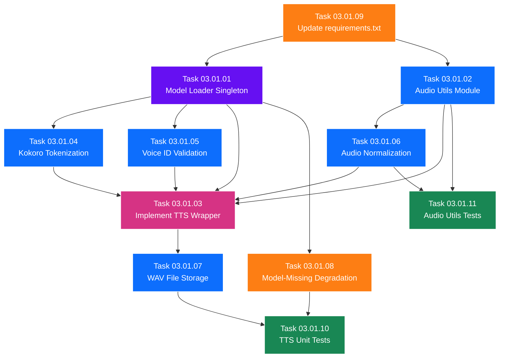

# SubPhase 03.01 — TTS Engine Integration

> **Layer:** 2 — Sub-Phase Overview
> **Phase:** Phase 03 — The Voice
> **Parent Document:** [Phase_03_Overview.md](../Phase_03_Overview.md)
> **Folder:** `SubPhase_03_01_TTS_Engine_Integration/`
> **Status:** NOT STARTED
> **Estimated Tasks:** 11

---

## Table of Contents

1. [Sub-Phase Objective](#1-sub-phase-objective)
2. [Scope](#2-scope)
3. [Technical Context](#3-technical-context)
4. [Task List](#4-task-list)
5. [Task Details](#5-task-details)
6. [Execution Order](#6-execution-order)
7. [Files Created & Modified](#7-files-created--modified)
8. [Validation Criteria](#8-validation-criteria)
9. [Constraints](#9-constraints)
10. [Notes & Gotchas](#10-notes--gotchas)
11. [Cross-References](#11-cross-references)

---

## 1. Sub-Phase Objective

**Implement the low-level TTS engine** — the core audio backbone of StoryFlow. This sub-phase delivers the Kokoro-82M ONNX model loader, the full TTS inference wrapper, audio post-processing utilities, and .wav file storage logic. All work is **entirely backend** — no frontend changes, no API endpoints, no UI.

After this sub-phase is complete:
1. The Kokoro-82M ONNX model can be loaded via a thread-safe singleton.
2. A Python function (`tts_wrapper.generate_audio()`) accepts text and returns a normalized `.wav` file.
3. Audio volume is peak-normalized for consistency across all segments.
4. Audio duration can be calculated from any `.wav` file.
5. The system gracefully handles missing model files, invalid voice IDs, and empty text input.
6. The `requirements.txt` includes all new TTS-related dependencies.

### What This Sub-Phase Delivers

1. **Model Loader (`core_engine/model_loader.py`)** — Thread-safe singleton `KokoroModelLoader` class that lazily loads the `kokoro-v0_19.onnx` model via ONNX Runtime and provides a `get_session()` class method for reuse across all inference calls.

2. **Audio Utilities (`core_engine/audio_utils.py`)** — Standalone utility functions: `normalize_audio()` for peak normalization, `get_audio_duration()` for duration calculation via `soundfile.info()`, and `validate_audio_file()` for checking `.wav` file integrity.

3. **TTS Wrapper (`core_engine/tts_wrapper.py`)** — **Replaces the Phase 01 stub** with a fully functional implementation. Main function: `generate_audio(text, voice_id, speed, output_path) → dict` that runs the full pipeline: model load → tokenize → inference → normalize → save .wav → return metadata.

4. **Kokoro Tokenization Logic** — Model-specific text preprocessing: character-level or phoneme-level tokenization, special token insertion, and input tensor preparation matching the Kokoro-82M model's expected format.

5. **Voice ID Validation & Fallback** — Validation logic that checks whether a given `voice_id` exists in the model's available voice list, with automatic fallback to `"af_bella"` for invalid or unknown IDs.

6. **Audio Normalization Pipeline** — Peak normalization function that scales audio to -1.0 dB, preventing clipping while ensuring consistent volume across all generated segments.

7. **WAV File Storage Logic** — Deterministic output path construction (`/media/projects/{project_id}/audio/{segment_id}.wav`), directory auto-creation, and old-file overwrite handling.

8. **Model-Missing Graceful Degradation** — A verification system that checks for `kokoro-v0_19.onnx` at startup/first-use, logs clear warnings with download instructions if absent, and returns structured error responses instead of crashing.

9. **Updated `requirements.txt`** — Adds `onnxruntime>=1.17.0`, `soundfile>=0.12.1`, `numpy>=1.26.0` to the backend dependencies.

10. **TTS Unit Tests** — Tests for model loading (mocked ONNX session), audio normalization with synthetic data, duration calculation, error handling for missing model, and voice ID fallback.

11. **Audio Utils Tests** — Tests for normalization math, duration calculation with real/mock `.wav` files, and file validation.

### What This Sub-Phase Does NOT Deliver

- API endpoints for triggering audio generation (→ SubPhase 03.02).
- Background task management or threading (→ SubPhase 03.02).
- Task status polling (→ SubPhase 03.02).
- Frontend audio player components (→ SubPhase 03.03).
- "Generate Audio" buttons in the UI (→ SubPhase 03.03).
- Zustand store extensions for audio state (→ SubPhase 03.03).
- Any frontend changes of any kind.
- Database model modifications (models are frozen from Phase 01).

---

## 2. Scope

### 2.1 In Scope

| Area                       | Details                                                                      |
| -------------------------- | ---------------------------------------------------------------------------- |
| Backend — Model Loader     | Thread-safe singleton ONNX session loader with lazy initialization           |
| Backend — TTS Wrapper      | Full inference pipeline: tokenize → infer → normalize → save .wav            |
| Backend — Audio Utilities  | Peak normalization, duration calculation, file validation                     |
| Backend — Tokenization     | Kokoro-specific text-to-token conversion for model input                     |
| Backend — Voice Handling   | Voice ID validation, embedding lookup, fallback to `"af_bella"`              |
| Backend — File Storage     | WAV file storage at deterministic paths, directory creation                   |
| Backend — Error Handling   | Graceful degradation for missing model, invalid inputs, inference errors     |
| Backend — Dependencies     | Update `requirements.txt` with onnxruntime, soundfile, numpy                 |
| Backend — Unit Tests       | Tests for all core engine modules                                            |

### 2.2 Out of Scope

| Area                           | Reason                                                                    |
| ------------------------------ | ------------------------------------------------------------------------- |
| API endpoints                  | No DRF views or URL routing — deferred to SubPhase 03.02                  |
| Background task execution      | No threading, no task manager — deferred to SubPhase 03.02               |
| Database writes                | This sub-phase only produces .wav files; database updates happen in 03.02 |
| Frontend changes (any)         | Entirely backend sub-phase                                                |
| Model training or fine-tuning  | Out of project scope entirely                                             |
| Audio resampling               | Use Kokoro's native sample rate (typically 24000 Hz)                      |
| MP3 encoding                   | WAV format only — no lossy encoding                                      |
| Fish Speech fallback           | Not in MVP scope — Kokoro-82M is the sole TTS engine                     |
| Real-time audio streaming      | Audio is generated → saved → played back later                           |

---

## 3. Technical Context

### 3.1 Prerequisites from Previous Phases

This sub-phase depends on deliverables from Phases 01 and 02:

| Deliverable                                    | Source           | What We Use It For                              |
| ---------------------------------------------- | ---------------- | ----------------------------------------------- |
| Django project structure                       | Phase 01         | All backend work happens within this project    |
| `core_engine/` directory with stub files       | Phase 01         | `tts_wrapper.py` stub gets replaced with real code |
| `core_engine/__init__.py`                      | Phase 01         | Package initialization already exists           |
| `Segment` model with `audio_file`, `audio_duration` fields | Phase 01 | Fields exist but are NOT written in this sub-phase (03.02 writes them) |
| `GlobalSettings` model with `default_voice_id`, `tts_speed` | Phase 01 | Read in 03.02/03.03 — but the wrapper accepts them as parameters |
| `requirements.txt` baseline                    | Phase 01         | We append new packages                          |
| `/media/projects/{id}/audio/` directory pattern | Phase 01-02     | Storage path for generated .wav files            |
| Segments with populated `text_content`         | Phase 02         | Input text for TTS (though this sub-phase only tests with hardcoded strings) |

### 3.2 Kokoro-82M ONNX Model Details

**What is Kokoro-82M?**

Kokoro-82M is a lightweight, high-quality Text-to-Speech model with ~82 million parameters. It is available in ONNX format for fast, cross-platform inference without requiring PyTorch.

| Property             | Value                                                     |
| -------------------- | --------------------------------------------------------- |
| Model File           | `kokoro-v0_19.onnx`                                      |
| Location             | `/storyflow_root/models/kokoro-v0_19.onnx`               |
| Format               | ONNX (Open Neural Network Exchange)                       |
| Runtime              | `onnxruntime` (CPU) or `onnxruntime-gpu` (NVIDIA GPU)    |
| Parameters           | ~82 million                                               |
| Output               | Float32 audio array at native sample rate (~24000 Hz)     |
| Voices Supported     | 7+ voices (American/British, Male/Female)                 |
| Speed Control        | Adjustable via speed factor parameter                     |

**Model file is NOT version-controlled.** The `kokoro-v0_19.onnx` file is too large for Git. It must be manually downloaded and placed in the `/models/` directory before Phase 03 work begins.

### 3.3 Available Kokoro Voice IDs

The following voice IDs are available in Kokoro-82M v0.19:

| Voice ID      | Gender | Accent   | Description                |
| ------------- | ------ | -------- | -------------------------- |
| `af_bella`    | Female | American | Clear, warm tone (DEFAULT) |
| `af_sarah`    | Female | American | Professional, neutral      |
| `af_nicole`   | Female | American | Soft, narrative            |
| `am_adam`     | Male   | American | Deep, authoritative        |
| `am_michael`  | Male   | American | Friendly, conversational   |
| `bf_emma`     | Female | British  | Elegant, BBC-style         |
| `bm_george`   | Male   | British  | Distinguished, formal      |

**Default voice:** `"af_bella"` — used when no voice is specified or when the specified voice ID is invalid.

### 3.4 ONNX Runtime Usage Pattern

```python
import onnxruntime as ort

# Create inference session (expensive — do once)
session = ort.InferenceSession("models/kokoro-v0_19.onnx")

# Inspect model inputs (do this during development)
for inp in session.get_inputs():
    print(f"Name: {inp.name}, Shape: {inp.shape}, Type: {inp.type}")

for out in session.get_outputs():
    print(f"Name: {out.name}, Shape: {out.shape}, Type: {out.type}")

# Run inference
input_dict = {
    "text": tokenized_text,        # Exact name from get_inputs()
    "voice": voice_embedding,       # Exact name from get_inputs()
    "speed": speed_factor           # Exact name from get_inputs()
}
output = session.run(None, input_dict)
audio_array = output[0]  # float32 numpy array
```

> **Important:** The exact input/output tensor names and shapes depend on the specific Kokoro model version. The implementer MUST inspect the model's metadata using `session.get_inputs()` and `session.get_outputs()` to determine the correct tensor names. The above is illustrative.

### 3.5 TTS Inference Pipeline

The complete TTS pipeline for generating audio from text:

```
text_content → Tokenize → Prepare Input Tensors → ONNX Inference → Raw Audio (float32)
    → Peak Normalize → Save as .wav → Calculate Duration → Return Metadata
```

**Step-by-step detail:**

1. **Input:** Text string (potentially multi-sentence, from `Segment.text_content`).
2. **Tokenization:** Convert text to tokens that Kokoro understands:
   - Character-level or phoneme-level tokenization (model-specific).
   - Special token insertion (BOS, EOS, padding as needed).
   - Must match the model's training-time tokenization exactly.
3. **Voice Selection:** Map `voice_id` string to the corresponding voice embedding tensor.
4. **Speed Factor:** Convert speed float (e.g., `1.0`, `0.8`, `1.2`) to the model's expected format.
5. **Inference:** `session.run(None, input_dict)` → returns a 1D float32 array representing audio samples.
6. **Peak Normalization:** Scale audio so the peak absolute value reaches -1.0 dB:
   ```
   target = 10 ** (-1.0 / 20)  ≈ 0.8913
   audio = audio * (target / max(abs(audio)))
   ```
7. **Save:** `soundfile.write(output_path, audio_array, sample_rate)` → `.wav` file on disk.
8. **Duration:** `soundfile.info(output_path).duration` → float in seconds.
9. **Return:** `{ "audio_path": output_path, "duration": duration_in_seconds, "sample_rate": sample_rate }`.

### 3.6 Audio Storage Path Convention

All generated audio files follow a deterministic path pattern:

```
/media/projects/{project_id}/audio/{segment_id}.wav
```

**Examples:**
```
/media/projects/a1b2c3d4/audio/e5f6g7h8.wav
/media/projects/a1b2c3d4/audio/i9j0k1l2.wav
```

**Rules:**
- The `/audio/` subdirectory is created automatically if it doesn't exist.
- If a `.wav` file already exists at the path (from a previous generation), it is **overwritten**.
- File names use the segment's UUID to avoid collisions.
- The path is relative to `MEDIA_ROOT` (the Django setting).

### 3.7 New Python Dependencies

| Package                | Version     | Purpose                                         | Notes                          |
| ---------------------- | ----------- | ----------------------------------------------- | ------------------------------ |
| `onnxruntime`          | ≥1.17.0     | ONNX model inference runtime (CPU)              | Mutually exclusive with `-gpu` |
| `onnxruntime-gpu`      | ≥1.17.0     | (Optional) GPU-accelerated inference            | User's choice, same API        |
| `soundfile`            | ≥0.12.1     | Read/write `.wav` files, get duration info      | Wrapper around `libsndfile`    |
| `numpy`                | ≥1.26.0     | Audio array manipulation, normalization math    | Required by onnxruntime too    |

> **`onnxruntime` vs `onnxruntime-gpu`:** These are mutually exclusive. Install ONE of them. The default is `onnxruntime` (CPU). Users with NVIDIA GPUs can swap to `onnxruntime-gpu` for faster inference. The Python API is identical — the code works unchanged with either package.

---

## 4. Task List

| #  | Task ID   | Task Title                                 | Depends On | Est. Complexity | File(s) Affected                             |
| -- | --------- | ------------------------------------------ | ---------- | --------------- | -------------------------------------------- |
| 1  | 03.01.01  | Create Model Loader Singleton              | —          | High            | `backend/core_engine/model_loader.py`        |
| 2  | 03.01.02  | Create Audio Utils Module                  | —          | Medium          | `backend/core_engine/audio_utils.py`         |
| 3  | 03.01.03  | Implement TTS Wrapper                      | 01, 02     | High            | `backend/core_engine/tts_wrapper.py`         |
| 4  | 03.01.04  | Kokoro Tokenization Logic                  | 01         | High            | `backend/core_engine/tts_wrapper.py`         |
| 5  | 03.01.05  | Voice ID Validation & Fallback             | 01         | Low             | `backend/core_engine/tts_wrapper.py` or `model_loader.py` |
| 6  | 03.01.06  | Audio Normalization Pipeline               | 02         | Medium          | `backend/core_engine/audio_utils.py`         |
| 7  | 03.01.07  | WAV File Storage Logic                     | 03         | Low             | `backend/core_engine/tts_wrapper.py`         |
| 8  | 03.01.08  | Model-Missing Graceful Degradation         | 01         | Medium          | `backend/core_engine/model_loader.py`        |
| 9  | 03.01.09  | Update requirements.txt                    | —          | Low             | `backend/requirements.txt`                   |
| 10 | 03.01.10  | Write TTS Unit Tests                       | 03, 04, 05 | High            | `backend/core_engine/tests/` or `backend/api/tests.py` |
| 11 | 03.01.11  | Write Audio Utils Tests                    | 02, 06     | Medium          | `backend/core_engine/tests/` or `backend/api/tests.py` |

---

## 5. Task Details

### Task 03.01.01 — Create Model Loader Singleton

**Objective:** Implement a thread-safe singleton class that loads the Kokoro-82M ONNX model exactly once and reuses the session for all subsequent inference calls.

**File:** `backend/core_engine/model_loader.py` (NEW — create this file)

**Steps:**
1. Create `backend/core_engine/model_loader.py`.
2. Import `onnxruntime as ort`, `threading`, `os`, `logging`.
3. Define class `KokoroModelLoader`:
   ```python
   class KokoroModelLoader:
       _session = None
       _lock = threading.Lock()
       _model_path = None

       @classmethod
       def get_session(cls):
           if cls._session is None:
               with cls._lock:
                   if cls._session is None:  # Double-checked locking
                       cls._load_model()
           return cls._session

       @classmethod
       def _load_model(cls):
           model_path = cls._resolve_model_path()
           if not os.path.exists(model_path):
               raise FileNotFoundError(
                   f"Kokoro model not found at '{model_path}'. "
                   f"Please download kokoro-v0_19.onnx and place it in the /models/ directory."
               )
           cls._session = ort.InferenceSession(model_path)
           cls._model_path = model_path
           logger.info(f"Kokoro-82M ONNX model loaded from {model_path}")

       @classmethod
       def _resolve_model_path(cls):
           # Resolve path relative to the project root
           # E.g., settings.BASE_DIR.parent / 'models' / 'kokoro-v0_19.onnx'
           pass

       @classmethod
       def is_model_available(cls):
           """Check if the model file exists without loading it."""
           return os.path.exists(cls._resolve_model_path())

       @classmethod
       def get_model_info(cls):
           """Return model input/output metadata (for debugging)."""
           session = cls.get_session()
           return {
               "inputs": [{"name": i.name, "shape": i.shape, "type": i.type} for i in session.get_inputs()],
               "outputs": [{"name": o.name, "shape": o.shape, "type": o.type} for o in session.get_outputs()],
           }
   ```
4. Add module-level logger: `logger = logging.getLogger(__name__)`.
5. Implement `_resolve_model_path()` using Django's `settings.BASE_DIR` to construct the absolute path to `/models/kokoro-v0_19.onnx`.

**Key Details:**
- **Double-checked locking:** The `if cls._session is None` check is performed both outside and inside the lock. The outer check is a fast path (no lock acquisition when session already exists). The inner check prevents a race condition where two threads both pass the outer check before the first acquires the lock.
- **Lazy initialization:** The model is NOT loaded at Django startup. It loads on the first call to `get_session()`. This prevents slow startup and allows the app to run (for non-TTS features) even if the model file is missing.
- **ONNX Runtime providers:** By default, `ort.InferenceSession` will use CPU. If `onnxruntime-gpu` is installed, it will automatically use CUDA. No code change needed — this is handled by the runtime.
- **Memory footprint:** The Kokoro-82M model is relatively small (~82M parameters). Loading into RAM is fine.

---

### Task 03.01.02 — Create Audio Utils Module

**Objective:** Create a standalone utility module for audio post-processing functions.

**File:** `backend/core_engine/audio_utils.py` (NEW — create this file)

**Steps:**
1. Create `backend/core_engine/audio_utils.py`.
2. Import `numpy as np`, `soundfile as sf`, `os`, `logging`.
3. Implement `normalize_audio(audio_array, target_db=-1.0)`:
   ```python
   def normalize_audio(audio_array: np.ndarray, target_db: float = -1.0) -> np.ndarray:
       """
       Peak normalize an audio array to the target dB level.

       Args:
           audio_array: 1D float32 numpy array of audio samples.
           target_db: Target peak level in dB (default -1.0 dB).

       Returns:
           Normalized audio array (same shape, float32).
       """
       peak = np.max(np.abs(audio_array))
       if peak == 0:
           return audio_array  # Silence — nothing to normalize
       target_amplitude = 10 ** (target_db / 20)
       return audio_array * (target_amplitude / peak)
   ```
4. Implement `get_audio_duration(file_path)`:
   ```python
   def get_audio_duration(file_path: str) -> float:
       """
       Get the duration of a .wav file in seconds.

       Args:
           file_path: Path to the .wav file.

       Returns:
           Duration in seconds as a float.

       Raises:
           FileNotFoundError: If file does not exist.
           RuntimeError: If file is not a valid audio file.
       """
       if not os.path.exists(file_path):
           raise FileNotFoundError(f"Audio file not found: {file_path}")
       info = sf.info(file_path)
       return info.duration
   ```
5. Implement `validate_audio_file(file_path)`:
   ```python
   def validate_audio_file(file_path: str) -> bool:
       """
       Check if a .wav file is valid and readable.

       Returns True if valid, False otherwise.
       """
       try:
           info = sf.info(file_path)
           return info.duration > 0 and info.samplerate > 0
       except Exception:
           return False
   ```
6. Implement `save_audio_wav(audio_array, output_path, sample_rate)`:
   ```python
   def save_audio_wav(audio_array: np.ndarray, output_path: str, sample_rate: int) -> str:
       """
       Save a float32 audio array as a .wav file.

       Creates parent directories if they don't exist.

       Args:
           audio_array: 1D float32 numpy array.
           output_path: Destination file path.
           sample_rate: Audio sample rate in Hz.

       Returns:
           The output_path (for chaining).
       """
       os.makedirs(os.path.dirname(output_path), exist_ok=True)
       sf.write(output_path, audio_array, sample_rate)
       return output_path
   ```

**Key Details:**
- All functions are pure utilities — no Django imports, no model access, no side effects beyond file I/O.
- Functions should be testable in isolation with synthetic numpy arrays.
- `normalize_audio` must handle the edge case where `peak == 0` (silence) to avoid division by zero.
- `save_audio_wav` auto-creates the output directory — this is critical because `/media/projects/{id}/audio/` may not exist yet.

---

### Task 03.01.03 — Implement TTS Wrapper

**Objective:** Replace the Phase 01 stub with a fully functional TTS inference wrapper.

**File:** `backend/core_engine/tts_wrapper.py` (REPLACE — overwrite the Phase 01 stub)

**Steps:**
1. Replace the entire content of `core_engine/tts_wrapper.py`.
2. Import dependencies: `model_loader.KokoroModelLoader`, `audio_utils.*`, `numpy`, `soundfile`, `os`, `logging`.
3. Implement the main function:
   ```python
   def generate_audio(
       text: str,
       voice_id: str = "af_bella",
       speed: float = 1.0,
       output_path: str = None,
   ) -> dict:
       """
       Generate a .wav audio file from text using Kokoro-82M.

       Args:
           text: The text to convert to speech.
           voice_id: Kokoro voice ID (e.g., "af_bella").
           speed: Speech speed multiplier (1.0 = normal).
           output_path: Where to save the .wav file.

       Returns:
           {
               "audio_path": str,
               "duration": float,
               "sample_rate": int,
               "success": True
           }
           On error:
           {
               "success": False,
               "error": str
           }
       """
   ```
4. Implementation flow inside `generate_audio()`:
   a. **Validate inputs:**
      - Return error if `text` is empty or whitespace-only.
      - Return error if `output_path` is None.
      - Validate and fallback `voice_id` (see Task 03.01.05).
      - Clamp `speed` to a reasonable range (e.g., 0.5–2.0).
   b. **Get ONNX session:** Call `KokoroModelLoader.get_session()`.
      - Catch `FileNotFoundError` and return structured error.
   c. **Tokenize text:** Convert `text` to the model's expected input format (see Task 03.01.04).
   d. **Prepare input tensors:** Build the `input_dict` with correct tensor names and shapes.
   e. **Run inference:** `session.run(None, input_dict)` → `audio_array`.
   f. **Normalize:** `audio_array = normalize_audio(audio_array)`.
   g. **Save:** `save_audio_wav(audio_array, output_path, sample_rate)`.
   h. **Calculate duration:** `duration = get_audio_duration(output_path)`.
   i. **Return success dict.**
5. Wrap the entire pipeline in a try/except block:
   ```python
   try:
       # ... pipeline steps ...
       return {"audio_path": output_path, "duration": duration, "sample_rate": sample_rate, "success": True}
   except FileNotFoundError as e:
       logger.error(f"Model not found: {e}")
       return {"success": False, "error": str(e)}
   except Exception as e:
       logger.error(f"TTS generation failed: {e}", exc_info=True)
       return {"success": False, "error": f"TTS generation failed: {str(e)}"}
   ```

**Key Details:**
- The wrapper is a **pure function** — it accepts all parameters explicitly and returns a result dict. It does NOT read from the database or update any Django models. That is SubPhase 03.02's responsibility.
- Return a dict (not raise exceptions) so callers can handle errors gracefully.
- The `output_path` must be provided by the caller (the API layer in 03.02 constructs the path).
- Log extensively: log at INFO level for successful generations, at ERROR level for failures.

---

### Task 03.01.04 — Kokoro Tokenization Logic

**Objective:** Implement the text-to-token conversion specific to the Kokoro-82M model.

**File:** `backend/core_engine/tts_wrapper.py` (part of the TTS wrapper, or a separate helper within the same module)

**Steps:**
1. Research the Kokoro-82M tokenization requirements:
   - Inspect the model's input tensors via `session.get_inputs()`.
   - Determine if tokenization is character-level, phoneme-level, or subword-level.
   - Identify any special tokens (BOS, EOS, PAD) and their IDs.
2. Implement a `tokenize_text(text: str) -> np.ndarray` function:
   - Clean the input text (strip whitespace, handle special characters).
   - Convert to the model's token format.
   - Add special tokens if required.
   - Pad or truncate to the expected input length (if fixed-length).
   - Return as a numpy array with the correct dtype and shape.
3. Handle edge cases:
   - Very long text: Split into chunks if the model has a maximum input length.
   - Special characters: Remove or replace characters the model can't handle.
   - Numbers: Convert to words if needed (e.g., "42" → "forty-two").
   - Punctuation: Preserve or strip based on model requirements.

**Key Details:**
- The exact tokenization depends on the specific Kokoro-82M version. The implementer must inspect the model and potentially reference Kokoro's official documentation or code.
- If the Kokoro model includes a built-in tokenizer (some ONNX models do), use it directly.
- If text is too long for a single inference pass, implement text chunking: split at sentence boundaries, generate audio for each chunk, then concatenate the audio arrays before normalization.
- This is one of the most model-specific tasks — it requires hands-on experimentation with the actual model file.

---

### Task 03.01.05 — Voice ID Validation & Fallback

**Objective:** Ensure invalid voice IDs are handled gracefully with automatic fallback.

**File:** `backend/core_engine/tts_wrapper.py` or `backend/core_engine/model_loader.py`

**Steps:**
1. Define the list of valid voice IDs:
   ```python
   VALID_VOICE_IDS = [
       "af_bella", "af_sarah", "af_nicole",
       "am_adam", "am_michael",
       "bf_emma", "bm_george",
   ]
   DEFAULT_VOICE_ID = "af_bella"
   ```
2. Implement `validate_voice_id(voice_id: str) -> str`:
   ```python
   def validate_voice_id(voice_id: str) -> str:
       """
       Validate a voice ID. Returns the voice ID if valid,
       or the default voice ID if invalid.
       """
       if voice_id in VALID_VOICE_IDS:
           return voice_id
       logger.warning(
           f"Invalid voice ID '{voice_id}', falling back to '{DEFAULT_VOICE_ID}'"
       )
       return DEFAULT_VOICE_ID
   ```
3. Call `validate_voice_id()` at the start of `generate_audio()` before preparing input tensors.
4. Implement `get_voice_embedding(voice_id: str) -> np.ndarray`:
   - Load or compute the voice embedding for the given voice ID.
   - The exact mechanism depends on the model: may be a lookup table, a separate file, or embedded in the model itself.

**Key Details:**
- The voice ID list may need updating if the Kokoro model version changes.
- The validation is a soft validation — it logs a warning but does NOT raise an error. This ensures TTS never fails just because of a bad voice ID.
- The `GlobalSettings.default_voice_id` field has a default of `"af_bella"`, but a user or migration could set it to an invalid value — the fallback handles that.

---

### Task 03.01.06 — Audio Normalization Pipeline

**Objective:** Implement and test the peak normalization function that ensures consistent audio volume.

**File:** `backend/core_engine/audio_utils.py` (already created in Task 02 — this task focuses on the math and edge cases)

**Steps:**
1. The `normalize_audio()` function was created in Task 02. This task focuses on:
   - Verifying the math is correct.
   - Handling edge cases.
   - Testing with various input shapes.
2. Edge cases to handle:
   - **All zeros (silence):** Return unchanged (already handled with `peak == 0` check).
   - **Already normalized:** If peak is already at target, return unchanged (within floating-point tolerance).
   - **Very quiet audio:** Works correctly — scales up to target level.
   - **Clipping audio (values > 1.0):** Should be brought down to target level.
   - **Mono vs. multi-channel:** Kokoro outputs mono. Verify the function works with 1D arrays.
   - **Data type:** Input may be float32 or float64. Ensure output matches input dtype.
3. Verify the normalization formula:
   ```
   target_amplitude = 10 ** (-1.0 / 20) ≈ 0.8913
   normalized = audio * (target_amplitude / peak)
   ```
   - After normalization, `max(abs(normalized))` should equal `target_amplitude`.

**Key Details:**
- Peak normalization (not RMS normalization) is the chosen approach — it's simpler, deterministic, and prevents clipping.
- The target of -1.0 dB provides a small headroom below 0 dBFS (full scale), preventing any chance of clipping in the `.wav` output.
- The function must NOT modify the input array in-place — return a new array.

---

### Task 03.01.07 — WAV File Storage Logic

**Objective:** Implement the deterministic file path construction and directory creation for `.wav` file storage.

**File:** `backend/core_engine/tts_wrapper.py` (helper function within the wrapper module)

**Steps:**
1. Implement `construct_audio_path(project_id, segment_id) -> str`:
   ```python
   import os
   from django.conf import settings

   def construct_audio_path(project_id: str, segment_id: str) -> str:
       """
       Construct the absolute file path for a segment's audio file.

       Returns: '/path/to/media/projects/{project_id}/audio/{segment_id}.wav'
       """
       return os.path.join(
           settings.MEDIA_ROOT,
           'projects',
           str(project_id),
           'audio',
           f'{segment_id}.wav'
       )
   ```
2. Implement `construct_audio_url(project_id, segment_id) -> str`:
   ```python
   def construct_audio_url(project_id: str, segment_id: str) -> str:
       """
       Construct the URL path (relative to MEDIA_URL) for a segment's audio file.

       Returns: '/media/projects/{project_id}/audio/{segment_id}.wav'
       """
       return f'{settings.MEDIA_URL}projects/{project_id}/audio/{segment_id}.wav'
   ```
3. Ensure `save_audio_wav()` (from Task 02) handles the directory creation:
   - `os.makedirs(os.path.dirname(output_path), exist_ok=True)` — already implemented in audio_utils.
4. Handle overwrite scenario:
   - If the `.wav` file already exists (re-generation), simply overwrite it. No special cleanup needed because the filename is deterministic (same segment = same file).

**Key Details:**
- The path is deterministic: `segment_id` uniquely identifies the file. There are NO random suffixes or timestamps.
- This makes re-generation simple: the old file is overwritten.
- The `construct_audio_path` function is used by SubPhase 03.02 when calling `generate_audio()`. It needs to exist here so the API layer doesn't need to know the path convention.
- The `construct_audio_url` function is used by the API response to return the URL to the frontend.

---

### Task 03.01.08 — Model-Missing Graceful Degradation

**Objective:** Ensure StoryFlow works for non-TTS features even when the Kokoro model file is missing.

**File:** `backend/core_engine/model_loader.py` (enhance existing loader)

**Steps:**
1. In `KokoroModelLoader._load_model()`, raise a descriptive `FileNotFoundError`:
   ```python
   raise FileNotFoundError(
       "Kokoro-82M ONNX model not found.\n"
       "Expected location: {model_path}\n\n"
       "To set up TTS:\n"
       "1. Download 'kokoro-v0_19.onnx' from the official Kokoro release.\n"
       "2. Place it in: {models_dir}/\n"
       "3. Restart the server.\n\n"
       "StoryFlow will work normally for all other features. "
       "TTS generation will be unavailable until the model is installed."
   )
   ```
2. In `tts_wrapper.generate_audio()`, catch `FileNotFoundError` and return:
   ```python
   {"success": False, "error": "TTS model not available. Please install kokoro-v0_19.onnx."}
   ```
3. Implement `is_model_available()` class method on `KokoroModelLoader`:
   - Returns `True`/`False` based on file existence.
   - Does NOT load the model — just checks the file path.
   - This can be called at Django startup to log a warning.
4. Optionally, add a Django startup check in `apps.py` or `__init__.py`:
   ```python
   # In core_engine/apps.py or __init__.py
   from .model_loader import KokoroModelLoader
   if not KokoroModelLoader.is_model_available():
       logger.warning(
           "⚠️ Kokoro-82M model not found. TTS features will be unavailable. "
           "See docs for installation instructions."
       )
   ```

**Key Details:**
- The application must NOT crash at startup if the model is missing. ALL non-TTS features (import, CRUD, image upload, timeline UI) must work perfectly.
- The error message must be actionable — tell the user exactly what to do.
- The `is_model_available()` check is lightweight (just `os.path.exists`) — safe to call at any time.
- SubPhase 03.02's API endpoints will use `generate_audio()` which already returns error dicts — the API layer converts these to appropriate HTTP error responses (503 Service Unavailable or similar).

---

### Task 03.01.09 — Update requirements.txt

**Objective:** Add the new TTS-related Python packages to the backend dependencies file.

**File:** `backend/requirements.txt` (MODIFY — append new packages)

**Steps:**
1. Open `backend/requirements.txt`.
2. Append the following (after the existing Phase 01 packages):
   ```
   # Phase 03 — TTS Dependencies
   onnxruntime>=1.17.0
   soundfile>=0.12.1
   numpy>=1.26.0
   ```
3. Run `pip install -r requirements.txt` to install the new packages.
4. Verify installation:
   ```python
   python -c "import onnxruntime; print(onnxruntime.__version__)"
   python -c "import soundfile; print(soundfile.__version__)"
   python -c "import numpy; print(numpy.__version__)"
   ```

**Key Details:**
- **Do NOT pin exact versions** — use `>=` minimum versions for flexibility.
- `numpy` may already be installed as a transitive dependency. The explicit requirement ensures a minimum version.
- If the user has an NVIDIA GPU and wants GPU inference, they should:
  ```bash
  pip uninstall onnxruntime
  pip install onnxruntime-gpu>=1.17.0
  ```
  The code works identically with either package.
- `soundfile` depends on `libsndfile` (C library). On most systems, `pip install soundfile` handles this automatically. On some Linux systems, it may need `apt install libsndfile1`.

---

### Task 03.01.10 — Write TTS Unit Tests

**Objective:** Write comprehensive unit tests for the model loader, TTS wrapper, and voice validation.

**File:** `backend/core_engine/tests/test_tts.py` (NEW — create test file) or append to `backend/api/tests.py`

**Steps:**
1. **Model Loader Tests:**
   - Test `KokoroModelLoader.get_session()` returns an ONNX InferenceSession (mock the session).
   - Test singleton behavior: two calls to `get_session()` return the same object.
   - Test `is_model_available()` returns `True` when file exists, `False` when missing.
   - Test `get_session()` raises `FileNotFoundError` when model file is missing.
   - Test thread safety: concurrent calls to `get_session()` don't double-load.

2. **TTS Wrapper Tests:**
   - Test `generate_audio()` returns success dict with valid output path and duration.
   - Test `generate_audio()` with empty text returns error dict.
   - Test `generate_audio()` with missing model returns error dict (not a crash).
   - Test `generate_audio()` produces a valid `.wav` file on disk.
   - Test `generate_audio()` overwrites existing file on re-generation.
   - Test speed clamping: values outside 0.5–2.0 are clamped.

3. **Voice ID Tests:**
   - Test valid voice IDs pass through unchanged.
   - Test invalid voice ID falls back to `"af_bella"`.
   - Test empty string falls back to `"af_bella"`.
   - Test None value is handled gracefully.

4. **Integration Test (requires model file):**
   - Mark with `@pytest.mark.skipif(not KokoroModelLoader.is_model_available(), reason="Model not available")`.
   - Test end-to-end: text → `.wav` file → valid audio → correct duration.

**Key Details:**
- Mock `onnxruntime.InferenceSession` for unit tests — don't require the actual model file.
- Use `tempfile.mkdtemp()` for test output paths — clean up after each test.
- Use `@override_settings(MEDIA_ROOT=tempdir)` to isolate test file I/O.
- The integration test is optional — it only runs if the model file is present. CI/CD can skip it.

---

### Task 03.01.11 — Write Audio Utils Tests

**Objective:** Write unit tests for all audio utility functions.

**File:** `backend/core_engine/tests/test_audio_utils.py` (NEW) or same file as Task 10

**Steps:**
1. **Normalization Tests:**
   - Test with a known input: `[0.5, -0.5]` normalized to -1.0 dB should have peak ≈ 0.8913.
   - Test with silence (all zeros): output should be all zeros.
   - Test with already-normalized audio: output should be approximately unchanged.
   - Test with very quiet audio: output should be scaled up.
   - Test with clipping audio (values > 1.0): output should be scaled down.
   - Test data type preservation: float32 input → float32 output.
   - Test that the function does NOT modify the input array (returns a new array).

2. **Duration Tests:**
   - Create a synthetic `.wav` file with `soundfile.write()` (known sample rate and length).
   - Test `get_audio_duration()` returns the expected duration (within floating-point tolerance).
   - Test with nonexistent file: raises `FileNotFoundError`.

3. **Validation Tests:**
   - Test `validate_audio_file()` with a valid `.wav` file: returns `True`.
   - Test with a non-existent file: returns `False`.
   - Test with a corrupt/non-audio file: returns `False`.

4. **Save Tests:**
   - Test `save_audio_wav()` creates the file at the specified path.
   - Test directory auto-creation: nested path that doesn't exist → directories created.
   - Test overwrite behavior: save twice to same path → second write succeeds.

**Key Details:**
- Use `numpy` to create synthetic audio arrays for testing: `np.random.randn(24000).astype(np.float32)` (1 second at 24kHz).
- Use `tempfile` for all file I/O to avoid polluting the workspace.
- These tests should run fast and require NO external dependencies (no model file needed).

---

## 6. Execution Order

### 6.1 Dependency Chain

```
Task 09 (Update requirements.txt — must be first to install dependencies)

Task 01 (Model Loader Singleton — foundation for all TTS)
Task 02 (Audio Utils — independent of model loader)
    ├── Task 04 (Kokoro Tokenization — needs model loader for inspection)
    ├── Task 05 (Voice ID Validation — needs model loader)
    ├── Task 06 (Audio Normalization Pipeline — extends audio utils)
    │
    └── Task 03 (TTS Wrapper — assembles 01, 02, 04, 05, 06)
        └── Task 07 (WAV File Storage — completes the wrapper)

Task 08 (Model-Missing Graceful Degradation — enhances model loader)

Task 10 (TTS Unit Tests — tests 01, 03, 04, 05)
Task 11 (Audio Utils Tests — tests 02, 06)
```

### 6.2 Recommended Sequence

| Order | Task(s)     | Rationale                                                         |
| ----- | ----------- | ----------------------------------------------------------------- |
| 1     | 09          | Install dependencies first — everything else needs them           |
| 2     | 01          | Build model loader — all TTS work depends on it                   |
| 3     | 02          | Build audio utils — independent, provides normalization and save  |
| 4     | 04          | Implement tokenization — must inspect model first                 |
| 5     | 05          | Implement voice validation — quick task once model is understood  |
| 6     | 06          | Finalize normalization pipeline — extends audio utils             |
| 7     | 03          | Implement TTS wrapper — assembles all preceding work              |
| 8     | 07          | Add file storage logic — completes the wrapper                    |
| 9     | 08          | Add graceful degradation — enhances error handling                |
| 10    | 10, 11      | Write all tests — tests everything                                |

### 6.3 Execution Flow (Mermaid)



> **Legend:**
> 🟠 Orange = Setup / error handling tasks
> 🟣 Purple = Core infrastructure (model loader)
> 🔵 Blue = Individual feature tasks
> 🩷 Pink = Central integration task (TTS wrapper)
> 🟢 Green = Test tasks

### 6.4 Parallel Work Opportunities

Several tasks can be developed in parallel since they have no mutual dependencies:

- **T01 and T02** — Model loader and audio utils are independent of each other.
- **T04 and T05** — Tokenization and voice validation both depend on T01 but not on each other.
- **T10 and T11** — Both test suites can be written in parallel.

For a single developer working sequentially:
**T09 → T01 → T02 → T04 → T05 → T06 → T03 → T07 → T08 → T10 → T11**

---

## 7. Files Created & Modified

### 7.1 New Files

| File Path                              | Created In | Purpose                                |
| -------------------------------------- | ---------- | -------------------------------------- |
| `backend/core_engine/model_loader.py`  | Task 01    | Thread-safe ONNX model singleton       |
| `backend/core_engine/audio_utils.py`   | Task 02    | Normalization, duration, validation, save |
| `backend/core_engine/tests/__init__.py`| Task 10    | Test package init (if using a tests dir) |
| `backend/core_engine/tests/test_tts.py`| Task 10    | Model loader and TTS wrapper tests     |
| `backend/core_engine/tests/test_audio_utils.py` | Task 11 | Audio utility function tests    |

### 7.2 Modified / Replaced Files

| File Path                              | Modified In | Changes                                      |
| -------------------------------------- | ----------- | -------------------------------------------- |
| `backend/core_engine/tts_wrapper.py`   | Task 03     | **REPLACED** — Phase 01 stub → full implementation |
| `backend/requirements.txt`             | Task 09     | Appended: onnxruntime, soundfile, numpy       |

### 7.3 Unchanged Files (Referenced but NOT Modified)

| File Path                              | Why Referenced                               |
| -------------------------------------- | -------------------------------------------- |
| `backend/core_engine/__init__.py`      | Package already exists from Phase 01         |
| `backend/core_engine/video_renderer.py`| Stub — remains unchanged (→ Phase 04)        |
| `backend/core_engine/ken_burns.py`     | Stub — remains unchanged (→ Phase 04)        |
| `backend/api/models.py`               | Segment/GlobalSettings models read but NOT modified |
| `backend/api/views.py`                | NOT modified in this sub-phase (→ 03.02)     |
| `backend/api/urls.py`                 | NOT modified in this sub-phase (→ 03.02)     |

### 7.4 File Relationship Map

```
core_engine/
├── __init__.py                     (unchanged)
├── model_loader.py                 ← NEW (Task 01, 05, 08)
│   └── Uses: onnxruntime, threading, os
│   └── Provides: KokoroModelLoader.get_session()
│
├── audio_utils.py                  ← NEW (Task 02, 06)
│   └── Uses: numpy, soundfile, os
│   └── Provides: normalize_audio(), get_audio_duration(), save_audio_wav(), validate_audio_file()
│
├── tts_wrapper.py                  ← REPLACED (Task 03, 04, 05, 07)
│   └── Uses: model_loader, audio_utils, numpy
│   └── Provides: generate_audio(), construct_audio_path(), construct_audio_url()
│
├── video_renderer.py               (stub — Phase 04)
├── ken_burns.py                    (stub — Phase 04)
│
└── tests/
    ├── __init__.py                 ← NEW (Task 10)
    ├── test_tts.py                 ← NEW (Task 10)
    └── test_audio_utils.py         ← NEW (Task 11)
```

---

## 8. Validation Criteria

### 8.1 Model Loader

- [ ] `KokoroModelLoader.get_session()` returns an ONNX `InferenceSession` object.
- [ ] Subsequent calls to `get_session()` return the same session object (singleton verified).
- [ ] `is_model_available()` returns `True` when `kokoro-v0_19.onnx` exists.
- [ ] `is_model_available()` returns `False` when the model file is missing.
- [ ] `get_session()` raises `FileNotFoundError` with actionable message when model is missing.
- [ ] Thread safety: two concurrent calls do not double-load the model or crash.
- [ ] `get_model_info()` returns correct input/output tensor metadata.

### 8.2 TTS Wrapper

- [ ] `generate_audio(text, voice_id, speed, output_path)` returns a success dict.
- [ ] The success dict contains `audio_path`, `duration`, `sample_rate`, and `success: True`.
- [ ] The generated `.wav` file exists at the specified `output_path`.
- [ ] The generated `.wav` file is playable (valid audio headers, non-zero duration).
- [ ] Empty text returns `{"success": False, "error": "..."}` (no crash).
- [ ] Missing model returns `{"success": False, "error": "..."}` (no crash).
- [ ] Re-generation overwrites the existing `.wav` file cleanly.

### 8.3 Audio Utilities

- [ ] `normalize_audio()` scales peak to -1.0 dB (≈ 0.8913 amplitude).
- [ ] `normalize_audio()` handles silence (all-zero array) without error.
- [ ] `normalize_audio()` returns a new array (does not modify input).
- [ ] `get_audio_duration()` returns the correct duration for a known `.wav` file.
- [ ] `get_audio_duration()` raises `FileNotFoundError` for missing files.
- [ ] `validate_audio_file()` returns `True` for valid `.wav` files.
- [ ] `validate_audio_file()` returns `False` for missing or corrupt files.
- [ ] `save_audio_wav()` creates the file at the specified path.
- [ ] `save_audio_wav()` creates parent directories if they don't exist.

### 8.4 Voice Handling

- [ ] Valid voice IDs (`af_bella`, `am_adam`, etc.) pass through unchanged.
- [ ] Invalid voice IDs fall back to `"af_bella"` with a logged warning.
- [ ] Empty string voice ID falls back to `"af_bella"`.
- [ ] The TTS output uses the correct voice (audibly different for different voice IDs).

### 8.5 File Storage

- [ ] Audio files are saved at `/media/projects/{project_id}/audio/{segment_id}.wav`.
- [ ] The `/audio/` subdirectory is auto-created if it doesn't exist.
- [ ] `construct_audio_path()` returns the correct absolute path.
- [ ] `construct_audio_url()` returns the correct URL-relative path.

### 8.6 Graceful Degradation

- [ ] Django starts successfully when `kokoro-v0_19.onnx` is missing.
- [ ] A warning is logged at startup if the model is missing.
- [ ] Non-TTS features (CRUD, import, timeline UI) work perfectly without the model.
- [ ] `generate_audio()` returns an error dict (not a crash) when model is missing.

### 8.7 Dependencies

- [ ] `requirements.txt` includes `onnxruntime>=1.17.0`, `soundfile>=0.12.1`, `numpy>=1.26.0`.
- [ ] `pip install -r requirements.txt` succeeds.
- [ ] All three packages are importable: `import onnxruntime`, `import soundfile`, `import numpy`.

### 8.8 Tests

- [ ] All unit tests pass: `python manage.py test core_engine` (or equivalent).
- [ ] Model loader singleton test passes.
- [ ] Audio normalization tests pass (multiple edge cases).
- [ ] Duration calculation test passes.
- [ ] Voice ID fallback test passes.
- [ ] Model-missing error handling test passes.
- [ ] Integration test (with model file) passes when model is available, skips when not.

---

## 9. Constraints

| #  | Constraint                                                         | Source                                                        |
| -- | ------------------------------------------------------------------ | ------------------------------------------------------------- |
| 1  | Do NOT create API endpoints or URL routing                         | Deferred to SubPhase 03.02 — this sub-phase is pure engine   |
| 2  | Do NOT implement background task management                        | Deferred to SubPhase 03.02 — ThreadPoolExecutor lives there  |
| 3  | Do NOT write to the database (Segment model updates)               | Deferred to SubPhase 03.02 — the wrapper returns dicts only  |
| 4  | Do NOT make any frontend changes                                   | Entirely backend sub-phase                                   |
| 5  | Do NOT modify database models                                      | Models are frozen from Phase 01                              |
| 6  | Do NOT implement video rendering or MoviePy logic                  | Deferred to Phase 04                                         |
| 7  | Do NOT resample audio output                                       | Use Kokoro's native sample rate (~24000 Hz)                  |
| 8  | Do NOT encode to MP3 or any lossy format                           | WAV format only — lossless, browser-native playback          |
| 9  | Do NOT use any cloud-based TTS API                                 | Permanent constraint — local-only, privacy-first             |
| 10 | Do NOT implement Fish Speech or any alternative TTS engine         | Kokoro-82M is the sole TTS engine in MVP scope               |
| 11 | Do NOT stream audio in real-time                                   | Generate → save → play back (not streaming)                  |
| 12 | ONNX model must load ONCE (singleton) — no repeated loading        | Memory and performance constraint                            |
| 13 | Thread pool / concurrency is NOT in scope for this sub-phase       | Use simple synchronous calls; threading comes in 03.02       |

---

## 10. Notes & Gotchas

### 10.1 ONNX Runtime Provider Selection

ONNX Runtime automatically selects the best available execution provider. When using `onnxruntime` (CPU), it uses the CPU provider. When using `onnxruntime-gpu`, it uses CUDA if available, falling back to CPU.

You can explicitly set providers:
```python
# CPU only
session = ort.InferenceSession("model.onnx", providers=['CPUExecutionProvider'])

# GPU with CPU fallback
session = ort.InferenceSession("model.onnx", providers=['CUDAExecutionProvider', 'CPUExecutionProvider'])
```

For StoryFlow, let ONNX Runtime choose automatically (don't specify `providers`). This ensures maximum compatibility.

### 10.2 Kokoro Model Input/Output Discovery

The exact tensor names, shapes, and types MUST be discovered at runtime using the actual model file. Do NOT hardcode assumptions:

```python
session = ort.InferenceSession("models/kokoro-v0_19.onnx")

# Print all inputs
for inp in session.get_inputs():
    print(f"Input: name={inp.name}, shape={inp.shape}, type={inp.type}")

# Print all outputs
for out in session.get_outputs():
    print(f"Output: name={out.name}, shape={out.shape}, type={out.type}")
```

Run this once during development and adapt the code accordingly. The input names, shapes, and preprocessing requirements are model-version-specific.

### 10.3 Text Chunking for Long Segments

If the Kokoro model has a maximum input length (common for TTS models), long segments must be split:

1. Split at sentence boundaries (periods, exclamation marks, question marks).
2. Generate audio for each chunk separately.
3. Concatenate audio arrays with a small silence gap (e.g., 100ms of zeros) between chunks.
4. Normalize the concatenated audio as a whole.

```python
import re

def split_text_into_chunks(text: str, max_length: int) -> list[str]:
    sentences = re.split(r'(?<=[.!?])\s+', text)
    chunks = []
    current_chunk = ""
    for sentence in sentences:
        if len(current_chunk) + len(sentence) > max_length:
            if current_chunk:
                chunks.append(current_chunk.strip())
            current_chunk = sentence
        else:
            current_chunk += " " + sentence
    if current_chunk:
        chunks.append(current_chunk.strip())
    return chunks
```

### 10.4 NumPy Array Dtype Handling

ONNX Runtime outputs `float32` arrays. Ensure consistent dtype throughout:

```python
# ONNX output is already float32
audio = output[0].astype(np.float32)  # Explicit cast for safety

# soundfile.write() accepts float32 directly
sf.write(path, audio, sample_rate, subtype='FLOAT')
```

If the dtype is `float64`, soundfile may silently convert, but it's better to be explicit.

### 10.5 soundfile vs. wave Module

Python's built-in `wave` module can read/write `.wav` files, but it's lower-level and doesn't support floating-point formats natively. `soundfile` is the better choice because:
- Direct float32 support.
- Simple `info()` function for duration.
- Handles more WAV subtypes.
- Simpler API.

Do NOT use the `wave` module.

### 10.6 Memory Considerations for Audio Arrays

A 30-second audio clip at 24000 Hz:
- `30 * 24000 = 720,000 samples`
- `720,000 * 4 bytes (float32) ≈ 2.88 MB`

This is trivial for modern systems. Even a project with 50 segments would only use ~150 MB of audio data on disk. No special memory management is needed for this sub-phase.

### 10.7 Error Return Pattern

The TTS wrapper uses a **result dict pattern** instead of exceptions:

```python
# Success
{"success": True, "audio_path": "/path/to/file.wav", "duration": 5.23, "sample_rate": 24000}

# Failure
{"success": False, "error": "TTS model not available. Please install kokoro-v0_19.onnx."}
```

This is a deliberate design choice:
- **Callers don't need try/except** — they check `result["success"]`.
- **Error messages are structured** — easy to pass to the API response.
- **The wrapper never crashes** — it always returns a dict.
- **Logging happens inside the wrapper** — callers don't need to log separately.

The API layer (SubPhase 03.02) maps these result dicts to HTTP responses: success → 200/202, failure → 500/503.

### 10.8 Testing Without the Model File

Most unit tests should NOT require the actual `kokoro-v0_19.onnx` model file. Use mocks:

```python
from unittest.mock import patch, MagicMock

@patch('core_engine.model_loader.ort.InferenceSession')
def test_model_loader(mock_session_class):
    mock_session = MagicMock()
    mock_session_class.return_value = mock_session

    session = KokoroModelLoader.get_session()
    assert session is mock_session
    mock_session_class.assert_called_once()
```

For the TTS wrapper, mock the entire model loader:

```python
@patch('core_engine.tts_wrapper.KokoroModelLoader')
def test_generate_audio(mock_loader):
    mock_session = MagicMock()
    mock_session.run.return_value = [np.random.randn(24000).astype(np.float32)]
    mock_loader.get_session.return_value = mock_session

    result = generate_audio("Hello world", output_path="/tmp/test.wav")
    assert result["success"] is True
```

Only the integration test (marked `skipif`) uses the real model file.

---

## 11. Cross-References

### 11.1 Parent Documents

| Document                              | Relationship                                                         |
| ------------------------------------- | -------------------------------------------------------------------- |
| [Phase_03_Overview.md](../Phase_03_Overview.md) | Direct parent (Layer 1). Defines this sub-phase in §4.1. Kokoro model details in §3.2-3.3. TTS pipeline in §8.1-8.2. |
| [00_Project_Overview.md](../../00_Project_Overview.md) | Master document (Layer 0). TTS Generation Module in §5.3. Technology stack in §2.2. Dev constraints in §14. |

### 11.2 Previous Sub-Phase

| Document                              | Relationship                                                         |
| ------------------------------------- | -------------------------------------------------------------------- |
| [SubPhase_02_03_Overview.md](../../Phase_02_The_Logic/SubPhase_02_03_Image_Upload_Timeline_Editor/SubPhase_02_03_Overview.md) | Last sub-phase of Phase 02. Its deliverables (Timeline Editor, SegmentCard with audio placeholder, Zustand store) are the frontend baseline that Phase 03 extends (in SubPhases 03.02 and 03.03). |

### 11.3 Next Sub-Phase

| Document                              | Relationship                                                         |
| ------------------------------------- | -------------------------------------------------------------------- |
| [SubPhase_03_02_Overview.md](../SubPhase_03_02_Audio_Generation_API/SubPhase_03_02_Overview.md) | Next sub-phase. Builds the API layer on top of this sub-phase's TTS engine. Uses `tts_wrapper.generate_audio()` in background threads, creates DRF endpoints, implements task polling. |

### 11.4 Full Dependency Chain

This sub-phase depends on all previously completed work and is the foundation for subsequent Phase 03 work:

```
SubPhase 01.01 (Project Setup)
    → SubPhase 01.02 (Database Models)
        → SubPhase 01.03 (Dashboard UI)
            → SubPhase 02.01 (Import & Parse Engine)
                → SubPhase 02.02 (Segment Management API)
                    → SubPhase 02.03 (Timeline Editor UI)
                        → SubPhase 03.01 (THIS SUB-PHASE — TTS Engine)
                            → SubPhase 03.02 (Audio Generation API)
                                → SubPhase 03.03 (Audio Playback UI)
```

### 11.5 Forward References

After this sub-phase, the TTS engine is ready for API integration:

| What This Sub-Phase Creates               | What SubPhase 03.02 Uses It For                              |
| ----------------------------------------- | ------------------------------------------------------------ |
| `KokoroModelLoader.get_session()`         | Called from background threads to load model for inference    |
| `tts_wrapper.generate_audio()`            | Called by the API endpoint handlers to generate audio         |
| `construct_audio_path()`                  | Used to determine where to save generated audio              |
| `construct_audio_url()`                   | Used in API responses to return the audio URL                |
| `audio_utils.get_audio_duration()`        | Used to update `Segment.audio_duration` after generation     |
| Result dict pattern (`success`/`error`)   | Mapped to HTTP responses (202 success, 503 error)            |
| `is_model_available()`                    | Called before starting generation to return early errors     |

### 11.6 Child Documents (Layer 3)

| Task Document                                              | Task ID  | Title                               |
| ---------------------------------------------------------- | -------- | ----------------------------------- |
| `Task_03_01_01_Create_Model_Loader_Singleton.md`           | 03.01.01 | Create Model Loader Singleton       |
| `Task_03_01_02_Create_Audio_Utils_Module.md`               | 03.01.02 | Create Audio Utils Module           |
| `Task_03_01_03_Implement_TTS_Wrapper.md`                   | 03.01.03 | Implement TTS Wrapper               |
| `Task_03_01_04_Kokoro_Tokenization_Logic.md`               | 03.01.04 | Kokoro Tokenization Logic           |
| `Task_03_01_05_Voice_ID_Validation_Fallback.md`            | 03.01.05 | Voice ID Validation & Fallback      |
| `Task_03_01_06_Audio_Normalization_Pipeline.md`            | 03.01.06 | Audio Normalization Pipeline        |
| `Task_03_01_07_WAV_File_Storage_Logic.md`                  | 03.01.07 | WAV File Storage Logic              |
| `Task_03_01_08_Model_Missing_Graceful_Degrade.md`          | 03.01.08 | Model-Missing Graceful Degradation  |
| `Task_03_01_09_Update_Requirements_Txt.md`                 | 03.01.09 | Update requirements.txt             |
| `Task_03_01_10_Write_TTS_Unit_Tests.md`                    | 03.01.10 | Write TTS Unit Tests                |
| `Task_03_01_11_Write_Audio_Utils_Tests.md`                 | 03.01.11 | Write Audio Utils Tests             |

---

> **End of SubPhase 03.01 Overview — Layer 2 Document**
>
> **Parent:** [Phase_03_Overview.md](../Phase_03_Overview.md) (Layer 1)
> **Layer 0:** [00_Project_Overview.md](../../00_Project_Overview.md)
> **Previous Sub-Phase:** [SubPhase_02_03_Overview.md](../../Phase_02_The_Logic/SubPhase_02_03_Image_Upload_Timeline_Editor/SubPhase_02_03_Overview.md) (Layer 2 — Phase 02)
> **Next Sub-Phase:** [SubPhase_03_02_Overview.md](../SubPhase_03_02_Audio_Generation_API/SubPhase_03_02_Overview.md) (Layer 2)
