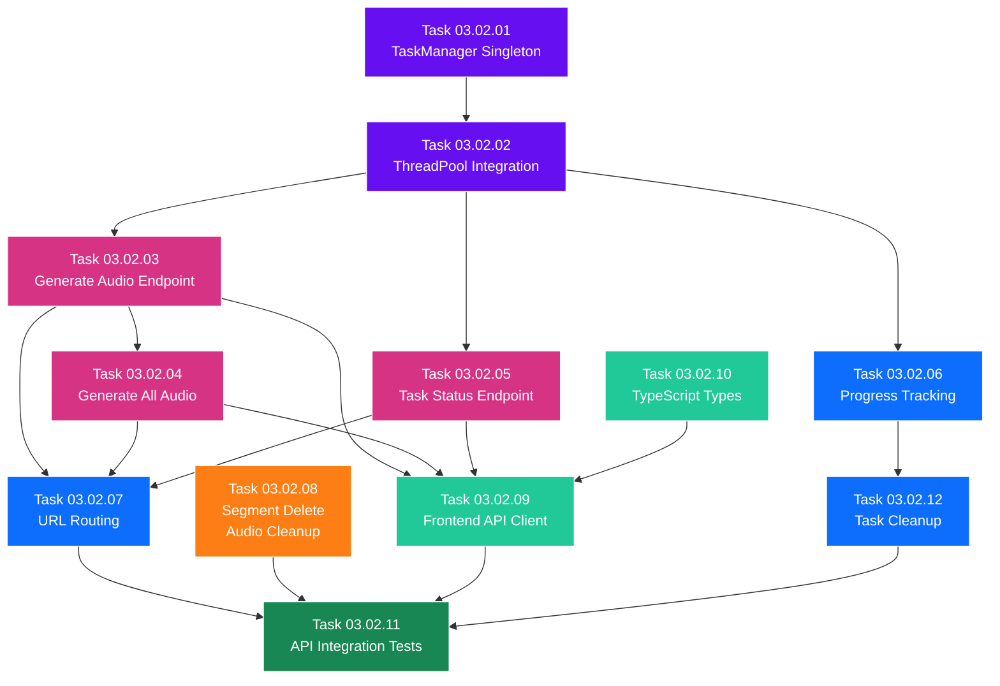

# SubPhase 03.02 — Audio Generation API

> **Layer:** 2 — Sub-Phase Overview
> **Phase:** Phase 03 — The Voice
> **Parent Document:** [Phase_03_Overview.md](../Phase_03_Overview.md)
> **Folder:** `SubPhase_03_02_Audio_Generation_API/`
> **Status:** NOT STARTED
> **Estimated Tasks:** 12

---

## Table of Contents

1. [Sub-Phase Objective](#1-sub-phase-objective)
2. [Scope](#2-scope)
3. [Technical Context](#3-technical-context)
4. [Task List](#4-task-list)
5. [Task Details](#5-task-details)
6. [Execution Order](#6-execution-order)
7. [Files Created & Modified](#7-files-created--modified)
8. [Validation Criteria](#8-validation-criteria)
9. [Constraints](#9-constraints)
10. [Notes & Gotchas](#10-notes--gotchas)
11. [Cross-References](#11-cross-references)

---

## 1. Sub-Phase Objective

**Build the Django API layer that bridges the TTS engine (SubPhase 03.01) with the frontend UI (SubPhase 03.03).** This sub-phase delivers the HTTP endpoints that trigger audio generation, the background task manager for non-blocking TTS execution, the task status polling endpoint, and the updated frontend API client and TypeScript types.

After this sub-phase is complete:
1. A `POST /api/segments/{id}/generate-audio/` endpoint triggers TTS for a single segment in a background thread.
2. A `POST /api/projects/{id}/generate-all-audio/` endpoint triggers TTS for all segments in a project sequentially.
3. A `GET /api/tasks/{task_id}/status/` endpoint returns real-time progress of background TTS tasks.
4. Background tasks execute via Python's `concurrent.futures.ThreadPoolExecutor` with max 1 worker.
5. Task state is tracked in-memory with automatic cleanup after 1 hour.
6. Segment deletion now also cleans up associated `.wav` files from disk.
7. The frontend `lib/api.ts` client has functions for all new endpoints.
8. The frontend `lib/types.ts` has all audio-related TypeScript types.

### What This Sub-Phase Delivers

1. **Background Task Manager (`api/tasks.py`)** — Singleton `TaskManager` class with an in-memory task registry and a `ThreadPoolExecutor(max_workers=1)`. Provides `submit_task()`, `get_task_status()`, `update_task_progress()`, and automatic cleanup of completed tasks after 1 hour.

2. **Single Segment Audio Endpoint** — `POST /api/segments/{id}/generate-audio/` as a custom DRF `@action` on `SegmentViewSet`. Validates text content and lock state, reads GlobalSettings for voice/speed, spawns a background task calling `tts_wrapper.generate_audio()`, returns 202 Accepted with a `task_id`.

3. **Bulk Audio Generation Endpoint** — `POST /api/projects/{id}/generate-all-audio/` as a custom DRF `@action` on `ProjectViewSet`. Fetches all segments, optionally skips locked/already-generated segments, spawns a single background task that iterates segments sequentially, returns 202 with counts and `task_id`.

4. **Task Status Endpoint** — `GET /api/tasks/{task_id}/status/` as a standalone DRF view. Returns task status (`PENDING`, `PROCESSING`, `COMPLETED`, `FAILED`), progress (current/total/percentage), completed segment audio details, and errors.

5. **Updated URL Routing** — Registers the `generate-audio` and `generate-all-audio` actions on existing ViewSets and adds the task status URL pattern.

6. **Updated Segment Delete** — Enhances `DELETE /api/segments/{id}/` to also delete the segment's `.wav` audio file from `/media/projects/{project_id}/audio/` if it exists.

7. **Updated Frontend API Client (`lib/api.ts`)** — New functions: `generateSegmentAudio()`, `generateAllAudio()`, `getTaskStatus()`, and a `pollTaskStatus()` utility.

8. **Updated TypeScript Types (`lib/types.ts`)** — New types: `TaskResponse`, `TaskStatusResponse`, `TaskStatus`, `TaskProgress`, `CompletedSegmentAudio`, `TaskError`.

### What This Sub-Phase Does NOT Deliver

- Frontend audio player components (→ SubPhase 03.03).
- "Generate Audio" buttons in the UI (→ SubPhase 03.03).
- Audio progress indicators in the UI (→ SubPhase 03.03).
- Zustand store extensions for audio state (→ SubPhase 03.03).
- Activation of the "Generate All Audio" footer button (→ SubPhase 03.03).
- Any visual changes to the application.
- TTS engine implementation (completed in SubPhase 03.01).
- Model loading or audio normalization (completed in SubPhase 03.01).

---

## 2. Scope

### 2.1 In Scope

| Area                            | Details                                                                    |
| ------------------------------- | -------------------------------------------------------------------------- |
| Backend — Task Manager          | Singleton `TaskManager` with `ThreadPoolExecutor`, in-memory task registry |
| Backend — Generate Audio API    | `POST /api/segments/{id}/generate-audio/` endpoint                         |
| Backend — Generate All Audio API| `POST /api/projects/{id}/generate-all-audio/` endpoint                     |
| Backend — Task Status API       | `GET /api/tasks/{task_id}/status/` endpoint                                |
| Backend — URL Routing           | Register new actions and task status URL pattern                           |
| Backend — Segment Delete Update | Delete `.wav` file on segment deletion                                     |
| Backend — Serializers           | Audio-related response serializers                                         |
| Backend — API Tests             | Integration tests for all new endpoints                                    |
| Frontend — API Client           | `generateSegmentAudio()`, `generateAllAudio()`, `getTaskStatus()`, `pollTaskStatus()` |
| Frontend — TypeScript Types     | `TaskResponse`, `TaskStatusResponse`, `TaskStatus`, `TaskProgress`, etc.   |

### 2.2 Out of Scope

| Area                           | Reason                                                                    |
| ------------------------------ | ------------------------------------------------------------------------- |
| Frontend UI components         | No visual components — deferred to SubPhase 03.03                         |
| Zustand store changes          | Store extensions happen in SubPhase 03.03                                 |
| TTS engine / model loader      | Already completed in SubPhase 03.01                                       |
| Audio normalization / utils    | Already completed in SubPhase 03.01                                       |
| Video rendering                | Deferred to Phase 04                                                      |
| Model modifications            | Models are frozen from Phase 01                                           |

---

## 3. Technical Context

### 3.1 Prerequisites from SubPhase 03.01

This sub-phase depends directly on SubPhase 03.01's deliverables:

| Deliverable                                    | Source            | What We Use It For                              |
| ---------------------------------------------- | ----------------- | ----------------------------------------------- |
| `KokoroModelLoader.get_session()`              | SubPhase 03.01    | Called within background threads for TTS inference |
| `KokoroModelLoader.is_model_available()`       | SubPhase 03.01    | Pre-check before starting generation tasks       |
| `tts_wrapper.generate_audio()`                 | SubPhase 03.01    | Core TTS function called by background tasks     |
| `tts_wrapper.construct_audio_path()`           | SubPhase 03.01    | Build the output file path for .wav storage      |
| `tts_wrapper.construct_audio_url()`            | SubPhase 03.01    | Build the URL returned in API responses          |
| `audio_utils.get_audio_duration()`             | SubPhase 03.01    | Get duration for database update after generation |
| Result dict pattern (`success`/`error`)        | SubPhase 03.01    | Map to HTTP status codes in API responses        |

### 3.2 API Endpoint Specifications

#### 3.2.1 Single Segment Audio Generation

**`POST /api/segments/{id}/generate-audio/`**

| Property        | Value                                                            |
| --------------- | ---------------------------------------------------------------- |
| Method          | POST                                                             |
| URL             | `/api/segments/{id}/generate-audio/`                             |
| DRF Location    | `@action(detail=True, methods=['post'])` on `SegmentViewSet`     |
| Request Body    | None (empty body or `{}`)                                        |
| Authentication  | None (no auth in StoryFlow)                                      |

**Behavior:**
1. Fetch the segment by `id`. Return 404 if not found.
2. Validate: segment has non-empty `text_content`. Return 400 if empty.
3. Check `Segment.is_locked`:
   - If `True`, return **409 Conflict**: `{"error": "Segment is locked. Unlock before generating audio."}`.
4. Read `GlobalSettings` (singleton — use `GlobalSettings.objects.first()` or `get_or_create()`):
   - `default_voice_id` → pass to `generate_audio()`.
   - `tts_speed` → pass to `generate_audio()`.
5. Check if the TTS model is available: `KokoroModelLoader.is_model_available()`.
   - If not, return **503 Service Unavailable**: `{"error": "TTS model not available. Please install kokoro-v0_19.onnx."}`.
6. Generate a unique `task_id`: `f"tts_{segment.id}_{uuid4().hex[:8]}"`.
7. Submit a background task to `TaskManager`:
   ```python
   def task_fn():
       output_path = construct_audio_path(segment.project_id, segment.id)
       result = generate_audio(
           text=segment.text_content,
           voice_id=settings_obj.default_voice_id,
           speed=settings_obj.tts_speed,
           output_path=output_path,
       )
       if result["success"]:
           segment.audio_file = construct_audio_url(segment.project_id, segment.id)
           segment.audio_duration = result["duration"]
           segment.save(update_fields=["audio_file", "audio_duration"])
       else:
           raise Exception(result["error"])
   ```
8. Return **202 Accepted**:
   ```json
   {
     "task_id": "tts_e5f6g7h8_a1b2c3d4",
     "segment_id": "e5f6g7h8-...",
     "status": "PENDING",
     "message": "Audio generation started"
   }
   ```

**Error Responses:**

| Status | Condition                    | Body                                                         |
| ------ | ---------------------------- | ------------------------------------------------------------ |
| 400    | Empty `text_content`         | `{"error": "Segment has no text content to generate audio from."}` |
| 404    | Segment not found            | `{"detail": "Not found."}`                                   |
| 409    | Segment is locked            | `{"error": "Segment is locked. Unlock before generating audio."}` |
| 503    | TTS model not available      | `{"error": "TTS model not available. Please install kokoro-v0_19.onnx."}` |

#### 3.2.2 Bulk Audio Generation

**`POST /api/projects/{id}/generate-all-audio/`**

| Property        | Value                                                            |
| --------------- | ---------------------------------------------------------------- |
| Method          | POST                                                             |
| URL             | `/api/projects/{id}/generate-all-audio/`                         |
| DRF Location    | `@action(detail=True, methods=['post'])` on `ProjectViewSet`     |
| Request Body    | Optional: `{ "skip_locked": true, "force_regenerate": false }`   |
| Authentication  | None                                                             |

**Behavior:**
1. Fetch the project by `id`. Return 404 if not found.
2. Fetch all segments for the project, ordered by `sequence_index`.
3. Filter segments based on request options:
   - If `skip_locked` is `true` (default `true`): exclude segments where `is_locked == True`.
   - If `force_regenerate` is `false` (default `false`): exclude segments where `audio_file` is already set.
4. Check if the TTS model is available. If not, return 503.
5. If no segments to process: return **200 OK** with `{"message": "No segments to process", "total_segments": N, "segments_to_process": 0}`.
6. Generate `task_id`: `f"tts_batch_{project.id}_{uuid4().hex[:8]}"`.
7. Submit a single background task that iterates segments sequentially:
   ```python
   def batch_task_fn():
       for i, segment in enumerate(segments_to_process):
           task_manager.update_task_progress(task_id, current=i+1, total=total, current_segment_id=str(segment.id))
           output_path = construct_audio_path(segment.project_id, segment.id)
           result = generate_audio(
               text=segment.text_content,
               voice_id=settings_obj.default_voice_id,
               speed=settings_obj.tts_speed,
               output_path=output_path,
           )
           if result["success"]:
               segment.audio_file = construct_audio_url(segment.project_id, segment.id)
               segment.audio_duration = result["duration"]
               segment.save(update_fields=["audio_file", "audio_duration"])
               task_manager.add_completed_segment(task_id, segment.id, result)
           else:
               task_manager.add_error(task_id, segment.id, result["error"])
   ```
8. Return **202 Accepted**:
   ```json
   {
     "task_id": "tts_batch_a1b2c3d4_f7e8d9c0",
     "project_id": "a1b2c3d4-...",
     "status": "PENDING",
     "total_segments": 12,
     "segments_to_process": 10,
     "message": "Bulk audio generation started (2 segments skipped: locked)"
   }
   ```

#### 3.2.3 Task Status Polling

**`GET /api/tasks/{task_id}/status/`**

| Property        | Value                                                            |
| --------------- | ---------------------------------------------------------------- |
| Method          | GET                                                              |
| URL             | `/api/tasks/{task_id}/status/`                                   |
| DRF Location    | Standalone view (not part of any ViewSet)                        |
| Authentication  | None                                                             |

**Response (200 OK):**
```json
{
  "task_id": "tts_batch_a1b2c3d4_f7e8d9c0",
  "status": "PROCESSING",
  "progress": {
    "current": 4,
    "total": 10,
    "current_segment_id": "m3n4o5p6-...",
    "percentage": 40
  },
  "completed_segments": [
    {
      "segment_id": "e5f6g7h8-...",
      "audio_url": "/media/projects/a1b2c3d4/audio/e5f6g7h8.wav",
      "duration": 5.23
    },
    {
      "segment_id": "i9j0k1l2-...",
      "audio_url": "/media/projects/a1b2c3d4/audio/i9j0k1l2.wav",
      "duration": 3.87
    }
  ],
  "errors": []
}
```

**Status Values:**

| Status       | Meaning                                         |
| ------------ | ----------------------------------------------- |
| `PENDING`    | Task submitted but not yet started              |
| `PROCESSING` | Task is running (TTS inference in progress)     |
| `COMPLETED`  | All segments processed successfully              |
| `FAILED`     | Task encountered a fatal error and stopped       |

**Error Responses:**

| Status | Condition        | Body                          |
| ------ | ---------------- | ----------------------------- |
| 404    | Unknown task_id  | `{"error": "Task not found"}` |

### 3.3 Background Task Execution Model

As mandated by [00_Project_Overview.md](../../00_Project_Overview.md) §14.1: **NO Redis, NO Celery**. StoryFlow uses Python's built-in `concurrent.futures.ThreadPoolExecutor`.

| Aspect                    | Value                                                       |
| ------------------------- | ----------------------------------------------------------- |
| Implementation            | `concurrent.futures.ThreadPoolExecutor`                     |
| Max Workers               | 1 (TTS is CPU/GPU-intensive; sequential is optimal)         |
| Task Storage              | In-process dictionary (`task_id` → status/progress)         |
| Task Persistence          | None — lost on server restart (acceptable for local tool)   |
| Task Cleanup              | Completed tasks purged after 1 hour                         |
| Cancellation              | Best-effort — sets a cancel flag; current segment finishes  |
| Thread Safety             | `threading.Lock` for all status dictionary mutations        |

**Why this works for StoryFlow:**
- Single-user, local application. No concurrent users.
- TTS is CPU-bound. Running multiple inferences concurrently would crash or slow everything.
- The overhead of Redis/Celery is unjustified for a local tool.
- If the server restarts, task history is lost — acceptable because incomplete audio can be re-generated.

### 3.4 TaskManager Singleton Design

```python
import threading
import time
from concurrent.futures import ThreadPoolExecutor
from uuid import uuid4

class TaskManager:
    _instance = None
    _lock = threading.Lock()

    def __new__(cls):
        if cls._instance is None:
            with cls._lock:
                if cls._instance is None:
                    cls._instance = super().__new__(cls)
                    cls._instance._init()
        return cls._instance

    def _init(self):
        self._executor = ThreadPoolExecutor(max_workers=1)
        self._tasks = {}  # task_id → TaskState
        self._tasks_lock = threading.Lock()
        self._cleanup_threshold = 3600  # 1 hour in seconds

    def submit_task(self, task_fn, task_id=None):
        if task_id is None:
            task_id = f"task_{uuid4().hex[:12]}"
        with self._tasks_lock:
            self._tasks[task_id] = {
                "status": "PENDING",
                "progress": {"current": 0, "total": 0, "percentage": 0},
                "completed_segments": [],
                "errors": [],
                "created_at": time.time(),
                "completed_at": None,
            }
        def wrapper():
            try:
                with self._tasks_lock:
                    self._tasks[task_id]["status"] = "PROCESSING"
                task_fn()
                with self._tasks_lock:
                    self._tasks[task_id]["status"] = "COMPLETED"
                    self._tasks[task_id]["completed_at"] = time.time()
            except Exception as e:
                with self._tasks_lock:
                    self._tasks[task_id]["status"] = "FAILED"
                    self._tasks[task_id]["errors"].append(str(e))
                    self._tasks[task_id]["completed_at"] = time.time()
        self._executor.submit(wrapper)
        self._cleanup_old_tasks()
        return task_id

    def get_task_status(self, task_id):
        with self._tasks_lock:
            task = self._tasks.get(task_id)
            if task is None:
                return None
            return dict(task)  # Return a copy

    def update_task_progress(self, task_id, current, total, **kwargs):
        with self._tasks_lock:
            if task_id in self._tasks:
                self._tasks[task_id]["progress"] = {
                    "current": current,
                    "total": total,
                    "percentage": int((current / total) * 100) if total > 0 else 0,
                    **kwargs,
                }

    def add_completed_segment(self, task_id, segment_id, result):
        with self._tasks_lock:
            if task_id in self._tasks:
                self._tasks[task_id]["completed_segments"].append({
                    "segment_id": str(segment_id),
                    "audio_url": result.get("audio_path", ""),
                    "duration": result.get("duration", 0),
                })

    def add_error(self, task_id, segment_id, error_message):
        with self._tasks_lock:
            if task_id in self._tasks:
                self._tasks[task_id]["errors"].append({
                    "segment_id": str(segment_id),
                    "error": error_message,
                })

    def _cleanup_old_tasks(self):
        now = time.time()
        with self._tasks_lock:
            expired = [
                tid for tid, task in self._tasks.items()
                if task["completed_at"] and (now - task["completed_at"]) > self._cleanup_threshold
            ]
            for tid in expired:
                del self._tasks[tid]
```

### 3.5 Database Fields Updated by This Sub-Phase

This sub-phase **writes** to the following Segment model fields (the model itself is NOT modified — these fields already exist from Phase 01):

| Field             | Type       | Written By                               | Value                                         |
| ----------------- | ---------- | ---------------------------------------- | --------------------------------------------- |
| `audio_file`      | FileField  | Background task after TTS success        | URL path: `/media/projects/{id}/audio/{id}.wav` |
| `audio_duration`  | FloatField | Background task after TTS success        | Duration in seconds (e.g., `5.23`)             |

The following fields are **read** by this sub-phase:

| Field             | Model          | Read By                                | Purpose                     |
| ----------------- | -------------- | -------------------------------------- | --------------------------- |
| `text_content`    | Segment        | generate-audio endpoint                | Input text for TTS          |
| `is_locked`       | Segment        | generate-audio endpoint                | Lock check (409 if locked)  |
| `sequence_index`  | Segment        | generate-all-audio endpoint            | Processing order            |
| `default_voice_id`| GlobalSettings | Both generate endpoints                | TTS voice selection         |
| `tts_speed`       | GlobalSettings | Both generate endpoints                | TTS speed parameter         |

### 3.6 Interaction Flow Diagrams

**Single segment generation:**

```
Frontend                    Backend API                  Background Thread
   │                          │                              │
   ├──POST /generate-audio/──▶│                              │
   │                          ├──Validate segment            │
   │                          ├──Read GlobalSettings         │
   │                          ├──Check model available       │
   │                          ├──Submit task to TaskManager──▶│
   │◀──202 { task_id }────────│                              │
   │                          │                              ├──generate_audio(text, voice, speed, path)
   │──GET /tasks/{id}/status/ │                              │  ├──Load model (singleton)
   │◀──{ PROCESSING }─────────│                              │  ├──Tokenize
   │                          │                              │  ├──Inference
   │──GET /tasks/{id}/status/ │                              │  ├──Normalize
   │◀──{ PROCESSING }─────────│                              │  ├──Save .wav
   │                          │                              │  └──Return result dict
   │                          │                              ├──Update Segment (audio_file, audio_duration)
   │──GET /tasks/{id}/status/ │◀──Complete──────────────────│
   │◀──{ COMPLETED }──────────│                              │
   │                          │                              │
   ├──GET /segments/{id}/─────▶│  (optional: re-fetch)       │
   │◀──{ audio_file, duration}│                              │
```

**Bulk generation (simplified):**

```
Frontend                    Backend API                  Background Thread
   │                          │                              │
   ├──POST /generate-all-audio/──▶│                          │
   │                          ├──Fetch all segments          │
   │                          ├──Filter (locked, existing)   │
   │                          ├──Submit batch task──────────▶│
   │◀──202 { task_id, total }─│                              │
   │                          │                              ├──For each segment:
   │──GET /tasks/{id}/status/ │                              │   ├──Update progress(1/10)
   │◀──{ current: 1, total: 10 }                             │   ├──generate_audio(...)
   │                          │                              │   ├──Update DB
   │──GET /tasks/{id}/status/ │                              │   └──Add completed
   │◀──{ current: 5, total: 10 }                             │
   │                          │                              │
   │──GET /tasks/{id}/status/ │◀──All done─────────────────│
   │◀──{ COMPLETED, 10/10 }───│                              │
```

---

## 4. Task List

| #  | Task ID   | Task Title                                 | Depends On  | Est. Complexity | File(s) Affected                             |
| -- | --------- | ------------------------------------------ | ----------- | --------------- | -------------------------------------------- |
| 1  | 03.02.01  | Create TaskManager Singleton               | —           | High            | `backend/api/tasks.py`                       |
| 2  | 03.02.02  | Implement ThreadPoolExecutor Integration   | 01          | Medium          | `backend/api/tasks.py`                       |
| 3  | 03.02.03  | Build Generate Audio Endpoint              | 01, 02      | High            | `backend/api/views.py`                       |
| 4  | 03.02.04  | Build Generate All Audio Endpoint          | 01, 02, 03  | High            | `backend/api/views.py`                       |
| 5  | 03.02.05  | Build Task Status Endpoint                 | 01          | Medium          | `backend/api/views.py`                       |
| 6  | 03.02.06  | Task Progress Tracking                     | 01, 02      | Medium          | `backend/api/tasks.py`                       |
| 7  | 03.02.07  | Update URL Routing                         | 03, 04, 05  | Low             | `backend/api/urls.py`                        |
| 8  | 03.02.08  | Update Segment Delete for Audio Cleanup    | —           | Low             | `backend/api/views.py`                       |
| 9  | 03.02.09  | Update Frontend API Client                 | 03, 04, 05  | Medium          | `frontend/lib/api.ts`                        |
| 10 | 03.02.10  | Update TypeScript Types                    | 09          | Low             | `frontend/lib/types.ts`                      |
| 11 | 03.02.11  | Write API Integration Tests                | 03, 04, 05, 08 | High         | `backend/api/tests.py`                       |
| 12 | 03.02.12  | Task Cleanup & Memory Management           | 01, 06      | Medium          | `backend/api/tasks.py`                       |

---

## 5. Task Details

### Task 03.02.01 — Create TaskManager Singleton

**Objective:** Implement the core `TaskManager` singleton class that manages background task registration, status tracking, and lifecycle.

**File:** `backend/api/tasks.py` (NEW — create this file)

**Steps:**
1. Create `backend/api/tasks.py`.
2. Import `threading`, `time`, `logging`, `concurrent.futures`.
3. Define `TaskStatus` enum or constants:
   ```python
   TASK_PENDING = "PENDING"
   TASK_PROCESSING = "PROCESSING"
   TASK_COMPLETED = "COMPLETED"
   TASK_FAILED = "FAILED"
   ```
4. Implement `TaskManager` class using the singleton pattern (see §3.4 for full design):
   - `__new__` method with double-checked locking.
   - `_init()` method that creates:
     - `self._executor`: `ThreadPoolExecutor(max_workers=1)`.
     - `self._tasks`: Empty dict for task state registry.
     - `self._tasks_lock`: `threading.Lock()` for thread-safe access.
     - `self._cleanup_threshold`: `3600` seconds (1 hour).
   - **Public methods:**
     - `submit_task(task_fn, task_id=None) -> str` — Register task and submit to executor.
     - `get_task_status(task_id) -> dict | None` — Return a snapshot of task state.
     - `update_task_progress(task_id, current, total, **kwargs)` — Update progress.
     - `add_completed_segment(task_id, segment_id, result)` — Record completed work.
     - `add_error(task_id, segment_id, error_message)` — Record a per-segment error.

5. Add a module-level convenience function:
   ```python
   def get_task_manager() -> TaskManager:
       return TaskManager()
   ```

**Key Details:**
- The `TaskManager` is a singleton — only ONE instance exists in the application. This ensures there's ONE thread pool and ONE task registry.
- `max_workers=1` is critical: TTS inference is CPU/GPU-intensive. Running multiple inferences concurrently on a single machine would either crash (OOM) or severely degrade performance.
- All access to `_tasks` MUST go through `_tasks_lock` — background threads and API request threads access it concurrently.
- The `submit_task` wrapper function (`wrapper()`) catches all exceptions and sets the task status to `FAILED`. The wrapped `task_fn` does NOT need its own error handling for status updates.

---

### Task 03.02.02 — Implement ThreadPoolExecutor Integration

**Objective:** Ensure the ThreadPoolExecutor integration handles edge cases: task queueing, executor shutdown, and error propagation.

**File:** `backend/api/tasks.py` (enhance the TaskManager from Task 01)

**Steps:**
1. Implement the `wrapper()` function inside `submit_task()`:
   - Set status to `PROCESSING` when the task starts.
   - Call `task_fn()`.
   - Set status to `COMPLETED` on success.
   - Set status to `FAILED` on exception, record the error.
   - Always set `completed_at` timestamp.
2. Handle task queuing:
   - With `max_workers=1`, submitted tasks queue when the worker is busy.
   - The task stays in `PENDING` state until the executor picks it up.
   - No special handling needed — `ThreadPoolExecutor` handles queuing automatically.
3. Implement graceful shutdown (optional but recommended):
   ```python
   def shutdown(self, wait=True):
       """Shutdown the thread pool. Called on server shutdown."""
       self._executor.shutdown(wait=wait)
   ```
4. Handle the case where a task is submitted after executor shutdown:
   - `ThreadPoolExecutor.submit()` raises `RuntimeError` after shutdown.
   - Catch this and return an error.
5. Implement cancel support (best-effort):
   ```python
   def cancel_task(self, task_id):
       with self._tasks_lock:
           if task_id in self._tasks:
               self._tasks[task_id]["cancel_requested"] = True
   
   def is_cancelled(self, task_id):
       with self._tasks_lock:
           return self._tasks.get(task_id, {}).get("cancel_requested", False)
   ```
   - The batch task function checks `task_manager.is_cancelled(task_id)` after each segment and breaks if true.

**Key Details:**
- The `PENDING` → `PROCESSING` transition happens when the executor picks up the task from the queue, NOT when `submit_task()` is called.
- The `wrapper` function runs in the background thread. It MUST handle all exceptions — an unhandled exception in a `ThreadPoolExecutor` future is silently swallowed.
- Cancel is best-effort: the currently-running segment finishes before the task stops. True cancellation of ONNX Runtime inference is not feasible.

---

### Task 03.02.03 — Build Generate Audio Endpoint

**Objective:** Implement the `POST /api/segments/{id}/generate-audio/` DRF action.

**File:** `backend/api/views.py` (MODIFY — add action to `SegmentViewSet`)

**Steps:**
1. Import dependencies: `TaskManager` (or `get_task_manager`), `KokoroModelLoader`, `tts_wrapper`, `GlobalSettings`.
2. Add the `@action` to `SegmentViewSet`:
   ```python
   from rest_framework.decorators import action
   from rest_framework.response import Response
   from rest_framework import status
   from uuid import uuid4

   @action(detail=True, methods=['post'], url_path='generate-audio')
   def generate_audio(self, request, pk=None):
       segment = self.get_object()

       # Validate text content
       if not segment.text_content or not segment.text_content.strip():
           return Response(
               {"error": "Segment has no text content to generate audio from."},
               status=status.HTTP_400_BAD_REQUEST
           )

       # Check lock
       if segment.is_locked:
           return Response(
               {"error": "Segment is locked. Unlock before generating audio."},
               status=status.HTTP_409_CONFLICT
           )

       # Check model availability
       if not KokoroModelLoader.is_model_available():
           return Response(
               {"error": "TTS model not available. Please install kokoro-v0_19.onnx."},
               status=status.HTTP_503_SERVICE_UNAVAILABLE
           )

       # Read GlobalSettings
       settings_obj = GlobalSettings.objects.first()
       if settings_obj is None:
           settings_obj = GlobalSettings.objects.create()  # Use defaults

       # Generate task ID
       task_id = f"tts_{segment.id}_{uuid4().hex[:8]}"

       # Define the task function
       def task_fn():
           from core_engine.tts_wrapper import generate_audio as tts_generate, construct_audio_path, construct_audio_url
           output_path = construct_audio_path(segment.project_id, segment.id)
           result = tts_generate(
               text=segment.text_content,
               voice_id=settings_obj.default_voice_id,
               speed=settings_obj.tts_speed,
               output_path=output_path,
           )
           if result["success"]:
               segment.audio_file = construct_audio_url(segment.project_id, segment.id)
               segment.audio_duration = result["duration"]
               segment.save(update_fields=["audio_file", "audio_duration"])
           else:
               raise Exception(result["error"])

       # Submit task
       task_manager = get_task_manager()
       task_manager.submit_task(task_fn, task_id=task_id)

       return Response({
           "task_id": task_id,
           "segment_id": str(segment.id),
           "status": "PENDING",
           "message": "Audio generation started",
       }, status=status.HTTP_202_ACCEPTED)
   ```

**Key Details:**
- The `task_fn` closure captures `segment` and `settings_obj` from the outer scope. This is safe because the background thread reads these values (Django model instances are NOT thread-safe for writes, but reads are OK since we call `.save()` atomically).
- Import `tts_wrapper` inside the task function to avoid circular imports and ensure lazy loading.
- Return 202 (Accepted) — the operation is asynchronous. The client polls for status.
- The `get_object()` call uses DRF's built-in 404 handling.

---

### Task 03.02.04 — Build Generate All Audio Endpoint

**Objective:** Implement the `POST /api/projects/{id}/generate-all-audio/` DRF action.

**File:** `backend/api/views.py` (MODIFY — add action to `ProjectViewSet`)

**Steps:**
1. Add the `@action` to `ProjectViewSet`:
   ```python
   @action(detail=True, methods=['post'], url_path='generate-all-audio')
   def generate_all_audio(self, request, pk=None):
       project = self.get_object()

       # Parse options from request body
       skip_locked = request.data.get("skip_locked", True)
       force_regenerate = request.data.get("force_regenerate", False)

       # Fetch segments
       segments = project.segments.order_by("sequence_index")
       total_segments = segments.count()

       # Filter segments
       segments_to_process = []
       skipped_reasons = []
       for seg in segments:
           if skip_locked and seg.is_locked:
               skipped_reasons.append(f"Segment {seg.id}: locked")
               continue
           if not force_regenerate and seg.audio_file:
               skipped_reasons.append(f"Segment {seg.id}: already has audio")
               continue
           if not seg.text_content or not seg.text_content.strip():
               skipped_reasons.append(f"Segment {seg.id}: empty text")
               continue
           segments_to_process.append(seg)

       process_count = len(segments_to_process)

       if process_count == 0:
           return Response({
               "message": "No segments to process",
               "total_segments": total_segments,
               "segments_to_process": 0,
               "skipped": len(skipped_reasons),
           }, status=status.HTTP_200_OK)

       # Check model
       if not KokoroModelLoader.is_model_available():
           return Response(
               {"error": "TTS model not available. Please install kokoro-v0_19.onnx."},
               status=status.HTTP_503_SERVICE_UNAVAILABLE
           )

       # Read GlobalSettings
       settings_obj = GlobalSettings.objects.first()
       if settings_obj is None:
           settings_obj = GlobalSettings.objects.create()

       # Generate task ID
       task_id = f"tts_batch_{project.id}_{uuid4().hex[:8]}"
       task_manager = get_task_manager()

       # Capture segment IDs (not ORM objects) for thread safety
       segment_ids = [seg.id for seg in segments_to_process]
       voice_id = settings_obj.default_voice_id
       speed = settings_obj.tts_speed

       def batch_task_fn():
           from core_engine.tts_wrapper import generate_audio as tts_generate, construct_audio_path, construct_audio_url
           from api.models import Segment  # Re-import in thread context

           for i, seg_id in enumerate(segment_ids):
               # Check cancellation
               if task_manager.is_cancelled(task_id):
                   break

               task_manager.update_task_progress(
                   task_id, current=i + 1, total=len(segment_ids),
                   current_segment_id=str(seg_id)
               )

               try:
                   seg = Segment.objects.get(id=seg_id)
                   output_path = construct_audio_path(seg.project_id, seg.id)
                   result = tts_generate(
                       text=seg.text_content,
                       voice_id=voice_id,
                       speed=speed,
                       output_path=output_path,
                   )
                   if result["success"]:
                       seg.audio_file = construct_audio_url(seg.project_id, seg.id)
                       seg.audio_duration = result["duration"]
                       seg.save(update_fields=["audio_file", "audio_duration"])
                       task_manager.add_completed_segment(task_id, seg.id, result)
                   else:
                       task_manager.add_error(task_id, seg.id, result["error"])
               except Exception as e:
                   task_manager.add_error(task_id, seg_id, str(e))

       task_manager.submit_task(batch_task_fn, task_id=task_id)

       skip_count = total_segments - process_count
       skip_msg = f" ({skip_count} segments skipped)" if skip_count > 0 else ""

       return Response({
           "task_id": task_id,
           "project_id": str(project.id),
           "status": "PENDING",
           "total_segments": total_segments,
           "segments_to_process": process_count,
           "message": f"Bulk audio generation started{skip_msg}",
       }, status=status.HTTP_202_ACCEPTED)
   ```

**Key Details:**
- **Thread safety:** Do NOT pass Django ORM querysets or model instances to the background thread directly. Pass IDs, then re-fetch inside the thread. ORM objects are bound to database connections which are NOT thread-safe.
- The batch processes segments **sequentially** — one at a time. This is by design (TTS is CPU/GPU-intensive).
- Each segment error is recorded individually without stopping the batch. The batch continues to the next segment.
- The progress is updated BEFORE processing each segment (so the UI shows "processing 3/10" while segment 3 is being generated).
- Cancel check happens at the start of each loop iteration. The current segment always finishes.

---

### Task 03.02.05 — Build Task Status Endpoint

**Objective:** Implement the `GET /api/tasks/{task_id}/status/` standalone DRF view.

**File:** `backend/api/views.py` (MODIFY — add a new view function or APIView)

**Steps:**
1. Implement as a function-based view or a simple `APIView`:
   ```python
   from rest_framework.views import APIView

   class TaskStatusView(APIView):
       def get(self, request, task_id):
           task_manager = get_task_manager()
           task_state = task_manager.get_task_status(task_id)

           if task_state is None:
               return Response(
                   {"error": "Task not found"},
                   status=status.HTTP_404_NOT_FOUND
               )

           return Response({
               "task_id": task_id,
               "status": task_state["status"],
               "progress": task_state["progress"],
               "completed_segments": task_state["completed_segments"],
               "errors": task_state["errors"],
           }, status=status.HTTP_200_OK)
   ```
2. Alternatively, use `@api_view(['GET'])`:
   ```python
   from rest_framework.decorators import api_view

   @api_view(['GET'])
   def task_status_view(request, task_id):
       task_manager = get_task_manager()
       task_state = task_manager.get_task_status(task_id)
       if task_state is None:
           return Response({"error": "Task not found"}, status=status.HTTP_404_NOT_FOUND)
       return Response({
           "task_id": task_id,
           "status": task_state["status"],
           "progress": task_state["progress"],
           "completed_segments": task_state["completed_segments"],
           "errors": task_state["errors"],
       })
   ```

**Key Details:**
- This is a standalone view — NOT part of any ViewSet.
- The `get_task_status()` returns a copy of the task state dict (to avoid race conditions while the response is being serialized).
- No authentication required (StoryFlow has no auth).
- The response is always JSON. Use DRF's `Response` for automatic content negotiation.

---

### Task 03.02.06 — Task Progress Tracking

**Objective:** Ensure the progress tracking mechanism works correctly for both single and batch tasks.

**File:** `backend/api/tasks.py` (enhance the TaskManager)

**Steps:**
1. Verify `update_task_progress()` works correctly:
   - Updates `progress.current`, `progress.total`, `progress.percentage`.
   - Accepts arbitrary `**kwargs` (e.g., `current_segment_id`).
2. Verify `add_completed_segment()` appends correctly:
   - Each entry has `segment_id`, `audio_url`, `duration`.
3. Verify `add_error()` appends correctly:
   - Each entry has `segment_id` and `error` message.
4. For single segment tasks:
   - Progress is simple: `current=1, total=1` → `percentage=100`.
   - One completed segment entry or one error entry.
5. For batch tasks:
   - Progress updates after each segment: `current=i+1, total=N`.
   - Multiple completed segment entries accumulate.
   - Errors for individual segments don't stop the batch.
6. Edge case: what if `update_task_progress` is called for a non-existent task?
   - Silently ignore (the task may have been cleaned up).
7. Edge case: what if progress `total` is 0?
   - Percentage should be 0, not a division-by-zero error.

**Key Details:**
- Thread safety is critical — `update_task_progress` is called from the background thread while `get_task_status` is called from the API request thread.
- Always acquire `_tasks_lock` before modifying `_tasks`.
- The `percentage` is an integer (0–100), calculated as `int((current / total) * 100)`.

---

### Task 03.02.07 — Update URL Routing

**Objective:** Register all new endpoints in the Django URL configuration.

**File:** `backend/api/urls.py` (MODIFY)

**Steps:**
1. The `generate-audio` action on `SegmentViewSet` and `generate-all-audio` action on `ProjectViewSet` are automatically registered by the DRF router (because they use `@action` decorator with `url_path`).
2. Add the task status URL manually (since it's a standalone view, not a ViewSet action):
   ```python
   from api.views import TaskStatusView  # or task_status_view

   urlpatterns = [
       # ... existing patterns ...
       path('api/tasks/<str:task_id>/status/', TaskStatusView.as_view(), name='task-status'),
       # or if using function-based view:
       # path('api/tasks/<str:task_id>/status/', task_status_view, name='task-status'),
   ]
   ```
3. Verify all URL patterns by running Django's URL inspection or by testing with curl.

**Key Details:**
- DRF `@action(detail=True, url_path='generate-audio')` on a ViewSet registered with `router.register('segments', SegmentViewSet)` creates the URL: `/api/segments/{id}/generate-audio/`.
- Similarly, `@action(detail=True, url_path='generate-all-audio')` on `ProjectViewSet` creates: `/api/projects/{id}/generate-all-audio/`.
- The task status URL is NOT part of any ViewSet — it needs a manual `path()` entry.
- The `task_id` URL parameter is a string (not UUID), captured as `<str:task_id>`.

---

### Task 03.02.08 — Update Segment Delete for Audio Cleanup

**Objective:** Ensure segment deletion also removes the associated `.wav` audio file from disk.

**File:** `backend/api/views.py` (MODIFY — enhance `SegmentViewSet.perform_destroy`)

**Steps:**
1. In `SegmentViewSet.perform_destroy()` (or override `destroy()`), add audio file cleanup:
   ```python
   def perform_destroy(self, instance):
       # Clean up audio file if it exists
       if instance.audio_file:
           audio_path = os.path.join(settings.MEDIA_ROOT, str(instance.audio_file))
           if os.path.exists(audio_path):
               os.remove(audio_path)

       # Clean up image file (already done in Phase 02)
       # ... existing image cleanup code ...

       instance.delete()
   ```
2. Alternatively, construct the path using `construct_audio_path()`:
   ```python
   from core_engine.tts_wrapper import construct_audio_path

   audio_path = construct_audio_path(instance.project_id, instance.id)
   if os.path.exists(audio_path):
       os.remove(audio_path)
   ```
3. The cleanup should happen BEFORE `instance.delete()` to ensure the file path info is still available.
4. Do NOT raise an error if the audio file doesn't exist — log a warning and continue with deletion.

**Key Details:**
- Phase 02's `perform_destroy` already handles image cleanup. This task EXTENDS it with audio cleanup.
- Audio file may not exist (segment was never generated) — handle gracefully.
- The file path can be derived from the segment's `audio_file` field or from the deterministic path convention. Using the field is preferred since it's the source of truth.
- Also update `ProjectViewSet`'s delete to clean up the audio directory (Phase 02 already deletes the project media directory with `shutil.rmtree`, which includes `/audio/` — verify this).

---

### Task 03.02.09 — Update Frontend API Client

**Objective:** Add audio generation and task polling functions to the frontend API client.

**File:** `frontend/lib/api.ts` (MODIFY — add new functions)

**Steps:**
1. Add `generateSegmentAudio()`:
   ```typescript
   export async function generateSegmentAudio(segmentId: string): Promise<TaskResponse> {
     const response = await api.post(`/segments/${segmentId}/generate-audio/`);
     return response.data;
   }
   ```

2. Add `generateAllAudio()`:
   ```typescript
   export async function generateAllAudio(
     projectId: string,
     options?: { skipLocked?: boolean; forceRegenerate?: boolean }
   ): Promise<BulkTaskResponse> {
     const response = await api.post(`/projects/${projectId}/generate-all-audio/`, {
       skip_locked: options?.skipLocked ?? true,
       force_regenerate: options?.forceRegenerate ?? false,
     });
     return response.data;
   }
   ```

3. Add `getTaskStatus()`:
   ```typescript
   export async function getTaskStatus(taskId: string): Promise<TaskStatusResponse> {
     const response = await api.get(`/tasks/${taskId}/status/`);
     return response.data;
   }
   ```

4. Add `pollTaskStatus()` utility:
   ```typescript
   export async function pollTaskStatus(
     taskId: string,
     onProgress: (status: TaskStatusResponse) => void,
     intervalMs: number = 2000,
   ): Promise<TaskStatusResponse> {
     return new Promise((resolve, reject) => {
       const interval = setInterval(async () => {
         try {
           const status = await getTaskStatus(taskId);
           onProgress(status);
           if (status.status === "COMPLETED" || status.status === "FAILED") {
             clearInterval(interval);
             resolve(status);
           }
         } catch (error) {
           clearInterval(interval);
           reject(error);
         }
       }, intervalMs);
     });
   }
   ```

**Key Details:**
- `pollTaskStatus` polls every 2 seconds by default. The `onProgress` callback is called on every poll — the UI updates incrementally.
- `pollTaskStatus` resolves when status is `COMPLETED` or `FAILED`. The caller can check `result.status` to determine success/failure.
- The interval is cleared on any error (network failure, 404, etc.) to prevent zombie polling loops.
- All functions return typed responses — see Task 03.02.10 for types.

---

### Task 03.02.10 — Update TypeScript Types

**Objective:** Add audio-related TypeScript types for API responses and task tracking.

**File:** `frontend/lib/types.ts` (MODIFY — add new types)

**Steps:**
1. Add task status enum:
   ```typescript
   export type TaskStatus = "PENDING" | "PROCESSING" | "COMPLETED" | "FAILED";
   ```

2. Add task response type (for single segment generation):
   ```typescript
   export interface TaskResponse {
     task_id: string;
     segment_id: string;
     status: TaskStatus;
     message: string;
   }
   ```

3. Add bulk task response type:
   ```typescript
   export interface BulkTaskResponse {
     task_id: string;
     project_id: string;
     status: TaskStatus;
     total_segments: number;
     segments_to_process: number;
     message: string;
   }
   ```

4. Add task progress type:
   ```typescript
   export interface TaskProgress {
     current: number;
     total: number;
     percentage: number;
     current_segment_id?: string;
   }
   ```

5. Add completed segment audio type:
   ```typescript
   export interface CompletedSegmentAudio {
     segment_id: string;
     audio_url: string;
     duration: number;
   }
   ```

6. Add task error type:
   ```typescript
   export interface TaskError {
     segment_id: string;
     error: string;
   }
   ```

7. Add task status response type:
   ```typescript
   export interface TaskStatusResponse {
     task_id: string;
     status: TaskStatus;
     progress: TaskProgress;
     completed_segments: CompletedSegmentAudio[];
     errors: TaskError[];
   }
   ```

**Key Details:**
- All types match the exact JSON shapes returned by the backend API endpoints.
- `TaskStatus` is a union type (not an enum) for simplicity and compatibility with JSON deserialization.
- These types are consumed by SubPhase 03.03's Zustand store and UI components.

---

### Task 03.02.11 — Write API Integration Tests

**Objective:** Write comprehensive tests for all new API endpoints.

**File:** `backend/api/tests.py` (MODIFY — add test classes)

**Steps:**

1. **Generate Audio Endpoint Tests:**
   - Test successful generation: POST returns 202 with `task_id`.
   - Test with empty `text_content`: returns 400.
   - Test with locked segment: returns 409.
   - Test with missing model: returns 503 (mock `is_model_available()` → `False`).
   - Test 404 for non-existent segment.
   - Test that the background task actually generates a `.wav` file (wait for completion).
   - Test that `audio_file` and `audio_duration` are updated on the segment.

2. **Generate All Audio Endpoint Tests:**
   - Test successful bulk generation: POST returns 202 with counts.
   - Test with `skip_locked=true`: locked segments are skipped.
   - Test with `force_regenerate=true`: segments with existing audio are re-processed.
   - Test with no segments to process: returns 200 with appropriate message.
   - Test 404 for non-existent project.
   - Test progress tracking: poll task status and verify `current`/`total` updates.

3. **Task Status Endpoint Tests:**
   - Test successful status retrieval: returns 200 with correct fields.
   - Test 404 for unknown `task_id`.
   - Test status transitions: PENDING → PROCESSING → COMPLETED.
   - Test error reporting: failed segments appear in `errors` array.

4. **Segment Delete Audio Cleanup Tests:**
   - Test that deleting a segment with audio also deletes the `.wav` file.
   - Test that deleting a segment without audio works normally (no error).

5. **TaskManager Tests:**
   - Test singleton: two `TaskManager()` calls return the same instance.
   - Test `submit_task` creates a PENDING task.
   - Test task transitions through PENDING → PROCESSING → COMPLETED.
   - Test `add_error` properly records errors.
   - Test `add_completed_segment` accumulates results.
   - Test `cancel_task` sets the cancel flag.
   - Test `_cleanup_old_tasks` removes tasks older than 1 hour.

**Key Details:**
- Mock `tts_wrapper.generate_audio()` for API tests — don't require the actual model file.
- Use `@override_settings(MEDIA_ROOT=tempdir)` to isolate file I/O.
- For testing async tasks, you may need to wait a short time (`time.sleep(0.5)`) for background threads to complete, or use `ThreadPoolExecutor.submit().result()` for synchronous testing.
- Use `unittest.mock.patch` to mock `KokoroModelLoader.is_model_available()`.

---

### Task 03.02.12 — Task Cleanup & Memory Management

**Objective:** Implement automatic cleanup of completed task records to prevent memory leaks during long sessions.

**File:** `backend/api/tasks.py` (enhance TaskManager)

**Steps:**
1. Implement `_cleanup_old_tasks()`:
   ```python
   def _cleanup_old_tasks(self):
       """Remove completed/failed task records older than the cleanup threshold."""
       now = time.time()
       with self._tasks_lock:
           expired = [
               tid for tid, task in self._tasks.items()
               if task["completed_at"] is not None
               and (now - task["completed_at"]) > self._cleanup_threshold
           ]
           for tid in expired:
               del self._tasks[tid]
           if expired:
               logger.info(f"Cleaned up {len(expired)} expired task records")
   ```
2. Call `_cleanup_old_tasks()` from `submit_task()` — piggyback cleanup on task submission.
3. Optionally, add a scheduled cleanup (though piggybacking is sufficient for a single-user app):
   ```python
   # Optional: background cleanup thread
   def _start_cleanup_thread(self):
       def cleanup_loop():
           while True:
               time.sleep(600)  # Every 10 minutes
               self._cleanup_old_tasks()
       thread = threading.Thread(target=cleanup_loop, daemon=True)
       thread.start()
   ```
4. Make the cleanup threshold configurable:
   ```python
   TASK_CLEANUP_THRESHOLD = getattr(settings, 'TASK_CLEANUP_THRESHOLD', 3600)
   ```

**Key Details:**
- Without cleanup, a long-running session (many hours) could accumulate hundreds of task records, each holding `completed_segments` data (segment IDs, URLs, durations). This could grow to several MB.
- Completed/failed tasks older than 1 hour are safe to delete — no one will poll for their status after that long.
- `PENDING` and `PROCESSING` tasks are NEVER cleaned up, regardless of age.
- The cleanup is best-effort — missing a cleanup cycle is harmless.

---

## 6. Execution Order

### 6.1 Dependency Chain

```
Task 01 (TaskManager Singleton — foundation for all async work)
    └── Task 02 (ThreadPoolExecutor Integration — completes task execution)
        ├── Task 06 (Task Progress Tracking — completes task state management)
        │   └── Task 12 (Task Cleanup — completes memory management)
        │
        ├── Task 03 (Generate Audio Endpoint — uses TaskManager)
        │   └── Task 04 (Generate All Audio Endpoint — extends pattern from 03)
        │
        └── Task 05 (Task Status Endpoint — reads from TaskManager)

Task 08 (Segment Delete Audio Cleanup — independent of task system)

Task 03 + 04 + 05 → Task 07 (URL Routing — routes all endpoints)

Task 03 + 04 + 05 → Task 09 (Frontend API Client — mirrors endpoints)
                      └── Task 10 (TypeScript Types — types for API client)

Everything → Task 11 (API Integration Tests — tests everything)
```

### 6.2 Recommended Sequence

| Order | Task(s)     | Rationale                                                         |
| ----- | ----------- | ----------------------------------------------------------------- |
| 1     | 01          | Build TaskManager singleton — everything depends on it            |
| 2     | 02          | Complete ThreadPoolExecutor integration — task execution works    |
| 3     | 06          | Add progress tracking — needed by endpoints                       |
| 4     | 03          | Build single generate-audio endpoint                              |
| 5     | 04          | Build bulk generate-all-audio endpoint (extends pattern from 03)  |
| 6     | 05          | Build task status endpoint                                        |
| 7     | 07          | Register all URL routes                                           |
| 8     | 08          | Update segment delete for audio cleanup (independent)             |
| 9     | 10          | Add TypeScript types first (API client depends on them)           |
| 10    | 09          | Add frontend API client functions                                 |
| 11    | 12          | Add task cleanup / memory management                              |
| 12    | 11          | Write all tests                                                   |

### 6.3 Execution Flow (Mermaid)



> **Legend:**
> 🟣 Purple = Core infrastructure (TaskManager)
> 🩷 Pink = API endpoints
> 🔵 Blue = Supporting backend tasks
> 🟠 Orange = Independent cleanup task
> 🟩 Teal = Frontend tasks
> 🟢 Green = Test tasks

### 6.4 Parallel Work Opportunities

- **T08** (segment delete cleanup) is fully independent — can be done at any time.
- **T10** (TypeScript types) can be done as soon as the API contracts are defined (after T03-T05).
- **T03 and T05** can be developed in parallel once T01+T02 are done.

For a single developer working sequentially:
**T01 → T02 → T06 → T03 → T04 → T05 → T07 → T08 → T10 → T09 → T12 → T11**

---

## 7. Files Created & Modified

### 7.1 New Files

| File Path                    | Created In | Purpose                              |
| ---------------------------- | ---------- | ------------------------------------ |
| `backend/api/tasks.py`      | Task 01    | TaskManager singleton + ThreadPool   |

### 7.2 Modified Files

| File Path                    | Modified In    | Changes                                         |
| ---------------------------- | -------------- | ----------------------------------------------- |
| `backend/api/views.py`      | Tasks 03, 04, 05, 08 | generate-audio action, generate-all-audio action, TaskStatusView, segment delete audio cleanup |
| `backend/api/urls.py`       | Task 07        | Task status URL pattern                          |
| `backend/api/serializers.py`| Tasks 03, 04   | Audio-related response serializers (optional — may use inline dicts) |
| `backend/api/tests.py`      | Task 11        | All API integration tests                        |
| `frontend/lib/api.ts`       | Task 09        | generateSegmentAudio, generateAllAudio, getTaskStatus, pollTaskStatus |
| `frontend/lib/types.ts`     | Task 10        | TaskResponse, TaskStatusResponse, TaskStatus, TaskProgress, etc. |

### 7.3 File Relationship Map

```
backend/api/
├── tasks.py                ← NEW (Task 01, 02, 06, 12)
│   └── TaskManager: submit_task(), get_task_status(), update_task_progress()
│
├── views.py                ← MODIFIED (Tasks 03, 04, 05, 08)
│   ├── SegmentViewSet
│   │   ├── generate_audio()    @action — POST /segments/{id}/generate-audio/
│   │   └── perform_destroy()   Updated — also deletes .wav files
│   ├── ProjectViewSet
│   │   └── generate_all_audio()  @action — POST /projects/{id}/generate-all-audio/
│   └── TaskStatusView          GET /tasks/{task_id}/status/
│
├── urls.py                 ← MODIFIED (Task 07)
│   └── Added: path('api/tasks/<str:task_id>/status/', ...)
│
└── tests.py                ← MODIFIED (Task 11)

frontend/lib/
├── api.ts                  ← MODIFIED (Task 09)
│   └── generateSegmentAudio(), generateAllAudio(), getTaskStatus(), pollTaskStatus()
│
└── types.ts                ← MODIFIED (Task 10)
    └── TaskResponse, BulkTaskResponse, TaskStatusResponse, TaskStatus, TaskProgress, etc.

Dependency flow:
views.py → tasks.py (submit_task, get_task_status)
views.py → core_engine/tts_wrapper.py (generate_audio, construct_audio_path)
views.py → core_engine/model_loader.py (is_model_available)
frontend/api.ts → backend endpoints (HTTP)
frontend/types.ts → frontend/api.ts (type definitions)
```

---

## 8. Validation Criteria

### 8.1 Single Segment Audio Generation

- [ ] `POST /api/segments/{id}/generate-audio/` returns 202 with `task_id`.
- [ ] The response includes `segment_id`, `status: "PENDING"`, and `message`.
- [ ] The background task generates a `.wav` file at `/media/projects/{project_id}/audio/{segment_id}.wav`.
- [ ] After task completion, `Segment.audio_file` is populated with the correct URL path.
- [ ] After task completion, `Segment.audio_duration` is populated with the correct duration in seconds.
- [ ] Empty `text_content` returns 400 with descriptive error.
- [ ] Locked segment returns 409 with descriptive error.
- [ ] Missing TTS model returns 503 with descriptive error.
- [ ] Non-existent segment returns 404.

### 8.2 Bulk Audio Generation

- [ ] `POST /api/projects/{id}/generate-all-audio/` returns 202 with `task_id` and counts.
- [ ] The response includes `total_segments`, `segments_to_process`, and skip message.
- [ ] Locked segments are skipped when `skip_locked` is true (default).
- [ ] Segments with existing audio are skipped when `force_regenerate` is false (default).
- [ ] All non-skipped segments are processed sequentially.
- [ ] Each segment gets its own `.wav` file generated.
- [ ] Progress is tracked: `current`, `total`, `percentage` update after each segment.
- [ ] Individual segment errors don't stop the batch.
- [ ] No segments to process returns 200 (not 202).
- [ ] Non-existent project returns 404.

### 8.3 Task Status Polling

- [ ] `GET /api/tasks/{task_id}/status/` returns 200 with task state.
- [ ] Status field reflects current task state: `PENDING`, `PROCESSING`, `COMPLETED`, `FAILED`.
- [ ] Progress field shows `current`, `total`, `percentage`.
- [ ] `completed_segments` array grows as segments are processed.
- [ ] `errors` array captures per-segment failures.
- [ ] Unknown `task_id` returns 404.
- [ ] Status transitions: PENDING → PROCESSING → COMPLETED (or FAILED).

### 8.4 Segment Delete Audio Cleanup

- [ ] Deleting a segment with audio also removes the `.wav` file from disk.
- [ ] Deleting a segment without audio works normally (no error).
- [ ] The file system contains no orphaned `.wav` files after segment deletion.

### 8.5 TaskManager

- [ ] `TaskManager` is a singleton (two calls return same instance).
- [ ] `max_workers=1` — only one task runs at a time.
- [ ] Tasks queue when the worker is busy.
- [ ] Task state is thread-safe (no race conditions between API and background threads).
- [ ] Completed tasks are cleaned up after 1 hour.
- [ ] Cancel flag stops batch processing (current segment finishes).

### 8.6 Frontend API Client

- [ ] `generateSegmentAudio(segmentId)` sends POST to correct endpoint.
- [ ] `generateAllAudio(projectId, options)` sends POST with body.
- [ ] `getTaskStatus(taskId)` sends GET to correct endpoint.
- [ ] `pollTaskStatus(taskId, callback)` polls every 2 seconds and calls callback.
- [ ] `pollTaskStatus` resolves when status is COMPLETED or FAILED.
- [ ] All functions are properly typed with TypeScript.

### 8.7 TypeScript Types

- [ ] `TaskStatus` type matches backend status values.
- [ ] `TaskResponse` matches single generation response shape.
- [ ] `BulkTaskResponse` matches bulk generation response shape.
- [ ] `TaskStatusResponse` matches task status response shape.
- [ ] `TaskProgress` matches progress object shape.
- [ ] `CompletedSegmentAudio` matches completed segment shape.
- [ ] `TaskError` matches error object shape.
- [ ] TypeScript compiles: `npx tsc --noEmit` passes with zero errors.

### 8.8 URL Routing

- [ ] `POST /api/segments/{id}/generate-audio/` is routable.
- [ ] `POST /api/projects/{id}/generate-all-audio/` is routable.
- [ ] `GET /api/tasks/{task_id}/status/` is routable.
- [ ] All existing Phase 01-02 endpoints still work.

---

## 9. Constraints

| #  | Constraint                                                         | Source                                                        |
| -- | ------------------------------------------------------------------ | ------------------------------------------------------------- |
| 1  | Do NOT modify any frontend UI components                           | Frontend UI changes deferred to SubPhase 03.03               |
| 2  | Do NOT modify the Zustand store                                    | Store extensions deferred to SubPhase 03.03                  |
| 3  | Do NOT modify database models                                      | Models are frozen from Phase 01                              |
| 4  | Do NOT use Redis, Celery, or any external task queue               | Permanent constraint — [00_Project_Overview.md](../../00_Project_Overview.md) §14.1 |
| 5  | ThreadPoolExecutor must have max_workers=1                         | TTS is CPU/GPU-intensive; concurrent inference is harmful    |
| 6  | Do NOT implement audio playback or player components               | Deferred to SubPhase 03.03                                   |
| 7  | Do NOT implement video rendering                                   | Deferred to Phase 04                                         |
| 8  | Do NOT add authentication                                          | Permanent constraint                                          |
| 9  | Task state is in-memory only — no database persistence             | Acceptable for local single-user tool                         |
| 10 | Background tasks must use threading, not multiprocessing           | Django's ORM is NOT fork-safe; threading works with Django   |
| 11 | Locked segments return 409 for generate-audio (not silent skip)    | Lock prevents content modification including audio           |
| 12 | Bulk generation skips locked segments silently (with skip_locked=true) | Different behavior from single generation by design      |

---

## 10. Notes & Gotchas

### 10.1 Django ORM and Thread Safety

Django's database connections are NOT thread-safe. Each thread needs its own connection. The `ThreadPoolExecutor` thread will use a separate database connection, which is fine — Django automatically creates one per thread.

However, **do NOT pass ORM objects across threads**:
```python
# WRONG — passing ORM object to background thread
segment = Segment.objects.get(id=pk)
def task_fn():
    # segment is an ORM object from another thread's connection
    segment.save()  # May use the wrong database connection

# CORRECT — pass IDs, re-fetch in the thread
segment_id = pk
def task_fn():
    segment = Segment.objects.get(id=segment_id)  # Fresh fetch in this thread
    segment.save()  # Uses this thread's connection
```

For the single-segment endpoint, it's acceptable to pass the segment object since we only call `.save(update_fields=[...])` which is a simple SQL UPDATE. But for the bulk endpoint, re-fetching is mandatory.

### 10.2 Closing Database Connections in Threads

Django's `ThreadPoolExecutor` worker threads accumulate database connections that are never cleaned up. Add explicit cleanup:

```python
from django.db import connection

def wrapper():
    try:
        task_fn()
    finally:
        connection.close()  # Clean up this thread's DB connection
```

Without this, you may see "database is locked" errors with SQLite (since SQLite has limited concurrency).

### 10.3 Task ID Format

Task IDs follow a pattern for debuggability:
- Single segment: `tts_{segment_id}_{random_8hex}` (e.g., `tts_e5f6g7h8_a1b2c3d4`)
- Batch: `tts_batch_{project_id}_{random_8hex}` (e.g., `tts_batch_a1b2c3d4_f7e8d9c0`)

The random suffix prevents collisions if the same segment is re-generated multiple times. The prefix makes task IDs identifiable in logs.

### 10.4 GlobalSettings Singleton Access

The `GlobalSettings` model should have exactly one row in the database. Access it with:

```python
settings_obj, created = GlobalSettings.objects.get_or_create(pk=1)
# Or:
settings_obj = GlobalSettings.objects.first()
if settings_obj is None:
    settings_obj = GlobalSettings.objects.create()
```

In the background thread, re-fetch GlobalSettings to get the latest values:

```python
def task_fn():
    from api.models import GlobalSettings
    settings_obj = GlobalSettings.objects.first()
    # Use settings_obj.default_voice_id, settings_obj.tts_speed
```

### 10.5 audio_file Field — URL vs. Absolute Path

The `Segment.audio_file` field should store a **URL-relative path** (e.g., `/media/projects/{id}/audio/{id}.wav`), NOT an absolute filesystem path. This is consistent with how image files are stored in Phase 02.

The background task calls `construct_audio_url()` to get the URL path and stores it in `audio_file`. The actual `.wav` file is saved at the absolute path from `construct_audio_path()`.

Frontend uses the URL path directly:
```typescript
const audioUrl = `${API_BASE_URL}${segment.audio_file}`;
// e.g., http://localhost:8000/media/projects/abc123/audio/def456.wav
```

### 10.6 Concurrent Generate Requests for the Same Segment

What happens if the user triggers `generate-audio` twice for the same segment before the first one finishes?

- Two tasks are queued (with different `task_id`s).
- The first task runs and generates the `.wav` file.
- The second task runs and overwrites the `.wav` file.
- Both tasks update `audio_file` and `audio_duration` — the second write wins.
- Result: consistent (second generation's audio is saved), but wasteful.

**Recommended approach:** Check if a task is already running for this segment and return the existing `task_id` instead of creating a new one. But this is an optimization — not required for MVP.

### 10.7 Testing Background Tasks

Testing async tasks with `ThreadPoolExecutor` requires waiting for completion:

```python
import time

class TestGenerateAudio(TestCase):
    @patch('core_engine.tts_wrapper.generate_audio')
    def test_generate_audio_endpoint(self, mock_tts):
        mock_tts.return_value = {"success": True, "duration": 5.0, "audio_path": "/tmp/test.wav"}

        response = self.client.post(f'/api/segments/{self.segment.id}/generate-audio/')
        self.assertEqual(response.status_code, 202)

        task_id = response.json()["task_id"]

        # Wait for background task to complete
        for _ in range(20):  # Max 10 seconds
            time.sleep(0.5)
            status_response = self.client.get(f'/api/tasks/{task_id}/status/')
            if status_response.json()["status"] in ("COMPLETED", "FAILED"):
                break

        self.assertEqual(status_response.json()["status"], "COMPLETED")
```

Alternatively, for unit tests, bypass the executor and run the task synchronously:

```python
@patch.object(TaskManager, 'submit_task')
def test_generate_audio_sync(self, mock_submit):
    # Capture the task function
    def run_sync(task_fn, task_id=None):
        task_fn()  # Run immediately
        return task_id
    mock_submit.side_effect = run_sync
```

### 10.8 Error Handling in Batch Generation

The batch task function wraps each segment in its own try/except:

```python
for seg_id in segment_ids:
    try:
        # Process segment
    except Exception as e:
        task_manager.add_error(task_id, seg_id, str(e))
        # Continue to next segment — don't stop the batch
```

This means:
- If one segment fails (e.g., TTS produces garbage, file write fails), the rest still process.
- The final task status shows `COMPLETED` (not `FAILED`) even if some segments errored.
- The `errors` array in the status response tells the client which segments failed.
- The task is `FAILED` only if the entire batch function crashes (unhandled exception outside the loop).

---

## 11. Cross-References

### 11.1 Parent Documents

| Document                              | Relationship                                                         |
| ------------------------------------- | -------------------------------------------------------------------- |
| [Phase_03_Overview.md](../Phase_03_Overview.md) | Direct parent (Layer 1). Defines this sub-phase in §4.2. API specs in §3.6. Background task model in §8.3-8.4. |
| [00_Project_Overview.md](../../00_Project_Overview.md) | Master document (Layer 0). API endpoints in §6. Dev constraints (no Redis/Celery) in §14.1. |

### 11.2 Previous Sub-Phase

| Document                              | Relationship                                                         |
| ------------------------------------- | -------------------------------------------------------------------- |
| [SubPhase_03_01_Overview.md](../SubPhase_03_01_TTS_Engine_Integration/SubPhase_03_01_Overview.md) | Direct predecessor. Its deliverables are all prerequisites: `KokoroModelLoader`, `tts_wrapper.generate_audio()`, `audio_utils.*`, `construct_audio_path/url()`, result dict pattern. |

### 11.3 Next Sub-Phase

| Document                              | Relationship                                                         |
| ------------------------------------- | -------------------------------------------------------------------- |
| [SubPhase_03_03_Overview.md](../SubPhase_03_03_Audio_Playback_UI/SubPhase_03_03_Overview.md) | Next sub-phase. Builds the frontend UI on top of this sub-phase's API layer. Uses `generateSegmentAudio()`, `generateAllAudio()`, `pollTaskStatus()` from `api.ts`, and all TypeScript types from `types.ts`. |

### 11.4 Full Dependency Chain

```
SubPhase 01.01 (Project Setup)
    → SubPhase 01.02 (Database Models)
        → SubPhase 01.03 (Dashboard UI)
            → SubPhase 02.01 (Import & Parse Engine)
                → SubPhase 02.02 (Segment Management API)
                    → SubPhase 02.03 (Timeline Editor UI)
                        → SubPhase 03.01 (TTS Engine)
                            → SubPhase 03.02 (THIS SUB-PHASE — Audio Generation API)
                                → SubPhase 03.03 (Audio Playback UI)
```

### 11.5 Forward References

After this sub-phase, the API layer is complete. SubPhase 03.03 builds the UI:

| What This Sub-Phase Creates                | What SubPhase 03.03 Uses It For                              |
| ------------------------------------------ | ------------------------------------------------------------ |
| `POST /segments/{id}/generate-audio/`      | Called by `GenerateAudioButton` component on click            |
| `POST /projects/{id}/generate-all-audio/`  | Called by "Generate All Audio" footer button on click         |
| `GET /tasks/{task_id}/status/`             | Polled by `pollTaskStatus()` for real-time progress updates  |
| `generateSegmentAudio()` in `api.ts`      | Imported into Zustand store for `generateAudio()` action     |
| `generateAllAudio()` in `api.ts`          | Imported into Zustand store for `generateAllAudio()` action  |
| `pollTaskStatus()` in `api.ts`            | Used by Zustand store to track generation progress           |
| `TaskStatusResponse` type                  | Shapes the Zustand store's audio generation state            |
| `TaskStatus` type                          | Used for conditional rendering (AudioStatusBadge)            |
| `CompletedSegmentAudio` type               | Used to update individual segments as they complete          |

### 11.6 Child Documents (Layer 3)

| Task Document                                              | Task ID  | Title                               |
| ---------------------------------------------------------- | -------- | ----------------------------------- |
| `Task_03_02_01_Create_TaskManager_Singleton.md`            | 03.02.01 | Create TaskManager Singleton        |
| `Task_03_02_02_Implement_ThreadPoolExecutor.md`            | 03.02.02 | Implement ThreadPoolExecutor        |
| `Task_03_02_03_Build_Generate_Audio_Endpoint.md`           | 03.02.03 | Build Generate Audio Endpoint       |
| `Task_03_02_04_Build_Generate_All_Audio_Endpoint.md`       | 03.02.04 | Build Generate All Audio Endpoint   |
| `Task_03_02_05_Build_Task_Status_Endpoint.md`              | 03.02.05 | Build Task Status Endpoint          |
| `Task_03_02_06_Task_Progress_Tracking.md`                  | 03.02.06 | Task Progress Tracking              |
| `Task_03_02_07_Update_URL_Routing.md`                      | 03.02.07 | Update URL Routing                  |
| `Task_03_02_08_Update_Segment_Delete_Audio.md`             | 03.02.08 | Update Segment Delete Audio Cleanup |
| `Task_03_02_09_Update_Frontend_API_Client.md`              | 03.02.09 | Update Frontend API Client          |
| `Task_03_02_10_Update_TypeScript_Types.md`                 | 03.02.10 | Update TypeScript Types             |
| `Task_03_02_11_Write_API_Integration_Tests.md`             | 03.02.11 | Write API Integration Tests         |
| `Task_03_02_12_Task_Cleanup_Memory_Management.md`          | 03.02.12 | Task Cleanup & Memory Management    |

---

> **End of SubPhase 03.02 Overview — Layer 2 Document**
>
> **Parent:** [Phase_03_Overview.md](../Phase_03_Overview.md) (Layer 1)
> **Layer 0:** [00_Project_Overview.md](../../00_Project_Overview.md)
> **Previous Sub-Phase:** [SubPhase_03_01_Overview.md](../SubPhase_03_01_TTS_Engine_Integration/SubPhase_03_01_Overview.md) (Layer 2)
> **Next Sub-Phase:** [SubPhase_03_03_Overview.md](../SubPhase_03_03_Audio_Playback_UI/SubPhase_03_03_Overview.md) (Layer 2)
