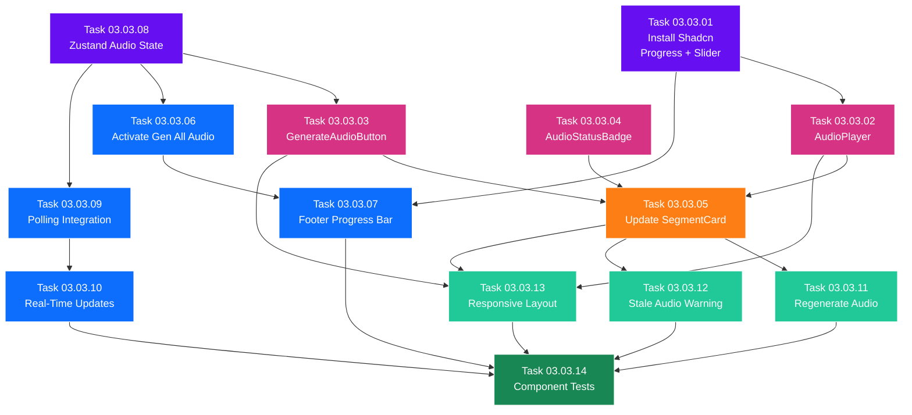

# SubPhase 03.03 — Audio Playback UI

> **Layer:** 2 — Sub-Phase Overview
> **Phase:** Phase 03 — The Voice
> **Parent Document:** [Phase_03_Overview.md](../Phase_03_Overview.md)
> **Folder:** `SubPhase_03_03_Audio_Playback_UI/`
> **Status:** NOT STARTED
> **Estimated Tasks:** 14

---

## Table of Contents

1. [Sub-Phase Objective](#1-sub-phase-objective)
2. [Scope](#2-scope)
3. [Technical Context](#3-technical-context)
4. [Task List](#4-task-list)
5. [Task Details](#5-task-details)
6. [Execution Order](#6-execution-order)
7. [Files Created & Modified](#7-files-created--modified)
8. [Validation Criteria](#8-validation-criteria)
9. [Constraints](#9-constraints)
10. [Notes & Gotchas](#10-notes--gotchas)
11. [Cross-References](#11-cross-references)

---

## 1. Sub-Phase Objective

**Build the complete audio frontend — replacing the Phase 02 placeholders with functional audio players, generation triggers, progress indicators, and the activated "Generate All Audio" button.** This is the final sub-phase of Phase 03 and the first time the user can see, trigger, and interact with audio in the browser.

After this sub-phase is complete:
1. Each `SegmentCard` shows an inline audio player (play/pause, scrub bar, duration) when audio exists.
2. Each `SegmentCard` shows a "Generate Audio" button when audio has not been generated.
3. An `AudioStatusBadge` on each card indicates the audio state: No Audio, Generating, Ready, or Failed.
4. The "Generate All Audio" footer button is enabled and triggers bulk audio generation.
5. A progress bar in the footer shows real-time bulk generation progress.
6. Individual `SegmentCard` components update in real-time during bulk generation as each segment completes.
7. A "Regenerate Audio" option exists for segments that already have audio.
8. A "text changed" warning notifies the user when audio may be stale after text edits.
9. All audio UI is responsive and works across breakpoints.
10. The Zustand store manages all audio generation state.

### What This Sub-Phase Delivers

1. **AudioPlayer Component (`components/AudioPlayer.tsx`)** — A compact, inline audio player embedded in each `SegmentCard`. Uses native HTML5 `<audio>` element for playback. Features: play/pause toggle, progress bar (Shadcn `Slider`), current time / total duration display (MM:SS), loading state with spinner.

2. **GenerateAudioButton Component (`components/GenerateAudioButton.tsx`)** — Per-segment "Generate Audio" button shown when `audio_file` is null. On click: calls `generateSegmentAudio()` → starts polling → transforms into a progress indicator. On completion: disappears and `AudioPlayer` appears. On error: shows red error with "Retry" option. Disabled with tooltip when segment is locked.

3. **AudioStatusBadge Component (`components/AudioStatusBadge.tsx`)** — Small badge/indicator on the `SegmentCard` header showing audio state: 🔇 No Audio (gray), ⏳ Generating (amber), ✅ Ready + duration (green), ❌ Failed + error tooltip (red).

4. **Updated SegmentCard (`components/SegmentCard.tsx`)** — Replaces the Phase 02 "Coming in Phase 03" audio placeholder with the real audio section: `AudioStatusBadge` in the header, `AudioPlayer` or `GenerateAudioButton` in the audio zone, "Regenerate Audio" in the dropdown menu, subtle pulsing border animation during active TTS generation.

5. **Activated "Generate All Audio" Footer Button** — The disabled footer button from Phase 02 is enabled. On click: calls `generateAllAudio()` → starts polling → shows progress bar in footer. Shows "Cancel" button for best-effort abort.

6. **Footer Progress Bar** — During bulk generation, the footer shows: "Generating audio... X/Y segments complete (Z%)" with a Shadcn `Progress` bar. Cancel button stops the batch (current segment finishes).

7. **Updated Zustand Store (`lib/stores.ts`)** — Extended `useProjectStore` with audio-specific state and actions: `audioTaskId`, `audioGenerationStatus` (per-segment), `bulkGenerationProgress`, `generateAudio()`, `generateAllAudio()`, `cancelGeneration()`, `refreshSegmentAudio()`.

8. **Real-Time UI Updates During Generation** — Polling `GET /api/tasks/{task_id}/status/` every 2 seconds. As each segment completes, the Zustand store updates, causing the corresponding `SegmentCard` to transition from "Generating" → "Ready". Footer progress bar advances. Uses `pollTaskStatus()` utility from `lib/api.ts` (SubPhase 03.02).

### What This Sub-Phase Does NOT Deliver

- Video rendering or export (→ Phase 04).
- Ken Burns zoom/pan effects (→ Phase 04).
- Subtitle generation or overlay (→ Phase 05).
- GlobalSettings editing UI for voice/speed (→ Phase 05).
- Crossfade transitions between segments (→ Phase 05).
- TTS engine or model loader changes (completed in SubPhase 03.01).
- API endpoints or backend task management (completed in SubPhase 03.02).
- Any new backend code (this sub-phase is frontend-only).

---

## 2. Scope

### 2.1 In Scope

| Area                              | Details                                                                   |
| --------------------------------- | ------------------------------------------------------------------------- |
| Frontend — AudioPlayer component  | HTML5 `<audio>` playback, play/pause, scrub, duration display             |
| Frontend — GenerateAudioButton    | Per-segment trigger button, progress/loading/error/retry states           |
| Frontend — AudioStatusBadge       | Header badge: No Audio / Generating / Ready / Failed                      |
| Frontend — SegmentCard update     | Replace "Coming in Phase 03" placeholder with real audio section          |
| Frontend — Footer button          | Enable "Generate All Audio", wire to `generateAllAudio()` API             |
| Frontend — Footer progress bar    | Progress indicator during bulk generation, cancel button                  |
| Frontend — Zustand store          | Audio generation state, per-segment tracking, polling actions             |
| Frontend — Real-time updates      | Task polling, per-segment state transitions, progress bar advancement     |
| Frontend — Regenerate Audio       | Dropdown option to re-generate when audio already exists                  |
| Frontend — Stale audio warning    | "Text changed — audio may be out of sync" notification                    |
| Frontend — Responsive layout      | Audio player and controls work on all breakpoints                         |
| Frontend — New Shadcn components  | Install `progress` and `slider` from Shadcn/UI                           |
| Frontend — Component tests        | Tests for AudioPlayer, GenerateAudioButton, AudioStatusBadge              |

### 2.2 Out of Scope

| Area                            | Reason                                                                   |
| ------------------------------- | ------------------------------------------------------------------------ |
| Backend endpoints               | All backend work completed in SubPhase 03.02                             |
| TTS engine / model loader       | Completed in SubPhase 03.01                                              |
| Video rendering                 | Deferred to Phase 04                                                     |
| GlobalSettings UI               | Deferred to Phase 05                                                     |
| Voice selection dropdown        | No UI to change voice/speed in Phase 03 — reads database defaults        |
| Audio waveform visualization    | Too complex for MVP — simple progress bar is sufficient                   |
| Background music / SFX          | Not in StoryFlow scope                                                   |

---

## 3. Technical Context

### 3.1 Prerequisites from SubPhase 03.02

This sub-phase depends on SubPhase 03.02's deliverables:

| Deliverable                                          | Source            | What We Use It For                                  |
| ---------------------------------------------------- | ----------------- | --------------------------------------------------- |
| `generateSegmentAudio(segmentId)` in `lib/api.ts`   | SubPhase 03.02    | Called by `GenerateAudioButton` on click             |
| `generateAllAudio(projectId, options)` in `lib/api.ts` | SubPhase 03.02 | Called by "Generate All Audio" footer button         |
| `getTaskStatus(taskId)` in `lib/api.ts`              | SubPhase 03.02    | Used for manual single-poll (if needed)              |
| `pollTaskStatus(taskId, onProgress)` in `lib/api.ts` | SubPhase 03.02    | Core polling utility for real-time progress updates  |
| `TaskResponse` type in `lib/types.ts`                | SubPhase 03.02    | Return type from `generateSegmentAudio()`            |
| `BulkTaskResponse` type in `lib/types.ts`            | SubPhase 03.02    | Return type from `generateAllAudio()`                |
| `TaskStatusResponse` type in `lib/types.ts`          | SubPhase 03.02    | Shape of polling response, used to update store      |
| `TaskStatus` type in `lib/types.ts`                  | SubPhase 03.02    | Union type for conditional rendering in badge/button |
| `TaskProgress` type in `lib/types.ts`                | SubPhase 03.02    | Progress data structure for footer bar               |
| `CompletedSegmentAudio` type in `lib/types.ts`       | SubPhase 03.02    | Per-segment completion data for store updates        |
| `TaskError` type in `lib/types.ts`                   | SubPhase 03.02    | Error data for failed segment display                |

### 3.2 Phase 02 Frontend Baseline

This sub-phase modifies components created in Phase 02. Here is their current state:

**`components/SegmentCard.tsx` (Phase 02 state):**
- Displays: segment number, text editor, image upload zone, image prompt, lock toggle, delete button.
- Audio section: **Disabled placeholder** — a gray box with text "🎵 Audio — Coming in Phase 03".
- Props: receives segment data from parent (`[id]/page.tsx` via Zustand store).
- No audio-related props or state.

**`app/projects/[id]/page.tsx` (Phase 02 state):**
- Timeline Editor page layout with vertical scrolling segment list.
- Footer action bar with two buttons:
  - "Generate All Audio" — **disabled**, tooltip: "Available in Phase 03".
  - "Export Video" — **disabled**, tooltip: "Available in Phase 04".
- Zustand store integration for project/segment CRUD.

**`lib/stores.ts` (Phase 02 state):**
- `useProjectStore` with state: `project`, `segments`, `isLoading`, `error`.
- Actions: `fetchProject()`, `updateSegment()`, `deleteSegment()`, `reorderSegments()`, `uploadImage()`, `removeImage()`.
- No audio-related state or actions.

### 3.3 New Shadcn/UI Components

This sub-phase requires two new Shadcn components installed at the start:

```bash
cd frontend
npx shadcn@latest add progress slider
```

| Component           | Usage                                                          |
| ------------------- | -------------------------------------------------------------- |
| `Progress`          | Footer bulk generation progress bar                            |
| `Slider`            | Audio scrubbing / seek bar in `AudioPlayer`                    |

Both are already part of the Shadcn/UI library. Installation creates them under `components/ui/`.

### 3.4 HTML5 Audio API Reference

The `AudioPlayer` component uses the native HTML5 `<audio>` element. Key API:

```typescript
// Creating an audio reference
const audioRef = useRef<HTMLAudioElement>(null);

// Playback controls
audioRef.current.play();          // Start playback
audioRef.current.pause();         // Pause playback
audioRef.current.currentTime = N; // Seek to position (seconds)

// State properties
audioRef.current.duration;        // Total duration (seconds)
audioRef.current.currentTime;     // Current playback position (seconds)
audioRef.current.paused;          // Boolean: is paused?
audioRef.current.ended;           // Boolean: has ended?

// Events
audioRef.current.addEventListener('timeupdate', handler); // Fires during playback (~4Hz)
audioRef.current.addEventListener('loadedmetadata', handler); // Duration available
audioRef.current.addEventListener('ended', handler); // Playback finished
audioRef.current.addEventListener('error', handler); // Load/playback error
```

**Audio URL construction:**
```typescript
// The audio_file field stores a relative URL path
const audioUrl = `${API_BASE_URL}${segment.audio_file}`;
// e.g., http://localhost:8000/media/projects/abc123/audio/def456.wav
```

### 3.5 Audio Section Visual States

As defined in [Phase_03_Overview.md](../Phase_03_Overview.md) §8.5, each `SegmentCard` audio section has three visual states:

**State A — No Audio (`audio_file` is null, not generating):**
```
┌─────────────────────────────────────┐
│  🎵 Audio                           │
│  ┌─────────────────────────────────┐│
│  │  [🎤 Generate Audio]            ││
│  └─────────────────────────────────┘│
└─────────────────────────────────────┘
```

**State B — Generating (TTS in progress for this segment):**
```
┌─────────────────────────────────────┐
│  🎵 Audio   ⏳ Generating...        │
│  ┌─────────────────────────────────┐│
│  │  [⟳ ████████░░░░░░░░░░]        ││
│  └─────────────────────────────────┘│
└─────────────────────────────────────┘
```

**State C — Audio Ready (`audio_file` exists):**
```
┌─────────────────────────────────────┐
│  🎵 Audio   ✅ Ready (5.2s)         │
│  ┌─────────────────────────────────┐│
│  │  [▶] ─────●──────────── 0:02/0:05│
│  └─────────────────────────────────┘│
│  [↻ Regenerate]                      │
└─────────────────────────────────────┘
```

**State D — Failed (TTS error):**
```
┌─────────────────────────────────────┐
│  🎵 Audio   ❌ Failed               │
│  ┌─────────────────────────────────┐│
│  │  ⚠ Audio generation failed      ││
│  │  [🔄 Retry]                     ││
│  └─────────────────────────────────┘│
└─────────────────────────────────────┘
```

### 3.6 Zustand Store Extensions

The Zustand store is extended with the following audio-specific state and actions:

```typescript
interface AudioGenerationState {
  status: "idle" | "generating" | "completed" | "failed";
  taskId?: string;
  error?: string;
}

// New state fields added to useProjectStore
interface ProjectStore {
  // ... existing Phase 02 state ...

  // Audio generation state
  audioTaskId: string | null;                           // Active bulk task ID
  audioGenerationStatus: Record<string, AudioGenerationState>; // Per-segment status keyed by segment ID
  bulkGenerationProgress: {
    current: number;
    total: number;
    percentage: number;
  } | null;

  // Audio generation actions
  generateAudio: (segmentId: string) => Promise<void>;    // Single segment TTS
  generateAllAudio: () => Promise<void>;                  // Bulk TTS
  cancelGeneration: () => void;                            // Cancel active task
  refreshSegmentAudio: (segmentId: string) => void;       // Re-fetch segment data
  setSegmentAudioStatus: (segmentId: string, status: AudioGenerationState) => void;
  clearBulkProgress: () => void;
}
```

**`generateAudio(segmentId)` action flow:**
1. Set `audioGenerationStatus[segmentId]` to `{ status: "generating" }`.
2. Call `generateSegmentAudio(segmentId)` from `lib/api.ts`.
3. Receive `{ task_id }`.
4. Store `taskId` in `audioGenerationStatus[segmentId]`.
5. Call `pollTaskStatus(taskId, onProgress)`.
6. `onProgress` callback:
   - On `COMPLETED`: set status to `"completed"`, call `refreshSegmentAudio(segmentId)` to re-fetch segment data.
   - On `FAILED`: set status to `"failed"`, store error message.
7. Clear generating status.

**`generateAllAudio()` action flow:**
1. Set `audioTaskId` to the returned `task_id`.
2. Set `bulkGenerationProgress` to `{ current: 0, total: N, percentage: 0 }`.
3. Set `audioGenerationStatus` for all processing segments to `"generating"`.
4. Call `generateAllAudio(projectId)` from `lib/api.ts`.
5. Call `pollTaskStatus(taskId, onProgress)`.
6. `onProgress` callback:
   - Update `bulkGenerationProgress` with latest `progress` data.
   - For each newly completed segment in `completed_segments`: update `audioGenerationStatus` to `"completed"`, call `refreshSegmentAudio()`.
   - For each error: update `audioGenerationStatus` to `"failed"` with error.
7. On completion: clear `audioTaskId`, clear `bulkGenerationProgress`.

### 3.7 Audio Time Formatting

Audio durations and playback positions are displayed in `MM:SS` format:

```typescript
function formatTime(seconds: number): string {
  if (isNaN(seconds) || seconds < 0) return "0:00";
  const mins = Math.floor(seconds / 60);
  const secs = Math.floor(seconds % 60);
  return `${mins}:${secs.toString().padStart(2, "0")}`;
}

// Examples:
// formatTime(5.23)  → "0:05"
// formatTime(65.7)  → "1:05"
// formatTime(0)     → "0:00"
// formatTime(123.4) → "2:03"
```

---

## 4. Task List

| #  | Task ID   | Task Title                                 | Depends On     | Est. Complexity | File(s) Affected                             |
| -- | --------- | ------------------------------------------ | -------------- | --------------- | -------------------------------------------- |
| 1  | 03.03.01  | Install New Shadcn Components              | —              | Low             | `components/ui/progress.tsx`, `components/ui/slider.tsx` |
| 2  | 03.03.02  | Build AudioPlayer Component                | 01             | High            | `components/AudioPlayer.tsx`                 |
| 3  | 03.03.03  | Build GenerateAudioButton Component        | 01             | Medium          | `components/GenerateAudioButton.tsx`         |
| 4  | 03.03.04  | Build AudioStatusBadge Component           | —              | Low             | `components/AudioStatusBadge.tsx`            |
| 5  | 03.03.05  | Update SegmentCard Audio Section           | 02, 03, 04     | High            | `components/SegmentCard.tsx`                 |
| 6  | 03.03.06  | Activate Generate All Audio Button         | 08             | Medium          | `app/projects/[id]/page.tsx`                 |
| 7  | 03.03.07  | Build Footer Progress Bar                  | 06             | Medium          | `app/projects/[id]/page.tsx`                 |
| 8  | 03.03.08  | Update Zustand Audio State                 | —              | High            | `lib/stores.ts`                              |
| 9  | 03.03.09  | Implement Task Polling UI Integration      | 08, 03, 06     | High            | `lib/stores.ts`, `components/GenerateAudioButton.tsx`, `app/projects/[id]/page.tsx` |
| 10 | 03.03.10  | Real-Time Segment Updates                  | 08, 09         | Medium          | `lib/stores.ts`, `components/SegmentCard.tsx`|
| 11 | 03.03.11  | Add Regenerate Audio Option                | 05, 08         | Low             | `components/SegmentCard.tsx`                 |
| 12 | 03.03.12  | Text Changed Audio Stale Warning           | 05             | Low             | `components/SegmentCard.tsx`                 |
| 13 | 03.03.13  | Responsive Audio Layout                    | 02, 03, 05     | Medium          | `components/AudioPlayer.tsx`, `components/GenerateAudioButton.tsx`, `components/SegmentCard.tsx` |
| 14 | 03.03.14  | Write Frontend Component Tests             | All above      | High            | Test files for all new components            |

---

## 5. Task Details

### Task 03.03.01 — Install New Shadcn Components

**Objective:** Install the Shadcn `Progress` and `Slider` components required by the audio UI.

**Steps:**
1. Navigate to the frontend directory:
   ```bash
   cd frontend
   ```
2. Install the `progress` component:
   ```bash
   npx shadcn@latest add progress
   ```
3. Install the `slider` component:
   ```bash
   npx shadcn@latest add slider
   ```
4. Verify the components are created:
   - `components/ui/progress.tsx` exists.
   - `components/ui/slider.tsx` exists.
5. Verify TypeScript compilation: `npx tsc --noEmit`.

**Key Details:**
- The `Progress` component is used for the footer's bulk generation progress bar.
- The `Slider` component is used for the audio scrub/seek bar in `AudioPlayer`.
- These are the only new Shadcn components in Phase 03. All other Shadcn components were installed in Phases 01-02.

---

### Task 03.03.02 — Build AudioPlayer Component

**Objective:** Build a compact, inline audio player component using HTML5 `<audio>`.

**File:** `frontend/components/AudioPlayer.tsx` (NEW)

**Props:**
```typescript
interface AudioPlayerProps {
  audioUrl: string;          // Full URL to .wav file
  duration: number;          // Duration in seconds (from database)
  className?: string;        // Optional Tailwind classes
}
```

**Implementation Steps:**
1. Create `components/AudioPlayer.tsx`.
2. Create an `<audio>` element with `ref`:
   ```typescript
   const audioRef = useRef<HTMLAudioElement>(null);
   ```
3. Manage local state:
   ```typescript
   const [isPlaying, setIsPlaying] = useState(false);
   const [currentTime, setCurrentTime] = useState(0);
   const [isLoaded, setIsLoaded] = useState(false);
   ```
4. Implement play/pause toggle:
   ```typescript
   const togglePlay = () => {
     if (audioRef.current) {
       if (isPlaying) {
         audioRef.current.pause();
       } else {
         audioRef.current.play();
       }
       setIsPlaying(!isPlaying);
     }
   };
   ```
5. Listen to `timeupdate` events to update `currentTime`.
6. Listen to `ended` event to reset play state.
7. Listen to `loadedmetadata` to confirm audio is loaded.
8. Implement seek via the Shadcn `Slider`:
   ```tsx
   <Slider
     value={[currentTime]}
     max={duration}
     step={0.1}
     onValueChange={([value]) => {
       if (audioRef.current) {
         audioRef.current.currentTime = value;
         setCurrentTime(value);
       }
     }}
   />
   ```
9. Display current time and duration using `formatTime()` utility.
10. Show a loading spinner while the audio file is being fetched (before `loadedmetadata`).

**Visual Layout:**
```
┌──────────────────────────────────────────────┐
│  [▶/⏸] ─────────●──────────────── 0:02 / 0:05 │
└──────────────────────────────────────────────┘
```
- Play/Pause button on the left.
- Slider (seek bar) in the center, filling available space.
- Time display on the right: `currentTime / totalDuration`.

**Key Details:**
- Use `useRef` for the audio element — do NOT put it in state.
- The `<audio>` element is **hidden** (`display: none` or no visual rendering) — playback is controlled entirely via the custom UI.
- Preload mode: `preload="metadata"` — only loads metadata (duration), not the full file, until play is pressed.
- Handle audio load errors gracefully (e.g., file deleted, server down): show an error state.
- The component ONLY renders when `audioUrl` is provided. When audio doesn't exist, `GenerateAudioButton` is shown instead (handled by parent `SegmentCard`).
- Reset `currentTime` to 0 when `audioUrl` changes (different audio loaded).

---

### Task 03.03.03 — Build GenerateAudioButton Component

**Objective:** Build the per-segment "Generate Audio" button with generating/loading/error/retry states.

**File:** `frontend/components/GenerateAudioButton.tsx` (NEW)

**Props:**
```typescript
interface GenerateAudioButtonProps {
  segmentId: string;
  isLocked: boolean;
  generationStatus: AudioGenerationState; // from Zustand store
  onGenerate: () => void;                 // calls store.generateAudio(segmentId)
  className?: string;
}
```

**States:**

| State       | Condition                           | Visual                                    |
| ----------- | ----------------------------------- | ----------------------------------------- |
| Idle        | `status === "idle"` and not locked  | `[🎤 Generate Audio]` button (primary)    |
| Locked      | `isLocked === true`                 | Disabled button with lock icon + tooltip   |
| Generating  | `status === "generating"`           | Spinner + "Generating..." (disabled)       |
| Failed      | `status === "failed"`               | Red error message + `[🔄 Retry]` button   |

**Implementation Steps:**
1. Create `components/GenerateAudioButton.tsx`.
2. Render based on `generationStatus.status`:
   - **idle + not locked:** Primary button with microphone icon, "Generate Audio" label. On click: call `onGenerate()`.
   - **idle + locked:** Disabled button with lock icon. Tooltip: "Unlock segment to generate audio."
   - **generating:** Disabled button with spinner icon and "Generating..." label. Optionally show indeterminate progress.
   - **failed:** Red alert box with error message from `generationStatus.error`. Below: `[🔄 Retry]` button (same action as "Generate Audio").
3. The button uses Shadcn `Button` component with appropriate variants:
   - Idle: `variant="default"` or a custom audio variant.
   - Locked: `variant="outline"` with `disabled`.
   - Generating: `variant="secondary"` with `disabled`.
   - Retry: `variant="destructive"`.

**Key Details:**
- The `onGenerate` callback is provided by the parent component (`SegmentCard`), which calls `store.generateAudio(segmentId)`.
- This component does NOT call the API directly — it relies on the Zustand store action.
- After generation completes (status transitions to `"completed"`), this component is no longer rendered — `AudioPlayer` takes its place (handled by `SegmentCard`).
- "Retry" simply re-triggers `onGenerate()` — the store resets the status to "generating" and re-calls the API.

---

### Task 03.03.04 — Build AudioStatusBadge Component

**Objective:** Build a small status badge showing the audio state of a segment.

**File:** `frontend/components/AudioStatusBadge.tsx` (NEW)

**Props:**
```typescript
interface AudioStatusBadgeProps {
  audioFile: string | null;       // segment.audio_file
  audioDuration: number | null;   // segment.audio_duration
  generationStatus: AudioGenerationState; // from Zustand store
  className?: string;
}
```

**Badge Variants:**

| State       | Condition                                       | Badge                                           |
| ----------- | ----------------------------------------------- | ------------------------------------------------ |
| No Audio    | `audioFile === null` and `status === "idle"`    | 🔇 Gray badge: "No Audio"                        |
| Generating  | `status === "generating"`                       | ⏳ Amber badge: "Generating..."                   |
| Ready       | `audioFile !== null` and `status !== "generating"` | ✅ Green badge: "Audio Ready" + `(X.Xs)`       |
| Failed      | `status === "failed"`                           | ❌ Red badge: "Failed" (tooltip with error)       |

**Implementation Steps:**
1. Create `components/AudioStatusBadge.tsx`.
2. Determine the badge state from props:
   ```typescript
   function getBadgeState(props: AudioStatusBadgeProps) {
     if (props.generationStatus.status === "generating") return "generating";
     if (props.generationStatus.status === "failed") return "failed";
     if (props.audioFile) return "ready";
     return "no-audio";
   }
   ```
3. Render a small badge using Shadcn `Badge` component (or a styled `<span>`):
   - **No Audio:** `bg-gray-100 text-gray-500` — "No Audio" with mute icon.
   - **Generating:** `bg-amber-100 text-amber-700` — "Generating..." with spinner icon.
   - **Ready:** `bg-green-100 text-green-700` — "Audio Ready (X.Xs)" with checkmark icon.
   - **Failed:** `bg-red-100 text-red-700` — "Failed" with X icon and hover tooltip showing `generationStatus.error`.
4. Duration formatting: if `audioDuration` exists, show `(X.Xs)` next to "Audio Ready".

**Key Details:**
- The badge is compact — fits in the `SegmentCard` header next to existing badges (lock status, segment number).
- Use Tailwind CSS for all styling — no external badge library.
- The "Failed" badge should have a `title` attribute or Shadcn `Tooltip` showing the full error message.
- This component is purely presentational — no API calls, no actions.

---

### Task 03.03.05 — Update SegmentCard Audio Section

**Objective:** Replace the Phase 02 "Coming in Phase 03" placeholder with the real audio section.

**File:** `frontend/components/SegmentCard.tsx` (MODIFY)

**Steps:**
1. Remove the Phase 02 audio placeholder:
   ```tsx
   {/* REMOVE THIS: */}
   <div className="bg-gray-50 rounded-lg p-4 text-gray-400 text-sm">
     🎵 Audio — Coming in Phase 03
   </div>
   ```
2. Import the new components:
   ```typescript
   import { AudioPlayer } from "./AudioPlayer";
   import { GenerateAudioButton } from "./GenerateAudioButton";
   import { AudioStatusBadge } from "./AudioStatusBadge";
   ```
3. Read audio generation status from the Zustand store:
   ```typescript
   const generationStatus = useProjectStore(
     (state) => state.audioGenerationStatus[segment.id] ?? { status: "idle" }
   );
   const generateAudio = useProjectStore((state) => state.generateAudio);
   ```
4. Add `AudioStatusBadge` to the card header (next to the segment number and lock icon):
   ```tsx
   <AudioStatusBadge
     audioFile={segment.audio_file}
     audioDuration={segment.audio_duration}
     generationStatus={generationStatus}
   />
   ```
5. Replace the placeholder with the audio section:
   ```tsx
   <div className="audio-section">
     {segment.audio_file && generationStatus.status !== "generating" ? (
       <AudioPlayer
         audioUrl={`${API_BASE_URL}${segment.audio_file}`}
         duration={segment.audio_duration ?? 0}
       />
     ) : (
       <GenerateAudioButton
         segmentId={segment.id}
         isLocked={segment.is_locked}
         generationStatus={generationStatus}
         onGenerate={() => generateAudio(segment.id)}
       />
     )}
   </div>
   ```
6. Add subtle pulsing border animation when generating:
   ```tsx
   <div className={cn(
     "segment-card border rounded-lg p-4",
     generationStatus.status === "generating" && "animate-pulse border-amber-300"
   )}>
   ```
7. Keep all existing SegmentCard functionality intact (text editor, image upload, lock toggle, delete, prompt display).

**Key Details:**
- The audio section appears BELOW the image section and ABOVE the prompt display (exact position matches the Phase 02 placeholder location).
- The conditional rendering logic: if `audio_file` exists AND we're not in "generating" state → show `AudioPlayer`. Otherwise → show `GenerateAudioButton`.
- The `animate-pulse` class creates a subtle pulsing effect on the card border during generation. Use `border-amber-300` for the amber color. Remove the animation when generation completes.
- The `API_BASE_URL` should come from the existing Axios configuration or a constants file.

---

### Task 03.03.06 — Activate Generate All Audio Button

**Objective:** Enable the "Generate All Audio" footer button and wire it to the bulk generation API.

**File:** `frontend/app/projects/[id]/page.tsx` (MODIFY)

**Steps:**
1. Locate the disabled "Generate All Audio" button in the footer action bar.
2. Remove the `disabled` attribute and "Available in Phase 03" tooltip.
3. Connect to the Zustand store:
   ```typescript
   const generateAllAudio = useProjectStore((state) => state.generateAllAudio);
   const audioTaskId = useProjectStore((state) => state.audioTaskId);
   const bulkProgress = useProjectStore((state) => state.bulkGenerationProgress);
   ```
4. Update the button:
   ```tsx
   <Button
     onClick={() => generateAllAudio()}
     disabled={!!audioTaskId}  // Disabled while a bulk task is already running
     variant="default"
   >
     {audioTaskId ? (
       <>
         <Loader2 className="mr-2 h-4 w-4 animate-spin" />
         Generating...
       </>
     ) : (
       <>
         <Volume2 className="mr-2 h-4 w-4" />
         Generate All Audio
       </>
     )}
   </Button>
   ```
5. Add a "Cancel" button that appears during bulk generation:
   ```tsx
   {audioTaskId && (
     <Button variant="outline" size="sm" onClick={cancelGeneration}>
       Cancel
     </Button>
   )}
   ```
6. The "Export Video" button remains disabled (→ Phase 04).

**Key Details:**
- The button disables itself while a bulk task is running (prevents duplicate submissions).
- The spinner icon (`Loader2` from Lucide React) indicates active generation.
- The "Cancel" button calls `store.cancelGeneration()` which sends a cancellation signal to the backend (best-effort).

---

### Task 03.03.07 — Build Footer Progress Bar

**Objective:** Show a progress bar in the footer during bulk audio generation.

**File:** `frontend/app/projects/[id]/page.tsx` (MODIFY — same file as Task 06)

**Steps:**
1. Import the Shadcn `Progress` component:
   ```typescript
   import { Progress } from "@/components/ui/progress";
   ```
2. Conditionally render the progress bar when `bulkGenerationProgress` is not null:
   ```tsx
   {bulkProgress && (
     <div className="w-full space-y-1">
       <div className="flex justify-between text-sm text-muted-foreground">
         <span>
           Generating audio... {bulkProgress.current}/{bulkProgress.total} segments complete
         </span>
         <span>{bulkProgress.percentage}%</span>
       </div>
       <Progress value={bulkProgress.percentage} className="h-2" />
     </div>
   )}
   ```
3. The progress bar appears above or replacing the footer buttons during generation.
4. When generation completes, `bulkGenerationProgress` becomes null and the progress bar disappears.

**Visual Layout During Bulk Generation:**
```
┌──────────────────────────────────────────────────────────┐
│  Generating audio... 7/12 segments complete          58% │
│  [████████████████████████████░░░░░░░░░░░░░░░]           │
│  [Cancel]                                [Export Video ⛔]│
└──────────────────────────────────────────────────────────┘
```

**Key Details:**
- The `Progress` component's `value` prop takes a number 0–100.
- The text shows both fraction (7/12) and percentage (58%) for clarity.
- After completion, show a brief success message (e.g., "✅ Audio generated for 12 segments") before clearing the progress bar.
- If there were errors, show "⚠ Completed with X errors" in amber instead of green.

---

### Task 03.03.08 — Update Zustand Audio State

**Objective:** Extend the Zustand `useProjectStore` with all audio generation state and actions.

**File:** `frontend/lib/stores.ts` (MODIFY)

**Steps:**
1. Define the `AudioGenerationState` type (can be in `types.ts` or directly in `stores.ts`):
   ```typescript
   interface AudioGenerationState {
     status: "idle" | "generating" | "completed" | "failed";
     taskId?: string;
     error?: string;
   }
   ```
2. Add new state fields to the store:
   ```typescript
   // Audio state
   audioTaskId: null as string | null,
   audioGenerationStatus: {} as Record<string, AudioGenerationState>,
   bulkGenerationProgress: null as { current: number; total: number; percentage: number } | null,
   ```
3. Implement `generateAudio(segmentId)`:
   - Set `audioGenerationStatus[segmentId]` to `{ status: "generating" }`.
   - Call `generateSegmentAudio(segmentId)` from `lib/api.ts`.
   - On success: receive `{ task_id }`, store it in the generation status.
   - Call `pollTaskStatus(taskId, onProgress)`.
   - In `onProgress`: check `status`. On `COMPLETED`: set status to `"completed"`, re-fetch segment data (to get updated `audio_file` and `audio_duration`). On `FAILED`: set status to `"failed"` with error.
   - Error handling: if the initial API call fails (e.g., 409 locked, 503 model missing), set status to `"failed"` with the error message.

4. Implement `generateAllAudio()`:
   - Call `generateAllAudio(projectId)` from `lib/api.ts`.
   - Set `audioTaskId` to the returned `task_id`.
   - Set `bulkGenerationProgress` to `{ current: 0, total: response.segments_to_process, percentage: 0 }`.
   - Set all processing segments' `audioGenerationStatus` to `{ status: "generating" }`.
   - Call `pollTaskStatus(taskId, onProgress)`.
   - In `onProgress`:
     - Update `bulkGenerationProgress` from `status.progress`.
     - For each entry in `status.completed_segments` not yet marked completed: update `audioGenerationStatus[segmentId]` to `"completed"`, re-fetch that segment.
     - For each entry in `status.errors`: update `audioGenerationStatus[segmentId]` to `"failed"`.
   - On poll completion: clear `audioTaskId`, clear `bulkGenerationProgress`.

5. Implement `cancelGeneration()`:
   - If `audioTaskId` exists, the frontend simply stops polling.
   - Optionally: call a cancel endpoint if the backend supports it.
   - Clear `audioTaskId` and `bulkGenerationProgress`.
   - Set all "generating" segments back to "idle".

6. Implement `refreshSegmentAudio(segmentId)`:
   - Re-fetch the segment data from the API: `GET /api/segments/{segmentId}/`.
   - Update the segment in the store's `segments` array with the fresh data (which now includes `audio_file` and `audio_duration`).

7. Implement `setSegmentAudioStatus(segmentId, status)`:
   - Simple setter: update `audioGenerationStatus[segmentId]`.

8. Implement `clearBulkProgress()`:
   - Set `bulkGenerationProgress` to null.
   - Set `audioTaskId` to null.

**Key Details:**
- The store manages TWO levels of generation tracking:
  1. **Per-segment:** `audioGenerationStatus` — tracks individual segment generation state. Used by `SegmentCard` to decide which component to show.
  2. **Bulk:** `audioTaskId` + `bulkGenerationProgress` — tracks the overall batch. Used by the footer progress bar.
- `refreshSegmentAudio` is the bridge between the task system and the UI. When a task completes, we re-fetch the segment from the API to get the updated `audio_file` and `audio_duration` fields. This triggers a re-render of the `SegmentCard`.
- Use Zustand's `immer` middleware (if already in use) for cleaner nested state updates, or use spread operators for immutable updates.

---

### Task 03.03.09 — Implement Task Polling UI Integration

**Objective:** Connect the task polling mechanism to the UI components so generation progress is visible in real-time.

**Files:** `lib/stores.ts`, `components/GenerateAudioButton.tsx`, `app/projects/[id]/page.tsx`

**Steps:**

1. **Single segment polling (in `generateAudio` store action):**
   ```typescript
   generateAudio: async (segmentId) => {
     const store = get();
     store.setSegmentAudioStatus(segmentId, { status: "generating" });
     
     try {
       const response = await generateSegmentAudio(segmentId);
       store.setSegmentAudioStatus(segmentId, { status: "generating", taskId: response.task_id });
       
       await pollTaskStatus(response.task_id, (taskStatus) => {
         if (taskStatus.status === "COMPLETED") {
           store.setSegmentAudioStatus(segmentId, { status: "completed" });
           store.refreshSegmentAudio(segmentId);
         } else if (taskStatus.status === "FAILED") {
           const error = taskStatus.errors[0]?.error ?? "Unknown error";
           store.setSegmentAudioStatus(segmentId, { status: "failed", error });
         }
       });
     } catch (error: any) {
       const message = error.response?.data?.error ?? error.message ?? "Generation failed";
       store.setSegmentAudioStatus(segmentId, { status: "failed", error: message });
     }
   },
   ```

2. **Bulk generation polling (in `generateAllAudio` store action):**
   ```typescript
   generateAllAudio: async () => {
     const store = get();
     const project = store.project;
     if (!project) return;

     try {
       const response = await generateAllAudioApi(project.id);
       set({ audioTaskId: response.task_id, bulkGenerationProgress: { current: 0, total: response.segments_to_process, percentage: 0 } });

       // Track which segments we've already handled
       const handledSegments = new Set<string>();

       await pollTaskStatus(response.task_id, (taskStatus) => {
         // Update bulk progress
         set({ bulkGenerationProgress: { current: taskStatus.progress.current, total: taskStatus.progress.total, percentage: taskStatus.progress.percentage } });

         // Update individual segments
         for (const completed of taskStatus.completed_segments) {
           if (!handledSegments.has(completed.segment_id)) {
             handledSegments.add(completed.segment_id);
             store.setSegmentAudioStatus(completed.segment_id, { status: "completed" });
             store.refreshSegmentAudio(completed.segment_id);
           }
         }
         for (const error of taskStatus.errors) {
           if (!handledSegments.has(error.segment_id)) {
             handledSegments.add(error.segment_id);
             store.setSegmentAudioStatus(error.segment_id, { status: "failed", error: error.error });
           }
         }
       });
     } catch (error: any) {
       console.error("Bulk generation failed:", error);
     } finally {
       set({ audioTaskId: null, bulkGenerationProgress: null });
     }
   },
   ```

3. **In `GenerateAudioButton`:** The component already reads `generationStatus` from props. When `status === "generating"`, it shows the spinner. When `status === "failed"`, it shows the error. No additional polling logic needed in the component itself.

4. **In `[id]/page.tsx`:** The footer reads `bulkGenerationProgress` from the store. When non-null, the progress bar renders. When null, the regular buttons render.

**Key Details:**
- The `pollTaskStatus` utility (from SubPhase 03.02) handles the 2-second polling loop. The store actions just need to handle the `onProgress` callback.
- Use a `Set<string>` to track handled segments and avoid duplicate `refreshSegmentAudio` calls.
- `refreshSegmentAudio` is called as segments complete — this triggers an API call per segment. For a project with 20 segments, this means up to 20 extra GET requests spread over the generation duration. This is acceptable for a local app.

---

### Task 03.03.10 — Real-Time Segment Updates

**Objective:** Ensure `SegmentCard` components react to real-time generation status changes.

**Files:** `lib/stores.ts`, `components/SegmentCard.tsx`

**Steps:**
1. Ensure `SegmentCard` subscribes to its specific `audioGenerationStatus` entry:
   ```typescript
   const generationStatus = useProjectStore(
     (state) => state.audioGenerationStatus[segment.id] ?? { status: "idle" }
   );
   ```
2. Zustand's shallow comparison ensures the component ONLY re-renders when its specific segment's status changes (not when other segments change).
3. When `refreshSegmentAudio(segmentId)` updates the segment in the store, the `SegmentCard` receiving that segment re-renders with the new `audio_file` and `audio_duration`.
4. The transition flow for a segment during bulk generation:
   - Before bulk starts: Status = "idle", shows `GenerateAudioButton`.
   - Bulk starts: Status = "generating", shows spinner.
   - Segment completes: Status = "completed", `audio_file` populated → shows `AudioPlayer`.
   - The transition is visible to the user as each card updates individually.
5. Optimize re-renders with Zustand selectors:
   ```typescript
   // Good — only this segment's status triggers re-render
   const status = useProjectStore((s) => s.audioGenerationStatus[id]);

   // Bad — entire status object triggers re-render for all segments
   const allStatuses = useProjectStore((s) => s.audioGenerationStatus);
   ```

**Key Details:**
- The real-time update "cascade" is: polling callback → store update → React re-render → UI transition.
- Each `SegmentCard` maintains its own subscription to its own status. When 10 segments are generating, only the card whose status changes re-renders.
- The `audio_file` field on the segment object is the source of truth for "has audio". The `audioGenerationStatus` is the source of truth for "is generating" or "has failed".

---

### Task 03.03.11 — Add Regenerate Audio Option

**Objective:** Add a "Regenerate Audio" option for segments that already have audio.

**File:** `frontend/components/SegmentCard.tsx` (MODIFY)

**Steps:**
1. Add a "Regenerate Audio" option to the segment's existing dropdown menu (the one with delete, lock/unlock):
   ```tsx
   {segment.audio_file && (
     <DropdownMenuItem onClick={() => generateAudio(segment.id)}>
       <RefreshCw className="mr-2 h-4 w-4" />
       Regenerate Audio
     </DropdownMenuItem>
   )}
   ```
2. The regenerate action calls the same `generateAudio(segmentId)` store action.
3. When regenerate is triggered:
   - The `AudioPlayer` disappears (status transitions to "generating").
   - The `GenerateAudioButton` in "generating" state appears.
   - On completion, the `AudioPlayer` reappears with the new audio.
4. The regenerated audio overwrites the existing `.wav` file (same file path).

**Key Details:**
- "Regenerate" is only shown when `segment.audio_file` exists (audio has been generated before).
- The menu item is disabled when the segment is locked (same rule as initial generation).
- Regeneration uses the same endpoint (`POST /api/segments/{id}/generate-audio/`) — the backend overwrites the existing file.

---

### Task 03.03.12 — Text Changed Audio Stale Warning

**Objective:** Show a subtle warning when a segment's text has been edited after audio was generated.

**File:** `frontend/components/SegmentCard.tsx` (MODIFY)

**Steps:**
1. Detect when text changes on a segment that has audio:
   - This is tricky because we don't have a `text_last_modified` timestamp.
   - **Approach A (simple):** After a text edit (debounced save via `updateSegment`), check if `audio_file` exists. If yes, set a local flag `audioMayBeStale = true`.
   - **Approach B (store-based):** Track `staleAudioSegments: Set<string>` in the Zustand store. When `updateSegment` is called for a segment that has `audio_file`, add its ID to the set. Clear it when audio is regenerated.
2. Display the warning in the audio section:
   ```tsx
   {audioMayBeStale && (
     <div className="text-xs text-amber-600 flex items-center gap-1">
       <AlertTriangle className="h-3 w-3" />
       Text changed — audio may be out of sync.
       <button
         className="underline text-amber-700 hover:text-amber-800"
         onClick={() => generateAudio(segment.id)}
       >
         Regenerate
       </button>
     </div>
   )}
   ```
3. The warning is informational — it does NOT prevent playback.
4. Clear the stale flag when:
   - Audio is regenerated for this segment.
   - The segment is deleted.

**Key Details:**
- This is a UX nicety, not a critical feature. Keep the implementation simple.
- The warning appears between the `AudioPlayer` and the bottom of the audio section.
- The "Regenerate" link in the warning triggers the same action as the dropdown option.
- The warning does NOT persist across page reloads (local/session state only). This is fine — it's just a reminder during active editing.

---

### Task 03.03.13 — Responsive Audio Layout

**Objective:** Ensure the audio player and generation controls work correctly on all screen sizes.

**Files:** `components/AudioPlayer.tsx`, `components/GenerateAudioButton.tsx`, `components/SegmentCard.tsx`

**Steps:**
1. **AudioPlayer responsive behavior:**
   - On wide screens (≥768px): Full layout — play button, slider, time display all in one row.
   - On narrow screens (<768px): Stack the time display below the slider.
   - The slider should fill available horizontal space (`flex-1` or `w-full`).
   ```tsx
   <div className="flex flex-col sm:flex-row items-center gap-2">
     <button onClick={togglePlay}>...</button>
     <Slider className="flex-1 min-w-0" ... />
     <span className="text-xs text-muted-foreground whitespace-nowrap">
       {formatTime(currentTime)} / {formatTime(duration)}
     </span>
   </div>
   ```
2. **GenerateAudioButton responsive behavior:**
   - On wide screens: Button with icon + text.
   - On narrow screens: The button can shrink but should not truncate text — wrap if needed.
3. **SegmentCard audio section:**
   - The audio section should not overflow the card on any screen size.
   - Use `overflow-hidden` on the audio section container.
4. **Footer progress bar:**
   - Full width on all screen sizes.
   - Text wraps naturally.

**Key Details:**
- Follow the same responsive patterns already established in the Phase 02 `SegmentCard` (image section, text editor).
- Test at breakpoints: 320px (mobile), 768px (tablet), 1024px+ (desktop).
- The audio `Slider` component should have a minimum width to remain usable on small screens.

---

### Task 03.03.14 — Write Frontend Component Tests

**Objective:** Write tests for all new frontend components.

**Files:** Test files for `AudioPlayer`, `GenerateAudioButton`, `AudioStatusBadge`, updated `SegmentCard`

**Steps:**

1. **AudioPlayer tests:**
   - Renders play button and time display.
   - Clicking play calls `audio.play()` (mock HTMLAudioElement).
   - Clicking pause calls `audio.pause()`.
   - Slider change updates `currentTime`.
   - `formatTime()` utility returns correct strings.
   - Error state renders when audio fails to load.

2. **GenerateAudioButton tests:**
   - Renders "Generate Audio" button in idle state.
   - Renders disabled button with tooltip when locked.
   - Renders spinner in generating state.
   - Renders error message and retry button in failed state.
   - Click calls `onGenerate` callback.

3. **AudioStatusBadge tests:**
   - Renders "No Audio" badge when no audio file and idle.
   - Renders "Generating..." badge when status is generating.
   - Renders "Audio Ready (X.Xs)" when audio file exists.
   - Renders "Failed" badge when status is failed.

4. **SegmentCard audio integration tests:**
   - Audio placeholder is replaced (no "Coming in Phase 03" text).
   - Shows `GenerateAudioButton` when no audio.
   - Shows `AudioPlayer` when audio exists.
   - Shows `AudioStatusBadge` in header.
   - Pulsing animation present during generation.
   - Regenerate option in dropdown menu.

5. **Zustand store audio action tests:**
   - `generateAudio` sets status to "generating", then "completed" on success.
   - `generateAllAudio` updates bulk progress and individual segment statuses.
   - `cancelGeneration` clears task ID and progress.
   - `refreshSegmentAudio` updates the segment in the store.

**Key Details:**
- Use the testing framework already established in the project (likely Jest + React Testing Library).
- Mock `lib/api.ts` functions — don't make real API calls.
- Mock `HTMLAudioElement` for `AudioPlayer` tests (JSDOM doesn't support audio playback).
- Test component state transitions (idle → generating → completed → showing player).

---

## 6. Execution Order

### 6.1 Dependency Chain

```
Task 01 (Install Shadcn Components — prerequisite for UI components)
    ├── Task 02 (AudioPlayer — uses Slider)
    └── Task 07 (Footer Progress Bar — uses Progress)

Task 04 (AudioStatusBadge — independent, no Shadcn dependency)

Task 08 (Zustand Store — foundation for all interactive components)
    ├── Task 09 (Polling Integration — wires store to components)
    │   └── Task 10 (Real-Time Updates — uses polling)
    ├── Task 03 (GenerateAudioButton — uses store actions)
    └── Task 06 (Generate All Audio Button — uses store actions)
        └── Task 07 (Footer Progress Bar — shows bulk progress)

Task 02 + 03 + 04 → Task 05 (SegmentCard Update — integrates all three components)
    ├── Task 11 (Regenerate Option — extends SegmentCard)
    ├── Task 12 (Stale Warning — extends SegmentCard)
    └── Task 13 (Responsive Layout — styles all components)

Everything → Task 14 (Tests — tests everything)
```

### 6.2 Recommended Sequence

| Order | Task(s)     | Rationale                                                          |
| ----- | ----------- | ------------------------------------------------------------------ |
| 1     | 01          | Install Shadcn Progress + Slider — must come first                 |
| 2     | 08          | Build Zustand audio state — foundation for all interactive logic   |
| 3     | 04          | Build AudioStatusBadge — simple, independent, no store dependency  |
| 4     | 02          | Build AudioPlayer — uses Slider from Step 1                        |
| 5     | 03          | Build GenerateAudioButton — uses store from Step 2                 |
| 6     | 05          | Update SegmentCard — integrates components from Steps 3, 4, 5      |
| 7     | 09          | Wire polling to store — connects API to UI                         |
| 8     | 10          | Real-time segment updates — depends on polling integration         |
| 9     | 06          | Activate Generate All Audio button — uses store                    |
| 10    | 07          | Build footer progress bar — uses Progress + store                  |
| 11    | 11          | Add Regenerate Audio option — extends SegmentCard                  |
| 12    | 12          | Add stale audio warning — extends SegmentCard                      |
| 13    | 13          | Responsive layout polish — styles everything                       |
| 14    | 14          | Write all component tests                                          |

### 6.3 Execution Flow (Mermaid)



> **Legend:**
> 🟣 Purple = Infrastructure (Shadcn install, Zustand store)
> 🩷 Pink = New standalone components
> 🟠 Orange = SegmentCard integration (critical merge point)
> 🔵 Blue = Interactive features (polling, progress, footer)
> 🟩 Teal = Polish & enhancements
> 🟢 Green = Tests

### 6.4 Parallel Work Opportunities

- **T04** (AudioStatusBadge) is independent — can start immediately.
- **T08** (Zustand store) is also independent — can start alongside T01.
- **T02 and T03** can be built in parallel once T01 and T08 are done.
- **T11 and T12** can be done in parallel after T05.

For a single developer working sequentially:
**T01 → T08 → T04 → T02 → T03 → T05 → T09 → T10 → T06 → T07 → T11 → T12 → T13 → T14**

---

## 7. Files Created & Modified

### 7.1 New Files

| File Path                                  | Created In | Purpose                                    |
| ------------------------------------------ | ---------- | ------------------------------------------ |
| `frontend/components/ui/progress.tsx`      | Task 01    | Shadcn Progress component (auto-generated) |
| `frontend/components/ui/slider.tsx`        | Task 01    | Shadcn Slider component (auto-generated)   |
| `frontend/components/AudioPlayer.tsx`      | Task 02    | HTML5 audio playback component             |
| `frontend/components/GenerateAudioButton.tsx` | Task 03 | Per-segment audio trigger button           |
| `frontend/components/AudioStatusBadge.tsx` | Task 04    | Audio status indicator badge               |

### 7.2 Modified Files

| File Path                                  | Modified In       | Changes                                      |
| ------------------------------------------ | ----------------- | -------------------------------------------- |
| `frontend/components/SegmentCard.tsx`      | Tasks 05, 11, 12, 13 | Replace placeholder, add audio section, regenerate option, stale warning, responsive |
| `frontend/app/projects/[id]/page.tsx`      | Tasks 06, 07      | Enable footer button, add progress bar       |
| `frontend/lib/stores.ts`                   | Tasks 08, 09, 10  | Audio generation state, polling actions       |

### 7.3 File Relationship Map

```
frontend/
├── components/
│   ├── ui/
│   │   ├── progress.tsx       ← NEW (Shadcn, Task 01)
│   │   └── slider.tsx         ← NEW (Shadcn, Task 01)
│   │
│   ├── AudioPlayer.tsx        ← NEW (Task 02)
│   │   └── Uses: Slider (ui/slider.tsx), <audio> element
│   │
│   ├── GenerateAudioButton.tsx ← NEW (Task 03)
│   │   └── Uses: Button (ui/button.tsx), store.generateAudio()
│   │
│   ├── AudioStatusBadge.tsx   ← NEW (Task 04)
│   │   └── Uses: Badge or styled span, formatTime()
│   │
│   └── SegmentCard.tsx        ← MODIFIED (Tasks 05, 11, 12, 13)
│       └── Uses: AudioPlayer, GenerateAudioButton, AudioStatusBadge
│           └── Reads: store.audioGenerationStatus[segmentId]
│
├── app/projects/[id]/
│   └── page.tsx               ← MODIFIED (Tasks 06, 07)
│       └── Uses: Progress (ui/progress.tsx), store.generateAllAudio(), store.bulkGenerationProgress
│
└── lib/
    ├── stores.ts              ← MODIFIED (Tasks 08, 09, 10)
    │   └── Uses: api.ts (generateSegmentAudio, generateAllAudio, pollTaskStatus)
    │       └── Uses: types.ts (TaskResponse, TaskStatusResponse, etc.)
    │
    ├── api.ts                 (UNCHANGED in this sub-phase — modified in SubPhase 03.02)
    └── types.ts               (UNCHANGED in this sub-phase — modified in SubPhase 03.02)

Dependency flow:
SegmentCard → AudioPlayer, GenerateAudioButton, AudioStatusBadge
SegmentCard → stores.ts (audioGenerationStatus, generateAudio)
[id]/page.tsx → stores.ts (generateAllAudio, bulkGenerationProgress)
stores.ts → api.ts (generateSegmentAudio, generateAllAudio, pollTaskStatus)
api.ts → Backend HTTP endpoints (SubPhase 03.02)
```

---

## 8. Validation Criteria

### 8.1 AudioPlayer Component

- [ ] Renders play/pause button, slider (seek bar), and time display.
- [ ] Clicking play starts audio playback.
- [ ] Clicking pause stops audio playback.
- [ ] Slider reflects current playback position in real-time.
- [ ] Dragging the slider seeks to the new position.
- [ ] Time display shows `currentTime / totalDuration` in `MM:SS` format.
- [ ] Loading spinner shows while audio metadata is loading.
- [ ] Playback resets to beginning when audio ends.
- [ ] Component handles audio load errors gracefully.
- [ ] `<audio>` element is hidden — all playback controls are custom UI.

### 8.2 GenerateAudioButton Component

- [ ] Shows "Generate Audio" button when audio does not exist.
- [ ] Button is disabled with tooltip when segment is locked.
- [ ] Clicking triggers `generateAudio(segmentId)` store action.
- [ ] Shows spinner with "Generating..." during active generation.
- [ ] Shows error message and "Retry" button on failure.
- [ ] "Retry" re-triggers generation.
- [ ] Component disappears when audio is generated (replaced by `AudioPlayer`).

### 8.3 AudioStatusBadge Component

- [ ] Shows gray "No Audio" when no audio file and idle.
- [ ] Shows amber "Generating..." when status is generating.
- [ ] Shows green "Audio Ready (X.Xs)" when audio file exists.
- [ ] Shows red "Failed" with error tooltip when status is failed.
- [ ] Duration formatting is correct (e.g., "5.2s").

### 8.4 SegmentCard Audio Section

- [ ] Phase 02 "Coming in Phase 03" placeholder is removed.
- [ ] `AudioStatusBadge` appears in the card header.
- [ ] `AudioPlayer` appears when `audio_file` exists.
- [ ] `GenerateAudioButton` appears when `audio_file` is null.
- [ ] Card has pulsing amber border during active generation.
- [ ] "Regenerate Audio" appears in dropdown when audio exists.
- [ ] All existing SegmentCard functionality is preserved (text, image, lock, delete).

### 8.5 Generate All Audio Button

- [ ] Footer "Generate All Audio" button is enabled (no longer disabled).
- [ ] Clicking triggers `generateAllAudio()` store action.
- [ ] Button is disabled during active bulk generation (prevents duplicate).
- [ ] Button shows spinner during generation.
- [ ] "Cancel" button appears during generation.
- [ ] "Export Video" button remains disabled.

### 8.6 Footer Progress Bar

- [ ] Progress bar appears during bulk generation.
- [ ] Shows "Generating audio... X/Y segments complete" with percentage.
- [ ] Shadcn `Progress` bar fills proportionally (0–100%).
- [ ] Progress bar disappears when generation completes.
- [ ] Success/error summary briefly shows after completion.

### 8.7 Zustand Store

- [ ] `audioGenerationStatus` tracks per-segment generation state.
- [ ] `bulkGenerationProgress` tracks overall batch progress.
- [ ] `generateAudio(segmentId)` triggers single generation + polling.
- [ ] `generateAllAudio()` triggers bulk generation + polling.
- [ ] `cancelGeneration()` stops polling and resets state.
- [ ] `refreshSegmentAudio(segmentId)` re-fetches segment data from API.
- [ ] Store updates cause correct component re-renders.

### 8.8 Real-Time Updates

- [ ] During bulk generation, individual `SegmentCard` components update as each segment completes.
- [ ] State transitions: No Audio → Generating → Audio Ready (visually observable).
- [ ] Footer progress bar advances in sync with completion.
- [ ] Polling interval is ~2 seconds.
- [ ] Polling stops when task status is COMPLETED or FAILED.

### 8.9 Stale Audio Warning

- [ ] Warning appears when text is edited on a segment with existing audio.
- [ ] Warning text: "Text changed — audio may be out of sync."
- [ ] "Regenerate" link triggers re-generation.
- [ ] Warning clears after regeneration.

### 8.10 Responsive Layout

- [ ] AudioPlayer layout adapts to narrow screens (stacking).
- [ ] Slider remains usable on mobile (minimum touch target).
- [ ] No horizontal overflow on any screen size.
- [ ] Footer progress bar is full width on all breakpoints.

### 8.11 TypeScript

- [ ] `npx tsc --noEmit` passes with zero errors.
- [ ] All new components have proper TypeScript interfaces for props.
- [ ] No `any` types in production code.

---

## 9. Constraints

| #  | Constraint                                                         | Source                                                         |
| -- | ------------------------------------------------------------------ | -------------------------------------------------------------- |
| 1  | Do NOT modify any backend code                                     | All backend work is completed in SubPhases 03.01 and 03.02    |
| 2  | Do NOT modify `lib/api.ts` or `lib/types.ts`                      | These were finalized in SubPhase 03.02                        |
| 3  | Do NOT add new API endpoints                                       | Backend API surface is frozen for Phase 03                    |
| 4  | Do NOT modify database models                                      | Models are frozen from Phase 01                               |
| 5  | Do NOT implement video rendering UI                                | Deferred to Phase 04                                          |
| 6  | Do NOT enable the "Export Video" button                            | Must remain visible but disabled — Phase 04 activates it      |
| 7  | Do NOT build a voice selection dropdown                            | GlobalSettings editing UI deferred to Phase 05                |
| 8  | Do NOT build a speed control slider                                | GlobalSettings editing UI deferred to Phase 05                |
| 9  | Do NOT use external audio libraries (Howler.js, Tone.js, etc.)    | HTML5 `<audio>` is sufficient; no extra dependencies          |
| 10 | Do NOT implement audio waveform visualization                      | Too complex for MVP — simple progress slider is sufficient    |
| 11 | Use only Shadcn/UI for new UI components (Progress, Slider)       | Design system consistency — [00_Project_Overview.md](../../00_Project_Overview.md) §2.2 |
| 12 | Tailwind CSS 4 for all styling                                     | No CSS-in-JS, no styled-components, no CSS modules            |
| 13 | All new components must be TypeScript (strict mode)                | TypeScript strict is project-wide                             |
| 14 | Audio polling interval: ~2 seconds                                 | Balance between responsiveness and API load                   |

---

## 10. Notes & Gotchas

### 10.1 Audio URL Construction

The `Segment.audio_file` field stores a URL-relative path like `/media/projects/abc123/audio/def456.wav`. The frontend needs to prepend the API base URL to construct a full URL for the `<audio>` element:

```typescript
const API_BASE_URL = process.env.NEXT_PUBLIC_API_URL ?? "http://localhost:8000";
const fullAudioUrl = `${API_BASE_URL}${segment.audio_file}`;
// → http://localhost:8000/media/projects/abc123/audio/def456.wav
```

Ensure `NEXT_PUBLIC_API_URL` is properly configured in the Next.js environment (`.env.local`). This should already be set from Phase 01.

### 10.2 Audio Caching and Regeneration

When audio is regenerated, the file path stays the same (`/media/projects/{id}/audio/{id}.wav`). The browser may cache the old audio file. To force a cache bust after regeneration, append a timestamp query parameter:

```typescript
const audioUrl = `${API_BASE_URL}${segment.audio_file}?t=${Date.now()}`;
```

Or use `segment.updated_at` if available. This ensures the browser fetches the new audio file after regeneration.

### 10.3 HTMLAudioElement Gotchas

1. **Autoplay restrictions:** Modern browsers block autoplay. Always require user interaction (click) to start playback. Do NOT attempt auto-play on component mount.
2. **Duration availability:** `audio.duration` is `NaN` until `loadedmetadata` fires. Wait for this event before displaying duration.
3. **CORS:** If the frontend and backend are on different origins (localhost:3000 vs localhost:8000), ensure the backend serves media files with appropriate CORS headers. Django's `django-cors-headers` (installed in Phase 01) should handle this.
4. **Memory:** `<audio>` elements hold resources. When a `SegmentCard` is unmounted (e.g., segment deleted), the audio element should be paused and cleaned up:
   ```typescript
   useEffect(() => {
     return () => {
       if (audioRef.current) {
         audioRef.current.pause();
         audioRef.current.src = "";
       }
     };
   }, []);
   ```

### 10.4 Polling and Component Lifecycle

If a user navigates away from the timeline page while generation is in progress:
- The `pollTaskStatus` promise continues until the component unmounts.
- Use a cleanup function to abort polling when the page component unmounts:
  ```typescript
  useEffect(() => {
    let cancelled = false;
    // ... setup polling ...
    return () => { cancelled = true; };
  }, []);
  ```
- The background task on the server continues regardless — audio is still generated. When the user returns to the page, the segment data (with new `audio_file`) loads from the API.

### 10.5 Zustand Store and Polling Memory

The `audioGenerationStatus` record grows as segments are processed. For large projects (50+ segments), this is still fine — it's just a dictionary of small objects.

However, make sure to clean up after generation completes:
```typescript
// After all generation is done:
set({ audioGenerationStatus: {} });  // Reset all to idle
```

Or selectively clear only "completed" entries to keep "failed" ones visible.

### 10.6 Accessibility Considerations

1. **Audio player:** Add `aria-label` to the play/pause button: `aria-label="Play audio"` / `aria-label="Pause audio"`.
2. **Slider:** Add `aria-label="Audio seek bar"` and `aria-valuetext` for screen readers.
3. **Generate button:** Include `aria-disabled` when locked, with accessible tooltip text.
4. **Status badge:** Use `aria-live="polite"` so screen readers announce status changes during generation.
5. **Progress bar:** The Shadcn `Progress` component should have `aria-label="Audio generation progress"`.

### 10.7 Edge Case: Empty Project

If a project has no segments:
- The "Generate All Audio" button should be disabled or show a tooltip: "No segments to generate audio for."
- Handle the `segments_to_process: 0` response gracefully.

### 10.8 Edge Case: All Segments Locked

If all segments are locked and `skip_locked=true`:
- The API returns 200 with `segments_to_process: 0`.
- The UI should show: "All segments are locked. Unlock segments to generate audio."

### 10.9 Segment Order and Playback

Segments are displayed in `sequence_index` order. Audio is generated in the same order during bulk generation. However, audio playback is independent — the user can play any segment's audio in any order.

There is no "play all segments in sequence" feature in Phase 03. Continuous playback across segments is a potential Phase 05 enhancement.

---

## 11. Cross-References

### 11.1 Parent Documents

| Document                              | Relationship                                                         |
| ------------------------------------- | -------------------------------------------------------------------- |
| [Phase_03_Overview.md](../Phase_03_Overview.md) | Direct parent (Layer 1). Defines this sub-phase in §4.3. Visual states in §8.5. Shadcn components in §9.3. |
| [00_Project_Overview.md](../../00_Project_Overview.md) | Master document (Layer 0). Timeline Editor spec in §5.2. Dev constraints in §14. |

### 11.2 Previous Sub-Phase

| Document                              | Relationship                                                         |
| ------------------------------------- | -------------------------------------------------------------------- |
| [SubPhase_03_02_Overview.md](../SubPhase_03_02_Audio_Generation_API/SubPhase_03_02_Overview.md) | Direct predecessor. Its deliverables are all prerequisites: `generateSegmentAudio()`, `generateAllAudio()`, `pollTaskStatus()` in `lib/api.ts`, and all TypeScript types in `lib/types.ts`. Backend endpoints. |

### 11.3 Next Phase

| Document                              | Relationship                                                         |
| ------------------------------------- | -------------------------------------------------------------------- |
| [Phase_04_Overview.md](../../Phase_04_The_Vision/Phase_04_Overview.md) | Next phase. Builds on Phase 03's completed audio pipeline. Uses `.wav` files, `audio_duration` for video clip assembly. Enables the "Export Video" button. |

### 11.4 Full Dependency Chain

```
SubPhase 01.01 (Project Setup)
    → SubPhase 01.02 (Database Models)
        → SubPhase 01.03 (Dashboard UI)
            → SubPhase 02.01 (Import & Parse Engine)
                → SubPhase 02.02 (Segment Management API)
                    → SubPhase 02.03 (Timeline Editor UI)
                        → SubPhase 03.01 (TTS Engine)
                            → SubPhase 03.02 (Audio Generation API)
                                → SubPhase 03.03 (THIS SUB-PHASE — Audio Playback UI)
                                    → Phase 04 (The Vision)
```

### 11.5 Phase 02 Components Modified

| Component from Phase 02                   | What This Sub-Phase Does To It                               |
| ----------------------------------------- | ------------------------------------------------------------ |
| `SegmentCard.tsx`                         | Replaces audio placeholder, adds AudioPlayer/GenerateAudioButton/AudioStatusBadge, adds regenerate/stale warning |
| `app/projects/[id]/page.tsx`              | Enables footer "Generate All Audio" button, adds progress bar |
| `lib/stores.ts`                           | Extends Zustand store with audio state and actions            |

### 11.6 Forward References

After this sub-phase, Phase 03 is complete. Phase 04 builds directly on it:

| What This Sub-Phase Creates                | What Phase 04 Uses It For                                     |
| ------------------------------------------ | ------------------------------------------------------------- |
| Functional audio playback per segment      | User can preview audio before triggering video export          |
| Audio duration visible in the UI           | Phase 04 uses duration for video clip assembly                 |
| "Export Video" button (still disabled)     | Phase 04 enables it and wires it to MoviePy rendering         |
| Complete audio for all segments            | Phase 04 validates all segments have audio before rendering    |

### 11.7 Child Documents (Layer 3)

| Task Document                                                | Task ID  | Title                                |
| ------------------------------------------------------------ | -------- | ------------------------------------ |
| `Task_03_03_01_Install_New_Shadcn_Components.md`             | 03.03.01 | Install New Shadcn Components        |
| `Task_03_03_02_Build_AudioPlayer_Component.md`               | 03.03.02 | Build AudioPlayer Component          |
| `Task_03_03_03_Build_GenerateAudioButton.md`                 | 03.03.03 | Build GenerateAudioButton Component  |
| `Task_03_03_04_Build_AudioStatusBadge.md`                    | 03.03.04 | Build AudioStatusBadge Component     |
| `Task_03_03_05_Update_SegmentCard_Audio_Section.md`          | 03.03.05 | Update SegmentCard Audio Section     |
| `Task_03_03_06_Activate_Generate_All_Audio_Button.md`        | 03.03.06 | Activate Generate All Audio Button   |
| `Task_03_03_07_Footer_Progress_Bar.md`                       | 03.03.07 | Footer Progress Bar                  |
| `Task_03_03_08_Update_Zustand_Audio_State.md`                | 03.03.08 | Update Zustand Audio State           |
| `Task_03_03_09_Implement_Task_Polling_UI.md`                 | 03.03.09 | Implement Task Polling UI            |
| `Task_03_03_10_Real_Time_Segment_Updates.md`                 | 03.03.10 | Real-Time Segment Updates            |
| `Task_03_03_11_Add_Regenerate_Audio_Option.md`               | 03.03.11 | Add Regenerate Audio Option          |
| `Task_03_03_12_Text_Changed_Audio_Stale_Warning.md`          | 03.03.12 | Text Changed Audio Stale Warning     |
| `Task_03_03_13_Responsive_Audio_Layout.md`                   | 03.03.13 | Responsive Audio Layout              |
| `Task_03_03_14_Write_Frontend_Component_Tests.md`            | 03.03.14 | Write Frontend Component Tests       |

---

> **End of SubPhase 03.03 Overview — Layer 2 Document**
>
> **Parent:** [Phase_03_Overview.md](../Phase_03_Overview.md) (Layer 1)
> **Layer 0:** [00_Project_Overview.md](../../00_Project_Overview.md)
> **Previous Sub-Phase:** [SubPhase_03_02_Overview.md](../SubPhase_03_02_Audio_Generation_API/SubPhase_03_02_Overview.md) (Layer 2)
> **Next Phase:** [Phase_04_Overview.md](../../Phase_04_The_Vision/Phase_04_Overview.md) (Layer 1)
