# Phase 04 — The Vision

## Layer 1 Overview Document

---

| **Field**              | **Value**                                                                  |
| ---------------------- | -------------------------------------------------------------------------- |
| **Phase**              | Phase 04 — The Vision                                                      |
| **Codename**           | The Vision                                                                 |
| **Layer**              | Layer 1 (Phase Overview)                                                   |
| **Status**             | Not Started                                                                |
| **Parent Document**    | [00_Project_Overview.md](../00_Project_Overview.md) (Layer 0)              |
| **Previous Phase**     | [Phase 03 — The Voice](../Phase_03_The_Voice/Phase_03_Overview.md)         |
| **Next Phase**         | [Phase 05 — The Polish](../Phase_05_The_Polish/Phase_05_Overview.md)       |
| **Dependencies**       | Phase 03 must be 100% complete (see §2 for details)                        |
| **Sub-Phases**         | 3 (04.01, 04.02, 04.03)                                                   |
| **Est. Task Documents**| 30–45 across all 3 sub-phases                                             |

---

## Table of Contents

- [Phase 04 — The Vision](#phase-04--the-vision)
  - [Layer 1 Overview Document](#layer-1-overview-document)
  - [Table of Contents](#table-of-contents)
  - [1. Phase Objective](#1-phase-objective)
    - [What Phase 04 Builds](#what-phase-04-builds)
    - [What Phase 04 Does NOT Build](#what-phase-04-does-not-build)
  - [2. Relationship to Parent \& Previous Documents](#2-relationship-to-parent--previous-documents)
    - [2.1 Inherited from Layer 0](#21-inherited-from-layer-0)
    - [2.2 Inherited from Phase 01 (Transitive)](#22-inherited-from-phase-01-transitive)
    - [2.3 Inherited from Phase 02 (Transitive)](#23-inherited-from-phase-02-transitive)
    - [2.4 Inherited from Phase 03 (Direct Dependency)](#24-inherited-from-phase-03-direct-dependency)
    - [2.5 One-Directional Rule](#25-one-directional-rule)
  - [3. Architecture Context for This Phase](#3-architecture-context-for-this-phase)
    - [3.1 Technology Stack (Phase 04 Scope)](#31-technology-stack-phase-04-scope)
    - [3.2 New Dependencies Introduced in Phase 04](#32-new-dependencies-introduced-in-phase-04)
    - [3.3 Database Models (Reiterated — Unchanged)](#33-database-models-reiterated--unchanged)
      - [Project Model — Fields Used in Phase 04](#project-model--fields-used-in-phase-04)
      - [Segment Model — Fields Read in Phase 04](#segment-model--fields-read-in-phase-04)
      - [GlobalSettings Model — Fields Read in Phase 04](#globalsettings-model--fields-read-in-phase-04)
    - [3.4 Phase 03 Deliverables That Phase 04 Builds Upon](#34-phase-03-deliverables-that-phase-04-builds-upon)
    - [3.5 Directory Structure After Phase 04](#35-directory-structure-after-phase-04)
    - [3.6 API Endpoints (Phase 04 Scope)](#36-api-endpoints-phase-04-scope)
      - [Render Trigger Endpoint](#render-trigger-endpoint)
      - [Render Status Endpoint](#render-status-endpoint)
  - [4. Sub-Phase Breakdown](#4-sub-phase-breakdown)
    - [4.1 SubPhase 04.01 — Basic Video Assembly](#41-subphase-0401--basic-video-assembly)
    - [4.2 SubPhase 04.02 — Ken Burns Effect Implementation](#42-subphase-0402--ken-burns-effect-implementation)
    - [4.3 SubPhase 04.03 — Render Pipeline \& Progress API](#43-subphase-0403--render-pipeline--progress-api)
  - [5. Execution Order](#5-execution-order)
    - [5.1 Sub-Phase Dependency Chain](#51-sub-phase-dependency-chain)
    - [5.2 Execution Order Flowchart](#52-execution-order-flowchart)
  - [6. Sub-Phase Folder Structure](#6-sub-phase-folder-structure)
  - [7. Files Created \& Modified in This Phase](#7-files-created--modified-in-this-phase)
    - [7.1 Backend Files](#71-backend-files)
    - [7.2 Frontend Files](#72-frontend-files)
    - [7.3 File Creation Map (Mermaid)](#73-file-creation-map-mermaid)
  - [8. Detailed Module Specifications](#8-detailed-module-specifications)
    - [8.1 Video Rendering Pipeline](#81-video-rendering-pipeline)
    - [8.2 Ken Burns Effect Algorithm](#82-ken-burns-effect-algorithm)
    - [8.3 Image-Audio Synchronization](#83-image-audio-synchronization)
    - [8.4 Clip Concatenation \& Export](#84-clip-concatenation--export)
    - [8.5 Render Progress Tracking](#85-render-progress-tracking)
    - [8.6 Render UI](#86-render-ui)
  - [9. Technology Setup Details](#9-technology-setup-details)
    - [9.1 Backend New Packages](#91-backend-new-packages)
    - [9.2 FFmpeg Installation](#92-ffmpeg-installation)
    - [9.3 No New Frontend Dependencies](#93-no-new-frontend-dependencies)
    - [9.4 Django Settings — Media Serving](#94-django-settings--media-serving)
    - [9.5 MoviePy Configuration](#95-moviepy-configuration)
  - [10. Constraints Specific to Phase 04](#10-constraints-specific-to-phase-04)
  - [11. Exit Criteria](#11-exit-criteria)
    - [Basic Video Assembly Validation](#basic-video-assembly-validation)
    - [Ken Burns Effect Validation](#ken-burns-effect-validation)
    - [Render API Validation](#render-api-validation)
    - [Render UI Validation](#render-ui-validation)
    - [Structural Validation](#structural-validation)
  - [12. Cross-References](#12-cross-references)
    - [12.1 References to Layer 0](#121-references-to-layer-0)
    - [12.2 References to Phase 01](#122-references-to-phase-01)
    - [12.3 References to Phase 02](#123-references-to-phase-02)
    - [12.4 References to Phase 03](#124-references-to-phase-03)
    - [12.5 Forward References to Phase 05](#125-forward-references-to-phase-05)
    - [12.6 Child Documents (Layer 2)](#126-child-documents-layer-2)

---

## 1. Phase Objective

Phase 04 — **The Vision** — implements the **video rendering pipeline**, the technical heart of StoryFlow. This phase takes all the prepared assets from Phases 01–03 (project structure, imported text, uploaded images, generated audio) and assembles them into a finished **MP4 video** with cinematic **Ken Burns zoom/pan effects** applied to every image.

### What Phase 04 Builds

1. **Basic Video Assembly Engine (`core_engine/video_renderer.py`)** — A MoviePy-based pipeline that loads each segment's image and audio, creates synchronized clips, and concatenates them into a single video.

2. **Ken Burns Effect Algorithm (`core_engine/ken_burns.py`)** — A NumPy-based mathematical transformation that simulates cinematic camera movement (slow zoom + pan) across static images, bringing them to life. This uses the `zoom_intensity` value from `GlobalSettings` (default: 1.3×).

3. **Render API & Background Task** — Backend endpoints to trigger rendering, track progress, and download the finished MP4 file. Rendering runs as a background task (using the same `concurrent.futures.ThreadPoolExecutor` pattern from Phase 03) since it is long-running and CPU-intensive.

4. **Render Progress UI** — Frontend components that show real-time rendering progress (per-segment progress, overall percentage), a render completion notification, and a download/preview link for the finished video.

5. **Project Status Management** — The `Project.status` field transitions from `DRAFT` → `PROCESSING` → `COMPLETED` (or `FAILED`) as rendering progresses, reflecting the actual state of the project.

### What Phase 04 Does NOT Build

> **Critical:** The following features are explicitly **out of scope** for Phase 04. AI agents must NOT implement these.

- ❌ Subtitle generation or overlay of any kind (→ Phase 05)
- ❌ Crossfade transitions between segments/clips (→ Phase 05)
- ❌ GlobalSettings editing UI (→ Phase 05)
- ❌ Custom voice selection UI (→ Phase 05)
- ❌ Subtitle font or color customization (→ Phase 05)
- ❌ Resolution/framerate picker UI (→ Phase 05; use model defaults: 1920×1080, 30fps)
- ❌ Multiple output format options (→ future; MP4 only)
- ❌ Batch rendering of multiple projects simultaneously
- ❌ Cloud-based rendering or offloading

At the conclusion of Phase 04, a user should be able to: import a story, upload images, generate audio, click **"Export Video"**, see real-time render progress, and receive a complete **MP4 video** with Ken Burns effects on every segment — all running locally.

---

## 2. Relationship to Parent & Previous Documents

### 2.1 Inherited from Layer 0

Phase 04 inherits all architectural decisions, constraints, and conventions from the Layer 0 master overview:

| Layer 0 Section                                      | Phase 04 Relevance                                                        |
| ---------------------------------------------------- | ------------------------------------------------------------------------- |
| §1 — Project Vision                                  | Phase 04 realizes the end-to-end "faceless video" production pipeline     |
| §2.2 — Technology Stack                              | Phase 04 activates MoviePy, Pillow (advanced), NumPy (advanced)           |
| §3.2.1 — Project Model                               | Phase 04 uses `status`, `resolution_width/height`, `framerate`, `output_path` |
| §3.2.2 — Segment Model                               | Phase 04 reads `image_file`, `audio_file`, `audio_duration` for each segment |
| §3.2.3 — GlobalSettings Model                        | Phase 04 reads `zoom_intensity` for Ken Burns effect                      |
| §4 — Directory Structure                             | Phase 04 outputs to `/media/projects/{id}/output/final.mp4`               |
| §5.4 — Video Rendering Module                        | **Primary reference.** Phase 04 implements this module fully.             |
| §5.5 — Ken Burns Effect Algorithm                    | **Primary reference.** Phase 04 implements this algorithm fully.          |
| §6 — API Endpoints                                   | Phase 04 implements `POST /api/projects/{id}/render/` and `GET /api/projects/{id}/status/` |
| §14 — Development Constraints                        | All constraints remain in force. No Docker, no Redis, no cloud.           |

### 2.2 Inherited from Phase 01 (Transitive)

Phase 04 transitively depends on Phase 01's core structure through Phases 02 and 03:

| Phase 01 Artifact                          | Still Relevant In Phase 04 Because                                        |
| ------------------------------------------ | ------------------------------------------------------------------------- |
| Django project structure                   | All backend work happens within this Django project                        |
| Next.js project structure                  | All frontend work happens within this Next.js project                     |
| `Project` model (`status`, `resolution_*`, `framerate`, `output_path`) | **First active use** of `status` transitions, `resolution_*`, `framerate`, `output_path` |
| `Segment` model                            | Image + audio file paths are read for rendering                           |
| `GlobalSettings` model (`zoom_intensity`)  | **First active use** of `zoom_intensity` for Ken Burns effect             |
| `core_engine/` directory                   | `video_renderer.py` and `ken_burns.py` stubs are REPLACED with implementations |

### 2.3 Inherited from Phase 02 (Transitive)

Phase 04 transitively depends on Phase 02's data manipulation layer:

| Phase 02 Artifact                          | Still Relevant In Phase 04 Because                                        |
| ------------------------------------------ | ------------------------------------------------------------------------- |
| Import & Parse Engine                      | Projects with populated segments must exist for rendering                  |
| Image Upload Pipeline                      | `Segment.image_file` must point to a valid image file on disk              |
| Timeline Editor UI                         | **Extended** with render controls and video preview                        |
| `lib/stores.ts` Zustand store              | **Extended** with render state management                                 |
| `lib/api.ts` client                        | **Extended** with render API calls                                         |

### 2.4 Inherited from Phase 03 (Direct Dependency)

Phase 04 **directly depends** on the deliverables of Phase 03. The following Phase 03 artifacts are prerequisites:

| Phase 03 Artifact                                  | Used by Phase 04 For                                                      |
| -------------------------------------------------- | ------------------------------------------------------------------------- |
| TTS Engine (Kokoro-82M integration)                | Audio files must exist for rendering — Phase 04 does NOT generate audio   |
| `.wav` audio files per segment                     | Loaded as `AudioFileClip` in MoviePy for video assembly                   |
| `Segment.audio_file` (populated file paths)        | Referenced during clip assembly — determines where to load audio from      |
| `Segment.audio_duration` (populated durations)     | Determines the duration of each `ImageClip` in the video                  |
| `api/tasks.py` (TaskManager + ThreadPoolExecutor)  | **Reused** for render background tasks — same task infrastructure          |
| `GET /api/tasks/{task_id}/status/` endpoint        | **Reused** for render progress polling (same endpoint, different task type) |
| Audio Playback UI                                  | Remains functional alongside new render UI                                 |
| "Export Video" button (disabled in Phase 03)       | **Enabled** and functional in Phase 04                                     |

> **Important for AI Agents:** You do NOT need to re-read previous Phase overviews in their entirety. The tables above summarize everything Phase 04 needs from each prior phase. If specific implementation details are needed (e.g., TaskManager API), refer to Section 3.4 of this document.

### 2.5 One-Directional Rule

> As defined in [00_Project_Overview.md](../00_Project_Overview.md) (Layer 0, §7.3): Documents flow TOP-DOWN only. This Phase 04 Overview inherits from and must be consistent with:
> - [00_Project_Overview.md](../00_Project_Overview.md) (Layer 0)
> - [Phase_01_Overview.md](../Phase_01_The_Skeleton/Phase_01_Overview.md) (Layer 1 — Phase 01)
> - [Phase_02_Overview.md](../Phase_02_The_Logic/Phase_02_Overview.md) (Layer 1 — Phase 02)
> - [Phase_03_Overview.md](../Phase_03_The_Voice/Phase_03_Overview.md) (Layer 1 — Phase 03)
>
> If any content here conflicts with a parent document, the **higher-level document takes precedence**. Phase 04 does NOT modify any prior model definitions, API contracts, or architectural decisions — it only EXTENDS them.

---

## 3. Architecture Context for This Phase

This section provides all the architectural context an AI agent needs while working on Phase 04. This is self-contained — agents should not need to re-read Layer 0 or previous Phase overviews.

### 3.1 Technology Stack (Phase 04 Scope)

Phase 04 activates the **video processing** layer of the stack — the final major technology group.

| Component              | Technology                        | Phase 04 Usage                                     |
| ---------------------- | --------------------------------- | -------------------------------------------------- |
| Backend Framework      | Django 5.x + DRF                  | Render endpoint, status API, background tasks       |
| Database               | SQLite                            | Project `status` and `output_path` updated          |
| Frontend Framework     | Next.js 16+ (App Router)          | Render UI, progress display, video preview          |
| Language (FE)          | TypeScript (Strict)               | Render state types, progress tracking               |
| Styling                | Tailwind CSS 4                    | Render progress UI, video player styling            |
| UI Components          | Shadcn/UI                         | Progress bar reused from Phase 03                   |
| State Management       | Zustand                           | Extended with render state                          |
| HTTP Client            | Axios                             | Render trigger, progress polling                    |
| **Video Processing**   | **MoviePy 1.0.3 / 2.0**          | **NEW — Clip assembly, concatenation, export**      |
| **Image Processing**   | **Pillow (advanced)**             | **Active — Image resizing, crop for Ken Burns**     |
| **Math Operations**    | **NumPy (advanced)**              | **Active — Matrix transforms for Ken Burns**        |
| Background Tasks       | Python `concurrent.futures`       | Reused from Phase 03 for render tasks               |

### 3.2 New Dependencies Introduced in Phase 04

Phase 04 requires **one new Python package**: MoviePy.

**New Backend Packages (add to `requirements.txt`):**

```
# Phase 04 — Video Rendering Dependencies
moviepy>=1.0.3               # Video clip assembly, concatenation, export
```

> **MoviePy Version Note:** MoviePy 1.0.3 is the stable, well-documented version. MoviePy 2.0 is a preview with API changes. This document assumes **MoviePy 1.0.3** API conventions. If using MoviePy 2.0, the implementer must adapt import paths and method signatures accordingly.

> **FFmpeg Dependency:** MoviePy requires FFmpeg installed on the system. It does NOT bundle FFmpeg. The user must have `ffmpeg` available on their PATH. The renderer should check for FFmpeg availability at startup and display a clear error if missing.

**Packages already installed (from prior phases):**
- `Pillow` — installed in Phase 01, used for image validation in Phase 02, now used for advanced image processing (resize, crop).
- `numpy` — installed in Phase 03, now used for Ken Burns matrix math.
- `soundfile` — installed in Phase 03, not directly used in Phase 04 but remains available.
- `onnxruntime` — installed in Phase 03, not used in Phase 04 rendering pipeline.

**New Frontend Packages:** None. Video preview uses the native HTML5 `<video>` element.

**New Shadcn/UI Components:** None. The `Progress` component from Phase 03 is reused for render progress.

### 3.3 Database Models (Reiterated — Unchanged)

Phase 04 does **not modify** any model definitions. Here are all model fields relevant to Phase 04:

#### Project Model — Fields Used in Phase 04

| Field              | Type         | Default   | Phase 04 Usage                                              |
| ------------------ | ------------ | --------- | ----------------------------------------------------------- |
| `id`               | UUIDField    | uuid4     | Used to organize output paths                                |
| `title`            | CharField    | —         | May be used as the output filename                           |
| `status`           | CharField    | `"DRAFT"` | **First active use:** Transitions DRAFT → PROCESSING → COMPLETED / FAILED |
| `resolution_width` | IntegerField | 1920      | **First active use:** Target output video width              |
| `resolution_height`| IntegerField | 1080      | **First active use:** Target output video height             |
| `framerate`        | IntegerField | 30        | **First active use:** Target output video framerate          |
| `output_path`      | CharField    | `""`      | **First active use:** Set to the path of the rendered MP4    |

#### Segment Model — Fields Read in Phase 04

| Field             | Type         | Phase 04 Usage                                        |
| ----------------- | ------------ | ----------------------------------------------------- |
| `id`              | UUIDField    | Identifying segments during clip assembly              |
| `project`         | ForeignKey   | Filtering segments for the project being rendered      |
| `sequence_index`  | IntegerField | **Critical:** Determines clip order in the final video |
| `text_content`    | TextField    | NOT used in Phase 04 (→ Phase 05 for subtitles)       |
| `image_file`      | ImageField   | Loaded as `ImageClip` — the visual content             |
| `audio_file`      | FileField    | Loaded as `AudioFileClip` — the narration              |
| `audio_duration`  | FloatField   | Determines the duration of each image clip             |

#### GlobalSettings Model — Fields Read in Phase 04

| Field              | Type        | Default  | Phase 04 Usage                                 |
| ------------------ | ----------- | -------- | ---------------------------------------------- |
| `zoom_intensity`   | FloatField | `1.3`    | **First active use:** Ken Burns zoom factor    |

> **Important:** Phase 04 **reads** GlobalSettings values but does NOT provide a UI to edit them. The GlobalSettings editing UI is deferred to Phase 05.

### 3.4 Phase 03 Deliverables That Phase 04 Builds Upon

The following is the exact state of the codebase at the start of Phase 04 (i.e., after Phase 03 is complete):

**Backend (running on `localhost:8000`):**
- Everything from Phase 02, plus:
- `core_engine/model_loader.py` — Singleton ONNX model loader (operational).
- `core_engine/audio_utils.py` — Audio normalization and duration utilities.
- `core_engine/tts_wrapper.py` — Fully functional TTS inference wrapper.
- `core_engine/video_renderer.py` — **Stub file only** (this is Phase 04's primary deliverable).
- `core_engine/ken_burns.py` — **Stub file only** (this is Phase 04's primary deliverable).
- `api/tasks.py` — TaskManager with ThreadPoolExecutor (operational, used for TTS tasks).
- `api/views.py` — Project + Segment ViewSets with all CRUD + import + audio generation actions.
- `api/urls.py` — All routes from Phases 01–03, plus task status endpoint.
- `requirements.txt` — Includes django, drf, cors-headers, Pillow, onnxruntime, soundfile, numpy.
- `/media/projects/{id}/audio/` — Contains `.wav` TTS files.
- `/media/projects/{id}/images/` — Contains uploaded images.
- `/media/projects/{id}/output/` — **Empty directory** (Phase 04 outputs here).

**Frontend (running on `localhost:3000`):**
- Everything from Phase 02, plus:
- `components/AudioPlayer.tsx` — Functional audio playback.
- `components/GenerateAudioButton.tsx` — Per-segment audio trigger.
- `components/AudioStatusBadge.tsx` — Audio status indicator.
- `components/SegmentCard.tsx` — Full segment card with text, image, audio.
- `lib/stores.ts` — Zustand store with project + segment + audio generation state.
- `lib/api.ts` — All API functions from Phases 01–03.
- `lib/types.ts` — All types from Phases 01–03 including TaskStatus, TaskProgress.
- Footer: "Generate All Audio" **(enabled)**, "Export Video" **(disabled)**.

**Key Infrastructure to Reuse:**
- The `TaskManager` from `api/tasks.py` is **reused as-is** for render tasks. The same `ThreadPoolExecutor` queues render tasks just like TTS tasks. The same task status endpoint (`GET /api/tasks/{task_id}/status/`) works for render tasks.
- The frontend's task polling mechanism (from `lib/api.ts`) is **reused** for render progress polling.

### 3.5 Directory Structure After Phase 04

After Phase 04, the project structure will include these additions (new files marked with `← NEW`):

```
/storyflow_root
│
├── /backend
│   ├── /api
│   │   ├── models.py                  (unchanged)
│   │   ├── serializers.py             ← MODIFIED (render response serializer)
│   │   ├── views.py                   ← MODIFIED (render action, status action)
│   │   ├── urls.py                    ← MODIFIED (render route)
│   │   ├── tasks.py                   ← MODIFIED (render task function registered)
│   │   ├── parsers.py                 (unchanged)
│   │   ├── validators.py              ← MODIFIED (pre-render validation logic)
│   │   └── tests.py                   ← MODIFIED (render pipeline tests)
│   │
│   ├── /core_engine
│   │   ├── __init__.py                (unchanged)
│   │   ├── tts_wrapper.py             (unchanged from Phase 03)
│   │   ├── model_loader.py            (unchanged from Phase 03)
│   │   ├── audio_utils.py             (unchanged from Phase 03)
│   │   ├── video_renderer.py          ← IMPLEMENTED (was stub — now fully functional)
│   │   ├── ken_burns.py               ← IMPLEMENTED (was stub — now fully functional)
│   │   └── render_utils.py            ← NEW (image resizing, FFmpeg checks, temp file mgmt)
│   │
│   ├── /media
│   │   └── /projects
│   │       └── /{project_uuid}
│   │           ├── /images            (populated in Phase 02)
│   │           ├── /audio             (populated in Phase 03)
│   │           └── /output            ← POPULATED (rendered MP4 here)
│   │                 └── final.mp4    ← OUTPUT FILE
│   │
│   └── requirements.txt               ← MODIFIED (added moviepy)
│
├── /frontend
│   ├── /app
│   │   └── /projects
│   │       └── /[id]
│   │           └── page.tsx           ← MODIFIED (render controls, video preview)
│   │
│   ├── /components
│   │   ├── RenderButton.tsx           ← NEW (trigger render with validation)
│   │   ├── RenderProgress.tsx         ← NEW (real-time render progress bar)
│   │   ├── VideoPreview.tsx           ← NEW (HTML5 video player for output)
│   │   ├── RenderStatusBadge.tsx      ← NEW (project render state indicator)
│   │   └── (all Phase 02-03 components unchanged)
│   │
│   ├── /lib
│   │   ├── api.ts                     ← MODIFIED (renderProject, getRenderStatus)
│   │   ├── types.ts                   ← MODIFIED (RenderStatus, RenderProgress types)
│   │   ├── stores.ts                  ← MODIFIED (render state in Zustand store)
│   │   └── utils.ts                   ← MODIFIED (formatDuration, formatFileSize helpers)
│   │
│   └── (rest unchanged)
│
└── (rest unchanged)
```

### 3.6 API Endpoints (Phase 04 Scope)

Phase 04 implements the final two API endpoints from the architecture. All prior endpoints remain unchanged.

| Method   | Endpoint                                  | Status in Phase 04 | Description                                        |
| -------- | ----------------------------------------- | ------------------- | -------------------------------------------------- |
| `POST`   | `/api/projects/{id}/render/`              | **NEW**             | Start video rendering (background task)            |
| `GET`    | `/api/projects/{id}/status/`              | **NEW**             | Poll render progress and get output URL            |
| `GET`    | `/api/tasks/{task_id}/status/`            | Reused (Phase 03)   | Generic task status — works for render tasks too   |

All Phase 01–03 endpoints remain **unchanged**.

#### Render Trigger Endpoint

**`POST /api/projects/{id}/render/`**

Validates the project is ready, then starts rendering as a background task.

**Pre-Render Validation (must ALL pass before rendering begins):**
1. Project exists.
2. Project has at least 1 segment.
3. **ALL** segments have `image_file` (not null, file exists on disk).
4. **ALL** segments have `audio_file` (not null, file exists on disk).
5. Project `status` is NOT already `PROCESSING` (prevent duplicate renders).

**Request Body:** None (or optional: `{ "force": true }` to re-render even if COMPLETED)

**Behavior:**
1. Run pre-render validation. Return 400 with detailed errors if any check fails.
2. Set `Project.status` = `"PROCESSING"`.
3. Create a background task via `TaskManager.submit_task()`.
4. The task function:
   a. Loads segments ordered by `sequence_index`.
   b. For each segment: load image, load audio, apply Ken Burns, synchronize durations.
   c. Concatenate all clips.
   d. Export to `/media/projects/{project_id}/output/final.mp4`.
   e. Update `Project.output_path` with the file path.
   f. Set `Project.status` = `"COMPLETED"`.
   g. On error: Set `Project.status` = `"FAILED"`.
5. Return 202 Accepted with task ID.

**Response (202 Accepted):**
```json
{
  "task_id": "render_abc123def456",
  "project_id": "a1b2c3d4-...",
  "status": "PROCESSING",
  "total_segments": 12,
  "message": "Video rendering started"
}
```

**Validation Error Response (400 Bad Request):**
```json
{
  "error": "Project not ready for rendering",
  "details": {
    "missing_images": ["segment_id_1", "segment_id_5"],
    "missing_audio": ["segment_id_3"],
    "message": "3 segments are missing required assets"
  }
}
```

#### Render Status Endpoint

**`GET /api/projects/{id}/status/`**

Returns the project's rendering status and progress.

**Response (200 OK — during rendering):**
```json
{
  "project_id": "a1b2c3d4-...",
  "status": "PROCESSING",
  "progress": {
    "current_segment": 4,
    "total_segments": 12,
    "percentage": 33,
    "current_phase": "Applying Ken Burns effect to segment 4"
  },
  "output_url": null
}
```

**Response (200 OK — rendering complete):**
```json
{
  "project_id": "a1b2c3d4-...",
  "status": "COMPLETED",
  "progress": {
    "current_segment": 12,
    "total_segments": 12,
    "percentage": 100,
    "current_phase": "Export complete"
  },
  "output_url": "/media/projects/a1b2c3d4/output/final.mp4"
}
```

---

## 4. Sub-Phase Breakdown

Phase 04 is divided into exactly **3 sub-phases**, executed strictly in order. Each sub-phase has its own Layer 2 overview document and a set of Layer 3 task documents.

### 4.1 SubPhase 04.01 — Basic Video Assembly

| Field              | Value                                                                            |
| ------------------ | -------------------------------------------------------------------------------- |
| **Sub-Phase ID**   | 04.01                                                                            |
| **Name**           | Basic Video Assembly                                                             |
| **Folder**         | `SubPhase_04_01_Basic_Video_Assembly/`                                           |
| **Overview File**  | `SubPhase_04_01_Overview.md`                                                     |
| **Dependencies**   | Phase 03 complete (segments have image_file + audio_file + audio_duration)       |
| **Est. Task Docs** | 10–12                                                                            |

**Objective:** Build the foundational video assembly pipeline that creates a simple video from static images + audio, **without** Ken Burns effects (just static images). This proves the rendering pipeline works end-to-end before adding visual complexity.

**Key Deliverables:**

1. **Render Utilities (`core_engine/render_utils.py`)**
   - `check_ffmpeg() -> bool` — Verify FFmpeg is installed and accessible on PATH.
   - `resize_image_to_resolution(image_path: str, width: int, height: int) -> np.ndarray` — Load an image with Pillow, resize to target resolution using "cover" mode (center-crop to fill the exact dimensions), return as NumPy array.
   - `get_output_path(project_id: str) -> str` — Returns `/media/projects/{project_id}/output/final.mp4`. Creates the output directory if it doesn't exist.
   - `cleanup_temp_files(temp_dir: str)` — Remove any temporary files created during rendering.

2. **Video Renderer (`core_engine/video_renderer.py`)**
   - **Replaces the Phase 01 stub** with a functional implementation.
   - Main function: `render_project(project_id: str, on_progress: callable = None) -> dict`
   - Steps (without Ken Burns — that comes in SubPhase 04.02):
     a. Load project from database.
     b. Validate: all segments have `image_file` and `audio_file`.
     c. Read `resolution_width`, `resolution_height`, `framerate` from the project.
     d. For each segment (ordered by `sequence_index`):
        - Load audio as `AudioFileClip(segment.audio_file.path)`.
        - Load image, resize to project resolution.
        - Create `ImageClip(image_array).set_duration(audio_clip.duration)`.
        - Set audio: `image_clip = image_clip.set_audio(audio_clip)`.
        - Report progress if callback provided.
     e. Concatenate all clips: `concatenate_videoclips(clips, method="compose")`.
     f. Export: `final.write_videofile(output_path, fps=framerate, codec="libx264", audio_codec="aac", bitrate="8000k")`.
     g. Update `Project.output_path` and `Project.status`.
     h. Return `{ "output_path": ..., "duration": ..., "file_size": ... }`.

3. **Image Resizing Logic ("Cover" Mode)**
   - The "cover" resize mode ensures the image fills the **entire** target resolution:
     - If the image is wider than the target aspect ratio: scale to match height, then crop sides.
     - If the image is taller: scale to match width, then crop top/bottom.
     - Center-crop in both cases.
   - This prevents letterboxing (black bars) in the output video.
   - Uses Pillow for the resize: `Image.open(path).resize((w, h), Image.Resampling.LANCZOS)`.

4. **FFmpeg Availability Check**
   - At server startup (or lazily at first render), check that `ffmpeg` is on PATH.
   - If missing, log a clear error message with installation instructions.
   - The render endpoint should return a 500 error with a helpful message if FFmpeg is missing.

5. **Basic Video Tests**
   - Create a synthetic test: generate a small image and short silence audio, render to MP4, verify the file is valid.
   - Test image resizing with various aspect ratios (16:9, 4:3, 1:1, portrait).
   - Test concatenation of 3+ clips.

**Key Technical Decisions:**
- **No Ken Burns in SubPhase 04.01.** First, prove the pipeline works with static images. Then add motion in 04.02. This follows the architecture document's guidance: "Implement MoviePy with simple static images first. Then add the Ken Burns script."
- **`method="compose"` for concatenation.** This handles clips of potentially different sizes gracefully (though they should all be the same resolution after our resize step).
- **`bitrate="8000k"`** for high-quality output. This matches the architecture specification.

### 4.2 SubPhase 04.02 — Ken Burns Effect Implementation

| Field              | Value                                                                            |
| ------------------ | -------------------------------------------------------------------------------- |
| **Sub-Phase ID**   | 04.02                                                                            |
| **Name**           | Ken Burns Effect Implementation                                                  |
| **Folder**         | `SubPhase_04_02_Ken_Burns_Effect/`                                               |
| **Overview File**  | `SubPhase_04_02_Overview.md`                                                     |
| **Dependencies**   | SubPhase 04.01 complete (basic video assembly works)                             |
| **Est. Task Docs** | 10–15                                                                            |

**Objective:** Implement the Ken Burns zoom-and-pan effect algorithm and integrate it into the video rendering pipeline, replacing the static image clips with animated, cinematic image clips.

**Key Deliverables:**

1. **Ken Burns Algorithm (`core_engine/ken_burns.py`)**
   - **Replaces the Phase 01 stub** with a fully functional implementation.
   - Main function: `apply_ken_burns(image_path: str, duration: float, resolution: tuple, zoom_intensity: float = 1.3, fps: int = 30) -> VideoClip`
   - **Algorithm (as specified in [00_Project_Overview.md](../00_Project_Overview.md) §5.5 and [System Architecture Document](../../System%20Architecture%20Document.md) §6):**
     a. Load the image at **higher-than-target** resolution (to allow zooming without pixelation).
     b. Calculate the crop box size: `crop_width = resolution[0] / zoom_intensity`, `crop_height = resolution[1] / zoom_intensity`.
     c. Randomly select a **start position** and **end position** for the crop box within the image bounds. Available positions:
        - Center → Center (subtle zoom only)
        - Top-Left → Bottom-Right
        - Bottom-Right → Top-Left
        - Top-Right → Bottom-Left
        - Bottom-Left → Top-Right
        - Center → Top-Left (zoom out + pan)
        - Center → Bottom-Right (zoom out + pan)
     d. Create a `make_frame(t)` function that, for each time `t`:
        - Calculates the interpolated crop position: $P(t) = P_{\text{start}} + (P_{\text{end}} - P_{\text{start}}) \times \frac{t}{\text{duration}}$
        - Calculates the interpolated zoom level (for smooth zoom effect).
        - Crops the image at the interpolated position and size.
        - Resizes the crop back to the target resolution using Pillow/NumPy.
        - Returns the resulting frame as a NumPy array (H×W×3, uint8).
     e. Return `VideoClip(make_frame, duration=duration).set_fps(fps)`.

2. **Pan Direction Selection**
   - A function `get_pan_direction(segment_index: int) -> tuple[tuple, tuple]` that returns `(start_position, end_position)`.
   - Uses the segment's `sequence_index` to deterministically vary the pan direction (so consecutive segments have different motions).
   - Pattern: cycle through the available directions based on `segment_index % len(directions)`.
   - This prevents all clips from having the same camera movement.

3. **Image Pre-Processing for Ken Burns**
   - Load the image with Pillow.
   - If the image is too small for Ken Burns at the target resolution (i.e., source dimensions < target × zoom_intensity), upscale the image using `LANCZOS` resampling.
   - Convert to a NumPy array for fast pixel operations during the `make_frame` callback.

4. **Integration with Video Renderer**
   - Modify `video_renderer.py` to use `apply_ken_burns()` instead of `ImageClip()` for each segment.
   - The renderer should read `GlobalSettings.zoom_intensity` and pass it to the Ken Burns function.
   - Each clip now has Ken Burns motion instead of being a static frame.

5. **Performance Optimization**
   - Ken Burns generates frames on-the-fly via `make_frame(t)`. This is CPU-intensive.
   - Optimization strategies:
     - Pre-compute the start/end positions once, not per-frame.
     - Use NumPy array slicing for the crop operation (fast).
     - Use `PIL.Image.resize` with `NEAREST` for non-final previews (faster, lower quality).
     - Limit working image size: the source image only needs to be `resolution × zoom_intensity` pixels.

6. **Ken Burns Unit Tests**
   - Test interpolation math: verify positions at t=0, t=duration/2, t=duration.
   - Test that all pan directions produce valid output (no out-of-bounds crops).
   - Test with extreme zoom values (1.0 — no zoom, 2.0 — large zoom).
   - Test with various image sizes (smaller than target, larger, matching).

### 4.3 SubPhase 04.03 — Render Pipeline & Progress API

| Field              | Value                                                                            |
| ------------------ | -------------------------------------------------------------------------------- |
| **Sub-Phase ID**   | 04.03                                                                            |
| **Name**           | Render Pipeline & Progress API                                                   |
| **Folder**         | `SubPhase_04_03_Render_Pipeline_Progress/`                                       |
| **Overview File**  | `SubPhase_04_03_Overview.md`                                                     |
| **Dependencies**   | SubPhase 04.02 complete (Ken Burns renders produce correct video)                |
| **Est. Task Docs** | 10–15                                                                            |

**Objective:** Build the complete render API endpoints, frontend render controls, real-time progress tracking, and video preview — making the full rendering pipeline accessible from the browser.

**Key Deliverables:**

1. **Render API Endpoint (`api/views.py`)**
   - `POST /api/projects/{id}/render/` — Custom DRF action on `ProjectViewSet`.
   - Pre-render validation (see §3.6 for details).
   - Sets `Project.status = "PROCESSING"`.
   - Spawns background render task via `TaskManager`.
   - Returns 202 with task ID.

2. **Render Status Endpoint (`api/views.py`)**
   - `GET /api/projects/{id}/status/` — Custom DRF action on `ProjectViewSet`.
   - Returns project status, render progress (per-segment), and output URL when complete.

3. **Pre-Render Validation (`api/validators.py`)**
   - `validate_project_for_render(project) -> list[str]` — Returns list of validation errors.
   - Checks: segments exist, all have `image_file`, all have `audio_file`, files exist on disk, project not already rendering.

4. **Background Render Task Integration**
   - The render task function is submitted to the same `TaskManager.ThreadPoolExecutor` from Phase 03.
   - The task calls `video_renderer.render_project()` with a progress callback.
   - The progress callback updates `TaskManager` with per-segment progress.
   - On completion: sets `Project.status = "COMPLETED"`, `Project.output_path = path`.
   - On error: sets `Project.status = "FAILED"`, logs the error.

5. **Updated URL Routing**
   - Register `render` and `status` actions on `ProjectViewSet`.

6. **RenderButton Component (`components/RenderButton.tsx`)**
   - Button label: "Export Video" (replacing the disabled placeholder).
   - On click: optionally runs client-side pre-validation (check all segments have images + audio), then calls `POST /api/projects/{id}/render/`.
   - States:
     - **Ready:** Blue button, "Export Video" label.
     - **Not Ready:** Disabled, tooltip explains what's missing.
     - **Rendering:** Shows "Rendering..." with spinner, disabled.
     - **Complete:** Green button, "Download Video" label.
   - Includes a "Re-Render" option (dropdown) when video already exists.

7. **RenderProgress Component (`components/RenderProgress.tsx`)**
   - Displayed in the timeline footer during rendering.
   - Shows: progress bar, "Processing segment X/Y (Z%)", current phase description.
   - Polls `GET /api/projects/{id}/status/` every 3 seconds.
   - Updates the Zustand store, which triggers UI updates.

8. **VideoPreview Component (`components/VideoPreview.tsx`)**
   - Displayed after rendering is complete.
   - Uses HTML5 `<video>` element with controls (play, pause, seek, volume, fullscreen).
   - Source: `output_url` from the render status response.
   - Shows video metadata: duration, file size, resolution.
   - "Download" button that triggers a file download via the browser.

9. **RenderStatusBadge Component (`components/RenderStatusBadge.tsx`)**
   - Small badge shown in the project header and on the dashboard's `ProjectCard`:
     - 📝 **DRAFT** — Gray badge (default).
     - ⚙️ **PROCESSING** — Yellow/amber badge, animated.
     - ✅ **COMPLETED** — Green badge.
     - ❌ **FAILED** — Red badge with error tooltip.

10. **Updated Zustand Store (`lib/stores.ts`)**
    - Extended `useProjectStore` with render state:
      - `renderTaskId: string | null`
      - `renderStatus: "idle" | "validating" | "rendering" | "completed" | "failed"`
      - `renderProgress: RenderProgress | null`
      - `outputUrl: string | null`
      - `startRender(): void` — Validate, trigger API, start polling.
      - `pollRenderStatus(): void` — Poll and update state.
      - `downloadVideo(): void` — Trigger browser download of MP4.

11. **Dashboard Project Card Enhancement**
    - `ProjectCard` on the dashboard shows the `RenderStatusBadge`.
    - Projects with status COMPLETED may show a "Watch" quick-action.

12. **Updated Frontend API Client (`lib/api.ts`)**
    - `renderProject(projectId: string, options?: { force?: boolean }): Promise<TaskResponse>`
    - `getRenderStatus(projectId: string): Promise<RenderStatusResponse>`

13. **Updated TypeScript Types (`lib/types.ts`)**
    - `RenderStatusResponse` — `{ project_id: string; status: ProjectStatus; progress: RenderProgress; output_url: string | null }`
    - `RenderProgress` — `{ current_segment: number; total_segments: number; percentage: number; current_phase: string }`
    - `ProjectStatus` — `"DRAFT" | "PROCESSING" | "COMPLETED" | "FAILED"`

---

## 5. Execution Order

### 5.1 Sub-Phase Dependency Chain

| Step | Sub-Phase  | Depends On | Produces                                              |
| ---- | ---------- | ---------- | ----------------------------------------------------- |
| 1    | 04.01      | Phase 03   | Basic video renderer, image resizing, clip concat     |
| 2    | Gate 1     | Step 1     | ✅ Static image + audio → valid MP4 (no Ken Burns)   |
| 3    | 04.02      | Step 2     | Ken Burns algorithm, animated clips, integrated render |
| 4    | Gate 2     | Step 3     | ✅ Rendered MP4 has Ken Burns motion on all segments  |
| 5    | 04.03      | Step 4     | Render API, progress UI, video preview, download       |
| 6    | Gate 3     | Step 5     | ✅ Full render workflow in the browser                 |

### 5.2 Execution Order Flowchart

```mermaid
flowchart TD
    START([Phase 04 Start<br/>Phase 03 Complete ✅]) --> PREREQ

    PREREQ["Pre-Requisite Check:<br/>FFmpeg installed?<br/>moviepy installed?"]
    PREREQ -- Yes --> SP01
    PREREQ -- No --> INSTALL["Install FFmpeg + moviepy<br/>before proceeding"]
    INSTALL --> SP01

    subgraph SP01 ["SubPhase 04.01 — Basic Video Assembly"]
        T01_01["Create render_utils.py<br/>(FFmpeg check, resize, paths)"]
        T01_02["Implement video_renderer.py<br/>(static image clips)"]
        T01_03["Image resize 'cover' mode"]
        T01_04["Clip concatenation logic"]
        T01_05["MP4 export with codecs"]
        T01_06["Update requirements.txt"]
        T01_07["Write basic render tests"]

        T01_01 --> T01_02 --> T01_03 --> T01_04 --> T01_05 --> T01_06 --> T01_07
    end

    SP01 --> GATE1{"✅ Validation Gate 1<br/>Static images + audio<br/>→ valid MP4?"}
    GATE1 -- Pass --> SP02
    GATE1 -- Fail --> FIX1["Debug & Fix"] --> GATE1

    subgraph SP02 ["SubPhase 04.02 — Ken Burns Effect"]
        T02_01["Implement ken_burns.py<br/>(core algorithm)"]
        T02_02["Implement crop-box math<br/>(zoom intensity → viewport)"]
        T02_03["Implement linear interpolation<br/>(P(t) = Start + (End-Start)*t/D)"]
        T02_04["Pan direction selector<br/>(varies per segment)"]
        T02_05["Image pre-processing<br/>(upscale if too small)"]
        T02_06["Integrate Ken Burns into<br/>video_renderer.py"]
        T02_07["Performance optimization"]
        T02_08["Write Ken Burns tests"]

        T02_01 --> T02_02 --> T02_03 --> T02_04 --> T02_05 --> T02_06 --> T02_07 --> T02_08
    end

    SP02 --> GATE2{"✅ Validation Gate 2<br/>Rendered MP4 has<br/>Ken Burns motion?"}
    GATE2 -- Pass --> SP03
    GATE2 -- Fail --> FIX2["Debug & Fix"] --> GATE2

    subgraph SP03 ["SubPhase 04.03 — Render Pipeline & Progress"]
        T03_01["Build render API endpoint"]
        T03_02["Build render status endpoint"]
        T03_03["Pre-render validation"]
        T03_04["Background task integration"]
        T03_05["Update URL routing"]
        T03_06["Build RenderButton component"]
        T03_07["Build RenderProgress component"]
        T03_08["Build VideoPreview component"]
        T03_09["Build RenderStatusBadge"]
        T03_10["Update Zustand render state"]
        T03_11["Update dashboard project cards"]
        T03_12["Integration testing"]

        T03_01 --> T03_02 --> T03_03 --> T03_04 --> T03_05 --> T03_06 --> T03_07 --> T03_08 --> T03_09 --> T03_10 --> T03_11 --> T03_12
    end

    SP03 --> GATE3{"✅ Validation Gate 3<br/>Full render workflow<br/>works end-to-end<br/>in browser?"}
    GATE3 -- Pass --> DONE([Phase 04 Complete ✅])
    GATE3 -- Fail --> FIX3["Debug & Fix"] --> GATE3

    style START fill:#198754,stroke:#fff,color:#fff
    style DONE fill:#198754,stroke:#fff,color:#fff
    style PREREQ fill:#17a2b8,stroke:#fff,color:#fff
    style INSTALL fill:#fd7e14,stroke:#fff,color:#fff
    style GATE1 fill:#ffc107,stroke:#333,color:#333
    style GATE2 fill:#ffc107,stroke:#333,color:#333
    style GATE3 fill:#ffc107,stroke:#333,color:#333
    style FIX1 fill:#dc3545,stroke:#fff,color:#fff
    style FIX2 fill:#dc3545,stroke:#fff,color:#fff
    style FIX3 fill:#dc3545,stroke:#fff,color:#fff
```



---

## 6. Sub-Phase Folder Structure

```
Phase_04_The_Vision/
│
├── Phase_04_Overview.md                                    ← YOU ARE HERE (Layer 1)
│
├── SubPhase_04_01_Basic_Video_Assembly/
│   ├── SubPhase_04_01_Overview.md                          ← Layer 2
│   ├── Task_04_01_01_Create_Render_Utils_Module.md         ← Layer 3
│   ├── Task_04_01_02_FFmpeg_Availability_Check.md
│   ├── Task_04_01_03_Image_Cover_Resize_Logic.md
│   ├── Task_04_01_04_Implement_Video_Renderer.md
│   ├── Task_04_01_05_AudioClip_ImageClip_Pairing.md
│   ├── Task_04_01_06_Duration_Synchronization.md
│   ├── Task_04_01_07_Clip_Concatenation.md
│   ├── Task_04_01_08_MP4_Export_With_Codecs.md
│   ├── Task_04_01_09_Update_Requirements_Txt.md
│   ├── Task_04_01_10_Output_Path_Management.md
│   └── Task_04_01_11_Write_Basic_Render_Tests.md
│
├── SubPhase_04_02_Ken_Burns_Effect/
│   ├── SubPhase_04_02_Overview.md                          ← Layer 2
│   ├── Task_04_02_01_Ken_Burns_Core_Algorithm.md
│   ├── Task_04_02_02_Crop_Box_Math.md
│   ├── Task_04_02_03_Linear_Interpolation_Function.md
│   ├── Task_04_02_04_Pan_Direction_Selector.md
│   ├── Task_04_02_05_Start_End_Position_Logic.md
│   ├── Task_04_02_06_Make_Frame_Callback.md
│   ├── Task_04_02_07_Image_Upscale_For_Zoom.md
│   ├── Task_04_02_08_Integrate_With_Renderer.md
│   ├── Task_04_02_09_Read_Zoom_Intensity_Setting.md
│   ├── Task_04_02_10_Performance_Optimization.md
│   ├── Task_04_02_11_Write_Ken_Burns_Math_Tests.md
│   └── Task_04_02_12_Write_Integration_Tests.md
│
└── SubPhase_04_03_Render_Pipeline_Progress/
    ├── SubPhase_04_03_Overview.md                          ← Layer 2
    ├── Task_04_03_01_Build_Render_API_Endpoint.md
    ├── Task_04_03_02_Build_Render_Status_Endpoint.md
    ├── Task_04_03_03_Pre_Render_Validation_Logic.md
    ├── Task_04_03_04_Background_Render_Task.md
    ├── Task_04_03_05_Project_Status_Transitions.md
    ├── Task_04_03_06_Update_URL_Routing.md
    ├── Task_04_03_07_Build_RenderButton_Component.md
    ├── Task_04_03_08_Build_RenderProgress_Component.md
    ├── Task_04_03_09_Build_VideoPreview_Component.md
    ├── Task_04_03_10_Build_RenderStatusBadge.md
    ├── Task_04_03_11_Update_Zustand_Render_State.md
    ├── Task_04_03_12_Update_Dashboard_Cards.md
    ├── Task_04_03_13_Update_Frontend_API_Client.md
    └── Task_04_03_14_Write_Full_Pipeline_Tests.md
```

---

## 7. Files Created & Modified in This Phase

### 7.1 Backend Files

| File Path                                 | Action       | Created In      | Purpose                                   |
| ----------------------------------------- | ------------ | --------------- | ----------------------------------------- |
| `backend/core_engine/video_renderer.py`   | **REPLACED** | SubPhase 04.01  | Stub → full MoviePy rendering pipeline    |
| `backend/core_engine/ken_burns.py`        | **REPLACED** | SubPhase 04.02  | Stub → full NumPy zoom/pan algorithm      |
| `backend/core_engine/render_utils.py`     | **NEW**      | SubPhase 04.01  | FFmpeg check, image resize, temp files    |
| `backend/requirements.txt`                | MODIFIED     | SubPhase 04.01  | Added moviepy                              |
| `backend/api/views.py`                    | MODIFIED     | SubPhase 04.03  | Render + status actions on ProjectViewSet |
| `backend/api/urls.py`                     | MODIFIED     | SubPhase 04.03  | Render route added                         |
| `backend/api/serializers.py`              | MODIFIED     | SubPhase 04.03  | Render response serializer                 |
| `backend/api/validators.py`              | MODIFIED     | SubPhase 04.03  | Pre-render validation function             |
| `backend/api/tasks.py`                    | MODIFIED     | SubPhase 04.03  | Render task function registered            |
| `backend/api/tests.py`                    | MODIFIED     | All sub-phases  | Render pipeline + Ken Burns tests          |

### 7.2 Frontend Files

| File Path                                    | Action       | Created In      | Purpose                               |
| -------------------------------------------- | ------------ | --------------- | ------------------------------------- |
| `frontend/components/RenderButton.tsx`       | **NEW**      | SubPhase 04.03  | "Export Video" trigger with states    |
| `frontend/components/RenderProgress.tsx`     | **NEW**      | SubPhase 04.03  | Real-time render progress display     |
| `frontend/components/VideoPreview.tsx`       | **NEW**      | SubPhase 04.03  | HTML5 video player for output         |
| `frontend/components/RenderStatusBadge.tsx`  | **NEW**      | SubPhase 04.03  | Project render state indicator        |
| `frontend/app/projects/[id]/page.tsx`        | MODIFIED     | SubPhase 04.03  | Render controls + video preview       |
| `frontend/lib/api.ts`                        | MODIFIED     | SubPhase 04.03  | renderProject, getRenderStatus        |
| `frontend/lib/types.ts`                      | MODIFIED     | SubPhase 04.03  | RenderStatus, RenderProgress types    |
| `frontend/lib/stores.ts`                     | MODIFIED     | SubPhase 04.03  | Render state management               |
| `frontend/lib/utils.ts`                      | MODIFIED     | SubPhase 04.03  | formatDuration, formatFileSize        |
| `frontend/components/ProjectCard.tsx`        | MODIFIED     | SubPhase 04.03  | Shows RenderStatusBadge               |

### 7.3 File Creation Map (Mermaid)

```mermaid
graph LR
    subgraph SP01 ["SubPhase 04.01<br/>Basic Assembly"]
        F1["render_utils.py"]
        F2["video_renderer.py 🔄"]
        F3["requirements.txt ✏️"]
    end

    subgraph SP02 ["SubPhase 04.02<br/>Ken Burns"]
        F4["ken_burns.py 🔄"]
        F5["Integrate into renderer"]
    end

    subgraph SP03 ["SubPhase 04.03<br/>Render Pipeline & UI"]
        F6["Render API endpoint"]
        F7["Status API endpoint"]
        F8["RenderButton.tsx"]
        F9["RenderProgress.tsx"]
        F10["VideoPreview.tsx"]
        F11["RenderStatusBadge.tsx"]
        F12["stores.ts ✏️"]
    end

    SP01 --> SP02 --> SP03

    style SP01 fill:#0d6efd,stroke:#fff,color:#fff
    style SP02 fill:#6610f2,stroke:#fff,color:#fff
    style SP03 fill:#d63384,stroke:#fff,color:#fff
```



> Legend: **NEW** = new file, **✏️** = modified, **🔄** = replaced (stub → implementation)

---

## 8. Detailed Module Specifications

### 8.1 Video Rendering Pipeline

> Source: [00_Project_Overview.md](../00_Project_Overview.md) (Layer 0, §5.4)
> Source: [System Architecture Document](../../System%20Architecture%20Document.md) (§5.4)

The complete rendering pipeline, from trigger to final MP4:

```
User clicks "Export Video"
    → POST /api/projects/{id}/render/
    → Pre-render validation (all segments have image + audio)
    → Set Project.status = "PROCESSING"
    → Spawn background render task
    → For each segment (ordered by sequence_index):
        ├── Load image (Pillow) → Resize to project resolution ("cover" mode)
        ├── Load audio (MoviePy AudioFileClip)
        ├── Apply Ken Burns effect → VideoClip with make_frame(t)
        ├── Set clip duration = audio duration
        ├── Set clip audio = audio clip
        └── Report progress (segment X of Y)
    → Concatenate all clips (MoviePy concatenate_videoclips)
    → Export to MP4 (libx264 video, aac audio, 8000k bitrate)
    → Set Project.output_path = "/media/projects/{id}/output/final.mp4"
    → Set Project.status = "COMPLETED"
```

**Error handling during render:**
- If any segment fails to load (missing file): set `Project.status = "FAILED"`, record the error.
- If FFmpeg crashes during export: catch the error, set FAILED status, clean up partial output.
- If the user triggers another render while one is in progress: return 409 Conflict.

### 8.2 Ken Burns Effect Algorithm

> Source: [00_Project_Overview.md](../00_Project_Overview.md) (Layer 0, §5.5)
> Source: [System Architecture Document](../../System%20Architecture%20Document.md) (§6)

**Mathematical foundation:**

Given:
- Image $I$ with dimensions $W_I \times H_I$
- Target output resolution $W_O \times H_O$ (e.g., 1920×1080)
- Zoom intensity $Z$ (e.g., 1.3, from `GlobalSettings.zoom_intensity`)
- Clip duration $D$ seconds
- Framerate $F$ (e.g., 30fps)

**Step 1: Calculate crop box dimensions**
$$W_{\text{crop}} = \frac{W_O}{Z}, \quad H_{\text{crop}} = \frac{H_O}{Z}$$

For $Z = 1.3$ and 1920×1080 output:
$$W_{\text{crop}} = \frac{1920}{1.3} \approx 1477, \quad H_{\text{crop}} = \frac{1080}{1.3} \approx 831$$

**Step 2: Ensure source image is large enough**

The source image must be at least $W_O \times H_O$ pixels (preferably $W_O \times Z \times H_O \times Z$). If smaller, upscale first.

**Step 3: Select start and end positions**

$(x_{\text{start}}, y_{\text{start}})$ and $(x_{\text{end}}, y_{\text{end}})$ define where the crop box sits at $t=0$ and $t=D$. These are selected from predefined pan directions (see §4.2 for the list).

**Step 4: Frame generation (for every frame at time $t$)**

$$x(t) = x_{\text{start}} + (x_{\text{end}} - x_{\text{start}}) \times \frac{t}{D}$$
$$y(t) = y_{\text{start}} + (y_{\text{end}} - y_{\text{start}}) \times \frac{t}{D}$$

Crop the image at $(x(t), y(t))$ with size $(W_{\text{crop}}, H_{\text{crop}})$, then resize to $(W_O, H_O)$.

**Step 5: Return as MoviePy `VideoClip`**

```python
def make_frame(t):
    x = x_start + (x_end - x_start) * (t / duration)
    y = y_start + (y_end - y_start) * (t / duration)
    crop = image_array[int(y):int(y + h_crop), int(x):int(x + w_crop)]
    resized = np.array(Image.fromarray(crop).resize((w_out, h_out), Image.LANCZOS))
    return resized

clip = VideoClip(make_frame, duration=duration).set_fps(fps)
```

### 8.3 Image-Audio Synchronization

> Source: [System Architecture Document](../../System%20Architecture%20Document.md) (§5.4, step 2)

The fundamental rule: **Image clip duration = Audio clip duration.**

For each segment:
1. Load `audio_file` → `AudioFileClip(path)`.
2. Get duration: `audio_clip.duration` (or use `Segment.audio_duration`).
3. Create `ImageClip` (or Ken Burns `VideoClip`) with `duration = audio_clip.duration`.
4. Set `clip = image_clip.set_audio(audio_clip)`.

This ensures perfect synchronization — the image displays exactly as long as the narration plays.

### 8.4 Clip Concatenation & Export

> Source: [System Architecture Document](../../System%20Architecture%20Document.md) (§5.4, steps 4-5)

After creating all individual segment clips:

```python
from moviepy.editor import concatenate_videoclips

final = concatenate_videoclips(clips, method="compose")
final.write_videofile(
    output_path,
    fps=project.framerate,       # Default: 30
    codec="libx264",
    audio_codec="aac",
    bitrate="8000k",
    logger=None                  # Suppress MoviePy console output
)
```

**Important notes:**
- **No transitions in Phase 04.** Clips are simply placed end-to-end. Crossfade transitions are a Phase 05 feature.
- **No subtitles in Phase 04.** Text overlay is a Phase 05 feature.
- **`method="compose"`** is required to handle potential minor dimension mismatches gracefully.
- **`logger=None`** prevents MoviePy from flooding the console with progress bars.

### 8.5 Render Progress Tracking

Render progress is reported through the same `TaskManager` infrastructure built in Phase 03:

```python
def render_task(project_id, task_id):
    task_manager = TaskManager.get_instance()
    segments = Segment.objects.filter(project_id=project_id).order_by('sequence_index')
    total = segments.count()

    for i, segment in enumerate(segments):
        task_manager.update_task_progress(
            task_id,
            current=i + 1,
            total=total,
            current_phase=f"Rendering segment {i + 1}: Ken Burns effect"
        )
        # ... render this segment ...

    task_manager.update_task_progress(
        task_id,
        current=total,
        total=total,
        current_phase="Exporting final MP4..."
    )
    # ... export ...
```

The frontend polls `GET /api/projects/{id}/status/` every 3 seconds to update the progress bar.

### 8.6 Render UI

The render workflow in the frontend:

```
┌──────────────────────────────────────────────────────────┐
│  StoryFlow — My Story Project       [Back to Dashboard]   │
├──────────┬───────────────────────────────────────────────┤
│          │                                               │
│  Project │   [... Segment cards with images + audio ...] │
│  Info    │                                               │
│          │                                               │
│  Status: │                                               │
│  DRAFT   │                                               │
│          │                                               │
├──────────┴───────────────────────────────────────────────┤
│  [Generate All Audio ✅]              [Export Video 🎬]   │
└──────────────────────────────────────────────────────────┘
```

**During rendering:**
```
├──────────┴───────────────────────────────────────────────┤
│  Rendering... ████████████░░░░░░ Segment 7/12 (58%)       │
│  Current: Applying Ken Burns effect to segment 7          │
│  [Cancel Render]                                          │
└──────────────────────────────────────────────────────────┘
```

**After rendering complete:**
```
├──────────┴───────────────────────────────────────────────┤
│  ┌─────────────────────────────────────────────────────┐│
│  │                                                     ││
│  │  ┌─────────────────────────────────────────────┐    ││
│  │  │           [VIDEO PLAYER]                    │    ││
│  │  │        ▶ ─────●──────────── 0:42/1:28       │    ││
│  │  └─────────────────────────────────────────────┘    ││
│  │                                                     ││
│  │  Duration: 1:28  |  Size: 45.2 MB  |  1080p 30fps  ││
│  │  [⬇ Download MP4]           [↻ Re-Render]          ││
│  └─────────────────────────────────────────────────────┘│
└──────────────────────────────────────────────────────────┘
```

---

## 9. Technology Setup Details

### 9.1 Backend New Packages

Update `requirements.txt` (add after Phase 03 packages):

```
# Phase 04 — Video Rendering Dependencies
moviepy>=1.0.3
```

Then install:

```bash
cd backend
pip install -r requirements.txt
```

### 9.2 FFmpeg Installation

MoviePy requires FFmpeg for video encoding/decoding. FFmpeg must be installed separately:

**Windows:**
```bash
# Via Chocolatey
choco install ffmpeg

# Or via winget
winget install FFmpeg

# Or download from https://ffmpeg.org/download.html and add to PATH
```

**Linux (Debian/Ubuntu):**
```bash
sudo apt update && sudo apt install ffmpeg
```

**macOS:**
```bash
brew install ffmpeg
```

**Verify:**
```bash
ffmpeg -version
```

The renderer should check for FFmpeg at startup and provide clear instructions if missing.

### 9.3 No New Frontend Dependencies

No new npm packages or Shadcn/UI components are needed. The `Progress` component from Phase 03 and the native HTML5 `<video>` element cover all UI needs.

### 9.4 Django Settings — Media Serving

The existing media serving configuration (set up in Phase 01) already handles `.mp4` files. No additional Django settings are needed.

The rendered video at `/media/projects/{project_id}/output/final.mp4` is served via:
```
http://localhost:8000/media/projects/{project_id}/output/final.mp4
```

### 9.5 MoviePy Configuration

MoviePy may require configuration for the FFmpeg binary path. In most cases, if FFmpeg is on PATH, no configuration is needed. If needed:

```python
# In core_engine/render_utils.py or settings
import os
os.environ["IMAGEMAGICK_BINARY"] = "auto"  # MoviePy looks for ImageMagick for TextClips (not needed in Phase 04)
```

> **Note:** MoviePy's `TextClip` (used for subtitles in Phase 05) requires ImageMagick. Phase 04 does NOT use `TextClip`, so ImageMagick is not required yet.

---

## 10. Constraints Specific to Phase 04

| #  | Constraint                                                      | Reason                                        |
| -- | --------------------------------------------------------------- | --------------------------------------------- |
| 1  | Do NOT implement subtitle overlay                               | Deferred to Phase 05 — The Polish             |
| 2  | Do NOT implement crossfade transitions between clips            | Deferred to Phase 05 — The Polish             |
| 3  | Do NOT build a GlobalSettings editing UI                        | Deferred to Phase 05 — The Polish             |
| 4  | Do NOT add ImageMagick as a dependency                          | Not needed until Phase 05 (TextClip for subtitles) |
| 5  | Do NOT modify any model definitions                             | Models are frozen from Phase 01                |
| 6  | Do NOT add authentication or authorization                      | Permanent constraint — local-only app           |
| 7  | Do NOT install Docker, Redis, or Celery                         | Permanent constraint                            |
| 8  | Do NOT implement batch rendering of multiple projects           | Single-project rendering only                   |
| 9  | Do NOT use cloud-based rendering or GPU offloading services     | Permanent constraint — local-only               |
| 10 | Do NOT implement multiple output formats                        | MP4 only for Phase 04                           |
| 11 | Clips must be placed end-to-end with NO transitions             | Transitions are Phase 05. Simple concatenation only. |
| 12 | The Ken Burns effect must use linear interpolation only          | Keep it simple. Easing curves can be a future enhancement. |
| 13 | Video codec must be `libx264`, audio codec `aac`, bitrate `8000k` | Matches architecture specification              |
| 14 | Thread pool is shared with TTS tasks (max 1 worker)             | Reuse Phase 03's TaskManager — no separate pool  |
| 15 | Output file must always be named `final.mp4` in the output dir  | Consistent, predictable output path              |

**The golden rule for Phase 04:** If it's not about rendering video, Ken Burns effects, or the render UI, it doesn't belong in this phase.

---

## 11. Exit Criteria

Phase 04 is considered **COMPLETE** only when ALL of the following criteria are met:

### Basic Video Assembly Validation

- [ ] `render_utils.check_ffmpeg()` correctly detects FFmpeg presence/absence.
- [ ] Image "cover" resize works for 16:9, 4:3, 1:1, and portrait aspect ratios.
- [ ] `video_renderer.render_project()` produces a valid MP4 from static images + audio.
- [ ] The output MP4 plays correctly in a standard media player (VLC, browser `<video>`).
- [ ] Clips are concatenated in the correct `sequence_index` order.
- [ ] Audio and image are correctly synchronized (image plays exactly as long as its audio).
- [ ] Output codec is `libx264`, audio codec is `aac`, bitrate is `8000k`.

### Ken Burns Effect Validation

- [ ] `ken_burns.apply_ken_burns()` produces a VideoClip with visible zoom/pan motion.
- [ ] Different segments have different pan directions (not all identical).
- [ ] Ken Burns works with `zoom_intensity = 1.3` (default) from GlobalSettings.
- [ ] Ken Burns works with images smaller than target resolution (upscaling works).
- [ ] Ken Burns does NOT produce out-of-bounds crops or black edges.
- [ ] Linear interpolation is smooth — no visible jumping or stuttering.
- [ ] Frame generation is reasonably performant (renders at > 5 fps on a modern CPU).

### Render API Validation

- [ ] `POST /api/projects/{id}/render/` returns 202 with task ID when project is ready.
- [ ] `POST /api/projects/{id}/render/` returns 400 with detailed errors when segments are missing assets.
- [ ] `POST /api/projects/{id}/render/` returns 409 if project is already rendering.
- [ ] `Project.status` transitions: DRAFT → PROCESSING → COMPLETED (on success).
- [ ] `Project.status` transitions: DRAFT → PROCESSING → FAILED (on error).
- [ ] `Project.output_path` is set to the MP4 file path on completion.
- [ ] `GET /api/projects/{id}/status/` returns accurate progress during rendering.
- [ ] `GET /api/projects/{id}/status/` returns `output_url` when rendering is complete.
- [ ] The rendered MP4 file is accessible via `MEDIA_URL` (viewable in browser).

### Render UI Validation

- [ ] The "Export Video" button is enabled and functional (no longer disabled).
- [ ] The button is disabled when segments are missing images or audio, with a tooltip explanation.
- [ ] Clicking "Export Video" triggers rendering and shows progress in the footer.
- [ ] `RenderProgress` shows real-time per-segment progress with percentage.
- [ ] `VideoPreview` appears after rendering completes, with a working `<video>` player.
- [ ] "Download" button triggers a browser download of the MP4 file.
- [ ] `RenderStatusBadge` correctly shows DRAFT, PROCESSING, COMPLETED, or FAILED.
- [ ] Dashboard `ProjectCard` shows the render status badge.
- [ ] "Re-Render" option works to re-generate the video.

### Structural Validation

- [ ] All new files listed in [Section 7](#7-files-created--modified-in-this-phase) exist.
- [ ] `core_engine/video_renderer.py` is a full implementation (no longer a stub).
- [ ] `core_engine/ken_burns.py` is a full implementation (no longer a stub).
- [ ] `core_engine/render_utils.py` exists with FFmpeg check, resize, and path utilities.
- [ ] `requirements.txt` includes `moviepy`.
- [ ] TypeScript compiles: `npx tsc --noEmit` passes with zero errors.

---

## 12. Cross-References

### 12.1 References to Layer 0

| Reference                                       | Section in [00_Project_Overview.md](../00_Project_Overview.md)       |
| ----------------------------------------------- | -------------------------------------------------------------------- |
| Video Rendering Module specification            | §5.4                                                                 |
| Ken Burns Effect Algorithm                      | §5.5                                                                 |
| Technology Stack (MoviePy, Pillow, NumPy)       | §2.2                                                                 |
| Project Model (status, resolution, output_path) | §3.2.1                                                               |
| Segment Model (image_file, audio_file)          | §3.2.2                                                               |
| GlobalSettings Model (zoom_intensity)           | §3.2.3                                                               |
| API Endpoints: render, status                   | §6                                                                   |
| Directory Structure (/output/)                  | §4                                                                   |
| Development constraints                         | §14                                                                  |
| Phase 4 summary                                 | §11.4                                                                |

### 12.2 References to Phase 01

| Reference                                       | Location in [Phase_01_Overview.md](../Phase_01_The_Skeleton/Phase_01_Overview.md) |
| ----------------------------------------------- | -------------------------------------------------------------------- |
| Project model (status, resolution fields)       | §3.3                                                                 |
| Segment model (image_file, audio_file fields)   | §3.3                                                                 |
| GlobalSettings model (zoom_intensity)           | §3.3                                                                 |
| core_engine/ stub files created                 | §3.4                                                                 |

### 12.3 References to Phase 02

| Reference                                       | Location in [Phase_02_Overview.md](../Phase_02_The_Logic/Phase_02_Overview.md) |
| ----------------------------------------------- | -------------------------------------------------------------------- |
| Image Upload Pipeline (provides image_file)     | §4.2 (SubPhase 02.02)                                               |
| Timeline Editor page (extended in Phase 04)     | §4.3 (SubPhase 02.03)                                               |
| Zustand store structure (extended)              | §4.3 (SubPhase 02.03, Deliverable #7)                               |
| lib/api.ts client (extended)                    | §4.2 (SubPhase 02.02, Deliverable #7)                               |
| Disabled "Export Video" button                  | §10 (Constraints, #15)                                               |

### 12.4 References to Phase 03

| Reference                                       | Location in [Phase_03_Overview.md](../Phase_03_The_Voice/Phase_03_Overview.md) |
| ----------------------------------------------- | -------------------------------------------------------------------- |
| TTS audio files (provides audio_file)           | §4.1 (SubPhase 03.01)                                               |
| audio_duration field populated                  | §4.1 (SubPhase 03.01, Deliverable #2)                               |
| TaskManager + ThreadPoolExecutor (reused)       | §4.2 (SubPhase 03.02, Deliverable #1)                               |
| Task status endpoint (reused)                   | §4.2 (SubPhase 03.02, Deliverable #4)                               |
| Frontend task polling mechanism (reused)        | §4.2 (SubPhase 03.02, Deliverable #6)                               |
| Audio Playback UI (remains functional)          | §4.3 (SubPhase 03.03)                                               |
| Disabled "Export Video" button                  | §10 (Constraints, #15)                                               |

### 12.5 Forward References to Phase 05

Phase 05 — **The Polish** — builds directly on Phase 04's rendering pipeline. As defined in [00_Project_Overview.md](../00_Project_Overview.md) (Layer 0, §11.5):

| What Phase 04 Creates                          | What Phase 05 Uses It For                                       |
| ---------------------------------------------- | --------------------------------------------------------------- |
| Complete rendering pipeline                    | Extended with subtitle overlay and transition effects            |
| `video_renderer.py` implementation             | Modified to add `TextClip` subtitle compositing per segment     |
| `ken_burns.py` implementation                  | Unchanged — Ken Burns continues to work alongside subtitles     |
| Clip concatenation logic                       | Modified to insert crossfade transitions (0.5s) between clips   |
| `Segment.text_content`                         | Split into word chunks for subtitle display                      |
| `GlobalSettings.subtitle_font/color`           | Used to style subtitle overlays                                  |
| `GlobalSettings.zoom_intensity`                | Unchanged — still controls Ken Burns                            |
| "Re-Render" option                             | Still functional — re-renders with new subtitle/transition options|
| `Project.status` transitions                   | Unchanged — same PROCESSING → COMPLETED flow                    |

**Document reference:** [Phase_05_Overview.md](../Phase_05_The_Polish/Phase_05_Overview.md) (Layer 1) — to be generated after Phase 04 documentation is complete.

### 12.6 Child Documents (Layer 2)

| Sub-Phase | Document Path                                                              |
| --------- | -------------------------------------------------------------------------- |
| 04.01     | `SubPhase_04_01_Basic_Video_Assembly/SubPhase_04_01_Overview.md`           |
| 04.02     | `SubPhase_04_02_Ken_Burns_Effect/SubPhase_04_02_Overview.md`               |
| 04.03     | `SubPhase_04_03_Render_Pipeline_Progress/SubPhase_04_03_Overview.md`       |

---

> **End of Phase 04 Overview — Layer 1 Document**
>
> **Parent:** [00_Project_Overview.md](../00_Project_Overview.md) (Layer 0)
> **Previous Phase:** [Phase_03_Overview.md](../Phase_03_The_Voice/Phase_03_Overview.md) (Layer 1)
> **Next Phase:** [Phase_05_Overview.md](../Phase_05_The_Polish/Phase_05_Overview.md) (Layer 1)
> **Next Step:** Generate the SubPhase Overview documents (Layer 2) inside each SubPhase folder.
