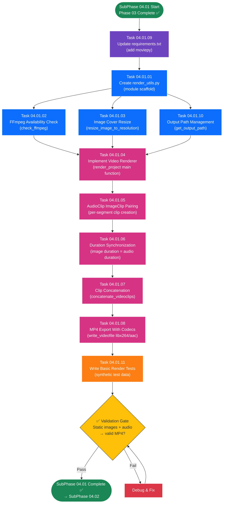

# SubPhase 04.01 — Basic Video Assembly

## Layer 2 Overview Document

---

| **Field**                | **Value**                                                                                                  |
| ------------------------ | ---------------------------------------------------------------------------------------------------------- |
| **Sub-Phase**            | 04.01 — Basic Video Assembly                                                                               |
| **Phase**                | Phase 04 — The Vision                                                                                      |
| **Layer**                | Layer 2 (Sub-Phase Overview)                                                                               |
| **Status**               | Not Started                                                                                                |
| **Parent Document**      | [Phase_04_Overview.md](../Phase_04_Overview.md) (Layer 1)                                                  |
| **Previous Sub-Phase**   | [SubPhase_03_03_Overview.md](../../Phase_03_The_Voice/SubPhase_03_03_Audio_Playback_UI/SubPhase_03_03_Overview.md) (Layer 2) |
| **Next Sub-Phase**       | [SubPhase_04_02_Overview.md](../SubPhase_04_02_Ken_Burns_Effect/SubPhase_04_02_Overview.md) (Layer 2)       |
| **Dependencies**         | Phase 03 complete (segments have `image_file` + `audio_file` + `audio_duration`)                           |
| **Estimated Task Docs**  | 11                                                                                                         |

---

## Table of Contents

- [SubPhase 04.01 — Basic Video Assembly](#subphase-0401--basic-video-assembly)
  - [Layer 2 Overview Document](#layer-2-overview-document)
  - [Table of Contents](#table-of-contents)
  - [1. Objective](#1-objective)
    - [What SubPhase 04.01 Delivers](#what-subphase-0401-delivers)
    - [What SubPhase 04.01 Does NOT Deliver](#what-subphase-0401-does-not-deliver)
  - [2. Scope](#2-scope)
    - [2.1 In Scope](#21-in-scope)
    - [2.2 Out of Scope](#22-out-of-scope)
  - [3. Technical Context](#3-technical-context)
    - [3.1 Prerequisites](#31-prerequisites)
    - [3.2 Technology Specs](#32-technology-specs)
    - [3.3 Key Code Samples \& Patterns](#33-key-code-samples--patterns)
  - [4. Task List](#4-task-list)
  - [5. Task Details](#5-task-details)
    - [5.1 Task 04.01.01 — Create Render Utils Module](#51-task-040101--create-render-utils-module)
    - [5.2 Task 04.01.02 — FFmpeg Availability Check](#52-task-040102--ffmpeg-availability-check)
    - [5.3 Task 04.01.03 — Image Cover Resize Logic](#53-task-040103--image-cover-resize-logic)
    - [5.4 Task 04.01.04 — Implement Video Renderer](#54-task-040104--implement-video-renderer)
    - [5.5 Task 04.01.05 — AudioClip ImageClip Pairing](#55-task-040105--audioclip-imageclip-pairing)
    - [5.6 Task 04.01.06 — Duration Synchronization](#56-task-040106--duration-synchronization)
    - [5.7 Task 04.01.07 — Clip Concatenation](#57-task-040107--clip-concatenation)
    - [5.8 Task 04.01.08 — MP4 Export With Codecs](#58-task-040108--mp4-export-with-codecs)
    - [5.9 Task 04.01.09 — Update Requirements Txt](#59-task-040109--update-requirements-txt)
    - [5.10 Task 04.01.10 — Output Path Management](#510-task-040110--output-path-management)
    - [5.11 Task 04.01.11 — Write Basic Render Tests](#511-task-040111--write-basic-render-tests)
  - [6. Execution Order](#6-execution-order)
    - [6.1 Dependency Chain](#61-dependency-chain)
    - [6.2 Recommended Sequence](#62-recommended-sequence)
    - [6.3 Execution Order Flowchart](#63-execution-order-flowchart)
    - [6.4 Parallel Work Opportunities](#64-parallel-work-opportunities)
  - [7. Files Created \& Modified](#7-files-created--modified)
  - [8. Validation Criteria](#8-validation-criteria)
    - [Render Utils Module](#render-utils-module)
    - [FFmpeg Check](#ffmpeg-check)
    - [Image Cover Resize](#image-cover-resize)
    - [Video Renderer](#video-renderer)
    - [Output Path](#output-path)
    - [MoviePy Dependency](#moviepy-dependency)
    - [Tests](#tests)
  - [9. Constraints](#9-constraints)
  - [10. Notes \& Gotchas](#10-notes--gotchas)
    - [MoviePy Version Compatibility](#moviepy-version-compatibility)
    - [FFmpeg Bundled vs System](#ffmpeg-bundled-vs-system)
    - [Memory Management with MoviePy](#memory-management-with-moviepy)
    - [WAV to AAC Conversion](#wav-to-aac-conversion)
    - [Windows-Specific File Locking](#windows-specific-file-locking)
    - [Static Images and Framerate](#static-images-and-framerate)
    - [ImageClip NumPy Array Requirements](#imageclip-numpy-array-requirements)
  - [11. Cross-References](#11-cross-references)
    - [Parent \& Ancestry](#parent--ancestry)
    - [Previous Sub-Phase](#previous-sub-phase)
    - [Next Sub-Phase](#next-sub-phase)
    - [Child Documents (Layer 3)](#child-documents-layer-3)

---

## 1. Objective

SubPhase 04.01 builds the **foundational video assembly pipeline** — the core rendering engine that takes static images and audio clips from each segment and concatenates them into a single, playable **MP4 video file**. This sub-phase proves the end-to-end rendering pipeline works **before** adding the visual complexity of Ken Burns effects (which come in SubPhase 04.02).

### What SubPhase 04.01 Delivers

1. **Render Utilities Module (`core_engine/render_utils.py`)** — A new utility module containing: FFmpeg availability checking, image "cover" resize logic, output path management, and temporary file cleanup.

2. **Functional Video Renderer (`core_engine/video_renderer.py`)** — Replaces the Phase 01 stub with a complete MoviePy-based implementation that loads each segment's image and audio, creates synchronized clips (static images, no Ken Burns yet), concatenates them in sequence order, and exports to MP4.

3. **Image Resizing ("Cover" Mode)** — A Pillow-based resize function that scales and center-crops any image to fill the exact target resolution (1920×1080 by default) without letterboxing or black bars.

4. **FFmpeg Validation** — A startup/lazy check that verifies FFmpeg is installed and on PATH, with clear error messages and installation instructions if missing.

5. **MoviePy Dependency** — `requirements.txt` updated with `moviepy>=1.0.3`.

6. **Basic Render Tests** — A test suite that validates the pipeline with synthetic test data (generated images + silence audio), covering image resizing, clip pairing, concatenation, and MP4 export.

### What SubPhase 04.01 Does NOT Deliver

> **Critical:** The following features are explicitly **out of scope** for SubPhase 04.01. AI agents must NOT implement these.

- ❌ Ken Burns zoom/pan effects (→ SubPhase 04.02)
- ❌ Pan direction selection (→ SubPhase 04.02)
- ❌ Image upscaling for zoom headroom (→ SubPhase 04.02)
- ❌ Render API endpoint (→ SubPhase 04.03)
- ❌ Render status/progress endpoint (→ SubPhase 04.03)
- ❌ Background render task integration with TaskManager (→ SubPhase 04.03)
- ❌ Frontend render UI (RenderButton, RenderProgress, VideoPreview) (→ SubPhase 04.03)
- ❌ Project status transitions (DRAFT → PROCESSING → COMPLETED) (→ SubPhase 04.03)
- ❌ Subtitle overlay (→ Phase 05)
- ❌ Crossfade transitions between clips (→ Phase 05)
- ❌ GlobalSettings editing UI (→ Phase 05)

At the conclusion of SubPhase 04.01, the `render_project()` function can be called programmatically (e.g., from tests or Django shell) to produce a valid MP4 from a project's segments. The render API endpoint and frontend UI come later.

---

## 2. Scope

### 2.1 In Scope

| Area                       | Details                                                                     |
| -------------------------- | --------------------------------------------------------------------------- |
| **New Module**             | `core_engine/render_utils.py` — FFmpeg check, cover resize, output paths, cleanup |
| **Stub Replacement**       | `core_engine/video_renderer.py` — Phase 01 stub replaced with full implementation |
| **Dependency Management**  | `requirements.txt` — Add `moviepy>=1.0.3`                                  |
| **Image Processing**       | Pillow-based "cover" resize: scale + center-crop to target resolution       |
| **Audio Loading**          | MoviePy `AudioFileClip` loading from `.wav` files                           |
| **Image-Audio Pairing**    | Each segment's image clip duration set to match its audio clip duration      |
| **Clip Concatenation**     | MoviePy `concatenate_videoclips` with `method="compose"`                    |
| **MP4 Export**             | `write_videofile` with `libx264` video, `aac` audio, `8000k` bitrate       |
| **Output Management**      | Output to `/media/projects/{project_id}/output/final.mp4`                   |
| **Error Handling**         | Missing files, FFmpeg errors, export failures — caught and reported         |
| **Basic Tests**            | Synthetic test data, aspect ratio coverage, concatenation validation        |

### 2.2 Out of Scope

| Area                       | Reason / Destination                                                        |
| -------------------------- | --------------------------------------------------------------------------- |
| Ken Burns zoom/pan effects | SubPhase 04.02 — Effect algorithm implemented separately                   |
| Render API endpoints       | SubPhase 04.03 — API built after pipeline is proven                         |
| Render progress tracking   | SubPhase 04.03 — TaskManager integration with progress callback             |
| Frontend render controls   | SubPhase 04.03 — UI built after API is ready                                |
| Project status transitions | SubPhase 04.03 — Status management with DRAFT → PROCESSING → COMPLETED     |
| Subtitle overlay           | Phase 05 — Requires MoviePy TextClip and ImageMagick                        |
| Crossfade transitions      | Phase 05 — Inter-clip transitions are a polish feature                      |
| Multiple output formats    | Future scope — MP4 only in Phase 04                                         |

---

## 3. Technical Context

### 3.1 Prerequisites

Before starting SubPhase 04.01, the following must be in place:

| Prerequisite                                     | Source                  | Verification                                                     |
| ------------------------------------------------ | ----------------------- | ---------------------------------------------------------------- |
| Django backend running at `localhost:8000`        | Phase 01                | `python manage.py runserver` succeeds                            |
| `Project` model with `resolution_width/height`, `framerate`, `output_path` fields | Phase 01 | `Project.objects.first()` returns model with all fields          |
| `Segment` model with `image_file`, `audio_file`, `audio_duration` fields | Phase 01 | `Segment._meta.get_field('image_file')` exists                   |
| `GlobalSettings` model with `zoom_intensity` field | Phase 01              | `GlobalSettings.objects.first().zoom_intensity` returns float    |
| Image upload pipeline functional                 | Phase 02 (SubPhase 02.02) | Segments have `image_file` values pointing to valid files on disk |
| TTS audio generation functional                  | Phase 03 (SubPhase 03.01) | Segments have `audio_file` values pointing to `.wav` files on disk |
| `audio_duration` populated for all segments with audio | Phase 03 (SubPhase 03.01) | `Segment.objects.filter(audio_duration__isnull=True).count() == 0` for segments with audio |
| `core_engine/video_renderer.py` stub exists      | Phase 01 (SubPhase 01.03) | File exists but contains only placeholder/stub implementation    |
| `core_engine/ken_burns.py` stub exists           | Phase 01 (SubPhase 01.03) | File exists — NOT modified in this sub-phase                     |
| FFmpeg installed on system PATH                  | System setup            | `ffmpeg -version` executes successfully in terminal              |
| Pillow installed                                 | Phase 01                | `import PIL` succeeds in Python                                  |
| NumPy installed                                  | Phase 03                | `import numpy` succeeds in Python                                |

### 3.2 Technology Specs

| Technology      | Version / Spec     | Usage in This Sub-Phase                                         |
| --------------- | ------------------ | --------------------------------------------------------------- |
| **MoviePy**     | ≥ 1.0.3            | `ImageClip`, `AudioFileClip`, `concatenate_videoclips`, `write_videofile` |
| **Pillow**      | ≥ 10.0             | `Image.open()`, `.resize()` with `LANCZOS`, `.convert('RGB')`, NumPy array conversion |
| **NumPy**       | ≥ 1.24             | Image arrays for MoviePy (H×W×3, uint8 dtype)                  |
| **FFmpeg**      | System binary       | Required by MoviePy for video encoding/decoding; must be on PATH |
| **Django**      | 5.x                | ORM queries for `Project` and `Segment` models                  |
| **Python**      | 3.11+              | Standard library: `subprocess`, `shutil`, `os`, `pathlib`, `logging` |

**MoviePy API Conventions (1.0.3):**

The following import pattern is used throughout SubPhase 04.01:

```python
from moviepy.editor import (
    ImageClip,
    AudioFileClip,
    concatenate_videoclips,
)
```

> **MoviePy 2.0 Note:** If using MoviePy 2.0, imports change to `from moviepy import ...` (no `.editor` submodule). The implementer must check the installed version and adapt accordingly. This document assumes MoviePy 1.0.3 conventions.

**Pillow Image → NumPy Array Conversion:**

MoviePy's `ImageClip` accepts a NumPy array (H×W×3, uint8). The conversion from Pillow:

```python
from PIL import Image
import numpy as np

pil_image = Image.open(path).convert("RGB")
image_array = np.array(pil_image)  # Shape: (height, width, 3), dtype: uint8
```

**FFmpeg Required Codecs:**

| Parameter      | Value      | Purpose                                   |
| -------------- | ---------- | ----------------------------------------- |
| `codec`        | `libx264`  | H.264 video compression (universal)       |
| `audio_codec`  | `aac`      | AAC audio compression                     |
| `bitrate`      | `8000k`    | High quality (8 Mbps) video bitrate       |
| `fps`          | Project's `framerate` (default 30) | Output frame rate               |

### 3.3 Key Code Samples & Patterns

**Pattern 1: Loading a Segment's Image as a Sized Clip**

```python
from moviepy.editor import ImageClip
from PIL import Image
import numpy as np

def create_image_clip(image_path: str, duration: float, width: int, height: int) -> ImageClip:
    """Load an image, resize to target resolution, create a clip with specified duration."""
    # 1. Load and resize with Pillow (cover mode — see Task 04.01.03)
    pil_image = Image.open(image_path).convert("RGB")
    resized = cover_resize(pil_image, width, height)  # Returns PIL Image
    
    # 2. Convert to NumPy array for MoviePy
    image_array = np.array(resized)  # (H, W, 3), uint8
    
    # 3. Create MoviePy ImageClip
    clip = ImageClip(image_array).set_duration(duration)
    return clip
```

**Pattern 2: Loading a Segment's Audio**

```python
from moviepy.editor import AudioFileClip

def load_audio_clip(audio_path: str) -> AudioFileClip:
    """Load an audio file as a MoviePy AudioFileClip."""
    audio_clip = AudioFileClip(audio_path)
    return audio_clip
```

**Pattern 3: Pairing Image + Audio into a Segment Clip**

```python
def create_segment_clip(image_path: str, audio_path: str, width: int, height: int) -> ImageClip:
    """Create a single segment clip: image displayed for audio duration."""
    audio_clip = AudioFileClip(audio_path)
    duration = audio_clip.duration
    
    image_clip = create_image_clip(image_path, duration, width, height)
    segment_clip = image_clip.set_audio(audio_clip)
    return segment_clip
```

**Pattern 4: Concatenation + Export**

```python
from moviepy.editor import concatenate_videoclips

def assemble_and_export(clips: list, output_path: str, fps: int = 30):
    """Concatenate clips and export to MP4."""
    final = concatenate_videoclips(clips, method="compose")
    final.write_videofile(
        output_path,
        fps=fps,
        codec="libx264",
        audio_codec="aac",
        bitrate="8000k",
        logger=None,  # Suppress MoviePy console output
    )
    # Clean up clips to free memory
    final.close()
    for clip in clips:
        clip.close()
```

**Pattern 5: Image "Cover" Resize Algorithm**

```python
from PIL import Image

def cover_resize(pil_image: Image.Image, target_width: int, target_height: int) -> Image.Image:
    """
    Resize image to fill target dimensions exactly (cover mode).
    Scales the image so the shorter dimension matches, then center-crops.
    Prevents letterboxing / black bars.
    """
    src_width, src_height = pil_image.size
    target_ratio = target_width / target_height
    src_ratio = src_width / src_height

    if src_ratio > target_ratio:
        # Image is wider than target: scale to match height, crop sides
        new_height = target_height
        new_width = int(src_width * (target_height / src_height))
    else:
        # Image is taller than target (or same ratio): scale to match width, crop top/bottom
        new_width = target_width
        new_height = int(src_height * (target_width / src_width))

    resized = pil_image.resize((new_width, new_height), Image.Resampling.LANCZOS)

    # Center-crop to exact target dimensions
    left = (new_width - target_width) // 2
    top = (new_height - target_height) // 2
    cropped = resized.crop((left, top, left + target_width, top + target_height))
    return cropped
```

**Pattern 6: FFmpeg Check**

```python
import shutil
import subprocess

def check_ffmpeg() -> bool:
    """Check if FFmpeg is installed and accessible on PATH."""
    if shutil.which("ffmpeg") is None:
        return False
    try:
        result = subprocess.run(
            ["ffmpeg", "-version"],
            capture_output=True,
            text=True,
            timeout=10,
        )
        return result.returncode == 0
    except (subprocess.TimeoutExpired, OSError):
        return False
```

**Pattern 7: Django ORM Access (Thread Safety)**

> Inherited from Phase 03 pattern: When accessing Django ORM from a non-request context (e.g., background thread), pass the **model ID** not the model instance. Re-query inside the function.

```python
from api.models import Project, Segment

def render_project(project_id: str, on_progress=None) -> dict:
    """Main render function. Receives project_id (UUID string), not a Project instance."""
    project = Project.objects.get(id=project_id)
    segments = Segment.objects.filter(project=project).order_by('sequence_index')
    # ... render logic ...
```

---

## 4. Task List

| Task ID     | Task Name                              | Layer 3 Document                                       | Est. Complexity |
| ----------- | -------------------------------------- | ------------------------------------------------------ | --------------- |
| 04.01.01    | Create Render Utils Module             | `Task_04_01_01_Create_Render_Utils_Module.md`          | Medium          |
| 04.01.02    | FFmpeg Availability Check              | `Task_04_01_02_FFmpeg_Availability_Check.md`           | Low             |
| 04.01.03    | Image Cover Resize Logic               | `Task_04_01_03_Image_Cover_Resize_Logic.md`            | Medium          |
| 04.01.04    | Implement Video Renderer               | `Task_04_01_04_Implement_Video_Renderer.md`            | High            |
| 04.01.05    | AudioClip ImageClip Pairing            | `Task_04_01_05_AudioClip_ImageClip_Pairing.md`         | Medium          |
| 04.01.06    | Duration Synchronization               | `Task_04_01_06_Duration_Synchronization.md`            | Medium          |
| 04.01.07    | Clip Concatenation                     | `Task_04_01_07_Clip_Concatenation.md`                  | Medium          |
| 04.01.08    | MP4 Export With Codecs                 | `Task_04_01_08_MP4_Export_With_Codecs.md`              | Medium          |
| 04.01.09    | Update Requirements Txt               | `Task_04_01_09_Update_Requirements_Txt.md`             | Low             |
| 04.01.10    | Output Path Management                 | `Task_04_01_10_Output_Path_Management.md`              | Low             |
| 04.01.11    | Write Basic Render Tests               | `Task_04_01_11_Write_Basic_Render_Tests.md`            | High            |

---

## 5. Task Details

### 5.1 Task 04.01.01 — Create Render Utils Module

**Objective:** Create the `core_engine/render_utils.py` module that provides utility functions for the entire Phase 04 rendering pipeline.

**File:** `backend/core_engine/render_utils.py` (NEW)

**Steps:**

1. Create the file `core_engine/render_utils.py` with the module docstring explaining its purpose.
2. Implement `check_ffmpeg() -> bool` — verifies FFmpeg is installed (see Task 04.01.02 for details).
3. Implement `resize_image_to_resolution(image_path: str, width: int, height: int) -> np.ndarray` — loads and resizes an image using "cover" mode (see Task 04.01.03 for the algorithm).
4. Implement `get_output_path(project_id: str) -> str` — returns the output file path and ensures the directory exists (see Task 04.01.10 for details).
5. Implement `cleanup_temp_files(temp_dir: str) -> None` — removes temporary files created during rendering.
6. Add proper imports: `PIL.Image`, `numpy`, `subprocess`, `shutil`, `os`, `pathlib`, `logging`.
7. Add a module-level logger: `logger = logging.getLogger(__name__)`.

**Key Details:**
- This module is the central utilities file for all of Phase 04. Tasks 04.01.02, 04.01.03, and 04.01.10 provide detailed specs for each function.
- All functions must be pure (no Django model access) except `get_output_path` which uses Django's `MEDIA_ROOT` setting.
- Every function must have comprehensive docstrings and type hints.

**Files Touched:**
- `backend/core_engine/render_utils.py` — NEW

---

### 5.2 Task 04.01.02 — FFmpeg Availability Check

**Objective:** Implement a reliable check for FFmpeg availability, with clear error reporting and installation guidance.

**File:** `backend/core_engine/render_utils.py` (function within)

**Steps:**

1. Implement `check_ffmpeg() -> bool`:
   - Use `shutil.which("ffmpeg")` for basic PATH lookup.
   - If found, run `subprocess.run(["ffmpeg", "-version"], ...)` to verify it actually executes.
   - Handle `subprocess.TimeoutExpired` (timeout: 10 seconds) and `OSError`.
   - Return `True` if FFmpeg is operational, `False` otherwise.

2. Implement `get_ffmpeg_error_message() -> str`:
   - Returns a human-readable error message with installation instructions.
   - Includes platform-specific guidance (Windows: choco/winget, Linux: apt, macOS: brew).
   - This message is used by the render endpoint (SubPhase 04.03) and can be logged.

3. Add a lazy initialization pattern:
   - Cache the FFmpeg check result after the first call (module-level flag).
   - Subsequent calls return the cached result without re-running the subprocess.
   - Provide `reset_ffmpeg_cache()` for testing purposes.

**Key Details:**
- The check should be **lazy** — not run at Django startup (which would slow down boot time). Instead, run it on the first call to `check_ffmpeg()` or on the first render attempt.
- The function must NOT raise exceptions — it returns a boolean. Error details are available via `get_ffmpeg_error_message()`.
- The `ffmpeg -version` command is preferred over `ffmpeg -h` because it exits immediately.

**Files Touched:**
- `backend/core_engine/render_utils.py` — Modified (add functions)

---

### 5.3 Task 04.01.03 — Image Cover Resize Logic

**Objective:** Implement the "cover" resize algorithm that scales and center-crops any image to fill the target resolution exactly, preventing letterboxing.

**File:** `backend/core_engine/render_utils.py` (function within)

**Steps:**

1. Implement `resize_image_to_resolution(image_path: str, width: int, height: int) -> np.ndarray`:
   - Load the image with `PIL.Image.open(image_path).convert("RGB")`.
   - Calculate the source and target aspect ratios.
   - **"Cover" mode logic:**
     - If `src_ratio > target_ratio` (image is wider): scale height to match target, crop sides.
     - If `src_ratio <= target_ratio` (image is taller or same): scale width to match target, crop top/bottom.
   - Resize using `Image.Resampling.LANCZOS` for high-quality downscaling.
   - Center-crop to the exact target dimensions (`left`, `top` offsets calculated from center).
   - Convert to NumPy array: `np.array(cropped_image)` → shape `(height, width, 3)`, dtype `uint8`.
   - Return the NumPy array.

2. Handle edge cases:
   - Image already matches target dimensions exactly → skip resize, just convert to NumPy.
   - Image is smaller than target in both dimensions → upscale using `LANCZOS` (no choice in SubPhase 04.01; Ken Burns in 04.02 handles this differently).
   - Image has alpha channel (RGBA) → `.convert("RGB")` strips alpha.
   - Image is grayscale → `.convert("RGB")` converts to 3 channels.
   - Corrupted or unreadable image → raise a descriptive `ValueError`.

3. Validate output:
   - Assert that the returned array shape is `(height, width, 3)`.
   - Assert dtype is `uint8`.

**Key Details:**
- The "cover" mode is the same algorithm used in CSS `object-fit: cover`. The image fills the entire target area with no black bars, at the cost of cropping some edges.
- `LANCZOS` is the highest-quality resampling filter in Pillow — preferred for both upscaling and downscaling.
- The returned NumPy array is directly usable as `ImageClip(array)` in MoviePy.

**Aspect Ratio Test Matrix:**

| Source Image        | Target (1920×1080) | Behavior                                   |
| ------------------- | ------------------ | ------------------------------------------ |
| 2560×1440 (16:9)    | 1920×1080          | Scale down proportionally, no crop          |
| 3000×1500 (2:1)     | 1920×1080          | Scale to 1920×960, crop top/bottom → 1920×1080... wait, recalc: target ratio 16:9 (1.78), src ratio 2.0 → src wider → scale height to 1080, width becomes 2160, crop sides → center crop 1920×1080 |
| 1600×1200 (4:3)     | 1920×1080          | src_ratio 1.33 < target 1.78 → scale width to 1920, height becomes 1440, crop top/bottom → center crop 1920×1080 |
| 1080×1080 (1:1)     | 1920×1080          | src_ratio 1.0 < target 1.78 → scale width to 1920, height becomes 1920, crop top/bottom → center crop 1920×1080 |
| 800×1200 (portrait) | 1920×1080          | src_ratio 0.67 < target 1.78 → scale width to 1920, height becomes 2880, crop top/bottom → center crop 1920×1080 |

**Files Touched:**
- `backend/core_engine/render_utils.py` — Modified (add function)

---

### 5.4 Task 04.01.04 — Implement Video Renderer

**Objective:** Replace the Phase 01 stub `core_engine/video_renderer.py` with a fully functional MoviePy-based rendering pipeline that creates a video from static images + audio.

**File:** `backend/core_engine/video_renderer.py` (REPLACED — stub becomes full implementation)

**Steps:**

1. **Replace** the entire contents of the stub file with the full implementation.

2. Implement the main function signature:
   ```python
   def render_project(project_id: str, on_progress: callable = None) -> dict:
   ```
   - `project_id` — UUID string of the project to render.
   - `on_progress` — Optional callback: `on_progress(current_segment: int, total_segments: int, phase: str)`. This callback is used by SubPhase 04.03 for progress tracking. In SubPhase 04.01, it is called but can be `None` for basic testing.
   - Returns a dict: `{ "output_path": str, "duration": float, "file_size": int }`.

3. Implement the rendering pipeline (within `render_project`):
   - **Step A:** Check FFmpeg availability via `render_utils.check_ffmpeg()`. Raise `RuntimeError` if missing.
   - **Step B:** Load the `Project` instance from the database.
   - **Step C:** Read project settings: `resolution_width`, `resolution_height`, `framerate`.
   - **Step D:** Query all segments ordered by `sequence_index`: `Segment.objects.filter(project=project).order_by('sequence_index')`.
   - **Step E:** Validate that all segments have `image_file` and `audio_file`. Raise `ValueError` with list of incomplete segment IDs if any are missing.
   - **Step F:** Get the output path via `render_utils.get_output_path(project_id)`.
   - **Step G:** For each segment (ordered loop):
     - Load audio: `AudioFileClip(segment.audio_file.path)`.
     - Get duration from audio clip: `audio_clip.duration`.
     - Load and resize image: `render_utils.resize_image_to_resolution(segment.image_file.path, width, height)`.
     - Create image clip: `ImageClip(image_array).set_duration(audio_clip.duration)`.
     - Set audio: `image_clip = image_clip.set_audio(audio_clip)`.
     - Append to clips list.
     - Call `on_progress(i + 1, total, f"Processing segment {i + 1}")` if callback provided.
   - **Step H:** Concatenate: `final = concatenate_videoclips(clips, method="compose")`.
   - **Step I:** Call progress callback: `on_progress(total, total, "Exporting final MP4...")`.
   - **Step J:** Export: `final.write_videofile(output_path, fps=framerate, codec="libx264", audio_codec="aac", bitrate="8000k", logger=None)`.
   - **Step K:** Clean up — close all clips and the final composite to free memory/file handles.
   - **Step L:** Calculate file size: `os.path.getsize(output_path)`.
   - **Step M:** Calculate total duration: `final.duration` (capture before closing).
   - **Step N:** Return the result dict.

4. Implement error handling:
   - Wrap the entire pipeline in try/except.
   - On any error: clean up partial files, close open clips, log the error.
   - Re-raise the exception so the caller (SubPhase 04.03's task function) can handle status updates.

5. Add proper logging throughout the function using `logging.getLogger(__name__)`.

**Key Details:**
- **No Ken Burns in this task.** Image clips are static — each frame displays the same resized image for the full audio duration. Ken Burns is added in SubPhase 04.02 by modifying the clip creation step.
- **No Project.status updates here.** The `render_project` function is a pure rendering function. Status management (DRAFT → PROCESSING → COMPLETED) is handled by SubPhase 04.03's API layer.
- **No Project.output_path update here.** The caller (SubPhase 04.03) handles persisting the output path.
- The function is designed to be **called from a background thread** (SubPhase 04.03), so it must not interact with Django in thread-unsafe ways. It re-queries the database at the start using the project_id.
- **`logger=None`** in `write_videofile` suppresses MoviePy's noisy tqdm progress bars. Progress is reported via the `on_progress` callback instead.

**Files Touched:**
- `backend/core_engine/video_renderer.py` — REPLACED (stub → implementation)

---

### 5.5 Task 04.01.05 — AudioClip ImageClip Pairing

**Objective:** Implement the logic that pairs each segment's audio with its corresponding image clip, ensuring they are correctly matched by segment identity.

**File:** `backend/core_engine/video_renderer.py` (within `render_project`)

**Steps:**

1. Within the per-segment loop in `render_project`:
   - Load the audio clip using the segment's `audio_file.path`.
   - Verify the audio file exists on disk before loading (`os.path.exists(segment.audio_file.path)`).
   - Load the image using the segment's `image_file.path`.
   - Verify the image file exists on disk before loading.
   - Create the image clip with the audio clip's duration.
   - Set audio on the image clip: `image_clip.set_audio(audio_clip)`.

2. Handle file-not-found scenarios:
   - If `segment.audio_file.path` does not exist on disk: raise `FileNotFoundError` with a message identifying the segment (ID and `sequence_index`).
   - If `segment.image_file.path` does not exist on disk: raise `FileNotFoundError` with a message identifying the segment.
   - These errors should propagate up and cause the render to fail with a clear error.

3. Handle audio loading errors:
   - If `AudioFileClip` raises an exception (corrupt file, unsupported format): catch, log the segment details, re-raise with context.

4. Handle image loading errors:
   - If `Image.open()` raises an exception (corrupt file): catch, log the segment details, re-raise with context.

**Key Details:**
- The pairing is 1:1 — each segment has exactly one image and one audio file.
- Segments are iterated in `sequence_index` order, so clips are naturally assembled in the correct narrative order.
- The `audio_file.path` and `image_file.path` attributes return the absolute file system path (Django `FieldFile.path` property).
- Audio files are `.wav` format (produced by Phase 03's TTS engine).
- Image files can be various formats (JPEG, PNG, WebP — Pillow handles all of these).

**Files Touched:**
- `backend/core_engine/video_renderer.py` — Modified (within `render_project` loop)

---

### 5.6 Task 04.01.06 — Duration Synchronization

**Objective:** Ensure that each image clip displays for exactly the same duration as its corresponding audio clip, achieving perfect audio-visual synchronization.

**File:** `backend/core_engine/video_renderer.py` (within `render_project`)

**Steps:**

1. For each segment clip, the duration is set using the **audio clip's actual duration** (not `Segment.audio_duration` from the database):
   ```python
   audio_clip = AudioFileClip(segment.audio_file.path)
   duration = audio_clip.duration  # Use this, not segment.audio_duration
   image_clip = ImageClip(image_array).set_duration(duration)
   ```

2. **Why use `audio_clip.duration` instead of `segment.audio_duration`?**
   - `segment.audio_duration` is stored in the database as a float, which may have rounding differences.
   - `audio_clip.duration` is the authoritative, exact duration as read by MoviePy/FFmpeg from the actual file.
   - Using the audio clip's own duration ensures that the image and audio are perfectly in sync within MoviePy's internal timeline.

3. Cross-validate: optionally log a warning if `abs(audio_clip.duration - segment.audio_duration) > 0.1` (more than 100ms difference), which would indicate a data inconsistency.

4. Handle edge cases:
   - Audio duration is 0 or negative: skip this segment with a warning (don't crash the entire render).
   - Audio duration is extremely long (> 60 seconds per segment): log a warning but proceed (this is a content issue, not a rendering issue).

**Key Details:**
- The synchronization rule is absolute: **image clip duration = audio clip duration**. No exceptions.
- This ensures that when clips are concatenated, each segment's narration plays exactly while its image is displayed.
- Phase 05's subtitle overlay will also use this same duration for timing subtitle display.
- MoviePy's `set_duration()` method creates a clip that holds the static image for the specified number of seconds.

**Files Touched:**
- `backend/core_engine/video_renderer.py` — Modified (within `render_project` loop)

---

### 5.7 Task 04.01.07 — Clip Concatenation

**Objective:** Implement the logic that joins all individual segment clips into a single, continuous video timeline.

**File:** `backend/core_engine/video_renderer.py` (within `render_project`)

**Steps:**

1. After all segment clips are created and stored in a list (`clips`), concatenate them:
   ```python
   from moviepy.editor import concatenate_videoclips
   final = concatenate_videoclips(clips, method="compose")
   ```

2. **Why `method="compose"`?**
   - `"compose"` handles clips that might have slightly different resolutions (though they should all be identical after our resize step).
   - `"chain"` requires all clips to be exactly the same size — more fragile.
   - `"compose"` is the safer, more defensive choice.

3. Validate the final clip:
   - Log the total duration: `final.duration`.
   - Log the total number of clips concatenated.
   - Verify `final.duration > 0` — raise an error if the result is empty.

4. Handle edge cases:
   - Empty clips list (no segments): raise a `ValueError("No segments to render")`.
   - Single clip: `concatenate_videoclips` handles this gracefully (returns the single clip).

**Key Details:**
- **No transitions in SubPhase 04.01 (or anywhere in Phase 04).** Clips are placed end-to-end with hard cuts. Crossfade transitions are a Phase 05 feature.
- The `clips` list must be in `sequence_index` order — this is guaranteed by the `order_by('sequence_index')` query in the per-segment loop.
- `concatenate_videoclips` returns a new `CompositeVideoClip` (or similar) that lazily references the original clips. The original clips must remain in memory until export is complete.

**Files Touched:**
- `backend/core_engine/video_renderer.py` — Modified (concatenation step)

---

### 5.8 Task 04.01.08 — MP4 Export With Codecs

**Objective:** Implement the final export step that writes the concatenated video to an MP4 file with the specified encoding parameters.

**File:** `backend/core_engine/video_renderer.py` (within `render_project`)

**Steps:**

1. Export the final concatenated clip:
   ```python
   final.write_videofile(
       output_path,
       fps=project.framerate,      # Default: 30
       codec="libx264",            # H.264 video codec
       audio_codec="aac",          # AAC audio codec
       bitrate="8000k",            # 8 Mbps video bitrate
       logger=None,                # Suppress MoviePy's tqdm bars
   )
   ```

2. Call the progress callback before export begins:
   ```python
   if on_progress:
       on_progress(total_segments, total_segments, "Exporting final MP4...")
   ```

3. After export completes:
   - Verify the output file exists: `os.path.exists(output_path)`.
   - Get the file size: `os.path.getsize(output_path)`.
   - Log the export summary: path, file size, duration.

4. Handle export errors:
   - `write_videofile` can raise `IOError` if the output directory is not writable.
   - `write_videofile` can raise `RuntimeError` if FFmpeg fails during encoding.
   - On any error: attempt to delete partial output file if it exists, then re-raise.

5. Clean up after export:
   - Close the final composite clip: `final.close()`.
   - Close all individual segment clips (both audio and image clips): loop through and call `.close()`.
   - This releases file handles and frees memory.

**Key Details:**
- **`logger=None`** is critical — without it, MoviePy spawns a tqdm progress bar that writes to stdout/stderr, which is inappropriate for a background task. Progress is communicated via the `on_progress` callback instead.
- **`bitrate="8000k"`** matches the architecture specification. This produces high-quality video suitable for YouTube uploads (~60 MB per minute of video at 1080p).
- **`codec="libx264"`** is the universal H.264 codec. It requires FFmpeg to be installed.
- **`audio_codec="aac"`** is the standard audio codec for MP4 containers. It re-encodes the `.wav` audio from Phase 03.
- The `fps` parameter uses the project's `framerate` field (default 30). For static images without Ken Burns, the actual FPS doesn't visually matter (every frame is identical), but it must be set correctly for Phase 05 when subtitles will have frame-level timing.

**Files Touched:**
- `backend/core_engine/video_renderer.py` — Modified (export step)

---

### 5.9 Task 04.01.09 — Update Requirements Txt

**Objective:** Add MoviePy to the project's Python dependencies.

**File:** `backend/requirements.txt` (MODIFIED)

**Steps:**

1. Add the MoviePy dependency after the Phase 03 packages:
   ```
   # Phase 04 — Video Rendering Dependencies
   moviepy>=1.0.3
   ```

2. Verify installation:
   ```bash
   cd backend
   pip install -r requirements.txt
   ```

3. Verify MoviePy imports successfully:
   ```python
   python -c "from moviepy.editor import ImageClip, AudioFileClip, concatenate_videoclips; print('MoviePy OK')"
   ```

4. Verify MoviePy can find FFmpeg:
   ```python
   python -c "from moviepy.config import get_setting; print(get_setting('FFMPEG_BINARY'))"
   ```

**Key Details:**
- MoviePy 1.0.3 is the stable version. The `>=1.0.3` specifier allows patch updates.
- MoviePy automatically installs its own dependencies: `decorator`, `tqdm`, `imageio`, `imageio-ffmpeg`, `proglog`, `numpy` (already installed).
- `imageio-ffmpeg` provides a bundled FFmpeg binary as a fallback. However, for reliability, the system FFmpeg is preferred and should be verified independently.
- This task should be executed **first** in the sub-phase since all other tasks depend on MoviePy being importable.

**Files Touched:**
- `backend/requirements.txt` — Modified (add moviepy)

---

### 5.10 Task 04.01.10 — Output Path Management

**Objective:** Implement the output path resolution and directory creation logic for rendered video files.

**File:** `backend/core_engine/render_utils.py` (function within)

**Steps:**

1. Implement `get_output_path(project_id: str) -> str`:
   - Build the output directory path: `{MEDIA_ROOT}/projects/{project_id}/output/`.
   - Create the directory if it doesn't exist: `os.makedirs(output_dir, exist_ok=True)`.
   - Return the full file path: `{output_dir}/final.mp4`.
   - Use `pathlib.Path` or `os.path.join` for cross-platform path construction.

2. Implement `cleanup_temp_files(temp_dir: str) -> None`:
   - Remove all files in the specified temporary directory.
   - If the directory itself is empty after cleanup, remove it.
   - Handle `FileNotFoundError` gracefully (directory may not exist).
   - Log each file removed.

3. Access Django's `MEDIA_ROOT` setting:
   ```python
   from django.conf import settings
   media_root = settings.MEDIA_ROOT
   ```

4. Handle edge cases:
   - `MEDIA_ROOT` is not set or is empty: raise `ValueError` with a clear message.
   - Output directory path contains special characters or spaces: use `pathlib.Path` for safe handling.
   - Insufficient disk permissions to create directory: let the `OSError` propagate with context.

**Key Details:**
- The output file is **always** named `final.mp4` — this is a constraint from [Phase_04_Overview.md](../Phase_04_Overview.md) (§10, constraint #15).
- The output directory `/media/projects/{project_id}/output/` was created as an empty directory in Phase 01 but may not exist if the project was created differently.
- Django's media serving (configured in Phase 01) already serves files from `MEDIA_ROOT`, so the rendered MP4 is automatically accessible via `http://localhost:8000/media/projects/{project_id}/output/final.mp4`.
- If a previous render exists (re-render scenario), the old `final.mp4` is **overwritten** by the new export. No versioning.

**Files Touched:**
- `backend/core_engine/render_utils.py` — Modified (add functions)

---

### 5.11 Task 04.01.11 — Write Basic Render Tests

**Objective:** Create a comprehensive test suite that validates the entire basic video assembly pipeline using synthetic test data.

**File:** `backend/api/tests.py` (MODIFIED — add new test class)

**Steps:**

1. Create a new test class: `class VideoRendererTests(TestCase):` (or in a separate test file if preferred).

2. **Test Setup (`setUp`):**
   - Create a test `Project` with `resolution_width=640`, `resolution_height=360`, `framerate=24` (small values for fast tests).
   - Create 3 test `Segment` objects with sequential `sequence_index`.
   - For each segment, generate:
     - A synthetic test image using Pillow: `Image.new("RGB", (800, 600), color=(R, G, B))`, save to a temp path.
     - A synthetic silent audio file using `soundfile`: `sf.write(path, np.zeros(24000), 24000, format='WAV')` (1 second of silence).
   - Set `image_file` and `audio_file` on each segment.
   - Ensure `audio_duration` is set (e.g., `1.0` seconds).

3. **Test: FFmpeg Check (`test_check_ffmpeg`):**
   - Call `render_utils.check_ffmpeg()`.
   - Assert it returns `True` (FFmpeg must be installed for tests to work).

4. **Test: Image Cover Resize — 16:9 Source (`test_cover_resize_16_9`):**
   - Create a 2560×1440 image.
   - Resize to 1920×1080.
   - Assert output array shape is `(1080, 1920, 3)`.
   - Assert dtype is `uint8`.

5. **Test: Image Cover Resize — 4:3 Source (`test_cover_resize_4_3`):**
   - Create a 1600×1200 image.
   - Resize to 1920×1080.
   - Assert output array shape is `(1080, 1920, 3)`.

6. **Test: Image Cover Resize — Square Source (`test_cover_resize_square`):**
   - Create a 1080×1080 image.
   - Resize to 1920×1080.
   - Assert output array shape is `(1080, 1920, 3)`.

7. **Test: Image Cover Resize — Portrait Source (`test_cover_resize_portrait`):**
   - Create an 800×1200 image.
   - Resize to 1920×1080.
   - Assert output array shape is `(1080, 1920, 3)`.

8. **Test: Output Path Management (`test_get_output_path`):**
   - Call `render_utils.get_output_path(project_id)`.
   - Assert the returned path ends with `/output/final.mp4`.
   - Assert the output directory was created on disk.

9. **Test: Single Segment Render (`test_render_single_segment`):**
   - Set up a project with 1 segment (image + audio).
   - Call `render_project(project_id)`.
   - Assert the output file exists.
   - Assert the result dict contains `output_path`, `duration`, `file_size`.
   - Assert `file_size > 0`.

10. **Test: Multi-Segment Render (`test_render_multiple_segments`):**
    - Use the 3-segment setup from `setUp`.
    - Call `render_project(project_id)`.
    - Assert the output file exists and is a valid MP4 (file size > 0).
    - Assert the total duration is approximately the sum of all audio durations (within 0.5s tolerance).

11. **Test: Progress Callback (`test_render_progress_callback`):**
    - Define a mock/list-based callback that records calls.
    - Call `render_project(project_id, on_progress=callback)`.
    - Assert the callback was called at least `total_segments + 1` times (once per segment + export phase).

12. **Test: Missing Image Raises Error (`test_render_missing_image`):**
    - Set one segment's `image_file` to a non-existent path.
    - Call `render_project(project_id)`.
    - Assert `FileNotFoundError` or `ValueError` is raised.

13. **Test: Missing Audio Raises Error (`test_render_missing_audio`):**
    - Set one segment's `audio_file` to a non-existent path.
    - Call `render_project(project_id)`.
    - Assert `FileNotFoundError` or `ValueError` is raised.

14. **Test Teardown (`tearDown`):**
    - Remove all temporary image, audio, and output files created during tests.
    - Clean up test database records.

**Key Details:**
- Tests use small resolutions (e.g., 640×360) and short audio (1 second) to keep test execution time reasonable (should complete in < 30 seconds total).
- Tests verify functional correctness, not visual quality. Checking that the MP4 file exists and has the expected duration/size is sufficient.
- The test project uses `framerate=24` (lower than default 30) for faster export.
- `soundfile` (installed in Phase 03) is used to generate synthetic `.wav` audio for testing.

**Files Touched:**
- `backend/api/tests.py` — Modified (add `VideoRendererTests` class)

---

## 6. Execution Order

### 6.1 Dependency Chain

| Task      | Depends On            | Reason                                                          |
| --------- | --------------------- | --------------------------------------------------------------- |
| 04.01.09  | —                     | Install MoviePy first — all other tasks need it importable      |
| 04.01.01  | 04.01.09              | Module file created; needs MoviePy imports available             |
| 04.01.02  | 04.01.01              | FFmpeg check function lives inside render_utils.py               |
| 04.01.03  | 04.01.01              | Cover resize function lives inside render_utils.py               |
| 04.01.10  | 04.01.01              | Output path function lives inside render_utils.py                |
| 04.01.04  | 04.01.02, 04.01.03, 04.01.10 | Video renderer depends on all utility functions             |
| 04.01.05  | 04.01.04              | AudioClip-ImageClip pairing is part of the renderer loop         |
| 04.01.06  | 04.01.05              | Duration sync refines the pairing logic                          |
| 04.01.07  | 04.01.06              | Concatenation requires all paired clips to be ready              |
| 04.01.08  | 04.01.07              | MP4 export follows concatenation                                 |
| 04.01.11  | 04.01.08              | Tests validate the complete pipeline end-to-end                  |

### 6.2 Recommended Sequence

| Order | Task ID  | Task Name                        | Why This Order                                               |
| ----- | -------- | -------------------------------- | ------------------------------------------------------------ |
| 1     | 04.01.09 | Update Requirements Txt          | MoviePy must be installable before any code is written       |
| 2     | 04.01.01 | Create Render Utils Module       | Creates the file scaffold for utility functions               |
| 3     | 04.01.02 | FFmpeg Availability Check        | First utility function — validates system prerequisite        |
| 4     | 04.01.03 | Image Cover Resize Logic         | Second utility function — core image processing              |
| 5     | 04.01.10 | Output Path Management           | Third utility function — file path resolution                |
| 6     | 04.01.04 | Implement Video Renderer         | Main pipeline — uses all utilities above                     |
| 7     | 04.01.05 | AudioClip ImageClip Pairing      | Detailed pairing logic within the renderer loop               |
| 8     | 04.01.06 | Duration Synchronization         | Precise synchronization within the pairing step               |
| 9     | 04.01.07 | Clip Concatenation               | Joins all segment clips into final timeline                   |
| 10    | 04.01.08 | MP4 Export With Codecs           | Final export step — produces the output file                 |
| 11    | 04.01.11 | Write Basic Render Tests         | Validates the entire pipeline end-to-end                     |

### 6.3 Execution Order Flowchart



### 6.4 Parallel Work Opportunities

After creating the `render_utils.py` module scaffold (Task 04.01.01), three tasks can be worked on in parallel since they are independent utility functions within the same file:

| Parallel Group | Tasks                                          | Reason for Parallelism                              |
| -------------- | ---------------------------------------------- | --------------------------------------------------- |
| **Group A**    | 04.01.02, 04.01.03, 04.01.10                  | Independent functions in render_utils.py — no inter-dependencies |

All remaining tasks (04.01.04 through 04.01.11) are **strictly sequential** — each builds on the output of the previous task.

---

## 7. Files Created & Modified

| File Path                                 | Action       | Created/Modified In | Purpose                                      |
| ----------------------------------------- | ------------ | ------------------- | -------------------------------------------- |
| `backend/core_engine/render_utils.py`     | **NEW**      | Task 04.01.01       | FFmpeg check, cover resize, output paths, cleanup |
| `backend/core_engine/video_renderer.py`   | **REPLACED** | Task 04.01.04       | Stub → full MoviePy rendering pipeline       |
| `backend/requirements.txt`                | MODIFIED     | Task 04.01.09       | Added `moviepy>=1.0.3`                       |
| `backend/api/tests.py`                    | MODIFIED     | Task 04.01.11       | Added `VideoRendererTests` class             |

**Summary:**
- 1 new file created
- 1 file replaced (stub → implementation)
- 2 files modified

---

## 8. Validation Criteria

### Render Utils Module

- [ ] `core_engine/render_utils.py` exists with all four functions: `check_ffmpeg`, `resize_image_to_resolution`, `get_output_path`, `cleanup_temp_files`.
- [ ] All functions have docstrings and type hints.
- [ ] Module-level logger is configured.

### FFmpeg Check

- [ ] `check_ffmpeg()` returns `True` when FFmpeg is installed.
- [ ] `check_ffmpeg()` returns `False` when FFmpeg is not found (can be tested by temporarily patching `shutil.which`).
- [ ] `get_ffmpeg_error_message()` returns a string with installation instructions.
- [ ] FFmpeg check result is cached after first call.
- [ ] `reset_ffmpeg_cache()` allows re-checking for testing.

### Image Cover Resize

- [ ] 16:9 source image → 1920×1080 output: correct shape, no black bars.
- [ ] 4:3 source image → 1920×1080 output: correct shape, sides or top/bottom cropped.
- [ ] 1:1 (square) source → 1920×1080 output: correct shape, top/bottom cropped.
- [ ] Portrait source → 1920×1080 output: correct shape, top/bottom cropped.
- [ ] Output is always a NumPy array of shape `(height, width, 3)` with dtype `uint8`.
- [ ] RGBA images are converted to RGB (no alpha channel in output).
- [ ] Images smaller than target are upscaled (not letterboxed).

### Video Renderer

- [ ] `video_renderer.render_project()` accepts `project_id` (str) and optional `on_progress` callback.
- [ ] Returns dict with `output_path`, `duration`, `file_size` keys.
- [ ] Loads segments in `sequence_index` order.
- [ ] All segment clips have duration matching their audio clip's duration.
- [ ] Concatenation produces a single continuous video.
- [ ] Export uses `libx264` video, `aac` audio, `8000k` bitrate.
- [ ] Output file is a valid, playable MP4.
- [ ] `on_progress` callback is called for each segment and for the export phase.
- [ ] Missing image file raises `FileNotFoundError` or `ValueError`.
- [ ] Missing audio file raises `FileNotFoundError` or `ValueError`.
- [ ] All clips and file handles are properly closed after rendering.

### Output Path

- [ ] `get_output_path()` returns path ending in `/output/final.mp4`.
- [ ] Output directory is created if it doesn't exist.
- [ ] Re-render overwrites existing `final.mp4` without error.

### MoviePy Dependency

- [ ] `moviepy>=1.0.3` is present in `requirements.txt`.
- [ ] `pip install -r requirements.txt` installs MoviePy successfully.
- [ ] `from moviepy.editor import ImageClip, AudioFileClip, concatenate_videoclips` works.

### Tests

- [ ] `VideoRendererTests` class exists with at least 10 test methods.
- [ ] Tests use synthetic data (generated images + silence audio).
- [ ] Tests use small resolutions for fast execution.
- [ ] All tests pass: `python manage.py test`.
- [ ] Test teardown cleans up all temporary files.

---

## 9. Constraints

| #  | Constraint                                                         | Source                                              |
| -- | ------------------------------------------------------------------ | --------------------------------------------------- |
| 1  | Do NOT implement Ken Burns effects — use static images only        | Phase_04_Overview.md §4.1 ("without Ken Burns")     |
| 2  | Do NOT build render API endpoints                                  | Deferred to SubPhase 04.03                          |
| 3  | Do NOT integrate with TaskManager background tasks                 | Deferred to SubPhase 04.03                          |
| 4  | Do NOT build any frontend components                               | Deferred to SubPhase 04.03                          |
| 5  | Do NOT update Project.status or Project.output_path in the renderer | Status management is SubPhase 04.03's responsibility |
| 6  | Do NOT modify any model definitions                                | Models are frozen from Phase 01                     |
| 7  | Do NOT add subtitle overlay                                        | Deferred to Phase 05                                |
| 8  | Do NOT add crossfade transitions                                   | Deferred to Phase 05                                |
| 9  | Do NOT require ImageMagick                                         | Not needed until Phase 05 (TextClip)                |
| 10 | Output file must always be named `final.mp4`                       | Phase_04_Overview.md §10, constraint #15            |
| 11 | Video codec must be `libx264`, audio `aac`, bitrate `8000k`        | Phase_04_Overview.md §10, constraint #13            |
| 12 | Use `method="compose"` for concatenation                           | Phase_04_Overview.md §4.1 key technical decisions   |
| 13 | Suppress MoviePy console output with `logger=None`                 | Phase_04_Overview.md §8.4                           |
| 14 | Pass project_id (not Project instance) to render_project           | Django ORM thread safety — Phase 03 pattern         |
| 15 | MoviePy version assumed: 1.0.3 API conventions                     | Phase_04_Overview.md §3.2                           |

---

## 10. Notes & Gotchas

### MoviePy Version Compatibility

MoviePy 1.0.3 and 2.0 have different import paths:
- **1.0.3:** `from moviepy.editor import ImageClip, AudioFileClip, concatenate_videoclips`
- **2.0:** `from moviepy import ImageClip, AudioFileClip, concatenate_videoclips`

The implementer should check the installed version and use the appropriate imports. A try/except pattern is acceptable:

```python
try:
    from moviepy.editor import ImageClip, AudioFileClip, concatenate_videoclips
except ImportError:
    from moviepy import ImageClip, AudioFileClip, concatenate_videoclips
```

### FFmpeg Bundled vs System

MoviePy's dependency `imageio-ffmpeg` bundles a minimal FFmpeg binary. However, the system FFmpeg is preferred because:
1. It supports more codecs and formats.
2. It's typically more up-to-date.
3. The bundled version may not work on all platforms.

The `check_ffmpeg()` function checks the system FFmpeg. If only the bundled version is available, MoviePy will still work but with potential limitations.

### Memory Management with MoviePy

MoviePy clips hold references to file handles and image data. Failing to close clips can cause:
- Memory leaks (especially with large images).
- File handle exhaustion on Windows (can't delete files that are still open).
- Temp directory cleanup failures.

Always close clips explicitly:
```python
try:
    # ... render logic ...
finally:
    final.close()
    for clip in clips:
        clip.close()
        if hasattr(clip, 'audio') and clip.audio:
            clip.audio.close()
```

### WAV to AAC Conversion

The `.wav` audio files from Phase 03's TTS engine are uncompressed PCM audio. When MoviePy exports with `audio_codec="aac"`, FFmpeg handles the WAV → AAC conversion automatically. No manual audio conversion step is needed.

### Windows-Specific File Locking

On Windows, open file handles prevent deletion. This affects:
- Re-rendering (overwriting `final.mp4`) while the previous file is open in a video player.
- Test teardown if clips aren't properly closed.

Solution: always close clips in a `try/finally` block, and add a small retry loop for file operations on Windows.

### Static Images and Framerate

In SubPhase 04.01, each segment's image clip is a static image (same frame repeated for the duration). The `fps` setting determines how many identical frames are generated per second. With static images:
- Higher FPS = larger file size (more frames, but all identical).
- Lower FPS = smaller file size.

The architecture specifies 30 FPS (the default). Even though it's wasteful for static images, this ensures compatibility with Ken Burns animation added in SubPhase 04.02, which requires 30 FPS for smooth motion.

### ImageClip NumPy Array Requirements

MoviePy's `ImageClip` requires the image array to be:
- Shape: `(height, width, 3)` — height first, then width (row-major).
- DType: `uint8` (values 0–255).
- Color channels: RGB (not BGR, not RGBA).

Pillow's `Image.open().convert("RGB")` followed by `np.array()` produces exactly this format. Do not use OpenCV (which produces BGR).

---

## 11. Cross-References

### Parent & Ancestry

| Document                                                                         | Relationship        | Key Sections Referenced                              |
| -------------------------------------------------------------------------------- | ------------------- | ---------------------------------------------------- |
| [Phase_04_Overview.md](../Phase_04_Overview.md)                                  | Parent (Layer 1)    | §4.1 (SubPhase 04.01 breakdown), §3.2 (MoviePy deps), §3.4 (Phase 03 baseline), §8.1 (render pipeline), §8.3 (image-audio sync), §8.4 (clip concat & export), §10 (constraints) |
| [00_Project_Overview.md](../../00_Project_Overview.md)                            | Grandparent (Layer 0) | §5.4 (Video Rendering Module), §3.2.1 (Project model), §3.2.2 (Segment model), §14 (Dev constraints) |

### Previous Sub-Phase

| Document                                                                                                              | Relationship              | Relevance                                            |
| --------------------------------------------------------------------------------------------------------------------- | ------------------------- | ---------------------------------------------------- |
| [SubPhase_03_03_Overview.md](../../Phase_03_The_Voice/SubPhase_03_03_Audio_Playback_UI/SubPhase_03_03_Overview.md)     | Previous Sub-Phase (Layer 2) | Final Phase 03 deliverable — audio playback UI is functional, segments have audio files + durations |

### Next Sub-Phase

| Document                                                                                        | Relationship          | Relevance                                                       |
| ----------------------------------------------------------------------------------------------- | --------------------- | --------------------------------------------------------------- |
| [SubPhase_04_02_Overview.md](../SubPhase_04_02_Ken_Burns_Effect/SubPhase_04_02_Overview.md)     | Next Sub-Phase (Layer 2) | Adds Ken Burns zoom/pan effects to the static image clips built here |

### Child Documents (Layer 3)

| Task Document                                                       | Task ID  | Task Name                       |
| ------------------------------------------------------------------- | -------- | ------------------------------- |
| `Task_04_01_01_Create_Render_Utils_Module.md`                       | 04.01.01 | Create Render Utils Module      |
| `Task_04_01_02_FFmpeg_Availability_Check.md`                        | 04.01.02 | FFmpeg Availability Check       |
| `Task_04_01_03_Image_Cover_Resize_Logic.md`                        | 04.01.03 | Image Cover Resize Logic        |
| `Task_04_01_04_Implement_Video_Renderer.md`                        | 04.01.04 | Implement Video Renderer        |
| `Task_04_01_05_AudioClip_ImageClip_Pairing.md`                     | 04.01.05 | AudioClip ImageClip Pairing     |
| `Task_04_01_06_Duration_Synchronization.md`                        | 04.01.06 | Duration Synchronization        |
| `Task_04_01_07_Clip_Concatenation.md`                              | 04.01.07 | Clip Concatenation              |
| `Task_04_01_08_MP4_Export_With_Codecs.md`                          | 04.01.08 | MP4 Export With Codecs          |
| `Task_04_01_09_Update_Requirements_Txt.md`                         | 04.01.09 | Update Requirements Txt         |
| `Task_04_01_10_Output_Path_Management.md`                          | 04.01.10 | Output Path Management          |
| `Task_04_01_11_Write_Basic_Render_Tests.md`                        | 04.01.11 | Write Basic Render Tests        |

---

> **End of SubPhase 04.01 Overview — Layer 2 Document**
>
> **Parent:** [Phase_04_Overview.md](../Phase_04_Overview.md) (Layer 1)
> **Layer 0:** [00_Project_Overview.md](../../00_Project_Overview.md)
> **Previous Sub-Phase:** [SubPhase_03_03_Overview.md](../../Phase_03_The_Voice/SubPhase_03_03_Audio_Playback_UI/SubPhase_03_03_Overview.md) (Layer 2)
> **Next Sub-Phase:** [SubPhase_04_02_Overview.md](../SubPhase_04_02_Ken_Burns_Effect/SubPhase_04_02_Overview.md) (Layer 2)
> **Next Step:** Generate the Layer 3 Task Documents listed in [Section 4](#4-task-list).
