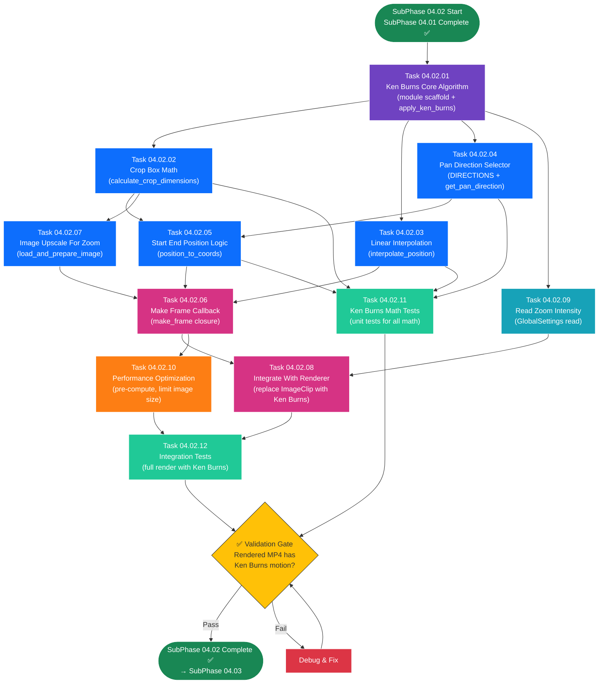

# SubPhase 04.02 — Ken Burns Effect Implementation

## Layer 2 Overview Document

---

| **Field**                | **Value**                                                                                                  |
| ------------------------ | ---------------------------------------------------------------------------------------------------------- |
| **Sub-Phase**            | 04.02 — Ken Burns Effect Implementation                                                                    |
| **Phase**                | Phase 04 — The Vision                                                                                      |
| **Layer**                | Layer 2 (Sub-Phase Overview)                                                                               |
| **Status**               | Not Started                                                                                                |
| **Parent Document**      | [Phase_04_Overview.md](../Phase_04_Overview.md) (Layer 1)                                                  |
| **Previous Sub-Phase**   | [SubPhase_04_01_Overview.md](../SubPhase_04_01_Basic_Video_Assembly/SubPhase_04_01_Overview.md) (Layer 2)   |
| **Next Sub-Phase**       | [SubPhase_04_03_Overview.md](../SubPhase_04_03_Render_Pipeline_Progress/SubPhase_04_03_Overview.md) (Layer 2) |
| **Dependencies**         | SubPhase 04.01 complete (basic video assembly works with static images)                                    |
| **Estimated Task Docs**  | 12                                                                                                         |

---

## Table of Contents

- [SubPhase 04.02 — Ken Burns Effect Implementation](#subphase-0402--ken-burns-effect-implementation)
  - [Layer 2 Overview Document](#layer-2-overview-document)
  - [Table of Contents](#table-of-contents)
  - [1. Objective](#1-objective)
    - [What SubPhase 04.02 Delivers](#what-subphase-0402-delivers)
    - [What SubPhase 04.02 Does NOT Deliver](#what-subphase-0402-does-not-deliver)
  - [2. Scope](#2-scope)
    - [2.1 In Scope](#21-in-scope)
    - [2.2 Out of Scope](#22-out-of-scope)
  - [3. Technical Context](#3-technical-context)
    - [3.1 Prerequisites](#31-prerequisites)
    - [3.2 Technology Specs](#32-technology-specs)
    - [3.3 Key Code Samples \& Patterns](#33-key-code-samples--patterns)
  - [4. Task List](#4-task-list)
  - [5. Task Details](#5-task-details)
    - [5.1 Task 04.02.01 — Ken Burns Core Algorithm](#51-task-040201--ken-burns-core-algorithm)
    - [5.2 Task 04.02.02 — Crop Box Math](#52-task-040202--crop-box-math)
    - [5.3 Task 04.02.03 — Linear Interpolation Function](#53-task-040203--linear-interpolation-function)
    - [5.4 Task 04.02.04 — Pan Direction Selector](#54-task-040204--pan-direction-selector)
    - [5.5 Task 04.02.05 — Start End Position Logic](#55-task-040205--start-end-position-logic)
    - [5.6 Task 04.02.06 — Make Frame Callback](#56-task-040206--make-frame-callback)
    - [5.7 Task 04.02.07 — Image Upscale For Zoom](#57-task-040207--image-upscale-for-zoom)
    - [5.8 Task 04.02.08 — Integrate With Renderer](#58-task-040208--integrate-with-renderer)
    - [5.9 Task 04.02.09 — Read Zoom Intensity Setting](#59-task-040209--read-zoom-intensity-setting)
    - [5.10 Task 04.02.10 — Performance Optimization](#510-task-040210--performance-optimization)
    - [5.11 Task 04.02.11 — Write Ken Burns Math Tests](#511-task-040211--write-ken-burns-math-tests)
    - [5.12 Task 04.02.12 — Write Integration Tests](#512-task-040212--write-integration-tests)
  - [6. Execution Order](#6-execution-order)
    - [6.1 Dependency Chain](#61-dependency-chain)
    - [6.2 Recommended Sequence](#62-recommended-sequence)
    - [6.3 Execution Order Flowchart](#63-execution-order-flowchart)
    - [6.4 Parallel Work Opportunities](#64-parallel-work-opportunities)
  - [7. Files Created \& Modified](#7-files-created--modified)
  - [8. Validation Criteria](#8-validation-criteria)
    - [Ken Burns Core Algorithm](#ken-burns-core-algorithm)
    - [Crop Box Math](#crop-box-math)
    - [Linear Interpolation](#linear-interpolation)
    - [Pan Direction Selector](#pan-direction-selector)
    - [Position Mapping](#position-mapping)
    - [Make Frame Callback](#make-frame-callback)
    - [Image Pre-Processing](#image-pre-processing)
    - [Renderer Integration](#renderer-integration)
    - [Performance](#performance)
    - [Tests](#tests)
  - [9. Constraints](#9-constraints)
  - [10. Notes \& Gotchas](#10-notes--gotchas)
    - [The "Center to Center" Direction](#the-center-to-center-direction)
    - [Floating-Point Precision in make\_frame](#floating-point-precision-in-make_frame)
    - [Memory Usage Considerations](#memory-usage-considerations)
    - [Ken Burns and Static Image Tests](#ken-burns-and-static-image-tests)
    - [NumPy Array Indexing Convention](#numpy-array-indexing-convention)
    - [Clip Lifecycle and Garbage Collection](#clip-lifecycle-and-garbage-collection)
    - [Deterministic vs. Random Pan Directions](#deterministic-vs-random-pan-directions)
  - [11. Cross-References](#11-cross-references)
    - [Parent \& Ancestry](#parent--ancestry)
    - [Previous Sub-Phase](#previous-sub-phase)
    - [Next Sub-Phase](#next-sub-phase)
    - [Child Documents (Layer 3)](#child-documents-layer-3)

---

## 1. Objective

SubPhase 04.02 implements the **Ken Burns zoom-and-pan effect algorithm** — the cinematic camera movement that brings static images to life by slowly zooming in/out and panning across them. This sub-phase replaces the static image clips produced by SubPhase 04.01 with animated clips where every frame is a unique, mathematically interpolated crop of the source image.

### What SubPhase 04.02 Delivers

1. **Ken Burns Algorithm Module (`core_engine/ken_burns.py`)** — Replaces the Phase 01 stub with a fully functional NumPy/Pillow-based implementation. The main function `apply_ken_burns()` takes an image, duration, resolution, zoom intensity, and FPS, and returns a MoviePy `VideoClip` whose `make_frame(t)` callback generates a unique frame for every time `t`.

2. **Crop Box Mathematics** — Functions that calculate the viewport (crop box) size from the target resolution and zoom intensity, ensuring the crop box is always smaller than the source image so the zoom effect is visible.

3. **Linear Interpolation Engine** — The core animation math: $P(t) = P_{\text{start}} + (P_{\text{end}} - P_{\text{start}}) \times \frac{t}{D}$ — smoothly interpolating the crop box position from a start point to an end point over the clip duration.

4. **Pan Direction Selector** — A deterministic direction-cycling function that ensures consecutive segments have different camera motions (zoom center-to-edge, top-left-to-bottom-right, etc.), creating visual variety.

5. **Image Pre-Processing for Zoom** — Logic to upscale source images that are too small for the target resolution × zoom intensity, ensuring Ken Burns never produces out-of-bounds crops or pixelated results.

6. **Renderer Integration** — Modification of `video_renderer.py` (from SubPhase 04.01) to use `apply_ken_burns()` instead of `ImageClip()`, so every segment now has animated camera motion.

7. **GlobalSettings Integration** — Reading the `zoom_intensity` value from the `GlobalSettings` model and passing it to the Ken Burns algorithm.

8. **Ken Burns Unit & Integration Tests** — Tests covering interpolation math, boundary conditions, pan direction cycling, extreme zoom values, and full render with Ken Burns enabled.

### What SubPhase 04.02 Does NOT Deliver

> **Critical:** The following features are explicitly **out of scope** for SubPhase 04.02. AI agents must NOT implement these.

- ❌ Render API endpoint (→ SubPhase 04.03)
- ❌ Render status/progress endpoint (→ SubPhase 04.03)
- ❌ Background render task integration with TaskManager (→ SubPhase 04.03)
- ❌ Frontend render UI (RenderButton, RenderProgress, VideoPreview) (→ SubPhase 04.03)
- ❌ Project status transitions (→ SubPhase 04.03)
- ❌ Easing curves (ease-in, ease-out) for the interpolation (→ future; linear only)
- ❌ User-configurable pan direction per segment (→ future; automatic cycling only)
- ❌ Subtitle overlay (→ Phase 05)
- ❌ Crossfade transitions (→ Phase 05)
- ❌ GlobalSettings editing UI (→ Phase 05)

At the conclusion of SubPhase 04.02, calling `render_project()` programmatically (from tests or Django shell) produces an MP4 where every segment has visible, smooth Ken Burns zoom/pan motion applied to its image.

---

## 2. Scope

### 2.1 In Scope

| Area                       | Details                                                                     |
| -------------------------- | --------------------------------------------------------------------------- |
| **Stub Replacement**       | `core_engine/ken_burns.py` — Phase 01 stub replaced with full implementation |
| **Algorithm Math**         | Crop box calculation, linear interpolation, position bounds checking         |
| **Pan Directions**         | 7 predefined camera motion paths, cycled per segment index                   |
| **Image Pre-Processing**   | Upscale images smaller than `resolution × zoom_intensity` with LANCZOS       |
| **Frame Generation**       | `make_frame(t)` callback: crop → resize → return NumPy array per frame      |
| **Renderer Integration**   | Replace `ImageClip(array).set_duration(d)` with `apply_ken_burns(...)` in `video_renderer.py` |
| **GlobalSettings Read**    | Fetch `zoom_intensity` from database and pass to Ken Burns function          |
| **Performance**            | Pre-compute positions, NumPy slicing, limit working image size               |
| **Unit Tests**             | Math verification, boundary tests, direction cycling, extreme zoom values    |
| **Integration Tests**      | Full render pipeline with Ken Burns → valid MP4 with visible motion          |

### 2.2 Out of Scope

| Area                       | Reason / Destination                                                        |
| -------------------------- | --------------------------------------------------------------------------- |
| Render API endpoints       | SubPhase 04.03 — API built after pipeline produces correct Ken Burns output  |
| Frontend render controls   | SubPhase 04.03 — UI built after API is ready                                |
| Project status transitions | SubPhase 04.03 — Status management handled at API layer                     |
| Easing curves              | Future scope — linear interpolation only in Phase 04                        |
| Per-segment direction config | Future scope — automatic cycling based on sequence_index only             |
| Subtitle overlay           | Phase 05 — Requires MoviePy TextClip and ImageMagick                        |
| Crossfade transitions      | Phase 05 — Inter-clip transitions are a polish feature                      |
| GlobalSettings editing UI  | Phase 05 — User cannot change zoom_intensity from the browser yet           |

---

## 3. Technical Context

### 3.1 Prerequisites

Before starting SubPhase 04.02, the following must be in place:

| Prerequisite                                               | Source                    | Verification                                                     |
| ---------------------------------------------------------- | ------------------------- | ---------------------------------------------------------------- |
| SubPhase 04.01 complete — basic video assembly works       | SubPhase 04.01            | `render_project()` produces valid MP4 from static images + audio |
| `core_engine/render_utils.py` exists with all functions    | SubPhase 04.01 (Task 01)  | `check_ffmpeg`, `resize_image_to_resolution`, `get_output_path`, `cleanup_temp_files` |
| `core_engine/video_renderer.py` is a full implementation   | SubPhase 04.01 (Task 04)  | `render_project(project_id)` runs successfully                   |
| MoviePy installed (`moviepy>=1.0.3`)                       | SubPhase 04.01 (Task 09)  | `from moviepy.editor import VideoClip` succeeds                  |
| FFmpeg installed and verified                              | SubPhase 04.01 (Task 02)  | `render_utils.check_ffmpeg()` returns `True`                     |
| Pillow installed                                           | Phase 01                  | `from PIL import Image` succeeds                                 |
| NumPy installed                                            | Phase 03                  | `import numpy as np` succeeds                                    |
| `core_engine/ken_burns.py` stub exists                     | Phase 01 (SubPhase 01.03) | File exists but contains only placeholder/stub implementation    |
| `GlobalSettings` model with `zoom_intensity` field (default 1.3) | Phase 01            | `GlobalSettings.objects.first().zoom_intensity` returns `1.3`    |
| Segments with `image_file` and `audio_file` populated      | Phases 02 & 03            | Test project has segments with valid image and audio files        |

### 3.2 Technology Specs

| Technology      | Version / Spec     | Usage in This Sub-Phase                                         |
| --------------- | ------------------ | --------------------------------------------------------------- |
| **NumPy**       | ≥ 1.24             | Array slicing for crop operations, image data manipulation, `np.array`, `Image.fromarray` |
| **Pillow**      | ≥ 10.0             | Image loading, resizing (LANCZOS), upscaling, `Image.fromarray` for crop-to-resize |
| **MoviePy**     | ≥ 1.0.3            | `VideoClip(make_frame, duration).set_fps(fps)` — custom frame generator |
| **Django**      | 5.x                | `GlobalSettings.objects.first()` — read `zoom_intensity`        |
| **Python**      | 3.11+              | `random`, `math`, `logging`, type hints                          |

**MoviePy `VideoClip` with Custom `make_frame`:**

Unlike `ImageClip` (which shows the same image every frame), `VideoClip` with a custom `make_frame(t)` generates a **unique frame** for every time `t`. This is how the Ken Burns animation works:

```python
from moviepy.editor import VideoClip

def make_frame(t):
    """Called for every frame at time t (seconds). Returns NumPy array (H, W, 3)."""
    # ... compute crop position based on t ...
    return frame_array  # (height, width, 3), uint8

clip = VideoClip(make_frame, duration=5.0).set_fps(30)
# At 30 FPS with 5s duration: make_frame is called 150 times (t=0.0, 0.033, 0.067, ...)
```

### 3.3 Key Code Samples & Patterns

**Pattern 1: The Ken Burns Core Algorithm**

> Source: [Phase_04_Overview.md](../Phase_04_Overview.md) §8.2

```python
def apply_ken_burns(
    image_path: str,
    duration: float,
    resolution: tuple[int, int],
    zoom_intensity: float = 1.3,
    fps: int = 30,
    segment_index: int = 0,
) -> VideoClip:
    """
    Apply Ken Burns zoom/pan effect to a static image.
    
    Returns a MoviePy VideoClip with animated camera motion.
    """
    w_out, h_out = resolution
    
    # 1. Load and pre-process the image
    source_image = load_and_prepare_image(image_path, resolution, zoom_intensity)
    img_h, img_w = source_image.shape[:2]
    
    # 2. Calculate crop box dimensions
    w_crop = int(w_out / zoom_intensity)
    h_crop = int(h_out / zoom_intensity)
    
    # 3. Select pan direction based on segment index
    start_pos, end_pos = get_pan_direction(segment_index, img_w, img_h, w_crop, h_crop)
    
    # 4. Create frame generator
    def make_frame(t):
        x = start_pos[0] + (end_pos[0] - start_pos[0]) * (t / duration)
        y = start_pos[1] + (end_pos[1] - start_pos[1]) * (t / duration)
        
        # Crop the region
        crop = source_image[int(y):int(y + h_crop), int(x):int(x + w_crop)]
        
        # Resize crop to output resolution
        pil_crop = Image.fromarray(crop)
        resized = pil_crop.resize((w_out, h_out), Image.Resampling.LANCZOS)
        return np.array(resized)
    
    # 5. Return as VideoClip
    clip = VideoClip(make_frame, duration=duration).set_fps(fps)
    return clip
```

**Pattern 2: Crop Box Calculation**

$$W_{\text{crop}} = \frac{W_{\text{output}}}{Z}, \quad H_{\text{crop}} = \frac{H_{\text{output}}}{Z}$$

For $Z = 1.3$ and 1920×1080 output:
$$W_{\text{crop}} = \frac{1920}{1.3} \approx 1477, \quad H_{\text{crop}} = \frac{1080}{1.3} \approx 831$$

The crop box is smaller than the output resolution. When this smaller region is resized back to 1920×1080, the image appears "zoomed in" by the zoom intensity factor.

**Pattern 3: Linear Interpolation**

For every frame at time $t$:

$$x(t) = x_{\text{start}} + (x_{\text{end}} - x_{\text{start}}) \times \frac{t}{D}$$
$$y(t) = y_{\text{start}} + (y_{\text{end}} - y_{\text{start}}) \times \frac{t}{D}$$

Where:
- $(x_{\text{start}}, y_{\text{start}})$ = top-left corner of the crop box at $t = 0$
- $(x_{\text{end}}, y_{\text{end}})$ = top-left corner of the crop box at $t = D$ (duration)
- $D$ = clip duration in seconds

At $t = 0$: position = start. At $t = D$: position = end. Movement is **linear** (constant velocity).

**Pattern 4: Pan Direction Definitions**

Seven predefined camera motion paths, selected by cycling `segment_index % 7`:

```python
DIRECTIONS = [
    ("center",       "center"),        # 0: Subtle zoom only (no pan)
    ("top_left",     "bottom_right"),   # 1: Diagonal sweep TL → BR
    ("bottom_right", "top_left"),       # 2: Diagonal sweep BR → TL
    ("top_right",    "bottom_left"),    # 3: Diagonal sweep TR → BL
    ("bottom_left",  "top_right"),      # 4: Diagonal sweep BL → TR
    ("center",       "top_left"),       # 5: Zoom out + pan to TL
    ("center",       "bottom_right"),   # 6: Zoom out + pan to BR
]
```

**Pattern 5: Position-to-Coordinates Mapping**

Each named position ("center", "top_left", etc.) maps to pixel coordinates based on the image dimensions and crop box size:

```python
def position_to_coords(
    position: str, img_w: int, img_h: int, crop_w: int, crop_h: int
) -> tuple[int, int]:
    """Convert a named position to (x, y) pixel coordinates for the crop box top-left corner."""
    max_x = img_w - crop_w  # Maximum x offset
    max_y = img_h - crop_h  # Maximum y offset
    
    positions = {
        "center":       (max_x // 2, max_y // 2),
        "top_left":     (0, 0),
        "top_right":    (max_x, 0),
        "bottom_left":  (0, max_y),
        "bottom_right": (max_x, max_y),
    }
    return positions[position]
```

**Pattern 6: Image Pre-Processing for Zoom Headroom**

The source image must be at least `W_output × H_output` pixels (ideally `W_output × Z × H_output × Z`). If smaller, upscale:

```python
def load_and_prepare_image(
    image_path: str,
    resolution: tuple[int, int],
    zoom_intensity: float,
) -> np.ndarray:
    """Load image and upscale if needed to provide zoom headroom."""
    pil_image = Image.open(image_path).convert("RGB")
    w_out, h_out = resolution
    
    # Minimum dimensions needed for Ken Burns with this zoom intensity
    min_w = int(w_out * zoom_intensity)
    min_h = int(h_out * zoom_intensity)
    
    src_w, src_h = pil_image.size
    
    if src_w < min_w or src_h < min_h:
        # Calculate scale factor to meet minimum dimensions
        scale_w = min_w / src_w
        scale_h = min_h / src_h
        scale = max(scale_w, scale_h)
        
        new_w = int(src_w * scale)
        new_h = int(src_h * scale)
        pil_image = pil_image.resize((new_w, new_h), Image.Resampling.LANCZOS)
    
    return np.array(pil_image)
```

**Pattern 7: Integrating Ken Burns into Video Renderer**

In `video_renderer.py`, replace the static `ImageClip` creation with `apply_ken_burns`:

```python
# BEFORE (SubPhase 04.01 — static image):
image_array = render_utils.resize_image_to_resolution(
    segment.image_file.path, width, height
)
image_clip = ImageClip(image_array).set_duration(audio_clip.duration)

# AFTER (SubPhase 04.02 — Ken Burns animation):
from core_engine.ken_burns import apply_ken_burns

ken_burns_clip = apply_ken_burns(
    image_path=segment.image_file.path,
    duration=audio_clip.duration,
    resolution=(width, height),
    zoom_intensity=zoom_intensity,  # From GlobalSettings
    fps=project.framerate,
    segment_index=segment.sequence_index,
)
```

---

## 4. Task List

| Task ID     | Task Name                              | Layer 3 Document                                       | Est. Complexity |
| ----------- | -------------------------------------- | ------------------------------------------------------ | --------------- |
| 04.02.01    | Ken Burns Core Algorithm               | `Task_04_02_01_Ken_Burns_Core_Algorithm.md`            | High            |
| 04.02.02    | Crop Box Math                          | `Task_04_02_02_Crop_Box_Math.md`                       | Medium          |
| 04.02.03    | Linear Interpolation Function          | `Task_04_02_03_Linear_Interpolation_Function.md`       | Medium          |
| 04.02.04    | Pan Direction Selector                 | `Task_04_02_04_Pan_Direction_Selector.md`              | Medium          |
| 04.02.05    | Start End Position Logic               | `Task_04_02_05_Start_End_Position_Logic.md`            | Medium          |
| 04.02.06    | Make Frame Callback                    | `Task_04_02_06_Make_Frame_Callback.md`                 | High            |
| 04.02.07    | Image Upscale For Zoom                 | `Task_04_02_07_Image_Upscale_For_Zoom.md`              | Medium          |
| 04.02.08    | Integrate With Renderer                | `Task_04_02_08_Integrate_With_Renderer.md`             | Medium          |
| 04.02.09    | Read Zoom Intensity Setting            | `Task_04_02_09_Read_Zoom_Intensity_Setting.md`         | Low             |
| 04.02.10    | Performance Optimization               | `Task_04_02_10_Performance_Optimization.md`            | High            |
| 04.02.11    | Write Ken Burns Math Tests             | `Task_04_02_11_Write_Ken_Burns_Math_Tests.md`          | Medium          |
| 04.02.12    | Write Integration Tests                | `Task_04_02_12_Write_Integration_Tests.md`             | High            |

---

## 5. Task Details

### 5.1 Task 04.02.01 — Ken Burns Core Algorithm

**Objective:** Replace the Phase 01 stub `core_engine/ken_burns.py` with a fully functional Ken Burns effect module containing the main `apply_ken_burns()` function.

**File:** `backend/core_engine/ken_burns.py` (REPLACED — stub becomes full implementation)

**Steps:**

1. **Replace** the entire contents of the stub file with the full implementation.

2. Define the module structure:
   - Module docstring explaining the Ken Burns effect and its mathematical basis.
   - Imports: `PIL.Image`, `numpy`, `logging`, MoviePy `VideoClip`.
   - Module-level logger: `logger = logging.getLogger(__name__)`.
   - Constants: `DIRECTIONS` list (see Task 04.02.04).

3. Implement the main function signature:
   ```python
   def apply_ken_burns(
       image_path: str,
       duration: float,
       resolution: tuple[int, int],
       zoom_intensity: float = 1.3,
       fps: int = 30,
       segment_index: int = 0,
   ) -> VideoClip:
   ```
   - `image_path` — Absolute path to the source image file.
   - `duration` — Clip duration in seconds (from audio clip).
   - `resolution` — Target output resolution as `(width, height)`.
   - `zoom_intensity` — Zoom factor from `GlobalSettings` (default 1.3).
   - `fps` — Frame rate (from project `framerate`).
   - `segment_index` — Used for deterministic pan direction cycling.
   - Returns a MoviePy `VideoClip` with `make_frame` callback and FPS set.

4. The function body orchestrates the algorithm steps:
   - Step A: Load and prepare image (Task 04.02.07).
   - Step B: Calculate crop box dimensions (Task 04.02.02).
   - Step C: Select pan direction (Task 04.02.04).
   - Step D: Compute start/end positions (Task 04.02.05).
   - Step E: Define `make_frame(t)` (Task 04.02.06).
   - Step F: Return `VideoClip(make_frame, duration=duration).set_fps(fps)`.

5. Handle MoviePy version differences for import:
   ```python
   try:
       from moviepy.editor import VideoClip
   except ImportError:
       from moviepy import VideoClip
   ```

**Key Details:**
- This file is a **complete replacement** of the stub — not a modification. The stub content is discarded entirely.
- The function is pure computation (no Django model access). It receives all parameters as function arguments.
- The `apply_ken_burns` function must be importable: `from core_engine.ken_burns import apply_ken_burns`.
- All helper functions (crop math, interpolation, position mapping, image prep) live in this same module as private functions or module-level functions.

**Files Touched:**
- `backend/core_engine/ken_burns.py` — REPLACED (stub → implementation)

---

### 5.2 Task 04.02.02 — Crop Box Math

**Objective:** Implement the crop box dimension calculation that determines the viewport size at maximum zoom.

**File:** `backend/core_engine/ken_burns.py` (function within)

**Steps:**

1. Implement `calculate_crop_dimensions(output_width: int, output_height: int, zoom_intensity: float) -> tuple[int, int]`:
   - Calculate:
     $$W_{\text{crop}} = \lfloor \frac{W_{\text{output}}}{Z} \rfloor$$
     $$H_{\text{crop}} = \lfloor \frac{H_{\text{output}}}{Z} \rfloor$$
   - Return `(crop_width, crop_height)`.

2. Validate inputs:
   - `zoom_intensity` must be > 0. Raise `ValueError` if ≤ 0.
   - `zoom_intensity` = 1.0 means no zoom (crop = output size). This is valid but produces no zoom effect (only pan).
   - `zoom_intensity` > 1.0 produces zoom-in effect. The higher the value, the more zoomed in.
   - `zoom_intensity` < 1.0 would mean the crop is larger than the output (zoom-out), which is unusual but technically valid.

3. Validate that the crop dimensions are positive:
   - Both `crop_width` and `crop_height` must be ≥ 1.

**Key Details:**
- The crop box is always **smaller** than (or equal to, if Z=1.0) the output resolution. This is the mathematical basis of the zoom effect: a smaller region of the source image is enlarged to fill the full output frame.
- For the default values ($Z = 1.3$, output 1920×1080): $W_{\text{crop}} = 1476$, $H_{\text{crop}} = 830$.
- Integer floor division prevents sub-pixel dimensions. The slight rounding (1-2 pixels) is visually imperceptible.

**Files Touched:**
- `backend/core_engine/ken_burns.py` — Modified (add function)

---

### 5.3 Task 04.02.03 — Linear Interpolation Function

**Objective:** Implement the core linear interpolation function that calculates the crop box position for any given time `t`.

**File:** `backend/core_engine/ken_burns.py` (function within)

**Steps:**

1. Implement `interpolate_position(start: tuple[float, float], end: tuple[float, float], t: float, duration: float) -> tuple[float, float]`:
   ```python
   def interpolate_position(
       start: tuple[float, float],
       end: tuple[float, float],
       t: float,
       duration: float,
   ) -> tuple[float, float]:
       """
       Linear interpolation between start and end positions.
       
       At t=0: returns start.
       At t=duration: returns end.
       At t=duration/2: returns midpoint.
       """
       if duration <= 0:
           return start
       progress = t / duration
       # Clamp progress to [0, 1] to handle floating-point edge cases
       progress = max(0.0, min(1.0, progress))
       x = start[0] + (end[0] - start[0]) * progress
       y = start[1] + (end[1] - start[1]) * progress
       return (x, y)
   ```

2. Handle edge cases:
   - `duration = 0`: return `start` position (no interpolation possible).
   - `t < 0`: clamp to `start` (should not happen in practice, but be defensive).
   - `t > duration`: clamp to `end` (MoviePy may call `make_frame` slightly past duration).
   - `start == end`: returns the same position for all `t` (pure zoom, no pan).

3. Verify mathematical properties:
   - `interpolate_position(start, end, 0, D)` == `start` (exactly).
   - `interpolate_position(start, end, D, D)` == `end` (exactly).
   - `interpolate_position(start, end, D/2, D)` == midpoint of `start` and `end`.
   - The function is monotonically increasing (or decreasing) between start and end.

**Key Details:**
- This is the simplest form of interpolation — constant-velocity linear motion. No easing curves (ease-in/ease-out) are used in Phase 04. Easing may be added as a future enhancement.
- The `progress` clamping to `[0, 1]` is critical for robustness. MoviePy occasionally calls `make_frame` with `t` values slightly outside the expected range due to floating-point arithmetic.
- The function operates on floating-point coordinates. The caller (`make_frame`) truncates to integers when using them as array indices.

**Files Touched:**
- `backend/core_engine/ken_burns.py` — Modified (add function)

---

### 5.4 Task 04.02.04 — Pan Direction Selector

**Objective:** Implement the deterministic pan direction selector that cycles through 7 predefined camera motion paths based on the segment's `sequence_index`.

**File:** `backend/core_engine/ken_burns.py` (function and constant within)

**Steps:**

1. Define the `DIRECTIONS` constant — a list of 7 `(start_position_name, end_position_name)` tuples:
   ```python
   DIRECTIONS = [
       ("center",       "center"),        # 0: Subtle zoom only (no pan movement)
       ("top_left",     "bottom_right"),   # 1: Diagonal pan TL → BR
       ("bottom_right", "top_left"),       # 2: Diagonal pan BR → TL (reverse of 1)
       ("top_right",    "bottom_left"),    # 3: Diagonal pan TR → BL
       ("bottom_left",  "top_right"),      # 4: Diagonal pan BL → TR (reverse of 3)
       ("center",       "top_left"),       # 5: Pan from center outward to TL
       ("center",       "bottom_right"),   # 6: Pan from center outward to BR
   ]
   ```

2. Implement `get_pan_direction(segment_index: int) -> tuple[str, str]`:
   ```python
   def get_pan_direction(segment_index: int) -> tuple[str, str]:
       """
       Select a pan direction based on the segment's sequence index.
       
       Cycles through DIRECTIONS deterministically so consecutive
       segments have different camera movements.
       """
       direction_index = segment_index % len(DIRECTIONS)
       return DIRECTIONS[direction_index]
   ```

3. Verify cycling behavior:
   - Segment 0 → direction 0 ("center" → "center") — zoom only.
   - Segment 1 → direction 1 ("top_left" → "bottom_right") — diagonal pan.
   - Segment 6 → direction 6 ("center" → "bottom_right").
   - Segment 7 → direction 0 again (cycle wraps).

**Key Details:**
- The direction selection is **deterministic** — the same segment index always produces the same direction. This means re-rendering the same project produces identical results.
- The modulo cycling ensures visual variety: consecutive segments always have different camera motions, which creates a more engaging viewing experience.
- Direction 0 ("center" → "center") is special: since start and end are the same, the interpolation produces no pan movement. However, the zoom effect (crop smaller than output, then resize) still creates a subtle "zoomed-in" static effect, which is intentionally different from no Ken Burns at all.
- The number 7 was chosen to provide sufficient variety. For a typical story with 10–20 segments, most directions appear at least once.

**Files Touched:**
- `backend/core_engine/ken_burns.py` — Modified (add constant and function)

---

### 5.5 Task 04.02.05 — Start End Position Logic

**Objective:** Implement the mapping from named position strings ("center", "top_left", etc.) to actual pixel coordinates for the crop box's top-left corner.

**File:** `backend/core_engine/ken_burns.py` (function within)

**Steps:**

1. Implement `position_to_coords(position: str, img_w: int, img_h: int, crop_w: int, crop_h: int) -> tuple[int, int]`:
   - Calculate the maximum allowable offset in each direction:
     - `max_x = img_w - crop_w` — rightmost position for the crop box.
     - `max_y = img_h - crop_h` — bottommost position for the crop box.
   - Map each named position to coordinates:
     ```python
     positions = {
         "center":       (max_x // 2, max_y // 2),
         "top_left":     (0, 0),
         "top_right":    (max_x, 0),
         "bottom_left":  (0, max_y),
         "bottom_right": (max_x, max_y),
     }
     ```
   - Return the coordinates for the requested position.
   - Raise `ValueError` if position name is not recognized.

2. Implement `get_start_end_coords(segment_index: int, img_w: int, img_h: int, crop_w: int, crop_h: int) -> tuple[tuple[int, int], tuple[int, int]]`:
   - Call `get_pan_direction(segment_index)` to get `(start_name, end_name)`.
   - Call `position_to_coords` for both start and end positions.
   - Return `(start_coords, end_coords)`.

3. Validate that coordinates are within bounds:
   - `0 <= x <= max_x` for both start and end.
   - `0 <= y <= max_y` for both start and end.
   - If `max_x < 0` or `max_y < 0`: the image is too small for the crop box → this should have been caught by image pre-processing (Task 04.02.07), but add a safety check.

4. Handle the degenerate case where `max_x == 0` or `max_y == 0`:
   - This happens when the image is exactly the crop box size in one dimension.
   - All positions collapse to the same coordinate in that dimension.
   - The effect is reduced to zoom-only (no pan in that axis), which is acceptable.

**Key Details:**
- Coordinates represent the **top-left corner** of the crop box, not the center. The crop box extends from `(x, y)` to `(x + crop_w, y + crop_h)`.
- The "center" position places the crop box so that the image center is at the crop box center: `(max_x // 2, max_y // 2)`.
- All coordinates are non-negative integers. The interpolation function operates on floats (for smooth sub-pixel movement), but `make_frame` truncates to integers for array indexing.

**Files Touched:**
- `backend/core_engine/ken_burns.py` — Modified (add functions)

---

### 5.6 Task 04.02.06 — Make Frame Callback

**Objective:** Implement the `make_frame(t)` callback function that generates a unique, correctly-cropped and resized frame for every time `t` in the clip's duration.

**File:** `backend/core_engine/ken_burns.py` (closure within `apply_ken_burns`)

**Steps:**

1. Within `apply_ken_burns`, after computing all prerequisite values (crop dimensions, start/end positions), define the `make_frame` closure:
   ```python
   def make_frame(t):
       # 1. Interpolate position
       x, y = interpolate_position(start_coords, end_coords, t, duration)
       
       # 2. Convert to integer indices
       x_int = int(round(x))
       y_int = int(round(y))
       
       # 3. Clamp to valid bounds (safety)
       x_int = max(0, min(x_int, img_w - crop_w))
       y_int = max(0, min(y_int, img_h - crop_h))
       
       # 4. Crop the region from the source image
       crop = source_image[y_int:y_int + crop_h, x_int:x_int + crop_w]
       
       # 5. Resize to output resolution
       pil_crop = Image.fromarray(crop)
       resized = pil_crop.resize((w_out, h_out), Image.Resampling.LANCZOS)
       
       # 6. Return as NumPy array
       return np.array(resized)
   ```

2. Verify the closure captures the correct variables:
   - `source_image` — the pre-processed NumPy array (from Task 04.02.07).
   - `start_coords`, `end_coords` — pixel coordinate tuples (from Task 04.02.05).
   - `crop_w`, `crop_h` — crop box dimensions (from Task 04.02.02).
   - `w_out`, `h_out` — output resolution (from function parameters).
   - `duration` — clip duration (from function parameters).

3. Validate the output:
   - The returned array must have shape `(h_out, w_out, 3)` and dtype `uint8`.
   - The crop array must have shape `(crop_h, crop_w, 3)` — if not, the bounds clamping failed.

4. Handle edge cases in `make_frame`:
   - `t = 0.0` → position = start (exact).
   - `t = duration` → position = end (exact, after clamping in interpolation).
   - `t` very slightly > duration → clamped to end by `interpolate_position`.
   - Crop at image boundary → clamping ensures no out-of-bounds access.

**Key Details:**
- `make_frame` is called **once per frame** — at 30 FPS with a 5-second clip, that's 150 calls. Performance matters.
- The `round()` + `int()` combination is preferred over `int()` alone (which truncates) to minimize position drift over time.
- The bounds clamping in step 3 is a safety net. With correct pre-processing and position calculations, the values should always be in bounds. But floating-point arithmetic can cause edge-case violations.
- NumPy array slicing (`source_image[y:y+h, x:x+w]`) is **very fast** — O(1) because it creates a view, not a copy. The Pillow resize is the expensive step.
- Using `Image.Resampling.LANCZOS` in `make_frame` produces the highest quality. For performance optimization (Task 04.02.10), this could be changed to `BILINEAR` for a speed-quality tradeoff.

**Files Touched:**
- `backend/core_engine/ken_burns.py` — Modified (within `apply_ken_burns`)

---

### 5.7 Task 04.02.07 — Image Upscale For Zoom

**Objective:** Implement the image pre-processing step that ensures the source image is large enough for Ken Burns animation at the requested zoom intensity and output resolution.

**File:** `backend/core_engine/ken_burns.py` (function within)

**Steps:**

1. Implement `load_and_prepare_image(image_path: str, resolution: tuple[int, int], zoom_intensity: float) -> np.ndarray`:
   - Load the image with Pillow: `Image.open(image_path).convert("RGB")`.
   - Calculate the minimum required dimensions:
     - `min_w = int(resolution[0] * zoom_intensity)` — e.g., 1920 × 1.3 = 2496.
     - `min_h = int(resolution[1] * zoom_intensity)` — e.g., 1080 × 1.3 = 1404.
   - Check if the source image meets the minimum:
     - If `src_w >= min_w` AND `src_h >= min_h` → image is large enough, proceed.
     - If either dimension is too small → upscale.
   - Upscale logic:
     - Calculate the scale factor needed: `scale = max(min_w / src_w, min_h / src_h)`.
     - Compute new dimensions: `new_w = int(src_w * scale)`, `new_h = int(src_h * scale)`.
     - Resize: `pil_image.resize((new_w, new_h), Image.Resampling.LANCZOS)`.
   - Apply "cover" fit to the minimum dimensions:
     - After upscaling, the image may be larger than `min_w × min_h` in one dimension.
     - Center-crop to exactly `min_w × min_h` to limit memory usage.
     - This uses the same cover-crop logic from `render_utils.py` but targeting the larger minimum dimensions.
   - Convert to NumPy array: `np.array(pil_image)` → shape `(H, W, 3)`, dtype `uint8`.
   - Return the NumPy array.

2. Log when upscaling occurs:
   - `logger.info(f"Upscaling image from {src_w}x{src_h} to {new_w}x{new_h} for Ken Burns (required: {min_w}x{min_h})")`.
   - This alerts developers to potentially low-quality source images.

3. Handle edge cases:
   - Image is exactly the minimum size → no upscaling needed, but the crop box will have zero movement range in that axis. Log a warning.
   - Image is much larger than minimum → no upscaling needed. But keep it large (don't downscale) — more pixels means better quality during the crop-and-resize step.
   - Actually, for memory efficiency: if the image is significantly larger than needed (e.g., 8000×6000 for 1920×1080 at Z=1.3), downscale it to a reasonable working size (e.g., `min_w * 1.2 × min_h * 1.2`). This prevents loading massive images into RAM.
   - Corrupted or unreadable image → raise `ValueError` with the file path in the message.

**Key Details:**
- The "zoom headroom" calculation is: source image must be at least `output_resolution × zoom_intensity` pixels. Without this headroom, the crop box would extend outside the image boundaries at some positions.
- Upscaling degrades image quality (creates blurry pixels). This is unavoidable for small source images. The Ken Burns motion helps mask the quality loss by keeping the viewer's attention on the movement.
- The crop-to-fit step after upscaling is important for maintaining a consistent aspect ratio. Without it, a 4:3 source image upscaled for 16:9 output would have extra vertical space that the crop box could wander into.
- This function is called once per segment (not per frame), so it doesn't need to be highly optimized. Image loading and upscaling happen before the `make_frame` loop begins.

**Files Touched:**
- `backend/core_engine/ken_burns.py` — Modified (add function)

---

### 5.8 Task 04.02.08 — Integrate With Renderer

**Objective:** Modify `video_renderer.py` to use `apply_ken_burns()` instead of static `ImageClip()` for each segment's image clip, enabling animated camera motion on every segment.

**File:** `backend/core_engine/video_renderer.py` (MODIFIED)

**Steps:**

1. Add import at the top of `video_renderer.py`:
   ```python
   from core_engine.ken_burns import apply_ken_burns
   ```

2. Read `zoom_intensity` from `GlobalSettings` at the start of `render_project`:
   ```python
   from api.models import GlobalSettings
   global_settings = GlobalSettings.objects.first()
   zoom_intensity = global_settings.zoom_intensity if global_settings else 1.3
   ```

3. Replace the static image clip creation in the per-segment loop:

   **BEFORE (SubPhase 04.01 — static image):**
   ```python
   image_array = render_utils.resize_image_to_resolution(
       segment.image_file.path, width, height
   )
   image_clip = ImageClip(image_array).set_duration(audio_clip.duration)
   segment_clip = image_clip.set_audio(audio_clip)
   ```

   **AFTER (SubPhase 04.02 — Ken Burns animation):**
   ```python
   ken_burns_clip = apply_ken_burns(
       image_path=segment.image_file.path,
       duration=audio_clip.duration,
       resolution=(width, height),
       zoom_intensity=zoom_intensity,
       fps=project.framerate,
       segment_index=segment.sequence_index,
   )
   segment_clip = ken_burns_clip.set_audio(audio_clip)
   ```

4. Update the progress callback message:
   ```python
   if on_progress:
       on_progress(i + 1, total, f"Applying Ken Burns effect to segment {i + 1}")
   ```

5. Update clip cleanup logic:
   - Ken Burns clips (`VideoClip` with `make_frame`) also need `.close()`.
   - The cleanup code in the `finally` block should handle both clip types.

6. Ensure `ImageClip` is no longer imported if it's no longer used (or keep it for potential fallback).

**Key Details:**
- The SubPhase 04.01 `render_utils.resize_image_to_resolution()` call for the image is **no longer needed** in the per-segment loop — `apply_ken_burns` handles its own image loading and resizing internally via `load_and_prepare_image`.
- The `render_utils.resize_image_to_resolution()` function itself remains in `render_utils.py` for potential future use (e.g., thumbnail generation, or as a fallback if Ken Burns is disabled).
- The `set_audio()` call is unchanged — audio pairing works the same way regardless of whether the visual clip is static or animated.
- After this modification, calling `render_project()` produces a video with Ken Burns motion. All SubPhase 04.01 tests may need updating (or may be run with a `zoom_intensity=1.0` to effectively disable Ken Burns motion for static-image validation).

**Files Touched:**
- `backend/core_engine/video_renderer.py` — Modified (replace ImageClip with apply_ken_burns, add GlobalSettings read)

---

### 5.9 Task 04.02.09 — Read Zoom Intensity Setting

**Objective:** Implement the logic to read the `zoom_intensity` value from the `GlobalSettings` model and provide it to the Ken Burns algorithm.

**File:** `backend/core_engine/video_renderer.py` (within `render_project`)

**Steps:**

1. At the beginning of `render_project`, after loading the project, read GlobalSettings:
   ```python
   from api.models import GlobalSettings
   
   global_settings = GlobalSettings.objects.first()
   if global_settings:
       zoom_intensity = global_settings.zoom_intensity
   else:
       zoom_intensity = 1.3  # Default from model definition
       logger.warning("No GlobalSettings found, using default zoom_intensity=1.3")
   ```

2. Validate the zoom_intensity value:
   - Must be > 0. If ≤ 0 (corrupt data), fall back to 1.3 with a warning.
   - Typical range: 1.0–2.0. Values outside this range are unusual but not invalid.
   - Log the value used: `logger.info(f"Using zoom_intensity={zoom_intensity}")`.

3. Pass `zoom_intensity` to `apply_ken_burns()` in the per-segment loop (already done in Task 04.02.08).

**Key Details:**
- `GlobalSettings` is a singleton model (only one row in the database). `objects.first()` retrieves it.
- The `GlobalSettings` row may not exist if the database was seeded without it. Always handle the `None` case.
- Phase 04 does NOT provide a UI to edit `zoom_intensity`. The user must either:
  - Use the default value (1.3).
  - Change it via Django admin or Django shell.
  - Wait for Phase 05, which adds the GlobalSettings editing UI.
- The `zoom_intensity` field was defined in Phase 01 with a default of 1.3. This is the first time it is actually used in the rendering pipeline.

**Files Touched:**
- `backend/core_engine/video_renderer.py` — Modified (add GlobalSettings read)

---

### 5.10 Task 04.02.10 — Performance Optimization

**Objective:** Optimize the Ken Burns frame generation to achieve acceptable rendering speed (> 5 FPS on a modern CPU for 1080p output).

**File:** `backend/core_engine/ken_burns.py` (modifications throughout)

**Steps:**

1. **Pre-compute start/end positions once, not per frame:**
   - Calculate `start_coords` and `end_coords` in `apply_ken_burns` (outside `make_frame`).
   - The `make_frame` closure captures these as constants — no re-computation per frame.
   - This is already the natural pattern if Tasks 04.02.01–04.02.06 are followed correctly.

2. **Pre-load the source image as a NumPy array once:**
   - Call `load_and_prepare_image` once in `apply_ken_burns`.
   - Store the result as `source_image` (NumPy array).
   - `make_frame` accesses this array via closure — no disk I/O per frame.

3. **Use NumPy slicing for the crop operation:**
   - `crop = source_image[y:y+h, x:x+w]` — this is a **view** (O(1)), not a copy.
   - The actual data copy happens during the Pillow resize step.

4. **Limit the working image size:**
   - If the source image is significantly larger than needed (e.g., 8000×6000 when `min_w × min_h` is 2496×1404), pre-downscale it.
   - Recommended maximum: `min_w * 1.5 × min_h * 1.5` (50% headroom beyond minimum).
   - This reduces the data that needs to be processed per frame.

5. **Consider resize quality vs. speed tradeoff:**
   - `Image.Resampling.LANCZOS` — highest quality, slowest.
   - `Image.Resampling.BILINEAR` — good quality, ~2× faster.
   - `Image.Resampling.NEAREST` — lowest quality, fastest (~5× faster than LANCZOS).
   - **Recommendation:** Use `LANCZOS` for the final render. Document the option for future speed modes.

6. **Avoid per-frame object creation where possible:**
   - The `Image.fromarray(crop)` call creates a new PIL Image object per frame. This is unavoidable if using PIL for resize.
   - Alternative: use `cv2.resize()` (OpenCV) which operates on NumPy arrays directly — but OpenCV is NOT in the dependency list and would add a large dependency. **Do not add OpenCV.**
   - Alternative: use `scipy.ndimage.zoom()` — but SciPy is NOT in the dependency list. **Do not add SciPy.**
   - Conclusion: PIL resize per frame is the best option within the current dependency constraints.

7. **Add a performance logging note:**
   - At the end of `apply_ken_burns`, log the expected frame count: `logger.debug(f"Ken Burns clip: {duration}s at {fps}fps = {int(duration * fps)} frames")`.
   - This helps with performance debugging.

**Key Details:**
- The main performance bottleneck is the **Pillow resize** inside `make_frame`. Each frame requires resizing a `crop_w × crop_h` image to `w_out × h_out`. For 1080p output, that's resizing ~1477×831 to 1920×1080 per frame.
- At 30 FPS with a 5-second clip: 150 resize operations. Each takes ~5–15ms depending on hardware, giving ~0.75–2.25 seconds per segment. This is acceptable.
- For a 12-segment project with 5 seconds each: ~9–27 seconds just for frame generation. The MP4 encoding (FFmpeg) adds additional time. Total render time: 30–90 seconds is typical and acceptable for a local app.
- **Do NOT use multithreading for frame generation.** MoviePy calls `make_frame` sequentially. Parallelism would add complexity without benefit since the bottleneck is per-frame.
- **Do NOT cache frames.** For a 5-second clip at 30 FPS at 1080p: 150 × 1920 × 1080 × 3 bytes = ~935 MB. Caching is not feasible.

**Files Touched:**
- `backend/core_engine/ken_burns.py` — Modified (optimization adjustments)

---

### 5.11 Task 04.02.11 — Write Ken Burns Math Tests

**Objective:** Write unit tests that validate the mathematical correctness of the Ken Burns algorithm components: crop box calculation, linear interpolation, position mapping, and direction cycling.

**File:** `backend/api/tests.py` (MODIFIED — add new test class)

**Steps:**

1. Create a new test class: `class KenBurnsMathTests(TestCase):`.

2. **Test: Crop Box Dimensions Default (`test_crop_box_default_zoom`):**
   - Input: output 1920×1080, zoom 1.3.
   - Expected: crop_w ≈ 1476, crop_h ≈ 830.
   - Assert both values are positive integers.

3. **Test: Crop Box Dimensions No Zoom (`test_crop_box_no_zoom`):**
   - Input: output 1920×1080, zoom 1.0.
   - Expected: crop_w = 1920, crop_h = 1080 (crop = output, no zoom effect).

4. **Test: Crop Box Dimensions High Zoom (`test_crop_box_high_zoom`):**
   - Input: output 1920×1080, zoom 2.0.
   - Expected: crop_w = 960, crop_h = 540.

5. **Test: Crop Box Invalid Zoom (`test_crop_box_invalid_zoom`):**
   - Input: output 1920×1080, zoom 0.0 or -1.0.
   - Assert `ValueError` is raised.

6. **Test: Linear Interpolation Start (`test_interpolation_at_start`):**
   - Input: start=(0, 0), end=(100, 200), t=0, duration=5.
   - Expected: (0.0, 0.0).

7. **Test: Linear Interpolation End (`test_interpolation_at_end`):**
   - Input: start=(0, 0), end=(100, 200), t=5, duration=5.
   - Expected: (100.0, 200.0).

8. **Test: Linear Interpolation Midpoint (`test_interpolation_at_midpoint`):**
   - Input: start=(0, 0), end=(100, 200), t=2.5, duration=5.
   - Expected: (50.0, 100.0).

9. **Test: Linear Interpolation Quarter (`test_interpolation_at_quarter`):**
   - Input: start=(10, 20), end=(110, 220), t=1.25, duration=5.
   - Expected: (35.0, 70.0).

10. **Test: Linear Interpolation Zero Duration (`test_interpolation_zero_duration`):**
    - Input: start=(10, 20), end=(110, 220), t=0, duration=0.
    - Expected: returns start position (10, 20).

11. **Test: Linear Interpolation Same Start End (`test_interpolation_no_movement`):**
    - Input: start=(50, 50), end=(50, 50), t=2.5, duration=5.
    - Expected: (50.0, 50.0) for all t values.

12. **Test: Pan Direction Cycling (`test_pan_direction_cycling`):**
    - Call `get_pan_direction(i)` for i in range(14).
    - Assert the first 7 results match `DIRECTIONS[0:7]`.
    - Assert results 7–13 match `DIRECTIONS[0:6]` (cycle repeats).

13. **Test: Pan Direction Determinism (`test_pan_direction_deterministic`):**
    - Call `get_pan_direction(3)` twice.
    - Assert both calls return the same result.

14. **Test: Position to Coords Center (`test_position_center`):**
    - Image 2496×1404, crop 1476×830.
    - "center" → `(max_x // 2, max_y // 2)` = `(510, 287)`.
    - Assert coordinates match expected.

15. **Test: Position to Coords Corners (`test_position_corners`):**
    - Image 2496×1404, crop 1476×830.
    - "top_left" → `(0, 0)`.
    - "top_right" → `(1020, 0)`.
    - "bottom_left" → `(0, 574)`.
    - "bottom_right" → `(1020, 574)`.
    - Assert all four corners match expected.

16. **Test: Position to Coords Invalid (`test_position_invalid`):**
    - Assert `ValueError` is raised for position name "middle_left" (not in the defined set).

**Key Details:**
- These are pure math tests — no file I/O, no images, no MoviePy. They should run in < 1 second.
- Tests verify the **mathematical invariants** of the algorithm: exact values at known points, proper cycling, correct coordinate mapping.
- Floating-point comparisons should use `assertAlmostEqual` or a tolerance of 1e-6.

**Files Touched:**
- `backend/api/tests.py` — Modified (add `KenBurnsMathTests` class)

---

### 5.12 Task 04.02.12 — Write Integration Tests

**Objective:** Write integration tests that validate the full Ken Burns rendering pipeline: from source image to exported MP4 with visible camera motion.

**File:** `backend/api/tests.py` (MODIFIED — add new test class)

**Steps:**

1. Create a new test class: `class KenBurnsIntegrationTests(TestCase):`.

2. **Test Setup (`setUp`):**
   - Create a test `Project` with `resolution_width=640`, `resolution_height=360`, `framerate=24`.
   - Create a `GlobalSettings` instance with `zoom_intensity=1.3`.
   - Create 3 test `Segment` objects with sequential `sequence_index` (0, 1, 2).
   - For each segment, generate:
     - A synthetic test image using Pillow: `Image.new("RGB", (800, 600), color=(R, G, B))`, save to a temp path. Use different colors for each segment (e.g., red, green, blue) to visually verify sequence order.
     - A synthetic silent audio file: `sf.write(path, np.zeros(24000), 24000, format='WAV')` (1 second).
   - Set `image_file`, `audio_file`, and `audio_duration` on each segment.

3. **Test: Apply Ken Burns Returns VideoClip (`test_apply_ken_burns_returns_clip`):**
   - Call `apply_ken_burns(image_path, duration=1.0, resolution=(640, 360), zoom_intensity=1.3, fps=24, segment_index=0)`.
   - Assert the result is a `VideoClip` instance (or duck-type check for `make_frame` attribute).
   - Assert `clip.duration == 1.0`.
   - Assert `clip.fps == 24`.

4. **Test: Ken Burns Frame Output Shape (`test_ken_burns_frame_shape`):**
   - Create a clip with `apply_ken_burns(...)`.
   - Call `clip.make_frame(0.0)`.
   - Assert the returned frame shape is `(360, 640, 3)`.
   - Assert dtype is `uint8`.
   - Call `clip.make_frame(0.5)` — assert same shape.
   - Call `clip.make_frame(1.0)` — assert same shape.
   - Close the clip.

5. **Test: Ken Burns Frames Are Different (`test_ken_burns_frames_differ`):**
   - Create a clip with `apply_ken_burns(...)` using a non-center direction (segment_index=1 → "top_left" → "bottom_right").
   - Get frame at t=0.0 and frame at t=duration.
   - Assert the frames are **NOT identical** (different crop positions → different pixel data).
   - Use `np.array_equal(frame_start, frame_end)` and assert it's `False`.
   - Close the clip.

6. **Test: Ken Burns Center Direction Produces Similar Frames (`test_ken_burns_center_zoom_only`):**
   - Create a clip with segment_index=0 (direction "center" → "center").
   - Get frame at t=0.0 and frame at t=duration.
   - These frames should be **identical** (or nearly so) since there's no pan movement.
   - Assert `np.array_equal(frame_start, frame_end)` is `True`.
   - Close the clip.

7. **Test: Different Segments Get Different Directions (`test_different_segments_different_directions`):**
   - Create clips for segment_index=0 and segment_index=1.
   - Get frames at t=0 for both.
   - Since they have different directions, the frames should differ.
   - Close both clips.

8. **Test: Ken Burns With Small Image (`test_ken_burns_small_image`):**
   - Create a small test image (400×300) — smaller than 640×360 × 1.3 = 832×468.
   - Call `apply_ken_burns(...)` with this image.
   - Assert it succeeds (image was upscaled internally).
   - Check frame shape is correct (360, 640, 3).
   - Close the clip.

9. **Test: Ken Burns With Large Image (`test_ken_burns_large_image`):**
   - Create a large test image (3000×2000).
   - Call `apply_ken_burns(...)`.
   - Assert it succeeds.
   - Check frame shape is correct.
   - Close the clip.

10. **Test: Full Render With Ken Burns (`test_full_render_with_ken_burns`):**
    - Use the 3-segment setup from `setUp`.
    - Call `render_project(project_id)`.
    - Assert the output MP4 file exists.
    - Assert file size > 0.
    - Assert result dict contains `output_path`, `duration`, `file_size`.
    - Assert total duration is approximately 3 seconds (3 segments × 1 second each, ±0.5s tolerance).

11. **Test: Ken Burns With Zoom Intensity 1.0 (`test_ken_burns_no_zoom`):**
    - Update GlobalSettings: `zoom_intensity = 1.0`.
    - Call `render_project(project_id)`.
    - Assert it produces a valid MP4 (no zoom means crop = output, but should still work).

12. **Test: Ken Burns With High Zoom Intensity (`test_ken_burns_high_zoom`):**
    - Update GlobalSettings: `zoom_intensity = 2.0`.
    - Call `render_project(project_id)`.
    - Assert it produces a valid MP4.

13. **Test Teardown (`tearDown`):**
    - Remove all temporary image, audio, and output files.
    - Clean up test database records.

**Key Details:**
- Integration tests involve actual file I/O and MoviePy rendering, so they take longer than math tests. Use small resolutions (640×360) and short audio (1 second) to keep total test time < 60 seconds.
- The "frames are different" test (step 5) is the key validation that Ken Burns motion is actually happening. If all frames were identical, the effect would be broken.
- Tests use `soundfile` (from Phase 03) to generate synthetic `.wav` files.
- All clips must be explicitly closed in tests to prevent file handle leaks.

**Files Touched:**
- `backend/api/tests.py` — Modified (add `KenBurnsIntegrationTests` class)

---

## 6. Execution Order

### 6.1 Dependency Chain

| Task      | Depends On            | Reason                                                          |
| --------- | --------------------- | --------------------------------------------------------------- |
| 04.02.01  | SubPhase 04.01        | Module file created; needs MoviePy and render pipeline working   |
| 04.02.02  | 04.02.01              | Crop box math function lives inside ken_burns.py                 |
| 04.02.03  | 04.02.01              | Interpolation function lives inside ken_burns.py                 |
| 04.02.04  | 04.02.01              | Direction selector lives inside ken_burns.py                     |
| 04.02.05  | 04.02.02, 04.02.04    | Needs crop dimensions and direction names to compute coordinates |
| 04.02.07  | 04.02.02              | Needs crop dimensions to determine minimum image size            |
| 04.02.06  | 04.02.03, 04.02.05, 04.02.07 | make_frame uses interpolation, positions, and source image  |
| 04.02.09  | —                     | Independent Django ORM read, but logically feeds into integration |
| 04.02.08  | 04.02.06, 04.02.09    | Integration requires complete ken_burns module + zoom setting    |
| 04.02.10  | 04.02.06              | Optimization refines the make_frame implementation               |
| 04.02.11  | 04.02.02, 04.02.03, 04.02.04, 04.02.05 | Math tests validate all computation functions |
| 04.02.12  | 04.02.08, 04.02.10    | Integration tests require full pipeline with Ken Burns           |

### 6.2 Recommended Sequence

| Order | Task ID  | Task Name                        | Why This Order                                               |
| ----- | -------- | -------------------------------- | ------------------------------------------------------------ |
| 1     | 04.02.01 | Ken Burns Core Algorithm         | Creates the module file and main function scaffold            |
| 2     | 04.02.02 | Crop Box Math                    | First computational function — foundation for all positioning |
| 3     | 04.02.03 | Linear Interpolation Function    | Core animation math — used by make_frame                     |
| 4     | 04.02.04 | Pan Direction Selector           | Direction cycling logic — inputs to position calculation      |
| 5     | 04.02.05 | Start End Position Logic         | Maps direction names to pixel coordinates                     |
| 6     | 04.02.07 | Image Upscale For Zoom           | Image pre-processing — prepares source data for make_frame   |
| 7     | 04.02.06 | Make Frame Callback              | Core frame generator — brings all computation together        |
| 8     | 04.02.09 | Read Zoom Intensity Setting      | GlobalSettings read — feeds zoom_intensity to the algorithm   |
| 9     | 04.02.08 | Integrate With Renderer          | Connects Ken Burns to video_renderer.py                       |
| 10    | 04.02.10 | Performance Optimization         | Refinements after functional correctness is established       |
| 11    | 04.02.11 | Write Ken Burns Math Tests       | Unit tests for all mathematical components                    |
| 12    | 04.02.12 | Write Integration Tests          | End-to-end tests with full render pipeline                    |

### 6.3 Execution Order Flowchart



### 6.4 Parallel Work Opportunities

After creating the ken_burns.py module scaffold (Task 04.02.01), three foundational math tasks can be worked on in parallel:

| Parallel Group | Tasks                                          | Reason for Parallelism                              |
| -------------- | ---------------------------------------------- | --------------------------------------------------- |
| **Group A**    | 04.02.02, 04.02.03, 04.02.04                  | Independent computation functions — no inter-dependencies |
| **Group B**    | 04.02.11, 04.02.10                             | Math tests and performance optimization can proceed in parallel once functional code exists |

Tasks 04.02.05, 04.02.06, 04.02.07, 04.02.08, and 04.02.12 have strict sequential dependencies and cannot be parallelized.

---

## 7. Files Created & Modified

| File Path                                 | Action       | Created/Modified In | Purpose                                      |
| ----------------------------------------- | ------------ | ------------------- | -------------------------------------------- |
| `backend/core_engine/ken_burns.py`        | **REPLACED** | Task 04.02.01       | Stub → full Ken Burns algorithm              |
| `backend/core_engine/video_renderer.py`   | MODIFIED     | Task 04.02.08       | Replace ImageClip with apply_ken_burns, add GlobalSettings read |
| `backend/api/tests.py`                    | MODIFIED     | Tasks 04.02.11–12   | Added `KenBurnsMathTests` and `KenBurnsIntegrationTests` classes |

**Summary:**
- 1 file replaced (stub → implementation)
- 2 files modified

---

## 8. Validation Criteria

### Ken Burns Core Algorithm

- [ ] `core_engine/ken_burns.py` exists as a full implementation (no longer a stub).
- [ ] `apply_ken_burns()` returns a MoviePy `VideoClip` with correct duration and FPS.
- [ ] All helper functions have docstrings and type hints.
- [ ] Module handles MoviePy 1.0.3 and 2.0 import differences.

### Crop Box Math

- [ ] `calculate_crop_dimensions(1920, 1080, 1.3)` returns `(1476, 830)` (approximately).
- [ ] `calculate_crop_dimensions(1920, 1080, 1.0)` returns `(1920, 1080)`.
- [ ] `calculate_crop_dimensions(1920, 1080, 2.0)` returns `(960, 540)`.
- [ ] Invalid zoom (≤ 0) raises `ValueError`.
- [ ] Crop dimensions are always positive integers.

### Linear Interpolation

- [ ] At $t = 0$: returns start position exactly.
- [ ] At $t = D$: returns end position exactly.
- [ ] At $t = D/2$: returns midpoint.
- [ ] Progress is clamped to $[0, 1]$ for robustness.
- [ ] Zero duration returns start position.
- [ ] Same start/end returns the same position for all $t$.

### Pan Direction Selector

- [ ] 7 predefined directions defined in `DIRECTIONS` constant.
- [ ] `get_pan_direction(i)` cycles through directions using `i % 7`.
- [ ] Consecutive segments (0, 1, 2, ...) get different directions.
- [ ] Direction selection is deterministic (same index → same direction).

### Position Mapping

- [ ] "center" maps to `(max_x // 2, max_y // 2)`.
- [ ] "top_left" maps to `(0, 0)`.
- [ ] "top_right" maps to `(max_x, 0)`.
- [ ] "bottom_left" maps to `(0, max_y)`.
- [ ] "bottom_right" maps to `(max_x, max_y)`.
- [ ] Invalid position name raises `ValueError`.
- [ ] All coordinates are non-negative.

### Make Frame Callback

- [ ] `make_frame(t)` returns NumPy array of shape `(h_out, w_out, 3)` with dtype `uint8`.
- [ ] Frame at $t = 0$ differs from frame at $t = D$ for non-center directions.
- [ ] Frame at $t = 0$ equals frame at $t = D$ for center-to-center direction.
- [ ] No out-of-bounds array access (bounds clamping works).
- [ ] `make_frame` handles `t` slightly beyond duration (floating-point edge case).

### Image Pre-Processing

- [ ] Images larger than `resolution × zoom_intensity` are NOT upscaled.
- [ ] Images smaller than `resolution × zoom_intensity` ARE upscaled with LANCZOS.
- [ ] Upscaled images meet the minimum dimension requirements.
- [ ] Very large images are optionally downscaled for memory efficiency.
- [ ] Resulting array is always RGB (3 channels) and uint8.
- [ ] RGBA images are converted to RGB.

### Renderer Integration

- [ ] `video_renderer.py` imports and uses `apply_ken_burns` instead of `ImageClip`.
- [ ] Each segment clip is a Ken Burns `VideoClip` (not a static `ImageClip`).
- [ ] `zoom_intensity` is read from `GlobalSettings` and passed to Ken Burns.
- [ ] Progress callback message reflects Ken Burns processing.
- [ ] `render_project()` still produces a valid, playable MP4.
- [ ] Audio-image synchronization is preserved (duration matching unchanged).

### Performance

- [ ] Frame generation achieves > 5 FPS for 1080p output on a modern CPU.
- [ ] Start/end positions are computed once, not per frame.
- [ ] Source image is loaded once, not per frame.
- [ ] No unnecessary memory allocations per frame.

### Tests

- [ ] `KenBurnsMathTests` class has at least 12 test methods covering all math functions.
- [ ] `KenBurnsIntegrationTests` class has at least 10 test methods.
- [ ] Math tests run in < 1 second (no I/O).
- [ ] Integration tests use small resolutions for speed.
- [ ] All tests pass: `python manage.py test`.
- [ ] Test teardown cleans up all temporary files.
- [ ] Clips are properly closed in tests.

---

## 9. Constraints

| #  | Constraint                                                         | Source                                              |
| -- | ------------------------------------------------------------------ | --------------------------------------------------- |
| 1  | Do NOT build render API endpoints                                  | Deferred to SubPhase 04.03                          |
| 2  | Do NOT build any frontend components                               | Deferred to SubPhase 04.03                          |
| 3  | Do NOT integrate with TaskManager background tasks                 | Deferred to SubPhase 04.03                          |
| 4  | Do NOT update Project.status or Project.output_path in the renderer | Status management is SubPhase 04.03's responsibility |
| 5  | Do NOT implement easing curves (ease-in/ease-out)                  | Linear interpolation only in Phase 04               |
| 6  | Do NOT add OpenCV or SciPy as dependencies                        | Use Pillow + NumPy only (current dependencies)      |
| 7  | Do NOT implement per-segment direction configuration               | Automatic cycling via sequence_index only            |
| 8  | Do NOT modify any model definitions                                | Models are frozen from Phase 01                     |
| 9  | Ken Burns must use linear interpolation only                       | Phase_04_Overview.md §10, constraint #12            |
| 10 | Video codec must remain `libx264`, audio `aac`, bitrate `8000k`    | Phase_04_Overview.md §10, constraint #13            |
| 11 | Output file must remain `final.mp4`                                | Phase_04_Overview.md §10, constraint #15            |
| 12 | Do NOT add subtitle overlay                                        | Deferred to Phase 05                                |
| 13 | Do NOT add crossfade transitions                                   | Deferred to Phase 05                                |
| 14 | Do NOT build GlobalSettings editing UI                             | Deferred to Phase 05                                |
| 15 | MoviePy version assumed: 1.0.3 API conventions                     | Phase_04_Overview.md §3.2 (with 2.0 fallback)      |

---

## 10. Notes & Gotchas

### The "Center to Center" Direction

When `get_pan_direction` returns `("center", "center")` (segment_index=0, 7, 14, ...), the start and end positions are identical. The interpolation produces the same position for all frames, resulting in no pan movement. However, the **zoom effect still applies** because the crop box ($1476 \times 830$) is smaller than the output resolution ($1920 \times 1080$). The crop is resized up to fill the output, creating a "zoomed in" static shot. This is intentional and provides visual variety — a "breathing" shot between the more dynamic pan shots.

### Floating-Point Precision in make_frame

MoviePy calls `make_frame(t)` with `t` as a Python float. Due to floating-point arithmetic:
- `t` may be slightly negative (e.g., `-1e-15`). The interpolation clamps this to 0.
- `t` may slightly exceed `duration` (e.g., `5.000000001`). The interpolation clamps this to 1.0.
- The position coordinates (`x`, `y`) are floats that must be rounded to integers for array indexing. Use `int(round(x))` not `int(x)` (which truncates, causing drift).

### Memory Usage Considerations

The source image (NumPy array) is held in memory for the entire duration of the clip's rendering. For a 1920×1080 image at zoom 1.3: the working image is approximately 2496×1404×3 bytes ≈ 10.5 MB. For 12 segments in a project: ~126 MB of source images in memory simultaneously (since MoviePy holds all clips until export is complete).

Mitigation:
- Limit working image size to `min_w * 1.5 × min_h * 1.5` (Task 04.02.10).
- MoviePy's `concatenate_videoclips` with `method="compose"` can be configured to process clips sequentially rather than holding all in memory, but the default behavior is to hold references.

### Ken Burns and Static Image Tests

The SubPhase 04.01 tests validated rendering with static images (no Ken Burns). After SubPhase 04.02 integrates Ken Burns into the renderer, those tests will now produce videos with Ken Burns motion by default. To preserve the original test intent, consider:
- Setting `zoom_intensity = 1.0` in static-image tests (crop = output, no visual zoom, but technically still uses Ken Burns code path).
- Or accepting that the old tests now validate "Ken Burns at default zoom" which is equally valid.

### NumPy Array Indexing Convention

NumPy arrays use `[row, column]` indexing, which maps to `[y, x]` in image coordinates:
- `source_image[y:y+h, x:x+w]` — correct order is `[y-slice, x-slice]`.
- This is the opposite of Pillow's `(x, y, x+w, y+h)` crop coordinates.
- Getting this wrong causes the image to be cropped from the wrong region, producing a visually incorrect Ken Burns effect.

### Clip Lifecycle and Garbage Collection

`VideoClip` objects with `make_frame` closures hold references to the captured variables (source image, positions, etc.). These are not freed until `.close()` is called. In the video renderer, all clips must be explicitly closed after export:

```python
try:
    final.write_videofile(...)
finally:
    final.close()
    for clip in clips:
        clip.close()
        if hasattr(clip, 'audio') and clip.audio:
            clip.audio.close()
```

Without explicit closing, Python's garbage collector may not reclaim the memory promptly, leading to high memory usage during rendering.

### Deterministic vs. Random Pan Directions

The architecture document (Phase_04_Overview.md §4.2) mentions "Randomly select a start position and end position." However, the detailed design uses **deterministic cycling** based on `segment_index % len(DIRECTIONS)`. This is intentional:
- Deterministic: re-rendering the same project produces identical results.
- Deterministic: easier to test and debug.
- Still provides variety: consecutive segments always have different directions.

Do NOT use `random.choice()` or any randomness in direction selection.

---

## 11. Cross-References

### Parent & Ancestry

| Document                                                                         | Relationship        | Key Sections Referenced                              |
| -------------------------------------------------------------------------------- | ------------------- | ---------------------------------------------------- |
| [Phase_04_Overview.md](../Phase_04_Overview.md)                                  | Parent (Layer 1)    | §4.2 (SubPhase 04.02 breakdown), §8.2 (Ken Burns algorithm), §8.3 (image-audio sync), §3.3 (GlobalSettings model), §10 (constraints) |
| [00_Project_Overview.md](../../00_Project_Overview.md)                            | Grandparent (Layer 0) | §5.5 (Ken Burns Effect Algorithm), §3.2.3 (GlobalSettings model), §14 (Dev constraints) |

### Previous Sub-Phase

| Document                                                                                                              | Relationship              | Relevance                                            |
| --------------------------------------------------------------------------------------------------------------------- | ------------------------- | ---------------------------------------------------- |
| [SubPhase_04_01_Overview.md](../SubPhase_04_01_Basic_Video_Assembly/SubPhase_04_01_Overview.md)                        | Previous Sub-Phase (Layer 2) | Provides the basic video assembly pipeline (render_utils.py, video_renderer.py, MoviePy dependency) that Ken Burns builds upon |

### Next Sub-Phase

| Document                                                                                                              | Relationship          | Relevance                                                       |
| --------------------------------------------------------------------------------------------------------------------- | --------------------- | --------------------------------------------------------------- |
| [SubPhase_04_03_Overview.md](../SubPhase_04_03_Render_Pipeline_Progress/SubPhase_04_03_Overview.md)                    | Next Sub-Phase (Layer 2) | Builds render API endpoints, progress tracking, and frontend UI on top of the Ken Burns-enabled pipeline |

### Child Documents (Layer 3)

| Task Document                                                       | Task ID  | Task Name                       |
| ------------------------------------------------------------------- | -------- | ------------------------------- |
| `Task_04_02_01_Ken_Burns_Core_Algorithm.md`                         | 04.02.01 | Ken Burns Core Algorithm        |
| `Task_04_02_02_Crop_Box_Math.md`                                    | 04.02.02 | Crop Box Math                   |
| `Task_04_02_03_Linear_Interpolation_Function.md`                    | 04.02.03 | Linear Interpolation Function   |
| `Task_04_02_04_Pan_Direction_Selector.md`                           | 04.02.04 | Pan Direction Selector          |
| `Task_04_02_05_Start_End_Position_Logic.md`                         | 04.02.05 | Start End Position Logic        |
| `Task_04_02_06_Make_Frame_Callback.md`                              | 04.02.06 | Make Frame Callback             |
| `Task_04_02_07_Image_Upscale_For_Zoom.md`                          | 04.02.07 | Image Upscale For Zoom          |
| `Task_04_02_08_Integrate_With_Renderer.md`                          | 04.02.08 | Integrate With Renderer         |
| `Task_04_02_09_Read_Zoom_Intensity_Setting.md`                      | 04.02.09 | Read Zoom Intensity Setting     |
| `Task_04_02_10_Performance_Optimization.md`                         | 04.02.10 | Performance Optimization        |
| `Task_04_02_11_Write_Ken_Burns_Math_Tests.md`                       | 04.02.11 | Write Ken Burns Math Tests      |
| `Task_04_02_12_Write_Integration_Tests.md`                          | 04.02.12 | Write Integration Tests         |

---

> **End of SubPhase 04.02 Overview — Layer 2 Document**
>
> **Parent:** [Phase_04_Overview.md](../Phase_04_Overview.md) (Layer 1)
> **Layer 0:** [00_Project_Overview.md](../../00_Project_Overview.md)
> **Previous Sub-Phase:** [SubPhase_04_01_Overview.md](../SubPhase_04_01_Basic_Video_Assembly/SubPhase_04_01_Overview.md) (Layer 2)
> **Next Sub-Phase:** [SubPhase_04_03_Overview.md](../SubPhase_04_03_Render_Pipeline_Progress/SubPhase_04_03_Overview.md) (Layer 2)
> **Next Step:** Generate the Layer 3 Task Documents listed in [Section 4](#4-task-list).
