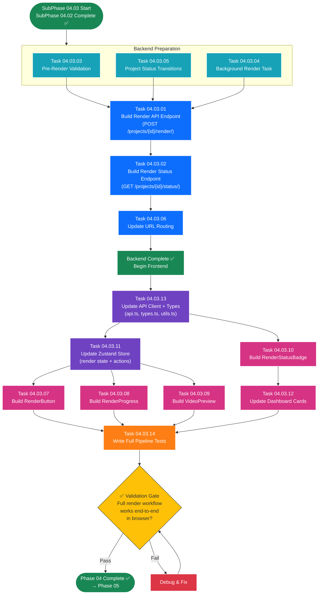

# SubPhase 04.03 — Render Pipeline & Progress API

## Layer 2 Overview Document

---

| **Field**                | **Value**                                                                                                  |
| ------------------------ | ---------------------------------------------------------------------------------------------------------- |
| **Sub-Phase**            | 04.03 — Render Pipeline & Progress API                                                                     |
| **Phase**                | Phase 04 — The Vision                                                                                      |
| **Layer**                | Layer 2 (Sub-Phase Overview)                                                                               |
| **Status**               | Not Started                                                                                                |
| **Parent Document**      | [Phase_04_Overview.md](../Phase_04_Overview.md) (Layer 1)                                                  |
| **Previous Sub-Phase**   | [SubPhase_04_02_Overview.md](../SubPhase_04_02_Ken_Burns_Effect/SubPhase_04_02_Overview.md) (Layer 2)       |
| **Next Sub-Phase**       | [SubPhase_05_01_Overview.md](../../Phase_05_The_Polish/SubPhase_05_01_Subtitle_Generation/SubPhase_05_01_Overview.md) (Layer 2) |
| **Dependencies**         | SubPhase 04.02 complete (Ken Burns renders produce correct video)                                          |
| **Estimated Task Docs**  | 14                                                                                                         |

---

## Table of Contents

- [SubPhase 04.03 — Render Pipeline \& Progress API](#subphase-0403--render-pipeline--progress-api)
  - [Layer 2 Overview Document](#layer-2-overview-document)
  - [Table of Contents](#table-of-contents)
  - [1. Objective](#1-objective)
    - [What SubPhase 04.03 Delivers](#what-subphase-0403-delivers)
    - [What SubPhase 04.03 Does NOT Deliver](#what-subphase-0403-does-not-deliver)
  - [2. Scope](#2-scope)
    - [2.1 In Scope](#21-in-scope)
    - [2.2 Out of Scope](#22-out-of-scope)
  - [3. Technical Context](#3-technical-context)
    - [3.1 Prerequisites](#31-prerequisites)
    - [3.2 Technology Specs](#32-technology-specs)
    - [3.3 Key Code Samples \& Patterns](#33-key-code-samples--patterns)
  - [4. Task List](#4-task-list)
  - [5. Task Details](#5-task-details)
    - [5.1 Task 04.03.01 — Build Render API Endpoint](#51-task-040301--build-render-api-endpoint)
    - [5.2 Task 04.03.02 — Build Render Status Endpoint](#52-task-040302--build-render-status-endpoint)
    - [5.3 Task 04.03.03 — Pre-Render Validation Logic](#53-task-040303--pre-render-validation-logic)
    - [5.4 Task 04.03.04 — Background Render Task](#54-task-040304--background-render-task)
    - [5.5 Task 04.03.05 — Project Status Transitions](#55-task-040305--project-status-transitions)
    - [5.6 Task 04.03.06 — Update URL Routing](#56-task-040306--update-url-routing)
    - [5.7 Task 04.03.07 — Build RenderButton Component](#57-task-040307--build-renderbutton-component)
    - [5.8 Task 04.03.08 — Build RenderProgress Component](#58-task-040308--build-renderprogress-component)
    - [5.9 Task 04.03.09 — Build VideoPreview Component](#59-task-040309--build-videopreview-component)
    - [5.10 Task 04.03.10 — Build RenderStatusBadge](#510-task-040310--build-renderstatusbadge)
    - [5.11 Task 04.03.11 — Update Zustand Render State](#511-task-040311--update-zustand-render-state)
    - [5.12 Task 04.03.12 — Update Dashboard Cards](#512-task-040312--update-dashboard-cards)
    - [5.13 Task 04.03.13 — Update Frontend API Client](#513-task-040313--update-frontend-api-client)
    - [5.14 Task 04.03.14 — Write Full Pipeline Tests](#514-task-040314--write-full-pipeline-tests)
  - [6. Execution Order](#6-execution-order)
    - [6.1 Dependency Chain](#61-dependency-chain)
    - [6.2 Recommended Sequence](#62-recommended-sequence)
    - [6.3 Execution Order Flowchart](#63-execution-order-flowchart)
    - [6.4 Parallel Work Opportunities](#64-parallel-work-opportunities)
  - [7. Files Created \& Modified](#7-files-created--modified)
  - [8. Validation Criteria](#8-validation-criteria)
    - [Render API Endpoint](#render-api-endpoint)
    - [Render Status Endpoint](#render-status-endpoint)
    - [Pre-Render Validation](#pre-render-validation)
    - [Background Render Task](#background-render-task)
    - [Project Status Transitions](#project-status-transitions)
    - [Frontend Components](#frontend-components)
    - [Zustand Store](#zustand-store)
    - [Frontend API Client \& Types](#frontend-api-client--types)
    - [Full Pipeline Integration](#full-pipeline-integration)
  - [9. Constraints](#9-constraints)
  - [10. Notes \& Gotchas](#10-notes--gotchas)
    - [Task ID Naming Convention](#task-id-naming-convention)
    - [Shared Thread Pool Implications](#shared-thread-pool-implications)
    - [CORS for Video Serving](#cors-for-video-serving)
    - [Browser Caching of Rendered Video](#browser-caching-of-rendered-video)
    - [Video Download Cross-Origin Limitation](#video-download-cross-origin-limitation)
    - [Render Failure Recovery](#render-failure-recovery)
    - [Project Page State on Navigation](#project-page-state-on-navigation)
    - [Serializer for Render Responses](#serializer-for-render-responses)
  - [11. Cross-References](#11-cross-references)
    - [Parent \& Ancestry](#parent--ancestry)
    - [Previous Sub-Phase](#previous-sub-phase)
    - [Next Sub-Phase](#next-sub-phase)
    - [Cross-Phase References](#cross-phase-references)
    - [Child Documents (Layer 3)](#child-documents-layer-3)

---

## 1. Objective

SubPhase 04.03 completes the **full render pipeline** by building the API endpoints, frontend UI components, real-time progress tracking, and video preview — making the entire rendering workflow accessible from the browser. This is the final sub-phase of Phase 04 and connects all the backend rendering machinery (from SubPhases 04.01 and 04.02) to the user-facing interface.

### What SubPhase 04.03 Delivers

1. **Render API Endpoint (`POST /api/projects/{id}/render/`)** — A DRF custom action that validates the project, sets status to PROCESSING, spawns a background render task via TaskManager, and returns 202 Accepted with a task ID.

2. **Render Status Endpoint (`GET /api/projects/{id}/status/`)** — A DRF custom action that returns the project's render status, per-segment progress, current phase description, and the output URL when rendering is complete.

3. **Pre-Render Validation (`api/validators.py`)** — A validation function that checks all segments have images and audio files (and that the files exist on disk), the project has at least one segment, and the project is not already rendering.

4. **Background Render Task** — Integration with the Phase 03 TaskManager to run `video_renderer.render_project()` as a background task with a progress callback that updates TaskManager's progress tracking.

5. **Project Status Transitions** — The `Project.status` field transitions: `DRAFT → PROCESSING → COMPLETED` (on success) or `DRAFT → PROCESSING → FAILED` (on error). `Project.output_path` is set to the MP4 file path on completion.

6. **RenderButton Component** — "Export Video" button with four states (Ready, Not Ready, Rendering, Complete) and a "Re-Render" dropdown option.

7. **RenderProgress Component** — Real-time rendering progress bar displayed in the timeline footer, showing per-segment progress, percentage, and current phase.

8. **VideoPreview Component** — HTML5 `<video>` player that appears after rendering, with playback controls, video metadata display, and a download button.

9. **RenderStatusBadge Component** — Small badge showing project render state (DRAFT, PROCESSING, COMPLETED, FAILED) in the project header and on dashboard cards.

10. **Updated Zustand Store** — Extended with render state: `renderTaskId`, `renderStatus`, `renderProgress`, `outputUrl`, plus actions `startRender()`, `pollRenderStatus()`, `downloadVideo()`.

11. **Updated Dashboard Project Cards** — `ProjectCard` shows the `RenderStatusBadge` and a "Watch" quick-action for completed projects.

12. **Updated Frontend API Client** — New functions `renderProject()` and `getRenderStatus()` in `lib/api.ts`.

13. **Updated TypeScript Types** — New types `RenderStatusResponse`, `RenderProgress`, `ProjectStatus` in `lib/types.ts`.

14. **Full Pipeline Tests** — End-to-end tests covering: render trigger, progress polling, completion, failure handling, re-render, and validation errors.

### What SubPhase 04.03 Does NOT Deliver

> **Critical:** The following features are explicitly **out of scope** for SubPhase 04.03. AI agents must NOT implement these.

- ❌ Subtitle generation or overlay (→ Phase 05)
- ❌ Crossfade transitions between clips (→ Phase 05)
- ❌ GlobalSettings editing UI (→ Phase 05)
- ❌ Custom voice selection UI (→ Phase 05)
- ❌ Resolution/framerate picker UI (→ Phase 05; use model defaults: 1920×1080, 30fps)
- ❌ Multiple output format options (→ future; MP4 only)
- ❌ Batch rendering of multiple projects (→ future)
- ❌ Cancel render mid-flight (best-effort only — not guaranteed to stop immediately)

At the conclusion of SubPhase 04.03, a user can: open a project in the browser, click "Export Video," see real-time progress, and receive a playable MP4 video with Ken Burns effects — the complete Phase 04 workflow.

---

## 2. Scope

### 2.1 In Scope

| Area                       | Details                                                                     |
| -------------------------- | --------------------------------------------------------------------------- |
| **Render API**             | `POST /api/projects/{id}/render/` — trigger with validation, return 202     |
| **Status API**             | `GET /api/projects/{id}/status/` — progress + output URL                    |
| **Pre-Render Validation**  | All segments have image + audio (files exist on disk), not already rendering |
| **Background Task**        | TaskManager integration, progress callback, status updates                  |
| **Status Transitions**     | Project.status: DRAFT → PROCESSING → COMPLETED / FAILED                    |
| **URL Routing**            | Register render + status actions on ProjectViewSet                          |
| **RenderButton**           | Export Video button with 4 states + Re-Render option                        |
| **RenderProgress**         | Footer progress bar with polling, per-segment progress, percentage          |
| **VideoPreview**           | HTML5 `<video>` player, metadata display, download button                   |
| **RenderStatusBadge**      | Status badge in project header + dashboard cards                            |
| **Zustand Store**          | Render state management with actions                                        |
| **Dashboard Enhancement**  | ProjectCard shows RenderStatusBadge + "Watch" action                        |
| **API Client**             | `renderProject()`, `getRenderStatus()` in lib/api.ts                        |
| **TypeScript Types**       | `RenderStatusResponse`, `RenderProgress`, `ProjectStatus`                   |
| **Serializers**            | Render response serializer in api/serializers.py                            |
| **Integration Tests**      | Full pipeline: trigger → progress → completion → preview                    |

### 2.2 Out of Scope

| Area                       | Reason / Destination                                                        |
| -------------------------- | --------------------------------------------------------------------------- |
| Subtitle overlay           | Phase 05 — Requires MoviePy TextClip and ImageMagick                        |
| Crossfade transitions      | Phase 05 — Inter-clip transitions are a polish feature                      |
| GlobalSettings editing UI  | Phase 05 — User cannot change zoom_intensity from the browser yet           |
| Resolution/framerate picker | Phase 05 — Uses model defaults (1920×1080, 30fps)                          |
| Guaranteed render cancel   | Best-effort only — Python threads cannot be forcefully stopped              |
| Multiple output formats    | Future scope — MP4 only in Phase 04                                         |
| Batch rendering            | Future scope — Single project rendering only                                |

---

## 3. Technical Context

### 3.1 Prerequisites

Before starting SubPhase 04.03, the following must be in place:

| Prerequisite                                               | Source                    | Verification                                                     |
| ---------------------------------------------------------- | ------------------------- | ---------------------------------------------------------------- |
| SubPhase 04.02 complete — Ken Burns renders produce correct video | SubPhase 04.02      | `render_project()` produces MP4 with visible Ken Burns motion    |
| `core_engine/video_renderer.py` — full implementation      | SubPhase 04.01 + 04.02    | `render_project(project_id, on_progress=callback)` works         |
| `core_engine/ken_burns.py` — full implementation           | SubPhase 04.02            | `apply_ken_burns()` returns animated `VideoClip`                 |
| `core_engine/render_utils.py` — all utility functions      | SubPhase 04.01            | `check_ffmpeg()`, `resize_image_to_resolution()`, `get_output_path()` |
| `api/tasks.py` — TaskManager with ThreadPoolExecutor       | Phase 03 (SubPhase 03.02) | `TaskManager.get_instance().submit_task(fn, args)` works         |
| `GET /api/tasks/{task_id}/status/` — task status endpoint  | Phase 03 (SubPhase 03.02) | Returns task progress JSON                                        |
| Frontend task polling mechanism                            | Phase 03 (SubPhase 03.03) | `pollTaskStatus()` pattern in lib/api.ts works                    |
| Zustand store with audio generation state                  | Phase 03 (SubPhase 03.03) | `useProjectStore` manages audio state                             |
| "Export Video" button exists but is disabled               | Phase 03                  | Button visible in footer with disabled state                      |
| Shadcn `Progress` component installed                      | Phase 03 (SubPhase 03.03) | Can be imported and used for render progress                      |
| MoviePy, FFmpeg, Pillow, NumPy installed                   | SubPhase 04.01            | All rendering dependencies available                              |

### 3.2 Technology Specs

| Technology      | Version / Spec     | Usage in This Sub-Phase                                         |
| --------------- | ------------------ | --------------------------------------------------------------- |
| **Django**      | 5.x + DRF          | Custom ViewSet actions (`render`, `status`), serializers        |
| **Python**      | 3.11+              | `concurrent.futures`, `threading`, `os`, `logging`              |
| **Next.js**     | 16+ (App Router)   | Project detail page updates, render controls                    |
| **TypeScript**  | Strict mode         | New types, API client functions, component props                |
| **Tailwind CSS** | 4                  | Render progress styling, video preview layout                   |
| **Shadcn/UI**   | (installed)         | `Progress` (reused), `Button`, `Badge`, `Tooltip`, `DropdownMenu` |
| **Zustand**     | (installed)         | Extended store with render state and actions                    |
| **Axios**       | (installed)         | Render trigger, status polling HTTP calls                       |
| **HTML5 Video** | Native              | `<video>` element with controls for MP4 preview                 |

**DRF Custom Actions Pattern:**

```python
from rest_framework.decorators import action
from rest_framework.response import Response
from rest_framework import status

class ProjectViewSet(viewsets.ModelViewSet):
    @action(detail=True, methods=['post'])
    def render(self, request, pk=None):
        """POST /api/projects/{id}/render/"""
        project = self.get_object()
        # ... validation, task spawn ...
        return Response(data, status=status.HTTP_202_ACCEPTED)
    
    @action(detail=True, methods=['get'], url_path='status')
    def render_status(self, request, pk=None):
        """GET /api/projects/{id}/status/"""
        project = self.get_object()
        # ... gather status ...
        return Response(data, status=status.HTTP_200_OK)
```

### 3.3 Key Code Samples & Patterns

**Pattern 1: Render API Endpoint**

```python
@action(detail=True, methods=['post'])
def render(self, request, pk=None):
    project = self.get_object()
    
    # 1. Pre-render validation
    errors = validate_project_for_render(project)
    if errors:
        return Response(
            {"error": "Project not ready for rendering", "details": errors},
            status=status.HTTP_400_BAD_REQUEST,
        )
    
    # 2. Check if already rendering
    if project.status == "PROCESSING":
        return Response(
            {"error": "Project is already being rendered"},
            status=status.HTTP_409_CONFLICT,
        )
    
    # 3. Set status to PROCESSING
    project.status = "PROCESSING"
    project.save(update_fields=["status"])
    
    # 4. Spawn background task
    task_manager = TaskManager.get_instance()
    task_id = task_manager.submit_task(
        render_task_function,
        str(project.id),
    )
    
    # 5. Return 202 Accepted
    segments = Segment.objects.filter(project=project)
    return Response({
        "task_id": task_id,
        "project_id": str(project.id),
        "status": "PROCESSING",
        "total_segments": segments.count(),
        "message": "Video rendering started",
    }, status=status.HTTP_202_ACCEPTED)
```

**Pattern 2: Render Status Endpoint**

```python
@action(detail=True, methods=['get'], url_path='status')
def render_status(self, request, pk=None):
    project = self.get_object()
    
    # Build response based on project status
    response_data = {
        "project_id": str(project.id),
        "status": project.status,
        "progress": None,
        "output_url": None,
    }
    
    if project.status == "PROCESSING":
        # Get progress from TaskManager
        task_manager = TaskManager.get_instance()
        # Look up task by project association
        progress = task_manager.get_task_progress_for_project(str(project.id))
        if progress:
            response_data["progress"] = progress
    
    if project.status == "COMPLETED" and project.output_path:
        response_data["output_url"] = project.output_path
        # Include progress as 100%
        segments_count = Segment.objects.filter(project=project).count()
        response_data["progress"] = {
            "current_segment": segments_count,
            "total_segments": segments_count,
            "percentage": 100,
            "current_phase": "Export complete",
        }
    
    return Response(response_data, status=status.HTTP_200_OK)
```

**Pattern 3: Background Render Task Function**

```python
def render_task_function(project_id: str, task_id: str):
    """
    Background task that runs video rendering.
    Called by TaskManager's ThreadPoolExecutor.
    """
    from core_engine.video_renderer import render_project
    from api.models import Project
    
    task_manager = TaskManager.get_instance()
    
    def on_progress(current, total, phase):
        task_manager.update_task_progress(
            task_id,
            current=current,
            total=total,
            current_phase=phase,
        )
    
    try:
        result = render_project(project_id, on_progress=on_progress)
        
        # Update project on success
        project = Project.objects.get(id=project_id)
        project.status = "COMPLETED"
        project.output_path = result["output_path"]
        project.save(update_fields=["status", "output_path"])
        
        task_manager.complete_task(task_id, result=result)
        
    except Exception as e:
        logger.error(f"Render failed for project {project_id}: {e}")
        
        # Update project on failure
        try:
            project = Project.objects.get(id=project_id)
            project.status = "FAILED"
            project.save(update_fields=["status"])
        except Exception:
            pass
        
        task_manager.fail_task(task_id, error=str(e))
```

**Pattern 4: Pre-Render Validation**

```python
def validate_project_for_render(project) -> dict | None:
    """
    Validate that a project is ready for rendering.
    Returns None if valid, or a dict with error details.
    """
    segments = Segment.objects.filter(project=project).order_by('sequence_index')
    
    if not segments.exists():
        return {"message": "Project has no segments"}
    
    missing_images = []
    missing_audio = []
    
    for segment in segments:
        if not segment.image_file or not os.path.exists(segment.image_file.path):
            missing_images.append(str(segment.id))
        if not segment.audio_file or not os.path.exists(segment.audio_file.path):
            missing_audio.append(str(segment.id))
    
    if missing_images or missing_audio:
        total_missing = len(missing_images) + len(missing_audio)
        return {
            "missing_images": missing_images,
            "missing_audio": missing_audio,
            "message": f"{total_missing} segments are missing required assets",
        }
    
    return None
```

**Pattern 5: RenderButton Component**

```tsx
"use client";

import { Button } from "@/components/ui/button";
import { useProjectStore } from "@/lib/stores";

export function RenderButton() {
  const { renderStatus, startRender } = useProjectStore();
  
  // State-based rendering:
  // "idle"       → Blue "Export Video" button
  // "validating" → Disabled, "Validating..."
  // "rendering"  → Disabled, "Rendering..." with spinner
  // "completed"  → Green "Download Video" button + "Re-Render" dropdown
  // "failed"     → Red "Retry Render" button
  
  return (
    <Button onClick={startRender} disabled={renderStatus === "rendering"}>
      {renderStatus === "idle" && "Export Video 🎬"}
      {renderStatus === "rendering" && "Rendering..."}
      {renderStatus === "completed" && "Download Video ⬇"}
    </Button>
  );
}
```

**Pattern 6: Zustand Render State Extension**

```typescript
interface RenderState {
  renderTaskId: string | null;
  renderStatus: "idle" | "validating" | "rendering" | "completed" | "failed";
  renderProgress: RenderProgress | null;
  outputUrl: string | null;
}

interface RenderActions {
  startRender: () => Promise<void>;
  pollRenderStatus: () => void;
  downloadVideo: () => void;
  resetRenderState: () => void;
}
```

**Pattern 7: Video Preview Component**

```tsx
"use client";

export function VideoPreview({ outputUrl }: { outputUrl: string }) {
  return (
    <div>
      <video controls width="100%" src={outputUrl}>
        Your browser does not support the video tag.
      </video>
      <div className="flex items-center gap-4 mt-2">
        <span>Duration: {formatDuration(...)}</span>
        <span>Size: {formatFileSize(...)}</span>
        <a href={outputUrl} download="final.mp4">
          <Button>⬇ Download MP4</Button>
        </a>
      </div>
    </div>
  );
}
```

---

## 4. Task List

| Task ID     | Task Name                              | Layer 3 Document                                       | Est. Complexity |
| ----------- | -------------------------------------- | ------------------------------------------------------ | --------------- |
| 04.03.01    | Build Render API Endpoint              | `Task_04_03_01_Build_Render_API_Endpoint.md`           | High            |
| 04.03.02    | Build Render Status Endpoint           | `Task_04_03_02_Build_Render_Status_Endpoint.md`        | Medium          |
| 04.03.03    | Pre-Render Validation Logic            | `Task_04_03_03_Pre_Render_Validation_Logic.md`         | Medium          |
| 04.03.04    | Background Render Task                 | `Task_04_03_04_Background_Render_Task.md`              | High            |
| 04.03.05    | Project Status Transitions             | `Task_04_03_05_Project_Status_Transitions.md`          | Medium          |
| 04.03.06    | Update URL Routing                     | `Task_04_03_06_Update_URL_Routing.md`                  | Low             |
| 04.03.07    | Build RenderButton Component           | `Task_04_03_07_Build_RenderButton_Component.md`        | High            |
| 04.03.08    | Build RenderProgress Component         | `Task_04_03_08_Build_RenderProgress_Component.md`      | High            |
| 04.03.09    | Build VideoPreview Component           | `Task_04_03_09_Build_VideoPreview_Component.md`        | Medium          |
| 04.03.10    | Build RenderStatusBadge                | `Task_04_03_10_Build_RenderStatusBadge.md`             | Medium          |
| 04.03.11    | Update Zustand Render State            | `Task_04_03_11_Update_Zustand_Render_State.md`         | High            |
| 04.03.12    | Update Dashboard Cards                 | `Task_04_03_12_Update_Dashboard_Cards.md`              | Low             |
| 04.03.13    | Update Frontend API Client             | `Task_04_03_13_Update_Frontend_API_Client.md`          | Medium          |
| 04.03.14    | Write Full Pipeline Tests              | `Task_04_03_14_Write_Full_Pipeline_Tests.md`           | High            |

---

## 5. Task Details

### 5.1 Task 04.03.01 — Build Render API Endpoint

**Objective:** Implement the `POST /api/projects/{id}/render/` endpoint as a custom DRF action on `ProjectViewSet` that validates the project, sets status to PROCESSING, spawns a background render task, and returns 202 Accepted.

**File:** `backend/api/views.py` (MODIFIED)

**Steps:**

1. Add a `render` custom action to `ProjectViewSet`:
   ```python
   @action(detail=True, methods=['post'])
   def render(self, request, pk=None):
   ```

2. Inside the action:
   - Get the project: `project = self.get_object()`.
   - Run pre-render validation (Task 04.03.03): `errors = validate_project_for_render(project)`.
   - If validation fails: return 400 with error details.
   - If `project.status == "PROCESSING"`: return 409 Conflict.
   - If `project.status == "COMPLETED"` and request body has `force=True` (optional): allow re-render.
   - If `project.status == "COMPLETED"` and no `force`: return 409 or allow (design decision — recommend allowing since the user explicitly clicked "Export Video").
   - Check FFmpeg availability: `if not render_utils.check_ffmpeg()`: return 500 with FFmpeg error message.
   - Set `project.status = "PROCESSING"` and save.
   - Submit background task via TaskManager (Task 04.03.04).
   - Return 202 Accepted response.

3. Response format (202 Accepted):
   ```json
   {
     "task_id": "render_<uuid>",
     "project_id": "<project-uuid>",
     "status": "PROCESSING",
     "total_segments": 12,
     "message": "Video rendering started"
   }
   ```

4. Error responses:
   - 400: Validation failed (missing images/audio).
   - 409: Already rendering.
   - 500: FFmpeg not installed.

**Key Details:**
- The action decorator `@action(detail=True, methods=['post'])` makes this a detail-level action (requires a project ID in the URL).
- DRF's `self.get_object()` handles 404 if the project doesn't exist.
- The task ID prefix should be `render_` to distinguish from TTS task IDs (which may use `tts_` or `audio_`).
- The `force` parameter in the request body is optional — if not provided, re-render should still be allowed for COMPLETED projects (since the user is explicitly requesting it). Only PROCESSING should be blocked.

**Files Touched:**
- `backend/api/views.py` — Modified (add `render` action)

---

### 5.2 Task 04.03.02 — Build Render Status Endpoint

**Objective:** Implement the `GET /api/projects/{id}/status/` endpoint that returns the project's render status, progress, and output URL.

**File:** `backend/api/views.py` (MODIFIED)

**Steps:**

1. Add a `render_status` custom action to `ProjectViewSet`:
   ```python
   @action(detail=True, methods=['get'], url_path='status')
   def render_status(self, request, pk=None):
   ```
   - Note: `url_path='status'` ensures the URL is `/api/projects/{id}/status/` not `/api/projects/{id}/render_status/`.

2. Inside the action:
   - Get the project: `project = self.get_object()`.
   - Build response based on `project.status`:
     - **DRAFT:** Return status, no progress, no output URL.
     - **PROCESSING:** Look up task progress from TaskManager. Return status + progress.
     - **COMPLETED:** Return status, progress at 100%, output URL.
     - **FAILED:** Return status, last known progress, no output URL.

3. Progress data structure:
   ```json
   {
     "current_segment": 4,
     "total_segments": 12,
     "percentage": 33,
     "current_phase": "Applying Ken Burns effect to segment 4"
   }
   ```

4. Finding the render task for a project:
   - Option A: Store the `task_id` on the project (but we don't have a `task_id` field — models are frozen).
   - Option B: TaskManager maintains a mapping of `project_id → task_id` for render tasks.
   - Option C: Use a naming convention: `render_{project_id}` as the task ID, so lookup is deterministic.
   - **Recommended: Option C** — the task ID is `f"render_{project.id}"`, making lookup trivial.

5. Output URL construction:
   - When `project.status == "COMPLETED"` and `project.output_path` is set:
     ```python
     output_url = f"/media/projects/{project.id}/output/final.mp4"
     ```
   - This URL is relative to the backend server. The frontend prepends `http://localhost:8000` (from the Axios base URL).

6. Response format (200 OK):
   ```json
   {
     "project_id": "<project-uuid>",
     "status": "COMPLETED",
     "progress": {
       "current_segment": 12,
       "total_segments": 12,
       "percentage": 100,
       "current_phase": "Export complete"
     },
     "output_url": "/media/projects/<id>/output/final.mp4"
   }
   ```

**Key Details:**
- The `url_path='status'` parameter is critical — without it, DRF would generate the URL from the method name (`render_status`), which doesn't match the API spec.
- The percentage calculation: `percentage = int((current_segment / total_segments) * 100)`.
- When status is DRAFT, `progress` and `output_url` are both `null`.
- The task progress is read from TaskManager's in-memory data — no database queries for progress.

**Files Touched:**
- `backend/api/views.py` — Modified (add `render_status` action)

---

### 5.3 Task 04.03.03 — Pre-Render Validation Logic

**Objective:** Implement a comprehensive validation function that checks if a project is ready for rendering.

**File:** `backend/api/validators.py` (MODIFIED)

**Steps:**

1. Add `validate_project_for_render(project) -> dict | None` to `validators.py`:
   - This function lives in the existing `validators.py` file (which may contain import-related validators from Phase 02).

2. Validation checks (all must pass):
   - **Check 1:** Project has at least 1 segment.
     ```python
     segments = Segment.objects.filter(project=project).order_by('sequence_index')
     if not segments.exists():
         return {"message": "Project has no segments"}
     ```
   - **Check 2:** ALL segments have `image_file` set (not null/empty).
   - **Check 3:** ALL segments' `image_file` files exist on disk.
   - **Check 4:** ALL segments have `audio_file` set (not null/empty).
   - **Check 5:** ALL segments' `audio_file` files exist on disk.

3. Collect all errors in a single pass:
   ```python
   missing_images = []
   missing_audio = []
   for segment in segments:
       if not segment.image_file:
           missing_images.append(str(segment.id))
       elif not os.path.exists(segment.image_file.path):
           missing_images.append(str(segment.id))
       
       if not segment.audio_file:
           missing_audio.append(str(segment.id))
       elif not os.path.exists(segment.audio_file.path):
           missing_audio.append(str(segment.id))
   ```

4. Return format:
   - If valid: return `None`.
   - If invalid: return a dict:
     ```python
     {
         "missing_images": ["segment_id_1", "segment_id_5"],
         "missing_audio": ["segment_id_3"],
         "message": "3 segments are missing required assets",
     }
     ```

5. Add proper imports: `os`, `Segment` model.

**Key Details:**
- The validation iterates through segments once, collecting all issues. This provides a complete error report rather than failing on the first issue.
- Checking `os.path.exists()` catches cases where the database references a file that was deleted from disk.
- The returned error dict includes segment IDs so the frontend can highlight which segments need attention (in a future enhancement).
- The `project.status` check (not already PROCESSING) is done in the API endpoint itself, not in this validator.

**Files Touched:**
- `backend/api/validators.py` — Modified (add `validate_project_for_render`)

---

### 5.4 Task 04.03.04 — Background Render Task

**Objective:** Implement the background render task function that bridges the TaskManager infrastructure (from Phase 03) with the video renderer.

**File:** `backend/api/tasks.py` (MODIFIED)

**Steps:**

1. Add a render task function to `tasks.py`:
   ```python
   def render_task_function(project_id: str, task_id: str):
   ```
   - This function is called by TaskManager's ThreadPoolExecutor.
   - It receives `project_id` as a string (UUID) and `task_id` from TaskManager.

2. Inside the function:
   - Import `render_project` from `core_engine.video_renderer` (inside the function to avoid circular imports).
   - Get the TaskManager instance.
   - Define a progress callback that updates TaskManager:
     ```python
     def on_progress(current, total, phase):
         task_manager.update_task_progress(task_id, current=current, total=total, current_phase=phase)
     ```
   - Call `render_project(project_id, on_progress=on_progress)`.
   - On success:
     - Update `Project.status = "COMPLETED"`.
     - Update `Project.output_path` with the result's output path.
     - Save the project.
     - Mark the task as complete in TaskManager.
   - On failure (catch `Exception`):
     - Update `Project.status = "FAILED"`.
     - Save the project (in a separate try/except to avoid cascading errors).
     - Mark the task as failed in TaskManager with the error message.
     - Log the error with full traceback.

3. Register the task function so the render endpoint can reference it:
   - The endpoint calls `task_manager.submit_task(render_task_function, str(project.id))`.
   - The task ID should follow the convention `f"render_{project_id}"` for easy lookup.

4. Handle Django ORM thread safety:
   - The function runs in a ThreadPoolExecutor thread, not in a Django request thread.
   - Re-query the Project inside the function using `project_id`.
   - Do NOT pass the `Project` instance from the request thread.
   - Django's ORM is thread-safe for separate queries but not for shared instances.

**Key Details:**
- This task reuses the **same TaskManager and ThreadPoolExecutor** from Phase 03. The `max_workers=1` constraint means render tasks queue behind any pending TTS tasks. This is acceptable — video rendering is a heavy operation and shouldn't run concurrently with TTS.
- The progress callback bridges two systems: `video_renderer.render_project` reports progress as `(current_segment, total_segments, phase_string)`, and `TaskManager.update_task_progress` stores it for the status endpoint to read.
- The task ID convention `render_{project_id}` allows the status endpoint to look up the task without needing a separate mapping.
- The `output_path` stored in `Project.output_path` should be the URL-relative path (e.g., `/media/projects/{id}/output/final.mp4`), not the absolute file system path. This is consistent with how `Segment.audio_file` stores paths.

**Files Touched:**
- `backend/api/tasks.py` — Modified (add `render_task_function`)

---

### 5.5 Task 04.03.05 — Project Status Transitions

**Objective:** Implement the full lifecycle of `Project.status` transitions during the render pipeline.

**File:** `backend/api/views.py` + `backend/api/tasks.py` (logic distributed)

**Steps:**

1. Define the valid status transitions:
   - `DRAFT → PROCESSING` — When render is triggered (in the render endpoint).
   - `PROCESSING → COMPLETED` — When render finishes successfully (in the task function).
   - `PROCESSING → FAILED` — When render encounters an error (in the task function).
   - `COMPLETED → PROCESSING` — When re-render is triggered (in the render endpoint).
   - `FAILED → PROCESSING` — When retry/re-render is triggered (in the render endpoint).

2. In the render endpoint (`views.py`):
   - Before setting PROCESSING, validate the current status:
     - `DRAFT` → allowed.
     - `COMPLETED` → allowed (re-render).
     - `FAILED` → allowed (retry).
     - `PROCESSING` → blocked (return 409).

3. In the task function (`tasks.py`):
   - On success: set `COMPLETED`, set `output_path`, save.
   - On failure: set `FAILED`, save (clear `output_path` if desired, or leave the old one).

4. Ensure atomicity:
   - Use `project.save(update_fields=["status"])` or `update_fields=["status", "output_path"]` to avoid overwriting other fields.
   - The status update is a simple `UPDATE` query — no transaction wrapping needed for SQLite.

5. Add a utility function (optional):
   ```python
   def can_start_render(project_status: str) -> bool:
       return project_status in ("DRAFT", "COMPLETED", "FAILED")
   ```

**Key Details:**
- The status values (`DRAFT`, `PROCESSING`, `COMPLETED`, `FAILED`) are string constants. They should be defined as constants or an enum to avoid typos. However, since models are frozen from Phase 01, the values must match whatever Phase 01 defined.
- `Project.status` defaults to `"DRAFT"` (defined in Phase 01).
- The `FAILED` state is recoverable — the user can click "Export Video" again to retry.
- The `COMPLETED` state allows re-rendering — the old `final.mp4` is overwritten by the new render.

**Files Touched:**
- `backend/api/views.py` — Modified (status check logic in render action)
- `backend/api/tasks.py` — Modified (status update on success/failure)

---

### 5.6 Task 04.03.06 — Update URL Routing

**Objective:** Register the render and status actions on `ProjectViewSet` so they are accessible via the API.

**File:** `backend/api/urls.py` (MODIFIED)

**Steps:**

1. Verify that DRF's `DefaultRouter` automatically registers custom actions:
   - When using `DefaultRouter` with `ProjectViewSet`, the `@action(detail=True)` decorator automatically generates URLs.
   - `render` action → `POST /api/projects/{id}/render/`.
   - `render_status` action (with `url_path='status'`) → `GET /api/projects/{id}/status/`.

2. If the router doesn't auto-register (depends on DRF version and router configuration):
   - Add explicit URL patterns:
     ```python
     urlpatterns = [
         # ... existing patterns ...
         path('projects/<uuid:pk>/render/', ProjectViewSet.as_view({'post': 'render'}), name='project-render'),
         path('projects/<uuid:pk>/status/', ProjectViewSet.as_view({'get': 'render_status'}), name='project-status'),
     ]
     ```

3. Verify the routes are registered:
   - Run `python manage.py show_urls` (if available) or check via the DRF browsable API.
   - Confirm `POST /api/projects/{id}/render/` is accessible.
   - Confirm `GET /api/projects/{id}/status/` is accessible.

4. Ensure no conflicts with existing routes:
   - Phase 03 already has `POST /api/projects/{id}/generate-all-audio/` — no conflict.
   - Phase 03 has `GET /api/tasks/{task_id}/status/` — this is a different path structure, no conflict.

**Key Details:**
- DRF's `DefaultRouter` with `@action(detail=True)` typically auto-registers the URL. The `url_path` parameter on the `render_status` action overrides the default URL segment.
- The UUID path converter (`<uuid:pk>`) should already be configured from Phase 01's URL setup.
- No new URL patterns file is needed — modifications go in the existing `urls.py`.

**Files Touched:**
- `backend/api/urls.py` — Modified (verify/add render routes)

---

### 5.7 Task 04.03.07 — Build RenderButton Component

**Objective:** Build the "Export Video" button component with state-dependent appearance and behavior.

**File:** `frontend/components/RenderButton.tsx` (NEW)

**Steps:**

1. Create the component file with Shadcn `Button`, `DropdownMenu`, `Tooltip` imports.

2. Implement four visual states based on `renderStatus` from Zustand store:

   | State         | `renderStatus`  | Button Text          | Appearance                      | Behavior on Click              |
   | ------------- | --------------- | -------------------- | ------------------------------- | ------------------------------ |
   | **Ready**     | `"idle"`        | "Export Video 🎬"    | Blue/primary button             | Calls `startRender()`          |
   | **Not Ready** | `"idle"` + missing assets | "Export Video" | Disabled, gray, tooltip explains | None (disabled)               |
   | **Rendering** | `"rendering"`   | "Rendering..."       | Disabled, animated spinner      | None (disabled)                |
   | **Complete**  | `"completed"`   | "Download Video ⬇"  | Green/success button            | Calls `downloadVideo()`        |
   | **Failed**    | `"failed"`      | "Retry Render"       | Red/destructive button          | Calls `startRender()`          |

3. Add a "Re-Render" dropdown option:
   - When `renderStatus === "completed"`:
     - Primary button: "Download Video ⬇" (downloads the MP4).
     - Dropdown arrow: reveals "Re-Render" option that calls `startRender()`.
   - Use Shadcn `DropdownMenu` for the dropdown.

4. Determine "Not Ready" state:
   - Read segments from Zustand store.
   - Check if all segments have `image_file` and `audio_file`.
   - If any segment is missing assets: show disabled button with `Tooltip` explaining what's missing.

5. Component props: none (reads from Zustand store directly) or accept `projectId` if needed.

6. Place in the timeline footer:
   - This component replaces the disabled "Export Video" placeholder from Phase 03.
   - Positioned alongside the "Generate All Audio" button.

**Key Details:**
- The button must be a `"use client"` component (uses Zustand hooks and event handlers).
- The "Not Ready" validation is a **client-side** check. The server also validates (Task 04.03.03), but the client-side check provides immediate feedback without an API call.
- The download action should trigger a browser file download: `window.open(outputUrl, '_blank')` or create a temporary `<a>` element with `download` attribute.
- The spinner animation can use Tailwind's `animate-spin` utility on an inline SVG icon.

**Files Touched:**
- `frontend/components/RenderButton.tsx` — NEW

---

### 5.8 Task 04.03.08 — Build RenderProgress Component

**Objective:** Build the render progress component that displays real-time rendering progress in the timeline footer.

**File:** `frontend/components/RenderProgress.tsx` (NEW)

**Steps:**

1. Create the component file with Shadcn `Progress` component import.

2. Display when `renderStatus === "rendering"`:
   - Show the Shadcn `Progress` bar with `value={renderProgress?.percentage || 0}`.
   - Show text: `"Processing segment {current}/{total} ({percentage}%)"`.
   - Show current phase: `renderProgress?.current_phase` (e.g., "Applying Ken Burns effect to segment 7").

3. Implement status polling:
   - When the component mounts and `renderStatus === "rendering"`:
     - Call `pollRenderStatus()` from Zustand store.
     - Set up a polling interval: `setInterval(() => pollRenderStatus(), 3000)` (every 3 seconds).
     - Clean up the interval on unmount or when rendering completes.

4. Visual layout:
   ```
   ┌──────────────────────────────────────────────────────────┐
   │  Rendering... ████████████░░░░░░ Segment 7/12 (58%)      │
   │  Current: Applying Ken Burns effect to segment 7          │
   └──────────────────────────────────────────────────────────┘
   ```

5. Handle transition from rendering to completed:
   - When `renderStatus` changes from `"rendering"` to `"completed"`:
     - Stop the polling interval.
     - Optionally show a brief success animation or message.
     - The `VideoPreview` component should appear (handled by the parent page).

6. Handle transition from rendering to failed:
   - When `renderStatus` changes to `"failed"`:
     - Stop polling.
     - Show error message (from the task's error data if available).

**Key Details:**
- The polling interval is 3 seconds (matching the audio generation polling from Phase 03).
- The `Progress` component from Shadcn is already installed (Phase 03). Reuse it.
- The progress percentage comes from the Zustand store, which is updated by `pollRenderStatus()` calling the status API.
- The component should use `useEffect` with cleanup to manage the polling interval.
- Polling stops when the component unmounts OR when the status is no longer `"rendering"`.

**Files Touched:**
- `frontend/components/RenderProgress.tsx` — NEW

---

### 5.9 Task 04.03.09 — Build VideoPreview Component

**Objective:** Build the video preview component that displays the rendered MP4 using an HTML5 `<video>` element, with playback controls, metadata, and a download button.

**File:** `frontend/components/VideoPreview.tsx` (NEW)

**Steps:**

1. Create the component with props: `{ outputUrl: string }`.

2. Implement the HTML5 `<video>` player:
   ```tsx
   <video
     controls
     width="100%"
     src={outputUrl}
     className="rounded-lg border"
   >
     Your browser does not support the video tag.
   </video>
   ```
   - Native browser controls: play, pause, seek, volume, fullscreen.
   - No custom player library needed — the native `<video>` element handles MP4 natively.

3. Display video metadata (optional, best-effort):
   - Duration: read from `<video>` element's `loadedmetadata` event: `videoRef.current.duration`.
   - Use the `formatDuration()` helper from `lib/utils.ts` to display as "M:SS" format.
   - File size: could be fetched from the render status response or from a HEAD request to the video URL.

4. Add a "Download" button:
   ```tsx
   <a href={outputUrl} download="final.mp4">
     <Button variant="outline">⬇ Download MP4</Button>
   </a>
   ```
   - The `download` attribute triggers a file download instead of navigation.
   - The `href` points to the video URL served by Django's media server.

5. Visual layout:
   ```
   ┌─────────────────────────────────────────────┐
   │           [VIDEO PLAYER]                    │
   │        ▶ ─────●──────────── 0:42/1:28       │
   └─────────────────────────────────────────────┘
   
   Duration: 1:28  |  Size: 45.2 MB  |  1080p 30fps
   [⬇ Download MP4]           [↻ Re-Render]
   ```

6. Show this component conditionally:
   - Only when `renderStatus === "completed"` and `outputUrl` is truthy.
   - The parent page component manages this conditional rendering.

**Key Details:**
- HTML5 `<video>` natively plays MP4 (H.264 + AAC) in all modern browsers. No third-party video player library is needed.
- The video URL is served from Django's media server: `http://localhost:8000/media/projects/{id}/output/final.mp4`.
- Cache busting: when re-rendering, the URL stays the same but the content changes. Add a timestamp query parameter to force reload: `${outputUrl}?t=${Date.now()}`.
- The `download` attribute on the `<a>` tag may not work for cross-origin URLs. Since frontend (port 3000) and backend (port 8000) are different origins, the download may open in a new tab instead. Alternative: use `fetch()` + `blob` to trigger a true download.
- The `formatDuration()` and `formatFileSize()` helpers should be added to `lib/utils.ts` (see Task 04.03.13 notes).

**Files Touched:**
- `frontend/components/VideoPreview.tsx` — NEW

---

### 5.10 Task 04.03.10 — Build RenderStatusBadge

**Objective:** Build a small status badge component that shows the project's render state with color-coded indicators.

**File:** `frontend/components/RenderStatusBadge.tsx` (NEW)

**Steps:**

1. Create the component with props: `{ status: ProjectStatus }`.

2. Implement badge variants for each status:

   | Status        | Emoji | Label        | Color                  | Animation           |
   | ------------- | ----- | ------------ | ---------------------- | ------------------- |
   | `DRAFT`       | 📝    | Draft        | Gray (muted)           | None                |
   | `PROCESSING`  | ⚙️    | Rendering    | Yellow/amber (warning) | Pulse animation     |
   | `COMPLETED`   | ✅    | Completed    | Green (success)        | None                |
   | `FAILED`      | ❌    | Failed       | Red (destructive)      | None                |

3. Use Shadcn `Badge` component with variant styling:
   ```tsx
   import { Badge } from "@/components/ui/badge";
   
   const statusConfig = {
     DRAFT: { label: "Draft", variant: "secondary", emoji: "📝" },
     PROCESSING: { label: "Rendering", variant: "warning", emoji: "⚙️", animate: true },
     COMPLETED: { label: "Completed", variant: "success", emoji: "✅" },
     FAILED: { label: "Failed", variant: "destructive", emoji: "❌" },
   };
   ```

4. For `PROCESSING` state, add a subtle pulse animation using Tailwind:
   ```tsx
   className={cn("...", status === "PROCESSING" && "animate-pulse")}
   ```

5. For `FAILED` state, add a `Tooltip` with error details (if available):
   ```tsx
   <Tooltip content="Render failed: FFmpeg encoding error">
     <Badge variant="destructive">❌ Failed</Badge>
   </Tooltip>
   ```

6. This component is used in two places:
   - Project detail page header (beside the project title).
   - Dashboard `ProjectCard` component (Task 04.03.12).

**Key Details:**
- The `ProjectStatus` type is `"DRAFT" | "PROCESSING" | "COMPLETED" | "FAILED"` (defined in `lib/types.ts`, Task 04.03.13).
- If Shadcn `Badge` doesn't have a `warning` variant, create one via Tailwind utility classes (amber/yellow background).
- If Shadcn `Badge` doesn't have a `success` variant, create one via Tailwind utility classes (green background).
- The component is purely presentational — it receives the status as a prop and renders accordingly. No state management.

**Files Touched:**
- `frontend/components/RenderStatusBadge.tsx` — NEW

---

### 5.11 Task 04.03.11 — Update Zustand Render State

**Objective:** Extend the Zustand store with render-related state and actions.

**File:** `frontend/lib/stores.ts` (MODIFIED)

**Steps:**

1. Add render state properties to the store:
   ```typescript
   renderTaskId: string | null;
   renderStatus: "idle" | "validating" | "rendering" | "completed" | "failed";
   renderProgress: RenderProgress | null;
   outputUrl: string | null;
   ```

2. Initialize render state with defaults:
   ```typescript
   renderTaskId: null,
   renderStatus: "idle",
   renderProgress: null,
   outputUrl: null,
   ```

3. Implement `startRender()` action:
   - Set `renderStatus = "validating"`.
   - Call `api.renderProject(projectId)`.
   - On success: set `renderTaskId = response.task_id`, `renderStatus = "rendering"`, start polling.
   - On failure (400): set `renderStatus = "idle"`, show error (toast or alert).
   - On failure (409): set `renderStatus = "idle"`, show "already rendering" message.

4. Implement `pollRenderStatus()` action:
   - Call `api.getRenderStatus(projectId)`.
   - Update `renderProgress` with the response data.
   - If `response.status === "COMPLETED"`:
     - Set `renderStatus = "completed"`.
     - Set `outputUrl = response.output_url`.
     - Stop polling (clear interval).
   - If `response.status === "FAILED"`:
     - Set `renderStatus = "failed"`.
     - Stop polling.

5. Implement `downloadVideo()` action:
   - If `outputUrl` is set: trigger browser download.
   - Option A: `window.open(outputUrl, '_blank')`.
   - Option B: Create a temporary `<a>` element with `download` attribute.

6. Implement `resetRenderState()` action:
   - Reset all render state to defaults.
   - Used when navigating away from the project or before starting a new render.

7. Update the existing `fetchProject()` action:
   - When fetching project details, check `project.status` and update `renderStatus` accordingly:
     - If `project.status === "COMPLETED"` and `project.output_path`: set `renderStatus = "completed"`, `outputUrl = project.output_path`.
     - If `project.status === "PROCESSING"`: set `renderStatus = "rendering"`, start polling.
     - If `project.status === "FAILED"`: set `renderStatus = "failed"`.

**Key Details:**
- The Zustand store already has audio-related state from Phase 03 (`audioTaskId`, `audioGenerationStatus`, `bulkGenerationProgress`). The render state is separate and additive.
- The polling mechanism follows the same pattern as audio task polling from Phase 03 (2–3 second intervals via `setInterval`).
- The polling interval should be stored as a ref (using `useRef` in the component) or as a module-level variable so it can be cleared on cleanup.
- `renderStatus` is a client-side state machine: `idle → validating → rendering → completed/failed → idle (on reset)`.
- The project's `status` field from the backend (`DRAFT`, `PROCESSING`, `COMPLETED`, `FAILED`) maps to `renderStatus` but they are separate concepts. The backend status persists across sessions; the frontend status resets on page refresh.

**Files Touched:**
- `frontend/lib/stores.ts` — Modified (add render state and actions)

---

### 5.12 Task 04.03.12 — Update Dashboard Cards

**Objective:** Update the `ProjectCard` component on the dashboard to show the render status badge and a "Watch" quick-action for completed projects.

**File:** `frontend/components/ProjectCard.tsx` (MODIFIED)

**Steps:**

1. Import `RenderStatusBadge` from `./RenderStatusBadge`.

2. Add `RenderStatusBadge` to the card header:
   - Display next to the project title or in the card footer.
   - Pass `project.status` as the `status` prop.

3. Add a "Watch" quick-action for completed projects:
   - If `project.status === "COMPLETED"`:
     - Show a "Watch" or "▶ Play" button/link.
     - On click: navigate to the project detail page where the `VideoPreview` component shows the video.
     - Alternatively: open the video URL directly in a new tab.

4. Ensure the card layout accommodates the new badge without breaking the existing design:
   - The badge should be small and non-intrusive.
   - It should be visible at a glance (color coding helps).

**Key Details:**
- The `ProjectCard` component already exists from Phase 02 (SubPhase 02.03). This task modifies it.
- The `project.status` field must be included in the project list API response (it should already be included by DRF's default serializer behavior since `status` is a model field).
- The "Watch" action is a navigation action, not a render action. It simply takes the user to the project detail page where the `VideoPreview` is displayed.
- If the project list API doesn't include `status`, the serializer must be updated (but this is likely already included).

**Files Touched:**
- `frontend/components/ProjectCard.tsx` — Modified (add RenderStatusBadge, Watch action)

---

### 5.13 Task 04.03.13 — Update Frontend API Client

**Objective:** Add new API functions for render triggering and status polling, and new TypeScript types for render-related data.

**Files:** `frontend/lib/api.ts` (MODIFIED), `frontend/lib/types.ts` (MODIFIED), `frontend/lib/utils.ts` (MODIFIED)

**Steps:**

1. **Add API functions to `lib/api.ts`:**

   ```typescript
   export async function renderProject(
     projectId: string,
     options?: { force?: boolean }
   ): Promise<RenderTriggerResponse> {
     const response = await api.post(`/projects/${projectId}/render/`, options || {});
     return response.data;
   }
   
   export async function getRenderStatus(
     projectId: string
   ): Promise<RenderStatusResponse> {
     const response = await api.get(`/projects/${projectId}/status/`);
     return response.data;
   }
   ```

2. **Add TypeScript types to `lib/types.ts`:**

   ```typescript
   export type ProjectStatus = "DRAFT" | "PROCESSING" | "COMPLETED" | "FAILED";
   
   export interface RenderProgress {
     current_segment: number;
     total_segments: number;
     percentage: number;
     current_phase: string;
   }
   
   export interface RenderTriggerResponse {
     task_id: string;
     project_id: string;
     status: string;
     total_segments: number;
     message: string;
   }
   
   export interface RenderStatusResponse {
     project_id: string;
     status: ProjectStatus;
     progress: RenderProgress | null;
     output_url: string | null;
   }
   ```

3. **Update the existing `Project` type** (if not already present):
   ```typescript
   export interface Project {
     // ... existing fields ...
     status: ProjectStatus;
     output_path: string | null;
   }
   ```

4. **Add utility functions to `lib/utils.ts`:**

   ```typescript
   export function formatDuration(seconds: number): string {
     const mins = Math.floor(seconds / 60);
     const secs = Math.floor(seconds % 60);
     return `${mins}:${secs.toString().padStart(2, '0')}`;
   }
   
   export function formatFileSize(bytes: number): string {
     if (bytes < 1024) return `${bytes} B`;
     if (bytes < 1024 * 1024) return `${(bytes / 1024).toFixed(1)} KB`;
     if (bytes < 1024 * 1024 * 1024) return `${(bytes / (1024 * 1024)).toFixed(1)} MB`;
     return `${(bytes / (1024 * 1024 * 1024)).toFixed(1)} GB`;
   }
   ```

**Key Details:**
- The `api` instance is the Axios client configured in Phase 02 with base URL `http://localhost:8000/api`.
- The `ProjectStatus` type should be used consistently across all components that reference project status.
- The `RenderProgress` interface mirrors the backend's progress JSON structure exactly.
- The `formatDuration` and `formatFileSize` helpers are used by `VideoPreview` and potentially by the `RenderProgress` component.
- If `lib/utils.ts` doesn't exist yet, create it.

**Files Touched:**
- `frontend/lib/api.ts` — Modified (add renderProject, getRenderStatus)
- `frontend/lib/types.ts` — Modified (add ProjectStatus, RenderProgress, RenderTriggerResponse, RenderStatusResponse)
- `frontend/lib/utils.ts` — Modified (add formatDuration, formatFileSize)

---

### 5.14 Task 04.03.14 — Write Full Pipeline Tests

**Objective:** Write comprehensive tests covering the full render pipeline: API endpoints, background tasks, progress tracking, error handling, and re-rendering.

**File:** `backend/api/tests.py` (MODIFIED — add new test class)

**Steps:**

1. Create a new test class: `class RenderPipelineTests(APITestCase):`.
   - Use DRF's `APITestCase` for API-level testing with `self.client`.

2. **Test Setup (`setUp`):**
   - Create a test `Project` with all fields (status="DRAFT").
   - Create a `GlobalSettings` instance (zoom_intensity=1.3).
   - Create 3 test segments with synthetic images and audio (same as SubPhase 04.01/04.02 test setup).
   - Set all segments' `image_file`, `audio_file`, and `audio_duration`.
   - Use small resolutions (640×360) and short audio (1 second) for fast tests.

3. **Test: Render Trigger Success (`test_render_trigger_success`):**
   - POST `/api/projects/{id}/render/`.
   - Assert response status is 202.
   - Assert response contains `task_id`, `project_id`, `status`, `total_segments`, `message`.
   - Assert `project.status` is now `"PROCESSING"` (re-query from DB).

4. **Test: Render Trigger Missing Images (`test_render_trigger_missing_images`):**
   - Remove one segment's `image_file`.
   - POST `/api/projects/{id}/render/`.
   - Assert response status is 400.
   - Assert response contains `missing_images` list with the segment ID.

5. **Test: Render Trigger Missing Audio (`test_render_trigger_missing_audio`):**
   - Remove one segment's `audio_file`.
   - POST `/api/projects/{id}/render/`.
   - Assert response status is 400.
   - Assert response contains `missing_audio` list.

6. **Test: Render Trigger No Segments (`test_render_trigger_no_segments`):**
   - Delete all segments.
   - POST `/api/projects/{id}/render/`.
   - Assert response status is 400.
   - Assert error message mentions "no segments".

7. **Test: Render Trigger Already Processing (`test_render_trigger_already_processing`):**
   - Set `project.status = "PROCESSING"`.
   - POST `/api/projects/{id}/render/`.
   - Assert response status is 409.

8. **Test: Render Trigger Re-Render (`test_render_trigger_re_render`):**
   - Set `project.status = "COMPLETED"`.
   - POST `/api/projects/{id}/render/`.
   - Assert response status is 202 (re-render allowed).
   - Assert `project.status` is now `"PROCESSING"`.

9. **Test: Render Status Draft (`test_render_status_draft`):**
   - GET `/api/projects/{id}/status/`.
   - Assert `status == "DRAFT"`, `progress == null`, `output_url == null`.

10. **Test: Render Status Completed (`test_render_status_completed`):**
    - Set `project.status = "COMPLETED"`, `project.output_path = "/media/.../final.mp4"`.
    - GET `/api/projects/{id}/status/`.
    - Assert `status == "COMPLETED"`, `progress.percentage == 100`, `output_url` is set.

11. **Test: Pre-Render Validation Valid (`test_validation_valid`):**
    - All segments have images + audio.
    - Call `validate_project_for_render(project)`.
    - Assert returns `None`.

12. **Test: Pre-Render Validation Invalid (`test_validation_missing_assets`):**
    - Remove one segment's image.
    - Call `validate_project_for_render(project)`.
    - Assert returns a dict with `missing_images` containing the segment ID.

13. **Test: Full End-to-End Render (`test_end_to_end_render`):**
    - POST `/api/projects/{id}/render/`.
    - Wait for the background task to complete (poll or sleep).
    - GET `/api/projects/{id}/status/`.
    - Assert `status == "COMPLETED"`.
    - Assert `output_url` points to a valid file.
    - Assert the MP4 file exists on disk and has size > 0.

14. **Test: Render Failure Handling (`test_render_failure_sets_failed_status`):**
    - Set one segment's `image_file` to a non-existent path on disk (DB says it exists, but file doesn't).
    - POST `/api/projects/{id}/render/`.
    - Wait for the background task to fail.
    - Refresh project from DB.
    - Assert `project.status == "FAILED"`.

15. **Test Teardown (`tearDown`):**
    - Remove all temporary files (images, audio, output MP4).
    - Clean up test database records.

**Key Details:**
- The end-to-end test (step 13) involves waiting for a background task. Use a polling loop with a timeout:
  ```python
  import time
  for _ in range(30):  # max 30 seconds
      project.refresh_from_db()
      if project.status in ("COMPLETED", "FAILED"):
          break
      time.sleep(1)
  ```
- DRF's `APITestCase` provides `self.client` for making HTTP requests.
- Tests should use `@override_settings(MEDIA_ROOT=tempfile.mkdtemp())` to avoid polluting the real media directory.
- The background task runs in the same process but on a different thread (via ThreadPoolExecutor). Tests must wait for it to complete.
- Use small resolutions and short audio for fast test execution (target: < 60 seconds total for all render pipeline tests).

**Files Touched:**
- `backend/api/tests.py` — Modified (add `RenderPipelineTests` class)

---

## 6. Execution Order

### 6.1 Dependency Chain

| Task      | Depends On            | Reason                                                          |
| --------- | --------------------- | --------------------------------------------------------------- |
| 04.03.03  | —                     | Validation logic is standalone — used by the render endpoint     |
| 04.03.04  | —                     | Task function is standalone — used by the render endpoint        |
| 04.03.05  | —                     | Status transition logic — used by endpoint and task function     |
| 04.03.01  | 04.03.03, 04.03.04, 04.03.05 | Render endpoint uses validation, spawns task, sets status |
| 04.03.02  | 04.03.01              | Status endpoint works after render endpoint exists               |
| 04.03.06  | 04.03.01, 04.03.02    | URL routing after both endpoints are implemented                 |
| 04.03.13  | —                     | Types and API client are standalone — used by all frontend tasks |
| 04.03.11  | 04.03.13              | Zustand store uses new types and API functions                   |
| 04.03.10  | 04.03.13              | Badge component uses ProjectStatus type                          |
| 04.03.07  | 04.03.11              | RenderButton uses Zustand store actions                          |
| 04.03.08  | 04.03.11              | RenderProgress uses Zustand store state                          |
| 04.03.09  | 04.03.11              | VideoPreview uses outputUrl from store                           |
| 04.03.12  | 04.03.10              | Dashboard cards use RenderStatusBadge                            |
| 04.03.14  | 04.03.06              | Tests require all backend endpoints to be wired                  |

### 6.2 Recommended Sequence

| Order | Task ID  | Task Name                        | Why This Order                                               |
| ----- | -------- | -------------------------------- | ------------------------------------------------------------ |
| 1     | 04.03.03 | Pre-Render Validation Logic      | Independent utility — used by the render endpoint            |
| 2     | 04.03.05 | Project Status Transitions       | Defines the status lifecycle — referenced by endpoint + task |
| 3     | 04.03.04 | Background Render Task           | Task function — used by the render endpoint                  |
| 4     | 04.03.01 | Build Render API Endpoint        | Main endpoint — uses validation, task, status logic          |
| 5     | 04.03.02 | Build Render Status Endpoint     | Status endpoint — works with the render endpoint             |
| 6     | 04.03.06 | Update URL Routing               | Wires both endpoints to URLs                                 |
| 7     | 04.03.13 | Update Frontend API Client       | Types + API functions — all frontend components depend on this |
| 8     | 04.03.11 | Update Zustand Render State      | Store state + actions — used by all UI components            |
| 9     | 04.03.10 | Build RenderStatusBadge          | Simple presentational component — used by button + cards     |
| 10    | 04.03.07 | Build RenderButton Component     | Main interaction component                                    |
| 11    | 04.03.08 | Build RenderProgress Component   | Progress display during rendering                             |
| 12    | 04.03.09 | Build VideoPreview Component     | Video player after rendering completes                        |
| 13    | 04.03.12 | Update Dashboard Cards           | Dashboard enhancement with badge                              |
| 14    | 04.03.14 | Write Full Pipeline Tests        | End-to-end tests validate everything                          |

### 6.3 Execution Order Flowchart



### 6.4 Parallel Work Opportunities

| Parallel Group    | Tasks                                          | Reason for Parallelism                              |
| ----------------- | ---------------------------------------------- | --------------------------------------------------- |
| **Backend Prep**  | 04.03.03, 04.03.04, 04.03.05                  | Independent backend utilities — no inter-dependencies |
| **Frontend Core** | 04.03.11, 04.03.10                             | Store and badge are independent after types exist    |
| **Frontend UI**   | 04.03.07, 04.03.08, 04.03.09, 04.03.12        | All UI components depend on store but not on each other |

The backend and frontend tracks can be worked on partially in parallel — once the backend endpoints are wired (Task 04.03.06), the frontend work can begin. However, the frontend must wait for the API to be functional for end-to-end testing.

---

## 7. Files Created & Modified

| File Path                                    | Action       | Created/Modified In | Purpose                                       |
| -------------------------------------------- | ------------ | ------------------- | --------------------------------------------- |
| `frontend/components/RenderButton.tsx`       | **NEW**      | Task 04.03.07       | "Export Video" trigger with states             |
| `frontend/components/RenderProgress.tsx`     | **NEW**      | Task 04.03.08       | Real-time render progress bar                  |
| `frontend/components/VideoPreview.tsx`       | **NEW**      | Task 04.03.09       | HTML5 video player for rendered output         |
| `frontend/components/RenderStatusBadge.tsx`  | **NEW**      | Task 04.03.10       | Project render state indicator badge           |
| `backend/api/views.py`                       | MODIFIED     | Tasks 04.03.01–02   | Render + status actions on ProjectViewSet      |
| `backend/api/urls.py`                        | MODIFIED     | Task 04.03.06       | Render + status routes registered              |
| `backend/api/serializers.py`                 | MODIFIED     | Task 04.03.01       | Render response serializer (optional)          |
| `backend/api/validators.py`                  | MODIFIED     | Task 04.03.03       | Pre-render validation function                 |
| `backend/api/tasks.py`                       | MODIFIED     | Task 04.03.04       | Render task function registered                |
| `backend/api/tests.py`                       | MODIFIED     | Task 04.03.14       | Render pipeline test class                     |
| `frontend/lib/api.ts`                        | MODIFIED     | Task 04.03.13       | renderProject, getRenderStatus                 |
| `frontend/lib/types.ts`                      | MODIFIED     | Task 04.03.13       | ProjectStatus, RenderProgress, response types  |
| `frontend/lib/stores.ts`                     | MODIFIED     | Task 04.03.11       | Render state management in Zustand             |
| `frontend/lib/utils.ts`                      | MODIFIED     | Task 04.03.13       | formatDuration, formatFileSize helpers          |
| `frontend/components/ProjectCard.tsx`        | MODIFIED     | Task 04.03.12       | Shows RenderStatusBadge                        |
| `frontend/app/projects/[id]/page.tsx`        | MODIFIED     | Tasks 04.03.07–09   | Render controls + video preview integrated     |

**Summary:**
- 4 new files created (frontend components)
- 12 files modified (backend endpoints + frontend state/types/UI)

---

## 8. Validation Criteria

### Render API Endpoint

- [ ] `POST /api/projects/{id}/render/` returns 202 with task ID when project is ready.
- [ ] Returns 400 with detailed errors when segments are missing images or audio.
- [ ] Returns 400 when project has no segments.
- [ ] Returns 409 if project is already PROCESSING.
- [ ] Returns 500 if FFmpeg is not installed.
- [ ] Allows re-render of COMPLETED projects (returns 202).
- [ ] Allows retry of FAILED projects (returns 202).
- [ ] Sets `Project.status = "PROCESSING"` on successful trigger.

### Render Status Endpoint

- [ ] `GET /api/projects/{id}/status/` returns 200 for all project states.
- [ ] Returns `status: "DRAFT"`, `progress: null`, `output_url: null` for draft projects.
- [ ] Returns accurate per-segment progress during rendering.
- [ ] Returns `status: "COMPLETED"`, `percentage: 100`, and `output_url` when done.
- [ ] Returns `status: "FAILED"` on render failure.

### Pre-Render Validation

- [ ] `validate_project_for_render` returns `None` for valid projects.
- [ ] Returns error dict with `missing_images` list for segments without images.
- [ ] Returns error dict with `missing_audio` list for segments without audio.
- [ ] Checks file existence on disk (not just database field values).
- [ ] Returns error for projects with zero segments.

### Background Render Task

- [ ] Render task function calls `render_project()` with progress callback.
- [ ] Progress callback updates TaskManager with per-segment progress.
- [ ] On success: sets `Project.status = "COMPLETED"`, `Project.output_path`.
- [ ] On failure: sets `Project.status = "FAILED"`, logs error.
- [ ] Task runs on the same ThreadPoolExecutor (shared with TTS tasks).

### Project Status Transitions

- [ ] DRAFT → PROCESSING (render triggered).
- [ ] PROCESSING → COMPLETED (render succeeded).
- [ ] PROCESSING → FAILED (render error).
- [ ] COMPLETED → PROCESSING (re-render).
- [ ] FAILED → PROCESSING (retry).
- [ ] PROCESSING → PROCESSING blocked (409).

### Frontend Components

- [ ] RenderButton shows correct state (Ready/Not Ready/Rendering/Complete/Failed).
- [ ] RenderButton triggers render on click (when Ready).
- [ ] RenderButton shows download action (when Complete).
- [ ] RenderButton has Re-Render dropdown option (when Complete).
- [ ] RenderProgress shows per-segment progress bar during rendering.
- [ ] RenderProgress polls every 3 seconds during rendering.
- [ ] RenderProgress stops polling when rendering completes or fails.
- [ ] VideoPreview displays HTML5 `<video>` player with controls.
- [ ] VideoPreview has a working download button.
- [ ] RenderStatusBadge shows correct color/label for all 4 statuses.
- [ ] RenderStatusBadge has pulse animation for PROCESSING.
- [ ] ProjectCard on dashboard shows RenderStatusBadge.

### Zustand Store

- [ ] Store has `renderTaskId`, `renderStatus`, `renderProgress`, `outputUrl` state.
- [ ] `startRender()` triggers API call and starts polling.
- [ ] `pollRenderStatus()` updates store with latest progress.
- [ ] Status transitions: idle → validating → rendering → completed/failed.
- [ ] `downloadVideo()` triggers browser download.

### Frontend API Client & Types

- [ ] `renderProject()` function exists in `lib/api.ts`.
- [ ] `getRenderStatus()` function exists in `lib/api.ts`.
- [ ] `ProjectStatus`, `RenderProgress`, `RenderStatusResponse` types exist in `lib/types.ts`.
- [ ] `formatDuration()` and `formatFileSize()` helpers exist in `lib/utils.ts`.
- [ ] TypeScript compiles: `npx tsc --noEmit` passes with zero errors.

### Full Pipeline Integration

- [ ] User can click "Export Video" in the browser.
- [ ] Render starts and shows real-time progress.
- [ ] Progress updates every 3 seconds.
- [ ] On completion: video preview appears with working player.
- [ ] Download button downloads the MP4 file.
- [ ] Re-render produces a new video (overwrites old).
- [ ] Dashboard shows correct status badges for all projects.
- [ ] The rendered MP4 is accessible at the output URL.
- [ ] The rendered MP4 plays correctly in the browser `<video>` element.

---

## 9. Constraints

| #  | Constraint                                                         | Source                                              |
| -- | ------------------------------------------------------------------ | --------------------------------------------------- |
| 1  | Do NOT implement subtitle overlay                                  | Deferred to Phase 05                                |
| 2  | Do NOT implement crossfade transitions                             | Deferred to Phase 05                                |
| 3  | Do NOT build GlobalSettings editing UI                             | Deferred to Phase 05                                |
| 4  | Do NOT build resolution/framerate picker UI                        | Deferred to Phase 05; use model defaults             |
| 5  | Do NOT modify any model definitions                                | Models are frozen from Phase 01                     |
| 6  | Do NOT add authentication or authorization                         | Permanent constraint — local-only app                |
| 7  | Do NOT use Docker, Redis, or Celery                                | Permanent constraint                                 |
| 8  | Do NOT implement batch rendering                                   | Single-project rendering only                        |
| 9  | Do NOT implement guaranteed render cancellation                    | Python threads can't be forcefully killed; best-effort only |
| 10 | Thread pool is shared with TTS tasks (max 1 worker)                | Reuse Phase 03's TaskManager                         |
| 11 | Output file must always be `final.mp4`                             | Phase_04_Overview.md §10, constraint #15            |
| 12 | Video codec `libx264`, audio `aac`, bitrate `8000k`                | Phase_04_Overview.md §10, constraint #13            |
| 13 | Polling interval for render status: 3 seconds                      | Consistent with Phase 03 audio polling               |
| 14 | No custom video player library — use native HTML5 `<video>`        | Phase_04_Overview.md §3.2 (no new frontend packages) |
| 15 | No new Shadcn components — reuse Progress from Phase 03            | Phase_04_Overview.md §3.2                            |

---

## 10. Notes & Gotchas

### Task ID Naming Convention

Use `f"render_{project_id}"` as the task ID for render tasks. This allows the status endpoint to look up the task without maintaining a separate mapping. The Phase 03 TTS tasks may use `f"tts_{segment_id}"` or similar — ensure no collision.

### Shared Thread Pool Implications

The `TaskManager.ThreadPoolExecutor` has `max_workers=1`. This means:
- If a TTS task is running when a render is triggered, the render queues behind the TTS task.
- If a render is running when a TTS task is triggered, the TTS task queues behind the render.
- Render tasks are long-running (30–90+ seconds for a typical project). During rendering, no TTS tasks can execute.

This is acceptable for a local single-user app but should be documented in the UI (e.g., "Audio generation will resume after rendering completes").

### CORS for Video Serving

The rendered MP4 is served from the Django backend (port 8000), but the frontend runs on Next.js (port 3000). The CORS configuration from Phase 01 already allows cross-origin requests. However, for the `<video>` element and `download` attribute to work correctly, the Django media server must include appropriate CORS headers for media files. Verify that `django-cors-headers` covers `/media/` URLs.

### Browser Caching of Rendered Video

When re-rendering a project, the output URL stays the same (`/media/projects/{id}/output/final.mp4`). Browsers aggressively cache video files. To force the browser to load the new video after re-rendering:
- Append a cache-busting query parameter: `${outputUrl}?v=${Date.now()}`.
- This doesn't affect the server-side file but tells the browser to fetch a fresh copy.

### Video Download Cross-Origin Limitation

The HTML `download` attribute on `<a>` tags only works for same-origin URLs. Since the frontend (port 3000) and backend (port 8000) are different origins, the `download` attribute may not trigger a download — it may navigate instead.

Workaround: Use JavaScript to fetch the video as a blob and trigger a download:
```typescript
async function downloadVideo(url: string) {
  const response = await fetch(url);
  const blob = await response.blob();
  const blobUrl = URL.createObjectURL(blob);
  const a = document.createElement('a');
  a.href = blobUrl;
  a.download = 'final.mp4';
  a.click();
  URL.revokeObjectURL(blobUrl);
}
```

### Render Failure Recovery

When a render fails (PROCESSING → FAILED):
- The `Project.status` is set to `"FAILED"`.
- Any partial `final.mp4` file should be cleaned up by the task function.
- The user can click "Retry Render" (which calls the render endpoint again).
- The retry starts a completely fresh render (no resume from partial progress).

### Project Page State on Navigation

When a user navigates to a project that's currently rendering (status = PROCESSING):
- The Zustand store's `fetchProject()` should detect `status === "PROCESSING"` and automatically start polling for progress.
- This handles the case where the user navigates away and comes back during rendering.

When a user navigates to a project that's completed (status = COMPLETED):
- The store should set `renderStatus = "completed"` and `outputUrl` from the project's `output_path`.
- The `VideoPreview` should be immediately visible without needing to re-render.

### Serializer for Render Responses

The render endpoint returns custom JSON (not a model serializer). Two approaches:
- **Option A:** Use `Response({...})` with a plain dict (simplest, used in the patterns above).
- **Option B:** Create a DRF serializer for type validation and documentation.

**Recommendation:** Use Option A (plain dict) for simplicity. The response structure is simple enough that a serializer adds overhead without significant benefit.

---

## 11. Cross-References

### Parent & Ancestry

| Document                                                                         | Relationship        | Key Sections Referenced                              |
| -------------------------------------------------------------------------------- | ------------------- | ---------------------------------------------------- |
| [Phase_04_Overview.md](../Phase_04_Overview.md)                                  | Parent (Layer 1)    | §4.3 (SubPhase 04.03 breakdown — 14 deliverables), §3.6 (API endpoints), §8.5 (render progress tracking), §8.6 (render UI mockups), §10 (constraints) |
| [00_Project_Overview.md](../../00_Project_Overview.md)                            | Grandparent (Layer 0) | §6 (API surface: render + status endpoints), §3.2.1 (Project model: status, output_path), §14 (Dev constraints) |

### Previous Sub-Phase

| Document                                                                                                        | Relationship              | Relevance                                            |
| --------------------------------------------------------------------------------------------------------------- | ------------------------- | ---------------------------------------------------- |
| [SubPhase_04_02_Overview.md](../SubPhase_04_02_Ken_Burns_Effect/SubPhase_04_02_Overview.md)                      | Previous Sub-Phase (Layer 2) | Provides the Ken Burns-enabled rendering pipeline that this sub-phase exposes via API + UI |

### Next Sub-Phase

| Document                                                                                                                       | Relationship          | Relevance                                                       |
| ------------------------------------------------------------------------------------------------------------------------------ | --------------------- | --------------------------------------------------------------- |
| [SubPhase_05_01_Overview.md](../../Phase_05_The_Polish/SubPhase_05_01_Subtitle_Generation/SubPhase_05_01_Overview.md)           | Next Sub-Phase (Layer 2) | Phase 05 builds subtitle overlay and crossfade transitions on top of the render pipeline built here |

### Cross-Phase References

| Document                                                                                                              | Relationship                | Relevance                                            |
| --------------------------------------------------------------------------------------------------------------------- | --------------------------- | ---------------------------------------------------- |
| [SubPhase_03_02_Overview.md](../../Phase_03_The_Voice/SubPhase_03_02_Audio_Generation_API/SubPhase_03_02_Overview.md)  | Phase 03 (Layer 2)          | TaskManager + ThreadPoolExecutor infrastructure reused for render tasks |
| [SubPhase_03_03_Overview.md](../../Phase_03_The_Voice/SubPhase_03_03_Audio_Playback_UI/SubPhase_03_03_Overview.md)     | Phase 03 (Layer 2)          | Frontend polling pattern reused, Shadcn Progress component reused, Zustand store extended |

### Child Documents (Layer 3)

| Task Document                                                       | Task ID  | Task Name                        |
| ------------------------------------------------------------------- | -------- | -------------------------------- |
| `Task_04_03_01_Build_Render_API_Endpoint.md`                        | 04.03.01 | Build Render API Endpoint        |
| `Task_04_03_02_Build_Render_Status_Endpoint.md`                     | 04.03.02 | Build Render Status Endpoint     |
| `Task_04_03_03_Pre_Render_Validation_Logic.md`                      | 04.03.03 | Pre-Render Validation Logic      |
| `Task_04_03_04_Background_Render_Task.md`                           | 04.03.04 | Background Render Task           |
| `Task_04_03_05_Project_Status_Transitions.md`                       | 04.03.05 | Project Status Transitions       |
| `Task_04_03_06_Update_URL_Routing.md`                               | 04.03.06 | Update URL Routing               |
| `Task_04_03_07_Build_RenderButton_Component.md`                     | 04.03.07 | Build RenderButton Component     |
| `Task_04_03_08_Build_RenderProgress_Component.md`                   | 04.03.08 | Build RenderProgress Component   |
| `Task_04_03_09_Build_VideoPreview_Component.md`                     | 04.03.09 | Build VideoPreview Component     |
| `Task_04_03_10_Build_RenderStatusBadge.md`                          | 04.03.10 | Build RenderStatusBadge          |
| `Task_04_03_11_Update_Zustand_Render_State.md`                      | 04.03.11 | Update Zustand Render State      |
| `Task_04_03_12_Update_Dashboard_Cards.md`                           | 04.03.12 | Update Dashboard Cards           |
| `Task_04_03_13_Update_Frontend_API_Client.md`                       | 04.03.13 | Update Frontend API Client       |
| `Task_04_03_14_Write_Full_Pipeline_Tests.md`                        | 04.03.14 | Write Full Pipeline Tests        |

---

> **End of SubPhase 04.03 Overview — Layer 2 Document**
>
> **Parent:** [Phase_04_Overview.md](../Phase_04_Overview.md) (Layer 1)
> **Layer 0:** [00_Project_Overview.md](../../00_Project_Overview.md)
> **Previous Sub-Phase:** [SubPhase_04_02_Overview.md](../SubPhase_04_02_Ken_Burns_Effect/SubPhase_04_02_Overview.md) (Layer 2)
> **Next Sub-Phase:** [SubPhase_05_01_Overview.md](../../Phase_05_The_Polish/SubPhase_05_01_Subtitle_Generation/SubPhase_05_01_Overview.md) (Layer 2)
> **Next Step:** Generate the Layer 3 Task Documents listed in [Section 4](#4-task-list).
