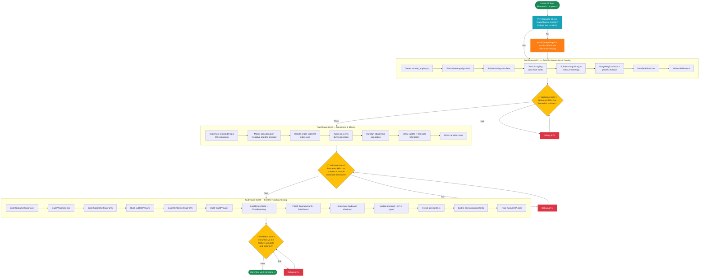

# Phase 05 — The Polish

## Layer 1 Overview Document

---

| **Field**              | **Value**                                                                  |
| ---------------------- | -------------------------------------------------------------------------- |
| **Phase**              | Phase 05 — The Polish                                                      |
| **Codename**           | The Polish                                                                 |
| **Layer**              | Layer 1 (Phase Overview)                                                   |
| **Status**             | Not Started                                                                |
| **Parent Document**    | [00_Project_Overview.md](../00_Project_Overview.md) (Layer 0)              |
| **Previous Phase**     | [Phase 04 — The Vision](../Phase_04_The_Vision/Phase_04_Overview.md)       |
| **Next Phase**         | None — Phase 05 is the final phase of StoryFlow v1.0                       |
| **Dependencies**       | Phase 04 must be 100% complete (see §2 for details)                        |
| **Sub-Phases**         | 3 (05.01, 05.02, 05.03)                                                   |
| **Est. Task Documents**| 30–45 across all 3 sub-phases                                             |

---

## Table of Contents

- [1. Phase Objective](#1-phase-objective)
- [2. Relationship to Parent & Previous Documents](#2-relationship-to-parent--previous-documents)
  - [2.1 Inherited from Layer 0](#21-inherited-from-layer-0)
  - [2.2 Inherited from Phase 01 (Transitive)](#22-inherited-from-phase-01-transitive)
  - [2.3 Inherited from Phase 02 (Transitive)](#23-inherited-from-phase-02-transitive)
  - [2.4 Inherited from Phase 03 (Transitive)](#24-inherited-from-phase-03-transitive)
  - [2.5 Inherited from Phase 04 (Direct Dependency)](#25-inherited-from-phase-04-direct-dependency)
  - [2.6 One-Directional Rule](#26-one-directional-rule)
- [3. Architecture Context for This Phase](#3-architecture-context-for-this-phase)
  - [3.1 Technology Stack (Phase 05 Scope)](#31-technology-stack-phase-05-scope)
  - [3.2 New Dependencies Introduced in Phase 05](#32-new-dependencies-introduced-in-phase-05)
  - [3.3 Database Models (Reiterated — Unchanged)](#33-database-models-reiterated--unchanged)
  - [3.4 Phase 04 Deliverables That Phase 05 Builds Upon](#34-phase-04-deliverables-that-phase-05-builds-upon)
  - [3.5 Directory Structure After Phase 05](#35-directory-structure-after-phase-05)
  - [3.6 API Endpoints (Phase 05 Scope)](#36-api-endpoints-phase-05-scope)
- [4. Sub-Phase Breakdown](#4-sub-phase-breakdown)
  - [4.1 SubPhase 05.01 — Subtitle Generation & Overlay](#41-subphase-0501--subtitle-generation--overlay)
  - [4.2 SubPhase 05.02 — Transitions & Effects](#42-subphase-0502--transitions--effects)
  - [4.3 SubPhase 05.03 — Final UI Polish & Testing](#43-subphase-0503--final-ui-polish--testing)
- [5. Execution Order](#5-execution-order)
  - [5.1 Sub-Phase Dependency Chain](#51-sub-phase-dependency-chain)
  - [5.2 Execution Order Flowchart](#52-execution-order-flowchart)
- [6. Sub-Phase Folder Structure](#6-sub-phase-folder-structure)
- [7. Files Created & Modified in This Phase](#7-files-created--modified-in-this-phase)
  - [7.1 Backend Files](#71-backend-files)
  - [7.2 Frontend Files](#72-frontend-files)
  - [7.3 File Creation Map (Mermaid)](#73-file-creation-map-mermaid)
- [8. Detailed Module Specifications](#8-detailed-module-specifications)
  - [8.1 Subtitle Generation Algorithm](#81-subtitle-generation-algorithm)
  - [8.2 Subtitle Overlay with TextClip](#82-subtitle-overlay-with-textclip)
  - [8.3 Crossfade Transitions](#83-crossfade-transitions)
  - [8.4 Modified Rendering Pipeline](#84-modified-rendering-pipeline)
  - [8.5 GlobalSettings UI](#85-globalsettings-ui)
  - [8.6 Final UI Polish & Quality-of-Life Improvements](#86-final-ui-polish--quality-of-life-improvements)
- [9. Technology Setup Details](#9-technology-setup-details)
- [10. Constraints Specific to Phase 05](#10-constraints-specific-to-phase-05)
- [11. Exit Criteria](#11-exit-criteria)
- [12. Cross-References](#12-cross-references)

---

## 1. Phase Objective

Phase 05 — **The Polish** — is the **final phase** of StoryFlow v1.0 development. It takes the functional but minimal rendering pipeline from Phase 04 and adds the production-quality finishing touches that transform a basic slideshow into a professional-looking narrative video.

### What Phase 05 Builds

1. **Subtitle Generation & Overlay Engine (`core_engine/subtitle_engine.py`)** — A module that splits each segment's `text_content` into timed word-chunks (5–7 words each), generates `TextClip` overlays positioned at the bottom-center of each frame, and composites them onto the video clips before final concatenation. This produces burned-in "YouTube-style" subtitles that follow the narration.

2. **Crossfade Transitions** — Smooth 0.5-second crossfade transitions between consecutive clips in the concatenated video. Instead of hard-cutting from one segment to the next, the outgoing clip fades out while the incoming clip fades in, creating a polished viewing experience.

3. **GlobalSettings Editing UI** — A frontend settings panel (in the project's left sidebar) that allows the user to edit all `GlobalSettings` values: `default_voice_id`, `tts_speed`, `zoom_intensity`, `subtitle_font`, and `subtitle_color`. Changes are persisted to the database and applied on the next render.

4. **Final UI Polish & Quality-of-Life Improvements** — Error handling improvements, loading states, empty states, toast notifications, keyboard shortcuts, drag-and-drop reordering enhancements, and overall visual refinement of every page and component built across Phases 01–04.

5. **End-to-End Integration Testing** — Comprehensive tests that exercise the complete workflow: import story → upload images → generate audio → configure settings → render video with subtitles and transitions → download.

### What Phase 05 Does NOT Build

> **Critical:** Phase 05 is the final phase. The following features are explicitly **out of scope** for v1.0 of StoryFlow.

- ❌ Multiple output format options (MP4 only for v1.0)
- ❌ Custom transition styles beyond crossfade (dissolve, wipe, slide, etc.)
- ❌ Per-segment subtitle customization (uniform style across all segments)
- ❌ Real-time video preview during editing (preview is post-render only)
- ❌ Multi-project batch rendering
- ❌ Cloud deployment, Docker, Redis, Celery (permanent architectural constraints)
- ❌ User authentication or multi-user support (permanent constraint — local-only)
- ❌ Automated image generation (user curates images manually — "Human-in-the-Loop")
- ❌ Advanced audio effects (equalization, background music mixing, etc.)
- ❌ Video templates or themes system

At the conclusion of Phase 05, StoryFlow v1.0 is **feature-complete**: a user can import a story, upload images, generate audio, configure rendering settings, and export a production-quality MP4 video with Ken Burns effects, burned-in subtitles, and smooth crossfade transitions — all running locally with zero cloud dependencies.

---

## 2. Relationship to Parent & Previous Documents

### 2.1 Inherited from Layer 0

Phase 05 inherits all architectural decisions, constraints, and conventions from the Layer 0 master overview:

| Layer 0 Section                                      | Phase 05 Relevance                                                        |
| ---------------------------------------------------- | ------------------------------------------------------------------------- |
| §1 — Project Vision                                  | Phase 05 completes the full v1.0 vision of StoryFlow                      |
| §2.2 — Technology Stack                              | Phase 05 activates MoviePy `TextClip` (requires ImageMagick)              |
| §3.2.3 — GlobalSettings Model                        | Phase 05 builds the UI for `subtitle_font`, `subtitle_color`, `default_voice_id`, `tts_speed`, `zoom_intensity` |
| §5.4 — Video Rendering Module (step 3: subtitles)    | **Primary reference.** Phase 05 implements subtitle overlay.              |
| §5.4 — Video Rendering Module (step 4: transitions)  | **Primary reference.** Phase 05 implements crossfade transitions.         |
| §5.5 — Ken Burns Effect Algorithm                    | Unchanged — Ken Burns continues to work alongside subtitles/transitions   |
| §6 — API Endpoints                                   | Phase 05 adds GlobalSettings CRUD endpoints                               |
| §14 — Development Constraints                        | All constraints remain in force. No Docker, no Redis, no cloud.           |
| §15 — Quality Standards                              | Phase 05 enforces all quality standards for the final v1.0 release        |

### 2.2 Inherited from Phase 01 (Transitive)

| Phase 01 Artifact                          | Still Relevant In Phase 05 Because                                        |
| ------------------------------------------ | ------------------------------------------------------------------------- |
| Django project structure                   | All backend work happens within this Django project                        |
| Next.js project structure                  | All frontend work happens within this Next.js project                     |
| `Project` model                            | Status field read/written during rendering; no model changes               |
| `Segment` model (`text_content`)           | **First active use of `text_content` in rendering** — used for subtitle generation |
| `GlobalSettings` model                     | **All fields now actively used** — Phase 05 builds the editing UI          |
| Dashboard page (`/app/page.tsx`)           | **Polished** in Phase 05 with improved loading states, error handling      |

### 2.3 Inherited from Phase 02 (Transitive)

| Phase 02 Artifact                          | Still Relevant In Phase 05 Because                                        |
| ------------------------------------------ | ------------------------------------------------------------------------- |
| Import & Parse Engine                      | Unchanged — works as built                                                |
| Image Upload Pipeline                      | Unchanged — `Segment.image_file` consumed by renderer                      |
| Timeline Editor UI                         | **Polished** with improved drag-and-drop, keyboard shortcuts, error states |
| `SegmentCard` component                    | **Polished** with subtitle preview toggle and visual refinements           |
| `lib/stores.ts` Zustand store              | **Extended** with GlobalSettings state                                     |
| `lib/api.ts` client                        | **Extended** with GlobalSettings API calls                                 |

### 2.4 Inherited from Phase 03 (Transitive)

| Phase 03 Artifact                          | Still Relevant In Phase 05 Because                                        |
| ------------------------------------------ | ------------------------------------------------------------------------- |
| TTS Engine (Kokoro-82M)                    | `default_voice_id` and `tts_speed` from GlobalSettings now configurable via UI |
| `.wav` audio files per segment             | Audio duration determines subtitle timing per segment                      |
| `Segment.audio_duration`                   | Used to calculate subtitle chunk timing within each clip                   |
| `api/tasks.py` (TaskManager)               | Continues to manage render background tasks                                |
| Audio Playback UI                          | Unchanged — remains functional                                             |

### 2.5 Inherited from Phase 04 (Direct Dependency)

Phase 05 **directly depends** on Phase 04's rendering pipeline. The following Phase 04 artifacts are prerequisites:

| Phase 04 Artifact                                  | Used by Phase 05 For                                                      |
| -------------------------------------------------- | ------------------------------------------------------------------------- |
| `core_engine/video_renderer.py` (full implementation) | **Modified** to add subtitle overlay and crossfade transitions            |
| `core_engine/ken_burns.py` (full implementation)   | Unchanged — Ken Burns clips are composited with subtitles on top           |
| `core_engine/render_utils.py`                      | **Extended** with subtitle font utilities and validation                   |
| Render API (`POST /api/projects/{id}/render/`)     | Unchanged — same endpoint, now produces video with subtitles + transitions |
| Render Status API (`GET /api/projects/{id}/status/`) | Unchanged — same polling mechanism                                        |
| `Project.status` transitions (PROCESSING→COMPLETED) | Unchanged — same status flow                                              |
| `RenderButton.tsx`                                 | **Polished** with improved UX                                              |
| `RenderProgress.tsx`                               | **Polished** with subtitle/transition phase indicators                     |
| `VideoPreview.tsx`                                 | Unchanged — plays the now-enhanced video with subtitles + transitions      |
| `RenderStatusBadge.tsx`                            | Unchanged                                                                  |
| `lib/stores.ts` (render state)                     | **Extended** with GlobalSettings state management                          |
| All Phase 01–04 UI components                      | **Polished** for final v1.0 quality                                        |

> **Important for AI Agents:** You do NOT need to re-read previous Phase overviews in their entirety. The tables above summarize everything Phase 05 needs from each prior phase. If specific implementation details are needed, refer to Section 3 of this document.

### 2.6 One-Directional Rule

> As defined in [00_Project_Overview.md](../00_Project_Overview.md) (Layer 0, §7.3): Documents flow TOP-DOWN only. This Phase 05 Overview inherits from and must be consistent with:
> - [00_Project_Overview.md](../00_Project_Overview.md) (Layer 0)
> - [Phase_01_Overview.md](../Phase_01_The_Skeleton/Phase_01_Overview.md) (Layer 1 — Phase 01)
> - [Phase_02_Overview.md](../Phase_02_The_Logic/Phase_02_Overview.md) (Layer 1 — Phase 02)
> - [Phase_03_Overview.md](../Phase_03_The_Voice/Phase_03_Overview.md) (Layer 1 — Phase 03)
> - [Phase_04_Overview.md](../Phase_04_The_Vision/Phase_04_Overview.md) (Layer 1 — Phase 04)
>
> If any content here conflicts with a parent document, the **higher-level document takes precedence**. Phase 05 does NOT modify any prior model definitions, API contracts, or architectural decisions — it only EXTENDS them.
>
> Phase 05 is the **final phase**. There are no subsequent phases to reference forward to. Any future work beyond Phase 05 would require a new version of the project overview (Layer 0).

---

## 3. Architecture Context for This Phase

This section provides all the architectural context an AI agent needs while working on Phase 05. This is self-contained — agents should not need to re-read Layer 0 or previous Phase overviews.

### 3.1 Technology Stack (Phase 05 Scope)

Phase 05 activates the **subtitle rendering** capability and introduces the final system-wide dependency: **ImageMagick**.

| Component              | Technology                        | Phase 05 Usage                                       |
| ---------------------- | --------------------------------- | ---------------------------------------------------- |
| Backend Framework      | Django 5.x + DRF                  | GlobalSettings API, subtitle processing              |
| Database               | SQLite                            | GlobalSettings CRUD, no schema changes                |
| Frontend Framework     | Next.js 16+ (App Router)          | Settings panel, UI polish, final QoL                  |
| Language (FE)          | TypeScript (Strict)               | Settings types, subtitle preview types                |
| Styling                | Tailwind CSS 4                    | Settings panel layout, toast notifications, refinements |
| UI Components          | Shadcn/UI                         | Settings form (Select, Input, ColorPicker), Toast, Dialog |
| State Management       | Zustand                           | Extended with GlobalSettings state                    |
| HTTP Client            | Axios                             | GlobalSettings CRUD calls                             |
| Video Processing       | MoviePy 1.0.3 / 2.0              | `TextClip` for subtitles, crossfade for transitions   |
| **Text Rendering**     | **MoviePy `TextClip` + ImageMagick** | **NEW — Subtitle overlay generation**               |
| Image Processing       | Pillow                            | Font file validation                                  |
| Math Operations        | NumPy                             | Unchanged — Ken Burns continues to work               |
| Background Tasks       | Python `concurrent.futures`       | Unchanged — render tasks use same pool                |

### 3.2 New Dependencies Introduced in Phase 05

Phase 05 requires **one new system-level dependency**: ImageMagick. No new Python packages are needed (MoviePy is already installed from Phase 04).

**New System Dependency:**

> **ImageMagick** — Required by MoviePy's `TextClip` for rendering text onto video frames. MoviePy uses ImageMagick's `convert` command internally to rasterize text with custom fonts, colors, and stroke effects. Without ImageMagick, `TextClip` will throw an error.

**No new Python packages.** MoviePy (already in `requirements.txt` from Phase 04) includes `TextClip` — it just needs ImageMagick on the system PATH.

**No new npm packages.** All frontend UI needs are covered by existing Shadcn/UI components.

**New Shadcn/UI Components to Install:**
- `Toast` / `Sonner` — For toast notifications across the app (render complete, settings saved, errors).
- `ColorPicker` — For the subtitle color setting (or a simple hex input field if a full picker is too complex).
- `Select` — Already installed; used for voice selection dropdown.
- `Slider` — Already installed; may be used for TTS speed and zoom intensity inputs.

### 3.3 Database Models (Reiterated — Unchanged)

Phase 05 does **not modify** any model definitions. Here are all model fields relevant to Phase 05:

#### GlobalSettings Model — All Fields Now Active

| Field              | Type        | Default       | Phase 05 Usage                                                    |
| ------------------ | ----------- | ------------- | ----------------------------------------------------------------- |
| `default_voice_id` | CharField  | `"af_bella"`  | **UI built.** User selects from a dropdown of Kokoro voice IDs.   |
| `tts_speed`        | FloatField | `1.0`         | **UI built.** User adjusts via slider (range: 0.5–2.0).          |
| `zoom_intensity`   | FloatField | `1.3`         | **UI built.** User adjusts via slider (range: 1.0–2.0).          |
| `subtitle_font`    | CharField  | —             | **UI built + consumed.** User selects or uploads a `.ttf` font.   |
| `subtitle_color`   | CharField  | `"#FFFFFF"`   | **UI built + consumed.** User picks a subtitle text color.        |

#### Segment Model — Fields Newly Consumed in Phase 05

| Field             | Type         | Phase 05 Usage                                                    |
| ----------------- | ------------ | ----------------------------------------------------------------- |
| `text_content`    | TextField    | **First use in rendering.** Split into word-chunks for subtitles. |
| `audio_duration`  | FloatField   | Used to time subtitle appearance within each clip.                 |

#### Project Model — No New Usage

All Project model fields used in Phase 05 (`status`, `resolution_width`, `resolution_height`, `framerate`, `output_path`) are already actively used from Phase 04. No changes.

### 3.4 Phase 04 Deliverables That Phase 05 Builds Upon

The following is the exact state of the codebase at the start of Phase 05 (i.e., after Phase 04 is complete):

**Backend (running on `localhost:8000`):**
- Everything from Phases 01–03, plus:
- `core_engine/video_renderer.py` — **Fully functional** MoviePy rendering pipeline (static images + Ken Burns + concatenation + MP4 export). Phase 05 modifies this to add subtitle overlay and crossfade transitions.
- `core_engine/ken_burns.py` — **Fully functional** Ken Burns zoom/pan algorithm. Phase 05 does NOT modify this.
- `core_engine/render_utils.py` — FFmpeg check, image resizing, output path management. Phase 05 extends this with subtitle/font utilities.
- `api/views.py` — All CRUD + import + audio + render + status endpoints. Phase 05 adds GlobalSettings endpoints.
- `api/urls.py` — All routes from Phases 01–04. Phase 05 adds GlobalSettings routes.
- `api/tasks.py` — TaskManager with ThreadPoolExecutor. Phase 05 does NOT modify this.
- `requirements.txt` — Includes django, drf, cors-headers, Pillow, onnxruntime, soundfile, numpy, moviepy.
- `/media/projects/{id}/output/final.mp4` — Rendered videos exist (from Phase 04).

**Frontend (running on `localhost:3000`):**
- Everything from Phases 01–03, plus:
- `components/RenderButton.tsx` — Functional "Export Video" button.
- `components/RenderProgress.tsx` — Real-time render progress display.
- `components/VideoPreview.tsx` — HTML5 video player for output.
- `components/RenderStatusBadge.tsx` — Project render state indicator.
- `lib/stores.ts` — Zustand store with project + segment + audio + render state.
- `lib/api.ts` — All API functions from Phases 01–04.
- `lib/types.ts` — All types from Phases 01–04.
- Footer: "Generate All Audio" **(enabled)**, "Export Video" **(enabled, functional)**.

**Key Infrastructure State:**
- The rendering pipeline works end-to-end: import → upload → TTS → render → download.
- Videos render **without subtitles** and **without transitions** (hard cuts between segments).
- `GlobalSettings` exists in the database but has **no frontend editing UI** (only defaults).
- The UI is functional but may lack polish: missing loading states, error handling edge cases, empty states, etc.

### 3.5 Directory Structure After Phase 05

After Phase 05, the project structure will include these additions (new files marked with `← NEW`):

```
/storyflow_root
│
├── /backend
│   ├── /api
│   │   ├── models.py                  (unchanged)
│   │   ├── serializers.py             ← MODIFIED (GlobalSettings serializer)
│   │   ├── views.py                   ← MODIFIED (GlobalSettings ViewSet, settings API)
│   │   ├── urls.py                    ← MODIFIED (GlobalSettings routes)
│   │   ├── tasks.py                   (unchanged from Phase 04)
│   │   ├── parsers.py                 (unchanged)
│   │   ├── validators.py              ← MODIFIED (subtitle font validation)
│   │   └── tests.py                   ← MODIFIED (subtitle + transition + settings tests)
│   │
│   ├── /core_engine
│   │   ├── __init__.py                (unchanged)
│   │   ├── tts_wrapper.py             (unchanged from Phase 03)
│   │   ├── model_loader.py            (unchanged from Phase 03)
│   │   ├── audio_utils.py             (unchanged from Phase 03)
│   │   ├── video_renderer.py          ← MODIFIED (subtitle compositing + crossfade)
│   │   ├── ken_burns.py               (unchanged from Phase 04)
│   │   ├── render_utils.py            ← MODIFIED (font utils, subtitle helpers)
│   │   └── subtitle_engine.py         ← NEW (word-chunking, timing, TextClip generation)
│   │
│   ├── /media
│   │   └── /projects
│   │       └── /{project_uuid}
│   │           ├── /images            (populated in Phase 02)
│   │           ├── /audio             (populated in Phase 03)
│   │           └── /output            (populated in Phase 04, re-rendered in Phase 05)
│   │                 └── final.mp4    (now with subtitles + transitions)
│   │
│   ├── /fonts                         ← NEW (default subtitle fonts directory)
│   │   └── default.ttf               ← NEW (bundled default font)
│   │
│   └── requirements.txt               (unchanged from Phase 04)
│
├── /frontend
│   ├── /app
│   │   └── /projects
│   │       └── /[id]
│   │           └── page.tsx           ← MODIFIED (settings sidebar, polished layout)
│   │
│   ├── /components
│   │   ├── GlobalSettingsPanel.tsx     ← NEW (settings editing form)
│   │   ├── VoiceSelector.tsx          ← NEW (Kokoro voice dropdown)
│   │   ├── SubtitleSettingsForm.tsx   ← NEW (font + color settings)
│   │   ├── RenderSettingsForm.tsx     ← NEW (zoom, framerate, resolution controls)
│   │   ├── SubtitlePreview.tsx        ← NEW (visual preview of subtitle styling)
│   │   ├── EmptyState.tsx             ← NEW (reusable empty state component)
│   │   ├── ErrorBoundary.tsx          ← NEW (React error boundary)
│   │   ├── ToastProvider.tsx          ← NEW (global toast notification wrapper)
│   │   ├── SegmentCard.tsx            ← MODIFIED (subtitle preview toggle, polish)
│   │   ├── RenderButton.tsx           ← MODIFIED (polish, better error states)
│   │   ├── RenderProgress.tsx         ← MODIFIED (subtitle/transition phase labels)
│   │   └── (all Phase 01-04 components polished)
│   │
│   ├── /lib
│   │   ├── api.ts                     ← MODIFIED (GlobalSettings CRUD functions)
│   │   ├── types.ts                   ← MODIFIED (GlobalSettings types, voice list)
│   │   ├── stores.ts                  ← MODIFIED (GlobalSettings state + actions)
│   │   ├── utils.ts                   ← MODIFIED (subtitle preview helpers)
│   │   └── constants.ts              ← NEW (voice list, default values, validation rules)
│   │
│   └── (rest unchanged)
│
└── (rest unchanged)
```

### 3.6 API Endpoints (Phase 05 Scope)

Phase 05 introduces the GlobalSettings CRUD endpoint. All prior endpoints remain unchanged.

| Method   | Endpoint                                  | Status in Phase 05 | Description                                        |
| -------- | ----------------------------------------- | ------------------- | -------------------------------------------------- |
| `GET`    | `/api/settings/`                          | **NEW**             | Retrieve current GlobalSettings                    |
| `PATCH`  | `/api/settings/`                          | **NEW**             | Update GlobalSettings fields                       |
| `GET`    | `/api/settings/voices/`                   | **NEW**             | List available Kokoro voice IDs                    |
| `POST`   | `/api/settings/font/upload/`              | **NEW**             | Upload a custom `.ttf` font file                   |

All Phase 01–04 endpoints remain **unchanged and functional**.

#### GlobalSettings Retrieve Endpoint

**`GET /api/settings/`**

Returns the singleton GlobalSettings object.

**Response (200 OK):**
```json
{
  "default_voice_id": "af_bella",
  "tts_speed": 1.0,
  "zoom_intensity": 1.3,
  "subtitle_font": "/fonts/default.ttf",
  "subtitle_color": "#FFFFFF",
  "available_voices": [
    { "id": "af_bella", "name": "Bella (Female)", "language": "en" },
    { "id": "am_adam", "name": "Adam (Male)", "language": "en" }
  ]
}
```

#### GlobalSettings Update Endpoint

**`PATCH /api/settings/`**

Updates one or more GlobalSettings fields. Only provided fields are updated (partial update).

**Request Body (example — updating subtitle color):**
```json
{
  "subtitle_color": "#FFD700"
}
```

**Validation Rules:**
- `default_voice_id`: Must be a valid voice ID from the available voices list.
- `tts_speed`: Must be between 0.5 and 2.0 (inclusive).
- `zoom_intensity`: Must be between 1.0 and 2.0 (inclusive).
- `subtitle_font`: Must point to an existing `.ttf` file on disk.
- `subtitle_color`: Must be a valid hex color string (3 or 6 digit, with `#` prefix).

**Response (200 OK):**
```json
{
  "default_voice_id": "af_bella",
  "tts_speed": 1.0,
  "zoom_intensity": 1.3,
  "subtitle_font": "/fonts/default.ttf",
  "subtitle_color": "#FFD700"
}
```

#### Available Voices Endpoint

**`GET /api/settings/voices/`**

Returns a list of all available Kokoro voice IDs that the system can use for TTS. This is determined by scanning available voice configurations in the Kokoro model.

**Response (200 OK):**
```json
{
  "voices": [
    { "id": "af_bella", "name": "Bella", "gender": "female", "language": "en" },
    { "id": "af_sarah", "name": "Sarah", "gender": "female", "language": "en" },
    { "id": "am_adam", "name": "Adam", "gender": "male", "language": "en" },
    { "id": "am_michael", "name": "Michael", "gender": "male", "language": "en" }
  ]
}
```

#### Font Upload Endpoint

**`POST /api/settings/font/upload/`**

Upload a custom `.ttf` font file for subtitle rendering.

**Request:** `multipart/form-data` with `font_file` field.

**Behavior:**
1. Validate the uploaded file is a valid `.ttf` or `.otf` font file.
2. Save to `/fonts/` directory.
3. Update `GlobalSettings.subtitle_font` to point to the new file.

**Response (200 OK):**
```json
{
  "subtitle_font": "/fonts/custom_font.ttf",
  "message": "Font uploaded successfully"
}
```

---

## 4. Sub-Phase Breakdown

Phase 05 is divided into exactly **3 sub-phases**, executed strictly in order. Each sub-phase has its own Layer 2 overview document and a set of Layer 3 task documents.

### 4.1 SubPhase 05.01 — Subtitle Generation & Overlay

| Field              | Value                                                                            |
| ------------------ | -------------------------------------------------------------------------------- |
| **Sub-Phase ID**   | 05.01                                                                            |
| **Name**           | Subtitle Generation & Overlay                                                    |
| **Folder**         | `SubPhase_05_01_Subtitle_Generation_Overlay/`                                    |
| **Overview File**  | `SubPhase_05_01_Overview.md`                                                     |
| **Dependencies**   | Phase 04 complete (rendering pipeline produces MP4 with Ken Burns)               |
| **Est. Task Docs** | 10–15                                                                            |

**Objective:** Build the subtitle engine that splits narration text into timed word-chunks, generates styled `TextClip` overlays, and composites them onto the video clips. After this sub-phase, rendered videos contain burned-in subtitles.

**Key Deliverables:**

1. **Subtitle Engine (`core_engine/subtitle_engine.py`)**
   - Main function: `generate_subtitle_clips(text_content: str, audio_duration: float, resolution: tuple, font: str, color: str) -> list[TextClip]`
   - Steps:
     a. Split `text_content` into word-chunks of 5–7 words each.
     b. Calculate timing: distribute the `audio_duration` evenly across all chunks (or proportionally by word count).
     c. For each chunk, create a `TextClip` with the specified font, color, and stroke styling.
     d. Position each `TextClip` at `("center", "bottom")` with a margin from the bottom edge.
     e. Set each `TextClip` start time and duration based on the calculated timing.
     f. Return the list of timed `TextClip` objects.

2. **Word-Chunking Algorithm**
   - Function: `chunk_text(text: str, max_words: int = 6) -> list[str]`
   - Rules:
     - Each chunk contains at most `max_words` words (default: 6, range: 5–7).
     - Prefer breaking at sentence boundaries (`.`, `!`, `?`) when possible.
     - Prefer breaking at clause boundaries (`,`, `;`, `:`, `—`) as secondary preference.
     - Never break in the middle of a word.
     - Handle edge cases: single-word segments, segments with no text, very long words.

3. **Subtitle Timing Calculator**
   - Function: `calculate_subtitle_timing(chunks: list[str], total_duration: float) -> list[tuple[float, float]]`
   - Returns a list of `(start_time, duration)` tuples, one per chunk.
   - Proportional timing: longer chunks (more words) get proportionally more time.
   - Formula: `chunk_duration = (chunk_word_count / total_word_count) * total_duration`
   - Minimum display time per chunk: 0.5 seconds (even for 1-word chunks).
   - No gaps between chunks — subtitles are continuous throughout the segment.

4. **TextClip Styling ("YouTube-style")**
   - As specified in [System Architecture Document](../../System%20Architecture%20Document.md) (§5.4, step 3) and [00_Project_Overview.md](../00_Project_Overview.md) (§5.4, step 6):
     - **Font:** From `GlobalSettings.subtitle_font` (or fallback to bundled default).
     - **Font Size:** Calculated proportionally to resolution (e.g., `resolution_height / 18` for ~60px at 1080p).
     - **Text Color:** From `GlobalSettings.subtitle_color` (default: `#FFFFFF` — white).
     - **Stroke Color:** Black (`#000000`).
     - **Stroke Width:** 2–3 pixels (for readability over any background).
     - **Font Weight:** Bold.
     - **Position:** `("center", "bottom")` with a bottom margin of ~5% of resolution height.
     - **Background:** None (transparent — text floats over the video).

5. **Subtitle Compositing in Renderer**
   - Modify `video_renderer.py` to composite subtitle `TextClip`s onto each segment's Ken Burns clip.
   - For each segment:
     a. Generate Ken Burns clip (from Phase 04 — unchanged).
     b. Generate subtitle clips for this segment's `text_content`.
     c. Use `CompositeVideoClip([ken_burns_clip, *subtitle_clips])` to overlay subtitles.
     d. Set the composited clip's audio to the segment's audio clip.
   - The subtitle clips are layered ON TOP of the Ken Burns clip.

6. **Default Font Bundling**
   - Bundle a default `.ttf` font file in `/backend/fonts/default.ttf`.
   - Use a permissively licensed font (e.g., Roboto Bold, Open Sans Bold, or Noto Sans Bold — all available under open licenses).
   - If `GlobalSettings.subtitle_font` is empty or the font file doesn't exist, fall back to this default.

7. **ImageMagick Availability Check**
   - Add to `render_utils.py`: `check_imagemagick() -> bool` — Verify ImageMagick is installed and accessible.
   - If ImageMagick is missing:
     - Log a clear warning: "ImageMagick not found. Subtitles will be disabled."
     - The renderer should **still produce a video** (without subtitles) rather than failing.
     - The render status response should include a warning: `"warnings": ["Subtitles disabled: ImageMagick not found"]`.

8. **Subtitle Tests**
   - Test word-chunking: various text lengths, punctuation handling, edge cases.
   - Test timing calculation: proportional distribution, minimum duration enforcement.
   - Test TextClip generation: verify clips have correct duration, position, styling.
   - Integration test: render a segment with subtitles, verify video contains text overlay.

### 4.2 SubPhase 05.02 — Transitions & Effects

| Field              | Value                                                                            |
| ------------------ | -------------------------------------------------------------------------------- |
| **Sub-Phase ID**   | 05.02                                                                            |
| **Name**           | Transitions & Effects                                                            |
| **Folder**         | `SubPhase_05_02_Transitions_Effects/`                                            |
| **Overview File**  | `SubPhase_05_02_Overview.md`                                                     |
| **Dependencies**   | SubPhase 05.01 complete (subtitles render correctly)                             |
| **Est. Task Docs** | 8–10                                                                             |

**Objective:** Add smooth crossfade transitions between consecutive clips in the concatenated video and ensure they work correctly alongside Ken Burns effects and subtitles.

**Key Deliverables:**

1. **Crossfade Transition Logic**
   - As specified in [System Architecture Document](../../System%20Architecture%20Document.md) (§5.4, step 4) and [00_Project_Overview.md](../00_Project_Overview.md) (§5.4, step 7):
   - Transition duration: **0.5 seconds** (fixed — not user-configurable in v1.0).
   - Implementation: MoviePy's built-in crossfade mechanism.
   - The outgoing clip's last 0.5s fades out (opacity decreases) while the incoming clip's first 0.5s fades in (opacity increases).

2. **Modified Concatenation in Renderer**
   - Replace the current simple concatenation in `video_renderer.py`:
     ```python
     # Phase 04 (no transitions):
     final = concatenate_videoclips(clips, method="compose")

     # Phase 05 (with crossfade transitions):
     # Apply crossfadein/crossfadeout to adjacent clips
     transition_duration = 0.5  # seconds
     for i, clip in enumerate(clips):
         if i > 0:
             clips[i] = clip.crossfadein(transition_duration)
         if i < len(clips) - 1:
             clips[i] = clips[i].crossfadeout(transition_duration)
     final = concatenate_videoclips(clips, method="compose", padding=-transition_duration)
     ```
   - **Key detail:** The `padding=-transition_duration` parameter makes clips overlap by 0.5s, creating the actual crossfade effect. Without negative padding, the fades would occur on black frames.

3. **Duration Adjustment**
   - Crossfade transitions slightly reduce the total video duration because clips overlap.
   - For N clips: total reduction = `(N - 1) × 0.5` seconds.
   - This is expected and acceptable. Do not attempt to "stretch" clips to compensate.

4. **Single-Segment Edge Case**
   - If a project has only 1 segment, there are no transitions to apply. The single clip is exported as-is (with subtitles but no crossfade).

5. **Audio During Crossfade**
   - During the 0.5s crossfade, both clips' audio overlaps. MoviePy handles this automatically by mixing audio during the overlap period.
   - This creates a natural "cross-mix" of the outgoing and incoming narration, which sounds smooth for short overlaps.

6. **Transition + Subtitle Interaction**
   - Subtitles are composited onto each clip BEFORE transitions are applied.
   - During the crossfade, both clips' subtitles will be visible (blending during the overlap). This is acceptable and visually coherent since the outgoing subtitle fades out while the incoming one fades in.

7. **Transition Tests**
   - Test crossfade between 2 clips: verify output duration is `clip1 + clip2 - 0.5s`.
   - Test crossfade between 3+ clips: verify total duration math.
   - Test single-clip project: no transitions, same as Phase 04 output.
   - Visual test: verify the crossfade is smooth and not jarring.

### 4.3 SubPhase 05.03 — Final UI Polish & Testing

| Field              | Value                                                                            |
| ------------------ | -------------------------------------------------------------------------------- |
| **Sub-Phase ID**   | 05.03                                                                            |
| **Name**           | Final UI Polish & Testing                                                        |
| **Folder**         | `SubPhase_05_03_Final_UI_Polish_Testing/`                                        |
| **Overview File**  | `SubPhase_05_03_Overview.md`                                                     |
| **Dependencies**   | SubPhase 05.02 complete (transitions work correctly)                             |
| **Est. Task Docs** | 12–18                                                                            |

**Objective:** Build the GlobalSettings editing UI, add quality-of-life improvements across the entire application, and perform comprehensive end-to-end testing. This sub-phase delivers the final production-quality v1.0 user experience.

**Key Deliverables:**

1. **GlobalSettings Panel (`components/GlobalSettingsPanel.tsx`)**
   - A collapsible panel in the project detail page's left sidebar.
   - Sections:
     - **Voice Settings:** Voice selector dropdown + TTS speed slider.
     - **Render Settings:** Zoom intensity slider + resolution display (read-only in v1.0) + framerate display (read-only in v1.0).
     - **Subtitle Settings:** Font selector/uploader + color picker + live preview of subtitle styling.
   - On change: `PATCH /api/settings/` to persist immediately (auto-save, no explicit "Save" button).
   - Show a success toast: "Settings saved" on successful update.
   - Show an error toast with the validation error on failure.

2. **Voice Selector (`components/VoiceSelector.tsx`)**
   - Dropdown showing all available Kokoro voice IDs.
   - Populated from `GET /api/settings/voices/`.
   - Current selection highlighted.
   - On change: updates `GlobalSettings.default_voice_id`.
   - **Important:** Changing the voice does NOT automatically re-generate existing audio. The user must manually trigger "Generate All Audio" again to hear the new voice. The UI should display a warning: "Voice changed. Re-generate audio to hear the new voice."

3. **Subtitle Settings Form (`components/SubtitleSettingsForm.tsx`)**
   - **Font Selector:**
     - Shows the current font name (parsed from the font file path).
     - "Upload Font" button that accepts `.ttf` and `.otf` files.
     - Uploads via `POST /api/settings/font/upload/`.
     - Falls back to the bundled default font if no custom font is set.
   - **Color Picker:**
     - Shows the current subtitle color as a color swatch + hex value.
     - On click: opens a hex color input (or a simple Shadcn/UI color picker).
     - Updates `GlobalSettings.subtitle_color` on change.

4. **Subtitle Preview (`components/SubtitlePreview.tsx`)**
   - A small preview box in the subtitle settings section.
   - Shows a sample text line (e.g., "The quick brown fox jumps over") rendered with the current font and color settings.
   - Background: dark gray (to simulate video background).
   - Text style: matches the actual subtitle rendering (font, color, stroke, bold).
   - Updates in real-time as the user changes font or color.

5. **Render Settings Form (`components/RenderSettingsForm.tsx`)**
   - **Zoom Intensity Slider:**
     - Range: 1.0 to 2.0, step: 0.1.
     - Shows current value.
     - Updates `GlobalSettings.zoom_intensity` on change.
   - **Resolution Display (read-only):**
     - Shows "1920×1080 (1080p)" as a static text.
     - In v1.0, resolution is not user-configurable (always 1920×1080).
   - **Framerate Display (read-only):**
     - Shows "30 fps" as a static text.
     - In v1.0, framerate is not user-configurable (always 30fps).

6. **Toast Notification System (`components/ToastProvider.tsx`)**
   - Global toast notification provider wrapping the entire application.
   - Uses Shadcn/UI's `Toast` or the `Sonner` library.
   - Toast types: success (green), error (red), warning (yellow), info (blue).
   - Replace all `alert()` or `console.log()` user-facing messages with toast notifications.
   - Key toast events:
     - ✅ "Settings saved successfully"
     - ✅ "Audio generation complete"
     - ✅ "Video rendering complete — click to view"
     - ❌ "Rendering failed: [error message]"
     - ⚠️ "Voice changed. Re-generate audio to apply."
     - ⚠️ "Subtitles disabled: ImageMagick not found"
     - ℹ️ "Rendering in progress..."

7. **Empty State Component (`components/EmptyState.tsx`)**
   - Reusable component for empty lists/sections.
   - Used in: project list (no projects), segment list (no segments), no audio generated, no video rendered.
   - Shows: an icon + a title + a description + an optional call-to-action button.
   - Example: "No projects yet — Create your first story to get started! [+ New Project]"

8. **Error Boundary (`components/ErrorBoundary.tsx`)**
   - React error boundary wrapping the main application.
   - Catches unhandled JavaScript errors and displays a friendly error page instead of a blank screen.
   - Shows: error title, a brief description, and a "Reload" button.
   - Logs the error details to the browser console for debugging.

9. **Polished SegmentCard**
   - Add a "Show Subtitles" toggle that shows/hides a preview of how the segment's `text_content` will be chunked into subtitles.
   - Improved loading states for image upload, audio generation, and rendering.
   - Better error display (inline error messages instead of generic alerts).
   - Smooth animations for card state transitions (Tailwind CSS transitions).

10. **Polished Dashboard**
    - Improved project list layout: card grid with cover image thumbnails.
    - Sort projects by: creation date (default), last modified, title.
    - Search/filter bar for projects.
    - Polished empty state when no projects exist.
    - Loading skeleton while projects are fetched.

11. **Keyboard Shortcuts**
    - Common shortcuts for power users:
      - `Ctrl+Enter` — Trigger "Generate All Audio" from the project page.
      - `Ctrl+Shift+Enter` — Trigger "Export Video" from the project page.
      - `Escape` — Close any open modal/dialog.
      - `Ctrl+S` — Save current segment edits (auto-save via debounced PATCH).
    - Keyboard shortcuts should be documented in a help tooltip or accessible via `?` key.

12. **Updated Zustand Store (`lib/stores.ts`)**
    - Extended with GlobalSettings state:
      - `globalSettings: GlobalSettings | null`
      - `isSettingsLoading: boolean`
      - `fetchSettings(): void`
      - `updateSettings(partial: Partial<GlobalSettings>): Promise<void>`
      - `uploadFont(file: File): Promise<void>`

13. **Updated Frontend API Client (`lib/api.ts`)**
    - `getSettings(): Promise<GlobalSettings>`
    - `updateSettings(data: Partial<GlobalSettings>): Promise<GlobalSettings>`
    - `getAvailableVoices(): Promise<Voice[]>`
    - `uploadFont(file: File): Promise<{ subtitle_font: string }>`

14. **Updated TypeScript Types (`lib/types.ts`)**
    - `GlobalSettings` — `{ default_voice_id: string; tts_speed: number; zoom_intensity: number; subtitle_font: string; subtitle_color: string }`
    - `Voice` — `{ id: string; name: string; gender: "male" | "female"; language: string }`

15. **Constants File (`lib/constants.ts`)**
    - `AVAILABLE_VOICES` — Local fallback list of Kokoro voice IDs (in case API is unreachable).
    - `DEFAULT_SETTINGS` — Default GlobalSettings values for initial state.
    - `VALIDATION_RULES` — Min/max ranges for tts_speed, zoom_intensity, etc.
    - `TOAST_MESSAGES` — Centralized toast notification message strings.
    - `KEYBOARD_SHORTCUTS` — Shortcut definitions for the help tooltip.

16. **End-to-End Integration Tests**
    - Test the complete workflow: create project → import story → upload images → generate audio → configure settings → render video → verify output contains subtitles + transitions.
    - Test GlobalSettings persistence: change settings → render → verify settings were applied.
    - Test error paths: render with missing images, missing audio, missing font, missing ImageMagick.
    - Frontend component tests: settings panel renders correctly, toast notifications fire, empty states display.

---

## 5. Execution Order

### 5.1 Sub-Phase Dependency Chain

| Step | Sub-Phase  | Depends On | Produces                                                     |
| ---- | ---------- | ---------- | ------------------------------------------------------------ |
| 1    | 05.01      | Phase 04   | Subtitle engine, TextClip overlay, composited clips          |
| 2    | Gate 1     | Step 1     | ✅ Rendered MP4 has burned-in subtitles, Ken Burns intact    |
| 3    | 05.02      | Step 2     | Crossfade transitions, modified concatenation                |
| 4    | Gate 2     | Step 3     | ✅ Rendered MP4 has subtitles + transitions + Ken Burns      |
| 5    | 05.03      | Step 4     | GlobalSettings UI, polish, tests, v1.0 release quality       |
| 6    | Gate 3     | Step 5     | ✅ StoryFlow v1.0 is feature-complete and polished           |

### 5.2 Execution Order Flowchart



---

## 6. Sub-Phase Folder Structure

```
Phase_05_The_Polish/
│
├── Phase_05_Overview.md                                     ← YOU ARE HERE (Layer 1)
│
├── SubPhase_05_01_Subtitle_Generation_Overlay/
│   ├── SubPhase_05_01_Overview.md                           ← Layer 2
│   ├── Task_05_01_01_Create_Subtitle_Engine_Module.md       ← Layer 3
│   ├── Task_05_01_02_Word_Chunking_Algorithm.md
│   ├── Task_05_01_03_Subtitle_Timing_Calculator.md
│   ├── Task_05_01_04_TextClip_YouTube_Styling.md
│   ├── Task_05_01_05_Subtitle_Compositing_In_Renderer.md
│   ├── Task_05_01_06_ImageMagick_Check_Fallback.md
│   ├── Task_05_01_07_Bundle_Default_Font.md
│   ├── Task_05_01_08_Font_Validation_Utility.md
│   ├── Task_05_01_09_Write_Chunking_Tests.md
│   ├── Task_05_01_10_Write_Timing_Tests.md
│   └── Task_05_01_11_Write_Integration_Subtitle_Tests.md
│
├── SubPhase_05_02_Transitions_Effects/
│   ├── SubPhase_05_02_Overview.md                           ← Layer 2
│   ├── Task_05_02_01_Implement_Crossfade_Logic.md
│   ├── Task_05_02_02_Modify_Concatenation_With_Padding.md
│   ├── Task_05_02_03_Single_Segment_Edge_Case.md
│   ├── Task_05_02_04_Audio_Cross_Mix_Handling.md
│   ├── Task_05_02_05_Duration_Adjustment_Math.md
│   ├── Task_05_02_06_Subtitle_Transition_Interaction.md
│   ├── Task_05_02_07_Write_Crossfade_Tests.md
│   └── Task_05_02_08_Write_Multi_Segment_Integration_Tests.md
│
└── SubPhase_05_03_Final_UI_Polish_Testing/
    ├── SubPhase_05_03_Overview.md                           ← Layer 2
    ├── Task_05_03_01_Build_GlobalSettingsPanel.md
    ├── Task_05_03_02_Build_VoiceSelector.md
    ├── Task_05_03_03_Build_SubtitleSettingsForm.md
    ├── Task_05_03_04_Build_SubtitlePreview.md
    ├── Task_05_03_05_Build_RenderSettingsForm.md
    ├── Task_05_03_06_Build_ToastProvider_Notifications.md
    ├── Task_05_03_07_Build_EmptyState_Component.md
    ├── Task_05_03_08_Build_ErrorBoundary.md
    ├── Task_05_03_09_Polish_SegmentCard.md
    ├── Task_05_03_10_Polish_Dashboard.md
    ├── Task_05_03_11_Implement_Keyboard_Shortcuts.md
    ├── Task_05_03_12_Update_Zustand_API_Types.md
    ├── Task_05_03_13_Create_Constants_File.md
    ├── Task_05_03_14_GlobalSettings_Backend_API.md
    ├── Task_05_03_15_Write_Settings_Tests.md
    ├── Task_05_03_16_Write_End_To_End_Tests.md
    └── Task_05_03_17_Final_Manual_QA_Checklist.md
```

---

## 7. Files Created & Modified in This Phase

### 7.1 Backend Files

| File Path                                 | Action       | Created In      | Purpose                                           |
| ----------------------------------------- | ------------ | --------------- | ------------------------------------------------- |
| `backend/core_engine/subtitle_engine.py`  | **NEW**      | SubPhase 05.01  | Word-chunking, timing, TextClip generation         |
| `backend/core_engine/video_renderer.py`   | MODIFIED     | SubPhase 05.01  | Subtitle compositing + crossfade transitions       |
| `backend/core_engine/render_utils.py`     | MODIFIED     | SubPhase 05.01  | ImageMagick check, font validation utilities       |
| `backend/fonts/default.ttf`              | **NEW**      | SubPhase 05.01  | Bundled default subtitle font (permissively licensed) |
| `backend/api/views.py`                    | MODIFIED     | SubPhase 05.03  | GlobalSettings ViewSet + settings API endpoints    |
| `backend/api/urls.py`                     | MODIFIED     | SubPhase 05.03  | GlobalSettings routes                               |
| `backend/api/serializers.py`              | MODIFIED     | SubPhase 05.03  | GlobalSettings serializer with validation           |
| `backend/api/validators.py`              | MODIFIED     | SubPhase 05.01  | Font file validation, hex color validation          |
| `backend/api/tests.py`                    | MODIFIED     | All sub-phases  | Subtitle + transition + settings tests              |

### 7.2 Frontend Files

| File Path                                         | Action       | Created In      | Purpose                                    |
| ------------------------------------------------- | ------------ | --------------- | ------------------------------------------ |
| `frontend/components/GlobalSettingsPanel.tsx`     | **NEW**      | SubPhase 05.03  | Settings editing panel (sidebar)            |
| `frontend/components/VoiceSelector.tsx`           | **NEW**      | SubPhase 05.03  | Kokoro voice selection dropdown             |
| `frontend/components/SubtitleSettingsForm.tsx`    | **NEW**      | SubPhase 05.03  | Font + color settings form                  |
| `frontend/components/RenderSettingsForm.tsx`      | **NEW**      | SubPhase 05.03  | Zoom + resolution + framerate display       |
| `frontend/components/SubtitlePreview.tsx`         | **NEW**      | SubPhase 05.03  | Live preview of subtitle styling            |
| `frontend/components/EmptyState.tsx`              | **NEW**      | SubPhase 05.03  | Reusable empty list/section component       |
| `frontend/components/ErrorBoundary.tsx`           | **NEW**      | SubPhase 05.03  | React error boundary                        |
| `frontend/components/ToastProvider.tsx`           | **NEW**      | SubPhase 05.03  | Global toast notification wrapper           |
| `frontend/lib/constants.ts`                      | **NEW**      | SubPhase 05.03  | Voices, defaults, validation rules, messages |
| `frontend/app/projects/[id]/page.tsx`             | MODIFIED     | SubPhase 05.03  | Settings sidebar, polished layout           |
| `frontend/components/SegmentCard.tsx`             | MODIFIED     | SubPhase 05.03  | Subtitle toggle, loading states, polish     |
| `frontend/components/RenderButton.tsx`            | MODIFIED     | SubPhase 05.03  | Improved error states, polish               |
| `frontend/components/RenderProgress.tsx`          | MODIFIED     | SubPhase 05.03  | Subtitle/transition phase labels            |
| `frontend/components/ProjectCard.tsx`             | MODIFIED     | SubPhase 05.03  | Dashboard polish, cover image               |
| `frontend/lib/api.ts`                             | MODIFIED     | SubPhase 05.03  | GlobalSettings CRUD functions               |
| `frontend/lib/types.ts`                           | MODIFIED     | SubPhase 05.03  | GlobalSettings, Voice types                 |
| `frontend/lib/stores.ts`                          | MODIFIED     | SubPhase 05.03  | GlobalSettings state management             |
| `frontend/lib/utils.ts`                           | MODIFIED     | SubPhase 05.03  | Subtitle preview helpers                    |

### 7.3 File Creation Map (Mermaid)

```mermaid
graph LR
    subgraph SP01 ["SubPhase 05.01<br/>Subtitles"]
        F1["subtitle_engine.py"]
        F2["video_renderer.py ✏️"]
        F3["render_utils.py ✏️"]
        F4["fonts/default.ttf"]
    end

    subgraph SP02 ["SubPhase 05.02<br/>Transitions"]
        F5["video_renderer.py ✏️<br/>(crossfade logic)"]
    end

    subgraph SP03 ["SubPhase 05.03<br/>UI Polish & Testing"]
        F6["GlobalSettingsPanel.tsx"]
        F7["VoiceSelector.tsx"]
        F8["SubtitleSettingsForm.tsx"]
        F9["SubtitlePreview.tsx"]
        F10["ToastProvider.tsx"]
        F11["EmptyState.tsx"]
        F12["ErrorBoundary.tsx"]
        F13["constants.ts"]
    end

    SP01 --> SP02 --> SP03

    style SP01 fill:#0d6efd,stroke:#fff,color:#fff
    style SP02 fill:#6610f2,stroke:#fff,color:#fff
    style SP03 fill:#d63384,stroke:#fff,color:#fff
```



> Legend: **NEW** = new file, **✏️** = modified

---

## 8. Detailed Module Specifications

### 8.1 Subtitle Generation Algorithm

> Source: [System Architecture Document](../../System%20Architecture%20Document.md) (§5.4, step 3)
> Source: [00_Project_Overview.md](../00_Project_Overview.md) (§5.4, step 6)

The subtitle system transforms each segment's `text_content` into a series of timed, styled text overlays that appear synchronously with the narration.

**End-to-end flow per segment:**

```
Segment.text_content
    → chunk_text("The quick brown fox jumps over the lazy dog near the river.", max_words=6)
    → ["The quick brown fox jumps over", "the lazy dog near the river."]
    → calculate_subtitle_timing(chunks, audio_duration=5.0)
    → [(0.0, 3.0), (3.0, 2.0)]  (proportional to word count)
    → generate_text_clips(chunks, timings, font, color, resolution)
    → [TextClip("The quick brown fox jumps over", start=0.0, duration=3.0, ...),
       TextClip("the lazy dog near the river.", start=3.0, duration=2.0, ...)]
    → CompositeVideoClip([ken_burns_clip, *text_clips])
```

### 8.2 Subtitle Overlay with TextClip

MoviePy's `TextClip` requires ImageMagick installed on the system. The TextClip API:

```python
from moviepy.editor import TextClip, CompositeVideoClip

# Create a single subtitle clip
subtitle = TextClip(
    txt="The quick brown fox jumps over",
    fontsize=60,                          # resolution_height / 18
    font=settings.subtitle_font,          # Path to .ttf file
    color=settings.subtitle_color,        # e.g., "#FFFFFF"
    stroke_color="#000000",               # Black stroke for readability
    stroke_width=2,                       # 2px stroke
    method="caption",                     # Wraps text within a bounding box
    size=(resolution_width * 0.9, None),  # 90% width, auto height
    align="center"
)
subtitle = subtitle.set_position(("center", resolution_height * 0.85))  # 85% down = 15% from bottom
subtitle = subtitle.set_start(start_time)
subtitle = subtitle.set_duration(duration)

# Composite onto the video clip
composited = CompositeVideoClip([
    ken_burns_clip,      # Layer 0 — background video (Ken Burns animated image)
    subtitle             # Layer 1 — text overlay
])
composited = composited.set_audio(audio_clip)
```

**Font Size Calculation:**
$$\text{fontsize} = \frac{\text{resolution\_height}}{18} \approx 60 \text{ at 1080p}$$

**Position Calculation:**
$$y_{\text{position}} = \text{resolution\_height} \times 0.85$$

This places the subtitle at approximately 15% from the bottom of the frame — the standard YouTube subtitle position.

### 8.3 Crossfade Transitions

> Source: [System Architecture Document](../../System%20Architecture%20Document.md) (§5.4, step 4)
> Source: [00_Project_Overview.md](../00_Project_Overview.md) (§5.4, step 7)

The crossfade transition creates a smooth visual blend between consecutive clips:

```
Clip A (last 0.5s):   ████████▓▒░     (fading out)
Clip B (first 0.5s):        ░▒▓████████ (fading in)
Overlap region:        ─────[0.5s]─────
```

**Implementation with MoviePy:**

```python
from moviepy.editor import concatenate_videoclips

TRANSITION_DURATION = 0.5  # seconds

# Apply crossfade to each clip
for i in range(len(clips)):
    if i > 0:
        clips[i] = clips[i].crossfadein(TRANSITION_DURATION)
    if i < len(clips) - 1:
        clips[i] = clips[i].crossfadeout(TRANSITION_DURATION)

# Concatenate with negative padding to create overlap
final = concatenate_videoclips(
    clips,
    method="compose",
    padding=-TRANSITION_DURATION
)
```

**Total duration formula:**
$$D_{\text{total}} = \sum_{i=1}^{N} D_i - (N - 1) \times 0.5$$

Where $N$ is the number of clips and $D_i$ is the duration of clip $i$.

### 8.4 Modified Rendering Pipeline

The Phase 05 rendering pipeline extends Phase 04's pipeline with two additional steps (shown in **bold**):

```
User clicks "Export Video"
    → POST /api/projects/{id}/render/
    → Pre-render validation (unchanged from Phase 04)
    → Set Project.status = "PROCESSING"
    → Spawn background render task
    → For each segment (ordered by sequence_index):
        ├── Load image → Resize to project resolution ("cover" mode)
        ├── Load audio (AudioFileClip)
        ├── Apply Ken Burns effect → VideoClip
        ├── **Generate subtitle TextClips for this segment's text_content**
        ├── **Composite subtitles onto Ken Burns clip (CompositeVideoClip)**
        ├── Set clip duration = audio duration
        ├── Set clip audio = audio clip
        └── Report progress (segment X of Y)
    → **Apply crossfade transitions (crossfadein/crossfadeout)**
    → Concatenate all clips **(with padding=-0.5)**
    → Export to MP4 (libx264 video, aac audio, 8000k bitrate)
    → Set Project.output_path, Project.status = "COMPLETED"
```

**Graceful degradation:**
- If ImageMagick is NOT installed: skip subtitle generation, render WITHOUT subtitles. Include warning in response.
- If a segment has no `text_content`: skip subtitles for that segment only. Other segments still get subtitles.
- If only 1 segment exists: skip crossfade transitions. Export as single clip.

### 8.5 GlobalSettings UI

The GlobalSettings panel occupies the **left sidebar** of the project detail page:

```
┌──────────────────────────────────────────────────────────┐
│  StoryFlow — My Story Project       [Back to Dashboard]   │
├──────────────┬───────────────────────────────────────────┤
│              │                                           │
│  ⚙️ Settings │   [... Segment cards with images + audio  │
│              │    ... full Timeline Editor ...]          │
│  Voice       │                                           │
│  ┌────────┐  │                                           │
│  │ Bella ▾│  │                                           │
│  └────────┘  │                                           │
│  Speed: 1.0  │                                           │
│  [──●───────]│                                           │
│              │                                           │
│  Zoom: 1.3   │                                           │
│  [─────●────]│                                           │
│              │                                           │
│  📝 Subtitles│                                           │
│  Font: Roboto│                                           │
│  [Upload ▲]  │                                           │
│  Color: #FFF │                                           │
│  [■ ──────]  │                                           │
│              │                                           │
│  ┌─────────┐ │                                           │
│  │ Preview │ │                                           │
│  │ Sample  │ │                                           │
│  │  Text   │ │                                           │
│  └─────────┘ │                                           │
│              │                                           │
│  1920×1080   │                                           │
│  30 fps      │                                           │
│              │                                           │
├──────────────┴───────────────────────────────────────────┤
│  [Generate All Audio ✅]              [Export Video 🎬]   │
└──────────────────────────────────────────────────────────┘
```

### 8.6 Final UI Polish & Quality-of-Life Improvements

Phase 05 brings the entire application to production quality. Every page and component from Phases 01–04 is reviewed and polished:

| Area                  | Current State (Post-Phase 04)                | Phase 05 Polish                                        |
| --------------------- | -------------------------------------------- | ------------------------------------------------------ |
| Dashboard             | Basic project list                            | Card grid, cover thumbnails, sort/filter, empty state  |
| Project Detail        | Functional but minimal sidebar                | Full GlobalSettings panel, keyboard shortcuts           |
| SegmentCard           | Basic card with text/image/audio              | Subtitle preview toggle, smooth animations, error handling |
| Loading States        | Minimal or missing                           | Skeleton loaders, spinners, disabled states              |
| Error Handling        | Console logs, some alerts                     | Toast notifications, error boundary, inline errors      |
| Empty States          | Blank pages when no content exists            | Helpful empty state components with CTAs                |
| Notifications         | None                                          | Global toast system for all events                      |
| Accessibility         | Basic                                         | Keyboard navigation, ARIA labels, focus management      |
| Render Progress       | Shows segment count                           | Shows subtitle/transition phase labels                  |

---

## 9. Technology Setup Details

### 9.1 ImageMagick Installation

MoviePy's `TextClip` requires ImageMagick. This is the **only new system dependency** in Phase 05.

**Windows:**
```bash
# Via Chocolatey
choco install imagemagick

# Or via winget
winget install ImageMagick.ImageMagick

# Or download from https://imagemagick.org/script/download.php
# IMPORTANT: During installation, check "Install legacy utilities (e.g., convert)"
```

**Linux (Debian/Ubuntu):**
```bash
sudo apt update && sudo apt install imagemagick
```

**macOS:**
```bash
brew install imagemagick
```

**Verify:**
```bash
convert -version
# or
magick -version  # ImageMagick 7+
```

**MoviePy Configuration (if needed):**
```python
# In core_engine/render_utils.py
import os

# MoviePy looks for ImageMagick's "convert" binary
# On Windows, you may need to set this explicitly:
# os.environ["IMAGEMAGICK_BINARY"] = r"C:\Program Files\ImageMagick-7.x.x-Q16-HDRI\magick.exe"

# On Linux/macOS, it usually auto-detects from PATH
```

### 9.2 Default Font Setup

Bundle a default font for subtitle rendering:

1. Download a permissively licensed bold font (e.g., **Roboto Bold** — Apache License 2.0).
2. Place at: `/backend/fonts/default.ttf`.
3. Set `GlobalSettings.subtitle_font` default to point to this file.
4. The font directory should be **committed to the repository** (not Git-ignored).

### 9.3 New Shadcn/UI Components

Install additional Shadcn/UI components needed for Phase 05:

```bash
cd frontend
npx shadcn-ui@latest add toast
npx shadcn-ui@latest add slider
npx shadcn-ui@latest add select
npx shadcn-ui@latest add color-picker  # If available; otherwise use a hex input
```

> **Note:** Some Shadcn/UI components (like `Select`, `Slider`) may already be installed from earlier phases. The install command is idempotent — it won't duplicate existing components.

### 9.4 No New Python Packages

MoviePy (already installed from Phase 04) includes everything needed for subtitle rendering. No additional `pip install` is required.

### 9.5 No Django Model Migrations

Phase 05 does NOT modify any Django model definitions. No new migrations are needed. The `GlobalSettings` model was created in Phase 01 and remains unchanged.

---

## 10. Constraints Specific to Phase 05

| #  | Constraint                                                      | Reason                                              |
| -- | --------------------------------------------------------------- | --------------------------------------------------- |
| 1  | Do NOT modify any model definitions                             | Models are frozen from Phase 01                      |
| 2  | Do NOT add user authentication or multi-user support            | Permanent constraint — local-only single-user app    |
| 3  | Do NOT install Docker, Redis, or Celery                         | Permanent constraint                                  |
| 4  | Do NOT use cloud services or external APIs                      | Permanent constraint — all processing is local        |
| 5  | Crossfade transition duration is fixed at 0.5 seconds           | Not user-configurable in v1.0                         |
| 6  | Subtitle style is uniform across all segments                   | Per-segment customization is out of scope for v1.0    |
| 7  | Resolution and framerate are NOT user-editable in v1.0          | Always 1920×1080 at 30fps; display-only in settings   |
| 8  | Only `.ttf` and `.otf` font files are accepted for upload       | These are the standard font formats MoviePy supports  |
| 9  | If ImageMagick is missing, render WITHOUT subtitles (don't fail)| Graceful degradation — the core video still renders   |
| 10 | The `TextClip` method must be `"caption"` (not `"label"`)       | `caption` wraps text to fit width; `label` doesn't    |
| 11 | Subtitle text color uses the hex format from GlobalSettings     | Direct passthrough — no color space conversion needed  |
| 12 | No per-segment subtitle font/color override                     | Uniform styling only — from GlobalSettings             |
| 13 | No advanced transition types (dissolve, wipe, slide)            | Crossfade only for v1.0                               |
| 14 | No background music mixing                                      | Out of scope for v1.0                                 |
| 15 | Phase 05 is the FINAL phase — no "Phase 06" references          | v1.0 feature-freeze after this phase                  |

**The golden rule for Phase 05:** This is the final pass. Everything should work, look polished, and handle edge cases gracefully. No feature stubs, no "TODO" comments, no placeholder UI.

---

## 11. Exit Criteria

Phase 05 is considered **COMPLETE** — and StoryFlow v1.0 is **feature-complete** — only when ALL of the following criteria are met:

### Subtitle Validation

- [ ] `subtitle_engine.chunk_text()` correctly splits text into 5–7 word chunks.
- [ ] Chunks break preferentially at sentence/clause boundaries.
- [ ] `subtitle_engine.calculate_subtitle_timing()` distributes time proportionally.
- [ ] Minimum subtitle display time (0.5s) is enforced.
- [ ] `TextClip` subtitles use the correct font from GlobalSettings.
- [ ] `TextClip` subtitles use the correct color from GlobalSettings.
- [ ] Subtitles appear at bottom-center of the frame with proper margin.
- [ ] Subtitles have black stroke for readability over any background.
- [ ] Subtitles are continuous — no gaps between consecutive chunks within a segment.
- [ ] Rendered MP4 contains visible, readable burned-in subtitles.
- [ ] Segments with empty `text_content` render without subtitles (no error).
- [ ] If ImageMagick is missing: video renders without subtitles, with a warning in the response.

### Transition Validation

- [ ] Crossfade transitions (0.5s) appear between consecutive clips.
- [ ] Total video duration = sum of clip durations − (num_clips − 1) × 0.5s.
- [ ] Audio cross-mixes smoothly during the transition overlap.
- [ ] Single-segment projects render without transitions (no error).
- [ ] Subtitles remain visible and readable during transition overlaps.
- [ ] Transitions do not introduce visual artifacts or black frames.

### GlobalSettings UI Validation

- [ ] Settings panel appears in the project detail page's left sidebar.
- [ ] Voice dropdown populates with available Kokoro voice IDs.
- [ ] Changing voice shows a warning about re-generating audio.
- [ ] TTS speed slider works (range 0.5–2.0) and persists to database.
- [ ] Zoom intensity slider works (range 1.0–2.0) and persists to database.
- [ ] Font upload accepts `.ttf`/`.otf` files and updates GlobalSettings.
- [ ] Color picker updates `subtitle_color` and persists to database.
- [ ] Subtitle preview updates in real-time as font/color change.
- [ ] Changes auto-save with a success toast notification.
- [ ] Invalid values show validation errors (toast or inline).
- [ ] Resolution and framerate display as read-only values.

### UI Polish Validation

- [ ] Toast notifications fire for all key events (settings saved, render complete, errors).
- [ ] Empty states display correctly: no projects, no segments, no audio, no video.
- [ ] Error boundary catches unhandled errors and shows a friendly fallback page.
- [ ] Dashboard shows project cards with cover images, sort/filter options.
- [ ] SegmentCard has a subtitle preview toggle that shows word chunks.
- [ ] Loading skeletons appear while data is being fetched.
- [ ] Keyboard shortcuts work: Ctrl+Enter, Ctrl+Shift+Enter, Escape.
- [ ] No `console.log()` user-facing messages remain (all replaced with toasts).
- [ ] No `alert()` calls remain in the codebase.
- [ ] All TypeScript files pass `tsc --noEmit` with zero errors.

### End-to-End Validation

- [ ] Complete workflow succeeds: import → upload images → generate audio → configure settings → render → download MP4.
- [ ] Downloaded MP4 plays in VLC and browser `<video>` element.
- [ ] Downloaded MP4 has: Ken Burns effects, burned-in subtitles, crossfade transitions.
- [ ] Settings changes are reflected in the next render (new voice requires re-gen audio, new font/color appear in next render).
- [ ] Re-rendering (clicking "Export Video" again) produces a fresh video with current settings.
- [ ] All API endpoints return appropriate HTTP status codes for success and error cases.
- [ ] No unhandled exceptions in the Django console during normal usage.
- [ ] No unhandled JavaScript errors in the browser console during normal usage.

### Structural Validation

- [ ] All new files listed in [Section 7](#7-files-created--modified-in-this-phase) exist.
- [ ] `core_engine/subtitle_engine.py` exists with chunking, timing, and TextClip generation.
- [ ] `fonts/default.ttf` exists as a bundled default font.
- [ ] `lib/constants.ts` exists with voices, defaults, and validation rules.
- [ ] No `TODO` comments remain in any production file.
- [ ] No commented-out code remains in any production file.
- [ ] All public Python functions have docstrings.
- [ ] Both `/backend/README.md` and `/frontend/README.md` have setup instructions.

---

## 12. Cross-References

### 12.1 References to Layer 0

| Reference                                       | Section in [00_Project_Overview.md](../00_Project_Overview.md)       |
| ----------------------------------------------- | -------------------------------------------------------------------- |
| Video Rendering Module (subtitle overlay step)  | §5.4 (step 6)                                                       |
| Video Rendering Module (transitions step)       | §5.4 (step 7)                                                       |
| Ken Burns Effect Algorithm                      | §5.5 (unchanged in Phase 05)                                         |
| GlobalSettings Model (all fields)               | §3.2.3                                                               |
| Segment Model (`text_content`)                  | §3.2.2                                                               |
| API Endpoints (settings)                        | §6 (extended with settings endpoints)                                |
| Development Constraints                         | §14 (all constraints enforced in final phase)                        |
| Quality Standards                               | §15 (all standards enforced in final phase)                          |
| Phase 5 summary                                 | §11.5                                                                |
| Sub-Phase template structure                    | §12                                                                  |
| Task document template                          | §13                                                                  |

### 12.2 References to Phase 01

| Reference                                       | Location in [Phase_01_Overview.md](../Phase_01_The_Skeleton/Phase_01_Overview.md) |
| ----------------------------------------------- | -------------------------------------------------------------------- |
| GlobalSettings model definition                 | §3.3                                                                 |
| Segment model definition (`text_content` field) | §3.3                                                                 |
| Dashboard page structure                        | §4.3                                                                 |

### 12.3 References to Phase 02

| Reference                                       | Location in [Phase_02_Overview.md](../Phase_02_The_Logic/Phase_02_Overview.md) |
| ----------------------------------------------- | -------------------------------------------------------------------- |
| Timeline Editor page (polished in Phase 05)     | §4.3 (SubPhase 02.03)                                               |
| SegmentCard component (polished in Phase 05)    | §4.3 (SubPhase 02.03, Deliverable #3)                               |
| Zustand store structure (extended)              | §4.3 (SubPhase 02.03, Deliverable #7)                               |
| lib/api.ts client (extended)                    | §4.2 (SubPhase 02.02, Deliverable #7)                               |

### 12.4 References to Phase 03

| Reference                                       | Location in [Phase_03_Overview.md](../Phase_03_The_Voice/Phase_03_Overview.md) |
| ----------------------------------------------- | -------------------------------------------------------------------- |
| `default_voice_id` usage in TTS                 | §4.1 (SubPhase 03.01)                                               |
| `tts_speed` usage in TTS                        | §4.1 (SubPhase 03.01)                                               |
| `audio_duration` (used for subtitle timing)     | §4.1 (SubPhase 03.01, Deliverable #2)                               |
| TaskManager (unchanged, continues to work)      | §4.2 (SubPhase 03.02, Deliverable #1)                               |
| Audio Playback UI (polished)                    | §4.3 (SubPhase 03.03)                                               |

### 12.5 References to Phase 04

| Reference                                       | Location in [Phase_04_Overview.md](../Phase_04_The_Vision/Phase_04_Overview.md) |
| ----------------------------------------------- | -------------------------------------------------------------------- |
| Video Renderer (modified for subtitles + transitions) | §4.1 (SubPhase 04.01)                                          |
| Ken Burns Effect (unchanged — used alongside subtitles) | §4.2 (SubPhase 04.02)                                        |
| Render API endpoint (unchanged — now renders with subtitles) | §4.3 (SubPhase 04.03, Deliverable #1)                     |
| Render Progress UI (modified phase labels)      | §4.3 (SubPhase 04.03, Deliverable #7)                               |
| VideoPreview component (plays enhanced video)   | §4.3 (SubPhase 04.03, Deliverable #8)                               |
| RenderButton component (polished)               | §4.3 (SubPhase 04.03, Deliverable #6)                               |
| Zustand render state (extended)                 | §4.3 (SubPhase 04.03, Deliverable #10)                              |

### 12.6 Forward References

> **There are no forward references.** Phase 05 is the final phase of StoryFlow v1.0. Any future development (v1.1, v2.0) would require a new version of the Layer 0 master overview.
>
> Potential future enhancements (beyond v1.0 scope) that have been explicitly excluded:
> - Custom transition types (dissolve, wipe, slide, etc.)
> - Per-segment subtitle customization
> - Multiple output formats (WebM, AVI, etc.)
> - Background music mixing
> - Real-time preview during editing
> - Multi-project batch rendering
> - Template/theme system
> - Cloud deployment
>
> These are documented here for completeness but are NOT part of any Phase 05 deliverable.

### 12.7 Child Documents (Layer 2)

| Sub-Phase | Document Path                                                                  |
| --------- | ------------------------------------------------------------------------------ |
| 05.01     | `SubPhase_05_01_Subtitle_Generation_Overlay/SubPhase_05_01_Overview.md`        |
| 05.02     | `SubPhase_05_02_Transitions_Effects/SubPhase_05_02_Overview.md`                |
| 05.03     | `SubPhase_05_03_Final_UI_Polish_Testing/SubPhase_05_03_Overview.md`            |

---

> **End of Phase 05 Overview — Layer 1 Document**
>
> **Parent:** [00_Project_Overview.md](../00_Project_Overview.md) (Layer 0)
> **Previous Phase:** [Phase_04_Overview.md](../Phase_04_The_Vision/Phase_04_Overview.md) (Layer 1)
> **Next Phase:** None — Phase 05 is the final phase of StoryFlow v1.0
> **Next Step:** Generate the SubPhase Overview documents (Layer 2) inside each SubPhase folder.
>
> 🎉 **With all 5 Phase Overviews (Layer 1) now complete, the document series can proceed to generating Layer 2 (SubPhase Overview) documents.**
