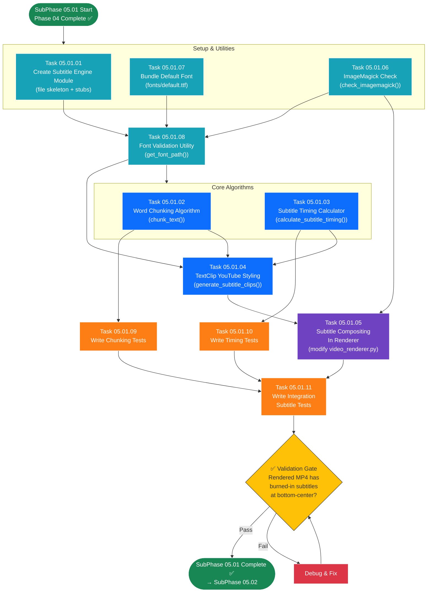

# SubPhase 05.01 — Subtitle Generation & Overlay

## Layer 2 Overview Document

---

| **Field**                | **Value**                                                                                                    |
| ------------------------ | ------------------------------------------------------------------------------------------------------------ |
| **Sub-Phase**            | 05.01 — Subtitle Generation & Overlay                                                                       |
| **Phase**                | Phase 05 — The Polish                                                                                        |
| **Layer**                | Layer 2 (Sub-Phase Overview)                                                                                 |
| **Status**               | Not Started                                                                                                  |
| **Parent Document**      | [Phase_05_Overview.md](../Phase_05_Overview.md) (Layer 1)                                                    |
| **Previous Sub-Phase**   | [SubPhase_04_03_Overview.md](../../Phase_04_The_Vision/SubPhase_04_03_Render_Pipeline_Progress/SubPhase_04_03_Overview.md) (Layer 2) |
| **Next Sub-Phase**       | [SubPhase_05_02_Overview.md](../SubPhase_05_02_Transitions_Effects/SubPhase_05_02_Overview.md) (Layer 2)      |
| **Dependencies**         | Phase 04 complete (render pipeline produces MP4 with Ken Burns effects)                                      |
| **Estimated Task Docs**  | 11                                                                                                           |

---

## Table of Contents

- [SubPhase 05.01 — Subtitle Generation \& Overlay](#subphase-0501--subtitle-generation--overlay)
  - [Layer 2 Overview Document](#layer-2-overview-document)
  - [Table of Contents](#table-of-contents)
  - [1. Objective](#1-objective)
    - [What SubPhase 05.01 Delivers](#what-subphase-0501-delivers)
    - [What SubPhase 05.01 Does NOT Deliver](#what-subphase-0501-does-not-deliver)
  - [2. Scope](#2-scope)
    - [2.1 In Scope](#21-in-scope)
    - [2.2 Out of Scope](#22-out-of-scope)
  - [3. Technical Context](#3-technical-context)
    - [3.1 Prerequisites](#31-prerequisites)
    - [3.2 Technology Specs](#32-technology-specs)
    - [3.3 Key Code Samples \& Patterns](#33-key-code-samples--patterns)
  - [4. Task List](#4-task-list)
  - [5. Task Details](#5-task-details)
    - [5.1 Task 05.01.01 — Create Subtitle Engine Module](#51-task-050101--create-subtitle-engine-module)
    - [5.2 Task 05.01.02 — Word Chunking Algorithm](#52-task-050102--word-chunking-algorithm)
    - [5.3 Task 05.01.03 — Subtitle Timing Calculator](#53-task-050103--subtitle-timing-calculator)
    - [5.4 Task 05.01.04 — TextClip YouTube Styling](#54-task-050104--textclip-youtube-styling)
    - [5.5 Task 05.01.05 — Subtitle Compositing In Renderer](#55-task-050105--subtitle-compositing-in-renderer)
    - [5.6 Task 05.01.06 — ImageMagick Check And Fallback](#56-task-050106--imagemagick-check-and-fallback)
    - [5.7 Task 05.01.07 — Bundle Default Font](#57-task-050107--bundle-default-font)
    - [5.8 Task 05.01.08 — Font Validation Utility](#58-task-050108--font-validation-utility)
    - [5.9 Task 05.01.09 — Write Chunking Tests](#59-task-050109--write-chunking-tests)
    - [5.10 Task 05.01.10 — Write Timing Tests](#510-task-050110--write-timing-tests)
    - [5.11 Task 05.01.11 — Write Integration Subtitle Tests](#511-task-050111--write-integration-subtitle-tests)
  - [6. Execution Order](#6-execution-order)
    - [6.1 Dependency Chain](#61-dependency-chain)
    - [6.2 Recommended Sequence](#62-recommended-sequence)
    - [6.3 Execution Order Flowchart](#63-execution-order-flowchart)
    - [6.4 Parallel Work Opportunities](#64-parallel-work-opportunities)
  - [7. Files Created \& Modified](#7-files-created--modified)
  - [8. Validation Criteria](#8-validation-criteria)
    - [Word Chunking](#word-chunking)
    - [Subtitle Timing](#subtitle-timing)
    - [TextClip Styling](#textclip-styling)
    - [Subtitle Compositing](#subtitle-compositing)
    - [ImageMagick \& Font Handling](#imagemagick--font-handling)
    - [Integration](#integration)
  - [9. Constraints](#9-constraints)
  - [10. Notes \& Gotchas](#10-notes--gotchas)
    - [MoviePy Version Compatibility](#moviepy-version-compatibility)
    - [ImageMagick Binary Name](#imagemagick-binary-name)
    - [Subtitle Performance Impact](#subtitle-performance-impact)
    - [TextClip Auto-Height](#textclip-auto-height)
    - [Empty text\_content Handling](#empty-text_content-handling)
    - [CompositeVideoClip Duration](#compositevideoclip-duration)
    - [Warnings Propagation](#warnings-propagation)
  - [11. Cross-References](#11-cross-references)
    - [Parent \& Ancestry](#parent--ancestry)
    - [Previous Sub-Phase](#previous-sub-phase)
    - [Next Sub-Phase](#next-sub-phase)
    - [Cross-Phase References](#cross-phase-references)
    - [Child Documents (Layer 3)](#child-documents-layer-3)

---

## 1. Objective

SubPhase 05.01 builds the **subtitle generation and overlay engine** — the system that transforms each segment's narration text into timed, styled, burned-in subtitles that appear at the bottom of the video, synchronized with the audio. This is the first half of the rendering polish that turns a basic slideshow into a professional-looking narrative video.

### What SubPhase 05.01 Delivers

1. **Subtitle Engine Module (`core_engine/subtitle_engine.py`)** — A new Python module containing the word-chunking algorithm, subtitle timing calculator, and TextClip generation functions. The main entry point is `generate_subtitle_clips(text_content, audio_duration, resolution, font, color) -> list[TextClip]`.

2. **Word-Chunking Algorithm (`chunk_text`)** — A function that splits a segment's `text_content` into digestible word-chunks of 5–7 words each, preferring to break at sentence and clause boundaries (periods, commas, semicolons, etc.) for natural reading flow.

3. **Subtitle Timing Calculator (`calculate_subtitle_timing`)** — A function that distributes the segment's `audio_duration` proportionally across the word-chunks (longer chunks get more time), enforcing a minimum display time of 0.5 seconds per chunk, with no gaps between consecutive subtitles.

4. **TextClip Styling (YouTube-Style)** — A function that creates MoviePy `TextClip` objects with the correct font, color, stroke, size, and position matching the "YouTube-style" subtitle specification: white text, black stroke, bottom-center position, bold, proportional font size.

5. **Subtitle Compositing in Renderer** — Modification of `video_renderer.py` to composite subtitle `TextClip`s onto each segment's Ken Burns clip using `CompositeVideoClip`, so that the final rendered video contains burned-in subtitles.

6. **ImageMagick Availability Check** — A utility function `check_imagemagick()` in `render_utils.py` that verifies ImageMagick is installed. If missing, the renderer produces video **without subtitles** (graceful degradation) and includes a warning in the render response.

7. **Bundled Default Font** — A permissively-licensed `.ttf` font file (e.g., Roboto Bold) placed at `/backend/fonts/default.ttf`, used as the fallback when `GlobalSettings.subtitle_font` is empty or points to a missing file.

8. **Font Validation Utility** — A helper in `render_utils.py` that validates font file paths: checks the file exists, has a `.ttf` or `.otf` extension, and falls back to the default font if validation fails.

9. **Chunking Tests** — Unit tests for the word-chunking algorithm covering various text lengths, punctuation patterns, edge cases (single word, empty text, very long text).

10. **Timing Tests** — Unit tests for the subtitle timing calculator verifying proportional distribution, minimum duration enforcement, and no-gap continuity.

11. **Integration Subtitle Tests** — Integration tests that render a segment with subtitles and verify the output video contains text overlay, has correct duration, and handles edge cases (no text, missing font, missing ImageMagick).

### What SubPhase 05.01 Does NOT Deliver

> **Critical:** The following features are explicitly **out of scope** for SubPhase 05.01. AI agents must NOT implement these.

- ❌ Crossfade transitions between clips (→ SubPhase 05.02)
- ❌ GlobalSettings editing UI (→ SubPhase 05.03)
- ❌ Per-segment subtitle customization (→ out of scope for v1.0 entirely)
- ❌ Custom transition types (→ out of scope for v1.0)
- ❌ Font upload API endpoint (→ SubPhase 05.03)
- ❌ Subtitle preview component (→ SubPhase 05.03)
- ❌ Voice selector UI (→ SubPhase 05.03)
- ❌ Toast notifications (→ SubPhase 05.03)

At the conclusion of SubPhase 05.01, the rendered MP4 contains **burned-in subtitles** overlaid on Ken Burns animated clips, but still uses hard cuts between segments (no crossfade transitions yet).

---

## 2. Scope

### 2.1 In Scope

| Area                          | Details                                                                                |
| ----------------------------- | -------------------------------------------------------------------------------------- |
| **Subtitle Engine Module**    | New `subtitle_engine.py` with chunk_text, calculate_subtitle_timing, generate_subtitle_clips |
| **Word Chunking**             | 5–7 word chunks, sentence/clause boundary preference, edge case handling               |
| **Timing Calculation**        | Proportional distribution, 0.5s minimum, no gaps, continuous subtitles                 |
| **TextClip Creation**         | MoviePy TextClip with font, color, stroke, position, size                              |
| **Renderer Modification**     | CompositeVideoClip to overlay subtitles on Ken Burns clips                              |
| **ImageMagick Check**         | check_imagemagick() utility, graceful degradation if missing                           |
| **Default Font**              | Bundled .ttf font at /backend/fonts/default.ttf                                        |
| **Font Validation**           | Validate font path, fallback to default                                                |
| **Render Warning**            | Include "subtitles disabled" warning in render response if ImageMagick missing          |
| **Unit Tests**                | Chunking algorithm tests, timing calculator tests                                      |
| **Integration Tests**         | Render with subtitles, edge cases, missing dependencies                                |

### 2.2 Out of Scope

| Area                          | Reason / Destination                                                                   |
| ----------------------------- | -------------------------------------------------------------------------------------- |
| Crossfade transitions         | SubPhase 05.02 — transitions are applied after subtitles are working                   |
| GlobalSettings editing UI     | SubPhase 05.03 — font/color changes via UI come later                                  |
| Font upload API               | SubPhase 05.03 — the POST endpoint for uploading .ttf files                            |
| Per-segment subtitle styling  | Out of v1.0 scope — uniform styling from GlobalSettings only                           |
| Subtitle preview component    | SubPhase 05.03 — frontend preview of subtitle styling                                  |
| SRT/VTT export                | Out of v1.0 scope — subtitles are burned-in only, no separate subtitle file            |
| Subtitle positioning options  | Out of v1.0 scope — always bottom-center                                               |
| Word-level timing             | Out of v1.0 scope — timing is per-chunk, not per-word                                  |

---

## 3. Technical Context

### 3.1 Prerequisites

Before starting SubPhase 05.01, the following must be in place:

| Prerequisite                                                        | Source                      | Verification                                                          |
| ------------------------------------------------------------------- | --------------------------- | --------------------------------------------------------------------- |
| Phase 04 complete — render pipeline produces MP4 with Ken Burns     | Phase 04 (all sub-phases)   | `render_project()` produces valid MP4 with Ken Burns motion            |
| `core_engine/video_renderer.py` — full implementation               | SubPhase 04.01 + 04.02      | `render_project(project_id, on_progress)` works end-to-end             |
| `core_engine/ken_burns.py` — full implementation                    | SubPhase 04.02              | `apply_ken_burns()` returns animated VideoClip                         |
| `core_engine/render_utils.py` — utility functions                   | SubPhase 04.01              | `check_ffmpeg()`, `resize_image_to_resolution()`, `get_output_path()`  |
| Render API endpoint (`POST /api/projects/{id}/render/`)             | SubPhase 04.03              | Triggers render, returns 202 with task_id                              |
| Render Status endpoint (`GET /api/projects/{id}/status/`)           | SubPhase 04.03              | Returns render progress and output URL                                 |
| Project.status transitions                                          | SubPhase 04.03              | DRAFT → PROCESSING → COMPLETED / FAILED                              |
| `Segment.text_content` populated                                    | Phase 02 (import)           | Import engine stores text per segment                                  |
| `Segment.audio_duration` populated                                  | Phase 03 (TTS)              | TTS engine sets audio_duration per segment                             |
| `GlobalSettings.subtitle_font` field exists                         | Phase 01                    | Model field exists (may be empty — fallback to default)                |
| `GlobalSettings.subtitle_color` field exists                        | Phase 01                    | Model field exists (default: "#FFFFFF")                                |
| MoviePy installed (`moviepy>=1.0.3`)                                | SubPhase 04.01              | In requirements.txt, pip installed                                     |
| FFmpeg installed on system PATH                                     | SubPhase 04.01              | Required for video encoding                                            |
| **ImageMagick installed on system PATH**                            | **NEW for Phase 05**        | Required for MoviePy TextClip — must be installed before starting       |

### 3.2 Technology Specs

| Technology       | Version / Spec      | Usage in This Sub-Phase                                                  |
| ---------------- | ------------------- | ------------------------------------------------------------------------ |
| **MoviePy**      | 1.0.3 / 2.0         | `TextClip`, `CompositeVideoClip` for subtitle overlay                    |
| **ImageMagick**  | 7+ (system)          | Required by MoviePy `TextClip` to rasterize text onto video frames       |
| **Python**       | 3.11+                | String manipulation, file I/O, `os`, `re`, `logging`                    |
| **Django**       | 5.x + DRF            | GlobalSettings model read for font/color, no new endpoints               |
| **Pillow**       | (installed)           | Optional — font file type detection as backup                           |
| **NumPy**        | (installed)           | Not directly used — Ken Burns continues alongside                       |

**MoviePy TextClip API:**

```python
from moviepy.editor import TextClip, CompositeVideoClip

subtitle = TextClip(
    txt="Sample subtitle text",
    fontsize=60,
    font="/path/to/font.ttf",
    color="#FFFFFF",
    stroke_color="#000000",
    stroke_width=2,
    method="caption",
    size=(width * 0.9, None),
    align="center"
)
```

**Key MoviePy constraint:** `TextClip` requires ImageMagick's `convert` (v6) or `magick` (v7) binary on the system PATH. Without it, `TextClip()` raises `OSError`.

### 3.3 Key Code Samples & Patterns

**Pattern 1: Complete Subtitle Pipeline Per Segment**

```python
from core_engine.subtitle_engine import (
    chunk_text,
    calculate_subtitle_timing,
    generate_subtitle_clips,
)

# For each segment in the project:
text = segment.text_content         # "The quick brown fox jumps over the lazy dog near the river."
duration = segment.audio_duration   # 5.0 seconds
resolution = (1920, 1080)
font = settings.subtitle_font or "/backend/fonts/default.ttf"
color = settings.subtitle_color or "#FFFFFF"

# Step 1: Split text into chunks
chunks = chunk_text(text, max_words=6)
# → ["The quick brown fox jumps over", "the lazy dog near the river."]

# Step 2: Calculate timing for each chunk
timings = calculate_subtitle_timing(chunks, duration)
# → [(0.0, 3.0), (3.0, 2.0)]  — proportional to word count

# Step 3: Generate styled TextClip objects
subtitle_clips = generate_subtitle_clips(chunks, timings, resolution, font, color)
# → [TextClip(..., start=0.0, duration=3.0), TextClip(..., start=3.0, duration=2.0)]

# Step 4: Composite onto the Ken Burns clip
composited = CompositeVideoClip([ken_burns_clip, *subtitle_clips])
composited = composited.set_audio(audio_clip)
composited = composited.set_duration(duration)
```

**Pattern 2: Word Chunking with Boundary Preference**

```python
def chunk_text(text: str, max_words: int = 6) -> list[str]:
    """
    Split text into word-chunks of up to max_words words each.
    Prefers breaking at sentence boundaries (. ! ?) and clause boundaries (, ; : —).
    """
    if not text or not text.strip():
        return []
    
    words = text.split()
    if len(words) <= max_words:
        return [text.strip()]
    
    chunks = []
    current_chunk = []
    
    for word in words:
        current_chunk.append(word)
        
        # Check if we're at a natural boundary AND at a reasonable chunk size
        is_boundary = any(word.endswith(p) for p in ['.', '!', '?', ',', ';', ':', '—', '...'])
        at_min_size = len(current_chunk) >= (max_words - 2)  # e.g., >= 4 for max_words=6
        at_max_size = len(current_chunk) >= max_words
        
        if at_max_size or (is_boundary and at_min_size):
            chunks.append(' '.join(current_chunk))
            current_chunk = []
    
    # Don't forget remaining words
    if current_chunk:
        # If very small remainder, merge with last chunk if combined is reasonable
        if chunks and len(current_chunk) <= 2 and len(chunks[-1].split()) + len(current_chunk) <= max_words + 1:
            last = chunks.pop()
            chunks.append(last + ' ' + ' '.join(current_chunk))
        else:
            chunks.append(' '.join(current_chunk))
    
    return chunks
```

**Pattern 3: Proportional Timing Calculation**

```python
def calculate_subtitle_timing(
    chunks: list[str],
    total_duration: float,
    min_duration: float = 0.5,
) -> list[tuple[float, float]]:
    """
    Calculate (start_time, duration) for each chunk, proportional to word count.
    Enforces minimum display time of min_duration per chunk.
    No gaps — subtitles are continuous.
    """
    if not chunks:
        return []
    
    # Count words per chunk
    word_counts = [len(chunk.split()) for chunk in chunks]
    total_words = sum(word_counts)
    
    if total_words == 0:
        return []
    
    # Calculate proportional durations
    raw_durations = [(count / total_words) * total_duration for count in word_counts]
    
    # Enforce minimum duration
    durations = [max(d, min_duration) for d in raw_durations]
    
    # Normalize to fit exactly within total_duration
    scale = total_duration / sum(durations) if sum(durations) > 0 else 1.0
    durations = [d * scale for d in durations]
    
    # Build (start_time, duration) tuples
    timings = []
    current_time = 0.0
    for duration in durations:
        timings.append((current_time, duration))
        current_time += duration
    
    return timings
```

**Pattern 4: TextClip Generation**

```python
from moviepy.editor import TextClip

def generate_subtitle_clips(
    chunks: list[str],
    timings: list[tuple[float, float]],
    resolution: tuple[int, int],
    font: str,
    color: str,
) -> list[TextClip]:
    """
    Generate styled TextClip objects for each subtitle chunk.
    """
    width, height = resolution
    fontsize = height // 18   # ~60px at 1080p
    text_width = int(width * 0.9)   # 90% of frame width
    y_position = int(height * 0.85)  # 85% down from top = 15% from bottom
    
    subtitle_clips = []
    
    for chunk, (start, duration) in zip(chunks, timings):
        clip = TextClip(
            txt=chunk,
            fontsize=fontsize,
            font=font,
            color=color,
            stroke_color="#000000",
            stroke_width=2,
            method="caption",
            size=(text_width, None),
            align="center",
        )
        clip = clip.set_position(("center", y_position))
        clip = clip.set_start(start)
        clip = clip.set_duration(duration)
        subtitle_clips.append(clip)
    
    return subtitle_clips
```

**Pattern 5: Subtitle Compositing in Renderer**

```python
# In video_renderer.py — modified segment processing loop:

from core_engine.subtitle_engine import generate_subtitle_clips, chunk_text, calculate_subtitle_timing
from core_engine.render_utils import check_imagemagick

def process_segment(segment, resolution, font, color, fps, segment_index, imagemagick_available):
    """Process a single segment into a video clip with Ken Burns + subtitles."""
    
    # 1. Ken Burns clip (unchanged from Phase 04)
    ken_burns_clip = apply_ken_burns(
        image_path=segment.image_file.path,
        duration=segment.audio_duration,
        resolution=resolution,
        zoom_intensity=settings.zoom_intensity,
        fps=fps,
        segment_index=segment_index,
    )
    
    # 2. Audio clip (unchanged)
    audio_clip = AudioFileClip(segment.audio_file.path)
    
    # 3. Subtitle overlay (NEW in Phase 05)
    if imagemagick_available and segment.text_content and segment.text_content.strip():
        chunks = chunk_text(segment.text_content)
        timings = calculate_subtitle_timing(chunks, segment.audio_duration)
        subtitle_clips = generate_subtitle_clips(chunks, timings, resolution, font, color)
        
        # Composite: Ken Burns (bottom layer) + Subtitles (top layer)
        composited = CompositeVideoClip([ken_burns_clip, *subtitle_clips])
    else:
        composited = ken_burns_clip
    
    # 4. Set audio and duration
    composited = composited.set_audio(audio_clip)
    composited = composited.set_duration(segment.audio_duration)
    
    return composited
```

**Pattern 6: ImageMagick Check**

```python
import subprocess
import shutil

def check_imagemagick() -> bool:
    """Check if ImageMagick is available on the system."""
    # Try ImageMagick 7 first
    if shutil.which("magick"):
        return True
    # Try ImageMagick 6 (legacy)
    if shutil.which("convert"):
        try:
            result = subprocess.run(
                ["convert", "--version"],
                capture_output=True, text=True, timeout=5
            )
            return "ImageMagick" in result.stdout
        except (subprocess.TimeoutExpired, FileNotFoundError):
            return False
    return False
```

---

## 4. Task List

| Task ID     | Task Name                              | Layer 3 Document                                                     | Est. Complexity |
| ----------- | -------------------------------------- | -------------------------------------------------------------------- | --------------- |
| 05.01.01    | Create Subtitle Engine Module          | `Task_05_01_01_Create_Subtitle_Engine_Module.md`                     | Medium          |
| 05.01.02    | Word Chunking Algorithm                | `Task_05_01_02_Word_Chunking_Algorithm.md`                           | High            |
| 05.01.03    | Subtitle Timing Calculator             | `Task_05_01_03_Subtitle_Timing_Calculator.md`                        | Medium          |
| 05.01.04    | TextClip YouTube Styling               | `Task_05_01_04_TextClip_YouTube_Styling.md`                          | Medium          |
| 05.01.05    | Subtitle Compositing In Renderer       | `Task_05_01_05_Subtitle_Compositing_In_Renderer.md`                  | High            |
| 05.01.06    | ImageMagick Check And Fallback         | `Task_05_01_06_ImageMagick_Check_Fallback.md`                        | Medium          |
| 05.01.07    | Bundle Default Font                    | `Task_05_01_07_Bundle_Default_Font.md`                               | Low             |
| 05.01.08    | Font Validation Utility                | `Task_05_01_08_Font_Validation_Utility.md`                           | Low             |
| 05.01.09    | Write Chunking Tests                   | `Task_05_01_09_Write_Chunking_Tests.md`                              | Medium          |
| 05.01.10    | Write Timing Tests                     | `Task_05_01_10_Write_Timing_Tests.md`                                | Medium          |
| 05.01.11    | Write Integration Subtitle Tests       | `Task_05_01_11_Write_Integration_Subtitle_Tests.md`                  | High            |

---

## 5. Task Details

### 5.1 Task 05.01.01 — Create Subtitle Engine Module

**Objective:** Create the new `core_engine/subtitle_engine.py` module with the module-level structure, imports, constants, logging, and docstring. This task sets up the file skeleton — the actual algorithm implementations follow in subsequent tasks.

**File:** `backend/core_engine/subtitle_engine.py` (NEW)

**Steps:**

1. Create the file with module-level docstring explaining its purpose.

2. Add imports:
   ```python
   import logging
   import re
   from typing import Optional
   from moviepy.editor import TextClip
   ```

3. Set up logger:
   ```python
   logger = logging.getLogger(__name__)
   ```

4. Define module-level constants:
   ```python
   DEFAULT_MAX_WORDS = 6             # Max words per subtitle chunk
   MIN_CHUNK_WORDS = 4               # Minimum words before considering a boundary break
   MIN_DISPLAY_DURATION = 0.5        # Minimum seconds a subtitle is displayed
   FONT_SIZE_DIVISOR = 18            # resolution_height / 18 ≈ 60px at 1080p
   TEXT_WIDTH_RATIO = 0.9            # Subtitle width = 90% of frame width
   SUBTITLE_Y_RATIO = 0.85          # Subtitle Y position = 85% down (15% from bottom)
   DEFAULT_STROKE_COLOR = "#000000"  # Black stroke for readability
   DEFAULT_STROKE_WIDTH = 2          # Stroke width in pixels
   ```

5. Add function stubs for the three main functions:
   ```python
   def chunk_text(text: str, max_words: int = DEFAULT_MAX_WORDS) -> list[str]:
       """Split text into word-chunks. Implementation in Task 05.01.02."""
       raise NotImplementedError

   def calculate_subtitle_timing(chunks: list[str], total_duration: float, min_duration: float = MIN_DISPLAY_DURATION) -> list[tuple[float, float]]:
       """Calculate timing per chunk. Implementation in Task 05.01.03."""
       raise NotImplementedError

   def generate_subtitle_clips(chunks: list[str], timings: list[tuple[float, float]], resolution: tuple[int, int], font: str, color: str) -> list[TextClip]:
       """Generate styled TextClip objects. Implementation in Task 05.01.04."""
       raise NotImplementedError
   ```

6. Add a convenience function combining all three steps:
   ```python
   def create_subtitles_for_segment(
       text_content: str,
       audio_duration: float,
       resolution: tuple[int, int],
       font: str,
       color: str,
   ) -> list[TextClip]:
       """
       Complete subtitle pipeline for a single segment.
       Chunks text → calculates timing → generates TextClips.
       Returns an empty list if text_content is empty.
       """
       if not text_content or not text_content.strip():
           return []
       
       chunks = chunk_text(text_content)
       timings = calculate_subtitle_timing(chunks, audio_duration)
       return generate_subtitle_clips(chunks, timings, resolution, font, color)
   ```

**Key Details:**
- The convenience function `create_subtitles_for_segment` is the entry point called by `video_renderer.py`.
- The stubs raise `NotImplementedError` — they are replaced in Tasks 05.01.02–04.
- Constants are module-level so they can be easily adjusted without digging through function code.
- The `re` import is for sentence/clause boundary detection in chunking (Task 05.01.02).

**Files Touched:**
- `backend/core_engine/subtitle_engine.py` — NEW

---

### 5.2 Task 05.01.02 — Word Chunking Algorithm

**Objective:** Implement the `chunk_text()` function that splits a segment's `text_content` into natural, readable word-chunks of 5–7 words each.

**File:** `backend/core_engine/subtitle_engine.py` (MODIFIED — replace stub)

**Steps:**

1. Replace the `chunk_text` stub with the full implementation.

2. Algorithm design:
   - Split text into individual words: `words = text.split()`.
   - Iterate through words, building chunks.
   - Break a chunk when:
     - **Hard break:** Current chunk reaches `max_words` words → force break.
     - **Soft break:** A word ends with a sentence terminator (`.`, `!`, `?`) or clause boundary (`,`, `;`, `:`, `—`, `...`) AND the chunk has at least `MIN_CHUNK_WORDS` words → break at this natural boundary.
   - After iteration, handle remaining words:
     - If 1–2 orphan words remain AND the last chunk is short enough, merge them into the last chunk.
     - Otherwise, create a final short chunk.

3. Define boundary detection:
   ```python
   SENTENCE_BOUNDARIES = {'.', '!', '?'}
   CLAUSE_BOUNDARIES = {',', ';', ':', '—', '...', '–'}
   
   def _is_boundary_word(word: str) -> bool:
       """Check if a word ends at a natural sentence or clause boundary."""
       stripped = word.rstrip('"\')')  # Handle closing quotes/parens
       return any(stripped.endswith(b) for b in SENTENCE_BOUNDARIES | CLAUSE_BOUNDARIES)
   ```

4. Edge cases to handle:
   - **Empty text:** Return `[]`.
   - **Whitespace-only text:** Return `[]`.
   - **Single word:** Return `["word"]`.
   - **Fewer than max_words:** Return `[entire text]` as a single chunk.
   - **Text with multiple spaces/newlines:** Normalize to single spaces: `text = ' '.join(text.split())`.
   - **Very long words (URLs, compounds):** Treat as one word, include in chunk normally.
   - **Punctuation-only tokens:** Include in the previous word's chunk.

5. Quality constraints:
   - Chunks should never be empty strings.
   - Chunks should not start or end with whitespace (strip each chunk).
   - The concatenation of all chunks (with spaces) should equal the original text (minus extra whitespace).

**Key Details:**
- The `max_words=6` default produces chunks of 4–7 words (soft breaks at 4+, hard break at 6).
- Sentence boundaries take priority: if a period is hit at word 4, break there even though max is 6.
- Clause boundaries are secondary: a comma at word 3 is too early (below MIN_CHUNK_WORDS), so keep going.
- The "orphan merge" behavior prevents tiny final chunks (e.g., a 1-word chunk after a natural break).
- This algorithm operates on whitespace-split words — it does not perform NLP-level analysis.

**Files Touched:**
- `backend/core_engine/subtitle_engine.py` — Modified (replace `chunk_text` stub)

---

### 5.3 Task 05.01.03 — Subtitle Timing Calculator

**Objective:** Implement the `calculate_subtitle_timing()` function that distributes a segment's audio duration proportionally across word-chunks.

**File:** `backend/core_engine/subtitle_engine.py` (MODIFIED — replace stub)

**Steps:**

1. Replace the `calculate_subtitle_timing` stub with the full implementation.

2. Algorithm:
   - Count words per chunk: `word_counts = [len(chunk.split()) for chunk in chunks]`.
   - Calculate total words: `total_words = sum(word_counts)`.
   - Calculate proportional durations: `raw_duration[i] = (word_counts[i] / total_words) * total_duration`.
   - Enforce minimum duration: `duration[i] = max(raw_duration[i], min_duration)`.
   - Normalize: scale all durations so they sum to exactly `total_duration`.
   - Build tuples: `(start_time, duration)` with `start_time = sum of previous durations`.

3. Formula:

   $$d_i = \frac{w_i}{\sum w_j} \times D_{\text{total}}$$

   Where:
   - $d_i$ = duration of chunk $i$
   - $w_i$ = word count of chunk $i$
   - $D_{\text{total}}$ = total audio duration

4. Normalization after minimum enforcement:

   $$d'_i = \max(d_i, d_{\min})$$
   $$d''_i = d'_i \times \frac{D_{\text{total}}}{\sum d'_j}$$

   This ensures durations always sum to exactly `total_duration`.

5. Edge cases:
   - **Empty chunks list:** Return `[]`.
   - **Single chunk:** Return `[(0.0, total_duration)]`.
   - **Very short total_duration (< 0.5s):** Still create timing, each chunk gets proportional share.
   - **All chunks same length:** Equal distribution.
   - **Rounding:** Use float precision — don't round to integers. The last chunk absorbs any floating-point remainder.

6. Guarantee: **No gaps.** The start time of chunk $i+1$ must exactly equal the start time of chunk $i$ plus its duration. Subtitles are continuous throughout the segment.

**Key Details:**
- The normalization step is critical — without it, enforcing minimum durations could make the total exceed `total_duration`.
- Start times are cumulative: `start[0] = 0.0`, `start[i] = start[i-1] + duration[i-1]`.
- The function returns `list[tuple[float, float]]` — each tuple is `(start_time, duration)`.
- This timing is relative to the segment's clip (not absolute video time). Start time 0.0 = start of this segment's clip.

**Files Touched:**
- `backend/core_engine/subtitle_engine.py` — Modified (replace `calculate_subtitle_timing` stub)

---

### 5.4 Task 05.01.04 — TextClip YouTube Styling

**Objective:** Implement the `generate_subtitle_clips()` function that creates MoviePy `TextClip` objects with the "YouTube-style" appearance specification.

**File:** `backend/core_engine/subtitle_engine.py` (MODIFIED — replace stub)

**Steps:**

1. Replace the `generate_subtitle_clips` stub with the full implementation.

2. For each chunk + timing pair, create a `TextClip`:
   ```python
   clip = TextClip(
       txt=chunk,
       fontsize=resolution[1] // FONT_SIZE_DIVISOR,   # ~60px at 1080p
       font=font,                                      # Path to .ttf file
       color=color,                                     # e.g., "#FFFFFF"
       stroke_color=DEFAULT_STROKE_COLOR,               # "#000000"
       stroke_width=DEFAULT_STROKE_WIDTH,               # 2
       method="caption",                                # Text wraps to fit width
       size=(int(resolution[0] * TEXT_WIDTH_RATIO), None),  # 90% width, auto height
       align="center",
   )
   ```

3. Position and timing:
   ```python
   clip = clip.set_position(("center", int(resolution[1] * SUBTITLE_Y_RATIO)))
   clip = clip.set_start(start_time)
   clip = clip.set_duration(duration)
   ```

4. Styling specification (from Phase_05_Overview.md §8.2):
   - **Font size:** `resolution_height / 18` ≈ 60px at 1080p, ≈ 40px at 720p.
   - **Text color:** From `GlobalSettings.subtitle_color` (default: `#FFFFFF` — white).
   - **Stroke color:** Black (`#000000`) — for readability over any background.
   - **Stroke width:** 2 pixels.
   - **Method:** `"caption"` — wraps text to fit within the specified width.
   - **Width:** 90% of frame width — prevents text from touching edges.
   - **Position:** `("center", 85% of height)` — bottom-center, YouTube-standard placement.
   - **Align:** `"center"` — text is centered horizontally.

5. Edge cases:
   - If `chunks` is empty or `timings` is empty: return `[]`.
   - If `font` path is invalid or missing: caller should have already fallen back to default font (Task 05.01.08).
   - If `TextClip` raises an error (e.g., ImageMagick not found): catch the exception, log a warning, and return `[]` (handled in Task 05.01.06).

6. Logging:
   - Log each TextClip creation at DEBUG level: `logger.debug(f"Created subtitle clip: '{chunk[:30]}...' at {start_time:.2f}s for {duration:.2f}s")`.
   - Log any errors at WARNING level.

**Key Details:**
- The `method="caption"` is **critical**. It tells MoviePy/ImageMagick to word-wrap text within the specified width. The alternative `method="label"` renders text on a single line without wrapping.
- The `size=(width, None)` means: fixed width, auto height. The text will wrap and the clip height adjusts automatically.
- The `font` parameter must be a path to a `.ttf` file, not a font name. MoviePy passes this directly to ImageMagick.
- The `color` parameter accepts hex strings like `"#FFFFFF"` — MoviePy converts this internally.
- Each `TextClip` is a small overlay that exists only for its assigned duration. Multiple `TextClip`s from the same segment are overlaid sequentially (they don't overlap in time).

**Files Touched:**
- `backend/core_engine/subtitle_engine.py` — Modified (replace `generate_subtitle_clips` stub)

---

### 5.5 Task 05.01.05 — Subtitle Compositing In Renderer

**Objective:** Modify `video_renderer.py` to composite subtitle `TextClip`s onto each segment's Ken Burns clip before concatenation.

**File:** `backend/core_engine/video_renderer.py` (MODIFIED)

**Steps:**

1. Add imports at the top of `video_renderer.py`:
   ```python
   from moviepy.editor import CompositeVideoClip
   from core_engine.subtitle_engine import create_subtitles_for_segment
   from core_engine.render_utils import check_imagemagick, get_font_path
   ```

2. In the `render_project()` function, before the segment processing loop:
   - Check ImageMagick availability once:
     ```python
     imagemagick_available = check_imagemagick()
     if not imagemagick_available:
         logger.warning("ImageMagick not found. Subtitles will be disabled.")
         warnings.append("Subtitles disabled: ImageMagick not found")
     ```
   - Read subtitle settings from GlobalSettings:
     ```python
     from api.models import GlobalSettings
     settings = GlobalSettings.objects.first()
     font = get_font_path(getattr(settings, 'subtitle_font', ''))
     color = getattr(settings, 'subtitle_color', '#FFFFFF') or '#FFFFFF'
     ```

3. In the per-segment processing loop, after Ken Burns clip creation:
   ```python
   # Phase 04: ken_burns_clip already created
   # Phase 05 addition:
   if imagemagick_available and segment.text_content and segment.text_content.strip():
       subtitle_clips = create_subtitles_for_segment(
           text_content=segment.text_content,
           audio_duration=segment.audio_duration,
           resolution=(project.resolution_width, project.resolution_height),
           font=font,
           color=color,
       )
       if subtitle_clips:
           composited = CompositeVideoClip([ken_burns_clip, *subtitle_clips])
           composited = composited.set_duration(segment.audio_duration)
       else:
           composited = ken_burns_clip
   else:
       composited = ken_burns_clip
   
   # Set audio (unchanged)
   composited = composited.set_audio(audio_clip)
   ```

4. Update progress reporting to include subtitle phase:
   ```python
   on_progress(current_segment, total_segments, f"Compositing subtitles for segment {current_segment}")
   ```
   Add this as a sub-step between Ken Burns and final clip assembly.

5. Include warnings in the render result:
   ```python
   result = {
       "output_path": output_path,
       "duration": final_clip.duration,
       "file_size": os.path.getsize(output_file),
       "warnings": warnings,  # NEW — includes subtitle/ImageMagick warnings
   }
   ```

6. Handle subtitle errors gracefully:
   - If `create_subtitles_for_segment` raises an exception:
     ```python
     try:
         subtitle_clips = create_subtitles_for_segment(...)
     except Exception as e:
         logger.warning(f"Subtitle generation failed for segment {segment.id}: {e}")
         subtitle_clips = []
         warnings.append(f"Subtitles skipped for segment {segment_index + 1}: {str(e)}")
     ```
   - The render continues without subtitles for that segment — it does NOT fail the entire render.

**Key Details:**
- `CompositeVideoClip([ken_burns_clip, *subtitle_clips])` layers the TextClips on top of the Ken Burns clip. The subtitle clips are in the foreground.
- The composited clip's duration must be explicitly set to `segment.audio_duration` — `CompositeVideoClip` may compute a different duration based on the subtitle clip timings.
- The audio is set on the composited clip, not on the individual subtitle clips (TextClips have no audio).
- The ImageMagick check is performed **once** at the start of `render_project()`, not per-segment. This avoids repeated subprocess calls.
- The `warnings` list is a new addition to the render result. The task function in `api/tasks.py` should forward these warnings to the task status.
- Subtitle compositing is the **most computationally expensive** part of Phase 05 — each TextClip is rasterized by ImageMagick for every frame. This may significantly increase render time.

**Files Touched:**
- `backend/core_engine/video_renderer.py` — Modified (add subtitle compositing to segment loop)

---

### 5.6 Task 05.01.06 — ImageMagick Check And Fallback

**Objective:** Implement the `check_imagemagick()` function in `render_utils.py` and establish the graceful degradation pattern when ImageMagick is not installed.

**File:** `backend/core_engine/render_utils.py` (MODIFIED)

**Steps:**

1. Add `check_imagemagick() -> bool` to `render_utils.py`:
   ```python
   def check_imagemagick() -> bool:
       """
       Check if ImageMagick is available on the system PATH.
       MoviePy's TextClip requires ImageMagick for text rasterization.
       Returns True if ImageMagick is found, False otherwise.
       """
   ```

2. Implementation:
   - **Check 1:** Look for `magick` binary (ImageMagick 7+):
     ```python
     if shutil.which("magick"):
         return True
     ```
   - **Check 2:** Look for `convert` binary (ImageMagick 6 — legacy):
     ```python
     if shutil.which("convert"):
         try:
             result = subprocess.run(
                 ["convert", "--version"],
                 capture_output=True, text=True, timeout=5
             )
             # Verify it's actually ImageMagick (not some other 'convert' command)
             if "ImageMagick" in result.stdout:
                 return True
         except (subprocess.TimeoutExpired, FileNotFoundError, OSError):
             pass
     ```
   - **Return `False`** if neither is found.

3. Add required imports to `render_utils.py`:
   ```python
   import subprocess
   import shutil
   ```

4. Caching consideration:
   - ImageMagick availability won't change during a single render session.
   - Cache the result at the module level or use `functools.lru_cache(maxsize=1)`:
     ```python
     @functools.lru_cache(maxsize=1)
     def check_imagemagick() -> bool:
         ...
     ```
   - This prevents running the subprocess check multiple times per render.

5. Windows-specific consideration:
   - On Windows, ImageMagick's install directory may not be in PATH by default.
   - MoviePy may need the `IMAGEMAGICK_BINARY` environment variable set:
     ```python
     # If ImageMagick is found at a non-standard location:
     os.environ["IMAGEMAGICK_BINARY"] = r"C:\Program Files\ImageMagick-7.x.x\magick.exe"
     ```
   - The check function should also look in common Windows install paths as a fallback.

6. Graceful degradation summary:
   - If `check_imagemagick()` returns `False`:
     - Log a warning: `"ImageMagick not found. Subtitles will be disabled for this render."`
     - Skip all subtitle generation in the render loop.
     - Include `"Subtitles disabled: ImageMagick not found"` in the render result's `warnings` list.
     - The render **succeeds** — it just produces video without subtitles.
   - The render status API should relay these warnings to the frontend (for potential future UI display).

**Key Details:**
- The `convert` command exists on some systems as a Windows utility (converting file systems), which is NOT ImageMagick. That's why we check `"ImageMagick" in result.stdout`.
- The `timeout=5` prevents hanging if the subprocess doesn't respond.
- The `lru_cache` decorator is appropriate here — the check result is valid for the entire process lifetime.
- This function mirrors the existing `check_ffmpeg()` pattern (from SubPhase 04.01).

**Files Touched:**
- `backend/core_engine/render_utils.py` — Modified (add `check_imagemagick`)

---

### 5.7 Task 05.01.07 — Bundle Default Font

**Objective:** Include a permissively-licensed `.ttf` font file in the project repository as the default subtitle font.

**File:** `backend/fonts/default.ttf` (NEW)

**Steps:**

1. Create the `backend/fonts/` directory.

2. Select and download a permissively-licensed bold font:
   - **Recommended:** Roboto Bold (Apache License 2.0).
   - **Alternatives:** Open Sans Bold (Apache 2.0), Noto Sans Bold (OFL), Inter Bold (OFL).
   - Must be a `.ttf` file (not `.woff`, `.woff2`, `.otf`).
   - Must be a **bold** weight for readability as subtitles.

3. Place the font file at: `backend/fonts/default.ttf`.

4. Ensure the `fonts/` directory is NOT in `.gitignore`:
   - This font must be committed to the repository.
   - Custom user-uploaded fonts (Task 05.03 in SubPhase 05.03) go in the same directory.

5. Verify the font works with MoviePy:
   ```python
   from moviepy.editor import TextClip
   clip = TextClip("Test subtitle", font="backend/fonts/default.ttf", fontsize=60, color="#FFFFFF")
   # Should not raise an error
   ```

6. Update the default `GlobalSettings.subtitle_font` reference:
   - The Phase 01 model defaults `subtitle_font` to an empty string or a path.
   - The font validation utility (Task 05.01.08) should resolve empty/missing paths to this default.
   - The absolute path at runtime would be something like: `os.path.join(settings.BASE_DIR, 'fonts', 'default.ttf')`.

**Key Details:**
- The font file is typically 100–300 KB — acceptable for repository inclusion.
- The Apache 2.0 and OFL licenses allow bundling fonts in software projects with proper attribution.
- Include a `fonts/LICENSE.txt` file noting the font name, license, and attribution.
- MoviePy's `TextClip` requires a `.ttf` path, not a system font name. The path must be absolute or relative to the working directory.

**Files Touched:**
- `backend/fonts/default.ttf` — NEW (binary font file)
- `backend/fonts/LICENSE.txt` — NEW (font license attribution)

---

### 5.8 Task 05.01.08 — Font Validation Utility

**Objective:** Implement font path validation and default fallback logic in `render_utils.py`.

**File:** `backend/core_engine/render_utils.py` (MODIFIED)

**Steps:**

1. Add `get_font_path(configured_font: str) -> str` to `render_utils.py`:
   ```python
   def get_font_path(configured_font: str) -> str:
       """
       Validate the configured font path and return a valid font path.
       Falls back to the bundled default font if the configured path is invalid.
       """
   ```

2. Implementation:
   ```python
   import os
   from django.conf import settings as django_settings
   
   DEFAULT_FONT_PATH = os.path.join(django_settings.BASE_DIR, 'fonts', 'default.ttf')
   
   def get_font_path(configured_font: str) -> str:
       # 1. If no font configured, use default
       if not configured_font or not configured_font.strip():
           logger.info("No subtitle font configured. Using default font.")
           return DEFAULT_FONT_PATH
       
       # 2. Resolve the configured path
       font_path = configured_font
       if not os.path.isabs(font_path):
           font_path = os.path.join(django_settings.BASE_DIR, font_path.lstrip('/'))
       
       # 3. Check file exists
       if not os.path.exists(font_path):
           logger.warning(f"Configured font not found: {font_path}. Using default font.")
           return DEFAULT_FONT_PATH
       
       # 4. Check file extension
       ext = os.path.splitext(font_path)[1].lower()
       if ext not in ('.ttf', '.otf'):
           logger.warning(f"Invalid font extension '{ext}': {font_path}. Using default font.")
           return DEFAULT_FONT_PATH
       
       return font_path
   ```

3. Add a validation function for the font upload endpoint (used later in SubPhase 05.03):
   ```python
   def validate_font_file(file_path: str) -> bool:
       """Check if a file is a valid font file (.ttf or .otf)."""
       if not os.path.exists(file_path):
           return False
       ext = os.path.splitext(file_path)[1].lower()
       return ext in ('.ttf', '.otf')
   ```

4. Verify the default font exists at startup (optional):
   ```python
   def verify_default_font() -> bool:
       """Check if the bundled default font exists."""
       exists = os.path.exists(DEFAULT_FONT_PATH)
       if not exists:
           logger.error(f"Default font not found at {DEFAULT_FONT_PATH}. Subtitles may not render correctly.")
       return exists
   ```

**Key Details:**
- The `get_font_path` function is called once per render (in `video_renderer.py` before the segment loop).
- It resolves relative paths by joining with `BASE_DIR`.
- It always returns a valid path — either the configured font or the default. It never returns `None` or an empty string.
- The `.otf` extension is accepted because MoviePy/ImageMagick can handle OpenType fonts.
- This function does NOT validate that the font file is a valid TrueType font internally — it only checks existence and extension. MoviePy/ImageMagick will handle internal validation when creating TextClips.

**Files Touched:**
- `backend/core_engine/render_utils.py` — Modified (add `get_font_path`, `validate_font_file`, `verify_default_font`)

---

### 5.9 Task 05.01.09 — Write Chunking Tests

**Objective:** Write comprehensive unit tests for the `chunk_text()` function.

**File:** `backend/core_engine/tests.py` (NEW or MODIFIED)

**Steps:**

1. Create or extend the test file with a `ChunkTextTests` test class.

2. Test cases:

   | Test Name                                   | Input Text                                          | Expected Behavior                                    |
   | ------------------------------------------- | --------------------------------------------------- | ---------------------------------------------------- |
   | `test_empty_text`                           | `""`                                                | Returns `[]`                                         |
   | `test_whitespace_only`                      | `"   \n  "`                                         | Returns `[]`                                         |
   | `test_single_word`                          | `"Hello"`                                           | Returns `["Hello"]`                                  |
   | `test_few_words_under_max`                  | `"The quick brown fox"`                             | Returns `["The quick brown fox"]` (single chunk)     |
   | `test_exactly_max_words`                    | `"One two three four five six"`                     | Returns `["One two three four five six"]`            |
   | `test_basic_chunking`                       | 12+ words with no punctuation                       | Returns 2+ chunks, each ≤ max_words                  |
   | `test_sentence_boundary_break`              | `"First sentence. Second sentence follows here."`   | Breaks at the period                                 |
   | `test_comma_boundary_break`                 | `"First clause, second clause follows here nicely"` | Breaks at comma if chunk is long enough               |
   | `test_no_orphan_single_word`                | Text where last word would be orphaned               | Merges orphan with previous chunk                    |
   | `test_multiple_sentences`                   | 3+ sentences                                        | Each sentence ≈ one chunk                            |
   | `test_long_text_30_words`                   | 30-word paragraph                                   | 5–6 chunks of 5–7 words each                         |
   | `test_preserves_all_words`                  | Any text                                            | Joining chunks recovers all original words            |
   | `test_custom_max_words`                     | Text with `max_words=4`                             | Chunks ≤ 4 words                                     |
   | `test_newlines_and_extra_spaces`            | `"Hello\n  world   foo"`                            | Normalizes whitespace, chunks correctly               |
   | `test_punctuation_mid_word`                 | `"don't won't can't"`                               | Contractions treated as single words                  |

3. Each test uses `self.assertEqual()` or `self.assertLessEqual()` for chunk sizes.

4. Add a meta-test verifying the "no words lost" invariant:
   ```python
   def test_no_words_lost(self):
       text = "A long paragraph with many words to test that chunking preserves all of them."
       chunks = chunk_text(text)
       original_words = text.split()
       chunked_words = ' '.join(chunks).split()
       self.assertEqual(original_words, chunked_words)
   ```

**Key Details:**
- Tests use Django's `TestCase` or standard `unittest.TestCase` (no database access needed).
- Tests should run fast (no I/O, no ImageMagick, no MoviePy).
- The chunking algorithm is pure Python string manipulation — these are true unit tests.

**Files Touched:**
- `backend/core_engine/tests.py` — NEW or Modified (add `ChunkTextTests`)

---

### 5.10 Task 05.01.10 — Write Timing Tests

**Objective:** Write comprehensive unit tests for the `calculate_subtitle_timing()` function.

**File:** `backend/core_engine/tests.py` (MODIFIED)

**Steps:**

1. Add a `SubtitleTimingTests` test class.

2. Test cases:

   | Test Name                                     | Input                                        | Expected Behavior                                    |
   | --------------------------------------------- | -------------------------------------------- | ---------------------------------------------------- |
   | `test_empty_chunks`                           | `chunks=[], duration=5.0`                    | Returns `[]`                                         |
   | `test_single_chunk`                           | `chunks=["Hello world"], duration=3.0`       | Returns `[(0.0, 3.0)]`                               |
   | `test_equal_word_count`                       | 3 chunks of 3 words each, duration=6.0       | Each gets 2.0s                                        |
   | `test_proportional_distribution`              | Chunks: 6 words + 3 words, duration=9.0      | 6.0s + 3.0s (proportional to word count)              |
   | `test_no_gaps`                                | Any chunks                                    | `start[i+1] == start[i] + duration[i]`               |
   | `test_total_duration_matches`                 | Any chunks                                    | Sum of durations == total_duration                    |
   | `test_minimum_duration_enforced`              | 10 chunks of 1 word, duration=3.0            | Each ≥ 0.5s, total = 3.0s (normalized)               |
   | `test_start_at_zero`                          | Any chunks                                    | First tuple starts at 0.0                            |
   | `test_very_short_duration`                    | 2 chunks, duration=0.3                        | Still produces valid timings                          |
   | `test_many_chunks`                            | 20 chunks, duration=60.0                      | All timings valid, total correct                      |
   | `test_single_word_chunks`                     | 5 chunks of 1 word each, duration=5.0        | Each ≥ 0.5s minimum                                  |

3. Precision assertions:
   ```python
   def test_total_duration_matches(self):
       chunks = ["Word one two three", "Four five six", "Seven eight"]
       timings = calculate_subtitle_timing(chunks, 10.0)
       total = sum(d for _, d in timings)
       self.assertAlmostEqual(total, 10.0, places=6)
   ```

4. No-gap assertion:
   ```python
   def test_no_gaps(self):
       chunks = ["Chunk one two", "Chunk three four", "Chunk five six"]
       timings = calculate_subtitle_timing(chunks, 9.0)
       for i in range(len(timings) - 1):
           end_of_current = timings[i][0] + timings[i][1]
           start_of_next = timings[i+1][0]
           self.assertAlmostEqual(end_of_current, start_of_next, places=6)
   ```

**Key Details:**
- Tests use `assertAlmostEqual` with `places=6` for floating-point comparisons.
- No I/O, no ImageMagick — pure math tests.
- The minimum duration enforcement test is important: when `min_duration * num_chunks > total_duration`, normalization must scale durations down, and the minimum guarantee becomes "best effort" — the normalization may produce durations below `min_duration` in extreme cases.

**Files Touched:**
- `backend/core_engine/tests.py` — Modified (add `SubtitleTimingTests`)

---

### 5.11 Task 05.01.11 — Write Integration Subtitle Tests

**Objective:** Write integration tests that exercise the full subtitle pipeline end-to-end: rendering a segment with subtitles and verifying the output.

**File:** `backend/core_engine/tests.py` + `backend/api/tests.py` (MODIFIED)

**Steps:**

1. Add a `SubtitleIntegrationTests` test class.

2. Test setup:
   - Create a test `Project` with resolution 640×360 (small for fast tests).
   - Create a `GlobalSettings` with `subtitle_font` pointing to the bundled default font and `subtitle_color` = `"#FFFFFF"`.
   - Create test segments with:
     - `text_content`: sample narration text.
     - `image_file`: a small synthetic test image (solid color, 640×360).
     - `audio_file`: a short synthetic WAV file (1–2 seconds of silence).
     - `audio_duration`: matching the audio file length.

3. Test cases:

   | Test Name                                          | Setup                                     | Assertion                                                |
   | -------------------------------------------------- | ----------------------------------------- | -------------------------------------------------------- |
   | `test_render_with_subtitles`                       | Normal segment with text + image + audio  | MP4 produced, file size > 0, no errors                   |
   | `test_render_without_text`                         | Segment with empty `text_content`         | MP4 produced without subtitles, no errors                |
   | `test_render_without_imagemagick`                  | Mock `check_imagemagick()` to return False | MP4 produced without subtitles, warning in result        |
   | `test_render_with_missing_font`                    | `subtitle_font` points to non-existent file | Falls back to default font, MP4 produced                |
   | `test_render_multiple_segments_with_subtitles`     | 3 segments with text                      | MP4 produced with all segments, correct duration          |
   | `test_subtitle_clips_count`                        | Text with ~18 words (3 chunks expected)   | `create_subtitles_for_segment` returns 3 TextClips       |
   | `test_subtitle_duration_matches_audio`             | Segment with 5.0s audio                   | Sum of subtitle durations = 5.0s                          |

4. Mocking strategy:
   - For `test_render_without_imagemagick`: use `unittest.mock.patch` to override `check_imagemagick`:
     ```python
     @mock.patch('core_engine.render_utils.check_imagemagick', return_value=False)
     def test_render_without_imagemagick(self, mock_check):
         ...
     ```
   - For tests that require ImageMagick: mark with `@unittest.skipUnless(check_imagemagick(), "ImageMagick not installed")`.

5. File cleanup in `tearDown`:
   - Remove all temporary images, audio files, and output MP4s.
   - Use `tempfile.mkdtemp()` for test media directories.

6. Duration verification:
   ```python
   def test_render_with_subtitles(self):
       result = render_project(str(self.project.id))
       self.assertTrue(os.path.exists(result["output_path"]))
       self.assertGreater(os.path.getsize(result["output_path"]), 0)
       # Verify no errors in warnings (or only acceptable warnings)
       if "warnings" in result:
           for warning in result["warnings"]:
               self.assertNotIn("failed", warning.lower())
   ```

**Key Details:**
- Integration tests that require ImageMagick should be **skippable** — CI environments may not have ImageMagick installed. Use `@unittest.skipUnless()`.
- Test render times with small resolutions (640×360) and short audio (1–2 seconds) to keep tests under 30 seconds.
- The `create_subtitles_for_segment` function is easier to test in isolation than full `render_project` — test the subtitle clip count, durations, and positions without rendering to MP4.
- Full `render_project` integration tests prove the compositing works but are slower. Include 1–2 of these.
- Use `@override_settings(MEDIA_ROOT=tempfile.mkdtemp())` to avoid polluting the real media directory.

**Files Touched:**
- `backend/core_engine/tests.py` — Modified (add `SubtitleIntegrationTests`)
- `backend/api/tests.py` — Modified (add render-with-subtitle API test if needed)

---

## 6. Execution Order

### 6.1 Dependency Chain

| Task      | Depends On            | Reason                                                                  |
| --------- | --------------------- | ----------------------------------------------------------------------- |
| 05.01.01  | —                     | Module skeleton — must exist before other tasks add to it               |
| 05.01.07  | —                     | Default font — independent binary asset                                 |
| 05.01.06  | —                     | ImageMagick check — independent utility                                 |
| 05.01.08  | 05.01.07              | Font validation — needs default font path to fallback to                |
| 05.01.02  | 05.01.01              | Chunking algorithm — replaces stub in subtitle_engine.py                |
| 05.01.03  | 05.01.01              | Timing calculator — replaces stub in subtitle_engine.py                 |
| 05.01.04  | 05.01.01, 05.01.08    | TextClip generation — replaces stub, uses validated font path           |
| 05.01.05  | 05.01.04, 05.01.06    | Renderer compositing — uses subtitle clips + ImageMagick check          |
| 05.01.09  | 05.01.02              | Chunking tests — tests the chunking algorithm                           |
| 05.01.10  | 05.01.03              | Timing tests — tests the timing calculator                              |
| 05.01.11  | 05.01.05              | Integration tests — tests the full compositing pipeline                 |

### 6.2 Recommended Sequence

| Order | Task ID  | Task Name                        | Why This Order                                                        |
| ----- | -------- | -------------------------------- | --------------------------------------------------------------------- |
| 1     | 05.01.01 | Create Subtitle Engine Module    | File skeleton — all other subtitle tasks modify this file             |
| 2     | 05.01.07 | Bundle Default Font              | Independent binary asset — can be done early                          |
| 3     | 05.01.06 | ImageMagick Check And Fallback   | Independent utility — needed before compositing                       |
| 4     | 05.01.08 | Font Validation Utility          | Depends on default font path from Task 07                            |
| 5     | 05.01.02 | Word Chunking Algorithm          | Core algorithm #1 — replaces stub in subtitle_engine.py              |
| 6     | 05.01.03 | Subtitle Timing Calculator       | Core algorithm #2 — replaces stub in subtitle_engine.py              |
| 7     | 05.01.09 | Write Chunking Tests             | Test chunking immediately after implementation                        |
| 8     | 05.01.10 | Write Timing Tests               | Test timing immediately after implementation                          |
| 9     | 05.01.04 | TextClip YouTube Styling         | Core algorithm #3 — replaces stub, uses font validation              |
| 10    | 05.01.05 | Subtitle Compositing In Renderer | Final integration — uses all subtitle functions + ImageMagick check   |
| 11    | 05.01.11 | Write Integration Subtitle Tests | End-to-end tests validate the complete pipeline                       |

### 6.3 Execution Order Flowchart



### 6.4 Parallel Work Opportunities

| Parallel Group    | Tasks                          | Reason for Parallelism                                              |
| ----------------- | ------------------------------ | ------------------------------------------------------------------- |
| **Setup**         | 05.01.01, 05.01.07, 05.01.06  | Module skeleton, font file, and ImageMagick check are independent   |
| **Algorithms**    | 05.01.02, 05.01.03            | Chunking and timing are independent algorithms (both modify the same file but different functions) |
| **Tests (Unit)**  | 05.01.09, 05.01.10            | Chunking tests and timing tests are independent test classes         |

The backend work is strictly sequential after the setup phase. Frontend work does not exist in SubPhase 05.01 — all work is backend Python.

---

## 7. Files Created & Modified

| File Path                                      | Action       | Created/Modified In | Purpose                                              |
| ---------------------------------------------- | ------------ | ------------------- | ---------------------------------------------------- |
| `backend/core_engine/subtitle_engine.py`       | **NEW**      | Tasks 05.01.01–04   | Word chunking, timing, TextClip generation            |
| `backend/fonts/default.ttf`                    | **NEW**      | Task 05.01.07       | Bundled default subtitle font (Roboto Bold or similar) |
| `backend/fonts/LICENSE.txt`                     | **NEW**      | Task 05.01.07       | Font license attribution                              |
| `backend/core_engine/video_renderer.py`        | MODIFIED     | Task 05.01.05       | Subtitle compositing with CompositeVideoClip          |
| `backend/core_engine/render_utils.py`          | MODIFIED     | Tasks 05.01.06, 08  | check_imagemagick(), get_font_path(), validate_font_file() |
| `backend/core_engine/tests.py`                 | NEW/MODIFIED | Tasks 05.01.09–11   | ChunkTextTests, SubtitleTimingTests, SubtitleIntegrationTests |
| `backend/api/tests.py`                         | MODIFIED     | Task 05.01.11       | Render-with-subtitle API integration test (optional)  |

**Summary:**
- 3 new files created (subtitle_engine.py, default.ttf, LICENSE.txt)
- 4 files modified (video_renderer.py, render_utils.py, 2 test files)

---

## 8. Validation Criteria

### Word Chunking

- [ ] `chunk_text("")` returns `[]`.
- [ ] `chunk_text("   ")` returns `[]`.
- [ ] `chunk_text("Hello")` returns `["Hello"]`.
- [ ] `chunk_text("One two three four five six")` returns a single chunk (≤ max_words).
- [ ] Chunks of 12+ words produce 2+ chunks, each ≤ max_words.
- [ ] Breaking at sentence boundaries (`.`, `!`, `?`) is preferred when chunk is ≥ 4 words.
- [ ] Breaking at clause boundaries (`,`, `;`, `:`) is secondary preference.
- [ ] No orphan single-word chunks (merged into previous chunk when reasonable).
- [ ] Joining all chunks recovers all original words (no words lost).
- [ ] Extra whitespace and newlines are normalized.
- [ ] Chunks never contain empty strings or whitespace-only strings.

### Subtitle Timing

- [ ] `calculate_subtitle_timing([], 5.0)` returns `[]`.
- [ ] Single chunk gets the full duration.
- [ ] Equal-word chunks get equal durations.
- [ ] Longer chunks (more words) get proportionally more time.
- [ ] Sum of all durations equals `total_duration` (within float precision).
- [ ] No gaps between consecutive subtitles: `start[i+1] == start[i] + duration[i]`.
- [ ] First subtitle starts at `0.0`.
- [ ] Minimum duration (0.5s) is enforced per chunk.
- [ ] After normalization, durations still sum to `total_duration`.

### TextClip Styling

- [ ] Font size = `resolution_height / 18` (≈ 60px at 1080p).
- [ ] Text color matches `GlobalSettings.subtitle_color`.
- [ ] Stroke color is black (`#000000`).
- [ ] Stroke width is 2 pixels.
- [ ] Method is `"caption"` (text wraps to fit width).
- [ ] Text width is 90% of frame width.
- [ ] Position is `("center", 85% of height)`.
- [ ] Each TextClip has correct `start` time and `duration`.

### Subtitle Compositing

- [ ] Rendered MP4 contains visible subtitles at the bottom of the frame.
- [ ] Subtitles are readable (white text with black stroke on any background).
- [ ] Subtitles appear synchronized with the narration audio.
- [ ] Segments with empty `text_content` render without subtitles (no error).
- [ ] Ken Burns effects continue to work correctly alongside subtitles.
- [ ] Subtitle compositing does not change the clip's audio.
- [ ] Subtitle compositing does not change the clip's duration.

### ImageMagick & Font Handling

- [ ] `check_imagemagick()` returns `True` when ImageMagick is installed.
- [ ] `check_imagemagick()` returns `False` when ImageMagick is not installed.
- [ ] Render completes without subtitles when ImageMagick is missing (graceful degradation).
- [ ] Render result includes `"Subtitles disabled"` warning when ImageMagick is missing.
- [ ] `get_font_path("")` returns the default font path.
- [ ] `get_font_path("/nonexistent/font.ttf")` returns the default font path.
- [ ] `get_font_path("/valid/path/font.ttf")` returns the configured path.
- [ ] Default font file exists at `backend/fonts/default.ttf`.
- [ ] Default font is a valid `.ttf` file that works with MoviePy `TextClip`.

### Integration

- [ ] Full render with subtitles produces a valid MP4 file.
- [ ] MP4 file size is greater than zero.
- [ ] Render with 3+ segments produces subtitles on all segments with text.
- [ ] Render time with subtitles is reasonable (< 2x slower than without subtitles for test cases).
- [ ] No unhandled exceptions during subtitle generation or compositing.
- [ ] Warning list in render result accurately reports any issues.

---

## 9. Constraints

| #  | Constraint                                                          | Source                                                |
| -- | ------------------------------------------------------------------- | ----------------------------------------------------- |
| 1  | Do NOT implement crossfade transitions                              | Deferred to SubPhase 05.02                            |
| 2  | Do NOT build GlobalSettings editing UI                              | Deferred to SubPhase 05.03                            |
| 3  | Do NOT build font upload API endpoint                               | Deferred to SubPhase 05.03                            |
| 4  | Do NOT implement per-segment subtitle styling                       | Out of v1.0 scope — uniform styling only              |
| 5  | Do NOT modify any model definitions                                 | Models are frozen from Phase 01                       |
| 6  | Do NOT export SRT/VTT subtitle files                                | Out of v1.0 scope — burned-in subtitles only          |
| 7  | TextClip method must be `"caption"` (not `"label"`)                 | Phase_05_Overview.md §10, constraint #10              |
| 8  | Subtitle position is always bottom-center                           | Not configurable in v1.0                              |
| 9  | If ImageMagick is missing, render WITHOUT subtitles (do not fail)   | Phase_05_Overview.md §10, constraint #9               |
| 10 | Subtitle font must be a `.ttf` or `.otf` file path                  | Phase_05_Overview.md §10, constraint #8               |
| 11 | Font size formula: `resolution_height / 18`                         | Phase_05_Overview.md §8.2                             |
| 12 | No word-level timing — timing is per-chunk only                     | Out of v1.0 scope                                     |
| 13 | Default font must be permissively licensed (Apache 2.0 or OFL)      | Repository inclusion requirement                      |
| 14 | Subtitle errors must not crash the render                           | Graceful degradation — skip subtitles on error        |
| 15 | No new Python packages — MoviePy TextClip is sufficient             | Phase_05_Overview.md §9.4                             |

---

## 10. Notes & Gotchas

### MoviePy Version Compatibility

MoviePy 1.0.3 and 2.0 have slightly different `TextClip` APIs:
- **MoviePy 1.0.3:** `TextClip(txt="...", fontsize=60, font="path.ttf", color="white", stroke_color="black", stroke_width=2, method="caption", size=(w, None))`
- **MoviePy 2.0:** Similar API but some parameter names may change. Check the installed version.

The implementation should work with MoviePy 1.0.3 (specified in `requirements.txt`). If upgrading to 2.0 in the future, the TextClip API may need adjustments.

### ImageMagick Binary Name

ImageMagick 6 uses `convert` as the primary command. ImageMagick 7 uses `magick`. On some systems, both exist. MoviePy typically looks for `convert` first. On Windows, the Windows system `convert.exe` (for FAT32→NTFS conversion) may shadow ImageMagick's `convert` — this is why we verify `"ImageMagick" in output`.

MoviePy has an internal configuration for the ImageMagick binary path:
```python
# MoviePy 1.0.3:
from moviepy.config import change_settings
change_settings({"IMAGEMAGICK_BINARY": r"C:\path\to\magick.exe"})
```

If ImageMagick is found but TextClip still fails, the `IMAGEMAGICK_BINARY` environment variable or MoviePy config may need to be set explicitly.

### Subtitle Performance Impact

TextClip compositing is **expensive**. For each frame of the video:
1. MoviePy checks if any TextClip is active at this timestamp.
2. If yes, ImageMagick rasterizes the text into a bitmap.
3. The bitmap is composited onto the video frame.

For a 1080p 30fps video:
- 30 frames/second × N seconds = many text rasterizations.
- MoviePy may cache the rasterized text image if the TextClip content doesn't change frame-to-frame (which it shouldn't for a single chunk).

Expected render time increase: **1.5x–3x** compared to rendering without subtitles. This is acceptable for a local offline tool.

### TextClip Auto-Height

When using `method="caption"` with `size=(width, None)`, the height of the TextClip is determined automatically based on the text content and font size. If the text wraps to multiple lines, the height increases. The position `("center", y_position)` refers to the top-left corner of the TextClip, not its center. For long subtitle chunks that wrap, the text may extend below the intended position.

To mitigate: keep chunks short (5–7 words) so they rarely need to wrap. At 90% width and ~60px font size at 1080p, 6 words typically fit on one line.

### Empty text_content Handling

Some segments may have empty or null `text_content` (e.g., if the user deleted the text or if the import had blank segments). The subtitle engine must handle this gracefully:
- `chunk_text("")` → `[]`
- `create_subtitles_for_segment("", ...)` → `[]`
- The renderer skips subtitle compositing for empty text.
- No error is thrown, no warning is logged for intentionally empty text.

### CompositeVideoClip Duration

When creating `CompositeVideoClip([ken_burns_clip, *subtitle_clips])`, the resulting clip's duration is determined by the **longest clip** in the list. Since subtitle clips may have `start + duration` that slightly differs from the Ken Burns clip's duration (due to float precision), explicitly set the composited clip's duration:
```python
composited = CompositeVideoClip([ken_burns_clip, *subtitle_clips])
composited = composited.set_duration(segment.audio_duration)
```

This prevents the composited clip from being slightly longer or shorter than intended.

### Warnings Propagation

The `warnings` list added to the render result needs to flow from `video_renderer.py` → `api/tasks.py` → TaskManager → status API → frontend. Currently, the render result is stored by TaskManager when the task completes. The status endpoint can read the warnings from the completed task result.

For Phase 05, warnings are informational only — the frontend does not display them yet (SubPhase 05.03 adds toast notifications that could display these warnings).

---

## 11. Cross-References

### Parent & Ancestry

| Document                                                                         | Relationship        | Key Sections Referenced                                              |
| -------------------------------------------------------------------------------- | ------------------- | -------------------------------------------------------------------- |
| [Phase_05_Overview.md](../Phase_05_Overview.md)                                  | Parent (Layer 1)    | §4.1 (SubPhase 05.01 breakdown — 8 deliverables), §8.1 (subtitle algorithm), §8.2 (TextClip API), §3.2 (ImageMagick dependency), §10 (constraints) |
| [00_Project_Overview.md](../../00_Project_Overview.md)                            | Grandparent (Layer 0) | §5.4 step 6 (subtitle overlay spec), §3.2.3 (GlobalSettings: subtitle_font, subtitle_color), §3.2.2 (Segment: text_content) |

### Previous Sub-Phase

| Document                                                                                                                         | Relationship              | Relevance                                                              |
| -------------------------------------------------------------------------------------------------------------------------------- | ------------------------- | ---------------------------------------------------------------------- |
| [SubPhase_04_03_Overview.md](../../Phase_04_The_Vision/SubPhase_04_03_Render_Pipeline_Progress/SubPhase_04_03_Overview.md)        | Previous Sub-Phase (Layer 2) | Provides the render API, status API, RenderButton, RenderProgress, VideoPreview that this sub-phase's output flows through unchanged |

### Next Sub-Phase

| Document                                                                                                          | Relationship          | Relevance                                                                |
| ----------------------------------------------------------------------------------------------------------------- | --------------------- | ------------------------------------------------------------------------ |
| [SubPhase_05_02_Overview.md](../SubPhase_05_02_Transitions_Effects/SubPhase_05_02_Overview.md)                    | Next Sub-Phase (Layer 2) | Adds crossfade transitions on top of the subtitle-composited clips built here |

### Cross-Phase References

| Document                                                                                                               | Relationship                | Relevance                                                         |
| ---------------------------------------------------------------------------------------------------------------------- | --------------------------- | ----------------------------------------------------------------- |
| [SubPhase_04_01_Overview.md](../../Phase_04_The_Vision/SubPhase_04_01_Basic_Video_Assembly/SubPhase_04_01_Overview.md)  | Phase 04 (Layer 2)          | video_renderer.py baseline that this sub-phase modifies            |
| [SubPhase_04_02_Overview.md](../../Phase_04_The_Vision/SubPhase_04_02_Ken_Burns_Effect/SubPhase_04_02_Overview.md)      | Phase 04 (Layer 2)          | Ken Burns clips that subtitles are composited onto                 |

### Child Documents (Layer 3)

| Task Document                                                     | Task ID  | Task Name                          |
| ----------------------------------------------------------------- | -------- | ---------------------------------- |
| `Task_05_01_01_Create_Subtitle_Engine_Module.md`                  | 05.01.01 | Create Subtitle Engine Module      |
| `Task_05_01_02_Word_Chunking_Algorithm.md`                        | 05.01.02 | Word Chunking Algorithm            |
| `Task_05_01_03_Subtitle_Timing_Calculator.md`                     | 05.01.03 | Subtitle Timing Calculator         |
| `Task_05_01_04_TextClip_YouTube_Styling.md`                       | 05.01.04 | TextClip YouTube Styling           |
| `Task_05_01_05_Subtitle_Compositing_In_Renderer.md`              | 05.01.05 | Subtitle Compositing In Renderer   |
| `Task_05_01_06_ImageMagick_Check_Fallback.md`                     | 05.01.06 | ImageMagick Check And Fallback     |
| `Task_05_01_07_Bundle_Default_Font.md`                            | 05.01.07 | Bundle Default Font                |
| `Task_05_01_08_Font_Validation_Utility.md`                        | 05.01.08 | Font Validation Utility            |
| `Task_05_01_09_Write_Chunking_Tests.md`                           | 05.01.09 | Write Chunking Tests               |
| `Task_05_01_10_Write_Timing_Tests.md`                             | 05.01.10 | Write Timing Tests                 |
| `Task_05_01_11_Write_Integration_Subtitle_Tests.md`              | 05.01.11 | Write Integration Subtitle Tests   |

---

> **End of SubPhase 05.01 Overview — Layer 2 Document**
>
> **Parent:** [Phase_05_Overview.md](../Phase_05_Overview.md) (Layer 1)
> **Layer 0:** [00_Project_Overview.md](../../00_Project_Overview.md)
> **Previous Sub-Phase:** [SubPhase_04_03_Overview.md](../../Phase_04_The_Vision/SubPhase_04_03_Render_Pipeline_Progress/SubPhase_04_03_Overview.md) (Layer 2)
> **Next Sub-Phase:** [SubPhase_05_02_Overview.md](../SubPhase_05_02_Transitions_Effects/SubPhase_05_02_Overview.md) (Layer 2)
> **Next Step:** Generate the Layer 3 Task Documents listed in [Section 4](#4-task-list).
