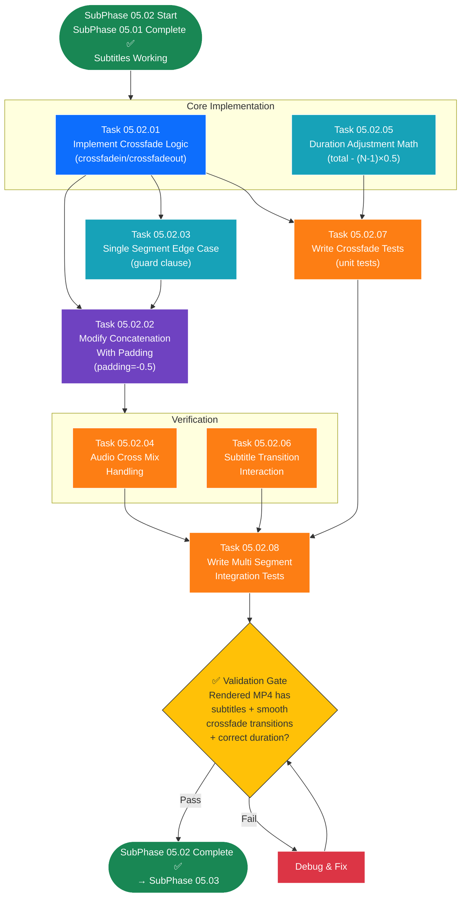

# SubPhase 05.02 — Transitions & Effects

## Layer 2 Overview Document

---

| **Field**                | **Value**                                                                                                    |
| ------------------------ | ------------------------------------------------------------------------------------------------------------ |
| **Sub-Phase**            | 05.02 — Transitions & Effects                                                                                |
| **Phase**                | Phase 05 — The Polish                                                                                        |
| **Layer**                | Layer 2 (Sub-Phase Overview)                                                                                 |
| **Status**               | Not Started                                                                                                  |
| **Parent Document**      | [Phase_05_Overview.md](../Phase_05_Overview.md) (Layer 1)                                                    |
| **Previous Sub-Phase**   | [SubPhase_05_01_Overview.md](../SubPhase_05_01_Subtitle_Generation_Overlay/SubPhase_05_01_Overview.md) (Layer 2) |
| **Next Sub-Phase**       | [SubPhase_05_03_Overview.md](../SubPhase_05_03_Final_UI_Polish_Testing/SubPhase_05_03_Overview.md) (Layer 2)  |
| **Dependencies**         | SubPhase 05.01 complete (subtitle-composited clips ready for transition application)                         |
| **Estimated Task Docs**  | 8                                                                                                            |

---

## Table of Contents

- [SubPhase 05.02 — Transitions \& Effects](#subphase-0502--transitions--effects)
  - [Layer 2 Overview Document](#layer-2-overview-document)
  - [Table of Contents](#table-of-contents)
  - [1. Objective](#1-objective)
    - [What SubPhase 05.02 Delivers](#what-subphase-0502-delivers)
    - [What SubPhase 05.02 Does NOT Deliver](#what-subphase-0502-does-not-deliver)
  - [2. Scope](#2-scope)
    - [2.1 In Scope](#21-in-scope)
    - [2.2 Out of Scope](#22-out-of-scope)
  - [3. Technical Context](#3-technical-context)
    - [3.1 Prerequisites](#31-prerequisites)
    - [3.2 Technology Specs](#32-technology-specs)
    - [3.3 Key Code Samples \& Patterns](#33-key-code-samples--patterns)
  - [4. Task List](#4-task-list)
  - [5. Task Details](#5-task-details)
    - [5.1 Task 05.02.01 — Implement Crossfade Logic](#51-task-050201--implement-crossfade-logic)
    - [5.2 Task 05.02.02 — Modify Concatenation With Padding](#52-task-050202--modify-concatenation-with-padding)
    - [5.3 Task 05.02.03 — Single Segment Edge Case](#53-task-050203--single-segment-edge-case)
    - [5.4 Task 05.02.04 — Audio Cross Mix Handling](#54-task-050204--audio-cross-mix-handling)
    - [5.5 Task 05.02.05 — Duration Adjustment Math](#55-task-050205--duration-adjustment-math)
    - [5.6 Task 05.02.06 — Subtitle Transition Interaction](#56-task-050206--subtitle-transition-interaction)
    - [5.7 Task 05.02.07 — Write Crossfade Tests](#57-task-050207--write-crossfade-tests)
    - [5.8 Task 05.02.08 — Write Multi Segment Integration Tests](#58-task-050208--write-multi-segment-integration-tests)
  - [6. Execution Order](#6-execution-order)
    - [6.1 Dependency Chain](#61-dependency-chain)
    - [6.2 Recommended Sequence](#62-recommended-sequence)
    - [6.3 Execution Order Flowchart](#63-execution-order-flowchart)
    - [6.4 Parallel Work Opportunities](#64-parallel-work-opportunities)
  - [7. Files Created \& Modified](#7-files-created--modified)
  - [8. Validation Criteria](#8-validation-criteria)
    - [Crossfade Visual Quality](#crossfade-visual-quality)
    - [Duration Correctness](#duration-correctness)
    - [Audio Quality](#audio-quality)
    - [Single-Segment Handling](#single-segment-handling)
    - [Subtitle Interaction](#subtitle-interaction)
    - [Integration](#integration)
  - [9. Constraints](#9-constraints)
  - [10. Notes \& Gotchas](#10-notes--gotchas)
    - [MoviePy `method="compose"` vs. `method="chain"`](#moviepy-methodcompose-vs-methodchain)
    - [`crossfadein` vs. `fadein`](#crossfadein-vs-fadein)
    - [Negative Padding and Clip Start Times](#negative-padding-and-clip-start-times)
    - [Performance Impact](#performance-impact)
    - [Transition Duration vs. Clip Duration](#transition-duration-vs-clip-duration)
    - [Audio Overlap Behavior](#audio-overlap-behavior)
    - [Render Pipeline Order](#render-pipeline-order)
  - [11. Cross-References](#11-cross-references)
    - [Parent \& Ancestry](#parent--ancestry)
    - [Previous Sub-Phase](#previous-sub-phase)
    - [Next Sub-Phase](#next-sub-phase)
    - [Cross-Phase References](#cross-phase-references)
    - [Child Documents (Layer 3)](#child-documents-layer-3)

---

## 1. Objective

SubPhase 05.02 adds **smooth crossfade transitions** between consecutive clips in the rendered video. This is the second half of the rendering polish — after SubPhase 05.01 added subtitles, this sub-phase ensures that clip boundaries are no longer hard cuts but instead visually blend together, creating a professional, polished viewing experience.

### What SubPhase 05.02 Delivers

1. **Crossfade Transition Logic** — A utility function `apply_crossfade_transitions(clips, transition_duration) -> list[VideoClip]` that applies `crossfadein()` and `crossfadeout()` to adjacent clips, producing a list of clips ready for overlapping concatenation.

2. **Modified Concatenation with Negative Padding** — Modification of the `concatenate_videoclips()` call in `video_renderer.py` to use `padding=-0.5`, making adjacent clips overlap by 0.5 seconds to create the actual crossfade blend effect.

3. **Single-Segment Edge Case Handling** — Explicit logic ensuring that when a project has only 1 segment, no crossfade is applied and the clip is exported as-is (with subtitles if present, but no transition effects).

4. **Audio Cross-Mix During Transitions** — Verification and tuning of the audio behavior during the 0.5s overlap period, where both clips' audio is mixed together. MoviePy handles this automatically through `concatenate_videoclips` with `method="compose"` and negative padding.

5. **Duration Adjustment Math** — A utility function `calculate_total_duration_with_transitions(clip_durations, transition_duration) -> float` that computes the expected total video duration accounting for crossfade overlaps, used for progress reporting and validation.

6. **Subtitle-Transition Interaction Verification** — Confirmation that subtitles composited in SubPhase 05.01 continue to work correctly during crossfade transitions — the outgoing subtitle fades out while the incoming subtitle fades in, with no rendering artifacts.

7. **Crossfade Unit Tests** — Tests for the crossfade application logic: 2-clip crossfade, multi-clip crossfade, duration math, and edge cases.

8. **Multi-Segment Integration Tests** — Full pipeline integration tests: render a multi-segment project with subtitles AND transitions, verify the output MP4 has correct duration, smooth visual transitions, and no artifacts.

### What SubPhase 05.02 Does NOT Deliver

> **Critical:** The following features are explicitly **out of scope** for SubPhase 05.02. AI agents must NOT implement these.

- ❌ Custom transition types (dissolve, wipe, slide, etc.) — only crossfade in v1.0
- ❌ User-configurable transition duration — fixed at 0.5 seconds
- ❌ Per-segment transition settings — uniform transition for all clip boundaries
- ❌ GlobalSettings editing UI (→ SubPhase 05.03)
- ❌ Toast notifications (→ SubPhase 05.03)
- ❌ UI polish (→ SubPhase 05.03)
- ❌ End-to-end tests (→ SubPhase 05.03)

At the conclusion of SubPhase 05.02, the rendered MP4 contains **burned-in subtitles** (from 05.01) AND **smooth crossfade transitions** between all consecutive segments. The video is now at near-production quality, missing only the GlobalSettings UI and final polish (SubPhase 05.03).

---

## 2. Scope

### 2.1 In Scope

| Area                              | Details                                                                            |
| --------------------------------- | ---------------------------------------------------------------------------------- |
| **Crossfade Logic**               | `crossfadein()` / `crossfadeout()` applied to adjacent clips                       |
| **Negative Padding**              | `concatenate_videoclips(..., padding=-0.5)` for clip overlap                       |
| **Single-Segment Guard**          | Skip transitions when only 1 clip exists                                            |
| **Audio Cross-Mix**               | Verify automatic audio blending during 0.5s overlap                                |
| **Duration Math**                 | `total = sum(durations) - (N-1) × 0.5` utility function                           |
| **Subtitle Interaction**          | Verify subtitles render correctly through crossfade boundaries                      |
| **Progress Reporting**            | Update render progress messages to include transition phase                         |
| **Transition Constant**           | `TRANSITION_DURATION = 0.5` defined as a named constant                             |
| **Unit Tests**                    | Crossfade logic tests, duration math tests                                          |
| **Integration Tests**             | Multi-segment render with subtitles + transitions                                   |

### 2.2 Out of Scope

| Area                              | Reason / Destination                                                               |
| --------------------------------- | ---------------------------------------------------------------------------------- |
| Custom transition types           | Out of v1.0 scope — crossfade only                                                  |
| User-configurable duration        | Out of v1.0 scope — fixed at 0.5s                                                   |
| Per-segment transition settings   | Out of v1.0 scope — uniform transitions                                             |
| Transition preview in UI          | Out of v1.0 scope — no live preview                                                  |
| GlobalSettings editing UI         | SubPhase 05.03                                                                      |
| Background music mixing           | Out of v1.0 scope entirely                                                           |
| Any frontend changes              | This sub-phase is entirely backend                                                   |

---

## 3. Technical Context

### 3.1 Prerequisites

Before starting SubPhase 05.02, the following must be in place:

| Prerequisite                                                           | Source                      | Verification                                                            |
| ---------------------------------------------------------------------- | --------------------------- | ----------------------------------------------------------------------- |
| SubPhase 05.01 complete — subtitle-composited clips                    | SubPhase 05.01              | Rendered MP4 has burned-in subtitles at bottom-center                   |
| `core_engine/subtitle_engine.py` — full implementation                 | SubPhase 05.01              | `create_subtitles_for_segment()` produces TextClip overlays             |
| `core_engine/video_renderer.py` — subtitle compositing integrated      | SubPhase 05.01 (Task 05)    | Per-segment `CompositeVideoClip([ken_burns_clip, *subtitle_clips])`     |
| `core_engine/render_utils.py` — ImageMagick check and font validation  | SubPhase 05.01 (Tasks 06, 08) | `check_imagemagick()`, `get_font_path()` working                      |
| MoviePy installed (`moviepy>=1.0.3`)                                   | SubPhase 04.01              | `concatenate_videoclips`, `crossfadein`, `crossfadeout` available       |
| FFmpeg installed on system PATH                                        | SubPhase 04.01              | Required for video encoding                                             |
| ImageMagick installed (optional — subtitles work if present)           | SubPhase 05.01              | Transitions work regardless of ImageMagick availability                 |

### 3.2 Technology Specs

| Technology       | Version / Spec      | Usage in This Sub-Phase                                                  |
| ---------------- | ------------------- | ------------------------------------------------------------------------ |
| **MoviePy**      | 1.0.3 / 2.0         | `crossfadein()`, `crossfadeout()`, `concatenate_videoclips()` with `padding` |
| **Python**       | 3.11+                | Logic, math, logging                                                     |
| **Django**       | 5.x + DRF            | No changes — transitions are purely in the video renderer                |

**MoviePy Crossfade API:**

```python
from moviepy.editor import concatenate_videoclips

# Apply crossfade to each clip
clip_a = clip_a.crossfadeout(0.5)   # Last 0.5s: opacity 1.0 → 0.0
clip_b = clip_b.crossfadein(0.5)    # First 0.5s: opacity 0.0 → 1.0

# Concatenate with overlap
final = concatenate_videoclips(
    [clip_a, clip_b],
    method="compose",      # "compose" mode handles transparency/overlapping
    padding=-0.5           # Negative padding = clips overlap by 0.5s
)
```

**Key MoviePy detail:** The `method="compose"` parameter is required for crossfades. The alternative `method="chain"` does NOT support overlapping clips and would produce incorrect results with negative padding.

### 3.3 Key Code Samples & Patterns

**Pattern 1: Crossfade Visual Representation**

```
Timeline with 3 clips (each 5.0s) and 0.5s crossfade:

Clip A:    |████████████████████████████▓▒░|
           0s                           4.5s  5.0s

Clip B:                              |░▒▓████████████████████████████▓▒░|
                                    4.5s                             9.0s  9.5s

Clip C:                                                          |░▒▓████████████████████████████|
                                                                 9.0s                          13.5s  14.0s

Overlap:                             |←0.5→|                    |←0.5→|
                                   crossfade 1              crossfade 2

Total duration = 5.0 + 5.0 + 5.0 - (2 × 0.5) = 14.0s
```

**Pattern 2: Complete Crossfade Application**

```python
TRANSITION_DURATION = 0.5  # seconds — fixed for v1.0

def apply_crossfade_transitions(
    clips: list,
    transition_duration: float = TRANSITION_DURATION,
) -> list:
    """
    Apply crossfade transitions to a list of video clips.
    
    - First clip: crossfadeout only (no fadein at the start of the video).
    - Middle clips: crossfadein + crossfadeout.
    - Last clip: crossfadein only (no fadeout at the end of the video).
    - Single clip: no transitions applied.
    
    Returns the same list of clips with crossfade effects applied.
    """
    if len(clips) <= 1:
        return clips
    
    transitioned = []
    for i, clip in enumerate(clips):
        modified = clip
        if i > 0:
            # This clip fades in (it's preceded by another clip)
            modified = modified.crossfadein(transition_duration)
        if i < len(clips) - 1:
            # This clip fades out (it's followed by another clip)
            modified = modified.crossfadeout(transition_duration)
        transitioned.append(modified)
    
    return transitioned
```

**Pattern 3: Modified Concatenation in Renderer**

```python
# In video_renderer.py — after the segment processing loop:

from core_engine.transition_utils import apply_crossfade_transitions, TRANSITION_DURATION

# clips = [...list of subtitle-composited clips from SubPhase 05.01...]

if len(clips) > 1:
    # Apply crossfade transitions
    clips = apply_crossfade_transitions(clips, TRANSITION_DURATION)
    
    # Concatenate with negative padding for overlap
    final_clip = concatenate_videoclips(
        clips,
        method="compose",
        padding=-TRANSITION_DURATION,
    )
    logger.info(f"Applied crossfade transitions ({TRANSITION_DURATION}s) between {len(clips)} clips")
else:
    # Single clip — no transitions needed
    final_clip = clips[0]
    logger.info("Single clip — no transitions applied")
```

**Pattern 4: Duration Adjustment Calculation**

```python
def calculate_total_duration_with_transitions(
    clip_durations: list[float],
    transition_duration: float = TRANSITION_DURATION,
) -> float:
    """
    Calculate the total video duration accounting for crossfade overlap.
    
    Formula: D_total = sum(D_i) - (N - 1) × transition_duration
    
    For 1 clip: total = clip duration (no overlap).
    For N clips: total = sum - (N-1) × 0.5.
    """
    if not clip_durations:
        return 0.0
    
    total = sum(clip_durations)
    num_transitions = max(0, len(clip_durations) - 1)
    overlap = num_transitions * transition_duration
    
    return total - overlap
```

**Pattern 5: Audio Cross-Mix During Transitions**

```python
# MoviePy handles audio cross-mix automatically when using:
# - method="compose" (composites clips including their audio)
# - padding=-TRANSITION_DURATION (creates temporal overlap)
#
# During the 0.5s overlap:
# - Clip A's audio volume: 1.0 → 0.0 (fading out with the video)
# - Clip B's audio volume: 0.0 → 1.0 (fading in with the video)
# - Result: smooth audio crossfade
#
# No manual AudioClip manipulation is required.
# The crossfadein/crossfadeout on the video clips also affects their audio.
#
# Important: If the audio crossfade sounds too abrupt, the transition
# duration can be increased — but for v1.0, 0.5s is fixed.
```

**Pattern 6: Subtitle Behavior During Crossfade**

```
During a crossfade between Clip A and Clip B:

Clip A (fading out):
  - Ken Burns image: opacity 1.0 → 0.0
  - Subtitle text:   opacity 1.0 → 0.0 (fades out with the clip)

Clip B (fading in):
  - Ken Burns image: opacity 0.0 → 1.0
  - Subtitle text:   opacity 0.0 → 1.0 (fades in with the clip)

Result:
  - For 0.5s, both subtitles are partially visible (blending).
  - This is visually coherent because:
    a. The outgoing subtitle is nearly complete (at the END of its segment).
    b. The incoming subtitle is just starting (at the START of its segment).
    c. The opacity crossfade makes the transition smooth, not jarring.
  - No special handling needed — this works automatically because
    subtitles are composited INTO each clip before crossfade is applied.
```

---

## 4. Task List

| Task ID     | Task Name                                      | Layer 3 Document                                                          | Est. Complexity |
| ----------- | ---------------------------------------------- | ------------------------------------------------------------------------- | --------------- |
| 05.02.01    | Implement Crossfade Logic                      | `Task_05_02_01_Implement_Crossfade_Logic.md`                              | Medium          |
| 05.02.02    | Modify Concatenation With Padding              | `Task_05_02_02_Modify_Concatenation_With_Padding.md`                      | Medium          |
| 05.02.03    | Single Segment Edge Case                       | `Task_05_02_03_Single_Segment_Edge_Case.md`                               | Low             |
| 05.02.04    | Audio Cross Mix Handling                        | `Task_05_02_04_Audio_Cross_Mix_Handling.md`                               | Medium          |
| 05.02.05    | Duration Adjustment Math                        | `Task_05_02_05_Duration_Adjustment_Math.md`                               | Low             |
| 05.02.06    | Subtitle Transition Interaction                 | `Task_05_02_06_Subtitle_Transition_Interaction.md`                        | Medium          |
| 05.02.07    | Write Crossfade Tests                           | `Task_05_02_07_Write_Crossfade_Tests.md`                                  | Medium          |
| 05.02.08    | Write Multi Segment Integration Tests           | `Task_05_02_08_Write_Multi_Segment_Integration_Tests.md`                  | High            |

---

## 5. Task Details

### 5.1 Task 05.02.01 — Implement Crossfade Logic

**Objective:** Create the crossfade transition utility function that applies `crossfadein()` and `crossfadeout()` to a list of video clips, preparing them for overlapping concatenation.

**File:** `backend/core_engine/video_renderer.py` (MODIFIED) — or optionally a new `backend/core_engine/transition_utils.py` (NEW)

**Steps:**

1. Define the transition constant:
   ```python
   TRANSITION_DURATION = 0.5  # seconds — fixed for v1.0, not user-configurable
   ```

2. Implement `apply_crossfade_transitions(clips, transition_duration) -> list`:
   - **Input:** A list of `VideoClip` objects (already composited with subtitles from SubPhase 05.01).
   - **Output:** The same clips with crossfade effects applied.
   - **Logic:**
     - If `len(clips) <= 1`: return `clips` unchanged (guard clause).
     - For each clip at index `i`:
       - If `i > 0`: apply `clip.crossfadein(transition_duration)` — this clip has a predecessor.
       - If `i < len(clips) - 1`: apply `clip.crossfadeout(transition_duration)` — this clip has a successor.
   - **Result:**
     - First clip: `crossfadeout` only (video starts clean, fades out at end).
     - Middle clips: both `crossfadein` and `crossfadeout`.
     - Last clip: `crossfadein` only (video fades in from predecessor, ends clean).

3. Add logging:
   ```python
   logger.info(f"Applying crossfade transitions ({transition_duration}s) to {len(clips)} clips")
   logger.debug(f"Clip durations before transition: {[c.duration for c in clips]}")
   ```

4. Placement decision:
   - **Option A (preferred):** Add directly in `video_renderer.py` as a private function `_apply_crossfade_transitions()`. Keeps all rendering logic in one file.
   - **Option B:** Create a new `transition_utils.py` module. Better separation but adds another file. Use this if `video_renderer.py` is getting too large.

**Key Details:**
- `crossfadein(d)` applies a linear opacity ramp from 0.0 to 1.0 over the first `d` seconds of the clip. This affects both video and audio.
- `crossfadeout(d)` applies a linear opacity ramp from 1.0 to 0.0 over the last `d` seconds of the clip. This affects both video and audio.
- These MoviePy methods return a new clip object — they do not mutate in place. The return value must be captured.
- The transition duration (0.5s) should never exceed any clip's duration. If a clip is shorter than 0.5s, the crossfade would consume the entire clip, which is visually strange but technically valid. In practice, segments are at least 1–2 seconds (TTS minimum), so this is not a concern.

**Files Touched:**
- `backend/core_engine/video_renderer.py` — Modified (add crossfade function and constant)

---

### 5.2 Task 05.02.02 — Modify Concatenation With Padding

**Objective:** Replace the current `concatenate_videoclips()` call in `video_renderer.py` with one that uses `padding=-TRANSITION_DURATION` to create the actual overlapping crossfade effect.

**File:** `backend/core_engine/video_renderer.py` (MODIFIED)

**Steps:**

1. Locate the existing concatenation code in `render_project()` (from Phase 04):
   ```python
   # Phase 04 (current):
   final_clip = concatenate_videoclips(clips, method="compose")
   ```

2. Replace with the transition-aware concatenation:
   ```python
   # Phase 05 (updated):
   if len(clips) > 1:
       clips = apply_crossfade_transitions(clips, TRANSITION_DURATION)
       final_clip = concatenate_videoclips(
           clips,
           method="compose",
           padding=-TRANSITION_DURATION,
       )
   else:
       final_clip = clips[0]
   ```

3. Ensure `method="compose"` is used:
   - **`method="compose"`**: Each clip is placed at its computed start time. During overlap periods, both clips are composited together (the one with higher opacity "wins" visually). This is required for crossfades.
   - **`method="chain"` (NOT allowed)**: Clips are placed sequentially with no overlap support. Negative padding would break the output.

4. Update the concatenation logging:
   ```python
   if len(clips) > 1:
       expected_duration = calculate_total_duration_with_transitions(
           [c.duration for c in original_clips],
           TRANSITION_DURATION,
       )
       logger.info(f"Concatenated {len(clips)} clips with crossfade. Expected duration: {expected_duration:.2f}s")
   ```

5. Add transition phase to progress reporting:
   ```python
   on_progress(total_segments, total_segments, "Applying crossfade transitions...")
   ```
   This progress message should appear after all segments are processed but before the final export.

**Key Details:**
- The `padding` parameter in `concatenate_videoclips` controls the gap between clips:
  - `padding=0` (default): clips placed end-to-end (no gap, no overlap).
  - `padding=1.0`: 1 second of black between clips.
  - `padding=-0.5`: clips overlap by 0.5 seconds (required for crossfade).
- The negative padding COMBINED with `crossfadein/crossfadeout` creates the visual blend. Without the crossfade effects, negative padding alone would show both clips at full opacity simultaneously (picture-in-picture effect).
- The order matters: apply crossfade effects FIRST, then concatenate with negative padding.
- The original clips list should be preserved for duration logging before crossfade is applied (since crossfade doesn't change clip duration, this is just for clarity).

**Files Touched:**
- `backend/core_engine/video_renderer.py` — Modified (update concatenation logic)

---

### 5.3 Task 05.02.03 — Single Segment Edge Case

**Objective:** Ensure that projects with only 1 segment render correctly without any crossfade transition logic.

**File:** `backend/core_engine/video_renderer.py` (MODIFIED — guard clause)

**Steps:**

1. Add an explicit guard in `render_project()` before the transition logic:
   ```python
   if len(clips) == 1:
       final_clip = clips[0]
       logger.info("Single segment — no crossfade transitions applied")
   elif len(clips) > 1:
       clips = apply_crossfade_transitions(clips, TRANSITION_DURATION)
       final_clip = concatenate_videoclips(clips, method="compose", padding=-TRANSITION_DURATION)
       logger.info(f"Applied crossfade transitions to {len(clips)} clips")
   else:
       # No clips — should have been caught by pre-render validation
       raise ValueError("No clips to render — project has no segments")
   ```

2. Verify that the single-segment path preserves:
   - Ken Burns effect (from Phase 04).
   - Subtitle overlay (from SubPhase 05.01).
   - Audio track.
   - Correct duration.

3. Verify the `apply_crossfade_transitions()` function also handles the single-clip case:
   ```python
   def apply_crossfade_transitions(clips, transition_duration):
       if len(clips) <= 1:
           return clips  # Guard: no transitions for 0 or 1 clips
       ...
   ```
   This is a belt-and-suspenders approach — both the renderer and the utility function guard against single clips.

4. Edge case: **Zero segments.**
   - This should never happen — pre-render validation (SubPhase 04.03) rejects projects with no segments.
   - But if it somehow occurs, the renderer should raise a clear error, not silently produce an empty video.

**Key Details:**
- A single-segment project is valid and should produce a working MP4.
- The video should NOT start with a fade-in or end with a fade-out for single-segment projects. It should begin and end cleanly.
- The `clips[0]` shortcut avoids calling `concatenate_videoclips` with a single clip, which is unnecessary overhead.

**Files Touched:**
- `backend/core_engine/video_renderer.py` — Modified (guard clause for single segment)

---

### 5.4 Task 05.02.04 — Audio Cross Mix Handling

**Objective:** Verify and document the audio behavior during crossfade transitions, ensuring the audio cross-mix sounds natural.

**File:** `backend/core_engine/video_renderer.py` (VERIFIED — minimal modification)

**Steps:**

1. Understand MoviePy's automatic audio behavior:
   - When `crossfadein(0.5)` is applied to a clip, the clip's **audio volume** ramps from 0.0 to 1.0 over the first 0.5 seconds.
   - When `crossfadeout(0.5)` is applied, the audio volume ramps from 1.0 to 0.0 over the last 0.5 seconds.
   - With `concatenate_videoclips(..., padding=-0.5)`, during the 0.5s overlap:
     - Clip A's audio: volume ramping 1.0 → 0.0.
     - Clip B's audio: volume ramping 0.0 → 1.0.
     - Result: smooth audio crossfade (total volume stays near 1.0 throughout the transition).

2. Verify that the audio cross-mix is acceptable:
   - The outgoing narration should fade out gradually.
   - The incoming narration should fade in gradually.
   - There should be no sudden audio pop, click, or silence during the transition.
   - The combined volume should stay approximately constant (no dip or spike).

3. If the automatic cross-mix sounds unnatural, consider alternative approaches (but attempt automatic first):
   - **Alternative A:** Use `audio_fadein()` and `audio_fadeout()` independently from the video crossfade:
     ```python
     clip.audio = clip.audio.audio_fadein(0.5)
     clip.audio = clip.audio.audio_fadeout(0.5)
     ```
     This separates audio and video fade control. NOT recommended for v1.0 — adds complexity.
   - **Alternative B:** Keep audio at full volume during transitions (no audio fade):
     ```python
     # Apply crossfade to video only, not audio
     # MoviePy doesn't directly support this — would require separating audio/video
     ```
     NOT recommended — abrupt audio changes at transition points.

4. Document the behavior in a code comment:
   ```python
   # Audio during crossfade:
   # MoviePy's crossfadein/crossfadeout affects both video and audio.
   # During the 0.5s overlap, both clips' audio is mixed:
   #   - Outgoing clip audio fades from 1.0 → 0.0
   #   - Incoming clip audio fades from 0.0 → 1.0
   # This creates a natural-sounding audio crossfade.
   # No manual audio manipulation is required.
   ```

5. Add a verification step in the integration tests (Task 05.02.08):
   - Render a multi-segment video.
   - Check that the output audio is continuous (no silence gaps at transition points).
   - This can be done by reading the output audio waveform and checking for unexpected zero-amplitude regions.

**Key Details:**
- MoviePy's crossfade behavior with audio is well-tested and should produce acceptable results for narration (speech) audio.
- The 0.5s overlap is short enough that audio cross-mixing is generally imperceptible — the listener hears the end of one sentence blending into the start of the next.
- For StoryFlow's use case (narration with natural pauses between segments), the audio cross-mix should sound natural because segments typically end with a brief pause and the next segment starts with a brief pause.
- This task is primarily verification/documentation — the actual audio behavior is handled automatically by MoviePy. The task exists to ensure the team has thought about audio explicitly and verified it works.

**Files Touched:**
- `backend/core_engine/video_renderer.py` — Modified (add documentation comments)

---

### 5.5 Task 05.02.05 — Duration Adjustment Math

**Objective:** Implement a utility function that calculates the expected total video duration accounting for crossfade overlaps, and integrate it into progress reporting and result validation.

**File:** `backend/core_engine/video_renderer.py` (MODIFIED)

**Steps:**

1. Implement `calculate_total_duration_with_transitions()`:
   ```python
   def calculate_total_duration_with_transitions(
       clip_durations: list[float],
       transition_duration: float = TRANSITION_DURATION,
   ) -> float:
       """
       Calculate total video duration accounting for crossfade overlap.
       
       Formula: D_total = sum(D_i) - (N - 1) × transition_duration
       
       Examples:
         1 clip  of 5.0s: total = 5.0s
         2 clips of 5.0s: total = 5.0 + 5.0 - 0.5 = 9.5s
         3 clips of 5.0s: total = 5.0 + 5.0 + 5.0 - 2×0.5 = 14.0s
         5 clips of 3.0s: total = 15.0 - 4×0.5 = 13.0s
       """
       if not clip_durations:
           return 0.0
       
       total = sum(clip_durations)
       num_transitions = max(0, len(clip_durations) - 1)
       overlap = num_transitions * transition_duration
       
       return total - overlap
   ```

2. The formula:

   $$D_{\text{total}} = \sum_{i=1}^{N} D_i - (N - 1) \times T$$

   Where:
   - $D_i$ = duration of clip $i$
   - $N$ = number of clips
   - $T$ = transition duration (0.5s)

3. Use the calculated duration for:
   - **Progress reporting:** After applying transitions, log the expected total duration:
     ```python
     expected_total = calculate_total_duration_with_transitions(
         [c.duration for c in original_clips]
     )
     logger.info(f"Expected total duration with transitions: {expected_total:.2f}s")
     ```
   - **Result validation:** After rendering, compare the actual output duration to the expected duration:
     ```python
     actual_duration = final_clip.duration
     if abs(actual_duration - expected_total) > 0.1:
         logger.warning(
             f"Duration mismatch: expected {expected_total:.2f}s, got {actual_duration:.2f}s"
         )
     ```
   - **Render result metadata:** Include the expected and actual duration in the render result:
     ```python
     result = {
         "output_path": output_path,
         "duration": actual_duration,
         "expected_duration": expected_total,
         "num_transitions": num_transitions,
         ...
     }
     ```

4. Edge cases:
   - **0 clips:** Return 0.0 (should not happen in practice — pre-render validation catches this).
   - **1 clip:** Return the single clip's duration (no transitions, no overlap).
   - **Very short clips (< transition_duration):** The math still works, but the output may look strange. Log a warning if any clip is shorter than `transition_duration`:
     ```python
     short_clips = [d for d in clip_durations if d < transition_duration]
     if short_clips:
         logger.warning(f"{len(short_clips)} clip(s) shorter than transition duration ({transition_duration}s)")
     ```

**Key Details:**
- This function is pure math — no side effects, no I/O, easy to test.
- The duration calculation is important because users expect the video to be close to the sum of segment durations. The 0.5s-per-transition reduction should be small (e.g., 10 segments × 0.5s = 4.5s reduction on a ~60s video).
- The `original_clips` list (before crossfade modification) should be used for duration calculation, since `crossfadein/crossfadeout` do not change clip duration.

**Files Touched:**
- `backend/core_engine/video_renderer.py` — Modified (add duration calculation function + validation)

---

### 5.6 Task 05.02.06 — Subtitle Transition Interaction

**Objective:** Verify that subtitles (burned into clips in SubPhase 05.01) remain visually correct and readable during crossfade transitions. Fix any issues if found.

**File:** `backend/core_engine/video_renderer.py` (VERIFIED — potential modification if issues found)

**Steps:**

1. Understand the compositing order:
   ```
   SubPhase 05.01 (per segment):
     ken_burns_clip + subtitle_clips → composited_clip (CompositeVideoClip)
   
   SubPhase 05.02 (across segments):
     composited_clips → apply crossfade → concatenate with padding
   ```
   Subtitles are baked into each clip BEFORE transitions are applied. This means:
   - The crossfade opacity effect applies to the entire composited clip (Ken Burns + subtitles together).
   - Subtitles fade in/out WITH their background image — they don't "float" separately.

2. Verify visual correctness:
   - During the crossfade, both clips' subtitles blend (outgoing fades out, incoming fades in).
   - The subtitles should not "stack" or overlap in a confusing way.
   - Since subtitles are at the same position (bottom-center) on both clips, the blend is:
     - Outgoing subtitle text at 50% opacity.
     - Incoming subtitle text at 50% opacity.
     - For 0.5 seconds only — brief enough to be acceptable.

3. Consider whether the subtitle-during-transition behavior needs adjustment:
   - **Acceptable scenario (default):** Both subtitles visible at reduced opacity during 0.5s crossfade. This is standard behavior in professional video editing.
   - **If problematic:** Could truncate the outgoing subtitle 0.5s early or delay the incoming subtitle 0.5s. NOT recommended for v1.0 — adds significant complexity and changes timing calculations.

4. Document the expected behavior:
   ```python
   # Subtitle behavior during crossfade transitions:
   #
   # Subtitles are composited INTO each clip (SubPhase 05.01) before
   # crossfade transitions are applied (SubPhase 05.02).
   #
   # During the 0.5s crossfade overlap:
   # - Outgoing clip: Ken Burns + subtitles fade out together (opacity → 0)
   # - Incoming clip: Ken Burns + subtitles fade in together (opacity → 0 → 1)
   # - Both subtitle texts are briefly visible at partial opacity
   #
   # This is standard video editing behavior and is visually acceptable
   # because the crossfade is short (0.5s) and subtitles occupy the same
   # screen position, creating a natural text transition effect.
   ```

5. If testing reveals readability issues:
   - Option: Add a semi-transparent background rectangle behind subtitles (like YouTube's subtitle background). This would require modifying `generate_subtitle_clips()` in `subtitle_engine.py` to include a `ColorClip` background. NOT planned for v1.0 unless testing shows it's necessary.

**Key Details:**
- This task is primarily a **verification and documentation** task, not a coding task.
- The implementation (subtitles baked into clips before transitions) is the simplest and most correct approach.
- The visual result should be tested by rendering a multi-segment video and watching the transition points.
- If the subtitles are hard to read during transitions, the issue is a 0.5s window — most viewers won't notice.
- No code changes are expected unless testing reveals a visual bug.

**Files Touched:**
- `backend/core_engine/video_renderer.py` — Modified (add documentation comments)

---

### 5.7 Task 05.02.07 — Write Crossfade Tests

**Objective:** Write unit tests for the crossfade transition logic: the `apply_crossfade_transitions()` function and the `calculate_total_duration_with_transitions()` function.

**File:** `backend/core_engine/tests.py` (MODIFIED)

**Steps:**

1. Add a `CrossfadeTransitionTests` test class.

2. Test cases for `apply_crossfade_transitions()`:

   | Test Name                                    | Input                                    | Expected Behavior                                        |
   | -------------------------------------------- | ---------------------------------------- | -------------------------------------------------------- |
   | `test_empty_clips`                           | `clips=[]`                               | Returns `[]`                                             |
   | `test_single_clip_no_transition`             | `clips=[clip_a]`                         | Returns `[clip_a]` unchanged (no crossfade applied)       |
   | `test_two_clips_crossfade`                   | `clips=[clip_a, clip_b]`                 | clip_a has crossfadeout, clip_b has crossfadein           |
   | `test_three_clips_crossfade`                 | `clips=[a, b, c]`                        | a: fadeout only, b: fadein+fadeout, c: fadein only        |
   | `test_clip_count_preserved`                  | Any clips list                            | `len(output) == len(input)`                              |
   | `test_custom_transition_duration`            | `transition_duration=1.0`                | Crossfade applied with 1.0s (not 0.5s default)           |

3. Test cases for `calculate_total_duration_with_transitions()`:

   | Test Name                                    | Input                                    | Expected Output                                          |
   | -------------------------------------------- | ---------------------------------------- | -------------------------------------------------------- |
   | `test_empty_durations`                       | `durations=[]`                           | Returns `0.0`                                            |
   | `test_single_duration`                       | `durations=[5.0]`                        | Returns `5.0`                                            |
   | `test_two_clips_duration`                    | `durations=[5.0, 5.0]`                   | Returns `9.5` (10.0 - 0.5)                               |
   | `test_three_clips_duration`                  | `durations=[5.0, 5.0, 5.0]`             | Returns `14.0` (15.0 - 1.0)                              |
   | `test_five_clips_duration`                   | `durations=[3.0]*5`                      | Returns `13.0` (15.0 - 2.0)                              |
   | `test_varying_durations`                     | `durations=[2.0, 5.0, 3.0]`             | Returns `9.0` (10.0 - 1.0)                               |
   | `test_custom_transition_duration`            | `durations=[5.0, 5.0], td=1.0`          | Returns `9.0` (10.0 - 1.0)                               |
   | `test_duration_never_negative`               | `durations=[0.1, 0.1], td=0.5`          | Returns `-0.3` or clamped to `0.0` — edge case to verify |

4. Mock clip creation for crossfade tests:
   ```python
   from unittest.mock import MagicMock
   
   def create_mock_clip(duration):
       """Create a mock VideoClip with crossfade methods."""
       clip = MagicMock()
       clip.duration = duration
       clip.crossfadein = MagicMock(return_value=clip)
       clip.crossfadeout = MagicMock(return_value=clip)
       return clip
   ```

5. Verify crossfade method calls:
   ```python
   def test_two_clips_crossfade(self):
       clip_a = create_mock_clip(5.0)
       clip_b = create_mock_clip(5.0)
       result = apply_crossfade_transitions([clip_a, clip_b])
       # First clip should only have crossfadeout (no fadein at start of video)
       clip_a.crossfadeout.assert_called_once_with(0.5)
       clip_a.crossfadein.assert_not_called()
       # Last clip should only have crossfadein (no fadeout at end of video)
       clip_b.crossfadein.assert_called_once_with(0.5)
       clip_b.crossfadeout.assert_not_called()
   ```

**Key Details:**
- These are **unit tests** — no video rendering, no ImageMagick, no FFmpeg required.
- Mock clips are used to verify that the correct MoviePy methods are called with the correct arguments.
- Duration math tests are pure arithmetic — the simplest tests in the suite.
- The "duration never negative" edge case: when clips are very short and many transitions consume more time than the clips have. In practice, this can't happen because TTS segments are always at least 0.5–1.0 seconds. But the math function should handle it gracefully.

**Files Touched:**
- `backend/core_engine/tests.py` — Modified (add `CrossfadeTransitionTests`)

---

### 5.8 Task 05.02.08 — Write Multi Segment Integration Tests

**Objective:** Write full pipeline integration tests that render multi-segment projects with subtitles AND crossfade transitions, verifying the complete output.

**File:** `backend/core_engine/tests.py` + `backend/api/tests.py` (MODIFIED)

**Steps:**

1. Add a `MultiSegmentIntegrationTests` test class.

2. Test setup (similar to SubPhase 05.01 integration tests):
   - Create a test `Project` with resolution 640×360 (small for fast tests).
   - Create `GlobalSettings` with subtitle settings.
   - Create 3+ test segments with:
     - `text_content`: different narration text per segment.
     - `image_file`: small synthetic test images (solid colors — red, green, blue for easy visual verification).
     - `audio_file`: short synthetic WAV files (1–2 seconds each).
     - `audio_duration`: matching the audio file length.

3. Test cases:

   | Test Name                                           | Setup                                        | Assertion                                                                |
   | --------------------------------------------------- | -------------------------------------------- | ------------------------------------------------------------------------ |
   | `test_two_segments_with_crossfade`                  | 2 segments, each 2.0s                        | MP4 duration ≈ 3.5s (4.0 - 0.5). File size > 0.                         |
   | `test_three_segments_with_crossfade`                | 3 segments, each 3.0s                        | MP4 duration ≈ 8.0s (9.0 - 1.0). File size > 0.                         |
   | `test_five_segments_with_crossfade`                 | 5 segments, varying durations                | MP4 duration ≈ sum - 4×0.5. File size > 0.                              |
   | `test_single_segment_no_crossfade`                  | 1 segment, 3.0s                              | MP4 duration ≈ 3.0s. No transition applied.                              |
   | `test_crossfade_with_subtitles`                     | 3 segments with text_content                 | MP4 produced with both subtitles and transitions. No errors.             |
   | `test_crossfade_without_subtitles`                  | 3 segments, no text_content                  | MP4 produced with transitions only. No errors.                           |
   | `test_crossfade_without_imagemagick`                | Mock `check_imagemagick()` to return False    | MP4 produced with transitions but no subtitles. Warning in result.       |
   | `test_render_result_includes_duration`              | Any multi-segment project                     | Render result has `duration` and `expected_duration` fields.             |
   | `test_render_result_includes_warnings`              | Mock ImageMagick missing                      | Render result has non-empty `warnings` list.                             |

4. Duration verification with tolerance:
   ```python
   def test_two_segments_with_crossfade(self):
       # Create 2 segments of 2.0s each
       ...
       result = render_project(str(self.project.id))
       
       expected_duration = 4.0 - 0.5  # 3.5s
       actual_path = result["output_path"]
       
       # Verify file exists and has content
       self.assertTrue(os.path.exists(actual_path))
       self.assertGreater(os.path.getsize(actual_path), 0)
       
       # Verify duration (with 0.2s tolerance for encoding/rounding)
       self.assertAlmostEqual(
           result["duration"],
           expected_duration,
           delta=0.2,
           msg=f"Expected duration ~{expected_duration}s, got {result['duration']}s"
       )
   ```

5. Mocking strategy:
   - For ImageMagick tests: `@mock.patch('core_engine.render_utils.check_imagemagick', return_value=False)`.
   - For tests requiring ImageMagick: `@unittest.skipUnless(check_imagemagick(), "ImageMagick not installed")`.
   - For audio files: generate minimal WAV files with `soundfile` or create silence with `numpy`:
     ```python
     import numpy as np
     import soundfile as sf
     
     silence = np.zeros(int(2.0 * 22050))  # 2 seconds of silence at 22050Hz
     sf.write(audio_path, silence, 22050)
     ```

6. File cleanup in `tearDown`:
   - Remove all temporary images, audio files, and output MP4s.
   - Use `tempfile.mkdtemp()` for test media directories.
   - Use `@override_settings(MEDIA_ROOT=tempfile.mkdtemp())`.

7. Optional visual verification test (manual):
   ```python
   @unittest.skip("Manual visual test — uncomment to run and visually inspect output")
   def test_visual_crossfade_inspection(self):
       """Render a video and print the output path for manual viewing."""
       result = render_project(str(self.project.id))
       print(f"\n>>> Visual inspection: open {result['output_path']} in VLC <<<\n")
       self.assertTrue(os.path.exists(result["output_path"]))
   ```

**Key Details:**
- Integration tests are **slow** (rendering video) — use small resolutions (640×360) and short audio (1–2s) to keep each test under 30 seconds.
- Duration tolerance of 0.2s accounts for MoviePy/FFmpeg encoding precision. The actual duration may differ from the mathematical expectation by small amounts.
- These tests exercise the FULL pipeline: segment loading → Ken Burns → subtitle compositing → crossfade → concatenation → MP4 export. They prove everything works together.
- Tests that require ImageMagick should be skippable — CI environments may not have it installed.
- The `render_project()` function is called directly (not through the API) for core_engine tests. API-level tests go in `api/tests.py` and call the render endpoint.

**Files Touched:**
- `backend/core_engine/tests.py` — Modified (add `MultiSegmentIntegrationTests`)
- `backend/api/tests.py` — Modified (add API-level render-with-transitions test if needed)

---

## 6. Execution Order

### 6.1 Dependency Chain

| Task      | Depends On          | Reason                                                                    |
| --------- | ------------------- | ------------------------------------------------------------------------- |
| 05.02.01  | —                   | Core crossfade function — must exist before integration                   |
| 05.02.05  | —                   | Duration math utility — independent pure function                         |
| 05.02.03  | 05.02.01            | Single-segment guard — refines the crossfade function's behavior          |
| 05.02.02  | 05.02.01            | Concatenation modification — uses the crossfade function                  |
| 05.02.04  | 05.02.02            | Audio verification — requires working crossfade + concatenation           |
| 05.02.06  | 05.02.02            | Subtitle interaction — requires crossfade integrated into renderer        |
| 05.02.07  | 05.02.01, 05.02.05  | Unit tests — tests the crossfade function and duration math               |
| 05.02.08  | 05.02.06            | Integration tests — tests the complete pipeline                           |

### 6.2 Recommended Sequence

| Order | Task ID  | Task Name                              | Why This Order                                                            |
| ----- | -------- | -------------------------------------- | ------------------------------------------------------------------------- |
| 1     | 05.02.01 | Implement Crossfade Logic              | Core function — all other tasks build on this                             |
| 2     | 05.02.05 | Duration Adjustment Math               | Independent utility — easy to implement early                             |
| 3     | 05.02.03 | Single Segment Edge Case               | Guard clause that refines the crossfade function                          |
| 4     | 05.02.02 | Modify Concatenation With Padding      | Integrates crossfade into the renderer — the main deliverable            |
| 5     | 05.02.07 | Write Crossfade Tests                  | Test the crossfade function and duration math immediately                 |
| 6     | 05.02.04 | Audio Cross Mix Handling               | Verify audio behavior after crossfade is integrated                       |
| 7     | 05.02.06 | Subtitle Transition Interaction        | Verify subtitle behavior during crossfade after full integration          |
| 8     | 05.02.08 | Write Multi Segment Integration Tests  | End-to-end tests after everything is integrated                           |

### 6.3 Execution Order Flowchart



### 6.4 Parallel Work Opportunities

| Parallel Group     | Tasks                | Reason for Parallelism                                                     |
| ------------------ | -------------------- | -------------------------------------------------------------------------- |
| **Core**           | 05.02.01, 05.02.05   | Crossfade function and duration math are independent implementations       |
| **Verification**   | 05.02.04, 05.02.06   | Audio verification and subtitle interaction are independent checks          |

The sub-phase is primarily sequential — each step builds on the previous. The two parallelism opportunities save some time but the critical path runs through Tasks 01 → 03 → 02 → (04 ∥ 06) → 08.

---

## 7. Files Created & Modified

| File Path                                      | Action       | Created/Modified In | Purpose                                                        |
| ---------------------------------------------- | ------------ | ------------------- | -------------------------------------------------------------- |
| `backend/core_engine/video_renderer.py`        | MODIFIED     | Tasks 05.02.01–06   | Crossfade function, modified concatenation, guards, constants  |
| `backend/core_engine/tests.py`                 | MODIFIED     | Tasks 05.02.07–08   | CrossfadeTransitionTests, MultiSegmentIntegrationTests          |
| `backend/api/tests.py`                         | MODIFIED     | Task 05.02.08       | API-level render-with-transitions test (optional)               |

**Summary:**
- 0 new files created
- 3 files modified (video_renderer.py, 2 test files)
- This is the smallest sub-phase in terms of new files — it modifies the existing renderer

**Note:** If the crossfade logic warrants its own module, a `backend/core_engine/transition_utils.py` file may be created (see Task 05.02.01 placement decision). This is optional and depends on the size of `video_renderer.py`.

---

## 8. Validation Criteria

### Crossfade Visual Quality

- [ ] Crossfade transitions are visible between consecutive clips when playing the output MP4.
- [ ] The crossfade is smooth (gradual opacity change) — no sudden jump or flicker.
- [ ] No black frames appear between clips during the transition.
- [ ] The first clip starts at full opacity (no fade-in at the start of the video).
- [ ] The last clip ends at full opacity (no fade-out at the end of the video).
- [ ] Middle clips have both fade-in and fade-out.
- [ ] The crossfade duration is approximately 0.5 seconds.

### Duration Correctness

- [ ] For 1 clip: total duration = clip duration (no change).
- [ ] For 2 clips: total duration ≈ sum of durations − 0.5s.
- [ ] For N clips: total duration ≈ sum of durations − (N−1) × 0.5s.
- [ ] `calculate_total_duration_with_transitions()` produces correct results for all test cases.
- [ ] The actual rendered MP4 duration matches the expected duration (within 0.2s tolerance).
- [ ] Duration metadata in the render result is accurate.

### Audio Quality

- [ ] No audio pops, clicks, or sudden silence at transition points.
- [ ] Audio cross-mix during the 0.5s overlap sounds natural.
- [ ] Outgoing narration fades out gradually during the transition.
- [ ] Incoming narration fades in gradually during the transition.
- [ ] Total audio volume stays approximately constant through transitions (no loud spike or quiet dip).

### Single-Segment Handling

- [ ] Single-segment project renders successfully without any crossfade.
- [ ] Single-segment output has no fade-in or fade-out.
- [ ] Single-segment output duration equals the segment's audio duration.
- [ ] Ken Burns effects and subtitles work correctly in single-segment mode.

### Subtitle Interaction

- [ ] Subtitles remain visible and readable during crossfade transitions.
- [ ] Outgoing subtitle fades out with the outgoing clip (not independently).
- [ ] Incoming subtitle fades in with the incoming clip (not independently).
- [ ] No subtitle "ghosting" or artifact after the transition completes.
- [ ] Subtitle timing is unaffected by crossfade transitions.

### Integration

- [ ] Full render with subtitles + transitions produces a valid MP4 file.
- [ ] MP4 plays correctly in VLC and browser `<video>` element.
- [ ] Render result includes `warnings` list (empty if no issues, populated if ImageMagick missing).
- [ ] No unhandled exceptions during transition application.
- [ ] Render time is acceptable (transitions should add minimal overhead — ~5–10% vs. no transitions).

---

## 9. Constraints

| #  | Constraint                                                          | Source                                                  |
| -- | ------------------------------------------------------------------- | ------------------------------------------------------- |
| 1  | Crossfade duration is **fixed at 0.5 seconds**                      | Phase_05_Overview.md §10, constraint #5                 |
| 2  | Only crossfade transitions — no dissolve, wipe, slide, etc.         | Phase_05_Overview.md §10, constraint #13                |
| 3  | Transition settings are NOT user-configurable in v1.0               | Phase_05_Overview.md §10, constraint #5                 |
| 4  | Uniform transitions across all clip boundaries                       | No per-segment transition customization                 |
| 5  | `concatenate_videoclips` must use `method="compose"` (not `"chain"`) | Required for overlap/transparency support               |
| 6  | Subtitles are composited INTO clips BEFORE transitions are applied  | SubPhase 05.01 architecture decision                    |
| 7  | Do NOT modify any model definitions                                  | Models are frozen from Phase 01                         |
| 8  | Do NOT build any frontend components in this sub-phase               | This sub-phase is entirely backend                      |
| 9  | Do NOT install new Python packages                                   | MoviePy has everything needed for transitions           |
| 10 | Single-segment projects must render without transitions              | No fade-in/fade-out on solo clips                       |
| 11 | Audio cross-mix is automatic via MoviePy                             | Do NOT manually manipulate audio clips during crossfade |
| 12 | Transition duration must never exceed any clip's duration            | Defensive check — log warning if clip < 0.5s            |

---

## 10. Notes & Gotchas

### MoviePy `method="compose"` vs. `method="chain"`

This is the most critical technical detail in SubPhase 05.02:

- **`method="chain"`**: Clips are placed sequentially. Each clip's frame pixels are copied directly — no transparency, no overlap. This is a simple concatenation. If you use `padding=-0.5` with `method="chain"`, the clips overlap but the later clip's pixels completely overwrite the earlier clip's pixels in the overlap region. **No crossfade effect.** This is WRONG.

- **`method="compose"`**: Clips are placed on a transparent canvas at their computed start times. During overlap regions, both clips' pixels are composited using their alpha channels. The `crossfadein/crossfadeout` effects modify the alpha channel, so the blending works correctly. **This is the correct method for crossfades.**

Always use `method="compose"`. This was already the method used in Phase 04 for concatenation, so no change is needed to the method parameter — only the `padding` parameter changes.

### `crossfadein` vs. `fadein`

MoviePy has two different fade methods:
- **`clip.crossfadein(d)`**: Modifies the clip's **opacity** (alpha channel). At t=0, opacity=0. At t=d, opacity=1. The clip's pixels are still there, just transparent. Used for VISUAL crossfade.
- **`clip.fadein(d)`**: Fades from **black** to the clip's pixels. At t=0, the frame is solid black. At t=d, the clip is fully visible. NOT the same as crossfade — this creates a "fade from black" effect.

For crossfade transitions between clips, use **`crossfadein`** and **`crossfadeout`** — NOT `fadein`/`fadeout`. The "cross" prefix is essential.

### Negative Padding and Clip Start Times

When `concatenate_videoclips` receives `padding=-0.5`:
- Clip A starts at t=0.
- Clip B starts at t=(clip_A.duration - 0.5) instead of t=clip_A.duration.
- This creates a 0.5s temporal overlap where both clips exist simultaneously.

During this overlap, MoviePy composites the clips:
- Clip A has `crossfadeout(0.5)` → opacity decreasing 1.0 → 0.0.
- Clip B has `crossfadein(0.5)` → opacity increasing 0.0 → 1.0.
- The result is a smooth blend from A to B.

### Performance Impact

Crossfade transitions have **minimal performance impact** compared to no transitions:
- The overlap computation is fast — MoviePy only composites 2 clips simultaneously for 0.5s × fps frames.
- For a 30fps video with 0.5s crossfade: 15 extra composite frames per transition.
- For a 10-segment video: 9 transitions × 15 frames = 135 extra composite operations.
- This is negligible compared to the Ken Burns rendering and subtitle rasterization.

Expected render time increase: **< 5%** compared to rendering without transitions.

### Transition Duration vs. Clip Duration

If any clip's duration is shorter than or equal to the transition duration (0.5s), the crossfade would consume the entire clip:
- A 0.3s clip with `crossfadein(0.5)` would start fully transparent and only reach ~60% opacity by the end.
- This would make the clip nearly invisible.

In StoryFlow, this should never happen because:
- TTS audio generation always produces at least 0.5–1.0 seconds of audio.
- Segments with very short text still have a minimum audio duration from Kokoro-82M.

However, the implementation should log a warning if this condition is detected:
```python
for clip in clips:
    if clip.duration < TRANSITION_DURATION:
        logger.warning(f"Clip duration ({clip.duration:.2f}s) is shorter than transition duration ({TRANSITION_DURATION}s)")
```

### Audio Overlap Behavior

During the 0.5s overlap, both clips' audio plays simultaneously:
- Clip A's audio is fading out (volume decreasing).
- Clip B's audio is fading in (volume increasing).

For narration audio, this usually sounds fine because:
1. Segments typically end with a brief pause (the narrator finishes speaking).
2. Segments typically start with a brief pause (the narrator takes a breath).
3. The 0.5s overlap mostly contains silence-to-silence transitions.

In rare cases where the narrator speaks right up to the segment boundary, the cross-mix may produce a brief moment of overlapping speech. This is acceptable for v1.0 and sounds similar to how radio stations crossfade between segments.

### Render Pipeline Order

The complete Phase 05 rendering pipeline, in order:

```
1. Pre-render validation (Phase 04)
2. For each segment:
   a. Load and resize image (Phase 04)
   b. Apply Ken Burns effect (Phase 04)
   c. Generate subtitle TextClips (Phase 05.01)
   d. Composite subtitles onto Ken Burns clip (Phase 05.01)
   e. Set audio (Phase 04)
3. Apply crossfade transitions (Phase 05.02) ← THIS SUB-PHASE
4. Concatenate clips with negative padding (Phase 05.02) ← THIS SUB-PHASE
5. Export to MP4 (Phase 04)
```

Steps 3–4 are the ONLY additions in this sub-phase. Steps 1–2 and step 5 are unchanged from Phase 04 + SubPhase 05.01.

---

## 11. Cross-References

### Parent & Ancestry

| Document                                                                         | Relationship        | Key Sections Referenced                                                  |
| -------------------------------------------------------------------------------- | ------------------- | ------------------------------------------------------------------------ |
| [Phase_05_Overview.md](../Phase_05_Overview.md)                                  | Parent (Layer 1)    | §4.2 (SubPhase 05.02 breakdown — 7 deliverables), §8.3 (crossfade spec), §8.4 (modified pipeline), §10 (constraints #5, #13) |
| [00_Project_Overview.md](../../00_Project_Overview.md)                            | Grandparent (Layer 0) | §5.4 step 7 (crossfade transition spec), §11.5 (Phase 05 summary)      |

### Previous Sub-Phase

| Document                                                                                                                                  | Relationship              | Relevance                                                                      |
| ----------------------------------------------------------------------------------------------------------------------------------------- | ------------------------- | ------------------------------------------------------------------------------ |
| [SubPhase_05_01_Overview.md](../SubPhase_05_01_Subtitle_Generation_Overlay/SubPhase_05_01_Overview.md)                                    | Previous Sub-Phase (Layer 2) | Provides subtitle-composited clips that crossfade transitions are applied to. Subtitle engine, ImageMagick check, font validation all feed into this sub-phase. |

### Next Sub-Phase

| Document                                                                                                          | Relationship          | Relevance                                                                  |
| ----------------------------------------------------------------------------------------------------------------- | --------------------- | -------------------------------------------------------------------------- |
| [SubPhase_05_03_Overview.md](../SubPhase_05_03_Final_UI_Polish_Testing/SubPhase_05_03_Overview.md)                | Next Sub-Phase (Layer 2) | Adds GlobalSettings UI, toast notifications, UI polish, and E2E tests on top of the complete render pipeline (subtitles + transitions) |

### Cross-Phase References

| Document                                                                                                               | Relationship                | Relevance                                                            |
| ---------------------------------------------------------------------------------------------------------------------- | --------------------------- | -------------------------------------------------------------------- |
| [SubPhase_04_01_Overview.md](../../Phase_04_The_Vision/SubPhase_04_01_Basic_Video_Assembly/SubPhase_04_01_Overview.md)  | Phase 04 (Layer 2)          | Original concatenation logic (without transitions) that this sub-phase modifies |
| [SubPhase_04_02_Overview.md](../../Phase_04_The_Vision/SubPhase_04_02_Ken_Burns_Effect/SubPhase_04_02_Overview.md)      | Phase 04 (Layer 2)          | Ken Burns clips that transitions are applied to                       |
| [SubPhase_04_03_Overview.md](../../Phase_04_The_Vision/SubPhase_04_03_Render_Pipeline_Progress/SubPhase_04_03_Overview.md) | Phase 04 (Layer 2)       | Render API and progress reporting that this sub-phase's output flows through |

### Child Documents (Layer 3)

| Task Document                                                           | Task ID  | Task Name                                    |
| ----------------------------------------------------------------------- | -------- | -------------------------------------------- |
| `Task_05_02_01_Implement_Crossfade_Logic.md`                            | 05.02.01 | Implement Crossfade Logic                    |
| `Task_05_02_02_Modify_Concatenation_With_Padding.md`                    | 05.02.02 | Modify Concatenation With Padding            |
| `Task_05_02_03_Single_Segment_Edge_Case.md`                             | 05.02.03 | Single Segment Edge Case                     |
| `Task_05_02_04_Audio_Cross_Mix_Handling.md`                              | 05.02.04 | Audio Cross Mix Handling                     |
| `Task_05_02_05_Duration_Adjustment_Math.md`                              | 05.02.05 | Duration Adjustment Math                     |
| `Task_05_02_06_Subtitle_Transition_Interaction.md`                       | 05.02.06 | Subtitle Transition Interaction              |
| `Task_05_02_07_Write_Crossfade_Tests.md`                                 | 05.02.07 | Write Crossfade Tests                        |
| `Task_05_02_08_Write_Multi_Segment_Integration_Tests.md`                 | 05.02.08 | Write Multi Segment Integration Tests        |

---

> **End of SubPhase 05.02 Overview — Layer 2 Document**
>
> **Parent:** [Phase_05_Overview.md](../Phase_05_Overview.md) (Layer 1)
> **Layer 0:** [00_Project_Overview.md](../../00_Project_Overview.md)
> **Previous Sub-Phase:** [SubPhase_05_01_Overview.md](../SubPhase_05_01_Subtitle_Generation_Overlay/SubPhase_05_01_Overview.md) (Layer 2)
> **Next Sub-Phase:** [SubPhase_05_03_Overview.md](../SubPhase_05_03_Final_UI_Polish_Testing/SubPhase_05_03_Overview.md) (Layer 2)
> **Next Step:** Generate the Layer 3 Task Documents listed in [Section 4](#4-task-list).
