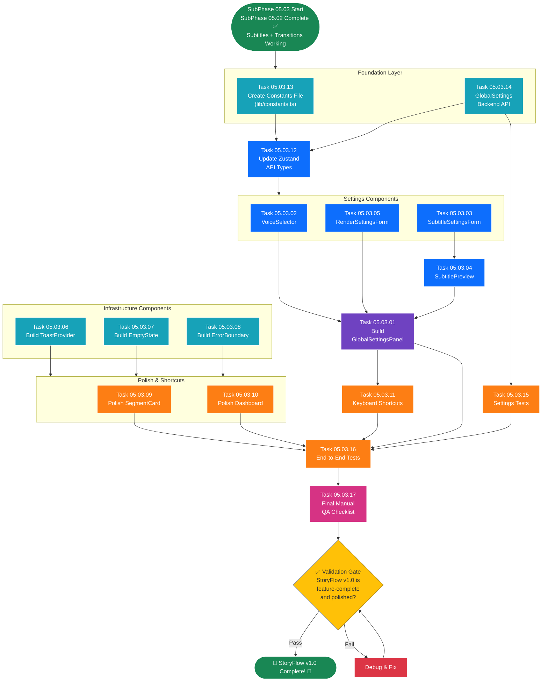

# SubPhase 05.03 — Final UI Polish & Testing

## Layer 2 Overview Document

---

| **Field**                | **Value**                                                                                                    |
| ------------------------ | ------------------------------------------------------------------------------------------------------------ |
| **Sub-Phase**            | 05.03 — Final UI Polish & Testing                                                                            |
| **Phase**                | Phase 05 — The Polish                                                                                        |
| **Layer**                | Layer 2 (Sub-Phase Overview)                                                                                 |
| **Status**               | Not Started                                                                                                  |
| **Parent Document**      | [Phase_05_Overview.md](../Phase_05_Overview.md) (Layer 1)                                                    |
| **Previous Sub-Phase**   | [SubPhase_05_02_Overview.md](../SubPhase_05_02_Transitions_Effects/SubPhase_05_02_Overview.md) (Layer 2)      |
| **Next Sub-Phase**       | None — SubPhase 05.03 is the final sub-phase of StoryFlow v1.0                                              |
| **Dependencies**         | SubPhase 05.02 complete (render pipeline produces MP4 with subtitles + crossfade transitions)                |
| **Estimated Task Docs**  | 17                                                                                                           |

---

## Table of Contents

- [SubPhase 05.03 — Final UI Polish \& Testing](#subphase-0503--final-ui-polish--testing)
  - [Layer 2 Overview Document](#layer-2-overview-document)
  - [Table of Contents](#table-of-contents)
  - [1. Objective](#1-objective)
    - [What SubPhase 05.03 Delivers](#what-subphase-0503-delivers)
    - [What SubPhase 05.03 Does NOT Deliver](#what-subphase-0503-does-not-deliver)
  - [2. Scope](#2-scope)
    - [2.1 In Scope](#21-in-scope)
    - [2.2 Out of Scope](#22-out-of-scope)
  - [3. Technical Context](#3-technical-context)
    - [3.1 Prerequisites](#31-prerequisites)
    - [3.2 Technology Specs](#32-technology-specs)
    - [3.3 Key Code Samples \& Patterns](#33-key-code-samples--patterns)
  - [4. Task List](#4-task-list)
  - [5. Task Details](#5-task-details)
    - [5.1 Task 05.03.01 — Build GlobalSettingsPanel](#51-task-050301--build-globalsettingspanel)
    - [5.2 Task 05.03.02 — Build VoiceSelector](#52-task-050302--build-voiceselector)
    - [5.3 Task 05.03.03 — Build SubtitleSettingsForm](#53-task-050303--build-subtitlesettingsform)
    - [5.4 Task 05.03.04 — Build SubtitlePreview](#54-task-050304--build-subtitlepreview)
    - [5.5 Task 05.03.05 — Build RenderSettingsForm](#55-task-050305--build-rendersettingsform)
    - [5.6 Task 05.03.06 — Build ToastProvider Notifications](#56-task-050306--build-toastprovider-notifications)
    - [5.7 Task 05.03.07 — Build EmptyState Component](#57-task-050307--build-emptystate-component)
    - [5.8 Task 05.03.08 — Build ErrorBoundary](#58-task-050308--build-errorboundary)
    - [5.9 Task 05.03.09 — Polish SegmentCard](#59-task-050309--polish-segmentcard)
    - [5.10 Task 05.03.10 — Polish Dashboard](#510-task-050310--polish-dashboard)
    - [5.11 Task 05.03.11 — Implement Keyboard Shortcuts](#511-task-050311--implement-keyboard-shortcuts)
    - [5.12 Task 05.03.12 — Update Zustand API Types](#512-task-050312--update-zustand-api-types)
    - [5.13 Task 05.03.13 — Create Constants File](#513-task-050313--create-constants-file)
    - [5.14 Task 05.03.14 — GlobalSettings Backend API](#514-task-050314--globalsettings-backend-api)
    - [5.15 Task 05.03.15 — Write Settings Tests](#515-task-050315--write-settings-tests)
    - [5.16 Task 05.03.16 — Write End To End Tests](#516-task-050316--write-end-to-end-tests)
    - [5.17 Task 05.03.17 — Final Manual QA Checklist](#517-task-050317--final-manual-qa-checklist)
  - [6. Execution Order](#6-execution-order)
    - [6.1 Dependency Chain](#61-dependency-chain)
    - [6.2 Recommended Sequence](#62-recommended-sequence)
    - [6.3 Execution Order Flowchart](#63-execution-order-flowchart)
    - [6.4 Parallel Work Opportunities](#64-parallel-work-opportunities)
  - [7. Files Created \& Modified](#7-files-created--modified)
  - [8. Validation Criteria](#8-validation-criteria)
    - [GlobalSettings Panel](#globalsettings-panel)
    - [Voice Selection](#voice-selection)
    - [Subtitle Settings](#subtitle-settings)
    - [Render Settings](#render-settings)
    - [Toast Notifications](#toast-notifications)
    - [Empty States](#empty-states)
    - [Error Boundary](#error-boundary)
    - [UI Polish](#ui-polish)
    - [Keyboard Shortcuts](#keyboard-shortcuts)
    - [Backend API](#backend-api)
    - [Code Quality](#code-quality)
    - [End-to-End](#end-to-end)
  - [9. Constraints](#9-constraints)
  - [10. Notes \& Gotchas](#10-notes--gotchas)
    - [GlobalSettings Singleton Pattern](#globalsettings-singleton-pattern)
    - [Toast Library Choice: Sonner vs. Shadcn Toast](#toast-library-choice-sonner-vs-shadcn-toast)
    - [Font Loading in SubtitlePreview](#font-loading-in-subtitlepreview)
    - [Keyboard Shortcut Conflicts](#keyboard-shortcut-conflicts)
    - [Shadcn/UI Component Installation](#shadcnui-component-installation)
    - [React 19 Error Boundary Nuance](#react-19-error-boundary-nuance)
    - [Auto-Save Debouncing](#auto-save-debouncing)
    - [Render Pipeline After Phase 05](#render-pipeline-after-phase-05)
  - [11. Cross-References](#11-cross-references)
    - [Parent \& Ancestry](#parent--ancestry)
    - [Previous Sub-Phase](#previous-sub-phase)
    - [Next Sub-Phase](#next-sub-phase)
    - [Cross-Phase References](#cross-phase-references)
    - [Child Documents (Layer 3)](#child-documents-layer-3)

---

## 1. Objective

SubPhase 05.03 is the **final sub-phase** of the entire StoryFlow v1.0 project. It delivers the **GlobalSettings editing UI**, comprehensive **toast notifications**, **empty states**, an **error boundary**, UI polish across all existing pages and components, **keyboard shortcuts**, and thorough **end-to-end testing**. This sub-phase transforms the functional application into a polished, production-quality product.

### What SubPhase 05.03 Delivers

1. **GlobalSettingsPanel (`components/GlobalSettingsPanel.tsx`)** — A collapsible sidebar panel on the project detail page containing Voice, Render, and Subtitle settings sections. All changes auto-save via `PATCH /api/settings/` with toast confirmation.

2. **VoiceSelector (`components/VoiceSelector.tsx`)** — A dropdown populated from `GET /api/settings/voices/` showing all available Kokoro voice IDs. Changing the voice displays a warning: "Voice changed. Re-generate audio to apply."

3. **SubtitleSettingsForm (`components/SubtitleSettingsForm.tsx`)** — Font selector/uploader (accepts `.ttf`/`.otf` files via `POST /api/settings/font/upload/`) and a hex color picker for `subtitle_color`.

4. **SubtitlePreview (`components/SubtitlePreview.tsx`)** — A live preview box showing sample text styled with the current subtitle font and color settings, updating in real-time as the user adjusts settings.

5. **RenderSettingsForm (`components/RenderSettingsForm.tsx`)** — Zoom intensity slider (range 1.0–2.0) that persists to `GlobalSettings.zoom_intensity`, plus read-only resolution (1920×1080) and framerate (30fps) displays.

6. **ToastProvider (`components/ToastProvider.tsx`)** — Global toast notification system using Shadcn/UI Toast or Sonner, replacing all `alert()` and `console.log()` user-facing messages with polished notifications (success, error, warning, info).

7. **EmptyState (`components/EmptyState.tsx`)** — Reusable empty state component for: no projects, no segments, no audio generated, no video rendered. Shows icon + title + description + optional CTA button.

8. **ErrorBoundary (`components/ErrorBoundary.tsx`)** — React error boundary that catches unhandled JavaScript errors and displays a friendly fallback page with a "Reload" button.

9. **Polished SegmentCard** — "Show Subtitles" toggle for word-chunk preview, improved loading states, inline error messages, smooth CSS transitions.

10. **Polished Dashboard** — Card grid layout with cover image thumbnails, sort by date/title, search/filter bar, loading skeletons, polished empty state.

11. **Keyboard Shortcuts** — `Ctrl+Enter` (Generate All Audio), `Ctrl+Shift+Enter` (Export Video), `Escape` (close modals), `Ctrl+S` (save edits), `?` (show help).

12. **Updated Zustand Store (`lib/stores.ts`)** — Extended with `globalSettings` state, `fetchSettings()`, `updateSettings()`, `uploadFont()`.

13. **Constants File (`lib/constants.ts`)** — `AVAILABLE_VOICES`, `DEFAULT_SETTINGS`, `VALIDATION_RULES`, `TOAST_MESSAGES`, `KEYBOARD_SHORTCUTS`.

14. **GlobalSettings Backend API** — `GET /api/settings/`, `PATCH /api/settings/`, `GET /api/settings/voices/`, `POST /api/settings/font/upload/` endpoints with serializer validation.

15. **Settings Tests** — Backend tests for all GlobalSettings API endpoints: CRUD operations, validation, font upload, voice listing.

16. **End-to-End Tests** — Complete workflow tests: create project → import → images → audio → settings → render → verify. Error path tests. Frontend component tests.

17. **Final Manual QA Checklist** — A comprehensive checklist document that the implementer walks through manually, verifying every feature, edge case, and quality standard.

### What SubPhase 05.03 Does NOT Deliver

> **Critical:** Phase 05 is the **FINAL** phase. There is no Phase 06. The following are permanently out of scope for StoryFlow v1.0:

- ❌ Per-segment subtitle customization — uniform styling from GlobalSettings only
- ❌ Custom transition types (dissolve, wipe, slide) — crossfade only
- ❌ User-configurable resolution or framerate — always 1920×1080 at 30fps
- ❌ Background music mixing
- ❌ Real-time video preview during editing
- ❌ Multi-project batch rendering
- ❌ Template/theme system
- ❌ Cloud deployment or multi-user authentication
- ❌ SRT/VTT subtitle export
- ❌ Advanced NLP-based word chunking

At the conclusion of SubPhase 05.03, **StoryFlow v1.0 is feature-complete and production-quality**. The complete workflow — from story import to polished video export — works end-to-end with professional-quality output.

---

## 2. Scope

### 2.1 In Scope

| Area                               | Details                                                                            |
| ---------------------------------- | ---------------------------------------------------------------------------------- |
| **GlobalSettings Panel**           | Collapsible sidebar with voice, render, and subtitle sections                      |
| **Voice Selection**                | Dropdown from available Kokoro voices, warning on change                            |
| **Subtitle Settings**              | Font upload + color picker + live preview                                           |
| **Render Settings**                | Zoom slider + read-only resolution/framerate                                       |
| **Toast Notifications**            | Global toast system replacing alert()/console.log()                                 |
| **Empty States**                   | Reusable component for all empty list/section scenarios                             |
| **Error Boundary**                 | React error boundary with friendly fallback page                                    |
| **SegmentCard Polish**             | Subtitle toggle, loading states, animations, error display                          |
| **Dashboard Polish**               | Card grid, sort/filter, search bar, skeletons                                      |
| **Keyboard Shortcuts**             | Ctrl+Enter, Ctrl+Shift+Enter, Escape, Ctrl+S, ?                                   |
| **Zustand Extension**              | GlobalSettings state, fetch/update/uploadFont actions                               |
| **Frontend API Extension**         | getSettings, updateSettings, getVoices, uploadFont                                  |
| **TypeScript Types**               | GlobalSettings, Voice interfaces                                                    |
| **Constants File**                 | Voices, defaults, validation rules, toast messages, shortcuts                       |
| **Backend Settings API**           | GET/PATCH /api/settings/, GET /api/settings/voices/, POST /api/settings/font/upload/ |
| **Backend Serializers**            | GlobalSettingsSerializer with field validation                                       |
| **Settings Tests**                 | API endpoint tests for all settings operations                                       |
| **End-to-End Tests**               | Full workflow tests, error paths, component tests                                    |
| **QA Checklist**                   | Manual verification document for final sign-off                                      |

### 2.2 Out of Scope

| Area                               | Reason                                                                             |
| ---------------------------------- | ---------------------------------------------------------------------------------- |
| New model definitions              | Models frozen from Phase 01 — no migrations                                         |
| Per-segment settings               | Out of v1.0 scope — uniform global settings only                                    |
| User authentication                | Permanent constraint — local single-user app                                         |
| Configurable resolution/fps        | Out of v1.0 scope — always 1920×1080 at 30fps                                       |
| Background music                   | Out of v1.0 scope                                                                    |
| Real-time video preview            | Out of v1.0 scope                                                                    |
| Advanced analytics/metrics         | Out of v1.0 scope                                                                    |
| Internationalization (i18n)        | Out of v1.0 scope — English only                                                     |

---

## 3. Technical Context

### 3.1 Prerequisites

Before starting SubPhase 05.03, the following must be in place:

| Prerequisite                                                            | Source                        | Verification                                                            |
| ----------------------------------------------------------------------- | ----------------------------- | ----------------------------------------------------------------------- |
| SubPhase 05.02 complete — crossfade transitions working                 | SubPhase 05.02                | Rendered MP4 has subtitles + smooth crossfade transitions                |
| SubPhase 05.01 complete — subtitle engine working                       | SubPhase 05.01                | `create_subtitles_for_segment()` produces TextClip overlays              |
| Phase 04 complete — full render pipeline                                | Phase 04                      | `render_project()` → MP4 with Ken Burns + subtitles + transitions        |
| Phase 03 complete — TTS engine working                                  | Phase 03                      | Audio generation + playback functional                                   |
| Phase 02 complete — story import + timeline editor                      | Phase 02                      | Import, segment editing, image upload, frontend state                    |
| Phase 01 complete — data models + project structure                     | Phase 01                      | Django models, DRF, Next.js skeleton, Zustand baseline                   |
| `GlobalSettings` model exists with all fields                           | Phase 01                      | `default_voice_id`, `tts_speed`, `zoom_intensity`, `subtitle_font`, `subtitle_color` |
| Shadcn/UI components installed                                          | Phase 01–04                   | Button, Input, Card, Dialog, etc. already available                      |
| **New Shadcn/UI components needed**: Toast, Slider, Select              | Phase 05 setup                | Install before starting: `npx shadcn-ui@latest add toast slider select`  |

### 3.2 Technology Specs

| Technology       | Version / Spec           | Usage in This Sub-Phase                                                         |
| ---------------- | ------------------------ | ------------------------------------------------------------------------------- |
| **Next.js**      | 16+ (App Router)         | Page layouts, settings sidebar, component composition                           |
| **TypeScript**   | Strict mode              | Types for GlobalSettings, Voice, validation rules                               |
| **Tailwind CSS** | 4.x                      | Styling, animations, transitions, responsive layout                             |
| **Shadcn/UI**    | Latest                   | Toast, Slider, Select, Card, Dialog, Input, Button                              |
| **Zustand**      | Latest                   | GlobalSettings state management                                                 |
| **Axios**        | Latest                   | API calls for settings CRUD, font upload, voice listing                          |
| **Django**       | 5.x + DRF                | GlobalSettings ViewSet, serializer validation, font upload handling              |
| **Sonner**       | Latest (optional)         | Alternative toast library — lighter than Shadcn Toast, better UX                |
| **React**        | 19+                       | Error boundaries, hooks (useEffect, useCallback, useMemo)                       |

### 3.3 Key Code Samples & Patterns

**Pattern 1: GlobalSettingsPanel Component Structure**

```tsx
// components/GlobalSettingsPanel.tsx
"use client";

import { useState, useEffect } from "react";
import { useSettingsStore } from "@/lib/stores";
import { VoiceSelector } from "./VoiceSelector";
import { SubtitleSettingsForm } from "./SubtitleSettingsForm";
import { SubtitlePreview } from "./SubtitlePreview";
import { RenderSettingsForm } from "./RenderSettingsForm";
import { ChevronDown, ChevronRight, Settings } from "lucide-react";

export function GlobalSettingsPanel() {
  const { globalSettings, isSettingsLoading, fetchSettings, updateSettings } =
    useSettingsStore();
  const [isCollapsed, setIsCollapsed] = useState(false);

  useEffect(() => {
    fetchSettings();
  }, [fetchSettings]);

  if (isSettingsLoading) {
    return <SettingsSkeleton />;
  }

  return (
    <aside className="w-64 border-r bg-background p-4 space-y-6 overflow-y-auto">
      <div
        className="flex items-center justify-between cursor-pointer"
        onClick={() => setIsCollapsed(!isCollapsed)}
      >
        <h2 className="text-lg font-semibold flex items-center gap-2">
          <Settings className="h-5 w-5" />
          Settings
        </h2>
        {isCollapsed ? <ChevronRight /> : <ChevronDown />}
      </div>

      {!isCollapsed && globalSettings && (
        <>
          <VoiceSelector
            value={globalSettings.default_voice_id}
            speed={globalSettings.tts_speed}
            onChange={updateSettings}
          />
          <RenderSettingsForm
            zoomIntensity={globalSettings.zoom_intensity}
            onChange={updateSettings}
          />
          <SubtitleSettingsForm
            font={globalSettings.subtitle_font}
            color={globalSettings.subtitle_color}
            onChange={updateSettings}
          />
          <SubtitlePreview
            font={globalSettings.subtitle_font}
            color={globalSettings.subtitle_color}
          />
        </>
      )}
    </aside>
  );
}
```

**Pattern 2: Auto-Save with Toast Notification**

```tsx
// Inside a settings form component:
import { toast } from "sonner"; // or from "@/components/ui/use-toast"

const handleSettingChange = async (key: string, value: any) => {
  try {
    await updateSettings({ [key]: value });
    toast.success("Settings saved");
  } catch (error: any) {
    toast.error(error.response?.data?.detail || "Failed to save settings");
  }
};
```

**Pattern 3: Backend GlobalSettings ViewSet**

```python
# api/views.py
from rest_framework import viewsets, status
from rest_framework.decorators import action
from rest_framework.parsers import MultiPartParser
from rest_framework.response import Response
from .models import GlobalSettings
from .serializers import GlobalSettingsSerializer

class GlobalSettingsViewSet(viewsets.ViewSet):
    """
    GET  /api/settings/         → Retrieve current settings
    PATCH /api/settings/        → Update settings (partial)
    GET  /api/settings/voices/  → List available voices
    POST /api/settings/font/upload/ → Upload custom font
    """
    
    def retrieve(self, request):
        settings = GlobalSettings.objects.first()
        if not settings:
            settings = GlobalSettings.objects.create()
        serializer = GlobalSettingsSerializer(settings)
        return Response(serializer.data)
    
    def partial_update(self, request):
        settings = GlobalSettings.objects.first()
        if not settings:
            settings = GlobalSettings.objects.create()
        serializer = GlobalSettingsSerializer(settings, data=request.data, partial=True)
        serializer.is_valid(raise_exception=True)
        serializer.save()
        return Response(serializer.data)
    
    @action(detail=False, methods=["get"])
    def voices(self, request):
        # Return available Kokoro voice configurations
        voices = get_available_voices()  # Scans Kokoro voice files
        return Response({"voices": voices})
    
    @action(detail=False, methods=["post"], parser_classes=[MultiPartParser])
    def upload_font(self, request):
        font_file = request.FILES.get("font_file")
        if not font_file:
            return Response(
                {"detail": "No font file provided"},
                status=status.HTTP_400_BAD_REQUEST,
            )
        # Validate and save font file
        ...
```

**Pattern 4: GlobalSettings Serializer with Validation**

```python
# api/serializers.py
import re
from rest_framework import serializers
from .models import GlobalSettings

class GlobalSettingsSerializer(serializers.ModelSerializer):
    class Meta:
        model = GlobalSettings
        fields = [
            "default_voice_id",
            "tts_speed",
            "zoom_intensity",
            "subtitle_font",
            "subtitle_color",
        ]
    
    def validate_tts_speed(self, value):
        if not (0.5 <= value <= 2.0):
            raise serializers.ValidationError("TTS speed must be between 0.5 and 2.0")
        return value
    
    def validate_zoom_intensity(self, value):
        if not (1.0 <= value <= 2.0):
            raise serializers.ValidationError("Zoom intensity must be between 1.0 and 2.0")
        return value
    
    def validate_subtitle_color(self, value):
        if not re.match(r'^#([0-9a-fA-F]{3}|[0-9a-fA-F]{6})$', value):
            raise serializers.ValidationError("Subtitle color must be a valid hex color (e.g., #FFFFFF)")
        return value.upper()
```

**Pattern 5: Toast Provider Setup**

```tsx
// components/ToastProvider.tsx (using Sonner)
"use client";

import { Toaster } from "sonner";

export function ToastProvider() {
  return (
    <Toaster
      position="bottom-right"
      richColors
      closeButton
      duration={4000}
      toastOptions={{
        className: "font-sans",
      }}
    />
  );
}

// In app/layout.tsx:
import { ToastProvider } from "@/components/ToastProvider";

export default function RootLayout({ children }) {
  return (
    <html lang="en">
      <body>
        {children}
        <ToastProvider />
      </body>
    </html>
  );
}
```

**Pattern 6: EmptyState Component**

```tsx
// components/EmptyState.tsx
import { LucideIcon } from "lucide-react";
import { Button } from "@/components/ui/button";

interface EmptyStateProps {
  icon: LucideIcon;
  title: string;
  description: string;
  actionLabel?: string;
  onAction?: () => void;
}

export function EmptyState({
  icon: Icon,
  title,
  description,
  actionLabel,
  onAction,
}: EmptyStateProps) {
  return (
    <div className="flex flex-col items-center justify-center py-16 text-center">
      <Icon className="h-12 w-12 text-muted-foreground mb-4" />
      <h3 className="text-lg font-semibold mb-2">{title}</h3>
      <p className="text-muted-foreground mb-6 max-w-md">{description}</p>
      {actionLabel && onAction && (
        <Button onClick={onAction}>{actionLabel}</Button>
      )}
    </div>
  );
}
```

**Pattern 7: Error Boundary**

```tsx
// components/ErrorBoundary.tsx
"use client";

import { Component, ReactNode } from "react";
import { Button } from "@/components/ui/button";
import { AlertTriangle } from "lucide-react";

interface Props {
  children: ReactNode;
}

interface State {
  hasError: boolean;
  error: Error | null;
}

export class ErrorBoundary extends Component<Props, State> {
  state: State = { hasError: false, error: null };

  static getDerivedStateFromError(error: Error): State {
    return { hasError: true, error };
  }

  componentDidCatch(error: Error, info: React.ErrorInfo) {
    console.error("ErrorBoundary caught an error:", error, info);
  }

  render() {
    if (this.state.hasError) {
      return (
        <div className="flex flex-col items-center justify-center min-h-screen">
          <AlertTriangle className="h-16 w-16 text-destructive mb-4" />
          <h1 className="text-2xl font-bold mb-2">Something went wrong</h1>
          <p className="text-muted-foreground mb-6">
            An unexpected error occurred. Please try reloading the page.
          </p>
          <Button onClick={() => window.location.reload()}>Reload Page</Button>
        </div>
      );
    }
    return this.props.children;
  }
}
```

**Pattern 8: Keyboard Shortcuts Hook**

```tsx
// hooks/useKeyboardShortcuts.ts
"use client";

import { useEffect, useCallback } from "react";

interface Shortcut {
  key: string;
  ctrlKey?: boolean;
  shiftKey?: boolean;
  handler: () => void;
  description: string;
}

export function useKeyboardShortcuts(shortcuts: Shortcut[]) {
  const handleKeyDown = useCallback(
    (e: KeyboardEvent) => {
      for (const shortcut of shortcuts) {
        if (
          e.key === shortcut.key &&
          !!e.ctrlKey === !!shortcut.ctrlKey &&
          !!e.shiftKey === !!shortcut.shiftKey
        ) {
          e.preventDefault();
          shortcut.handler();
          return;
        }
      }
    },
    [shortcuts]
  );

  useEffect(() => {
    window.addEventListener("keydown", handleKeyDown);
    return () => window.removeEventListener("keydown", handleKeyDown);
  }, [handleKeyDown]);
}
```

---

## 4. Task List

| Task ID     | Task Name                              | Layer 3 Document                                                     | Est. Complexity |
| ----------- | -------------------------------------- | -------------------------------------------------------------------- | --------------- |
| 05.03.01    | Build GlobalSettingsPanel              | `Task_05_03_01_Build_GlobalSettingsPanel.md`                         | High            |
| 05.03.02    | Build VoiceSelector                    | `Task_05_03_02_Build_VoiceSelector.md`                               | Medium          |
| 05.03.03    | Build SubtitleSettingsForm             | `Task_05_03_03_Build_SubtitleSettingsForm.md`                        | High            |
| 05.03.04    | Build SubtitlePreview                  | `Task_05_03_04_Build_SubtitlePreview.md`                             | Medium          |
| 05.03.05    | Build RenderSettingsForm               | `Task_05_03_05_Build_RenderSettingsForm.md`                          | Low             |
| 05.03.06    | Build ToastProvider Notifications      | `Task_05_03_06_Build_ToastProvider_Notifications.md`                 | Medium          |
| 05.03.07    | Build EmptyState Component             | `Task_05_03_07_Build_EmptyState_Component.md`                        | Low             |
| 05.03.08    | Build ErrorBoundary                    | `Task_05_03_08_Build_ErrorBoundary.md`                               | Low             |
| 05.03.09    | Polish SegmentCard                     | `Task_05_03_09_Polish_SegmentCard.md`                                | Medium          |
| 05.03.10    | Polish Dashboard                       | `Task_05_03_10_Polish_Dashboard.md`                                  | Medium          |
| 05.03.11    | Implement Keyboard Shortcuts           | `Task_05_03_11_Implement_Keyboard_Shortcuts.md`                      | Medium          |
| 05.03.12    | Update Zustand API Types               | `Task_05_03_12_Update_Zustand_API_Types.md`                          | Medium          |
| 05.03.13    | Create Constants File                  | `Task_05_03_13_Create_Constants_File.md`                             | Low             |
| 05.03.14    | GlobalSettings Backend API             | `Task_05_03_14_GlobalSettings_Backend_API.md`                        | High            |
| 05.03.15    | Write Settings Tests                   | `Task_05_03_15_Write_Settings_Tests.md`                              | Medium          |
| 05.03.16    | Write End To End Tests                 | `Task_05_03_16_Write_End_To_End_Tests.md`                            | High            |
| 05.03.17    | Final Manual QA Checklist              | `Task_05_03_17_Final_Manual_QA_Checklist.md`                         | Low             |

---

## 5. Task Details

### 5.1 Task 05.03.01 — Build GlobalSettingsPanel

**Objective:** Build the collapsible settings panel that appears in the project detail page's left sidebar, composing the VoiceSelector, RenderSettingsForm, SubtitleSettingsForm, and SubtitlePreview sub-components.

**File:** `frontend/components/GlobalSettingsPanel.tsx` (NEW)

**Steps:**

1. Create the component with a collapsible header (click to expand/collapse).
2. Fetch `globalSettings` from the Zustand store on mount via `fetchSettings()`.
3. Show a loading skeleton while settings are being fetched.
4. Render three sections in order:
   - **Voice Settings:** VoiceSelector + TTS Speed slider.
   - **Render Settings:** RenderSettingsForm (zoom, resolution display, framerate display).
   - **Subtitle Settings:** SubtitleSettingsForm + SubtitlePreview.
5. All changes auto-save via `updateSettings()` → `PATCH /api/settings/`.
6. Display success toast on save, error toast on failure.
7. Style as a sidebar: `w-64` fixed width, `border-r`, `overflow-y-auto`.
8. Integrate into the project detail page layout: `app/projects/[id]/page.tsx` must render `GlobalSettingsPanel` alongside the timeline editor.

**Key Details:**
- The panel acts as a **container/composition** component — it renders child components and passes settings data + update handlers down.
- TTS Speed slider (range 0.5–2.0, step 0.1) is rendered directly in this panel, not in a separate component (it's simple enough).
- The collapsible behavior preserves state across navigation (use local state or localStorage).
- The panel should be responsive: on very narrow screens, consider hiding the sidebar behind a toggle button.

**Files Touched:**
- `frontend/components/GlobalSettingsPanel.tsx` — NEW
- `frontend/app/projects/[id]/page.tsx` — Modified (add sidebar layout)

---

### 5.2 Task 05.03.02 — Build VoiceSelector

**Objective:** Build a dropdown component that shows all available Kokoro voice IDs, allowing the user to select the default voice for TTS generation.

**File:** `frontend/components/VoiceSelector.tsx` (NEW)

**Steps:**

1. Fetch available voices from `GET /api/settings/voices/` on mount (or use Zustand store).
2. Render a Shadcn/UI `Select` dropdown with all voices.
3. Display voice names in a user-friendly format: `"Bella (Female)"`, `"Adam (Male)"`.
4. Highlight the currently selected voice.
5. On selection change:
   - Call `updateSettings({ default_voice_id: selectedVoiceId })`.
   - Show a **warning toast**: `"Voice changed. Re-generate audio to hear the new voice."`.
   - This warning is important because changing the voice does NOT automatically re-generate existing audio segments.
6. Handle loading state: show a skeleton or disabled dropdown while voices are loading.
7. Handle error state: if the API call fails, fall back to a hardcoded voice list from `constants.ts`.

**Key Details:**
- The voice list comes from the backend, which scans available Kokoro voice configurations.
- The warning toast on voice change is critical UX — without it, users may expect audio to update immediately.
- The `default_voice_id` is stored as a string (e.g., `"af_bella"`) in GlobalSettings.
- The component receives `value` (current voice ID), `onChange` (update handler) as props.
- TTS speed is NOT in this component — it's in the parent GlobalSettingsPanel as a simple slider.

**Files Touched:**
- `frontend/components/VoiceSelector.tsx` — NEW

---

### 5.3 Task 05.03.03 — Build SubtitleSettingsForm

**Objective:** Build a form component for subtitle font selection/upload and subtitle color picking.

**File:** `frontend/components/SubtitleSettingsForm.tsx` (NEW)

**Steps:**

1. **Font Selector:**
   - Show the current font name (parsed from the file path: `/fonts/custom.ttf` → `"custom"`).
   - "Upload Font" button using a hidden `<input type="file" accept=".ttf,.otf">`.
   - On file selection:
     - Upload via `POST /api/settings/font/upload/` with `FormData`.
     - On success: update settings with the new font path, show success toast.
     - On failure: show error toast with the validation message.
   - Show "Default (Roboto Bold)" label when using the bundled default font.

2. **Color Picker:**
   - Show the current subtitle color as a color swatch (small colored square) + hex value.
   - On click: open a hex color input field.
   - Validate input: must match `#RGB` or `#RRGGBB` pattern.
   - On change: call `updateSettings({ subtitle_color: newColor })`.
   - Alternatively, use an `<input type="color">` for native color picker.

3. Style the form with clear section labels: "📝 Subtitles" header, "Font" label, "Color" label.

4. Show loading states during font upload (upload progress or spinner).

**Key Details:**
- Font upload sends a `multipart/form-data` POST request — Axios handles this with `FormData`.
- The color picker should debounce updates (e.g., 300ms) to avoid excessive API calls while the user is adjusting.
- The hex color validation mirrors the backend validation: `^#([0-9a-fA-F]{3}|[0-9a-fA-F]{6})$`.
- The component receives `font` (current font path), `color` (current hex color), `onChange` (update handler) as props.

**Files Touched:**
- `frontend/components/SubtitleSettingsForm.tsx` — NEW

---

### 5.4 Task 05.03.04 — Build SubtitlePreview

**Objective:** Build a live preview box that shows sample subtitle text styled with the current font and color settings.

**File:** `frontend/components/SubtitlePreview.tsx` (NEW)

**Steps:**

1. Render a dark gray box (simulating a video background: `bg-gray-800` or `bg-zinc-900`).
2. Inside the box, show sample text: `"The quick brown fox jumps over"`.
3. Style the text to match the actual subtitle rendering:
   - Font: load the `.ttf` file using CSS `@font-face` (or approximate with a web-safe font).
   - Color: use the `subtitle_color` value directly.
   - Text shadow: `2px 2px 0 #000, -2px -2px 0 #000, 2px -2px 0 #000, -2px 2px 0 #000` (simulates the stroke effect).
   - Font size: proportional to the preview box size (smaller than actual subtitle).
   - Text align: center.
   - Position: bottom of the preview box (with padding).
4. Update the preview in real-time as the user changes font or color in SubtitleSettingsForm.
5. Keep the preview compact: approximately 200×120px.

**Key Details:**
- Loading a `.ttf` file from the server into CSS `@font-face` requires:
  ```css
  @font-face {
    font-family: 'SubtitlePreviewFont';
    src: url('/api/settings/font/preview?path=/fonts/custom.ttf') format('truetype');
  }
  ```
  OR simply approximate using a generic bold sans-serif font (since exact rendering fidelity is not critical for a preview).
- The text shadow CSS simulates the MoviePy TextClip stroke effect (not pixel-perfect, but close enough for preview purposes).
- The preview is informational — it shows an approximation, not a frame-accurate render.
- The component receives `font` and `color` as props and re-renders when they change.

**Files Touched:**
- `frontend/components/SubtitlePreview.tsx` — NEW

---

### 5.5 Task 05.03.05 — Build RenderSettingsForm

**Objective:** Build a form component with the zoom intensity slider and read-only resolution/framerate displays.

**File:** `frontend/components/RenderSettingsForm.tsx` (NEW)

**Steps:**

1. **Zoom Intensity Slider:**
   - Shadcn/UI `Slider` component.
   - Range: 1.0 to 2.0, step: 0.1.
   - Show current value label: `"1.3x"`.
   - On change: debounce (300ms), then `updateSettings({ zoom_intensity: value })`.
   - Show success toast on save.

2. **Resolution Display (read-only):**
   - Static text: `"1920 × 1080 (1080p)"`.
   - Grayed out / muted color to indicate it's not editable.
   - Optional: small info icon with tooltip: `"Resolution is not configurable in v1.0"`.

3. **Framerate Display (read-only):**
   - Static text: `"30 fps"`.
   - Same styling as resolution — grayed out, non-interactive.

4. Section header: "🎬 Render Settings" or a camera icon.

**Key Details:**
- The zoom intensity slider is the only interactive element. Resolution and framerate are purely informational.
- Debounce the slider to avoid sending API requests for every pixel of slider movement.
- The slider value should reflect the current GlobalSettings value on load.
- The component receives `zoomIntensity` (current value) and `onChange` (update handler) as props.

**Files Touched:**
- `frontend/components/RenderSettingsForm.tsx` — NEW

---

### 5.6 Task 05.03.06 — Build ToastProvider Notifications

**Objective:** Set up a global toast notification system and replace all existing `alert()` and `console.log()` user-facing messages with toast notifications throughout the application.

**File:** `frontend/components/ToastProvider.tsx` (NEW) + multiple existing files modified

**Steps:**

1. Install Sonner (recommended) or use Shadcn/UI Toast:
   ```bash
   npm install sonner
   # OR
   npx shadcn-ui@latest add toast
   ```

2. Create `ToastProvider.tsx`:
   ```tsx
   import { Toaster } from "sonner";
   export function ToastProvider() {
     return <Toaster position="bottom-right" richColors closeButton duration={4000} />;
   }
   ```

3. Add `<ToastProvider />` to `app/layout.tsx` (root layout).

4. Define toast message constants in `lib/constants.ts` (Task 05.03.13):
   ```typescript
   export const TOAST_MESSAGES = {
     SETTINGS_SAVED: "Settings saved successfully",
     AUDIO_COMPLETE: "Audio generation complete",
     RENDER_COMPLETE: "Video rendering complete",
     RENDER_FAILED: "Rendering failed",
     VOICE_CHANGED: "Voice changed. Re-generate audio to apply.",
     SUBTITLES_DISABLED: "Subtitles disabled: ImageMagick not found",
     FONT_UPLOADED: "Font uploaded successfully",
     FONT_UPLOAD_FAILED: "Font upload failed",
     // ... more messages
   };
   ```

5. Audit and replace all user-facing messages:
   - **Find all `alert()` calls** → replace with `toast.error()` or `toast.info()`.
   - **Find all `console.log()` used for user feedback** → replace with `toast.success()` or `toast.info()`.
   - **Key locations:**
     - Audio generation complete/failed → `toast.success` / `toast.error`.
     - Render complete/failed → `toast.success` / `toast.error`.
     - Settings saved → `toast.success`.
     - Import success → `toast.success`.
     - Image upload success/failure → `toast.success` / `toast.error`.
     - Validation errors → `toast.error`.

6. Toast types:
   - ✅ `toast.success(message)` — green, for successful operations.
   - ❌ `toast.error(message)` — red, for errors and failures.
   - ⚠️ `toast.warning(message)` — yellow, for warnings (voice change, ImageMagick missing).
   - ℹ️ `toast.info(message)` — blue, for informational messages (rendering in progress).

**Key Details:**
- Sonner is recommended over Shadcn/UI Toast because it's lighter, has better default styling, and requires less boilerplate.
- Toast position `"bottom-right"` keeps notifications out of the way of the settings sidebar (left) and main content (center).
- The `duration={4000}` auto-dismisses toasts after 4 seconds. `closeButton` allows manual dismissal.
- The audit of existing `alert()` and `console.log()` calls is the bulk of the work — it requires checking every component from Phases 01–04.

**Files Touched:**
- `frontend/components/ToastProvider.tsx` — NEW
- `frontend/app/layout.tsx` — Modified (add ToastProvider)
- Multiple existing components — Modified (replace alert/console.log with toast)

---

### 5.7 Task 05.03.07 — Build EmptyState Component

**Objective:** Build a reusable empty state component and integrate it into all pages/sections that can be empty.

**File:** `frontend/components/EmptyState.tsx` (NEW)

**Steps:**

1. Create a generic `EmptyState` component with props: `icon`, `title`, `description`, `actionLabel?`, `onAction?`.
2. Style: centered vertically, muted icon, readable text, optional CTA button.
3. Integrate into these locations:
   - **Dashboard (no projects):** Icon: FolderPlus. Title: "No projects yet". Description: "Create your first story to get started!" CTA: "+ New Project".
   - **Project Detail (no segments):** Icon: FileText. Title: "No segments". Description: "Import a story to create segments."
   - **Segment (no audio):** Icon: Volume2. Title: "No audio generated". Description: "Click 'Generate Audio' to create narration."
   - **Segment (no image):** Icon: Image. Title: "No image uploaded". Description: "Upload an image for this segment."
   - **Project (no video rendered):** Icon: Video. Title: "No video yet". Description: "Click 'Export Video' to render your story."

4. Each integration replaces the current behavior (typically a blank area or a `<p>No items</p>` text).

**Key Details:**
- The component uses Lucide React icons (already available with Shadcn/UI).
- The CTA button is optional — some empty states just inform without an action.
- Keep the component simple and composable — no internal state, no API calls.
- Use `text-muted-foreground` for description text to maintain visual hierarchy.

**Files Touched:**
- `frontend/components/EmptyState.tsx` — NEW
- Multiple page components — Modified (add EmptyState where appropriate)

---

### 5.8 Task 05.03.08 — Build ErrorBoundary

**Objective:** Build a React error boundary that wraps the application and catches unhandled JavaScript errors.

**File:** `frontend/components/ErrorBoundary.tsx` (NEW)

**Steps:**

1. Create a class component (React error boundaries require class components):
   - `getDerivedStateFromError()` — set error state.
   - `componentDidCatch()` — log error to console.
   - `render()` — show error UI if error, otherwise render children.
2. Error UI: centered layout with warning icon, "Something went wrong" title, brief description, "Reload Page" button.
3. Wrap the main application content in `app/layout.tsx`:
   ```tsx
   <ErrorBoundary>
     {children}
   </ErrorBoundary>
   ```
4. The error boundary should NOT catch:
   - Errors in event handlers (React doesn't catch those in error boundaries).
   - Errors in asynchronous code (promises, setTimeout).
   - These are handled by individual `try/catch` blocks and toast notifications.
5. Optionally: add a "Show Details" toggle that reveals the error message and stack trace for debugging.

**Key Details:**
- React 19 supports error boundaries the same as earlier versions — class components with `getDerivedStateFromError`.
- The error boundary is a safety net — it prevents the entire app from going blank when an unexpected rendering error occurs.
- Logging to `console.error` ensures the error details are available in the browser DevTools.
- The "Reload Page" button calls `window.location.reload()`.

**Files Touched:**
- `frontend/components/ErrorBoundary.tsx` — NEW
- `frontend/app/layout.tsx` — Modified (wrap content with ErrorBoundary)

---

### 5.9 Task 05.03.09 — Polish SegmentCard

**Objective:** Add visual polish and UX improvements to the existing SegmentCard component.

**File:** `frontend/components/SegmentCard.tsx` (MODIFIED)

**Steps:**

1. **Subtitle Preview Toggle:**
   - Add a "Show Subtitles" toggle button (or expand/collapse section).
   - When toggled, show a preview of how the segment's `text_content` will be chunked:
     - Call a client-side chunking preview function (mirrors `chunk_text()` logic from SubPhase 05.01).
     - Display each chunk as a pill/badge: `["The quick brown fox", "jumps over the lazy", "dog near the river"]`.
   - This is informational — users can see how their text will appear in the video.

2. **Improved Loading States:**
   - Image upload: show upload progress bar or spinner overlay on the image.
   - Audio generation: show pulsing animation or spinner where the audio player will appear.
   - Use Tailwind CSS `animate-pulse` for skeleton states.

3. **Better Error Display:**
   - Replace any `alert()` calls with inline error messages below the relevant section.
   - Style errors with `text-destructive` (red text) and a small error icon.
   - Example: "Failed to upload image: File too large" displayed below the image area.

4. **Smooth Animations:**
   - Add `transition-all duration-200` to card state changes.
   - Animate the card border color on hover.
   - Smooth expand/collapse for the subtitle preview section.

5. **Content Truncation:**
   - Truncate long `text_content` to 3 lines with `line-clamp-3` and a "Show More" toggle.
   - Prevents very long segments from stretching the card excessively.

**Key Details:**
- The client-side chunking preview should use a simplified version of the backend `chunk_text()` algorithm. Since it's just for preview, exact parity isn't required — approximate chunking (split every 6 words) is sufficient.
- Loading states should replace the current "empty area" behavior — users should always see visual feedback.
- The card should maintain its width and avoid layout shifts during state transitions.

**Files Touched:**
- `frontend/components/SegmentCard.tsx` — Modified

---

### 5.10 Task 05.03.10 — Polish Dashboard

**Objective:** Improve the project list/dashboard page with better layout, sorting, filtering, and visual polish.

**File:** `frontend/app/page.tsx` or `frontend/app/projects/page.tsx` (MODIFIED) + `frontend/components/ProjectCard.tsx` (MODIFIED)

**Steps:**

1. **Card Grid Layout:**
   - Replace list layout with a responsive card grid: `grid grid-cols-1 md:grid-cols-2 lg:grid-cols-3 gap-4`.
   - Each project card shows: cover image thumbnail (first segment's image or a placeholder), project title, creation date, status badge (DRAFT/PROCESSING/COMPLETED).

2. **Sort Controls:**
   - Dropdown or button group to sort projects by:
     - Created date (newest first) — default.
     - Last modified (most recent first).
     - Title (A–Z).
   - Sort is applied client-side (the full project list is already fetched).

3. **Search/Filter Bar:**
   - Text input above the grid: "Search projects...".
   - Client-side filtering by project title (case-insensitive substring match).
   - Show "No projects match your search" if filter returns empty results.

4. **Loading Skeleton:**
   - While projects are being fetched, show a grid of skeleton cards (`animate-pulse` rectangles).
   - 6 skeleton cards in the grid to fill the viewport.

5. **Polished Empty State:**
   - When no projects exist: use the `EmptyState` component (Task 05.03.07).
   - Icon: FolderPlus, Title: "No projects yet", CTA: "+ Create New Project".

6. **Project Card Polish:**
   - Cover image: show the first segment's image (if available) as a thumbnail.
   - Status badge: colored badge (gray=DRAFT, yellow=PROCESSING, green=COMPLETED, red=FAILED).
   - Date display: "Created 2 days ago" (relative time).
   - Hover effect: slight scale or shadow increase.

**Key Details:**
- Sorting and filtering are client-side to avoid API changes — the project list is small enough to be fully loaded.
- The cover image thumbnail requires the frontend to have access to the first segment's image URL. This may already be available in the project API response.
- Relative time display can use a simple utility function or a library like `date-fns` (if already installed) or native `Intl.RelativeTimeFormat`.
- The search input should debounce filtering (200ms) to avoid re-rendering on every keystroke.

**Files Touched:**
- `frontend/app/page.tsx` or `frontend/app/projects/page.tsx` — Modified
- `frontend/components/ProjectCard.tsx` — Modified (add cover image, status badge, hover effects)

---

### 5.11 Task 05.03.11 — Implement Keyboard Shortcuts

**Objective:** Add keyboard shortcuts for common actions and a help tooltip showing available shortcuts.

**File:** `frontend/hooks/useKeyboardShortcuts.ts` (NEW) + integration in page components

**Steps:**

1. Create a `useKeyboardShortcuts` custom hook (see Pattern 8 in §3.3).
2. Define shortcuts in `constants.ts`:
   ```typescript
   export const KEYBOARD_SHORTCUTS = [
     { key: "Enter", ctrlKey: true, description: "Generate All Audio" },
     { key: "Enter", ctrlKey: true, shiftKey: true, description: "Export Video" },
     { key: "Escape", description: "Close modal/dialog" },
     { key: "s", ctrlKey: true, description: "Save current edits" },
     { key: "?", description: "Show keyboard shortcuts help" },
   ];
   ```

3. Integrate in the project detail page:
   ```tsx
   useKeyboardShortcuts([
     { key: "Enter", ctrlKey: true, handler: handleGenerateAudio, description: "Generate Audio" },
     { key: "Enter", ctrlKey: true, shiftKey: true, handler: handleExportVideo, description: "Export Video" },
     { key: "Escape", handler: closeModal, description: "Close" },
     { key: "s", ctrlKey: true, handler: handleSave, description: "Save" },
     { key: "?", handler: () => setShowShortcuts(true), description: "Help" },
   ]);
   ```

4. Build a keyboard shortcuts help dialog:
   - Triggered by pressing `?`.
   - Shows a modal/dialog listing all available shortcuts.
   - Each shortcut displayed as: `Ctrl + Enter` — "Generate All Audio".
   - Style keyboard keys with `<kbd>` elements and appropriate CSS.

5. Prevent default browser behavior for overridden shortcuts:
   - `Ctrl+S` normally triggers "Save Page" in the browser — `e.preventDefault()` overrides this.
   - `Ctrl+Enter` typically submits forms — override this too.
   - Only prevent defaults when the user is on the project detail page (not during text editing in inputs).

**Key Details:**
- Shortcuts should NOT fire when the user is typing in an input or textarea. Check `document.activeElement` to avoid interference.
- The hook should be cleanup-friendly: remove event listeners on unmount.
- The help dialog uses the same shortcut definitions from `constants.ts` — single source of truth.
- `Ctrl+S` auto-save is "save current segment edits" — if the user has edited text_content, it triggers a PATCH to save changes.

**Files Touched:**
- `frontend/hooks/useKeyboardShortcuts.ts` — NEW
- `frontend/app/projects/[id]/page.tsx` — Modified (integrate shortcuts)
- `frontend/components/KeyboardShortcutsDialog.tsx` — NEW (help dialog)

---

### 5.12 Task 05.03.12 — Update Zustand API Types

**Objective:** Extend the Zustand store, frontend API client, and TypeScript types to support GlobalSettings CRUD operations.

**File:** `frontend/lib/stores.ts`, `frontend/lib/api.ts`, `frontend/lib/types.ts` (all MODIFIED)

**Steps:**

1. **Update TypeScript types** (`lib/types.ts`):
   ```typescript
   export interface GlobalSettings {
     default_voice_id: string;
     tts_speed: number;
     zoom_intensity: number;
     subtitle_font: string;
     subtitle_color: string;
   }
   
   export interface Voice {
     id: string;
     name: string;
     gender: "male" | "female";
     language: string;
   }
   ```

2. **Update API client** (`lib/api.ts`):
   ```typescript
   export const settingsApi = {
     getSettings: () => axios.get<GlobalSettings>("/api/settings/"),
     updateSettings: (data: Partial<GlobalSettings>) =>
       axios.patch<GlobalSettings>("/api/settings/", data),
     getVoices: () => axios.get<{ voices: Voice[] }>("/api/settings/voices/"),
     uploadFont: (file: File) => {
       const formData = new FormData();
       formData.append("font_file", file);
       return axios.post("/api/settings/font/upload/", formData, {
         headers: { "Content-Type": "multipart/form-data" },
       });
     },
   };
   ```

3. **Update Zustand store** (`lib/stores.ts`):
   ```typescript
   interface SettingsState {
     globalSettings: GlobalSettings | null;
     availableVoices: Voice[];
     isSettingsLoading: boolean;
     isVoicesLoading: boolean;
     fetchSettings: () => Promise<void>;
     updateSettings: (data: Partial<GlobalSettings>) => Promise<void>;
     fetchVoices: () => Promise<void>;
     uploadFont: (file: File) => Promise<void>;
   }
   
   export const useSettingsStore = create<SettingsState>((set) => ({
     globalSettings: null,
     availableVoices: [],
     isSettingsLoading: false,
     isVoicesLoading: false,
     
     fetchSettings: async () => {
       set({ isSettingsLoading: true });
       try {
         const { data } = await settingsApi.getSettings();
         set({ globalSettings: data });
       } catch (error) {
         console.error("Failed to fetch settings:", error);
       } finally {
         set({ isSettingsLoading: false });
       }
     },
     
     updateSettings: async (data) => {
       try {
         const { data: updated } = await settingsApi.updateSettings(data);
         set({ globalSettings: updated });
       } catch (error) {
         throw error; // Re-throw so the component can show a toast
       }
     },
     
     fetchVoices: async () => {
       set({ isVoicesLoading: true });
       try {
         const { data } = await settingsApi.getVoices();
         set({ availableVoices: data.voices });
       } catch (error) {
         console.error("Failed to fetch voices:", error);
       } finally {
         set({ isVoicesLoading: false });
       }
     },
     
     uploadFont: async (file) => {
       const { data } = await settingsApi.uploadFont(file);
       set((state) => ({
         globalSettings: state.globalSettings
           ? { ...state.globalSettings, subtitle_font: data.subtitle_font }
           : null,
       }));
     },
   }));
   ```

**Key Details:**
- The settings store is separate from the existing project/segment store. Use a separate `useSettingsStore` to keep concerns clean.
- `updateSettings` re-throws errors so that calling components can catch them and display error toasts.
- `fetchSettings` and `fetchVoices` are called once on the project detail page mount.
- The `GlobalSettings` type must match the backend serializer fields exactly.

**Files Touched:**
- `frontend/lib/types.ts` — Modified (add GlobalSettings, Voice)
- `frontend/lib/api.ts` — Modified (add settingsApi)
- `frontend/lib/stores.ts` — Modified (add useSettingsStore)

---

### 5.13 Task 05.03.13 — Create Constants File

**Objective:** Create a centralized constants file for the frontend with voices, default settings, validation rules, toast messages, and keyboard shortcuts.

**File:** `frontend/lib/constants.ts` (NEW)

**Steps:**

1. Create `constants.ts` with these sections:

   ```typescript
   // === AVAILABLE VOICES (fallback if API fails) ===
   export const AVAILABLE_VOICES = [
     { id: "af_bella", name: "Bella", gender: "female" as const, language: "en" },
     { id: "af_sarah", name: "Sarah", gender: "female" as const, language: "en" },
     { id: "am_adam", name: "Adam", gender: "male" as const, language: "en" },
     { id: "am_michael", name: "Michael", gender: "male" as const, language: "en" },
   ];
   
   // === DEFAULT SETTINGS ===
   export const DEFAULT_SETTINGS = {
     default_voice_id: "af_bella",
     tts_speed: 1.0,
     zoom_intensity: 1.3,
     subtitle_font: "",
     subtitle_color: "#FFFFFF",
   };
   
   // === VALIDATION RULES ===
   export const VALIDATION = {
     TTS_SPEED_MIN: 0.5,
     TTS_SPEED_MAX: 2.0,
     TTS_SPEED_STEP: 0.1,
     ZOOM_INTENSITY_MIN: 1.0,
     ZOOM_INTENSITY_MAX: 2.0,
     ZOOM_INTENSITY_STEP: 0.1,
     HEX_COLOR_REGEX: /^#([0-9a-fA-F]{3}|[0-9a-fA-F]{6})$/,
     ACCEPTED_FONT_EXTENSIONS: [".ttf", ".otf"],
     MAX_FONT_FILE_SIZE: 10 * 1024 * 1024, // 10 MB
   };
   
   // === TOAST MESSAGES ===
   export const TOAST_MESSAGES = {
     SETTINGS_SAVED: "Settings saved successfully",
     SETTINGS_FAILED: "Failed to save settings",
     AUDIO_GENERATING: "Generating audio...",
     AUDIO_COMPLETE: "Audio generation complete",
     AUDIO_FAILED: "Audio generation failed",
     RENDER_STARTED: "Rendering video...",
     RENDER_COMPLETE: "Video rendering complete — click to view",
     RENDER_FAILED: "Rendering failed",
     VOICE_CHANGED: "Voice changed. Re-generate audio to hear the new voice.",
     SUBTITLES_DISABLED: "Subtitles disabled: ImageMagick not found",
     FONT_UPLOADED: "Font uploaded successfully",
     FONT_UPLOAD_FAILED: "Font upload failed",
     IMPORT_SUCCESS: "Story imported successfully",
     IMPORT_FAILED: "Failed to import story",
     IMAGE_UPLOADED: "Image uploaded",
     IMAGE_UPLOAD_FAILED: "Image upload failed",
     PROJECT_CREATED: "Project created",
     PROJECT_DELETED: "Project deleted",
   };
   
   // === KEYBOARD SHORTCUTS ===
   export const KEYBOARD_SHORTCUTS = [
     { key: "Enter", ctrlKey: true, label: "Ctrl + Enter", description: "Generate All Audio" },
     { key: "Enter", ctrlKey: true, shiftKey: true, label: "Ctrl + Shift + Enter", description: "Export Video" },
     { key: "Escape", label: "Esc", description: "Close modal or dialog" },
     { key: "s", ctrlKey: true, label: "Ctrl + S", description: "Save current edits" },
     { key: "?", label: "?", description: "Show keyboard shortcuts" },
   ];
   
   // === RENDER DEFAULTS ===
   export const RENDER = {
     RESOLUTION_WIDTH: 1920,
     RESOLUTION_HEIGHT: 1080,
     FRAMERATE: 30,
     TRANSITION_DURATION: 0.5,
     SUBTITLE_MAX_WORDS: 6,
   };
   ```

**Key Details:**
- This file is the single source of truth for all magic numbers, messages, and configuration in the frontend.
- `AVAILABLE_VOICES` is a fallback — the real voice list comes from the API.
- `VALIDATION` rules mirror the backend validation in `GlobalSettingsSerializer`.
- `TOAST_MESSAGES` centralizes all user-facing strings for consistency and easy editing.
- `KEYBOARD_SHORTCUTS` drives both the shortcut handler and the help dialog.
- All values are `const` (frozen at build time) — no runtime changes.

**Files Touched:**
- `frontend/lib/constants.ts` — NEW

---

### 5.14 Task 05.03.14 — GlobalSettings Backend API

**Objective:** Build the backend API endpoints for reading, updating, and managing GlobalSettings, including voice listing and font upload.

**File:** `backend/api/views.py`, `backend/api/urls.py`, `backend/api/serializers.py` (all MODIFIED)

**Steps:**

1. **GlobalSettingsSerializer** (`api/serializers.py`):
   - Serialize fields: `default_voice_id`, `tts_speed`, `zoom_intensity`, `subtitle_font`, `subtitle_color`.
   - Validation:
     - `tts_speed`: 0.5–2.0 range.
     - `zoom_intensity`: 1.0–2.0 range.
     - `subtitle_color`: hex color pattern `^#([0-9a-fA-F]{3}|[0-9a-fA-F]{6})$`.
     - `subtitle_font`: if provided, must point to an existing `.ttf` or `.otf` file.
     - `default_voice_id`: must be a non-empty string.

2. **GlobalSettingsViewSet** (`api/views.py`):
   - `GET /api/settings/` → Return current GlobalSettings (auto-create if none exists).
   - `PATCH /api/settings/` → Partial update of GlobalSettings.
   - `GET /api/settings/voices/` → Return list of available Kokoro voice IDs.
   - `POST /api/settings/font/upload/` → Accept `multipart/form-data` with `font_file`, validate, save to `/backend/fonts/`, update `subtitle_font`.

3. **Voice Listing**:
   - Scan available Kokoro voice configuration files in the voice model directory.
   - Return a structured list: `[{ id, name, gender, language }]`.
   - If voice scanning fails, return the hardcoded fallback list.

4. **Font Upload**:
   - Accept `.ttf` and `.otf` files only.
   - Validate file extension and size (max 10MB).
   - Save to `backend/fonts/` directory with the original filename (sanitized).
   - Update `GlobalSettings.subtitle_font` to the new font path.
   - Return the updated font path in the response.

5. **URL Routing** (`api/urls.py`):
   ```python
   from django.urls import path
   from .views import GlobalSettingsViewSet
   
   urlpatterns = [
       # ... existing routes ...
       path("api/settings/", GlobalSettingsViewSet.as_view({"get": "retrieve", "patch": "partial_update"})),
       path("api/settings/voices/", GlobalSettingsViewSet.as_view({"get": "voices"})),
       path("api/settings/font/upload/", GlobalSettingsViewSet.as_view({"post": "upload_font"})),
   ]
   ```

**Key Details:**
- GlobalSettings is a singleton — there's only one row in the database. `objects.first()` retrieves it.
- Auto-creation: if no GlobalSettings row exists on `GET`, create one with defaults.
- The font upload saves files to `backend/fonts/` (same directory as the bundled default font).
- File sanitization: use `django.utils.text.get_valid_filename()` to sanitize uploaded font filenames.
- The voice list endpoint should be fast — cache the result or compute it lazily.
- No new Django model migrations are needed — the GlobalSettings model already has all fields from Phase 01.

**Files Touched:**
- `backend/api/views.py` — Modified (add GlobalSettingsViewSet)
- `backend/api/urls.py` — Modified (add settings routes)
- `backend/api/serializers.py` — Modified (add GlobalSettingsSerializer)

---

### 5.15 Task 05.03.15 — Write Settings Tests

**Objective:** Write backend tests for all GlobalSettings API endpoints.

**File:** `backend/api/tests.py` (MODIFIED)

**Steps:**

1. Add a `GlobalSettingsAPITests` test class.

2. Test cases:

   | Test Name                                           | Endpoint                          | Assertion                                                  |
   | --------------------------------------------------- | --------------------------------- | ---------------------------------------------------------- |
   | `test_get_settings_auto_creates`                    | `GET /api/settings/`              | Returns 200 with default settings (creates row if missing) |
   | `test_get_settings_returns_existing`                 | `GET /api/settings/`              | Returns 200 with current settings values                   |
   | `test_patch_tts_speed`                               | `PATCH /api/settings/`            | Updates tts_speed, returns updated settings                |
   | `test_patch_zoom_intensity`                          | `PATCH /api/settings/`            | Updates zoom_intensity, returns updated settings           |
   | `test_patch_subtitle_color`                          | `PATCH /api/settings/`            | Updates subtitle_color (hex), returns updated settings     |
   | `test_patch_voice_id`                                | `PATCH /api/settings/`            | Updates default_voice_id, returns updated settings         |
   | `test_patch_multiple_fields`                         | `PATCH /api/settings/`            | Updates multiple fields in one request                     |
   | `test_validate_tts_speed_min`                        | `PATCH /api/settings/`            | Returns 400 for tts_speed < 0.5                            |
   | `test_validate_tts_speed_max`                        | `PATCH /api/settings/`            | Returns 400 for tts_speed > 2.0                            |
   | `test_validate_zoom_intensity_min`                   | `PATCH /api/settings/`            | Returns 400 for zoom_intensity < 1.0                       |
   | `test_validate_zoom_intensity_max`                   | `PATCH /api/settings/`            | Returns 400 for zoom_intensity > 2.0                       |
   | `test_validate_subtitle_color_invalid`               | `PATCH /api/settings/`            | Returns 400 for invalid hex (e.g., "red", "123")           |
   | `test_validate_subtitle_color_valid_3_digit`         | `PATCH /api/settings/`            | Accepts `#FFF` as valid                                    |
   | `test_validate_subtitle_color_valid_6_digit`         | `PATCH /api/settings/`            | Accepts `#FFFFFF` as valid                                 |
   | `test_get_voices`                                    | `GET /api/settings/voices/`       | Returns 200 with a non-empty voices list                   |
   | `test_upload_font_ttf`                               | `POST /api/settings/font/upload/` | Uploads .ttf, returns 200 with updated font path           |
   | `test_upload_font_otf`                               | `POST /api/settings/font/upload/` | Uploads .otf, returns 200 with updated font path           |
   | `test_upload_font_invalid_extension`                 | `POST /api/settings/font/upload/` | Returns 400 for .woff, .woff2, .png, etc.                  |
   | `test_upload_font_no_file`                           | `POST /api/settings/font/upload/` | Returns 400 with "No font file provided"                   |

3. Test utilities:
   ```python
   def setUp(self):
       self.client = APIClient()
       self.settings_url = "/api/settings/"
       self.voices_url = "/api/settings/voices/"
       self.font_upload_url = "/api/settings/font/upload/"
       # Ensure clean state
       GlobalSettings.objects.all().delete()
   ```

4. Font upload test helper:
   ```python
   from django.core.files.uploadedfile import SimpleUploadedFile
   
   def test_upload_font_ttf(self):
       font_content = b'\x00\x01\x00\x00'  # Minimal TTF header (for testing)
       font_file = SimpleUploadedFile("test_font.ttf", font_content, content_type="font/ttf")
       response = self.client.post(self.font_upload_url, {"font_file": font_file}, format="multipart")
       self.assertEqual(response.status_code, 200)
       self.assertIn("subtitle_font", response.data)
   ```

**Key Details:**
- Use Django REST framework's `APIClient` for test requests.
- Clean up `GlobalSettings` in `setUp` to ensure test isolation.
- Font upload tests use `SimpleUploadedFile` with minimal binary content.
- Validation tests verify that the serializer correctly rejects out-of-range values.
- The voice listing test depends on the Kokoro model being accessible — mock it if the model files aren't available in the test environment.

**Files Touched:**
- `backend/api/tests.py` — Modified (add `GlobalSettingsAPITests`)

---

### 5.16 Task 05.03.16 — Write End To End Tests

**Objective:** Write comprehensive end-to-end tests that verify the complete StoryFlow workflow from project creation to final video export.

**File:** `backend/api/tests.py` + `backend/core_engine/tests.py` (MODIFIED)

**Steps:**

1. Add an `EndToEndWorkflowTests` test class.

2. Test the **complete happy path**:
   ```
   Create Project → Import Story → Upload Images → Generate Audio → 
   Configure Settings → Render Video → Verify Output
   ```

3. Test cases:

   | Test Name                                          | Workflow                                        | Assertion                                                  |
   | -------------------------------------------------- | ----------------------------------------------- | ---------------------------------------------------------- |
   | `test_complete_workflow`                            | Full path: create → import → images → audio → render | MP4 produced with subtitles + transitions                |
   | `test_settings_persist_across_render`               | Change settings → render → verify settings applied  | Output uses new font/color/zoom                         |
   | `test_re_render_produces_new_video`                 | Render → change settings → render again          | Second MP4 reflects updated settings                     |
   | `test_render_without_images_fails`                  | Import → skip images → render                    | Render returns validation error                           |
   | `test_render_without_audio_fails`                   | Import → images → skip audio → render             | Render returns validation error                           |
   | `test_render_with_missing_font_uses_default`        | Set invalid font path → render                    | Render succeeds with default font                        |
   | `test_render_without_imagemagick_succeeds`          | Mock ImageMagick missing → render                  | MP4 produced without subtitles, warning included         |
   | `test_single_segment_workflow`                      | Import 1-sentence story → images → audio → render  | MP4 produced without transitions                         |
   | `test_many_segments_workflow`                        | Import long story → images → audio → render        | MP4 produced with many transitions                       |

4. Error path tests:

   | Test Name                                          | Scenario                                         | Assertion                                                 |
   | -------------------------------------------------- | ------------------------------------------------ | --------------------------------------------------------- |
   | `test_import_invalid_format`                        | POST import with invalid text                     | Returns 400 with error message                            |
   | `test_settings_validation_rejects_bad_values`       | PATCH settings with out-of-range values           | Returns 400, settings unchanged                           |
   | `test_concurrent_render_blocked`                     | Trigger render while already rendering             | Returns 409 Conflict or appropriate error                 |
   | `test_render_updates_project_status`                 | Render → check status transitions                  | DRAFT → PROCESSING → COMPLETED                          |

5. Frontend-level tests (optional — if using a testing framework like Playwright or Cypress):
   - Settings panel renders correctly.
   - Toast notifications fire on settings save.
   - Empty states display when no projects exist.
   - Keyboard shortcuts work (Ctrl+Enter triggers audio generation).

6. These tests use:
   - Real API calls via `APIClient`.
   - Synthetic test images and audio files (small, generated in setUp).
   - Mocking for external dependencies (ImageMagick, Kokoro model).
   - `@override_settings(MEDIA_ROOT=tempfile.mkdtemp())` for isolation.

**Key Details:**
- End-to-end tests are slow by nature — keep them focused and use small assets.
- The "complete workflow" test is the most important — it proves the entire system works together.
- Mock the Kokoro TTS engine in tests to avoid requiring the actual model files.
- These tests serve as **regression tests** — if any future change breaks the workflow, these tests catch it.
- The test suite should pass without requiring ImageMagick (by using mocks where needed).

**Files Touched:**
- `backend/api/tests.py` — Modified (add `EndToEndWorkflowTests`)
- `backend/core_engine/tests.py` — Modified (add any missing integration tests)

---

### 5.17 Task 05.03.17 — Final Manual QA Checklist

**Objective:** Create a comprehensive manual QA checklist document that the implementer walks through to verify every feature, edge case, and quality standard before declaring StoryFlow v1.0 complete.

**File:** `document-series/Phase_05_The_Polish/SubPhase_05_03_Final_UI_Polish_Testing/Task_05_03_17_Final_Manual_QA_Checklist.md` (Layer 3 doc) — this task doc IS the checklist

**Steps:**

1. The checklist covers every feature from Phases 01–05:
   - **Project Management:** Create, list, delete projects.
   - **Story Import:** Import text, segment creation, validation.
   - **Image Upload:** Upload per segment, preview, validation.
   - **Audio Generation:** Generate per segment, generate all, playback.
   - **Video Rendering:** Render, progress tracking, download.
   - **Settings:** Voice, zoom, subtitle font, subtitle color, auto-save.
   - **Subtitles:** Visible in rendered video, correct styling, correct timing.
   - **Transitions:** Smooth crossfade between segments, correct duration.
   - **UI Polish:** Toasts, empty states, error boundary, loading skeletons.
   - **Keyboard Shortcuts:** All shortcuts work, help dialog accessible.

2. Quality standards verification:
   - No `alert()` calls in the codebase.
   - No `console.log()` user-facing messages (debug logs in backend are OK).
   - All TypeScript files pass `tsc --noEmit` with zero errors.
   - No `TODO` comments in production code.
   - No commented-out code in production files.
   - All public Python functions have docstrings.
   - All API endpoints return correct HTTP status codes.

3. Cross-browser check (manual):
   - Chrome: full functionality.
   - Firefox: full functionality.
   - Edge: full functionality.
   - Safari (if available): basic functionality.

4. Edge case verification:
   - Very short text (1 word) → subtitle renders correctly.
   - Very long text (500+ words) → subtitle chunks render correctly.
   - Missing ImageMagick → render succeeds without subtitles.
   - Invalid font file → falls back to default font.
   - All segments with empty text → render produces video without subtitles.
   - Single segment project → no transitions, video still works.

5. The checklist is written as a Markdown document with checkboxes (`- [ ]`) for each item.

**Key Details:**
- This is a **document task**, not a coding task. The deliverable is a checklist document.
- The checklist is the final gate before declaring v1.0 complete.
- Each item should be actionable: "Open the dashboard" → "Verify project cards have cover images" → ✅/❌.
- The checklist references specific features from all phases, ensuring nothing is missed.
- Once all checkboxes are checked, StoryFlow v1.0 is officially feature-complete.

**Files Touched:**
- `Task_05_03_17_Final_Manual_QA_Checklist.md` — NEW (Layer 3 task doc doubles as the checklist)

---

## 6. Execution Order

### 6.1 Dependency Chain

| Task      | Depends On                      | Reason                                                                    |
| --------- | ------------------------------- | ------------------------------------------------------------------------- |
| 05.03.13  | —                               | Constants file — all other frontend tasks reference it                    |
| 05.03.14  | —                               | Backend API — frontend components need endpoints to call                 |
| 05.03.12  | 05.03.13, 05.03.14              | Zustand + API + types — connects frontend to backend                     |
| 05.03.06  | —                               | Toast system — needed by all components for notifications                |
| 05.03.07  | —                               | Empty state — used by dashboard, project detail, segment card            |
| 05.03.08  | —                               | Error boundary — wraps the app                                            |
| 05.03.02  | 05.03.12                        | VoiceSelector — needs types, API, store                                  |
| 05.03.05  | 05.03.12                        | RenderSettingsForm — needs types, API, store                             |
| 05.03.03  | 05.03.12                        | SubtitleSettingsForm — needs types, API, store, font upload              |
| 05.03.04  | 05.03.03                        | SubtitlePreview — needs subtitle font/color from settings form           |
| 05.03.01  | 05.03.02, 05.03.03, 05.03.04, 05.03.05 | GlobalSettingsPanel — composes all settings sub-components      |
| 05.03.09  | 05.03.06, 05.03.07              | SegmentCard polish — uses toasts and empty states                        |
| 05.03.10  | 05.03.06, 05.03.07              | Dashboard polish — uses toasts, empty states, loading skeletons          |
| 05.03.11  | 05.03.01                        | Keyboard shortcuts — needs settings panel and actions integrated         |
| 05.03.15  | 05.03.14                        | Settings tests — tests the backend API endpoints                         |
| 05.03.16  | 05.03.01, 05.03.15              | E2E tests — tests the complete integrated system                         |
| 05.03.17  | 05.03.16                        | QA checklist — final manual verification after all code is done          |

### 6.2 Recommended Sequence

| Order | Task ID  | Task Name                         | Why This Order                                                          |
| ----- | -------- | --------------------------------- | ----------------------------------------------------------------------- |
| 1     | 05.03.13 | Create Constants File             | Foundation — all other tasks import from this file                      |
| 2     | 05.03.14 | GlobalSettings Backend API        | Backend must exist before frontend can call it                          |
| 3     | 05.03.12 | Update Zustand API Types          | Connects frontend to backend — needed by all components                 |
| 4     | 05.03.06 | Build ToastProvider               | Global infrastructure — all components use toasts                       |
| 5     | 05.03.07 | Build EmptyState Component        | Reusable component — used by dashboard, project detail                  |
| 6     | 05.03.08 | Build ErrorBoundary               | Safety net — wraps the app, independent of other components             |
| 7     | 05.03.02 | Build VoiceSelector               | First settings sub-component                                             |
| 8     | 05.03.05 | Build RenderSettingsForm          | Second settings sub-component (simple — slider + read-only)             |
| 9     | 05.03.03 | Build SubtitleSettingsForm        | Third settings sub-component (complex — font upload + color picker)     |
| 10    | 05.03.04 | Build SubtitlePreview             | Depends on subtitle settings form for font/color data                   |
| 11    | 05.03.01 | Build GlobalSettingsPanel         | Composes all settings sub-components into the sidebar panel             |
| 12    | 05.03.09 | Polish SegmentCard                | Uses toasts, empty states, and enhanced UI patterns                     |
| 13    | 05.03.10 | Polish Dashboard                  | Uses toasts, empty states, loading skeletons                            |
| 14    | 05.03.11 | Implement Keyboard Shortcuts      | Requires settings panel and actions to be wired up                      |
| 15    | 05.03.15 | Write Settings Tests              | Backend tests after API is complete                                     |
| 16    | 05.03.16 | Write End To End Tests            | Integration tests after all features are implemented                    |
| 17    | 05.03.17 | Final Manual QA Checklist         | Last step — manual verification of everything                           |

### 6.3 Execution Order Flowchart



### 6.4 Parallel Work Opportunities

| Parallel Group        | Tasks                          | Reason for Parallelism                                                 |
| --------------------- | ------------------------------ | ---------------------------------------------------------------------- |
| **Foundation**        | 05.03.13, 05.03.14             | Constants file and backend API are independent                         |
| **Infrastructure**    | 05.03.06, 05.03.07, 05.03.08  | Toast, EmptyState, ErrorBoundary are independent components             |
| **Settings Forms**    | 05.03.02, 05.03.05             | VoiceSelector and RenderSettingsForm are independent sub-components     |
| **Polish**            | 05.03.09, 05.03.10             | SegmentCard and Dashboard polish are independent                        |

Backend work (Tasks 14, 15) and frontend work (Tasks 01–13) can proceed in parallel after the foundation layer is complete. The integration tests (Task 16) and QA checklist (Task 17) are strictly sequential at the end.

---

## 7. Files Created & Modified

| File Path                                              | Action       | Created/Modified In  | Purpose                                                    |
| ------------------------------------------------------ | ------------ | -------------------- | ---------------------------------------------------------- |
| `frontend/components/GlobalSettingsPanel.tsx`          | **NEW**      | Task 05.03.01        | Settings editing sidebar panel                              |
| `frontend/components/VoiceSelector.tsx`                | **NEW**      | Task 05.03.02        | Kokoro voice selection dropdown                             |
| `frontend/components/SubtitleSettingsForm.tsx`         | **NEW**      | Task 05.03.03        | Font upload + color picker form                             |
| `frontend/components/SubtitlePreview.tsx`              | **NEW**      | Task 05.03.04        | Live preview of subtitle styling                            |
| `frontend/components/RenderSettingsForm.tsx`           | **NEW**      | Task 05.03.05        | Zoom slider + resolution/framerate display                  |
| `frontend/components/ToastProvider.tsx`                | **NEW**      | Task 05.03.06        | Global toast notification wrapper                           |
| `frontend/components/EmptyState.tsx`                   | **NEW**      | Task 05.03.07        | Reusable empty list/section component                       |
| `frontend/components/ErrorBoundary.tsx`                | **NEW**      | Task 05.03.08        | React error boundary                                        |
| `frontend/components/KeyboardShortcutsDialog.tsx`      | **NEW**      | Task 05.03.11        | Help dialog showing keyboard shortcuts                      |
| `frontend/hooks/useKeyboardShortcuts.ts`               | **NEW**      | Task 05.03.11        | Custom hook for keyboard shortcut handling                   |
| `frontend/lib/constants.ts`                            | **NEW**      | Task 05.03.13        | Voices, defaults, validation, toast messages, shortcuts      |
| `frontend/components/SegmentCard.tsx`                  | MODIFIED     | Task 05.03.09        | Subtitle toggle, loading states, animations                  |
| `frontend/app/page.tsx`                                | MODIFIED     | Task 05.03.10        | Dashboard polish — grid, sort, search, skeletons            |
| `frontend/components/ProjectCard.tsx`                  | MODIFIED     | Task 05.03.10        | Cover image, status badge, hover effects                    |
| `frontend/app/projects/[id]/page.tsx`                  | MODIFIED     | Task 05.03.01        | Settings sidebar layout integration                          |
| `frontend/app/layout.tsx`                              | MODIFIED     | Tasks 05.03.06, 08   | ToastProvider + ErrorBoundary wrappers                       |
| `frontend/lib/types.ts`                                | MODIFIED     | Task 05.03.12        | GlobalSettings, Voice interfaces                             |
| `frontend/lib/api.ts`                                  | MODIFIED     | Task 05.03.12        | Settings API client functions                                |
| `frontend/lib/stores.ts`                               | MODIFIED     | Task 05.03.12        | Settings Zustand store                                       |
| `backend/api/views.py`                                 | MODIFIED     | Task 05.03.14        | GlobalSettingsViewSet                                        |
| `backend/api/urls.py`                                  | MODIFIED     | Task 05.03.14        | Settings URL routes                                          |
| `backend/api/serializers.py`                           | MODIFIED     | Task 05.03.14        | GlobalSettingsSerializer with validation                     |
| `backend/api/tests.py`                                 | MODIFIED     | Tasks 05.03.15, 16   | Settings API tests + E2E tests                               |
| `backend/core_engine/tests.py`                         | MODIFIED     | Task 05.03.16        | Additional integration tests                                 |

**Summary:**
- 11 new files created (8 frontend components, 1 hook, 1 constants file, 1 dialog component)
- 13 files modified (frontend pages, components, stores, types, API client; backend views, URLs, serializers, tests)
- This is the largest sub-phase in terms of files touched — it touches nearly every part of the codebase

---

## 8. Validation Criteria

### GlobalSettings Panel

- [ ] Settings panel appears in the project detail page's left sidebar.
- [ ] Panel is collapsible (click header to expand/collapse).
- [ ] Settings load correctly from the API on page mount.
- [ ] Loading skeleton displays while settings are being fetched.
- [ ] All settings auto-save on change (no explicit "Save" button needed).
- [ ] Success toast appears after each successful save.
- [ ] Error toast appears with validation message on failed save.

### Voice Selection

- [ ] Voice dropdown shows all available Kokoro voice IDs.
- [ ] Current voice is highlighted/selected.
- [ ] Changing voice updates `GlobalSettings.default_voice_id`.
- [ ] Warning toast appears: "Voice changed. Re-generate audio to apply."
- [ ] Fallback voice list shows if API call fails.

### Subtitle Settings

- [ ] Current font name displays correctly.
- [ ] "Upload Font" button accepts `.ttf` and `.otf` files only.
- [ ] Font upload succeeds and updates the font path.
- [ ] Font upload failure shows error toast.
- [ ] Color picker updates `subtitle_color` with valid hex values.
- [ ] Invalid hex color is rejected with inline error or toast.
- [ ] Subtitle preview updates in real-time with font/color changes.

### Render Settings

- [ ] Zoom intensity slider works (range 1.0–2.0, step 0.1).
- [ ] Slider value persists to database on change.
- [ ] Resolution shows "1920 × 1080 (1080p)" as read-only.
- [ ] Framerate shows "30 fps" as read-only.

### Toast Notifications

- [ ] ToastProvider is mounted in the root layout.
- [ ] All `alert()` calls have been replaced with toast notifications.
- [ ] All user-facing `console.log()` calls have been replaced with toasts.
- [ ] Success toasts show in green.
- [ ] Error toasts show in red.
- [ ] Warning toasts show in yellow.
- [ ] Info toasts show in blue.
- [ ] Toasts auto-dismiss after 4 seconds.
- [ ] Toasts have a close button.

### Empty States

- [ ] Dashboard shows empty state when no projects exist.
- [ ] Project detail shows empty state when no segments exist.
- [ ] Empty state components have icons, titles, descriptions.
- [ ] Empty states with CTAs trigger the correct action.

### Error Boundary

- [ ] Error boundary catches rendering errors and shows fallback UI.
- [ ] Fallback UI has "Reload Page" button that works.
- [ ] Error details are logged to browser console.
- [ ] Non-rendering errors (event handlers, async) handled by try/catch + toast.

### UI Polish

- [ ] SegmentCard has "Show Subtitles" toggle showing word chunks.
- [ ] SegmentCard has improved loading states (skeletons, spinners).
- [ ] SegmentCard has inline error messages (not alerts).
- [ ] Dashboard shows card grid layout with cover images.
- [ ] Dashboard has sort controls (date, title).
- [ ] Dashboard has search/filter bar.
- [ ] Dashboard shows loading skeletons.
- [ ] Project status badges are colored (gray/yellow/green/red).

### Keyboard Shortcuts

- [ ] `Ctrl+Enter` triggers "Generate All Audio".
- [ ] `Ctrl+Shift+Enter` triggers "Export Video".
- [ ] `Escape` closes open modals/dialogs.
- [ ] `Ctrl+S` saves current segment edits.
- [ ] `?` shows keyboard shortcuts help dialog.
- [ ] Shortcuts don't fire when typing in input/textarea fields.

### Backend API

- [ ] `GET /api/settings/` returns current settings (auto-creates if needed).
- [ ] `PATCH /api/settings/` updates settings with validation.
- [ ] `GET /api/settings/voices/` returns available voice list.
- [ ] `POST /api/settings/font/upload/` accepts and saves font files.
- [ ] Validation rejects out-of-range tts_speed, zoom_intensity.
- [ ] Validation rejects invalid hex colors.
- [ ] Font upload rejects non-font files.

### Code Quality

- [ ] All TypeScript files pass `tsc --noEmit` with zero errors.
- [ ] No `alert()` calls remain in the codebase.
- [ ] No user-facing `console.log()` calls remain.
- [ ] No `TODO` comments in production code.
- [ ] No commented-out code in production files.
- [ ] All public Python functions have docstrings.
- [ ] All API endpoints return appropriate HTTP status codes.

### End-to-End

- [ ] Complete workflow succeeds: import → images → audio → settings → render.
- [ ] Output MP4 has Ken Burns effects, burned-in subtitles, crossfade transitions.
- [ ] MP4 plays in VLC and browser `<video>` element.
- [ ] Re-rendering produces a fresh video with current settings.
- [ ] No unhandled exceptions in Django console during normal usage.
- [ ] No unhandled JavaScript errors in browser console during normal usage.

---

## 9. Constraints

| #  | Constraint                                                          | Source                                                  |
| -- | ------------------------------------------------------------------- | ------------------------------------------------------- |
| 1  | Do NOT modify any model definitions                                  | Models frozen from Phase 01 — no new migrations         |
| 2  | Do NOT add user authentication or multi-user support                 | Permanent constraint — local single-user app            |
| 3  | Do NOT install Docker, Redis, or Celery                              | Permanent constraint                                    |
| 4  | Do NOT use cloud services or external APIs                           | Permanent constraint — all processing is local          |
| 5  | Resolution and framerate are NOT user-editable in v1.0               | Always 1920×1080 at 30fps — display-only in settings    |
| 6  | Subtitle style is uniform across all segments                        | Per-segment customization out of v1.0 scope             |
| 7  | Only `.ttf` and `.otf` font files accepted                           | Standard font formats for MoviePy/ImageMagick           |
| 8  | No advanced transition types                                         | Crossfade only — hardcoded 0.5s in SubPhase 05.02       |
| 9  | Phase 05 is the FINAL phase — no "Phase 06" references               | v1.0 feature-freeze after this sub-phase                |
| 10 | No `TODO` comments in production code after this sub-phase            | The golden rule — v1.0 is done                          |
| 11 | No `alert()` calls — replaced by toast notifications                  | UX quality standard                                     |
| 12 | No user-facing `console.log()` — replaced by toasts or removed        | UX quality standard                                     |
| 13 | GlobalSettings is a singleton (one row in the database)               | No multi-instance settings                              |
| 14 | Sonner or Shadcn Toast — pick one toast library, not both             | Consistency — avoid duplicate notification systems       |
| 15 | Auto-save settings (no explicit "Save" button)                        | UX design decision — immediate persistence              |

---

## 10. Notes & Gotchas

### GlobalSettings Singleton Pattern

The `GlobalSettings` model is a Django singleton — there's exactly one row in the database. The backend auto-creates this row if it doesn't exist when `GET /api/settings/` is called. This simplifies the API:
- No `POST /api/settings/` needed (auto-create on first GET).
- No `DELETE /api/settings/` needed (can't delete the only row).
- `PATCH /api/settings/` always updates the same row.

The Zustand store mirrors this: `globalSettings` is a single object, not an array.

### Toast Library Choice: Sonner vs. Shadcn Toast

Both options work, but have tradeoffs:

| Feature                | Sonner                              | Shadcn/UI Toast                      |
| ---------------------- | ----------------------------------- | ------------------------------------ |
| Setup complexity       | Very simple (1 import + Toaster)    | More boilerplate (provider + hook)   |
| API                    | `toast.success("msg")`              | `toast({ title: "msg", ... })`      |
| Styling                | Built-in beautiful defaults          | Follows Shadcn theme (customizable)  |
| Rich colors            | `richColors` prop built-in          | Requires manual styling              |
| Bundle size            | ~10KB                                | ~8KB                                 |
| React 19 compatibility | Verified                             | Verified                             |

**Recommendation: Use Sonner.** It's simpler to integrate and has better defaults. The `richColors` prop provides consistent success/error/warning/info colors without custom CSS.

### Font Loading in SubtitlePreview

Loading a `.ttf` font from the server for the `SubtitlePreview` component is non-trivial. Options:

1. **CSS `@font-face` with dynamic URL** — Most accurate but requires a backend endpoint that serves the font file. Complex to implement.
2. **Generic bold sans-serif font** — Use `font-family: "Arial Black", "Helvetica Neue", sans-serif; font-weight: bold;` as an approximation. Simple and sufficient for a preview.
3. **Canvas rendering** — Use HTML Canvas to render text with the actual font. Very accurate but overly complex.

**Recommendation: Use option 2 (generic bold font) for v1.0.** The preview is informational — it shows approximate subtitle appearance, not pixel-perfect rendering. Users can see the real subtitles in the rendered video.

### Keyboard Shortcut Conflicts

Some shortcuts may conflict with browser defaults or user accessibility tools:
- `Ctrl+S` — Browser "Save Page". Use `e.preventDefault()` to override.
- `Ctrl+Enter` — May submit forms in some contexts. Override only on the project page.
- `?` — May type `?` in text inputs. Check `document.activeElement.tagName` to avoid firing shortcuts while typing.

The shortcut handler should skip if the active element is an `input`, `textarea`, or element with `contenteditable="true"`:
```typescript
if (["INPUT", "TEXTAREA", "SELECT"].includes(document.activeElement?.tagName || "")) {
  return; // Don't fire shortcuts while typing
}
```

### Shadcn/UI Component Installation

Before starting frontend tasks, ensure these Shadcn/UI components are installed:
```bash
cd frontend
npx shadcn-ui@latest add toast
npx shadcn-ui@latest add slider
npx shadcn-ui@latest add select
npx shadcn-ui@latest add dialog
npx shadcn-ui@latest add badge
```

Some of these may already be installed from earlier phases. The install command is idempotent.

### React 19 Error Boundary Nuance

React 19 still requires class components for error boundaries. The `getDerivedStateFromError` and `componentDidCatch` lifecycle methods are not available in function components. This is the one place in the entire StoryFlow frontend where a class component is used — everything else is functional with hooks.

### Auto-Save Debouncing

The settings auto-save should be debounced to avoid excessive API calls:
- **Slider changes** (zoom, speed): debounce 300ms. The slider fires `onChange` for every pixel of movement.
- **Color changes**: debounce 300ms. The color input fires on every character.
- **Dropdown changes** (voice): immediate — no debounce needed (discrete selection, not continuous).
- **Font upload**: immediate — file upload is a one-time action.

Use a custom `useDebounce` hook or lodash's `debounce` function.

### Render Pipeline After Phase 05

The complete render pipeline after all Phase 05 sub-phases:

```
User clicks "Export Video"
    → POST /api/projects/{id}/render/
    → Pre-render validation
    → Read GlobalSettings (font, color, zoom)
    → Set Project.status = "PROCESSING"
    → Check ImageMagick availability
    → For each segment:
        ├── Load & resize image (cover mode)
        ├── Apply Ken Burns (zoom from GlobalSettings.zoom_intensity)
        ├── Generate subtitles (font from GlobalSettings, color from GlobalSettings)
        ├── Composite subtitles onto Ken Burns clip
        ├── Set audio
        └── Report progress
    → Apply crossfade transitions (0.5s fixed)
    → Concatenate with negative padding
    → Export to MP4 (1920×1080, 30fps, libx264, aac, 8000k bitrate)
    → Set Project.status = "COMPLETED"
    → Return { output_path, duration, warnings }
```

This is the FINAL pipeline. No further modifications after SubPhase 05.03.

---

## 11. Cross-References

### Parent & Ancestry

| Document                                                                         | Relationship        | Key Sections Referenced                                                    |
| -------------------------------------------------------------------------------- | ------------------- | -------------------------------------------------------------------------- |
| [Phase_05_Overview.md](../Phase_05_Overview.md)                                  | Parent (Layer 1)    | §4.3 (SubPhase 05.03 breakdown — 17 deliverables), §3.6 (API endpoints), §8.5 (GlobalSettings UI wireframe), §8.6 (polish comparison table), §10 (constraints), §11 (exit criteria) |
| [00_Project_Overview.md](../../00_Project_Overview.md)                            | Grandparent (Layer 0) | §3.2.3 (GlobalSettings model), §6 (API endpoints), §14 (constraints), §15 (quality standards) |

### Previous Sub-Phase

| Document                                                                                                                | Relationship              | Relevance                                                                          |
| ----------------------------------------------------------------------------------------------------------------------- | ------------------------- | ---------------------------------------------------------------------------------- |
| [SubPhase_05_02_Overview.md](../SubPhase_05_02_Transitions_Effects/SubPhase_05_02_Overview.md)                          | Previous Sub-Phase (Layer 2) | Provides crossfade transitions that the render pipeline now includes. Settings from this sub-phase control the rendering output. |

### Next Sub-Phase

> **There is no next sub-phase.** SubPhase 05.03 is the final sub-phase of the entire StoryFlow v1.0 project. Upon completion, the application is feature-complete and ready for use.

### Cross-Phase References

| Document                                                                                                               | Relationship                | Relevance                                                             |
| ---------------------------------------------------------------------------------------------------------------------- | --------------------------- | --------------------------------------------------------------------- |
| [Phase_01_Overview.md](../../Phase_01_The_Skeleton/Phase_01_Overview.md)                                               | Phase 01 (Layer 1)          | GlobalSettings model definition, dashboard page structure              |
| [Phase_02_Overview.md](../../Phase_02_The_Logic/Phase_02_Overview.md)                                                  | Phase 02 (Layer 1)          | Timeline editor, SegmentCard, Zustand store, API client (all polished here) |
| [Phase_03_Overview.md](../../Phase_03_The_Voice/Phase_03_Overview.md)                                                  | Phase 03 (Layer 1)          | TTS voices (displayed in VoiceSelector), tts_speed (slider in settings) |
| [Phase_04_Overview.md](../../Phase_04_The_Vision/Phase_04_Overview.md)                                                 | Phase 04 (Layer 1)          | Video renderer, Ken Burns zoom (slider in settings), render UI (polished) |
| [SubPhase_05_01_Overview.md](../SubPhase_05_01_Subtitle_Generation_Overlay/SubPhase_05_01_Overview.md)                 | Phase 05 (Layer 2)          | Subtitle engine (font/color settings used by subtitle generation)      |

### Child Documents (Layer 3)

| Task Document                                                           | Task ID  | Task Name                            |
| ----------------------------------------------------------------------- | -------- | ------------------------------------ |
| `Task_05_03_01_Build_GlobalSettingsPanel.md`                            | 05.03.01 | Build GlobalSettingsPanel            |
| `Task_05_03_02_Build_VoiceSelector.md`                                  | 05.03.02 | Build VoiceSelector                  |
| `Task_05_03_03_Build_SubtitleSettingsForm.md`                            | 05.03.03 | Build SubtitleSettingsForm           |
| `Task_05_03_04_Build_SubtitlePreview.md`                                 | 05.03.04 | Build SubtitlePreview                |
| `Task_05_03_05_Build_RenderSettingsForm.md`                              | 05.03.05 | Build RenderSettingsForm             |
| `Task_05_03_06_Build_ToastProvider_Notifications.md`                     | 05.03.06 | Build ToastProvider Notifications    |
| `Task_05_03_07_Build_EmptyState_Component.md`                            | 05.03.07 | Build EmptyState Component           |
| `Task_05_03_08_Build_ErrorBoundary.md`                                   | 05.03.08 | Build ErrorBoundary                  |
| `Task_05_03_09_Polish_SegmentCard.md`                                    | 05.03.09 | Polish SegmentCard                   |
| `Task_05_03_10_Polish_Dashboard.md`                                      | 05.03.10 | Polish Dashboard                     |
| `Task_05_03_11_Implement_Keyboard_Shortcuts.md`                          | 05.03.11 | Implement Keyboard Shortcuts         |
| `Task_05_03_12_Update_Zustand_API_Types.md`                              | 05.03.12 | Update Zustand API Types             |
| `Task_05_03_13_Create_Constants_File.md`                                 | 05.03.13 | Create Constants File                |
| `Task_05_03_14_GlobalSettings_Backend_API.md`                            | 05.03.14 | GlobalSettings Backend API           |
| `Task_05_03_15_Write_Settings_Tests.md`                                  | 05.03.15 | Write Settings Tests                 |
| `Task_05_03_16_Write_End_To_End_Tests.md`                                | 05.03.16 | Write End To End Tests               |
| `Task_05_03_17_Final_Manual_QA_Checklist.md`                             | 05.03.17 | Final Manual QA Checklist            |

---

> **End of SubPhase 05.03 Overview — Layer 2 Document**
>
> **Parent:** [Phase_05_Overview.md](../Phase_05_Overview.md) (Layer 1)
> **Layer 0:** [00_Project_Overview.md](../../00_Project_Overview.md)
> **Previous Sub-Phase:** [SubPhase_05_02_Overview.md](../SubPhase_05_02_Transitions_Effects/SubPhase_05_02_Overview.md) (Layer 2)
> **Next Sub-Phase:** None — this is the final sub-phase of StoryFlow v1.0
> **Next Step:** Generate the Layer 3 Task Documents listed in [Section 4](#4-task-list).
>
> 🎉 **With all 15 Sub-Phase Overviews (Layer 2) now complete, the document series can proceed to generating Layer 3 (Task) documents.**
